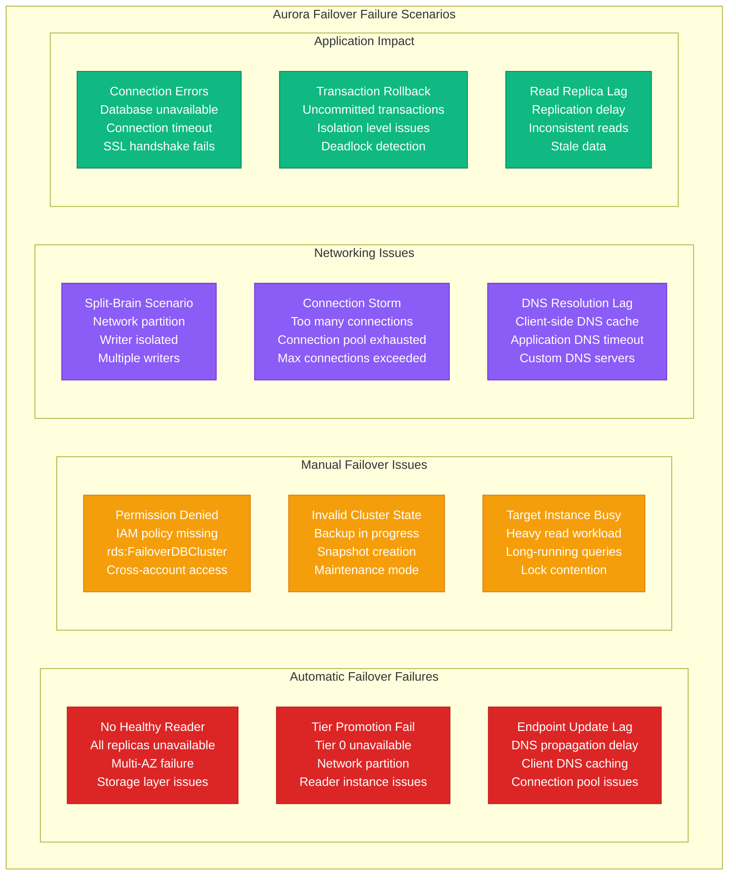
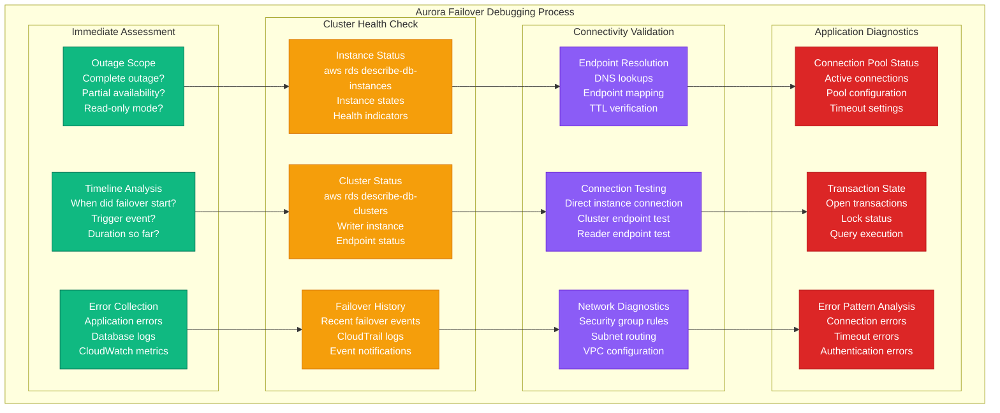

# Aurora Failover Debugging

## Overview

Aurora failover failures cause critical database outages affecting application availability and data consistency. These incidents represent 35% of AWS RDS-related problems, manifesting as failed automatic failover, split-brain scenarios, and connection disruptions. This guide provides systematic troubleshooting for Aurora cluster failover issues and recovery procedures.

## Aurora Failover Architecture

```mermaid
graph TB
    subgraph AuroraFailoverArch[Aurora Failover Architecture]
        subgraph ClusterTopology[Aurora Cluster Topology]
            WRITER[Writer Instance<br/>db.r6g.2xlarge<br/>Primary endpoint<br/>Read/write operations]
            READER1[Reader Instance 1<br/>db.r6g.large<br/>Failover tier 0<br/>Same AZ as writer]
            READER2[Reader Instance 2<br/>db.r6g.large<br/>Failover tier 1<br/>Different AZ]
            READER3[Reader Instance 3<br/>db.r6g.large<br/>Failover tier 15<br/>Cross-region replica]
        end

        subgraph EndpointManagement[Endpoint Management]
            CLUSTER_ENDPOINT[Cluster Endpoint<br/>aurora-cluster.cluster-xyz.us-east-1.rds.amazonaws.com<br/>Points to writer<br/>Automatic failover]
            READER_ENDPOINT[Reader Endpoint<br/>aurora-cluster.cluster-ro-xyz.us-east-1.rds.amazonaws.com<br/>Load balanced reads<br/>Health-based routing]
            INSTANCE_ENDPOINTS[Instance Endpoints<br/>aurora-instance-1.xyz.us-east-1.rds.amazonaws.com<br/>Direct instance access<br/>Connection pooling]
        end

        subgraph SharedStorage[Aurora Shared Storage]
            STORAGE_LAYER[Shared Storage Layer<br/>6 copies across 3 AZs<br/>Automatic replication<br/>Self-healing]
            TRANSACTION_LOG[Transaction Log<br/>Redo log streaming<br/>Continuous backup<br/>Point-in-time recovery]
            BACKUP_CONTINUOUS[Continuous Backup<br/>Automatic backups<br/>35-day retention<br/>No performance impact]
        end

        subgraph FailoverMechanism[Failover Mechanism]
            HEALTH_MONITORING[Health Monitoring<br/>Instance health checks<br/>Network connectivity<br/>Database responsiveness]
            FAILOVER_TRIGGER[Failover Trigger<br/>Writer failure detection<br/>Manual failover<br/>Maintenance failover]
            PROMOTION_PROCESS[Promotion Process<br/>Reader to writer<br/>Endpoint update<br/>Transaction replay]
        end
    end

    WRITER --> READER1
    WRITER --> READER2
    WRITER --> READER3

    CLUSTER_ENDPOINT --> WRITER
    READER_ENDPOINT --> READER1
    READER_ENDPOINT --> READER2
    INSTANCE_ENDPOINTS --> READER3

    WRITER --> STORAGE_LAYER
    READER1 --> STORAGE_LAYER
    READER2 --> STORAGE_LAYER
    READER3 --> TRANSACTION_LOG

    STORAGE_LAYER --> BACKUP_CONTINUOUS

    HEALTH_MONITORING --> FAILOVER_TRIGGER
    FAILOVER_TRIGGER --> PROMOTION_PROCESS
    PROMOTION_PROCESS --> CLUSTER_ENDPOINT

    classDef clusterStyle fill:#10B981,stroke:#047857,color:#fff
    classDef endpointStyle fill:#F59E0B,stroke:#D97706,color:#fff
    classDef storageStyle fill:#8B5CF6,stroke:#6D28D9,color:#fff
    classDef failoverStyle fill:#DC2626,stroke:#B91C1C,color:#fff

    class WRITER,READER1,READER2,READER3 clusterStyle
    class CLUSTER_ENDPOINT,READER_ENDPOINT,INSTANCE_ENDPOINTS endpointStyle
    class STORAGE_LAYER,TRANSACTION_LOG,BACKUP_CONTINUOUS storageStyle
    class HEALTH_MONITORING,FAILOVER_TRIGGER,PROMOTION_PROCESS failoverStyle
```



## Failover Failure Scenarios



## Systematic Debugging Process



## 3 AM Debugging Commands

### Immediate Cluster Status Check
```bash
# Check cluster overall status
aws rds describe-db-clusters --db-cluster-identifier aurora-production

# Check all instances in cluster
aws rds describe-db-instances \
  --filters "Name=db-cluster-id,Values=aurora-production" \
  --query 'DBInstances[*].[DBInstanceIdentifier,DBInstanceStatus,AvailabilityZone,Engine]' \
  --output table

# Check current writer instance
aws rds describe-db-clusters --db-cluster-identifier aurora-production \
  --query 'DBClusters[0].[DBClusterIdentifier,Status,DatabaseName,Endpoint,ReaderEndpoint]' \
  --output table

# Check failover priority
aws rds describe-db-instances \
  --filters "Name=db-cluster-id,Values=aurora-production" \
  --query 'DBInstances[*].[DBInstanceIdentifier,PromotionTier,DBInstanceStatus]' \
  --output table
```

### Connectivity and DNS Testing
```bash
# Test cluster endpoint resolution
nslookup aurora-production.cluster-xyz.us-east-1.rds.amazonaws.com
dig aurora-production.cluster-xyz.us-east-1.rds.amazonaws.com

# Test reader endpoint resolution
nslookup aurora-production.cluster-ro-xyz.us-east-1.rds.amazonaws.com

# Test database connectivity
mysql -h aurora-production.cluster-xyz.us-east-1.rds.amazonaws.com \
  -u admin -p -e "SELECT @@hostname, @@read_only;"

# Test specific instance connection
mysql -h aurora-instance-1.xyz.us-east-1.rds.amazonaws.com \
  -u admin -p -e "SELECT @@hostname, @@read_only;"

# Check connection from application server
telnet aurora-production.cluster-xyz.us-east-1.rds.amazonaws.com 3306
```

### Recent Events and Logs
```bash
# Check recent RDS events
aws rds describe-events \
  --source-identifier aurora-production \
  --source-type db-cluster \
  --start-time $(date -u -d '2 hours ago' +%Y-%m-%dT%H:%M:%S) \
  --query 'Events[*].[Date,Message]' \
  --output table

# Check CloudTrail for failover events
aws logs filter-log-events \
  --log-group-name CloudTrail/RDSEvents \
  --start-time $(date -d '2 hours ago' +%s)000 \
  --filter-pattern "FailoverDBCluster"

# Check Aurora slow query log (if enabled)
aws rds describe-db-log-files \
  --db-instance-identifier aurora-instance-1 \
  --filename-contains slowquery

# Download and check error log
aws rds download-db-log-file-portion \
  --db-instance-identifier aurora-instance-1 \
  --log-file-name error/mysql-error.log \
  --starting-token 0 --output text
```

### Performance and Metrics
```bash
# Check CloudWatch metrics
aws cloudwatch get-metric-statistics \
  --namespace AWS/RDS \
  --metric-name DatabaseConnections \
  --dimensions Name=DBClusterIdentifier,Value=aurora-production \
  --start-time $(date -u -d '1 hour ago' +%Y-%m-%dT%H:%M:%S) \
  --end-time $(date -u +%Y-%m-%dT%H:%M:%S) \
  --period 300 \
  --statistics Maximum

# Check CPU utilization
aws cloudwatch get-metric-statistics \
  --namespace AWS/RDS \
  --metric-name CPUUtilization \
  --dimensions Name=DBInstanceIdentifier,Value=aurora-instance-1 \
  --start-time $(date -u -d '1 hour ago' +%Y-%m-%dT%H:%M:%S) \
  --end-time $(date -u +%Y-%m-%dT%H:%M:%S) \
  --period 300 \
  --statistics Average

# Check read replica lag
aws cloudwatch get-metric-statistics \
  --namespace AWS/RDS \
  --metric-name AuroraReplicaLag \
  --dimensions Name=DBInstanceIdentifier,Value=aurora-replica-1 \
  --start-time $(date -u -d '1 hour ago' +%Y-%m-%dT%H:%M:%S) \
  --end-time $(date -u +%Y-%m-%dT%H:%M:%S) \
  --period 300 \
  --statistics Maximum
```

## Common Issues and Solutions

### Issue 1: Failed Automatic Failover

**Symptoms:**
- Writer instance shows as "failed"
- No automatic promotion of reader
- Applications unable to connect
- Cluster endpoint not responding

**Debugging Steps:**
```bash
# Check if any readers are available for promotion
aws rds describe-db-instances \
  --filters "Name=db-cluster-id,Values=aurora-production" \
  --query 'DBInstances[?DBInstanceStatus==`available`].[DBInstanceIdentifier,PromotionTier,AvailabilityZone]'

# Check cluster status details
aws rds describe-db-clusters --db-cluster-identifier aurora-production \
  --query 'DBClusters[0].[Status,DatabaseName,Engine,EngineMode,MultiAZ]'

# Check for any ongoing maintenance
aws rds describe-pending-maintenance-actions \
  --resource-identifier arn:aws:rds:us-east-1:123456789012:cluster:aurora-production

# Check subnet group and security groups
aws rds describe-db-clusters --db-cluster-identifier aurora-production \
  --query 'DBClusters[0].[DBSubnetGroup,VpcSecurityGroups]'
```

**Common Causes:**
- All reader instances in same AZ as failed writer
- Reader instances also unhealthy
- Network partition affecting multiple AZs
- Aurora storage layer issues

**Solution:**
```bash
# Manual failover to specific instance
aws rds failover-db-cluster \
  --db-cluster-identifier aurora-production \
  --target-db-instance-identifier aurora-reader-2

# If no healthy readers, restore from backup
aws rds restore-db-cluster-from-snapshot \
  --db-cluster-identifier aurora-production-restored \
  --snapshot-identifier aurora-production-final-snapshot

# Create new reader in different AZ for future resilience
aws rds create-db-instance \
  --db-instance-identifier aurora-reader-az-c \
  --db-instance-class db.r6g.large \
  --engine aurora-mysql \
  --db-cluster-identifier aurora-production \
  --availability-zone us-east-1c
```

### Issue 2: DNS/Endpoint Resolution Delays

**Symptoms:**
- Cluster endpoint points to failed instance
- Applications get "connection refused"
- DNS resolution returns old IP addresses
- Intermittent connectivity issues

**Debugging Steps:**
```bash
# Check current endpoint resolution
dig aurora-production.cluster-xyz.us-east-1.rds.amazonaws.com
nslookup aurora-production.cluster-xyz.us-east-1.rds.amazonaws.com

# Compare with instance endpoints
aws rds describe-db-instances \
  --filters "Name=db-cluster-id,Values=aurora-production" \
  --query 'DBInstances[*].[DBInstanceIdentifier,Endpoint.Address,DBInstanceStatus]'

# Check TTL and DNS caching
dig +trace aurora-production.cluster-xyz.us-east-1.rds.amazonaws.com

# Test from different DNS servers
dig @8.8.8.8 aurora-production.cluster-xyz.us-east-1.rds.amazonaws.com
dig @1.1.1.1 aurora-production.cluster-xyz.us-east-1.rds.amazonaws.com
```

**Common Causes:**
- DNS TTL caching (60 seconds for Aurora)
- Application DNS caching
- Load balancer health check delays
- Network routing issues

**Solution:**
```bash
# Clear local DNS cache
sudo systemctl flush-dns  # Ubuntu/Debian
sudo dscacheutil -flushcache  # macOS

# Use instance endpoints temporarily
mysql -h aurora-instance-2.xyz.us-east-1.rds.amazonaws.com -u admin -p

# Configure application connection string with shorter DNS cache
# connection_string = "aurora-production.cluster-xyz.us-east-1.rds.amazonaws.com?dns_cache_timeout=30"

# Check and restart application connection pools
sudo systemctl restart your-application
```

### Issue 3: Connection Pool Exhaustion

**Symptoms:**
- "Too many connections" errors
- Connection timeouts during failover
- Applications hanging on database calls
- New connections rejected

**Debugging Steps:**
```bash
# Check current connection count
mysql -h aurora-production.cluster-xyz.us-east-1.rds.amazonaws.com \
  -u admin -p -e "SHOW GLOBAL STATUS LIKE 'Threads_connected';"

# Check max connections setting
mysql -h aurora-production.cluster-xyz.us-east-1.rds.amazonaws.com \
  -u admin -p -e "SHOW VARIABLES LIKE 'max_connections';"

# Check connection details
mysql -h aurora-production.cluster-xyz.us-east-1.rds.amazonaws.com \
  -u admin -p -e "SELECT * FROM information_schema.processlist WHERE command != 'Sleep';"

# Check CloudWatch metrics
aws cloudwatch get-metric-statistics \
  --namespace AWS/RDS \
  --metric-name DatabaseConnections \
  --dimensions Name=DBClusterIdentifier,Value=aurora-production \
  --start-time $(date -u -d '1 hour ago' +%Y-%m-%dT%H:%M:%S) \
  --end-time $(date -u +%Y-%m-%dT%H:%M:%S) \
  --period 300 \
  --statistics Maximum
```

**Solution:**
```bash
# Kill idle connections
mysql -h aurora-production.cluster-xyz.us-east-1.rds.amazonaws.com \
  -u admin -p -e "CALL mysql.rds_kill_query(connection_id);"

# Adjust max_connections parameter
aws rds modify-db-cluster-parameter-group \
  --db-cluster-parameter-group-name aurora-mysql-parameters \
  --parameters ParameterName=max_connections,ParameterValue=2000,ApplyMethod=immediate

# Configure application connection pool properly
# max_pool_size = min(max_connections / number_of_app_instances, 20)
# connection_timeout = 30 seconds
# idle_timeout = 10 minutes
```

### Issue 4: Split-Brain During Network Partition

**Symptoms:**
- Multiple writer instances reported
- Data inconsistency
- Applications see different data
- Conflicting transaction logs

**Emergency Assessment:**
```bash
# Check which instance is currently the writer
aws rds describe-db-clusters --db-cluster-identifier aurora-production \
  --query 'DBClusters[0].DBClusterMembers[?IsClusterWriter==`true`]'

# Check read_only status on all instances
for instance in aurora-instance-1 aurora-instance-2 aurora-instance-3; do
  echo "=== $instance ==="
  mysql -h $instance.xyz.us-east-1.rds.amazonaws.com \
    -u admin -p -e "SELECT @@hostname, @@read_only, @@server_id;" 2>/dev/null || echo "Connection failed"
done

# Check for replication lag
mysql -h aurora-production.cluster-ro-xyz.us-east-1.rds.amazonaws.com \
  -u admin -p -e "SHOW SLAVE STATUS\G;"
```

**Emergency Recovery:**
```bash
# Identify the correct writer based on most recent transactions
# Connect to each instance and check:
mysql -h $instance -u admin -p -e "SELECT MAX(created_at) FROM your_audit_table;"

# Manually promote the instance with latest data
aws rds failover-db-cluster \
  --db-cluster-identifier aurora-production \
  --target-db-instance-identifier aurora-instance-with-latest-data

# Restart other instances to reset their state
aws rds reboot-db-instance --db-instance-identifier aurora-instance-old-writer
```

## Monitoring and Prevention

### Automated Failover Monitoring
```python
#!/usr/bin/env python3
# aurora-failover-monitor.py

import boto3
import json
from datetime import datetime, timedelta

def check_aurora_cluster_health(cluster_id):
    """Monitor Aurora cluster health and failover readiness"""
    rds = boto3.client('rds')
    cloudwatch = boto3.client('cloudwatch')

    # Get cluster details
    cluster = rds.describe_db_clusters(DBClusterIdentifier=cluster_id)['DBClusters'][0]
    instances = rds.describe_db_instances(
        Filters=[{'Name': 'db-cluster-id', 'Values': [cluster_id]}]
    )['DBInstances']

    health_report = {
        'cluster_id': cluster_id,
        'cluster_status': cluster['Status'],
        'writer_instance': None,
        'reader_instances': [],
        'availability_zones': set(),
        'failover_ready': True,
        'issues': []
    }

    # Analyze instances
    for instance in instances:
        instance_info = {
            'id': instance['DBInstanceIdentifier'],
            'status': instance['DBInstanceStatus'],
            'az': instance['AvailabilityZone'],
            'tier': instance.get('PromotionTier', 15),
            'class': instance['DBInstanceClass']
        }

        health_report['availability_zones'].add(instance['AvailabilityZone'])

        # Find writer
        if any(member['IsClusterWriter'] for member in cluster['DBClusterMembers']
               if member['DBInstanceIdentifier'] == instance['DBInstanceIdentifier']):
            health_report['writer_instance'] = instance_info
        else:
            health_report['reader_instances'].append(instance_info)

        # Check instance health
        if instance['DBInstanceStatus'] != 'available':
            health_report['issues'].append(f"Instance {instance['DBInstanceIdentifier']} is {instance['DBInstanceStatus']}")
            if instance_info['tier'] <= 1:  # High priority failover target
                health_report['failover_ready'] = False

    # Check AZ distribution
    if len(health_report['availability_zones']) < 2:
        health_report['issues'].append("All instances in single AZ - no failover protection")
        health_report['failover_ready'] = False

    # Check if we have healthy readers
    healthy_readers = [r for r in health_report['reader_instances'] if r['status'] == 'available']
    if not healthy_readers:
        health_report['issues'].append("No healthy reader instances for failover")
        health_report['failover_ready'] = False

    # Check recent connection metrics
    end_time = datetime.utcnow()
    start_time = end_time - timedelta(minutes=15)

    connection_metrics = cloudwatch.get_metric_statistics(
        Namespace='AWS/RDS',
        MetricName='DatabaseConnections',
        Dimensions=[{'Name': 'DBClusterIdentifier', 'Value': cluster_id}],
        StartTime=start_time,
        EndTime=end_time,
        Period=300,
        Statistics=['Maximum']
    )

    if connection_metrics['Datapoints']:
        max_connections = max(dp['Maximum'] for dp in connection_metrics['Datapoints'])
        if max_connections > 500:  # Adjust threshold based on your setup
            health_report['issues'].append(f"High connection count: {max_connections}")

    return health_report

def send_alert(health_report):
    """Send alert if issues detected"""
    if not health_report['failover_ready'] or health_report['issues']:
        message = f"🚨 Aurora Cluster Alert: {health_report['cluster_id']}\n"
        message += f"Failover Ready: {health_report['failover_ready']}\n"
        message += f"Issues: {', '.join(health_report['issues'])}"

        # Send to your alerting system
        print(message)
        # implement_slack_notification(message)

if __name__ == "__main__":
    CLUSTER_ID = "aurora-production"
    health_report = check_aurora_cluster_health(CLUSTER_ID)
    send_alert(health_report)
    print(json.dumps(health_report, indent=2, default=str))
```

### Connection Pool Configuration
```python
# Python application configuration for Aurora failover
import pymysql
from sqlalchemy import create_engine
from sqlalchemy.pool import QueuePool

def create_aurora_engine(cluster_endpoint, user, password, database):
    """Create SQLAlchemy engine optimized for Aurora failover"""

    connection_string = f"mysql+pymysql://{user}:{password}@{cluster_endpoint}/{database}"

    engine = create_engine(
        connection_string,
        poolclass=QueuePool,
        pool_size=10,  # Adjust based on your needs
        max_overflow=20,
        pool_pre_ping=True,  # Validate connections before use
        pool_recycle=3600,   # Recycle connections every hour
        connect_args={
            'connect_timeout': 10,
            'read_timeout': 30,
            'write_timeout': 30,
            'autocommit': True,
        }
    )

    return engine

# Example usage with retry logic
import time
from sqlalchemy.exc import OperationalError

def execute_with_retry(engine, query, max_retries=3):
    """Execute query with failover retry logic"""
    for attempt in range(max_retries):
        try:
            with engine.connect() as conn:
                result = conn.execute(query)
                return result.fetchall()
        except OperationalError as e:
            if attempt < max_retries - 1:
                print(f"Database error, retrying in {2 ** attempt} seconds: {e}")
                time.sleep(2 ** attempt)  # Exponential backoff
            else:
                raise
```

## Best Practices

### 1. Cluster Configuration for High Availability
```bash
# Create cluster with multi-AZ readers
aws rds create-db-cluster \
  --db-cluster-identifier aurora-production \
  --engine aurora-mysql \
  --engine-version 8.0.mysql_aurora.3.02.0 \
  --master-username admin \
  --master-user-password your-password \
  --db-subnet-group-name aurora-subnet-group \
  --vpc-security-group-ids sg-12345678 \
  --backup-retention-period 7 \
  --preferred-backup-window "03:00-04:00" \
  --preferred-maintenance-window "sun:04:00-sun:05:00" \
  --enable-cloudwatch-logs-exports error,general,slow-query

# Create writer instance
aws rds create-db-instance \
  --db-instance-identifier aurora-writer \
  --db-instance-class db.r6g.2xlarge \
  --engine aurora-mysql \
  --db-cluster-identifier aurora-production \
  --availability-zone us-east-1a \
  --promotion-tier 0

# Create readers in different AZs with different tiers
aws rds create-db-instance \
  --db-instance-identifier aurora-reader-1 \
  --db-instance-class db.r6g.large \
  --engine aurora-mysql \
  --db-cluster-identifier aurora-production \
  --availability-zone us-east-1b \
  --promotion-tier 0

aws rds create-db-instance \
  --db-instance-identifier aurora-reader-2 \
  --db-instance-class db.r6g.large \
  --engine aurora-mysql \
  --db-cluster-identifier aurora-production \
  --availability-zone us-east-1c \
  --promotion-tier 1
```

### 2. Application Connection Best Practices
```yaml
# Application configuration for Aurora failover
database:
  cluster_endpoint: "aurora-production.cluster-xyz.us-east-1.rds.amazonaws.com"
  reader_endpoint: "aurora-production.cluster-ro-xyz.us-east-1.rds.amazonaws.com"

  connection_pool:
    min_size: 5
    max_size: 20
    timeout: 30
    retry_attempts: 3
    retry_delay: 5

  failover:
    health_check_interval: 10
    connection_validation: true
    dns_cache_timeout: 60
```

### 3. Monitoring and Alerting Setup
```yaml
# CloudWatch alarms for Aurora failover monitoring
Resources:
  AuroraWriterFailureAlarm:
    Type: AWS::CloudWatch::Alarm
    Properties:
      AlarmName: Aurora-Writer-Failure
      MetricName: DatabaseConnections
      Namespace: AWS/RDS
      Dimensions:
        - Name: DBClusterIdentifier
          Value: !Ref AuroraCluster
      Statistic: Maximum
      Period: 60
      EvaluationPeriods: 2
      Threshold: 0
      ComparisonOperator: LessThanOrEqualToThreshold
      AlarmActions:
        - !Ref SNSTopicArn

  AuroraReplicaLagAlarm:
    Type: AWS::CloudWatch::Alarm
    Properties:
      AlarmName: Aurora-Replica-Lag-High
      MetricName: AuroraReplicaLag
      Namespace: AWS/RDS
      Statistic: Maximum
      Period: 300
      EvaluationPeriods: 2
      Threshold: 1000  # 1 second
      ComparisonOperator: GreaterThanThreshold
```

## Quick Reference

### Essential Commands
```bash
# Check cluster status
aws rds describe-db-clusters --db-cluster-identifier aurora-production

# Manual failover
aws rds failover-db-cluster --db-cluster-identifier aurora-production --target-db-instance-identifier aurora-reader-1

# Test connectivity
mysql -h aurora-production.cluster-xyz.us-east-1.rds.amazonaws.com -u admin -p

# Check instance status
aws rds describe-db-instances --filters "Name=db-cluster-id,Values=aurora-production"
```

### Emergency Checklist
1. ✅ Check cluster and instance status
2. ✅ Verify reader instances are healthy
3. ✅ Test endpoint DNS resolution
4. ✅ Check application connection pools
5. ✅ Review recent RDS events
6. ✅ Manual failover if automatic failed
7. ✅ Monitor post-failover performance

*Keep this guide accessible during Aurora database outages for systematic troubleshooting.*