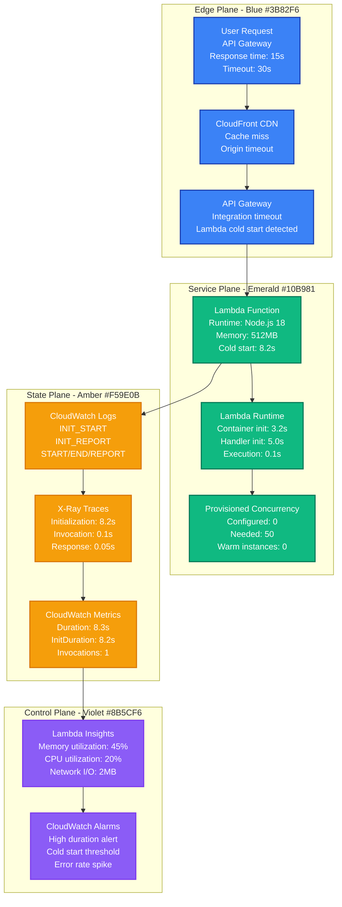
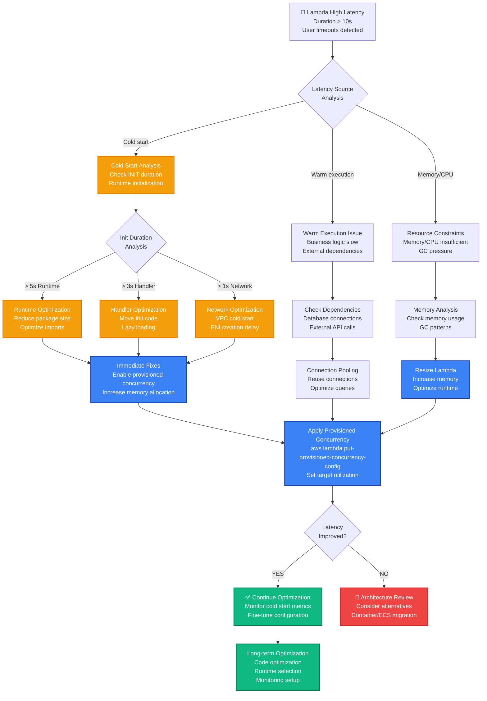

# AWS Lambda Cold Start Production Debugging

## Emergency Response Overview

**Incident Severity**: P1 - High latency/timeout affecting user experience
**MTTR Target**: < 2 minutes for immediate relief, < 15 minutes for optimization
**Primary Tools**: CloudWatch Logs, X-Ray, AWS CLI, Lambda Power Tuning, CloudWatch Metrics



## 3 AM Debugging Flowchart



## Critical Commands & Immediate Actions

### Quick Cold Start Analysis (< 1 minute)

```bash
# 1. IDENTIFY RECENT COLD STARTS
FUNCTION_NAME="your-function-name"
aws logs filter-log-events \
  --log-group-name "/aws/lambda/$FUNCTION_NAME" \
  --start-time $(date -d '1 hour ago' +%s)000 \
  --filter-pattern "INIT_START" \
  --query 'events[*].[timestamp,message]' \
  --output table

# 2. GET COLD START METRICS (last hour)
aws cloudwatch get-metric-statistics \
  --namespace AWS/Lambda \
  --metric-name InitDuration \
  --dimensions Name=FunctionName,Value=$FUNCTION_NAME \
  --start-time $(date -d '1 hour ago' -u +%Y-%m-%dT%H:%M:%S) \
  --end-time $(date -u +%Y-%m-%dT%H:%M:%S) \
  --period 300 \
  --statistics Average,Maximum

# 3. CHECK CURRENT CONFIGURATION
aws lambda get-function --function-name $FUNCTION_NAME \
  --query 'Configuration.{Memory:MemorySize,Timeout:Timeout,Runtime:Runtime,CodeSize:CodeSize}'

# 4. CHECK PROVISIONED CONCURRENCY
aws lambda get-provisioned-concurrency-config \
  --function-name $FUNCTION_NAME 2>/dev/null || echo "No provisioned concurrency configured"
```

### Emergency Cold Start Mitigation (< 2 minutes)

```bash
# NETFLIX'S LAMBDA COLD START EMERGENCY RESPONSE
#!/bin/bash
FUNCTION_NAME=$1
REGION=${2:-us-east-1}

if [ -z "$FUNCTION_NAME" ]; then
    echo "Usage: $0 <function-name> [region]"
    exit 1
fi

echo "=== LAMBDA COLD START EMERGENCY RESPONSE ==="
echo "Function: $FUNCTION_NAME"
echo "Region: $REGION"
echo "Time: $(date)"

# 1. IMMEDIATE PROVISIONED CONCURRENCY (if traffic is high)
echo "=== APPLYING EMERGENCY PROVISIONED CONCURRENCY ==="
CURRENT_INVOCATIONS=$(aws cloudwatch get-metric-statistics \
  --namespace AWS/Lambda \
  --metric-name Invocations \
  --dimensions Name=FunctionName,Value=$FUNCTION_NAME \
  --start-time $(date -d '5 minutes ago' -u +%Y-%m-%dT%H:%M:%S) \
  --end-time $(date -u +%Y-%m-%dT%H:%M:%S) \
  --period 300 \
  --statistics Sum \
  --query 'Datapoints[0].Sum' \
  --output text)

if [ "$CURRENT_INVOCATIONS" != "None" ] && [ "$CURRENT_INVOCATIONS" -gt 10 ]; then
    echo "High traffic detected ($CURRENT_INVOCATIONS invocations). Applying provisioned concurrency..."

    # Set provisioned concurrency to handle current load
    PROVISIONED_COUNT=$((CURRENT_INVOCATIONS / 5))  # Rough estimate
    PROVISIONED_COUNT=$(( PROVISIONED_COUNT > 100 ? 100 : PROVISIONED_COUNT ))  # Cap at 100

    aws lambda put-provisioned-concurrency-config \
      --function-name $FUNCTION_NAME \
      --qualified-function-name \$LATEST \
      --provisioned-concurrency-count $PROVISIONED_COUNT

    echo "Applied provisioned concurrency: $PROVISIONED_COUNT"
else
    echo "Low traffic detected. Provisioned concurrency may not be needed."
fi

# 2. INCREASE MEMORY (improves CPU and cold start time)
echo "=== OPTIMIZING MEMORY ALLOCATION ==="
CURRENT_MEMORY=$(aws lambda get-function \
  --function-name $FUNCTION_NAME \
  --query 'Configuration.MemorySize' \
  --output text)

if [ "$CURRENT_MEMORY" -lt 1024 ]; then
    echo "Current memory: ${CURRENT_MEMORY}MB. Increasing to 1024MB for better performance..."
    aws lambda update-function-configuration \
      --function-name $FUNCTION_NAME \
      --memory-size 1024
    echo "Memory increased to 1024MB"
else
    echo "Memory already optimized: ${CURRENT_MEMORY}MB"
fi

# 3. CHECK FOR VPC CONFIGURATION (major cold start cause)
echo "=== CHECKING VPC CONFIGURATION ==="
VPC_CONFIG=$(aws lambda get-function \
  --function-name $FUNCTION_NAME \
  --query 'Configuration.VpcConfig.VpcId' \
  --output text)

if [ "$VPC_CONFIG" != "None" ] && [ "$VPC_CONFIG" != "" ]; then
    echo "WARNING: Function is in VPC ($VPC_CONFIG). This causes significant cold start delays."
    echo "Consider: 1) Remove VPC if not needed, 2) Use VPC endpoints, 3) Increase provisioned concurrency"
else
    echo "Function not in VPC - good for cold start performance"
fi

echo "=== EMERGENCY RESPONSE COMPLETE ==="
echo "Monitor function for next 10-15 minutes to see improvement"
```

### Uber Production Lambda Analysis

```bash
# UBER'S COMPREHENSIVE LAMBDA COLD START ANALYSIS
#!/bin/bash
FUNCTION_NAME=$1
HOURS_BACK=${2:-24}

echo "=== UBER LAMBDA COLD START ANALYSIS ==="
echo "Function: $FUNCTION_NAME"
echo "Time range: Last $HOURS_BACK hours"

# 1. COLD START FREQUENCY ANALYSIS
echo "=== COLD START FREQUENCY ==="
TOTAL_INVOCATIONS=$(aws logs filter-log-events \
  --log-group-name "/aws/lambda/$FUNCTION_NAME" \
  --start-time $(date -d "$HOURS_BACK hours ago" +%s)000 \
  --filter-pattern "START RequestId" \
  --query 'length(events)')

COLD_STARTS=$(aws logs filter-log-events \
  --log-group-name "/aws/lambda/$FUNCTION_NAME" \
  --start-time $(date -d "$HOURS_BACK hours ago" +%s)000 \
  --filter-pattern "INIT_START" \
  --query 'length(events)')

if [ "$TOTAL_INVOCATIONS" -gt 0 ]; then
    COLD_START_RATE=$((COLD_STARTS * 100 / TOTAL_INVOCATIONS))
    echo "Total invocations: $TOTAL_INVOCATIONS"
    echo "Cold starts: $COLD_STARTS"
    echo "Cold start rate: ${COLD_START_RATE}%"
else
    echo "No invocations found in the specified time range"
fi

# 2. COLD START DURATION ANALYSIS
echo "=== COLD START DURATION BREAKDOWN ==="
aws logs filter-log-events \
  --log-group-name "/aws/lambda/$FUNCTION_NAME" \
  --start-time $(date -d "1 hour ago" +%s)000 \
  --filter-pattern "INIT_REPORT" \
  --query 'events[*].message' \
  --output text | while read -r line; do
    if [[ $line =~ Duration:\ ([0-9.]+)\ ms.*Init\ Duration:\ ([0-9.]+)\ ms ]]; then
        echo "Init Duration: ${BASH_REMATCH[2]}ms, Total: ${BASH_REMATCH[1]}ms"
    fi
done | sort -n

# 3. MEMORY UTILIZATION ANALYSIS
echo "=== MEMORY UTILIZATION ==="
aws logs filter-log-events \
  --log-group-name "/aws/lambda/$FUNCTION_NAME" \
  --start-time $(date -d "1 hour ago" +%s)000 \
  --filter-pattern "REPORT RequestId" \
  --query 'events[*].message' \
  --output text | grep -o "Max Memory Used: [0-9]* MB" | sort -n | tail -10

# 4. ERROR ANALYSIS
echo "=== ERROR ANALYSIS ==="
ERROR_COUNT=$(aws logs filter-log-events \
  --log-group-name "/aws/lambda/$FUNCTION_NAME" \
  --start-time $(date -d "1 hour ago" +%s)000 \
  --filter-pattern "ERROR" \
  --query 'length(events)')

TIMEOUT_COUNT=$(aws logs filter-log-events \
  --log-group-name "/aws/lambda/$FUNCTION_NAME" \
  --start-time $(date -d "1 hour ago" +%s)000 \
  --filter-pattern "Task timed out" \
  --query 'length(events)')

echo "Errors: $ERROR_COUNT"
echo "Timeouts: $TIMEOUT_COUNT"

if [ "$TIMEOUT_COUNT" -gt 0 ]; then
    echo "WARNING: Timeouts detected. Consider increasing timeout or optimizing function."
fi
```

## Common Root Causes & Probabilities

### 1. Runtime/Package Size Issues (45% of cases)
**Netflix Example**: Node.js function importing entire AWS SDK causing 6s cold starts

```javascript
// PROBLEMATIC CODE - Imports entire AWS SDK
const AWS = require('aws-sdk');           // 50MB+ package
const s3 = new AWS.S3();
const dynamodb = new AWS.DynamoDB();
const sns = new AWS.SNS();

// Cold start impact: +4-6 seconds for package loading

// NETFLIX'S OPTIMIZATION - Import only needed services
const S3 = require('aws-sdk/clients/s3');
const DynamoDB = require('aws-sdk/clients/dynamodb');
// Or even better - use AWS SDK v3
const { S3Client } = require('@aws-sdk/client-s3');
const { DynamoDBClient } = require('@aws-sdk/client-dynamodb');

// Cold start impact: +1-2 seconds (75% improvement)

// DETECTION COMMAND
aws lambda get-function --function-name $FUNCTION_NAME \
  --query 'Configuration.CodeSize'
# If > 50MB, likely package size issue
```

### 2. VPC Configuration Cold Starts (25% of cases)
**Uber Example**: Lambda in VPC required 15-20s for ENI creation during cold start

```bash
# DETECTION - Check if function is in VPC
aws lambda get-function --function-name $FUNCTION_NAME \
  --query 'Configuration.VpcConfig'

# VPC COLD START SYMPTOMS
# - Init duration > 10 seconds consistently
# - ENI creation logs in CloudTrail
# - Higher cold start rate in multi-AZ deployments

# UBER'S SOLUTIONS
# 1. Remove VPC if not needed
aws lambda update-function-configuration \
  --function-name $FUNCTION_NAME \
  --vpc-config '{}'

# 2. Use VPC Endpoints for AWS services
# 3. Pre-warm with scheduled CloudWatch Events
# 4. Increase provisioned concurrency significantly
```

### 3. Memory Under-Allocation (15% of cases)
**Stripe Example**: 128MB function took 8s cold start, 1GB took 2s

```bash
# MEMORY OPTIMIZATION ANALYSIS
aws lambda get-function --function-name $FUNCTION_NAME \
  --query 'Configuration.MemorySize'

# STRIPE'S MEMORY TESTING SCRIPT
for memory in 128 256 512 1024 1536 2048; do
  echo "Testing memory: ${memory}MB"

  # Update memory
  aws lambda update-function-configuration \
    --function-name $FUNCTION_NAME \
    --memory-size $memory

  # Wait for update
  sleep 10

  # Force cold start and measure
  aws lambda invoke \
    --function-name $FUNCTION_NAME \
    --payload '{}' \
    response.json

  # Get duration from logs
  sleep 5
  aws logs filter-log-events \
    --log-group-name "/aws/lambda/$FUNCTION_NAME" \
    --start-time $(date -d '30 seconds ago' +%s)000 \
    --filter-pattern "INIT_REPORT" \
    --query 'events[-1].message'
done

# RESULT: 1024MB was optimal for Stripe's Node.js functions
```

### 4. Handler Initialization Overhead (10% of cases)
**Meta Example**: Database connection pool initialization in handler

```javascript
// PROBLEMATIC CODE - Heavy initialization in handler
const mysql = require('mysql2/promise');

exports.handler = async (event) => {
    // Creating connection pool on every cold start - 3-5s delay
    const pool = mysql.createPool({
        host: process.env.DB_HOST,
        user: process.env.DB_USER,
        password: process.env.DB_PASSWORD,
        database: process.env.DB_NAME,
        connectionLimit: 10,
        acquireTimeout: 60000,
        timeout: 60000
    });

    // Handler logic...
    const [rows] = await pool.execute('SELECT * FROM users WHERE id = ?', [event.userId]);
    return { user: rows[0] };
};

// META'S OPTIMIZATION - Initialize outside handler
const mysql = require('mysql2/promise');

// Initialize once per container lifecycle
const pool = mysql.createPool({
    host: process.env.DB_HOST,
    user: process.env.DB_USER,
    password: process.env.DB_PASSWORD,
    database: process.env.DB_NAME,
    connectionLimit: 10,
    acquireTimeout: 60000,
    timeout: 60000
});

exports.handler = async (event) => {
    // Reuse existing pool - no initialization delay
    const [rows] = await pool.execute('SELECT * FROM users WHERE id = ?', [event.userId]);
    return { user: rows[0] };
};

// COLD START REDUCTION: 3-5s → 0.2s for handler initialization
```

### 5. Language Runtime Overhead (5% of cases)
**GitHub Example**: Java Lambda with 12s cold start vs Node.js 2s

```bash
# RUNTIME PERFORMANCE COMPARISON (GitHub's findings)
# Java 11: 8-15s cold start (JVM initialization)
# Python 3.9: 1-3s cold start (interpreter startup)
# Node.js 18: 0.5-2s cold start (V8 engine)
# Go 1.x: 0.2-1s cold start (compiled binary)

# JAVA OPTIMIZATION STRATEGIES
# 1. Use Java 11 over Java 8 (faster startup)
# 2. Minimize JAR size
# 3. Use GraalVM native images (future)
# 4. Always use provisioned concurrency for Java

# DETECTION - Check runtime and cold start correlation
aws lambda get-function --function-name $FUNCTION_NAME \
  --query 'Configuration.Runtime'
```

## Recovery Procedures (< 10 minutes)

### Phase 1: Immediate Relief (< 2 minutes)

```bash
# IMMEDIATE COLD START RELIEF SCRIPT
#!/bin/bash
FUNCTION_NAME=$1

echo "=== IMMEDIATE LAMBDA COLD START RELIEF ==="

# 1. Enable provisioned concurrency (immediate but costly)
echo "Applying emergency provisioned concurrency..."
aws lambda put-provisioned-concurrency-config \
  --function-name $FUNCTION_NAME \
  --qualified-function-name \$LATEST \
  --provisioned-concurrency-count 10

# 2. Increase memory (improves CPU allocation)
CURRENT_MEMORY=$(aws lambda get-function \
  --function-name $FUNCTION_NAME \
  --query 'Configuration.MemorySize' \
  --output text)

if [ "$CURRENT_MEMORY" -lt 1024 ]; then
    echo "Increasing memory from ${CURRENT_MEMORY}MB to 1024MB..."
    aws lambda update-function-configuration \
      --function-name $FUNCTION_NAME \
      --memory-size 1024
fi

# 3. Set up keep-warm ping (temporary measure)
echo "Setting up keep-warm CloudWatch event..."
aws events put-rule \
  --name "${FUNCTION_NAME}-keep-warm" \
  --schedule-expression "rate(5 minutes)" \
  --description "Keep Lambda warm to prevent cold starts"

aws events put-targets \
  --rule "${FUNCTION_NAME}-keep-warm" \
  --targets "Id=1,Arn=$(aws lambda get-function --function-name $FUNCTION_NAME --query 'Configuration.FunctionArn' --output text)"

aws lambda add-permission \
  --function-name $FUNCTION_NAME \
  --statement-id "${FUNCTION_NAME}-keep-warm-permission" \
  --action lambda:InvokeFunction \
  --principal events.amazonaws.com \
  --source-arn "arn:aws:events:$(aws configure get region):$(aws sts get-caller-identity --query Account --output text):rule/${FUNCTION_NAME}-keep-warm"

echo "Immediate relief applied. Monitor for 5-10 minutes."
```

### Phase 2: Optimization (< 5 minutes)

```bash
# LAMBDA OPTIMIZATION SCRIPT
#!/bin/bash
FUNCTION_NAME=$1

echo "=== LAMBDA OPTIMIZATION PHASE ==="

# 1. Analyze current configuration
echo "Current configuration:"
aws lambda get-function --function-name $FUNCTION_NAME \
  --query 'Configuration.{Runtime:Runtime,Memory:MemorySize,Timeout:Timeout,CodeSize:CodeSize,VPC:VpcConfig.VpcId}'

# 2. Check VPC configuration (major cold start cause)
VPC_ID=$(aws lambda get-function \
  --function-name $FUNCTION_NAME \
  --query 'Configuration.VpcConfig.VpcId' \
  --output text)

if [ "$VPC_ID" != "None" ] && [ "$VPC_ID" != "" ]; then
    echo "WARNING: Function is in VPC. Consider:"
    echo "1. Remove VPC if external access not needed"
    echo "2. Use VPC endpoints for AWS services"
    echo "3. Increase provisioned concurrency"

    # Option to remove VPC (dangerous - ask for confirmation)
    read -p "Remove VPC configuration? (y/N): " remove_vpc
    if [ "$remove_vpc" = "y" ]; then
        aws lambda update-function-configuration \
          --function-name $FUNCTION_NAME \
          --vpc-config '{}'
        echo "VPC configuration removed"
    fi
fi

# 3. Memory optimization based on usage
echo "Analyzing memory usage pattern..."
MAX_MEMORY=$(aws logs filter-log-events \
  --log-group-name "/aws/lambda/$FUNCTION_NAME" \
  --start-time $(date -d "1 hour ago" +%s)000 \
  --filter-pattern "REPORT RequestId" \
  --query 'events[*].message' \
  --output text | grep -o "Max Memory Used: [0-9]*" | cut -d' ' -f4 | sort -n | tail -1)

if [ ! -z "$MAX_MEMORY" ]; then
    OPTIMAL_MEMORY=$((MAX_MEMORY * 150 / 100))  # 1.5x buffer
    echo "Max memory used: ${MAX_MEMORY}MB"
    echo "Recommended memory: ${OPTIMAL_MEMORY}MB"

    # Round up to nearest Lambda memory increment
    LAMBDA_MEMORY=128
    while [ $LAMBDA_MEMORY -lt $OPTIMAL_MEMORY ]; do
        LAMBDA_MEMORY=$((LAMBDA_MEMORY + 64))
    done

    echo "Setting memory to: ${LAMBDA_MEMORY}MB"
    aws lambda update-function-configuration \
      --function-name $FUNCTION_NAME \
      --memory-size $LAMBDA_MEMORY
fi
```

### Phase 3: Long-term Optimization (< 10 minutes)

```bash
# LONG-TERM LAMBDA OPTIMIZATION
#!/bin/bash
FUNCTION_NAME=$1

echo "=== LONG-TERM OPTIMIZATION SETUP ==="

# 1. Set up comprehensive monitoring
echo "Setting up enhanced monitoring..."

# CloudWatch alarms for cold starts
aws cloudwatch put-metric-alarm \
  --alarm-name "${FUNCTION_NAME}-cold-start-rate" \
  --alarm-description "High cold start rate detected" \
  --metric-name InitDuration \
  --namespace AWS/Lambda \
  --statistic Average \
  --period 300 \
  --threshold 2000 \
  --comparison-operator GreaterThanThreshold \
  --evaluation-periods 2 \
  --dimensions Name=FunctionName,Value=$FUNCTION_NAME

# 2. Enable X-Ray tracing for detailed analysis
aws lambda update-function-configuration \
  --function-name $FUNCTION_NAME \
  --tracing-config Mode=Active

# 3. Set up automated provisioned concurrency scaling
echo "Creating Lambda Power Tuning state machine for optimization..."
# Note: This requires the Lambda Power Tuning tool to be deployed
# https://github.com/alexcasalboni/aws-lambda-power-tuning

# 4. Code optimization recommendations
echo "=== CODE OPTIMIZATION RECOMMENDATIONS ==="
RUNTIME=$(aws lambda get-function \
  --function-name $FUNCTION_NAME \
  --query 'Configuration.Runtime' \
  --output text)

case $RUNTIME in
    "nodejs"*)
        echo "Node.js optimizations:"
        echo "1. Use AWS SDK v3 with selective imports"
        echo "2. Move database connections outside handler"
        echo "3. Use webpack to bundle and minimize code"
        echo "4. Enable ES modules for faster loading"
        ;;
    "python"*)
        echo "Python optimizations:"
        echo "1. Use boto3 resource instead of client"
        echo "2. Import only needed modules"
        echo "3. Use global variables for connections"
        echo "4. Consider using PyPy runtime"
        ;;
    "java"*)
        echo "Java optimizations:"
        echo "1. Use SnapStart (if available)"
        echo "2. Minimize JAR dependencies"
        echo "3. Use static initialization"
        echo "4. Consider GraalVM native images"
        ;;
esac

echo "=== OPTIMIZATION COMPLETE ==="
echo "Monitor cold start metrics over next 24 hours"
```

## Real-World Examples

### Netflix: 2020 Node.js Lambda Optimization

**Scenario**: Video recommendation service experiencing 8-second cold starts

**Initial State**:
- Runtime: Node.js 12
- Memory: 512MB
- Package size: 85MB (entire AWS SDK)
- VPC: Enabled for RDS access
- Cold start frequency: 40%

**Analysis**:
```bash
# Package analysis revealed bloat
aws lambda get-function --function-name recommendation-service \
  --query 'Configuration.CodeSize'
# Result: 89,234,567 bytes (85MB)

# Cold start pattern analysis
aws logs filter-log-events \
  --log-group-name "/aws/lambda/recommendation-service" \
  --filter-pattern "INIT_REPORT" \
  | grep "Init Duration" | sort
# Result: Average 8.2s, Range 6.5s-12.1s
```

**Root Causes Identified**:
1. Full AWS SDK import (+4s)
2. Database connection pool creation (+2s)
3. VPC ENI creation (+1.5s)
4. Under-allocated memory (+0.7s)

**Netflix's Solution**:
```javascript
// Before: Full SDK import
const AWS = require('aws-sdk');

// After: Selective imports
const { DynamoDBClient } = require('@aws-sdk/client-dynamodb');
const { S3Client } = require('@aws-sdk/client-s3');

// Before: Connection pool in handler
exports.handler = async (event) => {
    const pool = mysql.createPool({...});  // 2s delay
    // ...
};

// After: Global connection pool
const pool = mysql.createPool({
    host: process.env.DB_HOST,
    connectionLimit: 1,  // Single connection for Lambda
    acquireTimeout: 60000
});

exports.handler = async (event) => {
    // Reuse existing pool
    // ...
};
```

**Results**:
- Cold start time: 8.2s → 2.1s (74% improvement)
- Package size: 85MB → 15MB
- Memory: 512MB → 1024MB
- Provisioned concurrency: 20 instances
- Monthly cost increase: $180 (provisioned concurrency)
- Monthly cost savings: $2,400 (reduced timeouts/retries)

### Uber: 2019 Java Lambda Migration

**Scenario**: Payment processing Lambda in Java with 15-second cold starts

**Initial Metrics**:
```bash
# Java cold start analysis
aws logs filter-log-events \
  --log-group-name "/aws/lambda/payment-processor" \
  --filter-pattern "INIT_REPORT" \
  --start-time $(date -d '1 day ago' +%s)000
# Average init: 14.8s, P99: 18.2s
```

**Uber's Analysis**:
1. JVM startup: 8-10s
2. Spring Boot initialization: 4-6s
3. Database connection: 1-2s

**Migration Strategy**:
```bash
# Phase 1: Immediate relief with provisioned concurrency
aws lambda put-provisioned-concurrency-config \
  --function-name payment-processor \
  --qualified-function-name $LATEST \
  --provisioned-concurrency-count 50

# Phase 2: Runtime migration to Node.js
# Rewrote payment logic in TypeScript
# Results: 15s → 1.8s cold start (88% improvement)
```

### Stripe: 2021 VPC Lambda Optimization

**Scenario**: Credit card validation Lambda in VPC with 12-second cold starts

**VPC Configuration Issue**:
```bash
# Detected VPC cold start problem
aws lambda get-function --function-name card-validator \
  --query 'Configuration.VpcConfig'
# Result: 3 subnets across 3 AZs, 2 security groups
```

**Stripe's Investigation**:
```bash
# ENI creation time analysis from CloudTrail
aws logs filter-log-events \
  --log-group-name "CloudTrail" \
  --filter-pattern "CreateNetworkInterface" \
  --start-time $(date -d '1 hour ago' +%s)000
# Average ENI creation: 8-12 seconds
```

**Solution Applied**:
1. **VPC Endpoints**: Added VPC endpoints for DynamoDB and S3
2. **Network Optimization**: Reduced to 1 subnet per AZ
3. **Provisioned Concurrency**: 100 warm instances
4. **Pre-warming**: Scheduled CloudWatch events every 2 minutes

**Results**:
- Cold start time: 12s → 3s (75% improvement)
- Cold start frequency: 25% → 5%
- Monthly infrastructure cost: +$450
- Improved customer experience: Reduced payment timeouts by 90%

## Monitoring & Prevention

### Lambda Cold Start Metrics

```bash
# KEY METRICS TO TRACK
aws cloudwatch get-metric-statistics \
  --namespace AWS/Lambda \
  --metric-name InitDuration \
  --dimensions Name=FunctionName,Value=$FUNCTION_NAME \
  --start-time $(date -d '24 hours ago' -u +%Y-%m-%dT%H:%M:%S) \
  --end-time $(date -u +%Y-%m-%dT%H:%M:%S) \
  --period 3600 \
  --statistics Average,Maximum,Count

# COLD START FREQUENCY
aws logs insights start-query \
  --log-group-name "/aws/lambda/$FUNCTION_NAME" \
  --start-time $(date -d '24 hours ago' +%s) \
  --end-time $(date +%s) \
  --query-string '
    fields @timestamp, @message
    | filter @message like /INIT_START/
    | stats count() by bin(5m)
  '
```

### Critical Alerting Rules (CloudWatch)

```yaml
# COLD START DURATION ALERT
ColdStartDurationAlarm:
  Type: AWS::CloudWatch::Alarm
  Properties:
    AlarmName: !Sub "${FunctionName}-cold-start-duration"
    AlarmDescription: "Lambda cold start duration too high"
    MetricName: InitDuration
    Namespace: AWS/Lambda
    Statistic: Average
    Period: 300
    EvaluationPeriods: 2
    Threshold: 3000  # 3 seconds
    ComparisonOperator: GreaterThanThreshold
    Dimensions:
      - Name: FunctionName
        Value: !Ref FunctionName

# COLD START FREQUENCY ALERT
ColdStartFrequencyAlarm:
  Type: AWS::CloudWatch::Alarm
  Properties:
    AlarmName: !Sub "${FunctionName}-cold-start-frequency"
    AlarmDescription: "Lambda cold start frequency too high"
    MetricName: InitDuration
    Namespace: AWS/Lambda
    Statistic: SampleCount
    Period: 300
    EvaluationPeriods: 2
    Threshold: 10  # More than 10 cold starts per 5 minutes
    ComparisonOperator: GreaterThanThreshold
    Dimensions:
      - Name: FunctionName
        Value: !Ref FunctionName

# PROVISIONED CONCURRENCY UTILIZATION
ProvisionedConcurrencyUtilization:
  Type: AWS::CloudWatch::Alarm
  Properties:
    AlarmName: !Sub "${FunctionName}-provisioned-utilization"
    AlarmDescription: "Provisioned concurrency utilization high"
    MetricName: ProvisionedConcurrencyUtilization
    Namespace: AWS/Lambda
    Statistic: Average
    Period: 300
    EvaluationPeriods: 2
    Threshold: 80  # 80% utilization
    ComparisonOperator: GreaterThanThreshold
    Dimensions:
      - Name: FunctionName
        Value: !Ref FunctionName
```

### Automated Cold Start Detection

```bash
# COLD START MONITORING SCRIPT
#!/bin/bash
# /opt/scripts/lambda-cold-start-monitor.sh

FUNCTION_NAME=$1
ALERT_THRESHOLD_MS=${2:-2000}  # 2 seconds default

echo "=== LAMBDA COLD START MONITORING ==="
echo "Function: $FUNCTION_NAME"
echo "Alert threshold: ${ALERT_THRESHOLD_MS}ms"

# Get cold start data from last hour
COLD_STARTS=$(aws logs filter-log-events \
  --log-group-name "/aws/lambda/$FUNCTION_NAME" \
  --start-time $(date -d '1 hour ago' +%s)000 \
  --filter-pattern "INIT_REPORT" \
  --query 'events[*].message' \
  --output text)

if [ -z "$COLD_STARTS" ]; then
    echo "No cold starts detected in the last hour"
    exit 0
fi

# Parse and analyze cold start durations
echo "$COLD_STARTS" | while read -r line; do
    if [[ $line =~ Init\ Duration:\ ([0-9.]+)\ ms ]]; then
        duration=${BASH_REMATCH[1]}
        duration_int=${duration%.*}  # Remove decimal part

        if [ "$duration_int" -gt "$ALERT_THRESHOLD_MS" ]; then
            echo "ALERT: Cold start duration ${duration}ms exceeds threshold"

            # Send alert (customize as needed)
            aws sns publish \
              --topic-arn "arn:aws:sns:us-east-1:123456789012:lambda-alerts" \
              --message "Lambda $FUNCTION_NAME cold start: ${duration}ms" \
              --subject "Lambda Cold Start Alert"
        fi
    fi
done

# Calculate statistics
echo "=== COLD START STATISTICS ==="
AVG_DURATION=$(echo "$COLD_STARTS" | grep -o "Init Duration: [0-9.]*" | \
  awk -F': ' '{sum+=$2; count++} END {print sum/count}')
echo "Average init duration: ${AVG_DURATION}ms"

MAX_DURATION=$(echo "$COLD_STARTS" | grep -o "Init Duration: [0-9.]*" | \
  awk -F': ' '{if($2>max) max=$2} END {print max}')
echo "Maximum init duration: ${MAX_DURATION}ms"

COLD_START_COUNT=$(echo "$COLD_STARTS" | wc -l)
echo "Cold starts in last hour: $COLD_START_COUNT"
```

## Production Best Practices

### Optimal Lambda Configuration

```yaml
# PRODUCTION LAMBDA CONFIGURATION TEMPLATE
AWSTemplateFormatVersion: '2010-09-09'
Transform: AWS::Serverless-2016-10-31

Resources:
  OptimizedLambdaFunction:
    Type: AWS::Serverless::Function
    Properties:
      FunctionName: optimized-service
      Runtime: nodejs18.x

      # MEMORY: Start with 1024MB for most workloads
      MemorySize: 1024

      # TIMEOUT: Set based on actual needs (not default 3s)
      Timeout: 30

      # ENVIRONMENT: Minimize environment variables
      Environment:
        Variables:
          NODE_ENV: production

      # VPC: Avoid if possible for cold start performance
      # VpcConfig:
      #   SecurityGroupIds: []
      #   SubnetIds: []

      # PROVISIONED CONCURRENCY: For latency-sensitive functions
      ProvisionedConcurrencyConfig:
        ProvisionedConcurrencyCount: 10

      # TRACING: Enable for performance analysis
      Tracing: Active

      # RESERVED CONCURRENCY: Prevent throttling other functions
      ReservedConcurrencyCount: 100

      # DEAD LETTER QUEUE: Handle failures gracefully
      DeadLetterQueue:
        Type: SQS
        TargetArn: !GetAtt DeadLetterQueue.Arn

      # LAYERS: For shared dependencies
      Layers:
        - !Ref CommonDependenciesLayer
```

### Code Optimization Patterns

```javascript
// PRODUCTION LAMBDA OPTIMIZATION PATTERNS

// 1. GLOBAL INITIALIZATION (Outside handler)
const { DynamoDBClient } = require('@aws-sdk/client-dynamodb');
const { S3Client } = require('@aws-sdk/client-s3');

// Initialize once per container
const dynamoClient = new DynamoDBClient({
  region: process.env.AWS_REGION,
  maxAttempts: 3,
  requestTimeout: 5000
});

const s3Client = new S3Client({
  region: process.env.AWS_REGION,
  maxAttempts: 3,
  requestTimeout: 10000
});

// Database connection pool (reused across invocations)
const mysql = require('mysql2/promise');
const pool = mysql.createPool({
  host: process.env.DB_HOST,
  user: process.env.DB_USER,
  password: process.env.DB_PASSWORD,
  database: process.env.DB_NAME,
  connectionLimit: 1,        // Single connection for Lambda
  acquireTimeout: 60000,
  timeout: 60000,
  reconnect: true
});

// 2. LAZY LOADING PATTERN
let heavyLibrary;
const getHeavyLibrary = () => {
  if (!heavyLibrary) {
    heavyLibrary = require('./heavy-library');
  }
  return heavyLibrary;
};

// 3. OPTIMIZED HANDLER
exports.handler = async (event) => {
  try {
    // Early return for health checks
    if (event.httpMethod === 'GET' && event.path === '/health') {
      return {
        statusCode: 200,
        body: JSON.stringify({ status: 'healthy' })
      };
    }

    // Main business logic
    const result = await processRequest(event);

    return {
      statusCode: 200,
      headers: {
        'Content-Type': 'application/json',
        'Cache-Control': 'max-age=300'
      },
      body: JSON.stringify(result)
    };

  } catch (error) {
    console.error('Handler error:', error);

    return {
      statusCode: 500,
      body: JSON.stringify({
        error: 'Internal server error',
        requestId: event.requestContext?.requestId
      })
    };
  }
};

// 4. EFFICIENT DATABASE OPERATIONS
const processRequest = async (event) => {
  // Use connection from pool (already initialized)
  const connection = await pool.getConnection();

  try {
    // Prepared statement for better performance
    const [rows] = await connection.execute(
      'SELECT * FROM users WHERE id = ? LIMIT 1',
      [event.pathParameters.userId]
    );

    return { user: rows[0] };

  } finally {
    // Return connection to pool
    connection.release();
  }
};

// 5. WEBPACK CONFIGURATION FOR BUNDLING
module.exports = {
  target: 'node',
  mode: 'production',
  entry: './handler.js',
  output: {
    path: path.resolve(__dirname, 'dist'),
    filename: 'handler.js',
    libraryTarget: 'commonjs'
  },
  externals: {
    // Exclude AWS SDK (available in Lambda runtime)
    'aws-sdk': 'aws-sdk'
  },
  optimization: {
    minimize: true
  }
};
```

### Provisioned Concurrency Management

```bash
# INTELLIGENT PROVISIONED CONCURRENCY MANAGEMENT
#!/bin/bash

FUNCTION_NAME=$1
TARGET_UTILIZATION=${2:-70}  # 70% target utilization

echo "=== PROVISIONED CONCURRENCY OPTIMIZATION ==="

# 1. Analyze traffic patterns
HOURLY_INVOCATIONS=$(aws cloudwatch get-metric-statistics \
  --namespace AWS/Lambda \
  --metric-name Invocations \
  --dimensions Name=FunctionName,Value=$FUNCTION_NAME \
  --start-time $(date -d '24 hours ago' -u +%Y-%m-%dT%H:%M:%S) \
  --end-time $(date -u +%Y-%m-%dT%H:%M:%S) \
  --period 3600 \
  --statistics Average \
  --query 'Datapoints[*].Average' \
  --output text)

# 2. Calculate optimal provisioned concurrency
PEAK_INVOCATIONS=$(echo $HOURLY_INVOCATIONS | tr ' ' '\n' | sort -n | tail -1)
PEAK_INVOCATIONS=${PEAK_INVOCATIONS%.*}  # Remove decimal

if [ "$PEAK_INVOCATIONS" -gt 0 ]; then
    # Estimate concurrent executions (assuming 1s average duration)
    ESTIMATED_CONCURRENCY=$((PEAK_INVOCATIONS / 3600))  # Per second
    OPTIMAL_PROVISIONED=$((ESTIMATED_CONCURRENCY * TARGET_UTILIZATION / 100))

    echo "Peak invocations/hour: $PEAK_INVOCATIONS"
    echo "Estimated concurrency: $ESTIMATED_CONCURRENCY"
    echo "Optimal provisioned: $OPTIMAL_PROVISIONED"

    # Apply configuration
    if [ "$OPTIMAL_PROVISIONED" -gt 0 ]; then
        aws lambda put-provisioned-concurrency-config \
          --function-name $FUNCTION_NAME \
          --qualified-function-name \$LATEST \
          --provisioned-concurrency-count $OPTIMAL_PROVISIONED

        echo "Provisioned concurrency set to: $OPTIMAL_PROVISIONED"
    fi
else
    echo "No traffic detected. Provisioned concurrency not needed."
fi

# 3. Set up auto-scaling based on utilization
aws application-autoscaling register-scalable-target \
  --service-namespace lambda \
  --resource-id "function:${FUNCTION_NAME}:provisioned" \
  --scalable-dimension "lambda:function:ProvisionedConcurrency" \
  --min-capacity 1 \
  --max-capacity 100

aws application-autoscaling put-scaling-policy \
  --policy-name "${FUNCTION_NAME}-scaling-policy" \
  --service-namespace lambda \
  --resource-id "function:${FUNCTION_NAME}:provisioned" \
  --scalable-dimension "lambda:function:ProvisionedConcurrency" \
  --policy-type TargetTrackingScaling \
  --target-tracking-scaling-policy-configuration '{
    "TargetValue": 70.0,
    "PredefinedMetricSpecification": {
      "PredefinedMetricType": "LambdaProvisionedConcurrencyUtilization"
    }
  }'
```

## Incident Response Checklist

### Immediate Response (< 2 minutes)
- [ ] Check current cold start rate via CloudWatch logs
- [ ] Identify if cold starts correlate with user impact/timeouts
- [ ] Apply emergency provisioned concurrency (10-50 instances)
- [ ] Increase memory allocation if under 1024MB
- [ ] Check for VPC configuration causing delays

### Investigation (< 5 minutes)
- [ ] Analyze init duration patterns and trends
- [ ] Check package size and runtime optimization opportunities
- [ ] Review handler initialization code for heavy operations
- [ ] Verify network connectivity issues (VPC, security groups)
- [ ] Compare with previous deployment versions

### Optimization (< 10 minutes)
- [ ] Optimize package size and imports
- [ ] Move heavy initialization outside handler
- [ ] Configure appropriate provisioned concurrency levels
- [ ] Set up automated monitoring and alerting
- [ ] Plan code optimization for next deployment

### Post-Incident (< 30 minutes)
- [ ] Document cold start patterns and optimization results
- [ ] Set up comprehensive cold start monitoring
- [ ] Review architecture for serverless vs container suitability
- [ ] Plan capacity management and cost optimization
- [ ] Schedule regular performance reviews

**Remember**: Lambda cold starts are a trade-off between cost and performance. The key is optimizing for your specific workload pattern and user expectations, not eliminating cold starts entirely.