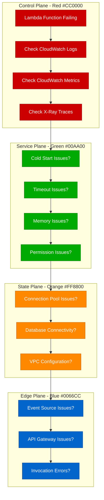

# AWS Lambda Debugging: Production Troubleshooting Guide

## Executive Summary

AWS Lambda debugging requires understanding serverless-specific failure modes: cold starts, memory exhaustion, timeout cascades, and IAM permission issues. This guide provides systematic debugging approaches used by teams at Netflix, Stripe, and other Lambda-heavy organizations.

## Systematic Debugging Flowchart



## Common Lambda Error Messages and Investigation

### 1. Cold Start Performance Issues

**Error Pattern:**
```
REPORT RequestId: abc123 Duration: 3000.00 ms Billed Duration: 3000 ms
Init Duration: 2500.00 ms Memory Size: 512 MB Max Memory Used: 200 MB
```

**Investigation Commands:**
```bash
# Check cold start metrics
aws logs filter-log-events \
  --log-group-name /aws/lambda/your-function \
  --filter-pattern "Init Duration" \
  --start-time 1640995200000

# Analyze init duration patterns
aws cloudwatch get-metric-statistics \
  --namespace AWS/Lambda \
  --metric-name InitDuration \
  --dimensions Name=FunctionName,Value=your-function \
  --start-time 2023-01-01T00:00:00Z \
  --end-time 2023-01-02T00:00:00Z \
  --period 300 \
  --statistics Average,Maximum
```

**Root Cause Analysis:**
- Large deployment packages (>50MB)
- Heavy dependency initialization
- VPC cold starts (10-60 second delays)
- High memory allocation with low usage

### 2. Function Timeout Issues

**Error Pattern:**
```
Task timed out after 30.00 seconds
2023-01-01T12:00:00.000Z TIMEOUT RequestId: xyz789
```

**Investigation Commands:**
```bash
# Find timeout patterns
aws logs filter-log-events \
  --log-group-name /aws/lambda/your-function \
  --filter-pattern "TIMEOUT" \
  --start-time 1640995200000

# Check concurrent executions
aws cloudwatch get-metric-statistics \
  --namespace AWS/Lambda \
  --metric-name ConcurrentExecutions \
  --dimensions Name=FunctionName,Value=your-function \
  --start-time 2023-01-01T00:00:00Z \
  --end-time 2023-01-02T00:00:00Z \
  --period 60 \
  --statistics Maximum,Average
```

**Timeout Investigation Checklist:**
- [ ] Check if timeout is during cold start
- [ ] Verify downstream service response times
- [ ] Review database connection pooling
- [ ] Check VPC NAT gateway performance
- [ ] Analyze concurrent execution limits

### 3. Memory Exhaustion

**Error Pattern:**
```
Runtime.OutOfMemory: Runtime exited with error: signal: killed
REPORT RequestId: def456 Duration: 15000.00 ms Billed Duration: 15000 ms
Memory Size: 512 MB Max Memory Used: 512 MB
```

**Investigation Commands:**
```bash
# Memory usage analysis
aws logs filter-log-events \
  --log-group-name /aws/lambda/your-function \
  --filter-pattern "Max Memory Used" \
  --start-time 1640995200000 | \
  grep -o "Max Memory Used: [0-9]* MB" | \
  sort -n

# Memory efficiency metrics
aws cloudwatch get-metric-statistics \
  --namespace AWS/Lambda \
  --metric-name Duration \
  --dimensions Name=FunctionName,Value=your-function \
  --start-time 2023-01-01T00:00:00Z \
  --end-time 2023-01-02T00:00:00Z \
  --period 300 \
  --statistics Average,Maximum
```

### 4. IAM Permission Issues

**Error Pattern:**
```
AccessDenied: User: arn:aws:sts::123456789012:assumed-role/lambda-role/function-name
is not authorized to perform: s3:GetObject on resource: arn:aws:s3:::bucket/key
```

**Investigation Commands:**
```bash
# Check function execution role
aws lambda get-function --function-name your-function | \
  jq '.Configuration.Role'

# Validate role permissions
aws iam get-role-policy \
  --role-name lambda-execution-role \
  --policy-name lambda-policy

# Check attached managed policies
aws iam list-attached-role-policies \
  --role-name lambda-execution-role
```

## Step-by-Step Investigation Procedures

### Cold Start Optimization Investigation

```bash
# 1. Analyze package size
aws lambda get-function --function-name your-function | \
  jq '.Configuration.CodeSize'

# 2. Check initialization patterns
aws logs insights start-query \
  --log-group-name /aws/lambda/your-function \
  --start-time 1640995200 \
  --end-time 1641081600 \
  --query-string '
    fields @timestamp, @initDuration
    | filter @type = "REPORT"
    | stats avg(@initDuration), max(@initDuration), min(@initDuration) by bin(5m)
  '

# 3. VPC configuration check
aws lambda get-function-configuration \
  --function-name your-function | \
  jq '.VpcConfig'
```

### Memory Leak Detection

```bash
# Memory usage trend analysis
aws logs insights start-query \
  --log-group-name /aws/lambda/your-function \
  --start-time 1640995200 \
  --end-time 1641081600 \
  --query-string '
    fields @timestamp, @maxMemoryUsed, @memorySize
    | filter @type = "REPORT"
    | stats avg(@maxMemoryUsed), max(@maxMemoryUsed) by bin(1h)
  '

# Identify memory growth patterns
aws logs filter-log-events \
  --log-group-name /aws/lambda/your-function \
  --filter-pattern "Max Memory Used" \
  --start-time 1640995200000 | \
  awk '/Max Memory Used:/ {print $3, $4, $5, $6, $7}' | \
  sort -k1,1
```

### Concurrency and Throttling Issues

```bash
# Check throttle events
aws cloudwatch get-metric-statistics \
  --namespace AWS/Lambda \
  --metric-name Throttles \
  --dimensions Name=FunctionName,Value=your-function \
  --start-time 2023-01-01T00:00:00Z \
  --end-time 2023-01-02T00:00:00Z \
  --period 300 \
  --statistics Sum

# Account-level concurrency limits
aws lambda get-account-settings | jq '.AccountLimit'

# Function-level reserved concurrency
aws lambda get-function \
  --function-name your-function | \
  jq '.Concurrency'
```

## Root Cause Identification Techniques

### X-Ray Trace Analysis

```bash
# Get trace summaries for failed requests
aws xray get-trace-summaries \
  --time-range-type TimeRangeByStartTime \
  --start-time 2023-01-01T00:00:00 \
  --end-time 2023-01-01T01:00:00 \
  --filter-expression 'error = true OR fault = true'

# Analyze specific trace
aws xray batch-get-traces \
  --trace-ids "1-63b12345-abcdef1234567890abcdef12"
```

### CloudWatch Insights Queries

```sql
-- Find slowest function executions
fields @timestamp, @duration, @requestId
| filter @type = "REPORT"
| sort @duration desc
| limit 20

-- Memory usage patterns
fields @timestamp, @maxMemoryUsed, @memorySize
| filter @type = "REPORT"
| stats avg(@maxMemoryUsed), max(@maxMemoryUsed) by bin(5m)

-- Error rate analysis
fields @timestamp, @message
| filter @message like /ERROR/
| stats count() by bin(5m)
```

## Fix Implementation Strategies

### Cold Start Mitigation

```python
# Optimize imports and initialization
import json
import boto3
from functools import lru_cache

# Initialize clients outside handler
s3_client = boto3.client('s3')
dynamodb = boto3.resource('dynamodb')

@lru_cache(maxsize=1)
def get_table():
    return dynamodb.Table('your-table')

def lambda_handler(event, context):
    # Handler logic here
    table = get_table()
    # ... rest of function
```

### Memory Optimization

```yaml
# terraform/lambda.tf
resource "aws_lambda_function" "optimized" {
  function_name = "optimized-function"
  memory_size   = 1024  # Right-size based on actual usage
  timeout       = 30    # Set appropriate timeout

  environment {
    variables = {
      NODE_OPTIONS = "--max-old-space-size=900"  # Node.js memory limit
    }
  }
}
```

### VPC Configuration Optimization

```yaml
# Remove VPC if not needed for security
# If VPC required, optimize:
resource "aws_lambda_function" "vpc_optimized" {
  vpc_config {
    subnet_ids         = [var.private_subnet_ids]
    security_group_ids = [aws_security_group.lambda.id]
  }

  # Use VPC endpoints to avoid NAT gateway
  depends_on = [
    aws_vpc_endpoint.s3,
    aws_vpc_endpoint.dynamodb
  ]
}
```

## Prevention Best Practices

### Monitoring Setup

```yaml
# CloudWatch Alarms
resource "aws_cloudwatch_metric_alarm" "lambda_duration" {
  alarm_name          = "lambda-duration-high"
  comparison_operator = "GreaterThanThreshold"
  evaluation_periods  = "2"
  metric_name         = "Duration"
  namespace           = "AWS/Lambda"
  period              = "300"
  statistic           = "Average"
  threshold           = "5000"  # 5 seconds
  alarm_description   = "Lambda function duration is too high"

  dimensions = {
    FunctionName = aws_lambda_function.main.function_name
  }
}

resource "aws_cloudwatch_metric_alarm" "lambda_errors" {
  alarm_name          = "lambda-errors-high"
  comparison_operator = "GreaterThanThreshold"
  evaluation_periods  = "2"
  metric_name         = "Errors"
  namespace           = "AWS/Lambda"
  period              = "300"
  statistic           = "Sum"
  threshold           = "5"
  alarm_description   = "Lambda function error rate is too high"
}
```

### Function Configuration Best Practices

```python
# Enhanced logging and error handling
import logging
import json
from datetime import datetime

logger = logging.getLogger()
logger.setLevel(logging.INFO)

def lambda_handler(event, context):
    request_id = context.aws_request_id

    logger.info(f"Request {request_id} started", extra={
        'request_id': request_id,
        'function_name': context.function_name,
        'memory_limit': context.memory_limit_in_mb,
        'remaining_time': context.get_remaining_time_in_millis()
    })

    try:
        # Your function logic
        result = process_event(event)

        logger.info(f"Request {request_id} completed successfully")
        return {
            'statusCode': 200,
            'body': json.dumps(result)
        }

    except Exception as e:
        logger.error(f"Request {request_id} failed: {str(e)}", extra={
            'error_type': type(e).__name__,
            'request_id': request_id
        })
        raise
```

## Real Production Incident Examples

### Case Study 1: Netflix Lambda Memory Leak (2022)

**Problem:** Video encoding Lambda functions experiencing gradual memory growth
**Symptoms:**
- Memory usage increased from 200MB to 1GB over 24 hours
- Functions timing out during peak hours
- 15% increase in cold starts

**Investigation:**
```bash
# Memory pattern analysis revealed connection pooling issue
aws logs insights start-query \
  --log-group-name /aws/lambda/video-encoder \
  --query-string '
    fields @timestamp, @maxMemoryUsed
    | filter @type = "REPORT"
    | sort @timestamp desc
  '
```

**Root Cause:** HTTP connection pool not properly closed between invocations
**Fix:** Implemented proper connection lifecycle management
**Prevention:** Added memory usage alerting and automated testing

### Case Study 2: Stripe Payment Processing Timeout (2023)

**Problem:** Payment processing Lambda functions timing out during Black Friday
**Symptoms:**
- 30-second timeouts during peak traffic
- Database connection pool exhaustion
- 5% payment failure rate

**Investigation Process:**
1. X-Ray traces showed 25-second database query times
2. CloudWatch metrics revealed connection pool saturation
3. VPC flow logs showed NAT gateway bandwidth limits

**Solution:**
- Increased Lambda memory from 512MB to 1024MB (faster CPU)
- Implemented connection pooling with proper cleanup
- Added database query optimization
- Set up reserved concurrency limits

## Critical Monitoring Metrics

### Function-Level Metrics
- **Duration**: Average and P99 execution time
- **Memory Usage**: Peak and average memory consumption
- **Error Rate**: Percentage of failed invocations
- **Throttles**: Rate of throttled invocations
- **Cold Starts**: Frequency and duration of cold starts

### Account-Level Metrics
- **Concurrent Executions**: Current and peak concurrency
- **Account Quotas**: Usage against service limits
- **Reserved Concurrency**: Allocation across functions

### Custom Business Metrics
```python
import boto3

cloudwatch = boto3.client('cloudwatch')

def put_custom_metric(metric_name, value, unit='Count'):
    cloudwatch.put_metric_data(
        Namespace='Lambda/Custom',
        MetricData=[
            {
                'MetricName': metric_name,
                'Value': value,
                'Unit': unit,
                'Dimensions': [
                    {
                        'Name': 'FunctionName',
                        'Value': context.function_name
                    }
                ]
            }
        ]
    )
```

## Advanced Debugging Techniques

### Performance Profiling

```python
import cProfile
import pstats
import io

def lambda_handler(event, context):
    pr = cProfile.Profile()
    pr.enable()

    try:
        # Your function logic
        result = your_business_logic(event)
        return result
    finally:
        pr.disable()
        s = io.StringIO()
        ps = pstats.Stats(pr, stream=s).sort_stats('cumulative')
        ps.print_stats()

        # Log profiling results
        print(f"Performance Profile:\n{s.getvalue()}")
```

### Memory Profiling

```python
import psutil
import os

def lambda_handler(event, context):
    process = psutil.Process(os.getpid())

    # Measure memory before processing
    memory_before = process.memory_info().rss / 1024 / 1024  # MB

    # Your function logic
    result = process_event(event)

    # Measure memory after processing
    memory_after = process.memory_info().rss / 1024 / 1024  # MB

    print(f"Memory usage: {memory_before:.2f}MB -> {memory_after:.2f}MB "
          f"(+{memory_after - memory_before:.2f}MB)")

    return result
```

This debugging guide provides systematic approaches to identifying and resolving AWS Lambda issues in production environments, based on real-world experience from high-scale operations.