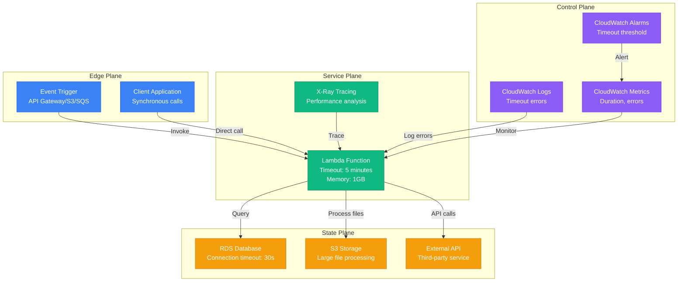
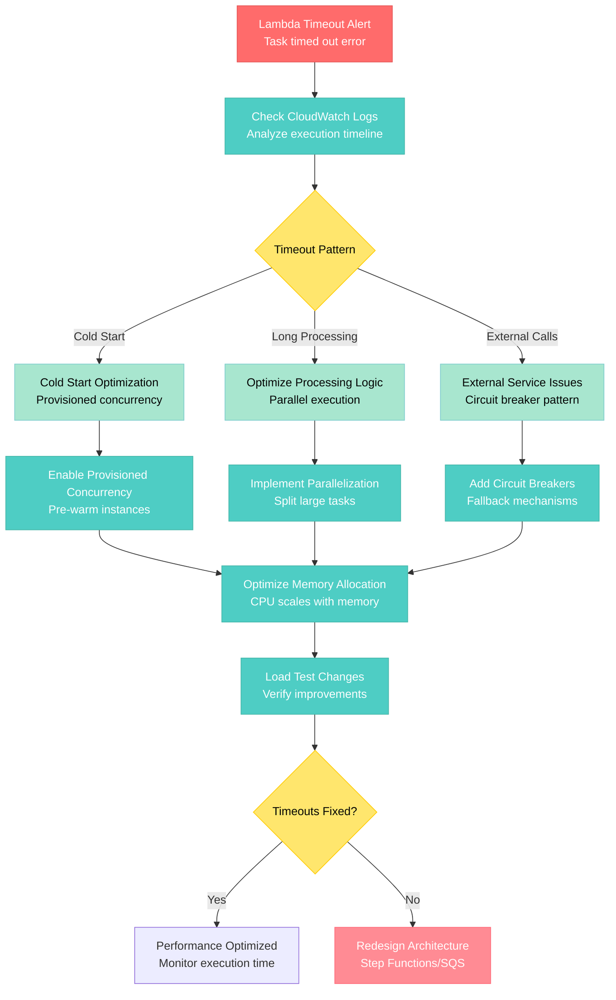

# AWS Lambda Timeout Debugging

**Scenario**: Production Lambda functions hitting timeout limits, causing incomplete executions and failed processing.

**The 3 AM Reality**: Critical business processes failing due to Lambda timeouts, data processing incomplete, and cascading failures in serverless architecture.

## Symptoms Checklist

- [ ] Lambda functions timing out at configured limit (15 minutes max)
- [ ] Task timed out after X seconds errors in CloudWatch logs
- [ ] Increased error rates and failed invocations
- [ ] Cold start latency contributing to timeouts
- [ ] Downstream services not receiving expected responses

## AWS Lambda Timeout Architecture



## Step-by-Step Debugging Flow



## Critical Commands & Queries

### CloudWatch Logs Analysis
```bash
# Query Lambda timeout errors
aws logs filter-log-events \
    --log-group-name "/aws/lambda/my-function" \
    --filter-pattern "Task timed out" \
    --start-time $(date -d '1 hour ago' +%s)000

# Get execution duration patterns
aws logs filter-log-events \
    --log-group-name "/aws/lambda/my-function" \
    --filter-pattern "[timestamp, request_id, duration=REPORT...]" \
    --query 'events[].message' \
    --output text | grep "Duration:"

# Analyze cold start vs warm start performance
aws logs insights start-query \
    --log-group-name "/aws/lambda/my-function" \
    --start-time $(date -d '24 hours ago' +%s) \
    --end-time $(date +%s) \
    --query-string '
        fields @timestamp, @duration, @initDuration
        | filter @type = "REPORT"
        | stats avg(@duration), avg(@initDuration) by bin(5m)
    '
```

### Lambda Function Configuration
```bash
# Check current function configuration
aws lambda get-function --function-name my-function

# Get timeout configuration
aws lambda get-function-configuration --function-name my-function \
    --query '{Timeout: Timeout, MemorySize: MemorySize, Runtime: Runtime}'

# Update timeout (max 15 minutes = 900 seconds)
aws lambda update-function-configuration \
    --function-name my-function \
    --timeout 600 \
    --memory-size 2048

# Enable X-Ray tracing
aws lambda update-function-configuration \
    --function-name my-function \
    --tracing-config Mode=Active
```

### X-Ray Trace Analysis
```bash
# Get trace summaries for timeouts
aws xray get-trace-summaries \
    --time-range-type TimeRangeByStartTime \
    --start-time $(date -d '1 hour ago' +%s) \
    --end-time $(date +%s) \
    --filter-expression 'error = true'

# Analyze service map
aws xray get-service-graph \
    --start-time $(date -d '1 hour ago' +%s) \
    --end-time $(date +%s)

# Get detailed trace
aws xray batch-get-traces --trace-ids trace-id-here
```

### Performance Metrics
```bash
# Get Lambda metrics
aws cloudwatch get-metric-statistics \
    --namespace AWS/Lambda \
    --metric-name Duration \
    --dimensions Name=FunctionName,Value=my-function \
    --start-time $(date -d '1 hour ago' -u +%Y-%m-%dT%H:%M:%S) \
    --end-time $(date -u +%Y-%m-%dT%H:%M:%S) \
    --period 300 \
    --statistics Average,Maximum

# Error rate analysis
aws cloudwatch get-metric-statistics \
    --namespace AWS/Lambda \
    --metric-name Errors \
    --dimensions Name=FunctionName,Value=my-function \
    --start-time $(date -d '1 hour ago' -u +%Y-%m-%dT%H:%M:%S) \
    --end-time $(date -u +%Y-%m-%dT%H:%M:%S) \
    --period 300 \
    --statistics Sum
```

## Common Root Causes (by Probability)

### 1. Cold Start Overhead (35% of cases)
**Symptoms**: Timeouts primarily on new container initialization
```python
# Detection - Log cold vs warm starts
import time
import json

# Global variable to detect cold starts
cold_start = True

def lambda_handler(event, context):
    global cold_start

    start_time = time.time()

    if cold_start:
        print(f"COLD_START: Initializing at {start_time}")
        cold_start = False
        # Initialization logic here
    else:
        print(f"WARM_START: Reusing container at {start_time}")

    # Your function logic

    execution_time = time.time() - start_time
    print(f"EXECUTION_TIME: {execution_time}s")

    return {'statusCode': 200, 'body': json.dumps('Success')}

# Fix - Enable provisioned concurrency
aws lambda put-provisioned-concurrency-config \
    --function-name my-function \
    --qualifier '$LATEST' \
    --provisioned-concurrency-config \
    ProvisionedConcurrencyConfig='{ProvisionedConcurrency: 10}'
```

### 2. Inefficient Processing Logic (30% of cases)
**Symptoms**: Function execution time approaching timeout limit
```python
# Detection - Profile function execution
import cProfile
import pstats
from io import StringIO

def lambda_handler(event, context):
    profiler = cProfile.Profile()
    profiler.enable()

    # Your function logic here
    result = process_data(event)

    profiler.disable()

    # Log profiling results
    s = StringIO()
    ps = pstats.Stats(profiler, stream=s)
    ps.sort_stats('cumulative').print_stats(10)
    print("PROFILING_RESULTS:", s.getvalue())

    return result

# Fix - Optimize with parallel processing
import concurrent.futures
import multiprocessing

def process_chunk(chunk):
    # Process individual chunk
    return processed_chunk

def lambda_handler(event, context):
    data_chunks = split_data_into_chunks(event['data'])

    # Use all available CPU cores
    max_workers = multiprocessing.cpu_count()

    with concurrent.futures.ThreadPoolExecutor(max_workers=max_workers) as executor:
        results = list(executor.map(process_chunk, data_chunks))

    return {'results': results}
```

### 3. External Service Latency (20% of cases)
**Symptoms**: Waiting for external API responses or database queries
```python
# Detection - Monitor external call duration
import time
import requests

def lambda_handler(event, context):
    external_calls = []

    for api_url in event['urls']:
        start = time.time()
        try:
            response = requests.get(api_url, timeout=30)
            duration = time.time() - start
            external_calls.append({
                'url': api_url,
                'duration': duration,
                'status': response.status_code
            })
        except requests.Timeout:
            print(f"TIMEOUT: {api_url} took >30s")
            external_calls.append({
                'url': api_url,
                'duration': 30,
                'status': 'timeout'
            })

    print(f"EXTERNAL_CALLS: {external_calls}")
    return external_calls

# Fix - Implement circuit breaker and timeouts
import boto3
from botocore.config import Config

def lambda_handler(event, context):
    # Configure aggressive timeouts
    config = Config(
        retries={'max_attempts': 2},
        read_timeout=10,
        connect_timeout=5
    )

    client = boto3.client('dynamodb', config=config)

    try:
        response = client.get_item(
            TableName='my-table',
            Key={'id': {'S': event['id']}}
        )
    except Exception as e:
        print(f"EXTERNAL_ERROR: {str(e)}")
        # Return cached or default data
        return get_fallback_data(event['id'])
```

### 4. Memory/CPU Constraints (10% of cases)
**Symptoms**: Function slows down due to insufficient resources
```python
# Detection - Monitor memory usage
import psutil
import os

def lambda_handler(event, context):
    # Monitor memory at start
    process = psutil.Process(os.getpid())
    start_memory = process.memory_info().rss / 1024 / 1024  # MB

    print(f"START_MEMORY: {start_memory}MB")
    print(f"ALLOCATED_MEMORY: {context.memory_limit_in_mb}MB")

    # Your processing logic
    result = process_large_dataset(event['data'])

    # Monitor memory at end
    end_memory = process.memory_info().rss / 1024 / 1024
    print(f"END_MEMORY: {end_memory}MB")
    print(f"MEMORY_GROWTH: {end_memory - start_memory}MB")

    return result

# Fix - Increase memory allocation (also increases CPU)
aws lambda update-function-configuration \
    --function-name my-function \
    --memory-size 3008  # Maximum available
```

### 5. Large File Processing (5% of cases)
**Symptoms**: Processing large files from S3 or other sources
```python
# Detection - Monitor file processing time
import boto3
import time

def lambda_handler(event, context):
    s3 = boto3.client('s3')

    for record in event['Records']:
        bucket = record['s3']['bucket']['name']
        key = record['s3']['object']['key']

        start_time = time.time()

        # Get object size
        obj_info = s3.head_object(Bucket=bucket, Key=key)
        file_size = obj_info['ContentLength'] / (1024 * 1024)  # MB

        print(f"PROCESSING_FILE: {key}, Size: {file_size}MB")

        # Process file
        process_s3_file(bucket, key)

        processing_time = time.time() - start_time
        print(f"FILE_PROCESSED: {key}, Time: {processing_time}s")

# Fix - Stream processing for large files
def process_s3_file_streaming(bucket, key):
    s3 = boto3.client('s3')

    # Use streaming to avoid memory issues
    response = s3.get_object(Bucket=bucket, Key=key)

    # Process in chunks
    chunk_size = 1024 * 1024  # 1MB chunks
    processed_lines = 0

    for line in response['Body'].iter_lines(chunk_size=chunk_size):
        process_line(line)
        processed_lines += 1

        # Progress logging
        if processed_lines % 10000 == 0:
            print(f"PROCESSED_LINES: {processed_lines}")
```

## Immediate Mitigation Steps

### Emergency Response (< 5 minutes)
1. **Increase Timeout Temporarily**
   ```bash
   # Increase to maximum (15 minutes)
   aws lambda update-function-configuration \
       --function-name my-function \
       --timeout 900

   # Increase memory for more CPU
   aws lambda update-function-configuration \
       --function-name my-function \
       --memory-size 3008
   ```

2. **Enable Provisioned Concurrency**
   ```bash
   # Eliminate cold starts for critical functions
   aws lambda put-provisioned-concurrency-config \
       --function-name my-function \
       --qualifier '$LATEST' \
       --provisioned-concurrency-config \
       ProvisionedConcurrency=5
   ```

### Short-term Fixes (< 30 minutes)
1. **Optimize Function Configuration**
   ```yaml
   # serverless.yml optimization
   functions:
     myFunction:
       handler: handler.main
       timeout: 600  # 10 minutes
       memorySize: 2048  # More CPU power
       reservedConcurrency: 10
       provisionedConcurrency: 5
       tracing: true  # Enable X-Ray
       environment:
         PYTHONPATH: /var/runtime
   ```

2. **Implement Async Processing**
   ```python
   # Use SQS for long-running tasks
   import boto3

   def lambda_handler(event, context):
       sqs = boto3.client('sqs')

       # Break large job into smaller tasks
       tasks = split_large_job(event)

       for task in tasks:
           sqs.send_message(
               QueueUrl='https://sqs.region.amazonaws.com/account/queue',
               MessageBody=json.dumps(task)
           )

       return {'status': 'processing', 'tasks': len(tasks)}
   ```

## Long-term Prevention

### Step Functions for Complex Workflows
```json
{
  "Comment": "Long-running processing workflow",
  "StartAt": "ProcessChunk",
  "States": {
    "ProcessChunk": {
      "Type": "Task",
      "Resource": "arn:aws:states:::lambda:invoke",
      "Parameters": {
        "FunctionName": "process-chunk-function",
        "Payload.$": "$"
      },
      "Next": "CheckComplete"
    },
    "CheckComplete": {
      "Type": "Choice",
      "Choices": [
        {
          "Variable": "$.hasMore",
          "BooleanEquals": true,
          "Next": "ProcessChunk"
        }
      ],
      "Default": "Complete"
    },
    "Complete": {
      "Type": "Succeed"
    }
  }
}
```

### Monitoring and Alerting
```yaml
# CloudFormation template for Lambda monitoring
Resources:
  LambdaTimeoutAlarm:
    Type: AWS::CloudWatch::Alarm
    Properties:
      AlarmName: !Sub "${FunctionName}-timeout-alarm"
      MetricName: Duration
      Namespace: AWS/Lambda
      Statistic: Maximum
      Period: 300
      EvaluationPeriods: 2
      Threshold: 240000  # 4 minutes (80% of 5-minute timeout)
      ComparisonOperator: GreaterThanThreshold
      Dimensions:
        - Name: FunctionName
          Value: !Ref FunctionName

  LambdaErrorRate:
    Type: AWS::CloudWatch::Alarm
    Properties:
      AlarmName: !Sub "${FunctionName}-error-rate"
      MetricName: Errors
      Namespace: AWS/Lambda
      Statistic: Sum
      Period: 300
      EvaluationPeriods: 2
      Threshold: 5
      ComparisonOperator: GreaterThanThreshold
```

### Performance Optimization Patterns
```python
# Connection pooling for database connections
import pymysql
from pymysql.err import OperationalError

# Global connection pool
connection_pool = None

def get_db_connection():
    global connection_pool

    if connection_pool is None:
        connection_pool = pymysql.connect(
            host=os.environ['DB_HOST'],
            user=os.environ['DB_USER'],
            password=os.environ['DB_PASSWORD'],
            database=os.environ['DB_NAME'],
            charset='utf8mb4',
            autocommit=True,
            connect_timeout=5,
            read_timeout=10,
            write_timeout=10
        )

    return connection_pool

def lambda_handler(event, context):
    try:
        conn = get_db_connection()

        # Test connection
        conn.ping(reconnect=True)

        # Your database operations
        with conn.cursor() as cursor:
            cursor.execute("SELECT * FROM table WHERE id = %s", (event['id'],))
            result = cursor.fetchone()

        return {'data': result}

    except OperationalError:
        # Reconnect on connection issues
        connection_pool = None
        return lambda_handler(event, context)
```

## Production Examples

### Netflix's Lambda Processing Pipeline (2020)
- **Incident**: Video encoding Lambda functions timing out during peak upload periods
- **Root Cause**: Cold start overhead + large file processing exceeding 15-minute limit
- **Impact**: 30% of video uploads failed processing
- **Resolution**: Split processing into smaller chunks, implemented Step Functions
- **Prevention**: Pre-warmed functions with provisioned concurrency

### Airbnb's Data Processing Timeouts (2019)
- **Incident**: Nightly ETL Lambda functions timing out, leaving data pipeline incomplete
- **Root Cause**: Database queries taking longer than expected due to data growth
- **Impact**: Incomplete analytics data for business decisions
- **Resolution**: Moved to ECS Fargate for longer-running tasks
- **Learning**: Lambda not suitable for all batch processing scenarios

### Stripe's Payment Webhook Timeouts (2021)
- **Incident**: Payment webhook processing Lambda timing out during high-volume periods
- **Root Cause**: External fraud detection API calls taking 30+ seconds
- **Impact**: Payment confirmations delayed, customer experience degraded
- **Resolution**: Implemented async processing with SQS, fallback fraud rules
- **Prevention**: Circuit breaker pattern for external service calls

## Recovery Automation

### Timeout Recovery Script
```bash
#!/bin/bash
# lambda-timeout-recovery.sh

FUNCTION_NAME=$1
CLOUDWATCH_LOGS_GROUP="/aws/lambda/$FUNCTION_NAME"

if [ -z "$FUNCTION_NAME" ]; then
    echo "Usage: $0 <function-name>"
    exit 1
fi

echo "Analyzing Lambda timeout patterns for $FUNCTION_NAME..."

# Get recent timeout errors
TIMEOUT_COUNT=$(aws logs filter-log-events \
    --log-group-name "$CLOUDWATCH_LOGS_GROUP" \
    --start-time $(date -d '1 hour ago' +%s)000 \
    --filter-pattern "Task timed out" \
    --query 'length(events)')

echo "Timeout errors in last hour: $TIMEOUT_COUNT"

if [ "$TIMEOUT_COUNT" -gt 5 ]; then
    echo "High timeout rate detected. Implementing emergency fixes..."

    # Get current configuration
    CURRENT_CONFIG=$(aws lambda get-function-configuration --function-name "$FUNCTION_NAME")
    CURRENT_TIMEOUT=$(echo "$CURRENT_CONFIG" | jq -r '.Timeout')
    CURRENT_MEMORY=$(echo "$CURRENT_CONFIG" | jq -r '.MemorySize')

    echo "Current timeout: ${CURRENT_TIMEOUT}s, Memory: ${CURRENT_MEMORY}MB"

    # Increase timeout (double current, max 900 seconds)
    NEW_TIMEOUT=$((CURRENT_TIMEOUT * 2))
    if [ "$NEW_TIMEOUT" -gt 900 ]; then
        NEW_TIMEOUT=900
    fi

    # Increase memory for more CPU
    NEW_MEMORY=$((CURRENT_MEMORY * 2))
    if [ "$NEW_MEMORY" -gt 3008 ]; then
        NEW_MEMORY=3008
    fi

    echo "Updating configuration: Timeout=${NEW_TIMEOUT}s, Memory=${NEW_MEMORY}MB"

    aws lambda update-function-configuration \
        --function-name "$FUNCTION_NAME" \
        --timeout "$NEW_TIMEOUT" \
        --memory-size "$NEW_MEMORY"

    echo "Configuration updated. Monitoring for improvements..."

    # Enable provisioned concurrency if not already enabled
    PROVISIONED=$(aws lambda get-provisioned-concurrency-config \
        --function-name "$FUNCTION_NAME" \
        --qualifier '$LATEST' 2>/dev/null || echo "null")

    if [ "$PROVISIONED" = "null" ]; then
        echo "Enabling provisioned concurrency to reduce cold starts..."
        aws lambda put-provisioned-concurrency-config \
            --function-name "$FUNCTION_NAME" \
            --qualifier '$LATEST' \
            --provisioned-concurrency-config \
            ProvisionedConcurrency=5
    fi

else
    echo "Timeout rate is normal."
fi

# Analyze execution patterns
echo "Analyzing execution duration patterns..."
aws logs insights start-query \
    --log-group-name "$CLOUDWATCH_LOGS_GROUP" \
    --start-time $(date -d '24 hours ago' +%s) \
    --end-time $(date +%s) \
    --query-string '
        fields @timestamp, @duration, @initDuration
        | filter @type = "REPORT"
        | stats avg(@duration), max(@duration), count() by bin(1h)
        | sort @timestamp
    '
```

**Remember**: Lambda timeouts often indicate architectural mismatches. Consider whether the workload is appropriate for Lambda's execution model, or if services like ECS Fargate, Step Functions, or SQS would be better suited for long-running or complex processing tasks.