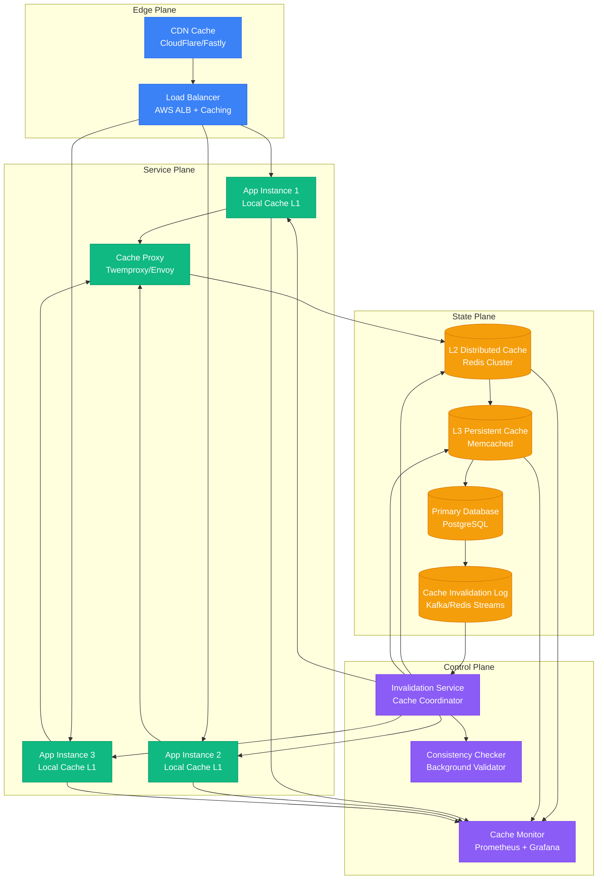

# Cache Coherency Issues - Consistency Analysis and Resolution

## Overview

This guide provides systematic approaches to debugging cache coherency issues in distributed systems. Based on production experiences from Facebook's TAO cache layer, Netflix's EVCache implementation, and Shopify's multi-tier caching architecture.

## Architecture Context



## Cache Coherency Debugging Flowchart

```mermaid
flowchart TD
    START[Cache Inconsistency Detected] --> IDENTIFY_SCOPE{Identify Inconsistency Scope}

    IDENTIFY_SCOPE --> SINGLE_KEY[Single Key Inconsistency]
    IDENTIFY_SCOPE --> MULTIPLE_KEYS[Multiple Keys Inconsistency]
    IDENTIFY_SCOPE --> CROSS_REGION[Cross-Region Inconsistency]
    IDENTIFY_SCOPE --> TIME_BASED[Time-Based Inconsistency]

    SINGLE_KEY --> CHECK_LAYERS[Check All Cache Layers<br/>L1, L2, L3, Database]
    MULTIPLE_KEYS --> PATTERN_ANALYSIS[Analyze Key Patterns<br/>Common prefixes/tags]
    CROSS_REGION --> REGION_ANALYSIS[Check Regional Sync<br/>Replication lag]
    TIME_BASED --> TIMING_ANALYSIS[Check Invalidation Timing<br/>Race conditions]

    CHECK_LAYERS --> LAYER_INCONSISTENCY{Which Layer Inconsistent?}
    PATTERN_ANALYSIS --> BULK_OPERATION[Check Bulk Operations<br/>Mass updates/deletes]
    REGION_ANALYSIS --> SYNC_FAILURE[Check Sync Mechanisms<br/>Cross-region replication]
    TIMING_ANALYSIS --> RACE_CONDITION[Identify Race Conditions<br/>Concurrent updates]

    LAYER_INCONSISTENCY --> L1_STALE[L1 Cache Stale]
    LAYER_INCONSISTENCY --> L2_STALE[L2 Cache Stale]
    LAYER_INCONSISTENCY --> L3_STALE[L3 Cache Stale]
    LAYER_INCONSISTENCY --> DB_STALE[Database Stale]

    BULK_OPERATION --> INVALIDATION_STORM[Cache Invalidation Storm]
    BULK_OPERATION --> PARTIAL_UPDATE[Partial Bulk Update]

    SYNC_FAILURE --> NETWORK_PARTITION[Network Partition]
    SYNC_FAILURE --> REPLICATION_LAG[Replication Lag]

    RACE_CONDITION --> READ_MODIFY_WRITE[Read-Modify-Write Race]
    RACE_CONDITION --> INVALIDATION_RACE[Invalidation vs Update Race]

    %% Root cause analysis
    L1_STALE --> L1_TTL_ISSUE[L1 TTL Too Long]
    L1_STALE --> L1_INVALIDATION_MISS[L1 Invalidation Missed]

    L2_STALE --> L2_EVICTION_POLICY[L2 Eviction Policy Issue]
    L2_STALE --> L2_CLUSTER_SPLIT[L2 Cluster Split-brain]

    L3_STALE --> L3_PERSISTENCE[L3 Persistence Issue]
    L3_STALE --> L3_MEMORY_PRESSURE[L3 Memory Pressure]

    DB_STALE --> REPLICATION_DELAY[Database Replication Delay]
    DB_STALE --> TRANSACTION_ISOLATION[Transaction Isolation Issue]

    INVALIDATION_STORM --> THROTTLE_INVALIDATION[Throttle Invalidation Rate]
    PARTIAL_UPDATE --> TRANSACTION_BOUNDARY[Fix Transaction Boundaries]

    NETWORK_PARTITION --> CIRCUIT_BREAKER[Implement Circuit Breaker]
    REPLICATION_LAG --> SYNC_OPTIMIZATION[Optimize Sync Protocol]

    READ_MODIFY_WRITE --> ATOMIC_OPERATIONS[Use Atomic Operations]
    INVALIDATION_RACE --> VERSIONING[Implement Cache Versioning]

    %% Solutions
    L1_TTL_ISSUE --> TUNE_TTL[Tune L1 TTL Settings]
    L1_INVALIDATION_MISS --> FIX_INVALIDATION[Fix Invalidation Logic]
    L2_EVICTION_POLICY --> OPTIMIZE_EVICTION[Optimize Eviction Policy]
    L2_CLUSTER_SPLIT --> RESOLVE_SPLIT_BRAIN[Resolve Split-brain]
    L3_PERSISTENCE --> FIX_PERSISTENCE[Fix Persistence Layer]
    L3_MEMORY_PRESSURE --> SCALE_MEMORY[Scale Memory Resources]
    REPLICATION_DELAY --> OPTIMIZE_REPLICATION[Optimize DB Replication]
    TRANSACTION_ISOLATION --> ADJUST_ISOLATION[Adjust Isolation Level]
    THROTTLE_INVALIDATION --> IMPLEMENT_THROTTLING[Implement Rate Limiting]
    TRANSACTION_BOUNDARY --> REFACTOR_TRANSACTIONS[Refactor Transaction Logic]
    CIRCUIT_BREAKER --> IMPLEMENT_CB[Implement Circuit Breaker]
    SYNC_OPTIMIZATION --> OPTIMIZE_PROTOCOL[Optimize Sync Protocol]
    ATOMIC_OPERATIONS --> USE_CAS[Use Compare-And-Swap]
    VERSIONING --> IMPLEMENT_VERSIONING[Implement Version Tags]

    %% Monitoring
    TUNE_TTL --> MONITOR[Monitor Cache Consistency]
    FIX_INVALIDATION --> MONITOR
    OPTIMIZE_EVICTION --> MONITOR
    RESOLVE_SPLIT_BRAIN --> MONITOR
    FIX_PERSISTENCE --> MONITOR
    SCALE_MEMORY --> MONITOR
    OPTIMIZE_REPLICATION --> MONITOR
    ADJUST_ISOLATION --> MONITOR
    IMPLEMENT_THROTTLING --> MONITOR
    REFACTOR_TRANSACTIONS --> MONITOR
    IMPLEMENT_CB --> MONITOR
    OPTIMIZE_PROTOCOL --> MONITOR
    USE_CAS --> MONITOR
    IMPLEMENT_VERSIONING --> MONITOR

    MONITOR --> SUCCESS[Cache Consistency Restored]
    MONITOR --> ESCALATE[Escalate to Architecture Team]
```



## Multi-Layer Cache Analysis

### Cache Layer Inspection Commands

#### Redis Cluster Analysis
```bash
# Check Redis cluster status
redis-cli cluster nodes
redis-cli cluster info

# Check key distribution across nodes
redis-cli --cluster check 127.0.0.1:7000

# Analyze specific key across cluster
redis-cli -c get "user:12345"
redis-cli -c ttl "user:12345"

# Check memory usage per node
redis-cli --cluster call 127.0.0.1:7000 memory usage "user:*"

# Monitor real-time commands
redis-cli monitor | grep "user:12345"

# Check replication status
redis-cli info replication

# Analyze slow operations
redis-cli slowlog get 10
```

#### Memcached Analysis
```bash
# Check memcached stats
echo "stats" | nc memcached-host 11211
echo "stats slabs" | nc memcached-host 11211
echo "stats items" | nc memcached-host 11211

# Get specific key information
echo "get user:12345" | nc memcached-host 11211

# Check cache hit/miss ratios
echo "stats" | nc memcached-host 11211 | grep -E "(get_hits|get_misses|cmd_get)"

# Monitor memcached in real-time
watch -n 1 'echo "stats" | nc memcached-host 11211 | grep -E "(curr_items|bytes|get_hits)"'
```

### Cache Consistency Validation Script

```python
#!/usr/bin/env python3
"""
Multi-layer cache consistency validator
"""
import redis
import memcache
import psycopg2
import json
import time
from typing import Dict, Any, Optional, List
from dataclasses import dataclass
from datetime import datetime

@dataclass
class CacheLayerValue:
    value: Any
    ttl: Optional[int]
    source: str
    timestamp: float

@dataclass
class ConsistencyReport:
    key: str
    layers: Dict[str, CacheLayerValue]
    consistent: bool
    inconsistencies: List[str]
    recommended_action: str

class CacheConsistencyValidator:
    def __init__(self, config: Dict[str, Any]):
        self.config = config
        self.redis_client = redis.Redis(
            host=config['redis']['host'],
            port=config['redis']['port'],
            decode_responses=True
        )
        self.memcache_client = memcache.Client([
            f"{config['memcache']['host']}:{config['memcache']['port']}"
        ])
        self.db_conn = psycopg2.connect(
            host=config['database']['host'],
            database=config['database']['name'],
            user=config['database']['user'],
            password=config['database']['password']
        )

    def validate_key_consistency(self, key: str,
                               expected_value: Optional[Any] = None) -> ConsistencyReport:
        """Validate consistency across all cache layers for a specific key"""
        layers = {}

        # Check L1 cache (Redis)
        try:
            redis_value = self.redis_client.get(key)
            redis_ttl = self.redis_client.ttl(key)
            layers['redis'] = CacheLayerValue(
                value=redis_value,
                ttl=redis_ttl if redis_ttl > 0 else None,
                source='redis',
                timestamp=time.time()
            )
        except Exception as e:
            layers['redis'] = CacheLayerValue(
                value=None,
                ttl=None,
                source='redis',
                timestamp=time.time()
            )

        # Check L2 cache (Memcached)
        try:
            memcache_value = self.memcache_client.get(key)
            layers['memcache'] = CacheLayerValue(
                value=memcache_value,
                ttl=None,  # Memcache doesn't expose TTL easily
                source='memcache',
                timestamp=time.time()
            )
        except Exception as e:
            layers['memcache'] = CacheLayerValue(
                value=None,
                ttl=None,
                source='memcache',
                timestamp=time.time()
            )

        # Check database (source of truth)
        try:
            db_value = self.get_database_value(key)
            layers['database'] = CacheLayerValue(
                value=db_value,
                ttl=None,
                source='database',
                timestamp=time.time()
            )
        except Exception as e:
            layers['database'] = CacheLayerValue(
                value=None,
                ttl=None,
                source='database',
                timestamp=time.time()
            )

        # Analyze consistency
        return self.analyze_consistency(key, layers, expected_value)

    def get_database_value(self, key: str) -> Optional[Any]:
        """Get value from database - customize based on your schema"""
        # This is a simplified example - adapt to your data model
        with self.db_conn.cursor() as cursor:
            if key.startswith('user:'):
                user_id = key.split(':')[1]
                cursor.execute("SELECT data FROM users WHERE id = %s", (user_id,))
                result = cursor.fetchone()
                return result[0] if result else None
            elif key.startswith('product:'):
                product_id = key.split(':')[1]
                cursor.execute("SELECT data FROM products WHERE id = %s", (product_id,))
                result = cursor.fetchone()
                return result[0] if result else None
            else:
                return None

    def analyze_consistency(self, key: str, layers: Dict[str, CacheLayerValue],
                          expected_value: Optional[Any] = None) -> ConsistencyReport:
        """Analyze consistency across cache layers"""
        inconsistencies = []

        # Get the source of truth (database value)
        db_value = layers.get('database', CacheLayerValue(None, None, 'database', time.time())).value

        # Compare each cache layer with database
        for layer_name, layer_value in layers.items():
            if layer_name == 'database':
                continue

            if layer_value.value != db_value:
                if layer_value.value is None and db_value is not None:
                    inconsistencies.append(f"{layer_name}: Cache miss (should have value)")
                elif layer_value.value is not None and db_value is None:
                    inconsistencies.append(f"{layer_name}: Stale data (DB value deleted)")
                elif layer_value.value != db_value:
                    inconsistencies.append(f"{layer_name}: Stale data (different from DB)")

        # Check if expected value matches reality
        if expected_value is not None and db_value != expected_value:
            inconsistencies.append(f"database: Unexpected value (expected {expected_value}, got {db_value})")

        # Determine recommended action
        recommended_action = self.get_recommended_action(inconsistencies)

        return ConsistencyReport(
            key=key,
            layers=layers,
            consistent=len(inconsistencies) == 0,
            inconsistencies=inconsistencies,
            recommended_action=recommended_action
        )

    def get_recommended_action(self, inconsistencies: List[str]) -> str:
        """Determine recommended action based on inconsistencies"""
        if not inconsistencies:
            return "No action needed"

        if any("Cache miss" in inc for inc in inconsistencies):
            return "Warm cache with correct values"
        elif any("Stale data" in inc for inc in inconsistencies):
            return "Invalidate stale cache entries"
        elif any("Unexpected value" in inc for inc in inconsistencies):
            return "Investigate database state"
        else:
            return "Manual investigation required"

    def batch_validate_consistency(self, keys: List[str]) -> List[ConsistencyReport]:
        """Validate consistency for multiple keys"""
        reports = []
        for key in keys:
            report = self.validate_key_consistency(key)
            reports.append(report)

            # Add small delay to avoid overwhelming systems
            time.sleep(0.1)

        return reports

    def generate_consistency_summary(self, reports: List[ConsistencyReport]) -> Dict[str, Any]:
        """Generate summary statistics from consistency reports"""
        total_keys = len(reports)
        consistent_keys = sum(1 for r in reports if r.consistent)
        inconsistent_keys = total_keys - consistent_keys

        inconsistency_types = {}
        for report in reports:
            for inconsistency in report.inconsistencies:
                inc_type = inconsistency.split(':')[0]
                inconsistency_types[inc_type] = inconsistency_types.get(inc_type, 0) + 1

        return {
            'total_keys_checked': total_keys,
            'consistent_keys': consistent_keys,
            'inconsistent_keys': inconsistent_keys,
            'consistency_percentage': (consistent_keys / total_keys * 100) if total_keys > 0 else 0,
            'inconsistency_breakdown': inconsistency_types,
            'timestamp': datetime.utcnow().isoformat()
        }

# Example usage
config = {
    'redis': {'host': 'localhost', 'port': 6379},
    'memcache': {'host': 'localhost', 'port': 11211},
    'database': {
        'host': 'localhost',
        'name': 'myapp',
        'user': 'postgres',
        'password': 'password'
    }
}

validator = CacheConsistencyValidator(config)

# Validate single key
report = validator.validate_key_consistency('user:12345')
print(f"Consistency report for user:12345: {report}")

# Validate multiple keys
keys_to_check = ['user:12345', 'product:67890', 'category:111']
reports = validator.batch_validate_consistency(keys_to_check)
summary = validator.generate_consistency_summary(reports)
print(f"Consistency summary: {summary}")
```

## Cache Invalidation Strategies

### Event-Driven Invalidation

#### Kafka-Based Cache Invalidation
```python
from kafka import KafkaProducer, KafkaConsumer
import json
import redis
import logging
from typing import Dict, Any, List
from dataclasses import dataclass

@dataclass
class InvalidationEvent:
    operation: str  # 'invalidate', 'update', 'delete'
    cache_keys: List[str]
    entity_type: str
    entity_id: str
    timestamp: float
    source_service: str

class CacheInvalidationService:
    def __init__(self, kafka_config: Dict, redis_config: Dict):
        self.producer = KafkaProducer(
            bootstrap_servers=kafka_config['bootstrap_servers'],
            value_serializer=lambda v: json.dumps(v).encode('utf-8')
        )
        self.consumer = KafkaConsumer(
            'cache-invalidation',
            bootstrap_servers=kafka_config['bootstrap_servers'],
            value_deserializer=lambda m: json.loads(m.decode('utf-8')),
            group_id='cache-invalidation-service'
        )
        self.redis_client = redis.Redis(**redis_config)
        self.logger = logging.getLogger(__name__)

    def publish_invalidation_event(self, event: InvalidationEvent):
        """Publish cache invalidation event to Kafka"""
        try:
            event_data = {
                'operation': event.operation,
                'cache_keys': event.cache_keys,
                'entity_type': event.entity_type,
                'entity_id': event.entity_id,
                'timestamp': event.timestamp,
                'source_service': event.source_service
            }

            self.producer.send('cache-invalidation', value=event_data)
            self.producer.flush()

            self.logger.info(f"Published invalidation event: {event_data}")

        except Exception as e:
            self.logger.error(f"Failed to publish invalidation event: {e}")
            raise

    def consume_invalidation_events(self):
        """Consume and process cache invalidation events"""
        for message in self.consumer:
            try:
                event_data = message.value
                self.process_invalidation_event(event_data)
            except Exception as e:
                self.logger.error(f"Failed to process invalidation event: {e}")

    def process_invalidation_event(self, event_data: Dict[str, Any]):
        """Process a single cache invalidation event"""
        operation = event_data['operation']
        cache_keys = event_data['cache_keys']

        if operation == 'invalidate':
            self.invalidate_keys(cache_keys)
        elif operation == 'update':
            self.update_cache_keys(cache_keys, event_data)
        elif operation == 'delete':
            self.delete_cache_keys(cache_keys)

        self.logger.info(f"Processed {operation} for keys: {cache_keys}")

    def invalidate_keys(self, keys: List[str]):
        """Invalidate cache keys in Redis"""
        if keys:
            deleted_count = self.redis_client.delete(*keys)
            self.logger.info(f"Invalidated {deleted_count} cache keys")

    def update_cache_keys(self, keys: List[str], event_data: Dict[str, Any]):
        """Update cache keys with new data"""
        # In a real implementation, you'd fetch fresh data and update cache
        # For now, we'll just invalidate the keys
        self.invalidate_keys(keys)

    def delete_cache_keys(self, keys: List[str]):
        """Delete cache keys permanently"""
        self.invalidate_keys(keys)

    def get_cache_key_patterns(self, entity_type: str, entity_id: str) -> List[str]:
        """Generate cache key patterns for an entity"""
        patterns = []

        if entity_type == 'user':
            patterns.extend([
                f"user:{entity_id}",
                f"user:{entity_id}:profile",
                f"user:{entity_id}:preferences",
                f"user:{entity_id}:sessions:*"
            ])
        elif entity_type == 'product':
            patterns.extend([
                f"product:{entity_id}",
                f"product:{entity_id}:details",
                f"product:{entity_id}:reviews",
                f"category:*:products"  # May affect category listings
            ])

        return patterns

# Database trigger integration
class DatabaseTriggerInvalidation:
    def __init__(self, invalidation_service: CacheInvalidationService):
        self.invalidation_service = invalidation_service

    def on_user_update(self, user_id: str):
        """Called by database trigger when user is updated"""
        cache_keys = self.invalidation_service.get_cache_key_patterns('user', user_id)

        event = InvalidationEvent(
            operation='invalidate',
            cache_keys=cache_keys,
            entity_type='user',
            entity_id=user_id,
            timestamp=time.time(),
            source_service='user-service'
        )

        self.invalidation_service.publish_invalidation_event(event)

    def on_product_update(self, product_id: str):
        """Called by database trigger when product is updated"""
        cache_keys = self.invalidation_service.get_cache_key_patterns('product', product_id)

        event = InvalidationEvent(
            operation='invalidate',
            cache_keys=cache_keys,
            entity_type='product',
            entity_id=product_id,
            timestamp=time.time(),
            source_service='product-service'
        )

        self.invalidation_service.publish_invalidation_event(event)
```

### Cache Versioning Strategy

```python
import hashlib
import time
from typing import Any, Optional, Dict

class VersionedCache:
    def __init__(self, redis_client):
        self.redis = redis_client
        self.version_ttl = 3600  # 1 hour for version metadata

    def set_with_version(self, key: str, value: Any, ttl: int = 300) -> str:
        """Set cache value with version"""
        # Generate version based on content and timestamp
        content_hash = hashlib.md5(str(value).encode()).hexdigest()[:8]
        timestamp = int(time.time())
        version = f"{timestamp}_{content_hash}"

        # Store the actual data
        versioned_key = f"{key}:v:{version}"
        self.redis.setex(versioned_key, ttl, value)

        # Store version metadata
        version_key = f"{key}:version"
        self.redis.setex(version_key, max(ttl, self.version_ttl), version)

        return version

    def get_with_version(self, key: str) -> tuple[Optional[Any], Optional[str]]:
        """Get cache value with its version"""
        version_key = f"{key}:version"
        current_version = self.redis.get(version_key)

        if not current_version:
            return None, None

        versioned_key = f"{key}:v:{current_version}"
        value = self.redis.get(versioned_key)

        return value, current_version

    def invalidate_version(self, key: str, version: str):
        """Invalidate a specific version"""
        versioned_key = f"{key}:v:{version}"
        version_key = f"{key}:version"

        # Remove the versioned data
        self.redis.delete(versioned_key)

        # Clear version metadata if it matches
        current_version = self.redis.get(version_key)
        if current_version == version:
            self.redis.delete(version_key)

    def update_if_version_matches(self, key: str, new_value: Any,
                                expected_version: str, ttl: int = 300) -> bool:
        """Update cache only if version matches (optimistic locking)"""
        version_key = f"{key}:version"
        current_version = self.redis.get(version_key)

        if current_version != expected_version:
            return False  # Version mismatch, update rejected

        # Version matches, safe to update
        new_version = self.set_with_version(key, new_value, ttl)

        # Clean up old version
        if expected_version:
            old_versioned_key = f"{key}:v:{expected_version}"
            self.redis.delete(old_versioned_key)

        return True

    def list_versions(self, key: str) -> List[str]:
        """List all versions for a key (debugging purposes)"""
        pattern = f"{key}:v:*"
        version_keys = self.redis.keys(pattern)
        versions = [k.decode().split(':v:')[1] for k in version_keys]
        return sorted(versions)

# Usage example with race condition handling
class SafeCacheOperations:
    def __init__(self, versioned_cache: VersionedCache):
        self.cache = versioned_cache

    def safe_update_user_profile(self, user_id: str, updates: Dict[str, Any]):
        """Safely update user profile with race condition protection"""
        key = f"user:{user_id}:profile"
        max_retries = 3

        for attempt in range(max_retries):
            # Get current data with version
            current_data, current_version = self.cache.get_with_version(key)

            if current_data is None:
                # No cached data, fetch from database
                current_data = self.fetch_user_profile_from_db(user_id)

            # Apply updates
            updated_data = {**current_data, **updates}

            # Try to update with version check
            if self.cache.update_if_version_matches(key, updated_data, current_version):
                return True  # Success

            # Version conflict, retry
            time.sleep(0.1 * (attempt + 1))  # Exponential backoff

        raise Exception(f"Failed to update {key} after {max_retries} attempts")

    def fetch_user_profile_from_db(self, user_id: str) -> Dict[str, Any]:
        """Fetch user profile from database"""
        # Implementation depends on your database
        pass
```

## Production Examples

### Facebook TAO: Social Graph Cache Coherency

#### Problem: Friend Relationship Inconsistency
```python
# Problematic code - race condition in friend relationships
async def add_friend_relationship(user_a_id: str, user_b_id: str):
    # Problem: These operations are not atomic
    cache.set(f"friends:{user_a_id}", get_user_friends(user_a_id))
    cache.set(f"friends:{user_b_id}", get_user_friends(user_b_id))

    # If one fails, we have inconsistent state
    # If someone queries between these calls, they see partial state

# Solution: Atomic invalidation with dependency tracking
class SocialGraphCacheManager:
    def __init__(self, cache_client, db_client):
        self.cache = cache_client
        self.db = db_client

    async def add_friend_relationship(self, user_a_id: str, user_b_id: str):
        """Add friend relationship with atomic cache management"""

        # 1. Perform database update first
        async with self.db.transaction() as tx:
            await tx.execute(
                "INSERT INTO friendships (user_a_id, user_b_id, created_at) VALUES ($1, $2, NOW())",
                user_a_id, user_b_id
            )
            await tx.execute(
                "INSERT INTO friendships (user_a_id, user_b_id, created_at) VALUES ($1, $2, NOW())",
                user_b_id, user_a_id
            )

        # 2. Invalidate all related cache keys atomically
        related_keys = self.get_friendship_related_keys(user_a_id, user_b_id)

        # Use pipeline for atomic invalidation
        pipe = self.cache.pipeline()
        for key in related_keys:
            pipe.delete(key)
        pipe.execute()

        # 3. Publish invalidation event for other cache layers
        await self.publish_invalidation_event({
            'type': 'friendship_added',
            'users': [user_a_id, user_b_id],
            'affected_keys': related_keys
        })

    def get_friendship_related_keys(self, user_a_id: str, user_b_id: str) -> List[str]:
        """Get all cache keys affected by friendship change"""
        return [
            f"friends:{user_a_id}",
            f"friends:{user_b_id}",
            f"friend_count:{user_a_id}",
            f"friend_count:{user_b_id}",
            f"mutual_friends:{user_a_id}:*",  # Wildcard for mutual friends
            f"mutual_friends:{user_b_id}:*",
            f"friend_suggestions:{user_a_id}",
            f"friend_suggestions:{user_b_id}",
            # Also affect users who might have mutual friends
            f"mutual_friends:*:{user_a_id}",
            f"mutual_friends:*:{user_b_id}"
        ]
```

### Netflix EVCache: Regional Cache Synchronization

#### Problem: Cross-Region Cache Inconsistency
```java
// Netflix's approach to cross-region cache consistency
public class CrossRegionCacheManager {

    private final EVCacheClient localCache;
    private final EVCacheClient crossRegionCache;
    private final KafkaProducer<String, CacheEvent> eventProducer;

    public void updateUserPreferences(String userId, UserPreferences preferences) {
        try {
            // 1. Update local region cache first
            String cacheKey = "user_prefs:" + userId;

            // Use versioned cache to detect conflicts
            CacheValue<UserPreferences> currentValue = localCache.get(cacheKey);
            String currentVersion = currentValue != null ? currentValue.getVersion() : null;

            // 2. Store with new version
            String newVersion = generateVersion();
            VersionedValue<UserPreferences> versionedValue =
                new VersionedValue<>(preferences, newVersion, currentVersion);

            localCache.set(cacheKey, versionedValue, TTL_1_HOUR);

            // 3. Publish cross-region sync event
            CacheEvent event = CacheEvent.builder()
                .operation(CacheOperation.UPDATE)
                .key(cacheKey)
                .value(versionedValue)
                .sourceRegion(getCurrentRegion())
                .timestamp(System.currentTimeMillis())
                .build();

            eventProducer.send(new ProducerRecord<>("cache-sync", userId, event));

            // 4. Update cross-region cache asynchronously
            CompletableFuture.runAsync(() -> {
                updateCrossRegionCache(cacheKey, versionedValue);
            });

        } catch (Exception e) {
            // If cache update fails, we need to decide:
            // - Fail the operation (strong consistency)
            // - Continue with warning (eventual consistency)
            handleCacheUpdateFailure(userId, e);
        }
    }

    private void updateCrossRegionCache(String key, VersionedValue<?> value) {
        try {
            // Check if cross-region cache has newer version
            VersionedValue<?> crossRegionValue = crossRegionCache.get(key);

            if (crossRegionValue != null &&
                isNewerVersion(crossRegionValue.getVersion(), value.getVersion())) {
                // Cross-region has newer data, merge or handle conflict
                handleVersionConflict(key, value, crossRegionValue);
            } else {
                // Safe to update cross-region cache
                crossRegionCache.set(key, value, TTL_1_HOUR);
            }

        } catch (Exception e) {
            logger.error("Cross-region cache update failed for key: {}", key, e);
            // Schedule retry or manual reconciliation
            scheduleRetry(key, value);
        }
    }

    private void handleVersionConflict(String key, VersionedValue<?> localValue,
                                     VersionedValue<?> crossRegionValue) {
        // Strategy 1: Last-write-wins based on timestamp
        if (localValue.getTimestamp() > crossRegionValue.getTimestamp()) {
            crossRegionCache.set(key, localValue, TTL_1_HOUR);
        } else {
            // Remote value is newer, update local cache
            localCache.set(key, crossRegionValue, TTL_1_HOUR);
        }

        // Strategy 2: Application-specific merge logic
        // UserPreferences mergedPrefs = mergePreferences(
        //     (UserPreferences) localValue.getValue(),
        //     (UserPreferences) crossRegionValue.getValue()
        // );

        // Log conflict for monitoring
        conflictMetrics.increment("cache.version.conflict",
            Tags.of("key", key, "region", getCurrentRegion()));
    }
}
```

### Shopify: Multi-Tier Cache Invalidation

#### Problem: Product Catalog Cache Storms
```ruby
# Shopify's approach to handling cache invalidation storms
class ProductCacheManager
  def initialize
    @local_cache = Rails.cache
    @distributed_cache = Redis.new
    @invalidation_queue = SidekiqQueue.new('cache_invalidation')
    @rate_limiter = RateLimiter.new(100, 60) # 100 invalidations per minute
  end

  def invalidate_product(product_id)
    # Problem: Bulk product updates cause cache invalidation storms
    # Solution: Batch and rate-limit invalidations

    cache_keys = generate_product_cache_keys(product_id)

    # Rate limit invalidations to prevent storms
    if @rate_limiter.allow?("product_invalidation")
      invalidate_immediately(cache_keys)
    else
      # Queue for later processing during low traffic
      @invalidation_queue.enqueue(
        'ProductCacheInvalidationWorker',
        product_id,
        cache_keys,
        priority: :low
      )
    end
  end

  def bulk_invalidate_products(product_ids)
    # Batch invalidations to reduce overhead
    batch_size = 50

    product_ids.each_slice(batch_size) do |batch|
      # Process batch asynchronously
      @invalidation_queue.enqueue(
        'BulkProductCacheInvalidationWorker',
        batch,
        priority: :high
      )

      # Small delay between batches to prevent overwhelming cache
      sleep(0.1)
    end
  end

  private

  def generate_product_cache_keys(product_id)
    [
      "product:#{product_id}",
      "product:#{product_id}:variants",
      "product:#{product_id}:reviews",
      "collection:*:products", # Affects collection listings
      "search_results:*", # Affects search results
      "recommendations:*" # Affects product recommendations
    ]
  end

  def invalidate_immediately(cache_keys)
    # Use pipeline for efficient batch operations
    @distributed_cache.pipelined do |pipe|
      cache_keys.each do |key|
        if key.include?('*')
          # Handle wildcard keys
          matching_keys = @distributed_cache.keys(key)
          matching_keys.each { |k| pipe.del(k) }
        else
          pipe.del(key)
        end
      end
    end

    # Also clear local cache
    cache_keys.each do |key|
      next if key.include?('*')
      @local_cache.delete(key)
    end
  end
end

# Background worker for delayed invalidations
class ProductCacheInvalidationWorker
  include Sidekiq::Worker

  def perform(product_id, cache_keys)
    cache_manager = ProductCacheManager.new
    cache_manager.send(:invalidate_immediately, cache_keys)

    # Log invalidation for monitoring
    Rails.logger.info("Invalidated cache for product #{product_id}")
  rescue => e
    # Handle failures gracefully
    Rails.logger.error("Cache invalidation failed for product #{product_id}: #{e}")
    raise e # Let Sidekiq retry
  end
end
```

## Monitoring and Alerting

### Cache Consistency Metrics

```yaml
# Prometheus metrics for cache consistency monitoring
groups:
- name: cache_consistency
  rules:
  - record: cache_hit_rate_5m
    expr: |
      (
        rate(cache_hits_total[5m]) /
        (rate(cache_hits_total[5m]) + rate(cache_misses_total[5m]))
      ) * 100

  - record: cache_invalidation_rate_5m
    expr: rate(cache_invalidations_total[5m])

  - record: cache_consistency_check_failures_5m
    expr: rate(cache_consistency_failures_total[5m])

  - alert: CacheConsistencyFailure
    expr: cache_consistency_check_failures_5m > 0.1
    for: 2m
    labels:
      severity: warning
    annotations:
      summary: "Cache consistency issues detected"
      description: "{{ $value }} consistency check failures per second"

  - alert: CacheInvalidationStorm
    expr: cache_invalidation_rate_5m > 1000
    for: 30s
    labels:
      severity: critical
    annotations:
      summary: "Cache invalidation storm detected"
      description: "{{ $value }} invalidations per second"

  - alert: CacheHitRateDrop
    expr: cache_hit_rate_5m < 70
    for: 5m
    labels:
      severity: warning
    annotations:
      summary: "Cache hit rate dropped significantly"
      description: "Hit rate is {{ $value }}%"
```

### Automated Consistency Checker

```python
#!/usr/bin/env python3
"""
Automated cache consistency checker
Runs periodically to validate cache coherency
"""
import random
import time
from typing import List
import logging

class AutomatedConsistencyChecker:
    def __init__(self, cache_validator: CacheConsistencyValidator):
        self.validator = cache_validator
        self.logger = logging.getLogger(__name__)

    def run_consistency_checks(self, sample_size: int = 100):
        """Run consistency checks on a sample of cache keys"""

        # Get sample of active cache keys
        sample_keys = self.get_sample_keys(sample_size)

        # Validate consistency
        reports = self.validator.batch_validate_consistency(sample_keys)

        # Generate summary
        summary = self.validator.generate_consistency_summary(reports)

        # Log results
        self.logger.info(f"Consistency check completed: {summary}")

        # Alert on issues
        if summary['consistency_percentage'] < 95:
            self.send_consistency_alert(summary, reports)

        return summary

    def get_sample_keys(self, sample_size: int) -> List[str]:
        """Get a random sample of cache keys for testing"""
        # Implementation depends on your cache structure
        # This is a simplified example

        key_patterns = [
            'user:*',
            'product:*',
            'category:*',
            'session:*'
        ]

        sample_keys = []
        for pattern in key_patterns:
            keys = self.validator.redis_client.keys(pattern)
            if keys:
                # Sample from each pattern
                pattern_sample_size = min(sample_size // len(key_patterns), len(keys))
                sample_keys.extend(random.sample(keys, pattern_sample_size))

        return sample_keys[:sample_size]

    def send_consistency_alert(self, summary: dict, reports: List[ConsistencyReport]):
        """Send alert for consistency issues"""

        inconsistent_reports = [r for r in reports if not r.consistent]

        alert_data = {
            'type': 'cache_consistency_issue',
            'summary': summary,
            'sample_inconsistencies': inconsistent_reports[:5],  # First 5 examples
            'timestamp': time.time()
        }

        # Send to monitoring system
        self.logger.error(f"CACHE CONSISTENCY ALERT: {alert_data}")

# Cron job setup
if __name__ == '__main__':
    config = {
        'redis': {'host': 'localhost', 'port': 6379},
        'memcache': {'host': 'localhost', 'port': 11211},
        'database': {
            'host': 'localhost',
            'name': 'myapp',
            'user': 'postgres',
            'password': 'password'
        }
    }

    validator = CacheConsistencyValidator(config)
    checker = AutomatedConsistencyChecker(validator)

    # Run consistency check
    checker.run_consistency_checks(sample_size=500)
```

## Success Metrics

- **Cache Consistency Rate**: > 99.5% across all layers
- **Invalidation Propagation Time**: < 30 seconds globally
- **Cache Hit Rate**: > 85% after consistency fixes
- **False Invalidation Rate**: < 1% of total invalidations
- **Cross-Region Sync Delay**: < 5 seconds for critical data
- **Invalidation Storm Rate**: < 1 per day

## The 3 AM Test

**Scenario**: Your e-commerce site is showing inconsistent product prices and inventory levels. Some users see old prices, others see current prices, and the shopping cart is calculating totals with mixed data.

**This guide provides**:
1. **Immediate detection**: Multi-layer cache validation tools to identify inconsistent keys
2. **Root cause analysis**: Scripts to trace invalidation paths and identify failure points
3. **Emergency mitigation**: Commands to force-invalidate affected cache layers
4. **Consistency validation**: Automated tools to verify data consistency across cache tiers
5. **Prevention measures**: Versioning and atomic invalidation strategies

**Expected outcome**: Cache inconsistencies identified within 10 minutes, emergency invalidation restores consistency within 30 minutes, permanent fixes deployed within 4 hours to prevent recurrence.