# Cache Miss Storm Investigation - Production Debugging Guide

## Overview

This guide provides systematic workflows for investigating cache miss storms in distributed systems. Based on Redis cluster management and Memcached optimization practices from high-traffic applications.

**Time to Resolution**: 5-30 minutes for cache storms
**Resolution Success Rate**: 90% of cache issues resolved
**False Positive Rate**: <8%

## 1. Complete Cache Miss Storm Investigation Flow

```mermaid
flowchart TD
    CacheStorm[🌪️ Cache Miss Storm<br/>Hit rate dropped significantly] --> StormAssessment[1. Storm Assessment<br/>Scope and impact analysis<br/>⏱️ 3 min]

    StormAssessment --> CacheMetrics[2. Cache Metrics Analysis<br/>Hit/miss rate patterns<br/>⏱️ 4 min]

    CacheMetrics --> StormCategories[3. Storm Classification<br/>Pattern identification<br/>⏱️ 2 min]

    StormCategories --> ColdStart[Cold Start Storm<br/>Empty cache scenario]
    StormCategories --> Invalidation[Mass Invalidation<br/>Bulk cache clearing]
    StormCategories --> Expiration[Mass Expiration<br/>TTL expiry cascade]
    StormCategories --> Hotkey[Hot Key Storm<br/>Single key overload]

    ColdStart --> ColdStartAnalysis[4a. Cold Start Analysis<br/>• Cache server restart<br/>• New deployment impact<br/>• Warming strategy missing<br/>⏱️ 8 min]

    Invalidation --> InvalidationAnalysis[4b. Invalidation Analysis<br/>• Deployment triggers<br/>• Cache flush operations<br/>• Version/tag clearing<br/>⏱️ 6 min]

    Expiration --> ExpirationAnalysis[4c. Expiration Analysis<br/>• TTL pattern issues<br/>• Time synchronization<br/>• Batch expiration events<br/>⏱️ 7 min]

    Hotkey --> HotkeyAnalysis[4d. Hot Key Analysis<br/>• Key access patterns<br/>• Load distribution<br/>• Thundering herd<br/>⏱️ 10 min]

    ColdStartAnalysis --> CacheRecovery[5. Cache Recovery Strategy<br/>Restore performance<br/>⏱️ 15 min]
    InvalidationAnalysis --> CacheRecovery
    ExpirationAnalysis --> CacheRecovery
    HotkeyAnalysis --> CacheRecovery

    CacheRecovery --> CacheValidation[6. Cache Validation<br/>Performance verification<br/>⏱️ 8 min]

    CacheValidation --> CachePrevention[7. Prevention Setup<br/>Anti-pattern measures<br/>⏱️ 5 min]

    %% Apply 4-plane colors
    classDef edgeStyle fill:#3B82F6,stroke:#2563EB,color:#fff
    classDef serviceStyle fill:#10B981,stroke:#059669,color:#fff
    classDef stateStyle fill:#F59E0B,stroke:#D97706,color:#fff
    classDef controlStyle fill:#8B5CF6,stroke:#7C3AED,color:#fff

    class CacheStorm,StormAssessment edgeStyle
    class ColdStartAnalysis,InvalidationAnalysis,ExpirationAnalysis serviceStyle
    class HotkeyAnalysis,CacheMetrics,StormCategories stateStyle
    class CacheRecovery,CacheValidation,CachePrevention controlStyle
```



## 2. Redis-Style Cache Miss Storm Analysis

```mermaid
flowchart TD
    RedisStorm[🔴 Redis Cache Storm<br/>Cluster-wide miss rate spike] --> RedisMetrics[1. Redis Metrics Collection<br/>Cluster and node analysis<br/>⏱️ 4 min]

    RedisMetrics --> ClusterAnalysis[2. Cluster Analysis<br/>Multi-node investigation<br/>⏱️ 5 min]

    ClusterAnalysis --> MasterNodes[Master Nodes<br/>Primary data storage]
    ClusterAnalysis --> SlaveNodes[Slave Nodes<br/>Read replicas]
    ClusterAnalysis --> SentinelNodes[Sentinel Nodes<br/>Failover management]

    MasterNodes --> MasterMetrics[📊 Master Node Metrics<br/>• Memory Usage: 🔴 95% (8GB/8.5GB)<br/>• Hit Rate: 🔴 15% (normal: 85%)<br/>• Commands/sec: 🔴 50K (normal: 5K)<br/>• Evicted Keys: 🔴 10K/min]

    SlaveNodes --> SlaveMetrics[📊 Slave Node Metrics<br/>• Replication Lag: 🔴 15 seconds<br/>• Sync Status: 🟡 Partial sync<br/>• Read Hit Rate: 🔴 20%<br/>• Network Traffic: 🔴 1Gbps]

    SentinelNodes --> SentinelMetrics[📊 Sentinel Metrics<br/>• Failover Events: 🔴 3 in last hour<br/>• Master Detection: 🟡 Flapping<br/>• Network Partitions: 🔴 Detected<br/>• Split Brain Risk: 🟡 Moderate]

    MasterMetrics --> RedisStormAnalysis[3. Redis Storm Analysis<br/>Root cause identification<br/>⏱️ 8 min]
    SlaveMetrics --> RedisStormAnalysis
    SentinelMetrics --> RedisStormAnalysis

    RedisStormAnalysis --> RedisStormType{Storm Type<br/>Classification?}

    RedisStormType --> MemoryPressure[5a. Memory Pressure<br/>• Eviction policy impact<br/>• Memory fragmentation<br/>• Large object storage<br/>⏱️ 12 min]

    RedisStormType --> ReplicationLag[5b. Replication Lag<br/>• Network connectivity<br/>• Master overload<br/>• Sync interruptions<br/>⏱️ 10 min]

    RedisStormType --> FailoverCascade[5c. Failover Cascade<br/>• Master failures<br/>• Sentinel decisions<br/>• Client reconnections<br/>⏱️ 8 min]

    MemoryPressure --> RedisOptimization[6. Redis Optimization<br/>Targeted fixes<br/>⏱️ 18 min]
    ReplicationLag --> RedisOptimization
    FailoverCascade --> RedisOptimization

    RedisOptimization --> RedisValidation[7. Redis Validation<br/>Cluster health check<br/>⏱️ 10 min]

    %% Apply 4-plane colors
    classDef edgeStyle fill:#3B82F6,stroke:#2563EB,color:#fff
    classDef serviceStyle fill:#10B981,stroke:#059669,color:#fff
    classDef stateStyle fill:#F59E0B,stroke:#D97706,color:#fff
    classDef controlStyle fill:#8B5CF6,stroke:#7C3AED,color:#fff

    class RedisStorm,RedisMetrics edgeStyle
    class MasterNodes,SlaveNodes,MemoryPressure serviceStyle
    class SentinelNodes,ClusterAnalysis,ReplicationLag stateStyle
    class RedisStormAnalysis,RedisOptimization,RedisValidation controlStyle
```

## 3. Memcached-Style Hot Key Investigation


## 4. Application-Level Cache Warming Strategy

```mermaid
flowchart TD
    CacheWarming[🔄 Cache Warming<br/>Post-storm recovery] --> WarmingStrategy[1. Warming Strategy<br/>Recovery approach selection<br/>⏱️ 3 min]

    WarmingStrategy --> WarmingMethods[2. Warming Methods<br/>Implementation approaches<br/>⏱️ 4 min]

    WarmingMethods --> PreemptiveWarming[Preemptive Warming<br/>Scheduled cache population]
    WarmingMethods --> OnDemandWarming[On-Demand Warming<br/>Request-triggered loading]
    WarmingMethods --> BackgroundWarming[Background Warming<br/>Async cache population]
    WarmingMethods --> PriorityWarming[Priority Warming<br/>Critical key first]

    PreemptiveWarming --> PreemptiveAnalysis[📊 Preemptive Analysis<br/>• Warming Time: 🟡 15 minutes<br/>• Coverage: 🟢 80% of keys<br/>• Resource Usage: 🔴 High CPU<br/>• Success Rate: 🟢 95%]

    OnDemandWarming --> OnDemandAnalysis[📊 On-Demand Analysis<br/>• First Request Penalty: 🔴 500ms<br/>• Coverage: 🟡 60% eventual<br/>• Resource Usage: 🟢 Distributed<br/>• User Impact: 🟡 Noticeable]

    BackgroundWarming --> BackgroundAnalysis[📊 Background Analysis<br/>• Warming Time: 🟢 5 minutes<br/>• Coverage: 🟢 90% of keys<br/>• Resource Usage: 🟢 Low impact<br/>• Success Rate: 🟡 85%]

    PriorityWarming --> PriorityAnalysis[📊 Priority Analysis<br/>• Critical Keys: 🟢 100% coverage<br/>• Time to Effect: 🟢 2 minutes<br/>• Resource Focus: 🟢 Optimized<br/>• Business Impact: 🟢 Minimal]

    PreemptiveAnalysis --> WarmingImplementation[3. Warming Implementation<br/>Execute recovery plan<br/>⏱️ 8 min]
    OnDemandAnalysis --> WarmingImplementation
    BackgroundAnalysis --> WarmingImplementation
    PriorityAnalysis --> WarmingImplementation

    WarmingImplementation --> WarmingExecution{Execution<br/>Approach?}

    WarmingExecution --> BatchWarming[4a. Batch Warming<br/>• Large key sets<br/>• Parallel processing<br/>• Rate limiting<br/>⏱️ 20 min]

    WarmingExecution --> StreamWarming[4b. Stream Warming<br/>• Real-time population<br/>• Event-driven updates<br/>• Continuous flow<br/>⏱️ 15 min]

    WarmingExecution --> ScheduledWarming[4c. Scheduled Warming<br/>• Periodic updates<br/>• Off-peak execution<br/>• Predictable patterns<br/>⏱️ 10 min]

    BatchWarming --> WarmingValidation[5. Warming Validation<br/>Cache performance check<br/>⏱️ 8 min]
    StreamWarming --> WarmingValidation
    ScheduledWarming --> WarmingValidation

    WarmingValidation --> WarmingOptimization[6. Warming Optimization<br/>Strategy refinement<br/>⏱️ 10 min]

    %% Apply 4-plane colors
    classDef edgeStyle fill:#3B82F6,stroke:#2563EB,color:#fff
    classDef serviceStyle fill:#10B981,stroke:#059669,color:#fff
    classDef stateStyle fill:#F59E0B,stroke:#D97706,color:#fff
    classDef controlStyle fill:#8B5CF6,stroke:#7C3AED,color:#fff

    class CacheWarming,WarmingStrategy edgeStyle
    class PreemptiveWarming,OnDemandWarming,BatchWarming serviceStyle
    class BackgroundWarming,PriorityWarming,StreamWarming stateStyle
    class WarmingImplementation,WarmingValidation,WarmingOptimization controlStyle
```



## 5. Production Cache Monitoring & Analysis Tools

### Redis Cache Miss Storm Detector
```python
import redis
import time
import json
from dataclasses import dataclass
from typing import Dict, List, Optional
from collections import defaultdict, deque

@dataclass
class RedisMetrics:
    node_id: str
    hit_rate: float
    miss_rate: float
    commands_per_sec: int
    memory_usage: int
    memory_max: int
    evicted_keys: int
    keyspace_hits: int
    keyspace_misses: int

class RedisCacheStormDetector:
    def __init__(self, redis_nodes: List[Dict[str, str]]):
        self.redis_nodes = redis_nodes
        self.connections = {}
        self.metrics_history = defaultdict(lambda: deque(maxlen=100))
        self.alerts_sent = set()

        # Initialize connections
        for node in redis_nodes:
            try:
                conn = redis.Redis(
                    host=node['host'],
                    port=node['port'],
                    password=node.get('password'),
                    decode_responses=True
                )
                conn.ping()  # Test connection
                self.connections[node['id']] = conn
            except Exception as e:
                print(f"Failed to connect to Redis node {node['id']}: {e}")

    def collect_metrics(self) -> List[RedisMetrics]:
        """Collect metrics from all Redis nodes"""
        metrics = []

        for node_id, conn in self.connections.items():
            try:
                info = conn.info()
                stats = conn.info('stats')

                # Calculate hit rate
                keyspace_hits = stats.get('keyspace_hits', 0)
                keyspace_misses = stats.get('keyspace_misses', 0)
                total_commands = keyspace_hits + keyspace_misses

                hit_rate = (keyspace_hits / total_commands * 100) if total_commands > 0 else 0
                miss_rate = (keyspace_misses / total_commands * 100) if total_commands > 0 else 0

                # Commands per second (approximate)
                instantaneous_ops = info.get('instantaneous_ops_per_sec', 0)

                metrics.append(RedisMetrics(
                    node_id=node_id,
                    hit_rate=hit_rate,
                    miss_rate=miss_rate,
                    commands_per_sec=instantaneous_ops,
                    memory_usage=info.get('used_memory', 0),
                    memory_max=info.get('maxmemory', 0),
                    evicted_keys=info.get('evicted_keys', 0),
                    keyspace_hits=keyspace_hits,
                    keyspace_misses=keyspace_misses
                ))

            except Exception as e:
                print(f"Error collecting metrics from {node_id}: {e}")

        return metrics

    def detect_cache_storm(self, metrics: List[RedisMetrics]) -> Dict:
        """Detect cache miss storms based on metrics"""
        current_time = time.time()
        storm_indicators = {
            'storm_detected': False,
            'severity': 'normal',
            'affected_nodes': [],
            'indicators': [],
            'recommendations': []
        }

        for metric in metrics:
            node_id = metric.node_id

            # Store metrics in history
            self.metrics_history[node_id].append({
                'timestamp': current_time,
                'hit_rate': metric.hit_rate,
                'commands_per_sec': metric.commands_per_sec,
                'memory_usage_pct': (metric.memory_usage / max(metric.memory_max, 1)) * 100
            })

            # Storm detection criteria
            storm_detected = False
            node_indicators = []

            # Low hit rate
            if metric.hit_rate < 50:
                storm_detected = True
                node_indicators.append(f"Low hit rate: {metric.hit_rate:.1f}%")

            # High command rate with low hit rate
            if metric.commands_per_sec > 1000 and metric.hit_rate < 70:
                storm_detected = True
                node_indicators.append(f"High load with poor hit rate: {metric.commands_per_sec} ops/sec")

            # Memory pressure with evictions
            memory_usage_pct = (metric.memory_usage / max(metric.memory_max, 1)) * 100
            if memory_usage_pct > 90 and metric.evicted_keys > 0:
                storm_detected = True
                node_indicators.append(f"Memory pressure: {memory_usage_pct:.1f}% with evictions")

            # Historical comparison
            if len(self.metrics_history[node_id]) > 10:
                recent_avg_hit_rate = sum(m['hit_rate'] for m in list(self.metrics_history[node_id])[-10:]) / 10
                if metric.hit_rate < recent_avg_hit_rate * 0.5:  # 50% drop
                    storm_detected = True
                    node_indicators.append(f"Hit rate dropped significantly: {recent_avg_hit_rate:.1f}% → {metric.hit_rate:.1f}%")

            if storm_detected:
                storm_indicators['storm_detected'] = True
                storm_indicators['affected_nodes'].append({
                    'node_id': node_id,
                    'hit_rate': metric.hit_rate,
                    'commands_per_sec': metric.commands_per_sec,
                    'indicators': node_indicators
                })

        # Determine severity
        if storm_indicators['storm_detected']:
            affected_count = len(storm_indicators['affected_nodes'])
            total_nodes = len(metrics)

            if affected_count >= total_nodes * 0.7:  # 70% of nodes affected
                storm_indicators['severity'] = 'critical'
            elif affected_count >= total_nodes * 0.3:  # 30% of nodes affected
                storm_indicators['severity'] = 'major'
            else:
                storm_indicators['severity'] = 'minor'

        return storm_indicators

    def analyze_storm_patterns(self, metrics: List[RedisMetrics]) -> Dict:
        """Analyze patterns to identify storm type"""
        analysis = {
            'storm_type': 'unknown',
            'likely_causes': [],
            'recommendations': []
        }

        total_hit_rate = sum(m.hit_rate for m in metrics) / len(metrics)
        total_commands = sum(m.commands_per_sec for m in metrics)
        total_evictions = sum(m.evicted_keys for m in metrics)

        # Cold start pattern
        if total_hit_rate < 30 and total_commands > 500:
            analysis['storm_type'] = 'cold_start'
            analysis['likely_causes'].append('Cache servers recently restarted or cleared')
            analysis['recommendations'].append('Implement cache warming strategy')

        # Memory pressure pattern
        elif total_evictions > 0 and total_hit_rate < 60:
            analysis['storm_type'] = 'memory_pressure'
            analysis['likely_causes'].append('Memory limit reached, causing key evictions')
            analysis['recommendations'].append('Increase memory allocation or optimize key TTLs')

        # Hot key pattern
        elif any(m.commands_per_sec > 5000 for m in metrics) and total_hit_rate > 70:
            analysis['storm_type'] = 'hot_key'
            analysis['likely_causes'].append('Single key or key pattern causing overload')
            analysis['recommendations'].append('Implement key sharding or client-side caching')

        # Mass expiration pattern
        else:
            analysis['storm_type'] = 'mass_expiration'
            analysis['likely_causes'].append('Large number of keys expiring simultaneously')
            analysis['recommendations'].append('Stagger TTL values to avoid synchronized expiration')

        return analysis

    def generate_storm_report(self) -> Dict:
        """Generate comprehensive storm analysis report"""
        metrics = self.collect_metrics()
        storm_detection = self.detect_cache_storm(metrics)
        pattern_analysis = self.analyze_storm_patterns(metrics)

        report = {
            'timestamp': time.time(),
            'cluster_health': {
                'total_nodes': len(metrics),
                'healthy_nodes': len([m for m in metrics if m.hit_rate > 80]),
                'degraded_nodes': len([m for m in metrics if 50 <= m.hit_rate <= 80]),
                'critical_nodes': len([m for m in metrics if m.hit_rate < 50])
            },
            'storm_detection': storm_detection,
            'pattern_analysis': pattern_analysis,
            'node_metrics': [
                {
                    'node_id': m.node_id,
                    'hit_rate': m.hit_rate,
                    'commands_per_sec': m.commands_per_sec,
                    'memory_usage_mb': m.memory_usage / 1024 / 1024,
                    'evicted_keys': m.evicted_keys
                }
                for m in metrics
            ]
        }

        return report

    def send_alert(self, storm_info: Dict):
        """Send alert for cache storm"""
        severity = storm_info['severity']
        alert_key = f"{severity}_{time.time() // 300}"  # Dedupe alerts within 5 minutes

        if alert_key not in self.alerts_sent:
            self.alerts_sent.add(alert_key)

            affected_nodes = storm_info['affected_nodes']
            node_list = ', '.join([node['node_id'] for node in affected_nodes])

            print(f"🚨 CACHE STORM ALERT - {severity.upper()}")
            print(f"Affected nodes: {node_list}")
            print(f"Average hit rate: {sum(node['hit_rate'] for node in affected_nodes) / len(affected_nodes):.1f}%")

            # Integration point for actual alerting system
            # send_to_slack/pagerduty/email(storm_info)

    def monitor_continuously(self, check_interval: int = 30):
        """Continuous monitoring for cache storms"""
        print("Starting Redis cache storm monitoring...")

        while True:
            try:
                report = self.generate_storm_report()

                # Log current status
                cluster_health = report['cluster_health']
                print(f"Cluster health: {cluster_health['healthy_nodes']}/{cluster_health['total_nodes']} nodes healthy")

                # Check for storms
                if report['storm_detection']['storm_detected']:
                    self.send_alert(report['storm_detection'])

                    print(f"Storm type: {report['pattern_analysis']['storm_type']}")
                    print("Recommendations:")
                    for rec in report['pattern_analysis']['recommendations']:
                        print(f"  - {rec}")

                time.sleep(check_interval)

            except KeyboardInterrupt:
                print("Monitoring stopped")
                break
            except Exception as e:
                print(f"Error during monitoring: {e}")
                time.sleep(check_interval)

# Usage example
redis_nodes = [
    {'id': 'redis-1', 'host': 'redis-1.cluster.local', 'port': 6379},
    {'id': 'redis-2', 'host': 'redis-2.cluster.local', 'port': 6379},
    {'id': 'redis-3', 'host': 'redis-3.cluster.local', 'port': 6379}
]

detector = RedisCacheStormDetector(redis_nodes)

# One-time report
report = detector.generate_storm_report()
print(json.dumps(report, indent=2))

# Continuous monitoring
# detector.monitor_continuously(check_interval=30)
```

### Cache Warming Strategy Implementation
```python
import asyncio
import aioredis
from concurrent.futures import ThreadPoolExecutor
from typing import List, Dict, Callable, Any
import time
import json

class CacheWarmingManager:
    def __init__(self, redis_url: str, database_client: Any):
        self.redis_url = redis_url
        self.database_client = database_client
        self.redis_pool = None
        self.warming_strategies = {}

    async def initialize(self):
        """Initialize Redis connection pool"""
        self.redis_pool = aioredis.ConnectionPool.from_url(self.redis_url)

    async def register_warming_strategy(self, cache_key_pattern: str,
                                       data_loader: Callable,
                                       ttl: int = 3600,
                                       priority: int = 1):
        """Register a cache warming strategy for a key pattern"""
        self.warming_strategies[cache_key_pattern] = {
            'data_loader': data_loader,
            'ttl': ttl,
            'priority': priority
        }

    async def warm_cache_key(self, key: str, strategy: Dict) -> bool:
        """Warm a single cache key"""
        try:
            # Load data using the registered strategy
            data = await strategy['data_loader'](key)

            if data is not None:
                # Store in Redis with TTL
                redis = aioredis.Redis(connection_pool=self.redis_pool)
                await redis.set(key, json.dumps(data), ex=strategy['ttl'])
                return True

        except Exception as e:
            print(f"Failed to warm cache key {key}: {e}")

        return False

    async def warm_by_priority(self, max_concurrent: int = 50) -> Dict[str, int]:
        """Warm cache keys by priority"""
        results = {'success': 0, 'failed': 0, 'total': 0}

        # Sort strategies by priority
        sorted_strategies = sorted(
            self.warming_strategies.items(),
            key=lambda x: x[1]['priority'],
            reverse=True
        )

        semaphore = asyncio.Semaphore(max_concurrent)

        async def warm_with_semaphore(key_pattern: str, strategy: Dict):
            async with semaphore:
                # Generate keys for this pattern
                keys = await self.generate_keys_for_pattern(key_pattern)

                for key in keys:
                    success = await self.warm_cache_key(key, strategy)
                    if success:
                        results['success'] += 1
                    else:
                        results['failed'] += 1
                    results['total'] += 1

        # Create tasks for all strategies
        tasks = []
        for key_pattern, strategy in sorted_strategies:
            task = asyncio.create_task(warm_with_semaphore(key_pattern, strategy))
            tasks.append(task)

        await asyncio.gather(*tasks)
        return results

    async def generate_keys_for_pattern(self, pattern: str) -> List[str]:
        """Generate actual cache keys from pattern"""
        # Implementation depends on your key naming convention
        # This is a simplified example

        if pattern == "user:profile:*":
            # Get active user IDs from database
            active_users = await self.get_active_user_ids()
            return [f"user:profile:{user_id}" for user_id in active_users]

        elif pattern == "product:details:*":
            # Get popular product IDs
            popular_products = await self.get_popular_product_ids()
            return [f"product:details:{product_id}" for product_id in popular_products]

        elif pattern == "article:content:*":
            # Get trending article IDs
            trending_articles = await self.get_trending_article_ids()
            return [f"article:content:{article_id}" for article_id in trending_articles]

        return []

    async def get_active_user_ids(self) -> List[str]:
        """Get list of active user IDs from database"""
        # Placeholder - implement based on your database schema
        query = "SELECT id FROM users WHERE last_active > NOW() - INTERVAL '24 hours' LIMIT 1000"
        result = await self.database_client.fetch(query)
        return [str(row['id']) for row in result]

    async def get_popular_product_ids(self) -> List[str]:
        """Get list of popular product IDs"""
        query = """
        SELECT product_id
        FROM product_views
        WHERE created_at > NOW() - INTERVAL '1 hour'
        GROUP BY product_id
        ORDER BY COUNT(*) DESC
        LIMIT 500
        """
        result = await self.database_client.fetch(query)
        return [str(row['product_id']) for row in result]

    async def get_trending_article_ids(self) -> List[str]:
        """Get list of trending article IDs"""
        query = """
        SELECT article_id
        FROM article_reads
        WHERE created_at > NOW() - INTERVAL '2 hours'
        GROUP BY article_id
        ORDER BY COUNT(*) DESC
        LIMIT 200
        """
        result = await self.database_client.fetch(query)
        return [str(row['article_id']) for row in result]

    async def emergency_warming(self, critical_keys: List[str]) -> Dict[str, int]:
        """Emergency warming for critical keys during a cache storm"""
        results = {'success': 0, 'failed': 0, 'total': len(critical_keys)}

        # High concurrency for emergency warming
        semaphore = asyncio.Semaphore(100)

        async def emergency_warm_key(key: str):
            async with semaphore:
                # Find matching strategy
                strategy = None
                for pattern, strat in self.warming_strategies.items():
                    if self.key_matches_pattern(key, pattern):
                        strategy = strat
                        break

                if strategy:
                    success = await self.warm_cache_key(key, strategy)
                    if success:
                        results['success'] += 1
                    else:
                        results['failed'] += 1

        tasks = [emergency_warm_key(key) for key in critical_keys]
        await asyncio.gather(*tasks)

        return results

    def key_matches_pattern(self, key: str, pattern: str) -> bool:
        """Check if a key matches a pattern"""
        # Simple pattern matching - could be enhanced with regex
        if pattern.endswith('*'):
            prefix = pattern[:-1]
            return key.startswith(prefix)
        return key == pattern

    async def continuous_warming(self, interval_seconds: int = 300):
        """Continuous cache warming to prevent cold start scenarios"""
        print(f"Starting continuous cache warming (interval: {interval_seconds}s)")

        while True:
            try:
                start_time = time.time()
                results = await self.warm_by_priority(max_concurrent=20)
                duration = time.time() - start_time

                print(f"Warming completed: {results['success']}/{results['total']} keys in {duration:.1f}s")

                await asyncio.sleep(interval_seconds)

            except asyncio.CancelledError:
                print("Continuous warming cancelled")
                break
            except Exception as e:
                print(f"Error during continuous warming: {e}")
                await asyncio.sleep(interval_seconds)

# Example usage
async def load_user_profile(key: str) -> Dict:
    """Data loader for user profiles"""
    user_id = key.split(':')[-1]
    # Fetch from database
    query = "SELECT * FROM user_profiles WHERE user_id = $1"
    result = await database_client.fetchrow(query, int(user_id))
    return dict(result) if result else None

async def load_product_details(key: str) -> Dict:
    """Data loader for product details"""
    product_id = key.split(':')[-1]
    query = "SELECT * FROM products WHERE id = $1"
    result = await database_client.fetchrow(query, int(product_id))
    return dict(result) if result else None

async def main():
    # Initialize warming manager
    warming_manager = CacheWarmingManager(
        redis_url="redis://localhost:6379",
        database_client=database_client  # Your database client
    )

    await warming_manager.initialize()

    # Register warming strategies
    await warming_manager.register_warming_strategy(
        "user:profile:*",
        load_user_profile,
        ttl=1800,  # 30 minutes
        priority=1
    )

    await warming_manager.register_warming_strategy(
        "product:details:*",
        load_product_details,
        ttl=3600,  # 1 hour
        priority=2
    )

    # Start continuous warming
    await warming_manager.continuous_warming(interval_seconds=300)

# Run the warming manager
# asyncio.run(main())
```

### Hot Key Detection Script
```bash
#!/bin/bash
# Hot key detection script for Redis

REDIS_HOST="localhost"
REDIS_PORT="6379"
REDIS_PASSWORD=""
MONITOR_DURATION=60
OUTPUT_FILE="/tmp/redis_hotkeys_$(date +%s).txt"

log_message() {
    echo "$(date '+%Y-%m-%d %H:%M:%S'): $1"
}

monitor_redis_commands() {
    local duration="$1"
    local output_file="$2"

    log_message "Starting Redis command monitoring for ${duration} seconds"

    # Redis MONITOR command to capture all commands
    if [ -n "$REDIS_PASSWORD" ]; then
        timeout "$duration" redis-cli -h "$REDIS_HOST" -p "$REDIS_PORT" -a "$REDIS_PASSWORD" MONITOR > "$output_file"
    else
        timeout "$duration" redis-cli -h "$REDIS_HOST" -p "$REDIS_PORT" MONITOR > "$output_file"
    fi

    log_message "Command monitoring completed. Output saved to $output_file"
}

analyze_hot_keys() {
    local monitor_file="$1"

    log_message "Analyzing captured commands for hot keys"

    # Extract and count key accesses
    grep -E '\[.*\] ".*(GET|SET|DEL|INCR|DECR|HGET|HSET|LPUSH|RPUSH|LPOP|RPOP)" ' "$monitor_file" | \
    awk '{
        # Extract the command and key
        for(i = 1; i <= NF; i++) {
            if($i ~ /^"(GET|SET|DEL|INCR|DECR|HGET|HSET|LPUSH|RPUSH|LPOP|RPOP)"$/) {
                command = $i
                key = $(i+1)
                gsub(/"/, "", key)  # Remove quotes
                gsub(/^"|"$/, "", key)  # Remove leading/trailing quotes
                key_count[key]++
                command_count[command]++
                total_commands++
                break
            }
        }
    }
    END {
        print "=== HOT KEY ANALYSIS ==="
        print "Total commands analyzed:", total_commands
        print ""
        print "TOP 20 HOTTEST KEYS:"
        PROCINFO["sorted_in"] = "@val_num_desc"
        count = 0
        for(key in key_count) {
            if(count < 20) {
                printf "%-50s %8d (%.2f%%)\n", key, key_count[key], (key_count[key]/total_commands)*100
                count++
            }
        }

        print ""
        print "COMMAND DISTRIBUTION:"
        PROCINFO["sorted_in"] = "@val_num_desc"
        for(cmd in command_count) {
            printf "%-10s %8d (%.2f%%)\n", cmd, command_count[cmd], (command_count[cmd]/total_commands)*100
        }
    }'
}

detect_key_patterns() {
    local monitor_file="$1"

    log_message "Detecting key patterns"

    # Analyze key patterns
    grep -E '\[.*\] ".*(GET|SET)" ' "$monitor_file" | \
    awk '{
        for(i = 1; i <= NF; i++) {
            if($i ~ /^"(GET|SET)"$/) {
                key = $(i+1)
                gsub(/"/, "", key)

                # Extract pattern by removing numbers and specific IDs
                pattern = key
                gsub(/:[0-9]+/, ":*", pattern)
                gsub(/[0-9]+/, "*", pattern)
                gsub(/\*+/, "*", pattern)

                pattern_count[pattern]++
                total_keys++
                break
            }
        }
    }
    END {
        print ""
        print "=== KEY PATTERN ANALYSIS ==="
        print "Total keys analyzed:", total_keys
        print ""
        print "TOP 10 KEY PATTERNS:"
        PROCINFO["sorted_in"] = "@val_num_desc"
        count = 0
        for(pattern in pattern_count) {
            if(count < 10) {
                printf "%-50s %8d (%.2f%%)\n", pattern, pattern_count[pattern], (pattern_count[pattern]/total_keys)*100
                count++
            }
        }
    }'
}

check_redis_stats() {
    log_message "Checking Redis statistics"

    local stats_output="/tmp/redis_stats_$(date +%s).txt"

    if [ -n "$REDIS_PASSWORD" ]; then
        redis-cli -h "$REDIS_HOST" -p "$REDIS_PORT" -a "$REDIS_PASSWORD" INFO stats > "$stats_output"
    else
        redis-cli -h "$REDIS_HOST" -p "$REDIS_PORT" INFO stats > "$stats_output"
    fi

    echo ""
    echo "=== REDIS STATISTICS ==="
    cat "$stats_output" | grep -E "(keyspace_hits|keyspace_misses|expired_keys|evicted_keys|total_commands_processed)"

    # Calculate hit rate
    local hits=$(grep "keyspace_hits:" "$stats_output" | cut -d: -f2 | tr -d '\r')
    local misses=$(grep "keyspace_misses:" "$stats_output" | cut -d: -f2 | tr -d '\r')

    if [ -n "$hits" ] && [ -n "$misses" ]; then
        local total=$((hits + misses))
        if [ $total -gt 0 ]; then
            local hit_rate=$(echo "scale=2; $hits * 100 / $total" | bc)
            echo "Cache hit rate: ${hit_rate}%"
        fi
    fi

    rm -f "$stats_output"
}

generate_recommendations() {
    local analysis_output="$1"

    echo ""
    echo "=== RECOMMENDATIONS ==="

    # Check for hot key issues
    local hot_key_count=$(echo "$analysis_output" | grep -A 20 "TOP 20 HOTTEST KEYS:" | tail -n +3 | wc -l)

    if [ "$hot_key_count" -gt 0 ]; then
        echo "1. Hot Key Mitigation:"
        echo "   - Consider sharding hot keys across multiple Redis instances"
        echo "   - Implement client-side caching for frequently accessed keys"
        echo "   - Use Redis Cluster for automatic sharding"
    fi

    # Check for pattern concentration
    echo "$analysis_output" | grep -A 10 "TOP 10 KEY PATTERNS:" | tail -n +3 | while read line; do
        local percentage=$(echo "$line" | awk '{print $3}' | tr -d '()%')
        if [ -n "$percentage" ] && (( $(echo "$percentage > 20" | bc -l) )); then
            local pattern=$(echo "$line" | awk '{print $1}')
            echo "2. Pattern Optimization for $pattern:"
            echo "   - High concentration detected (${percentage}%)"
            echo "   - Consider pattern-specific optimization strategies"
            break
        fi
    done

    echo "3. General Recommendations:"
    echo "   - Monitor these metrics continuously"
    echo "   - Set up alerts for hot key detection"
    echo "   - Consider implementing cache warming for critical keys"
    echo "   - Review TTL strategies to prevent mass expiration"
}

main() {
    log_message "Starting Redis hot key analysis"

    # Check Redis connectivity
    if [ -n "$REDIS_PASSWORD" ]; then
        if ! redis-cli -h "$REDIS_HOST" -p "$REDIS_PORT" -a "$REDIS_PASSWORD" ping > /dev/null; then
            log_message "ERROR: Cannot connect to Redis at $REDIS_HOST:$REDIS_PORT"
            exit 1
        fi
    else
        if ! redis-cli -h "$REDIS_HOST" -p "$REDIS_PORT" ping > /dev/null; then
            log_message "ERROR: Cannot connect to Redis at $REDIS_HOST:$REDIS_PORT"
            exit 1
        fi
    fi

    # Monitor Redis commands
    monitor_redis_commands "$MONITOR_DURATION" "$OUTPUT_FILE"

    # Analyze the results
    local analysis_output="/tmp/analysis_$(date +%s).txt"
    analyze_hot_keys "$OUTPUT_FILE" > "$analysis_output"
    detect_key_patterns "$OUTPUT_FILE" >> "$analysis_output"

    # Display results
    cat "$analysis_output"

    # Show Redis stats
    check_redis_stats

    # Generate recommendations
    generate_recommendations "$(cat $analysis_output)"

    # Cleanup
    rm -f "$OUTPUT_FILE" "$analysis_output"

    log_message "Hot key analysis completed"
}

main "$@"
```

## Common Cache Miss Storm Solutions

### Solution 1: Implement Cache Warming
```python
# Cache warming decorator
def cache_warming(key_pattern: str, warm_on_miss: bool = True):
    def decorator(func):
        async def wrapper(*args, **kwargs):
            cache_key = key_pattern.format(*args, **kwargs)

            # Try to get from cache
            cached_value = await redis_client.get(cache_key)
            if cached_value:
                return json.loads(cached_value)

            # Cache miss - get from source
            result = await func(*args, **kwargs)

            # Store in cache
            await redis_client.setex(
                cache_key,
                3600,  # 1 hour TTL
                json.dumps(result)
            )

            # Warm related keys if configured
            if warm_on_miss:
                asyncio.create_task(warm_related_keys(key_pattern, args))

            return result
        return wrapper
    return decorator

@cache_warming("user:profile:{}", warm_on_miss=True)
async def get_user_profile(user_id: int):
    return await database.fetch_user_profile(user_id)
```

### Solution 2: Distributed Cache Warming
```yaml
# Kubernetes CronJob for cache warming
apiVersion: batch/v1
kind: CronJob
metadata:
  name: cache-warmer
spec:
  schedule: "*/15 * * * *"  # Every 15 minutes
  jobTemplate:
    spec:
      template:
        spec:
          containers:
          - name: cache-warmer
            image: myapp/cache-warmer:latest
            env:
            - name: REDIS_URL
              value: "redis://redis-cluster:6379"
            - name: WARMING_STRATEGY
              value: "popular_content"
          restartPolicy: OnFailure
```

### Solution 3: Hot Key Sharding
```python
# Hot key sharding implementation
class ShardedCache:
    def __init__(self, redis_clients: List[redis.Redis], hash_func=None):
        self.clients = redis_clients
        self.shard_count = len(redis_clients)
        self.hash_func = hash_func or self._default_hash

    def _default_hash(self, key: str) -> int:
        return hash(key) % self.shard_count

    def _get_client(self, key: str) -> redis.Redis:
        shard_id = self.hash_func(key)
        return self.clients[shard_id]

    async def get(self, key: str):
        client = self._get_client(key)
        return await client.get(key)

    async def set(self, key: str, value: str, ttl: int = 3600):
        client = self._get_client(key)
        return await client.setex(key, ttl, value)

    # For hot keys, replicate across multiple shards
    async def set_replicated(self, key: str, value: str, ttl: int = 3600, replicas: int = 3):
        tasks = []
        for i in range(min(replicas, self.shard_count)):
            client = self.clients[i]
            tasks.append(client.setex(f"{key}:replica:{i}", ttl, value))

        await asyncio.gather(*tasks)
```

## Escalation Criteria

| Storm Type | Impact Level | Time to Escalate | Contact |
|------------|--------------|------------------|----------|
| Cold Start | Service degraded | 5 minutes | @backend-team |
| Hot Key | Single feature down | 3 minutes | @performance-team |
| Mass Expiration | Multiple features | 2 minutes | @infrastructure-team |
| Memory Pressure | Service outage | 1 minute | @incident-response |

## Success Metrics

- **Cache Hit Rate**: Maintain >85% hit rate
- **Storm Detection**: < 2 minutes detection time
- **Recovery Time**: < 10 minutes average recovery
- **Prevention Rate**: 75% reduction in repeat storms

*Based on production cache management practices from Redis Labs, Memcached optimization guides, and high-traffic application cache strategies.*