# Capacity Planning Debugging - Production Debugging Guide

## Overview

This guide provides systematic workflows for debugging capacity planning issues in distributed systems. Based on production capacity management practices from Netflix's auto-scaling, AWS capacity optimization, and enterprise resource planning.

**Time to Resolution**: 25-90 minutes for capacity planning analysis
**Resolution Success Rate**: 89% of capacity issues identified and resolved
**False Positive Rate**: <10%

## 1. Complete Capacity Planning Investigation Flow

```mermaid
flowchart TD
    CapacityAlert[📊 Capacity Planning Alert<br/>Resource utilization or performance issue] --> CapacityAssessment[1. Capacity Assessment<br/>Current resource utilization analysis<br/>⏱️ 6 min]

    CapacityAssessment --> ResourceAnalysis[2. Resource Analysis<br/>Multi-dimensional capacity review<br/>⏱️ 10 min]

    ResourceAnalysis --> CapacityClassification[3. Capacity Classification<br/>Resource constraint categorization<br/>⏱️ 4 min]

    CapacityClassification --> CPUBottleneck[CPU Bottleneck<br/>Processing power limits]
    CapacityClassification --> MemoryConstraint[Memory Constraint<br/>RAM and storage limits]
    CapacityClassification --> NetworkBandwidth[Network Bandwidth<br/>I/O and throughput limits]
    CapacityClassification --> StorageCapacity[Storage Capacity<br/>Disk space and IOPS limits]

    CPUBottleneck --> CPUAnalysis[4a. CPU Analysis<br/>• Processing utilization patterns<br/>• Thread pool exhaustion<br/>• Compute-intensive workloads<br/>⏱️ 18 min]

    MemoryConstraint --> MemoryAnalysis[4b. Memory Analysis<br/>• Heap and cache utilization<br/>• Memory leak detection<br/>• Buffer overflow patterns<br/>⏱️ 20 min]

    NetworkBandwidth --> NetworkAnalysis[4c. Network Analysis<br/>• Bandwidth saturation<br/>• Connection pool limits<br/>• Latency degradation<br/>⏱️ 15 min]

    StorageCapacity --> StorageAnalysis[4d. Storage Analysis<br/>• Disk space utilization<br/>• IOPS performance<br/>• Database growth patterns<br/>⏱️ 16 min]

    CPUAnalysis --> CapacityOptimization[5. Capacity Optimization<br/>Resource scaling and optimization<br/>⏱️ 35 min]
    MemoryAnalysis --> CapacityOptimization
    NetworkAnalysis --> CapacityOptimization
    StorageAnalysis --> CapacityOptimization

    CapacityOptimization --> CapacityValidation[6. Capacity Validation<br/>Scaling effectiveness verification<br/>⏱️ 12 min]

    CapacityValidation --> CapacityForecast[7. Capacity Forecast<br/>Future capacity planning<br/>⏱️ 15 min]

    %% Apply 4-plane colors
    classDef edgeStyle fill:#3B82F6,stroke:#2563EB,color:#fff
    classDef serviceStyle fill:#10B981,stroke:#059669,color:#fff
    classDef stateStyle fill:#F59E0B,stroke:#D97706,color:#fff
    classDef controlStyle fill:#8B5CF6,stroke:#7C3AED,color:#fff

    class CapacityAlert,CapacityAssessment edgeStyle
    class CPUAnalysis,MemoryAnalysis,NetworkAnalysis serviceStyle
    class StorageAnalysis,ResourceAnalysis,CapacityClassification stateStyle
    class CapacityOptimization,CapacityValidation,CapacityForecast controlStyle
```



## 2. Resource Utilization Trend Analysis

```mermaid
flowchart TD
    ResourceTrends[📈 Resource Utilization Trends<br/>Historical capacity analysis] --> TrendCollection[1. Trend Data Collection<br/>Multi-metric time series analysis<br/>⏱️ 8 min]

    TrendCollection --> MetricCorrelation[2. Metric Correlation Analysis<br/>Resource interdependency mapping<br/>⏱️ 10 min]

    MetricCorrelation --> CPUTrends[CPU Utilization Trends<br/>Processing capacity analysis]
    MetricCorrelation --> MemoryTrends[Memory Usage Trends<br/>Memory capacity tracking]
    MetricCorrelation --> DiskTrends[Disk Usage Trends<br/>Storage capacity monitoring]
    MetricCorrelation --> NetworkTrends[Network Usage Trends<br/>Bandwidth utilization tracking]

    CPUTrends --> CPUTrendMetrics[📊 CPU Trend Analysis<br/>• Current Utilization: 🔴 85% avg (high)<br/>• 7-Day Growth Rate: 🔴 +12% weekly<br/>• Peak Usage: 🔴 98% during business hours<br/>• Baseline: 🟡 45% off-peak<br/>• Projected Saturation: 🔴 14 days]

    MemoryTrends --> MemoryTrendMetrics[📊 Memory Trend Analysis<br/>• Current Utilization: 🟡 75% avg<br/>• 7-Day Growth Rate: 🔴 +8% weekly<br/>• Memory Leaks Detected: 🔴 3 services<br/>• Cache Hit Rate: 🟡 78% efficiency<br/>• Projected Saturation: 🔴 21 days]

    DiskTrends --> DiskTrendMetrics[📊 Disk Trend Analysis<br/>• Current Utilization: 🟡 70% avg<br/>• 7-Day Growth Rate: 🟢 +2% weekly<br/>• Log Growth: 🔴 50GB/day<br/>• Database Growth: 🟡 10GB/day<br/>• Projected Full: 🟡 90 days]

    NetworkTrends --> NetworkTrendMetrics[📊 Network Trend Analysis<br/>• Current Utilization: 🟡 60% avg<br/>• 7-Day Growth Rate: 🔴 +15% weekly<br/>• Peak Bandwidth: 🔴 95% during events<br/>• Connection Pool: 🔴 90% utilized<br/>• Projected Saturation: 🔴 10 days]

    CPUTrendMetrics --> CapacityForecasting[3. Capacity Forecasting<br/>Predictive capacity modeling<br/>⏱️ 12 min]
    MemoryTrendMetrics --> CapacityForecasting
    DiskTrendMetrics --> CapacityForecasting
    NetworkTrendMetrics --> CapacityForecasting

    CapacityForecasting --> GrowthProjections{Capacity Growth<br/>Projections?}

    GrowthProjections --> LinearGrowth[4a. Linear Growth Model<br/>• Steady resource consumption<br/>• Predictable scaling needs<br/>• Traditional capacity planning<br/>⏱️ 8 min]

    GrowthProjections --> ExponentialGrowth[4b. Exponential Growth Model<br/>• Rapid resource consumption<br/>• Viral/seasonal traffic<br/>• Aggressive scaling required<br/>⏱️ 12 min]

    GrowthProjections --> SeasonalGrowth[4c. Seasonal Growth Model<br/>• Cyclical resource patterns<br/>• Event-driven demand<br/>• Predictive pre-scaling<br/>⏱️ 10 min]

    LinearGrowth --> CapacityRecommendations[5. Capacity Recommendations<br/>Scaling strategy formulation<br/>⏱️ 20 min]
    ExponentialGrowth --> CapacityRecommendations
    SeasonalGrowth --> CapacityRecommendations

    CapacityRecommendations --> AutoScalingConfig[6. Auto-Scaling Configuration<br/>Dynamic capacity management<br/>⏱️ 15 min]

    AutoScalingConfig --> CapacityMonitoring[7. Capacity Monitoring<br/>Continuous capacity oversight<br/>⏱️ 5 min]

    %% Apply 4-plane colors
    classDef edgeStyle fill:#3B82F6,stroke:#2563EB,color:#fff
    classDef serviceStyle fill:#10B981,stroke:#059669,color:#fff
    classDef stateStyle fill:#F59E0B,stroke:#D97706,color:#fff
    classDef controlStyle fill:#8B5CF6,stroke:#7C3AED,color:#fff

    class ResourceTrends,TrendCollection edgeStyle
    class CPUTrends,MemoryTrends,LinearGrowth serviceStyle
    class DiskTrends,NetworkTrends,ExponentialGrowth stateStyle
    class CapacityForecasting,CapacityRecommendations,CapacityMonitoring controlStyle
```

## 3. Auto-Scaling Investigation Flow

```mermaid
flowchart TD
    AutoScalingIssue[⚖️ Auto-Scaling Issues<br/>Scaling policy inefficiency] --> ScalingAssessment[1. Scaling Assessment<br/>Current scaling behavior analysis<br/>⏱️ 5 min]

    ScalingAssessment --> ScalingPolicyAnalysis[2. Scaling Policy Analysis<br/>Policy effectiveness evaluation<br/>⏱️ 8 min]

    ScalingPolicyAnalysis --> HorizontalScaling[Horizontal Scaling<br/>Instance count adjustment]
    ScalingPolicyAnalysis --> VerticalScaling[Vertical Scaling<br/>Resource size adjustment]
    ScalingPolicyAnalysis --> PredictiveScaling[Predictive Scaling<br/>ML-based capacity planning]
    ScalingPolicyAnalysis --> ManualScaling[Manual Scaling<br/>Human-triggered adjustments]

    HorizontalScaling --> HorizontalMetrics[📊 Horizontal Scaling Analysis<br/>• Current Instances: 🟡 12 / 20 max<br/>• Scale-out Events: 🔴 45 in last 24h<br/>• Scale-in Events: 🟡 8 in last 24h<br/>• Avg Scale Time: 🔴 8 minutes<br/>• Target Utilization: 🔴 70% (too low)]

    VerticalScaling --> VerticalMetrics[📊 Vertical Scaling Analysis<br/>• CPU Allocation: 🟡 4 vCPU per instance<br/>• Memory Allocation: 🔴 8GB per instance<br/>• Resource Efficiency: 🔴 60% avg utilization<br/>• Over-provisioning: 🔴 40% waste<br/>• Right-sizing Needed: 🔴 Yes]

    PredictiveScaling --> PredictiveMetrics[📊 Predictive Scaling Analysis<br/>• ML Model Accuracy: 🟡 75% prediction<br/>• Forecast Horizon: 🟢 1 hour ahead<br/>• Pre-scaling Events: 🟢 12 successful<br/>• False Positives: 🟡 15% rate<br/>• Cost Optimization: 🟢 25% savings]

    ManualScaling --> ManualMetrics[📊 Manual Scaling Analysis<br/>• Manual Interventions: 🔴 25 in last week<br/>• Response Time: 🔴 15 minutes avg<br/>• Off-hours Issues: 🔴 8 incidents<br/>• Automation Coverage: 🔴 40% only<br/>• Human Error Rate: 🟡 8%]

    HorizontalMetrics --> ScalingDiagnosis[3. Scaling Diagnosis<br/>Scaling inefficiency analysis<br/>⏱️ 10 min]
    VerticalMetrics --> ScalingDiagnosis
    PredictiveMetrics --> ScalingDiagnosis
    ManualMetrics --> ScalingDiagnosis

    ScalingDiagnosis --> ScalingIssueTypes{Scaling Issue<br/>Types?}

    ScalingIssueTypes --> ScalingLatency[4a. Scaling Latency<br/>• Slow instance provisioning<br/>• Boot time optimization<br/>• Cold start mitigation<br/>⏱️ 12 min]

    ScalingIssueTypes --> ThresholdMisconfig[4b. Threshold Misconfiguration<br/>• Aggressive/conservative thresholds<br/>• Metric selection issues<br/>• Policy parameter tuning<br/>⏱️ 10 min]

    ScalingIssueTypes --> ResourceWaste[4c. Resource Waste<br/>• Over-provisioning patterns<br/>• Inefficient resource allocation<br/>• Cost optimization needs<br/>⏱️ 15 min]

    ScalingLatency --> ScalingOptimization[5. Scaling Optimization<br/>Policy tuning and enhancement<br/>⏱️ 25 min]
    ThresholdMisconfig --> ScalingOptimization
    ResourceWaste --> ScalingOptimization

    ScalingOptimization --> ScalingValidation[6. Scaling Validation<br/>Policy effectiveness testing<br/>⏱️ 20 min]

    ScalingValidation --> ScalingMonitoring[7. Scaling Monitoring<br/>Continuous scaling oversight<br/>⏱️ 8 min]

    %% Apply 4-plane colors
    classDef edgeStyle fill:#3B82F6,stroke:#2563EB,color:#fff
    classDef serviceStyle fill:#10B981,stroke:#059669,color:#fff
    classDef stateStyle fill:#F59E0B,stroke:#D97706,color:#fff
    classDef controlStyle fill:#8B5CF6,stroke:#7C3AED,color:#fff

    class AutoScalingIssue,ScalingAssessment edgeStyle
    class HorizontalScaling,VerticalScaling,ScalingLatency serviceStyle
    class PredictiveScaling,ManualScaling,ThresholdMisconfig stateStyle
    class ScalingDiagnosis,ScalingOptimization,ScalingMonitoring controlStyle
```

## 4. Performance Bottleneck Prediction Flow

```mermaid
flowchart TD
    PerformancePredict[🎯 Performance Bottleneck Prediction<br/>Proactive capacity issue detection] --> BaselineEstablishment[1. Baseline Establishment<br/>Normal performance characteristics<br/>⏱️ 6 min]

    BaselineEstablishment --> BottleneckAnalysis[2. Bottleneck Analysis<br/>Performance constraint identification<br/>⏱️ 12 min]

    BottleneckAnalysis --> DatabaseBottleneck[Database Bottleneck<br/>Query and connection limits]
    BottleneckAnalysis --> APIBottleneck[API Bottleneck<br/>Request processing limits]
    BottleneckAnalysis --> CacheBottleneck[Cache Bottleneck<br/>Memory and hit rate limits]
    BottleneckAnalysis --> QueueBottleneck[Queue Bottleneck<br/>Message processing limits]

    DatabaseBottleneck --> DatabasePrediction[📊 Database Bottleneck Prediction<br/>• Current QPS: 🟡 15K queries/sec<br/>• Query Response Time: 🔴 450ms avg<br/>• Connection Pool: 🔴 95% utilized<br/>• Lock Contention: 🔴 High on orders table<br/>• Predicted Saturation: 🔴 3 days at current growth]

    APIBottleneck --> APIPrediction[📊 API Bottleneck Prediction<br/>• Current RPS: 🟡 50K requests/sec<br/>• Response Time P99: 🔴 2.5s<br/>• Thread Pool: 🔴 90% utilized<br/>• Error Rate: 🟡 2.5%<br/>• Predicted Overload: 🔴 5 days at current growth]

    CacheBottleneck --> CachePrediction[📊 Cache Bottleneck Prediction<br/>• Hit Rate: 🟡 75% efficiency<br/>• Memory Usage: 🔴 90% of allocated<br/>• Eviction Rate: 🔴 High (frequent purges)<br/>• Cache Miss Latency: 🔴 800ms avg<br/>• Predicted Thrashing: 🔴 2 days at current rate]

    QueueBottleneck --> QueuePrediction[📊 Queue Bottleneck Prediction<br/>• Message Rate: 🟡 100K msgs/min<br/>• Processing Rate: 🔴 80K msgs/min<br/>• Queue Depth: 🔴 Growing (500K backlog)<br/>• Consumer Lag: 🔴 15 minutes behind<br/>• Predicted Overflow: 🔴 1 day at current rate]

    DatabasePrediction --> PredictiveModeling[3. Predictive Modeling<br/>Performance degradation forecasting<br/>⏱️ 15 min]
    APIPrediction --> PredictiveModeling
    CachePrediction --> PredictiveModeling
    QueuePrediction --> PredictiveModeling

    PredictiveModeling --> PredictionTypes{Prediction<br/>Models?}

    PredictionTypes --> TrendAnalysis[4a. Trend Analysis<br/>• Linear regression modeling<br/>• Historical pattern analysis<br/>• Growth rate extrapolation<br/>⏱️ 10 min]

    PredictionTypes --> SeasonalModeling[4b. Seasonal Modeling<br/>• Cyclical pattern recognition<br/>• Business event correlation<br/>• Holiday/peak planning<br/>⏱️ 12 min]

    PredictionTypes --> AnomalyPrediction[4c. Anomaly Prediction<br/>• Statistical outlier detection<br/>• Behavioral change identification<br/>• Sudden load spike prediction<br/>⏱️ 8 min]

    TrendAnalysis --> EarlyWarning[5. Early Warning System<br/>Proactive alerting configuration<br/>⏱️ 18 min]
    SeasonalModeling --> EarlyWarning
    AnomalyPrediction --> EarlyWarning

    EarlyWarning --> PreventiveMeasures[6. Preventive Measures<br/>Proactive capacity adjustments<br/>⏱️ 20 min]

    PreventiveMeasures --> PredictiveValidation[7. Predictive Validation<br/>Model accuracy verification<br/>⏱️ 10 min]

    %% Apply 4-plane colors
    classDef edgeStyle fill:#3B82F6,stroke:#2563EB,color:#fff
    classDef serviceStyle fill:#10B981,stroke:#059669,color:#fff
    classDef stateStyle fill:#F59E0B,stroke:#D97706,color:#fff
    classDef controlStyle fill:#8B5CF6,stroke:#7C3AED,color:#fff

    class PerformancePredict,BaselineEstablishment edgeStyle
    class DatabaseBottleneck,APIBottleneck,TrendAnalysis serviceStyle
    class CacheBottleneck,QueueBottleneck,SeasonalModeling stateStyle
    class PredictiveModeling,EarlyWarning,PredictiveValidation controlStyle
```

## 5. Production Capacity Analysis Tools

### Capacity Planning Analyzer
```python
import time
import statistics
import numpy as np
from typing import Dict, List, Tuple, Optional
from dataclasses import dataclass
from datetime import datetime, timedelta
import math

@dataclass
class ResourceMetric:
    timestamp: float
    cpu_utilization: float
    memory_utilization: float
    disk_utilization: float
    network_utilization: float
    request_rate: float
    response_time: float

@dataclass
class CapacityPrediction:
    resource_type: str
    current_utilization: float
    predicted_utilization: float
    saturation_date: Optional[datetime]
    growth_rate: float
    confidence_level: float

class CapacityPlanningAnalyzer:
    def __init__(self, saturation_threshold: float = 0.85):
        self.saturation_threshold = saturation_threshold
        self.historical_data = []

    def add_metrics(self, metrics: List[ResourceMetric]):
        """Add resource metrics for analysis"""
        self.historical_data.extend(metrics)
        # Sort by timestamp
        self.historical_data.sort(key=lambda x: x.timestamp)

    def analyze_resource_trends(self, resource_type: str, time_window_hours: int = 168) -> Dict:
        """Analyze resource utilization trends over time"""
        if not self.historical_data:
            return {'error': 'No historical data available'}

        # Filter data within time window
        current_time = time.time()
        cutoff_time = current_time - (time_window_hours * 3600)

        recent_data = [m for m in self.historical_data if m.timestamp >= cutoff_time]

        if len(recent_data) < 10:
            return {'error': 'Insufficient data for trend analysis'}

        # Extract resource values
        resource_values = []
        timestamps = []

        for metric in recent_data:
            if resource_type == 'cpu':
                resource_values.append(metric.cpu_utilization)
            elif resource_type == 'memory':
                resource_values.append(metric.memory_utilization)
            elif resource_type == 'disk':
                resource_values.append(metric.disk_utilization)
            elif resource_type == 'network':
                resource_values.append(metric.network_utilization)
            else:
                return {'error': f'Unknown resource type: {resource_type}'}

            timestamps.append(metric.timestamp)

        # Calculate trend statistics
        trend_analysis = {
            'resource_type': resource_type,
            'time_window_hours': time_window_hours,
            'data_points': len(resource_values),
            'current_utilization': resource_values[-1] if resource_values else 0,
            'average_utilization': statistics.mean(resource_values),
            'max_utilization': max(resource_values),
            'min_utilization': min(resource_values),
            'std_deviation': statistics.stdev(resource_values) if len(resource_values) > 1 else 0,
            'growth_rate': self._calculate_growth_rate(timestamps, resource_values),
            'trend_direction': self._determine_trend_direction(resource_values),
            'volatility': self._calculate_volatility(resource_values),
            'seasonal_patterns': self._detect_seasonal_patterns(timestamps, resource_values)
        }

        return trend_analysis

    def _calculate_growth_rate(self, timestamps: List[float], values: List[float]) -> float:
        """Calculate resource growth rate using linear regression"""
        if len(timestamps) < 2:
            return 0.0

        # Convert timestamps to hours since first measurement
        hours = [(t - timestamps[0]) / 3600 for t in timestamps]

        # Simple linear regression
        n = len(hours)
        sum_x = sum(hours)
        sum_y = sum(values)
        sum_xy = sum(x * y for x, y in zip(hours, values))
        sum_x2 = sum(x * x for x in hours)

        # Calculate slope (growth rate per hour)
        denominator = n * sum_x2 - sum_x * sum_x
        if denominator == 0:
            return 0.0

        slope = (n * sum_xy - sum_x * sum_y) / denominator

        # Convert to percentage growth per day
        return slope * 24

    def _determine_trend_direction(self, values: List[float]) -> str:
        """Determine overall trend direction"""
        if len(values) < 3:
            return 'insufficient_data'

        # Compare first third with last third
        first_third = values[:len(values)//3]
        last_third = values[-len(values)//3:]

        first_avg = statistics.mean(first_third)
        last_avg = statistics.mean(last_third)

        change_percentage = ((last_avg - first_avg) / first_avg) * 100 if first_avg > 0 else 0

        if change_percentage > 5:
            return 'increasing'
        elif change_percentage < -5:
            return 'decreasing'
        else:
            return 'stable'

    def _calculate_volatility(self, values: List[float]) -> float:
        """Calculate resource utilization volatility"""
        if len(values) < 2:
            return 0.0

        # Calculate coefficient of variation
        mean_val = statistics.mean(values)
        std_val = statistics.stdev(values)

        return (std_val / mean_val) * 100 if mean_val > 0 else 0

    def _detect_seasonal_patterns(self, timestamps: List[float], values: List[float]) -> Dict:
        """Detect seasonal patterns in resource usage"""
        if len(timestamps) < 24:  # Need at least 24 hours of data
            return {'detected': False}

        # Group by hour of day
        hourly_patterns = {}
        for timestamp, value in zip(timestamps, values):
            hour = datetime.fromtimestamp(timestamp).hour
            if hour not in hourly_patterns:
                hourly_patterns[hour] = []
            hourly_patterns[hour].append(value)

        # Calculate average for each hour
        hourly_averages = {}
        for hour, hour_values in hourly_patterns.items():
            hourly_averages[hour] = statistics.mean(hour_values)

        # Detect if there's significant variation by hour
        if len(hourly_averages) >= 12:  # Need good coverage
            avg_values = list(hourly_averages.values())
            overall_avg = statistics.mean(avg_values)
            max_hourly = max(avg_values)
            min_hourly = min(avg_values)

            variation = ((max_hourly - min_hourly) / overall_avg) * 100 if overall_avg > 0 else 0

            return {
                'detected': variation > 20,  # 20% variation threshold
                'variation_percentage': variation,
                'peak_hour': max(hourly_averages, key=hourly_averages.get),
                'low_hour': min(hourly_averages, key=hourly_averages.get),
                'hourly_averages': hourly_averages
            }

        return {'detected': False}

    def predict_capacity_saturation(self, resource_type: str, forecast_days: int = 30) -> CapacityPrediction:
        """Predict when resource will reach saturation"""
        trend_analysis = self.analyze_resource_trends(resource_type)

        if 'error' in trend_analysis:
            return CapacityPrediction(
                resource_type=resource_type,
                current_utilization=0,
                predicted_utilization=0,
                saturation_date=None,
                growth_rate=0,
                confidence_level=0
            )

        current_util = trend_analysis['current_utilization']
        growth_rate_per_day = trend_analysis['growth_rate']

        # Predict utilization after forecast period
        predicted_util = current_util + (growth_rate_per_day * forecast_days)

        # Calculate when saturation will be reached
        saturation_date = None
        if growth_rate_per_day > 0:
            days_to_saturation = (self.saturation_threshold * 100 - current_util) / growth_rate_per_day
            if days_to_saturation > 0:
                saturation_date = datetime.now() + timedelta(days=days_to_saturation)

        # Calculate confidence level based on data quality
        confidence = self._calculate_confidence(trend_analysis)

        return CapacityPrediction(
            resource_type=resource_type,
            current_utilization=current_util,
            predicted_utilization=predicted_util,
            saturation_date=saturation_date,
            growth_rate=growth_rate_per_day,
            confidence_level=confidence
        )

    def _calculate_confidence(self, trend_analysis: Dict) -> float:
        """Calculate confidence level for predictions"""
        base_confidence = 0.5

        # Increase confidence with more data points
        data_points = trend_analysis['data_points']
        if data_points >= 100:
            base_confidence += 0.3
        elif data_points >= 50:
            base_confidence += 0.2
        elif data_points >= 20:
            base_confidence += 0.1

        # Decrease confidence with high volatility
        volatility = trend_analysis['volatility']
        if volatility > 50:
            base_confidence -= 0.3
        elif volatility > 25:
            base_confidence -= 0.2
        elif volatility > 15:
            base_confidence -= 0.1

        # Increase confidence for clear trends
        trend_direction = trend_analysis['trend_direction']
        if trend_direction in ['increasing', 'decreasing']:
            base_confidence += 0.1

        return max(min(base_confidence, 1.0), 0.1)

    def recommend_scaling_actions(self, predictions: List[CapacityPrediction]) -> Dict:
        """Recommend scaling actions based on capacity predictions"""
        recommendations = {
            'immediate_actions': [],
            'planned_actions': [],
            'monitoring_actions': [],
            'cost_optimization': []
        }

        for prediction in predictions:
            if prediction.saturation_date:
                days_to_saturation = (prediction.saturation_date - datetime.now()).days

                if days_to_saturation <= 3:
                    recommendations['immediate_actions'].append({
                        'resource': prediction.resource_type,
                        'action': 'immediate_scaling',
                        'urgency': 'critical',
                        'description': f'{prediction.resource_type} will saturate in {days_to_saturation} days',
                        'confidence': prediction.confidence_level
                    })

                elif days_to_saturation <= 14:
                    recommendations['planned_actions'].append({
                        'resource': prediction.resource_type,
                        'action': 'planned_scaling',
                        'urgency': 'high',
                        'description': f'{prediction.resource_type} will saturate in {days_to_saturation} days',
                        'confidence': prediction.confidence_level
                    })

                elif days_to_saturation <= 30:
                    recommendations['monitoring_actions'].append({
                        'resource': prediction.resource_type,
                        'action': 'increased_monitoring',
                        'urgency': 'medium',
                        'description': f'Monitor {prediction.resource_type} closely, saturation in {days_to_saturation} days',
                        'confidence': prediction.confidence_level
                    })

            # Check for over-provisioning
            if prediction.current_utilization < 30 and prediction.growth_rate < 1:
                recommendations['cost_optimization'].append({
                    'resource': prediction.resource_type,
                    'action': 'downscale',
                    'urgency': 'low',
                    'description': f'{prediction.resource_type} is under-utilized ({prediction.current_utilization:.1f}%)',
                    'potential_savings': f'{100 - prediction.current_utilization:.1f}% resource reduction possible'
                })

        return recommendations

    def generate_capacity_report(self, forecast_days: int = 30) -> Dict:
        """Generate comprehensive capacity planning report"""
        resource_types = ['cpu', 'memory', 'disk', 'network']

        report = {
            'timestamp': time.time(),
            'forecast_period_days': forecast_days,
            'resource_predictions': {},
            'trend_analysis': {},
            'recommendations': {},
            'summary': {
                'critical_resources': 0,
                'resources_near_capacity': 0,
                'over_provisioned_resources': 0,
                'overall_health': 'unknown'
            }
        }

        predictions = []

        # Analyze each resource type
        for resource_type in resource_types:
            trend_analysis = self.analyze_resource_trends(resource_type)
            prediction = self.predict_capacity_saturation(resource_type, forecast_days)

            report['trend_analysis'][resource_type] = trend_analysis
            report['resource_predictions'][resource_type] = {
                'current_utilization': prediction.current_utilization,
                'predicted_utilization': prediction.predicted_utilization,
                'saturation_date': prediction.saturation_date.isoformat() if prediction.saturation_date else None,
                'growth_rate_per_day': prediction.growth_rate,
                'confidence_level': prediction.confidence_level
            }

            predictions.append(prediction)

            # Update summary statistics
            if prediction.saturation_date and (prediction.saturation_date - datetime.now()).days <= 7:
                report['summary']['critical_resources'] += 1
            elif prediction.saturation_date and (prediction.saturation_date - datetime.now()).days <= 30:
                report['summary']['resources_near_capacity'] += 1
            elif prediction.current_utilization < 30:
                report['summary']['over_provisioned_resources'] += 1

        # Generate recommendations
        report['recommendations'] = self.recommend_scaling_actions(predictions)

        # Determine overall health
        if report['summary']['critical_resources'] > 0:
            report['summary']['overall_health'] = 'critical'
        elif report['summary']['resources_near_capacity'] > 0:
            report['summary']['overall_health'] = 'warning'
        elif report['summary']['over_provisioned_resources'] > 2:
            report['summary']['overall_health'] = 'over_provisioned'
        else:
            report['summary']['overall_health'] = 'healthy'

        return report

    def optimize_auto_scaling_config(self, current_config: Dict) -> Dict:
        """Optimize auto-scaling configuration based on historical data"""
        if not self.historical_data:
            return {'error': 'No historical data for optimization'}

        # Analyze historical scaling events
        cpu_values = [m.cpu_utilization for m in self.historical_data]
        memory_values = [m.memory_utilization for m in self.historical_data]

        optimized_config = current_config.copy()
        recommendations = []

        # CPU-based scaling optimization
        cpu_p95 = np.percentile(cpu_values, 95)
        cpu_p50 = np.percentile(cpu_values, 50)

        if cpu_p95 > 90:
            # Lower scale-out threshold for high utilization
            optimized_config['cpu_scale_out_threshold'] = min(70, current_config.get('cpu_scale_out_threshold', 80))
            recommendations.append('Lowered CPU scale-out threshold due to frequent high utilization')

        if cpu_p50 < 40:
            # Raise scale-in threshold for low utilization
            optimized_config['cpu_scale_in_threshold'] = max(30, current_config.get('cpu_scale_in_threshold', 20))
            recommendations.append('Raised CPU scale-in threshold due to consistent low utilization')

        # Memory-based scaling optimization
        memory_p95 = np.percentile(memory_values, 95)
        memory_p50 = np.percentile(memory_values, 50)

        if memory_p95 > 85:
            optimized_config['memory_scale_out_threshold'] = min(70, current_config.get('memory_scale_out_threshold', 80))
            recommendations.append('Lowered memory scale-out threshold due to frequent high utilization')

        if memory_p50 < 50:
            optimized_config['memory_scale_in_threshold'] = max(40, current_config.get('memory_scale_in_threshold', 30))
            recommendations.append('Raised memory scale-in threshold due to consistent low utilization')

        # Scaling frequency optimization
        response_times = [m.response_time for m in self.historical_data]
        response_p95 = np.percentile(response_times, 95)

        if response_p95 > 1000:  # 1 second
            # Faster scaling for high response times
            optimized_config['scale_out_cooldown'] = min(300, current_config.get('scale_out_cooldown', 600))
            recommendations.append('Reduced scale-out cooldown due to high response times')

        return {
            'optimized_config': optimized_config,
            'recommendations': recommendations,
            'analysis': {
                'cpu_p95': cpu_p95,
                'cpu_p50': cpu_p50,
                'memory_p95': memory_p95,
                'memory_p50': memory_p50,
                'response_time_p95': response_p95
            }
        }

# Usage example
analyzer = CapacityPlanningAnalyzer()

# Add sample metrics
sample_metrics = []
for i in range(100):
    timestamp = time.time() - (100 - i) * 3600  # Last 100 hours
    # Simulate growing resource usage
    base_cpu = 50 + (i * 0.3)  # Growing CPU usage
    base_memory = 60 + (i * 0.2)  # Growing memory usage

    metric = ResourceMetric(
        timestamp=timestamp,
        cpu_utilization=base_cpu + np.random.normal(0, 5),
        memory_utilization=base_memory + np.random.normal(0, 3),
        disk_utilization=70 + np.random.normal(0, 2),
        network_utilization=40 + np.random.normal(0, 10),
        request_rate=1000 + np.random.normal(0, 100),
        response_time=200 + np.random.normal(0, 50)
    )
    sample_metrics.append(metric)

analyzer.add_metrics(sample_metrics)

# Generate capacity planning report
capacity_report = analyzer.generate_capacity_report(forecast_days=30)

print("Capacity Planning Report:")
print(f"Overall Health: {capacity_report['summary']['overall_health']}")
print(f"Critical Resources: {capacity_report['summary']['critical_resources']}")
print(f"Resources Near Capacity: {capacity_report['summary']['resources_near_capacity']}")

# Show predictions for each resource
for resource, prediction in capacity_report['resource_predictions'].items():
    print(f"\n{resource.upper()} Prediction:")
    print(f"  Current: {prediction['current_utilization']:.1f}%")
    print(f"  Growth Rate: {prediction['growth_rate_per_day']:.2f}%/day")
    if prediction['saturation_date']:
        print(f"  Saturation Date: {prediction['saturation_date']}")

# Show recommendations
recommendations = capacity_report['recommendations']
print(f"\nImmediate Actions: {len(recommendations['immediate_actions'])}")
print(f"Planned Actions: {len(recommendations['planned_actions'])}")
print(f"Cost Optimizations: {len(recommendations['cost_optimization'])}")
```

### Auto-Scaling Policy Optimizer
```python
import json
import time
from typing import Dict, List, Optional
from dataclasses import dataclass
import statistics

@dataclass
class ScalingEvent:
    timestamp: float
    event_type: str  # 'scale_out', 'scale_in'
    trigger_metric: str
    trigger_value: float
    threshold: float
    instances_before: int
    instances_after: int
    duration_seconds: int
    success: bool

class AutoScalingOptimizer:
    def __init__(self):
        self.scaling_events = []
        self.performance_metrics = []

    def add_scaling_event(self, event: ScalingEvent):
        """Add scaling event for analysis"""
        self.scaling_events.append(event)

    def analyze_scaling_efficiency(self, time_window_hours: int = 168) -> Dict:
        """Analyze auto-scaling efficiency over time window"""
        current_time = time.time()
        cutoff_time = current_time - (time_window_hours * 3600)

        recent_events = [e for e in self.scaling_events if e.timestamp >= cutoff_time]

        if not recent_events:
            return {'error': 'No scaling events in time window'}

        analysis = {
            'time_window_hours': time_window_hours,
            'total_events': len(recent_events),
            'scale_out_events': len([e for e in recent_events if e.event_type == 'scale_out']),
            'scale_in_events': len([e for e in recent_events if e.event_type == 'scale_in']),
            'successful_events': len([e for e in recent_events if e.success]),
            'failed_events': len([e for e in recent_events if not e.success]),
            'average_scaling_duration': 0,
            'scaling_frequency': 0,
            'thrashing_indicators': [],
            'efficiency_metrics': {}
        }

        # Calculate average scaling duration
        successful_events = [e for e in recent_events if e.success]
        if successful_events:
            analysis['average_scaling_duration'] = statistics.mean([e.duration_seconds for e in successful_events])

        # Calculate scaling frequency (events per day)
        analysis['scaling_frequency'] = len(recent_events) / (time_window_hours / 24)

        # Detect thrashing (rapid scale out/in cycles)
        thrashing = self._detect_thrashing(recent_events)
        analysis['thrashing_indicators'] = thrashing

        # Calculate efficiency metrics
        analysis['efficiency_metrics'] = self._calculate_efficiency_metrics(recent_events)

        return analysis

    def _detect_thrashing(self, events: List[ScalingEvent], window_minutes: int = 60) -> List[Dict]:
        """Detect scaling thrashing patterns"""
        thrashing_instances = []

        # Sort events by timestamp
        sorted_events = sorted(events, key=lambda x: x.timestamp)

        for i in range(len(sorted_events) - 1):
            current_event = sorted_events[i]
            next_event = sorted_events[i + 1]

            time_diff = next_event.timestamp - current_event.timestamp

            # Check if events are opposite types within time window
            if (time_diff <= window_minutes * 60 and
                current_event.event_type != next_event.event_type):

                thrashing_instances.append({
                    'timestamp': current_event.timestamp,
                    'first_event': current_event.event_type,
                    'second_event': next_event.event_type,
                    'time_between_seconds': time_diff,
                    'instances_changed': abs(current_event.instances_after - next_event.instances_after)
                })

        return thrashing_instances

    def _calculate_efficiency_metrics(self, events: List[ScalingEvent]) -> Dict:
        """Calculate auto-scaling efficiency metrics"""
        if not events:
            return {}

        # Success rate
        successful_events = [e for e in events if e.success]
        success_rate = len(successful_events) / len(events) if events else 0

        # Average response time
        response_times = [e.duration_seconds for e in successful_events]
        avg_response_time = statistics.mean(response_times) if response_times else 0

        # Resource utilization efficiency
        scale_out_events = [e for e in events if e.event_type == 'scale_out']
        scale_in_events = [e for e in events if e.event_type == 'scale_in']

        # Calculate scaling ratio (ideally should be balanced)
        scaling_ratio = len(scale_out_events) / len(scale_in_events) if scale_in_events else float('inf')

        return {
            'success_rate': success_rate,
            'average_response_time_seconds': avg_response_time,
            'scaling_ratio': scaling_ratio,
            'thrashing_rate': len(self._detect_thrashing(events)) / len(events) if events else 0
        }

    def optimize_scaling_thresholds(self, current_thresholds: Dict, target_metrics: Dict) -> Dict:
        """Optimize scaling thresholds based on performance targets"""
        if not self.scaling_events:
            return {'error': 'No scaling events for optimization'}

        optimization_results = {
            'current_thresholds': current_thresholds,
            'optimized_thresholds': current_thresholds.copy(),
            'adjustments_made': [],
            'expected_improvements': []
        }

        # Analyze CPU-based scaling
        cpu_events = [e for e in self.scaling_events if e.trigger_metric == 'cpu']
        if cpu_events:
            cpu_optimization = self._optimize_cpu_thresholds(cpu_events, current_thresholds, target_metrics)
            optimization_results['optimized_thresholds'].update(cpu_optimization['thresholds'])
            optimization_results['adjustments_made'].extend(cpu_optimization['adjustments'])

        # Analyze memory-based scaling
        memory_events = [e for e in self.scaling_events if e.trigger_metric == 'memory']
        if memory_events:
            memory_optimization = self._optimize_memory_thresholds(memory_events, current_thresholds, target_metrics)
            optimization_results['optimized_thresholds'].update(memory_optimization['thresholds'])
            optimization_results['adjustments_made'].extend(memory_optimization['adjustments'])

        # Optimize scaling frequency
        frequency_optimization = self._optimize_scaling_frequency(self.scaling_events, current_thresholds)
        optimization_results['optimized_thresholds'].update(frequency_optimization['thresholds'])
        optimization_results['adjustments_made'].extend(frequency_optimization['adjustments'])

        return optimization_results

    def _optimize_cpu_thresholds(self, cpu_events: List[ScalingEvent], current_thresholds: Dict, target_metrics: Dict) -> Dict:
        """Optimize CPU-based scaling thresholds"""
        optimization = {
            'thresholds': {},
            'adjustments': []
        }

        # Analyze scale-out events
        scale_out_events = [e for e in cpu_events if e.event_type == 'scale_out']
        if scale_out_events:
            # Check if scale-out is happening too late (high trigger values)
            avg_scale_out_trigger = statistics.mean([e.trigger_value for e in scale_out_events])
            current_scale_out = current_thresholds.get('cpu_scale_out_threshold', 80)

            if avg_scale_out_trigger > current_scale_out + 5:
                # Scale out threshold is too high
                new_threshold = max(60, current_scale_out - 10)
                optimization['thresholds']['cpu_scale_out_threshold'] = new_threshold
                optimization['adjustments'].append({
                    'metric': 'cpu_scale_out_threshold',
                    'old_value': current_scale_out,
                    'new_value': new_threshold,
                    'reason': f'Reducing threshold due to high trigger values (avg: {avg_scale_out_trigger:.1f}%)'
                })

        # Analyze scale-in events
        scale_in_events = [e for e in cpu_events if e.event_type == 'scale_in']
        if scale_in_events:
            avg_scale_in_trigger = statistics.mean([e.trigger_value for e in scale_in_events])
            current_scale_in = current_thresholds.get('cpu_scale_in_threshold', 30)

            if avg_scale_in_trigger < current_scale_in - 5:
                # Scale in threshold is too high
                new_threshold = min(40, current_scale_in + 5)
                optimization['thresholds']['cpu_scale_in_threshold'] = new_threshold
                optimization['adjustments'].append({
                    'metric': 'cpu_scale_in_threshold',
                    'old_value': current_scale_in,
                    'new_value': new_threshold,
                    'reason': f'Increasing threshold due to low trigger values (avg: {avg_scale_in_trigger:.1f}%)'
                })

        return optimization

    def _optimize_memory_thresholds(self, memory_events: List[ScalingEvent], current_thresholds: Dict, target_metrics: Dict) -> Dict:
        """Optimize memory-based scaling thresholds"""
        optimization = {
            'thresholds': {},
            'adjustments': []
        }

        # Similar logic to CPU optimization but for memory
        scale_out_events = [e for e in memory_events if e.event_type == 'scale_out']
        if scale_out_events:
            avg_scale_out_trigger = statistics.mean([e.trigger_value for e in scale_out_events])
            current_scale_out = current_thresholds.get('memory_scale_out_threshold', 85)

            if avg_scale_out_trigger > current_scale_out + 3:
                new_threshold = max(70, current_scale_out - 5)
                optimization['thresholds']['memory_scale_out_threshold'] = new_threshold
                optimization['adjustments'].append({
                    'metric': 'memory_scale_out_threshold',
                    'old_value': current_scale_out,
                    'new_value': new_threshold,
                    'reason': f'Reducing threshold due to high memory pressure (avg: {avg_scale_out_trigger:.1f}%)'
                })

        return optimization

    def _optimize_scaling_frequency(self, events: List[ScalingEvent], current_thresholds: Dict) -> Dict:
        """Optimize scaling frequency and cooldown periods"""
        optimization = {
            'thresholds': {},
            'adjustments': []
        }

        # Detect frequent scaling
        recent_events = [e for e in events if time.time() - e.timestamp < 86400]  # Last 24 hours
        events_per_hour = len(recent_events) / 24

        if events_per_hour > 2:  # More than 2 scaling events per hour
            # Increase cooldown periods
            current_cooldown = current_thresholds.get('scale_out_cooldown', 300)
            new_cooldown = min(900, current_cooldown + 300)  # Add 5 minutes, max 15 minutes

            optimization['thresholds']['scale_out_cooldown'] = new_cooldown
            optimization['adjustments'].append({
                'metric': 'scale_out_cooldown',
                'old_value': current_cooldown,
                'new_value': new_cooldown,
                'reason': f'Increasing cooldown due to frequent scaling ({events_per_hour:.1f} events/hour)'
            })

        # Check for thrashing
        thrashing_instances = self._detect_thrashing(events)
        if len(thrashing_instances) > 5:  # More than 5 thrashing instances
            # Increase stability window
            current_stability = current_thresholds.get('stability_window', 300)
            new_stability = min(1800, current_stability + 600)  # Add 10 minutes, max 30 minutes

            optimization['thresholds']['stability_window'] = new_stability
            optimization['adjustments'].append({
                'metric': 'stability_window',
                'old_value': current_stability,
                'new_value': new_stability,
                'reason': f'Increasing stability window due to thrashing ({len(thrashing_instances)} instances)'
            })

        return optimization

    def generate_scaling_report(self) -> Dict:
        """Generate comprehensive auto-scaling report"""
        report = {
            'timestamp': time.time(),
            'efficiency_analysis': self.analyze_scaling_efficiency(),
            'scaling_patterns': self._analyze_scaling_patterns(),
            'cost_analysis': self._analyze_scaling_costs(),
            'recommendations': []
        }

        # Generate recommendations based on analysis
        efficiency = report['efficiency_analysis']

        if efficiency.get('efficiency_metrics', {}).get('success_rate', 1) < 0.9:
            report['recommendations'].append({
                'type': 'reliability',
                'priority': 'high',
                'description': 'Low scaling success rate detected - investigate scaling failures'
            })

        if efficiency.get('efficiency_metrics', {}).get('thrashing_rate', 0) > 0.1:
            report['recommendations'].append({
                'type': 'stability',
                'priority': 'medium',
                'description': 'High thrashing rate detected - consider adjusting thresholds and cooldowns'
            })

        if efficiency.get('scaling_frequency', 0) > 10:  # More than 10 events per day
            report['recommendations'].append({
                'type': 'optimization',
                'priority': 'medium',
                'description': 'High scaling frequency - consider optimizing application performance'
            })

        return report

    def _analyze_scaling_patterns(self) -> Dict:
        """Analyze patterns in scaling events"""
        if not self.scaling_events:
            return {}

        # Group by hour of day
        hourly_patterns = {}
        for event in self.scaling_events:
            hour = time.localtime(event.timestamp).tm_hour
            if hour not in hourly_patterns:
                hourly_patterns[hour] = {'scale_out': 0, 'scale_in': 0}
            hourly_patterns[hour][event.event_type] += 1

        # Find peak scaling hours
        peak_scale_out_hour = max(hourly_patterns.keys(),
                                key=lambda h: hourly_patterns[h]['scale_out'])
        peak_scale_in_hour = max(hourly_patterns.keys(),
                               key=lambda h: hourly_patterns[h]['scale_in'])

        return {
            'hourly_patterns': hourly_patterns,
            'peak_scale_out_hour': peak_scale_out_hour,
            'peak_scale_in_hour': peak_scale_in_hour,
            'scaling_predictability': self._calculate_predictability(hourly_patterns)
        }

    def _calculate_predictability(self, hourly_patterns: Dict) -> float:
        """Calculate how predictable scaling patterns are"""
        if not hourly_patterns:
            return 0

        # Calculate variance in scaling events across hours
        scale_out_counts = [hour_data['scale_out'] for hour_data in hourly_patterns.values()]
        scale_in_counts = [hour_data['scale_in'] for hour_data in hourly_patterns.values()]

        if len(scale_out_counts) < 2:
            return 0

        # Lower variance = higher predictability
        out_variance = statistics.variance(scale_out_counts)
        in_variance = statistics.variance(scale_in_counts)

        # Normalize to 0-1 scale (lower variance = higher predictability)
        max_variance = max(statistics.mean(scale_out_counts), statistics.mean(scale_in_counts))

        if max_variance == 0:
            return 1

        predictability = 1 - min((out_variance + in_variance) / (2 * max_variance), 1)
        return predictability

    def _analyze_scaling_costs(self) -> Dict:
        """Analyze costs associated with scaling events"""
        # This would integrate with cloud provider APIs to get actual costs
        # For now, provide estimated analysis

        scale_out_events = [e for e in self.scaling_events if e.event_type == 'scale_out']
        scale_in_events = [e for e in self.scaling_events if e.event_type == 'scale_in']

        # Estimate cost impact
        total_instance_hours_added = sum(e.instances_after - e.instances_before for e in scale_out_events)
        total_instance_hours_removed = sum(e.instances_before - e.instances_after for e in scale_in_events)

        # Rough cost estimates (would be more accurate with actual pricing)
        estimated_cost_per_instance_hour = 0.10  # $0.10 per hour

        return {
            'instance_hours_added': total_instance_hours_added,
            'instance_hours_removed': total_instance_hours_removed,
            'net_instance_hours': total_instance_hours_added - total_instance_hours_removed,
            'estimated_additional_cost': total_instance_hours_added * estimated_cost_per_instance_hour,
            'estimated_cost_savings': total_instance_hours_removed * estimated_cost_per_instance_hour
        }

# Usage example
optimizer = AutoScalingOptimizer()

# Add sample scaling events
sample_events = [
    ScalingEvent(
        timestamp=time.time() - 7200,
        event_type='scale_out',
        trigger_metric='cpu',
        trigger_value=85.5,
        threshold=80.0,
        instances_before=3,
        instances_after=4,
        duration_seconds=180,
        success=True
    ),
    ScalingEvent(
        timestamp=time.time() - 3600,
        event_type='scale_in',
        trigger_metric='cpu',
        trigger_value=25.2,
        threshold=30.0,
        instances_before=4,
        instances_after=3,
        duration_seconds=120,
        success=True
    )
]

for event in sample_events:
    optimizer.add_scaling_event(event)

# Analyze scaling efficiency
efficiency_analysis = optimizer.analyze_scaling_efficiency()
print("Scaling Efficiency Analysis:")
print(f"  Success Rate: {efficiency_analysis.get('efficiency_metrics', {}).get('success_rate', 0):.2%}")
print(f"  Average Duration: {efficiency_analysis.get('average_scaling_duration', 0):.0f} seconds")
print(f"  Scaling Frequency: {efficiency_analysis.get('scaling_frequency', 0):.1f} events/day")

# Optimize thresholds
current_thresholds = {
    'cpu_scale_out_threshold': 80,
    'cpu_scale_in_threshold': 30,
    'memory_scale_out_threshold': 85,
    'scale_out_cooldown': 300
}

target_metrics = {
    'max_response_time': 500,  # 500ms
    'min_availability': 0.999   # 99.9%
}

optimization = optimizer.optimize_scaling_thresholds(current_thresholds, target_metrics)
print(f"\nOptimization Adjustments: {len(optimization['adjustments_made'])}")
for adjustment in optimization['adjustments_made']:
    print(f"  {adjustment['metric']}: {adjustment['old_value']} → {adjustment['new_value']}")
    print(f"    Reason: {adjustment['reason']}")
```

## Common Capacity Planning Solutions

### Solution 1: Predictive Auto-Scaling
```yaml
# Kubernetes predictive auto-scaling configuration
apiVersion: autoscaling/v2
kind: HorizontalPodAutoscaler
metadata:
  name: predictive-hpa
spec:
  scaleTargetRef:
    apiVersion: apps/v1
    kind: Deployment
    name: web-app
  minReplicas: 3
  maxReplicas: 50
  metrics:
  - type: Resource
    resource:
      name: cpu
      target:
        type: Utilization
        averageUtilization: 70
  - type: Resource
    resource:
      name: memory
      target:
        type: Utilization
        averageUtilization: 80
  - type: External
    external:
      metric:
        name: requests_per_second
        selector:
          matchLabels:
            service: "web-app"
      target:
        type: AverageValue
        averageValue: "1000"
  behavior:
    scaleUp:
      stabilizationWindowSeconds: 60
      policies:
      - type: Percent
        value: 100
        periodSeconds: 60
      - type: Pods
        value: 4
        periodSeconds: 60
      selectPolicy: Max
    scaleDown:
      stabilizationWindowSeconds: 300
      policies:
      - type: Percent
        value: 10
        periodSeconds: 60
      selectPolicy: Min

---
# Vertical Pod Autoscaler for resource optimization
apiVersion: autoscaling.k8s.io/v1
kind: VerticalPodAutoscaler
metadata:
  name: web-app-vpa
spec:
  targetRef:
    apiVersion: apps/v1
    kind: Deployment
    name: web-app
  updatePolicy:
    updateMode: "Auto"
  resourcePolicy:
    containerPolicies:
    - containerName: web-app
      minAllowed:
        cpu: 100m
        memory: 128Mi
      maxAllowed:
        cpu: 2
        memory: 4Gi
      controlledResources: ["cpu", "memory"]
```

### Solution 2: Capacity Monitoring Dashboard
```python
# Capacity monitoring and alerting system
class CapacityMonitor:
    def __init__(self, alert_thresholds: Dict):
        self.alert_thresholds = alert_thresholds
        self.capacity_analyzer = CapacityPlanningAnalyzer()

    def check_capacity_alerts(self) -> List[Dict]:
        """Check for capacity-related alerts"""
        alerts = []

        # Generate capacity report
        report = self.capacity_analyzer.generate_capacity_report()

        # Check for critical resources
        if report['summary']['critical_resources'] > 0:
            alerts.append({
                'severity': 'critical',
                'message': f"{report['summary']['critical_resources']} resources near saturation",
                'action_required': 'immediate_scaling',
                'escalation': 'infrastructure_team'
            })

        # Check for resource waste
        if report['summary']['over_provisioned_resources'] > 3:
            alerts.append({
                'severity': 'warning',
                'message': f"{report['summary']['over_provisioned_resources']} resources over-provisioned",
                'action_required': 'cost_optimization',
                'escalation': 'capacity_team'
            })

        return alerts
```

## Escalation Criteria

| Capacity Issue | Saturation Timeline | Resource Impact | Escalation Action | Contact |
|----------------|-------------------|-----------------|-------------------|----------|
| Critical Resource | <3 days | >90% utilization | Immediate scaling | @infrastructure-emergency |
| High Growth Rate | <7 days | >15%/week growth | Capacity planning | @capacity-team |
| Resource Waste | Ongoing | <30% utilization | Cost optimization | @cost-optimization |
| Auto-scaling Failure | Immediate | Service degradation | Engineering escalation | @platform-team |

## Success Metrics

- **Prediction Accuracy**: >85% accuracy for 7-day capacity forecasts
- **Scaling Efficiency**: <5 minutes for auto-scaling responses
- **Resource Utilization**: 70-85% target utilization across resources
- **Cost Optimization**: <10% resource waste through proper capacity planning

*Based on production capacity management practices from Netflix's auto-scaling, AWS capacity optimization, and enterprise resource planning teams.*