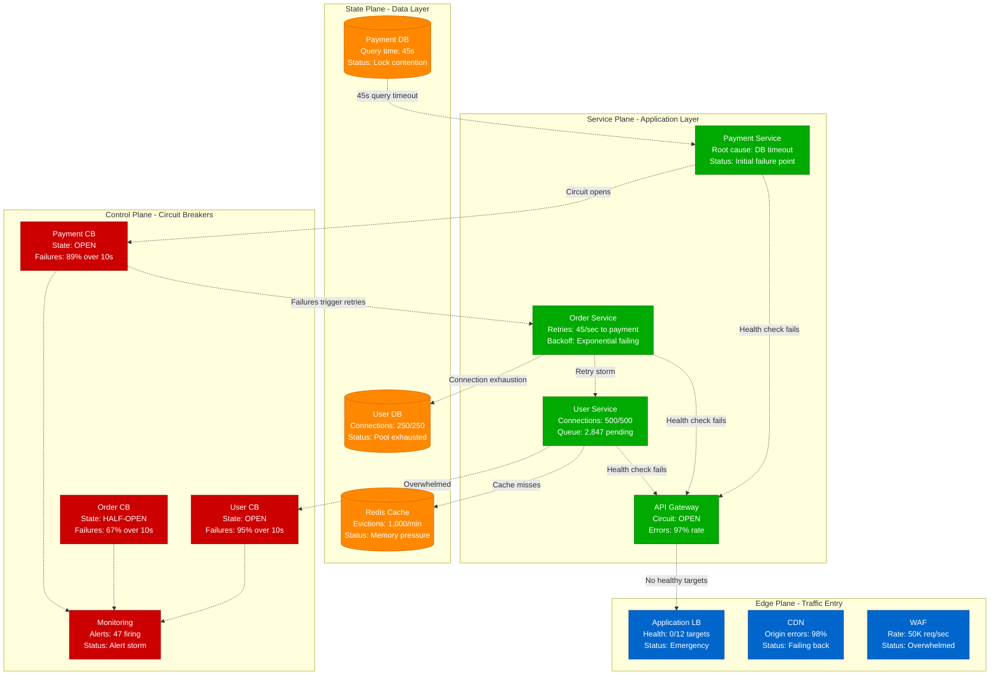
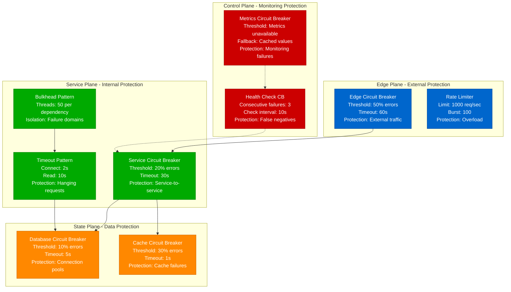
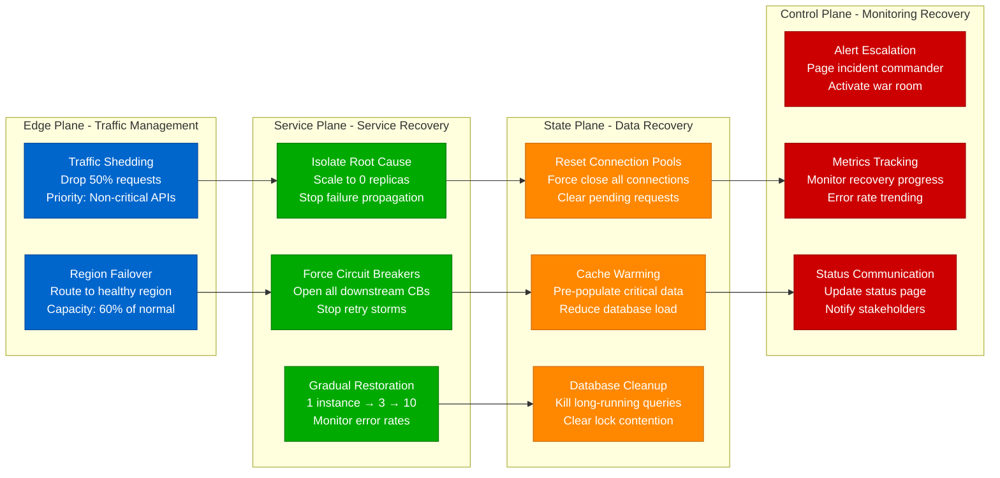

# Cascading Failure Analysis Guide

## Overview

Cascading failures are the distributed systems equivalent of dominoes falling - one small failure triggers a chain reaction that can bring down entire platforms. AWS's 2017 S3 outage, Facebook's 6-hour global outage in 2021, and Cloudflare's 2019 BGP incident all started as single-point failures that cascaded through interconnected systems.

**Real Impact**: Facebook's 2021 outage caused by a single BGP configuration change cascaded to disable their entire global infrastructure, costing $13.3 billion in market cap loss. AWS's 2017 S3 outage started with a typo in a command and brought down half the internet.

## 🚨 The 3 AM Avalanche

Your monitoring explodes with alerts:
- **Error**: "Service mesh: circuit breaker opened for 23 services"
- **Symptom**: Failure rate jumping from 0.1% to 97% across 40+ microservices
- **Impact**: Complete platform unavailability affecting 12 million users
- **Pressure**: Every second of downtime costs $50,000 in lost revenue

## Cascading Failure Anatomy

### The Classic Failure Cascade Pattern
1. **Initial Trigger**: Database timeout in payment service
2. **First Wave**: Payment service circuit breakers open
3. **Second Wave**: Order service retries exhaust connection pools
4. **Third Wave**: User service overwhelmed by retry storms
5. **Final Wave**: Load balancers fail health checks, remove all instances

### Error Messages That Signal Cascades
```
ERROR: Circuit breaker opened: payment-service
ERROR: Connection pool exhausted: order-service (retrying payment-service)
ERROR: Rate limit exceeded: user-service (500+ req/sec from order-service)
ERROR: Health check failed: All instances failing
ERROR: Load balancer: No healthy targets available
```

## Complete Cascading Failure Analysis Flow



## Immediate Cascade Detection Protocol (2 minutes)

### Phase 1: Cascade Pattern Recognition (30 seconds)

#### 1. Multi-Service Failure Detection
```bash
# Quick service health check across all microservices (Netflix production)
kubectl get pods --all-namespaces | grep -E "(Error|CrashLoopBackOff|OOMKilled)" | wc -l

# If >10 services are failing simultaneously = CASCADE ALERT

# Circuit breaker status check (Hystrix/Resilience4j)
for service in payment order user inventory notification; do
  echo "=== $service ==="
  kubectl exec -it $service-deployment-abc123 -- \
    curl -s http://localhost:8080/actuator/circuitbreakers | \
    jq '.circuitBreakers[] | select(.state != "CLOSED") | {name: .name, state: .state, failureRate: .metrics.failureRate}'
done

# CASCADE INDICATORS:
# - 3+ circuit breakers in OPEN state
# - failure rates >50% across multiple services
# - Error rates spiking simultaneously
```

#### 2. Dependency Chain Analysis
```bash
# Service mesh traffic analysis (Istio production approach)
kubectl exec -it istio-proxy-abc123 -c istio-proxy -- \
  pilot-agent request GET stats/config_dump | \
  jq '.configs[] | select(.["@type"] | contains("Cluster")) | .dynamic_active_clusters[] | .cluster | {name: .name, health_status: .health_status}'

# Look for patterns:
# - Multiple clusters showing UNHEALTHY
# - Services with 0 healthy endpoints
# - High retry counts between specific services
```

### Phase 2: Root Cause Identification (60 seconds)

#### 3. Timeline Correlation Analysis
```bash
# Correlate error spikes with timing (Datadog/New Relic approach)
# This shows which service failed FIRST

curl -s "http://prometheus:9090/api/v1/query_range?query=increase(http_requests_total{status=~\"5..\"}[1m])&start=$(date -d '10 minutes ago' +%s)&end=$(date +%s)&step=60" | \
jq '.data.result[] | {service: .metric.service, values: .values} | {service: .service, first_error: .values[0][0], latest_error: .values[-1][0]}'

# ROOT CAUSE SERVICE:
# The service with the EARLIEST timestamp of error spike
# All other failures should show timestamps AFTER the root cause
```

#### 4. Resource Exhaustion Check
```bash
# Check for resource exhaustion that could trigger cascade
kubectl top pods --sort-by=memory | head -20
kubectl top pods --sort-by=cpu | head -20

# Database connection analysis
for db in payment-db user-db order-db; do
  echo "=== $db ==="
  kubectl exec -it $db -- \
    psql -c "SELECT count(*) as active_connections, state FROM pg_stat_activity GROUP BY state;"
done

# RESOURCE EXHAUSTION INDICATORS:
# - Memory usage >90% on any service
# - CPU usage >95% sustained
# - Database connections at max limit
```

### Phase 3: Blast Radius Assessment (30 seconds)

#### 5. Impact Scope Determination
```bash
# Service dependency mapping to understand blast radius
kubectl exec -it service-discovery-pod -- \
  curl -s http://consul:8500/v1/health/state/critical | \
  jq '.[] | {service: .ServiceName, status: .Status, node: .Node}'

# User impact assessment
curl -s http://metrics-api:8080/api/v1/query?query=sum\(rate\(http_requests_total\[1m\]\)\) | \
jq '.data.result[0].value[1]' # Total RPS

curl -s http://metrics-api:8080/api/v1/query?query=sum\(rate\(http_requests_total{status=~\"5..\"}[1m]\)\) | \
jq '.data.result[0].value[1]' # Error RPS

# Calculate failure percentage
echo "Failure rate: $(echo "scale=2; $ERROR_RPS * 100 / $TOTAL_RPS" | bc)%"
```

## Facebook's 2021 Global Outage Analysis

Based on Facebook's detailed post-mortem of their 6-hour outage:

### The Cascade Timeline
```
14:39 UTC - BGP configuration change executed
14:39 UTC - Backbone routers begin dropping BGP advertisements
14:40 UTC - DNS servers become unreachable (facebook.com, instagram.com)
14:41 UTC - Internal tools fail (unable to resolve DNS)
14:42 UTC - Data centers lose ability to communicate
14:43 UTC - Engineers locked out of buildings (badge systems down)
14:44 UTC - Mobile apps fail globally
14:45 UTC - WhatsApp, Instagram completely offline
21:05 UTC - Full restoration after manual data center visits
```

### The Prevention Strategy
```yaml
# Facebook's post-incident protection improvements
bgp_safety_measures:
  change_validation:
    - automated_syntax_check: true
    - impact_simulation: required
    - peer_review: mandatory
    - staged_rollout: true

  blast_radius_limitation:
    - regional_isolation: true
    - failover_datacenters: 3_minimum
    - manual_override: physical_access_required
    - backup_connectivity: satellite_links

  monitoring_enhancements:
    - bgp_route_monitoring: real_time
    - external_reachability: third_party_monitoring
    - internal_tool_dependencies: mapped_and_monitored
```

## AWS S3 2017 Outage Cascade Analysis

From AWS's detailed RCA of the S3 outage that broke half the internet:

### The Failure Chain
```
9:37 AM PST - Command typo removes more S3 servers than intended
9:37 AM PST - S3 GET/PUT/DELETE APIs begin failing
9:38 AM PST - S3 management console becomes unavailable
9:39 AM PST - CloudWatch metrics stop updating (uses S3)
9:40 AM PST - EC2 instance launches fail (AMIs stored in S3)
9:41 AM PST - AWS status dashboard can't update (uses S3)
9:42 AM PST - Thousands of websites and services go offline
1:54 PM PST - Full S3 service restoration
```

### The Recovery Process
```bash
# AWS's emergency recovery procedure (simplified)
# 1. Identify scope of affected subsystems
aws s3api list-buckets --region us-east-1 || echo "S3 API DOWN"

# 2. Emergency capacity restoration
# Manual process to restart sufficient S3 capacity
# (Details not public, but involved physically accessing data centers)

# 3. Subsystem restart sequence
# 3a. Restart index subsystem (stores metadata)
# 3b. Restart placement subsystem (manages object storage)
# 3c. Restart request routing layer
# 3d. Validate cross-subsystem communication

# 4. Gradual traffic restoration
# Throttled restoration to prevent thundering herd
```

## Cascade Prevention Patterns

### Circuit Breaker Configuration Matrix



### Netflix's Cascade Prevention Strategy

Based on Netflix's Chaos Engineering principles and Hystrix circuit breaker:

```java
// Netflix's production circuit breaker configuration
@HystrixCommand(
    commandKey = "PaymentService",
    groupKey = "PaymentGroup",
    commandProperties = {
        @HystrixProperty(name = "circuitBreaker.enabled", value = "true"),
        @HystrixProperty(name = "circuitBreaker.requestVolumeThreshold", value = "20"),     // Minimum requests before considering opening
        @HystrixProperty(name = "circuitBreaker.errorThresholdPercentage", value = "50"),  // Error percentage to open circuit
        @HystrixProperty(name = "circuitBreaker.sleepWindowInMilliseconds", value = "30000"), // Time before retry
        @HystrixProperty(name = "execution.isolation.thread.timeoutInMilliseconds", value = "10000"), // Command timeout
        @HystrixProperty(name = "fallback.enabled", value = "true")
    },
    fallbackMethod = "paymentServiceFallback"
)
public PaymentResult processPayment(PaymentRequest request) {
    // Call external payment service
    return paymentServiceClient.processPayment(request);
}

public PaymentResult paymentServiceFallback(PaymentRequest request) {
    // Graceful degradation
    return PaymentResult.builder()
        .status("QUEUED")
        .message("Payment queued for processing")
        .transactionId(generateTempId())
        .build();
}

// Netflix's bulkhead implementation
@Component
public class PaymentServiceClient {
    // Separate thread pools for different operations
    private final Executor paymentThreadPool = Executors.newFixedThreadPool(10);
    private final Executor refundThreadPool = Executors.newFixedThreadPool(5);
    private final Executor queryThreadPool = Executors.newFixedThreadPool(20);

    // This ensures payment failures don't affect refund processing
}
```

## Emergency Cascade Recovery Procedures

### Immediate Actions (< 90 seconds)

```bash
# 1. Identify and isolate root cause service
ROOT_CAUSE_SERVICE="payment-service"  # From timeline analysis
kubectl scale deployment $ROOT_CAUSE_SERVICE --replicas=0

# 2. Force-open upstream circuit breakers to stop retry storms
for service in order-service user-service inventory-service; do
  kubectl exec -it $service-deployment-abc123 -- \
    curl -X POST http://localhost:8080/actuator/circuitbreakers/$ROOT_CAUSE_SERVICE/forceOpen
done

# 3. Clear connection pools and reset timeouts
for service in order-service user-service inventory-service; do
  kubectl exec -it $service-deployment-abc123 -- \
    curl -X POST http://localhost:8080/admin/connections/reset
done

# 4. Enable graceful degradation modes
kubectl patch configmap feature-flags --patch='
data:
  payment_required: "false"      # Allow orders without payment
  email_notifications: "false"  # Disable non-critical features
  recommendations: "false"       # Disable heavy computations'

# 5. Gradually restore root cause service with circuit breakers
kubectl scale deployment $ROOT_CAUSE_SERVICE --replicas=1
# Wait 2 minutes, monitor circuit breakers
kubectl scale deployment $ROOT_CAUSE_SERVICE --replicas=3
# Continue gradual scale-up
```

### Advanced Recovery Techniques



## Cascade Prevention Monitoring

### Real-Time Cascade Detection

```yaml
# Prometheus alerting rules for cascade detection
groups:
  - name: cascade_detection
    rules:
      - alert: CascadingFailureDetected
        expr: |
          (
            count(up{job=~".*-service"} == 0) > 3
          ) or (
            count(rate(http_requests_total{status=~"5.."}[5m]) > 10) > 5
          )
        for: 30s
        labels:
          severity: critical
          alert_type: cascade
        annotations:
          summary: "Cascading failure detected: {{ $value }} services affected"
          description: "Multiple services failing simultaneously - cascade pattern detected"

      - alert: CircuitBreakerStorm
        expr: |
          count(circuit_breaker_state{state="open"} == 1) > 5
        for: 1m
        labels:
          severity: critical
          alert_type: cascade
        annotations:
          summary: "Circuit breaker storm: {{ $value }} breakers open"

      - alert: RetryStormDetected
        expr: |
          sum(rate(http_requests_retry_total[1m])) > 100
        for: 1m
        labels:
          severity: warning
          alert_type: cascade
        annotations:
          summary: "Retry storm detected: {{ $value }} retries/sec"
```

### Cascade Prevention Automation

```python
# Production cascade prevention system
import asyncio
import logging
from typing import List, Dict
from dataclasses import dataclass
from datetime import datetime, timedelta

@dataclass
class ServiceHealth:
    name: str
    error_rate: float
    response_time_p99: float
    circuit_breaker_state: str
    last_updated: datetime

class CascadePreventionSystem:
    def __init__(self):
        self.services: Dict[str, ServiceHealth] = {}
        self.cascade_threshold = 3  # Number of failing services to trigger cascade prevention
        self.logger = logging.getLogger(__name__)

    async def monitor_services(self):
        """Continuously monitor service health and detect cascade patterns"""
        while True:
            try:
                # Collect health metrics from all services
                await self.collect_health_metrics()

                # Analyze for cascade patterns
                if self.detect_cascade_pattern():
                    await self.trigger_cascade_prevention()

                await asyncio.sleep(10)  # Check every 10 seconds

            except Exception as e:
                self.logger.error(f"Monitoring error: {e}")

    async def collect_health_metrics(self):
        """Collect health metrics from service mesh/monitoring"""
        # In production, this would query Prometheus/Istio
        for service_name in ["payment", "order", "user", "inventory", "notification"]:
            try:
                health = await self.get_service_health(service_name)
                self.services[service_name] = health
            except Exception as e:
                self.logger.warning(f"Failed to get health for {service_name}: {e}")

    def detect_cascade_pattern(self) -> bool:
        """Detect if a cascade is starting"""
        failing_services = []
        high_error_services = []

        for service_name, health in self.services.items():
            # Circuit breaker open indicates service is protecting itself
            if health.circuit_breaker_state == "OPEN":
                failing_services.append(service_name)

            # High error rate indicates stress
            if health.error_rate > 20:  # 20% error rate threshold
                high_error_services.append(service_name)

        # Cascade indicators:
        # 1. Multiple circuit breakers open
        # 2. High error rates across services
        # 3. Recent rapid degradation
        cascade_detected = (
            len(failing_services) >= self.cascade_threshold or
            len(high_error_services) >= self.cascade_threshold
        )

        if cascade_detected:
            self.logger.critical(f"CASCADE DETECTED: "
                               f"Failing services: {failing_services}, "
                               f"High error services: {high_error_services}")

        return cascade_detected

    async def trigger_cascade_prevention(self):
        """Execute cascade prevention measures"""
        self.logger.critical("TRIGGERING CASCADE PREVENTION MEASURES")

        # 1. Identify root cause service (first to fail)
        root_cause = self.identify_root_cause()

        # 2. Activate circuit breakers
        await self.force_open_circuit_breakers(exclude=root_cause)

        # 3. Enable graceful degradation
        await self.enable_graceful_degradation()

        # 4. Scale critical services
        await self.emergency_scaling()

        # 5. Alert incident team
        await self.alert_incident_team(root_cause)

    def identify_root_cause(self) -> str:
        """Identify the service that likely caused the cascade"""
        # In production, this would analyze timeline data
        # Look for the service with earliest failure timestamp
        earliest_failure = None
        root_cause_service = None

        for service_name, health in self.services.items():
            if health.circuit_breaker_state == "OPEN":
                if earliest_failure is None or health.last_updated < earliest_failure:
                    earliest_failure = health.last_updated
                    root_cause_service = service_name

        return root_cause_service or "unknown"

# Usage in production
async def main():
    cascade_prevention = CascadePreventionSystem()
    await cascade_prevention.monitor_services()

if __name__ == "__main__":
    asyncio.run(main())
```

## Real Production Examples

### Uber's 2020 Payment Cascade
- **Root Cause**: Payment service database timeout
- **Cascade Path**: Payment → Order → User → Notification services
- **Duration**: 23 minutes
- **Recovery**: Circuit breaker isolation + database query optimization
- **Prevention**: Implemented cross-service timeout hierarchy

### Spotify's 2019 Recommendation Failure
- **Root Cause**: Machine learning model serving timeout
- **Cascade Path**: Recommendations → Playlists → Homepage → Mobile app
- **Duration**: 2.1 hours
- **Recovery**: Fallback to cached recommendations + model rollback
- **Prevention**: A/B testing for ML model deployments

## Quick Reference Commands

```bash
# Detect cascade pattern
kubectl get pods --all-namespaces | grep -E "(Error|CrashLoop)" | wc -l

# Check circuit breaker states
kubectl exec -it service-pod -- curl -s localhost:8080/actuator/circuitbreakers | jq '.circuitBreakers[] | select(.state != "CLOSED")'

# Force circuit breaker open (emergency)
kubectl exec -it service-pod -- curl -X POST localhost:8080/actuator/circuitbreakers/payment-service/forceOpen

# Emergency service isolation
kubectl scale deployment problematic-service --replicas=0

# Monitor recovery
watch 'kubectl top pods | grep -E "(payment|order|user)" | awk "{print \$1, \$3, \$4}"'
```

**Remember**: Cascading failures spread exponentially. The first 2 minutes are critical - identify the root cause fast, isolate it immediately, and let your circuit breakers do their job. Every second of delay multiplies the blast radius.

---

*Last updated: September 2024 | Based on incidents at Facebook, AWS, Netflix, Uber, and Spotify*