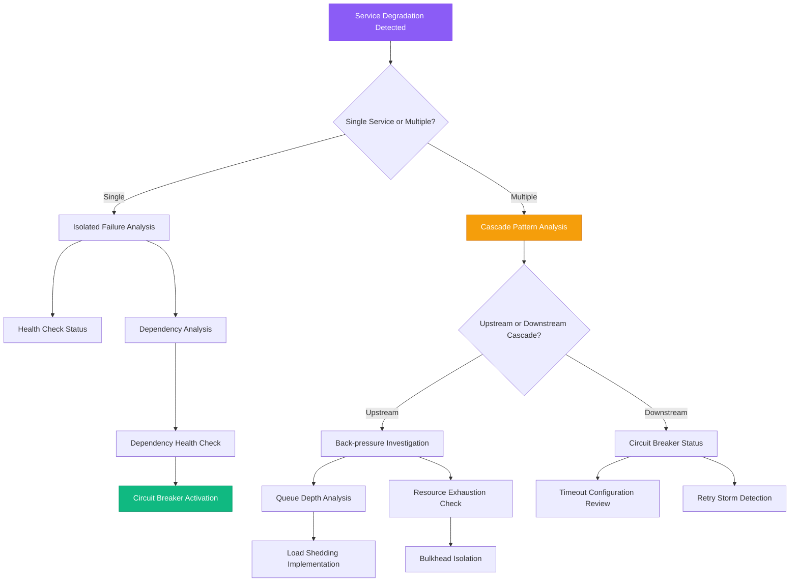

# Cascading Failure Prevention Guide

## Overview

Cascading failures are among the most devastating incidents in distributed systems, where a single component failure triggers a domino effect that brings down entire service chains. This guide provides systematic approaches used by engineering teams at Netflix, Amazon, and Google to detect, prevent, and recover from cascading failures.

**Time to Resolution**: 5-15 minutes for circuit breaker activation, 1-4 hours for full cascade recovery

## Decision Tree



## Immediate Triage Commands (First 5 Minutes)

### 1. Service Health Overview
```bash
# Check health endpoints across all services
services=("user-service" "order-service" "payment-service" "inventory-service")
for service in "${services[@]}"; do
    echo "=== $service ==="
    curl -s -w "%{http_code} %{time_total}s\n" "http://$service:8080/health" -o /dev/null --max-time 5 || echo "FAILED"
done

# Kubernetes pod status across namespaces
kubectl get pods --all-namespaces | grep -E "(Error|CrashLoopBackOff|Pending)"

# Docker service status
docker service ls | grep -v "1/1"
```

### 2. Circuit Breaker Status Check
```bash
# Check circuit breaker states (assuming Spring Boot Actuator)
services=("user-service" "order-service" "payment-service")
for service in "${services[@]}"; do
    echo "=== $service Circuit Breakers ==="
    curl -s "http://$service:8080/actuator/circuitbreakers" | jq '.circuitBreakers[] | {name: .name, state: .state, failureRate: .metrics.failureRate}'
done

# Hystrix dashboard equivalent
curl -s "http://hystrix-dashboard:8080/hystrix/monitor?stream=http://service:8080/actuator/hystrix.stream"
```

### 3. Traffic Flow Analysis
```bash
# Network connections by service
netstat -tulpn | grep :8080 | wc -l

# Load balancer status (nginx example)
curl -s "http://load-balancer/status" | grep -E "(upstream|server.*backup)"

# API Gateway request routing
curl -s "http://api-gateway:8080/actuator/metrics/gateway.requests" | jq '.measurements[0].value'
```

## Circuit Breaker Implementation and Tuning

### 1. Java/Spring Boot Circuit Breaker Configuration
```java
// Resilience4j circuit breaker configuration
@Configuration
public class CircuitBreakerConfig {

    @Bean
    public CircuitBreaker paymentServiceCircuitBreaker() {
        return CircuitBreaker.ofDefaults("paymentService",
            CircuitBreakerConfig.custom()
                .failureRateThreshold(50)              // Open when 50% of requests fail
                .waitDurationInOpenState(Duration.ofSeconds(30)) // Stay open for 30 seconds
                .slidingWindowSize(20)                 // Consider last 20 requests
                .minimumNumberOfCalls(5)               // Need at least 5 calls to calculate failure rate
                .permittedNumberOfCallsInHalfOpenState(3) // Allow 3 test calls in half-open
                .slowCallRateThreshold(80)             // Consider calls >2s as slow
                .slowCallDurationThreshold(Duration.ofSeconds(2))
                .build());
    }

    @Bean
    public CircuitBreakerRegistry circuitBreakerRegistry() {
        return CircuitBreakerRegistry.of(
            Map.of(
                "default", CircuitBreakerConfig.custom()
                    .failureRateThreshold(50)
                    .waitDurationInOpenState(Duration.ofSeconds(60))
                    .slidingWindowSize(100)
                    .build(),
                "fast-fail", CircuitBreakerConfig.custom()
                    .failureRateThreshold(30)  // More sensitive for critical services
                    .waitDurationInOpenState(Duration.ofSeconds(15))
                    .build()
            )
        );
    }
}

// Service implementation with circuit breaker
@Service
public class PaymentService {

    private final CircuitBreaker circuitBreaker;
    private final PaymentClient paymentClient;

    public PaymentService(CircuitBreaker circuitBreaker, PaymentClient paymentClient) {
        this.circuitBreaker = circuitBreaker;
        this.paymentClient = paymentClient;
    }

    public PaymentResult processPayment(PaymentRequest request) {
        Supplier<PaymentResult> decoratedSupplier = CircuitBreaker
            .decorateSupplier(circuitBreaker, () -> {
                return paymentClient.processPayment(request);
            });

        return Try.ofSupplier(decoratedSupplier)
            .recover(throwable -> {
                // Fallback logic
                if (throwable instanceof CallNotPermittedException) {
                    // Circuit breaker is open
                    return PaymentResult.failure("Payment service temporarily unavailable");
                }
                return PaymentResult.failure("Payment processing failed: " + throwable.getMessage());
            }).get();
    }
}

// Circuit breaker event monitoring
@Component
public class CircuitBreakerEventListener {

    @EventListener
    public void onCircuitBreakerEvent(CircuitBreakerOnStateTransitionEvent event) {
        log.warn("Circuit breaker {} transitioned from {} to {}",
            event.getCircuitBreakerName(),
            event.getStateTransition().getFromState(),
            event.getStateTransition().getToState());

        // Send alert to monitoring system
        alertingService.sendAlert(String.format(
            "Circuit breaker %s is now %s",
            event.getCircuitBreakerName(),
            event.getStateTransition().getToState()
        ));
    }
}
```

### 2. Go Circuit Breaker Implementation
```go
package circuitbreaker

import (
    "context"
    "errors"
    "sync"
    "time"
)

type State int

const (
    StateClosed State = iota
    StateOpen
    StateHalfOpen
)

type CircuitBreaker struct {
    name           string
    maxRequests    uint32
    interval       time.Duration
    timeout        time.Duration
    threshold      uint32

    mutex          sync.Mutex
    state          State
    generation     uint64
    counts         Counts
    expiry         time.Time
}

type Counts struct {
    Requests             uint32
    TotalSuccesses       uint32
    TotalFailures        uint32
    ConsecutiveSuccesses uint32
    ConsecutiveFailures  uint32
}

func NewCircuitBreaker(settings Settings) *CircuitBreaker {
    cb := &CircuitBreaker{
        name:        settings.Name,
        maxRequests: settings.MaxRequests,
        interval:    settings.Interval,
        timeout:     settings.Timeout,
        threshold:   settings.Threshold,
    }

    cb.toNewGeneration(time.Now())
    return cb
}

func (cb *CircuitBreaker) Execute(req func() (interface{}, error)) (interface{}, error) {
    generation, err := cb.beforeRequest()
    if err != nil {
        return nil, err
    }

    defer func() {
        e := recover()
        if e != nil {
            cb.afterRequest(generation, false)
            panic(e)
        }
    }()

    result, err := req()
    cb.afterRequest(generation, err == nil)
    return result, err
}

func (cb *CircuitBreaker) beforeRequest() (uint64, error) {
    cb.mutex.Lock()
    defer cb.mutex.Unlock()

    now := time.Now()
    state, generation := cb.currentState(now)

    if state == StateOpen {
        return generation, errors.New("circuit breaker is open")
    } else if state == StateHalfOpen && cb.counts.Requests >= cb.maxRequests {
        return generation, errors.New("circuit breaker is half-open with max requests")
    }

    cb.counts.onRequest()
    return generation, nil
}

func (cb *CircuitBreaker) afterRequest(before uint64, success bool) {
    cb.mutex.Lock()
    defer cb.mutex.Unlock()

    now := time.Now()
    state, generation := cb.currentState(now)
    if generation != before {
        return
    }

    if success {
        cb.onSuccess(state, now)
    } else {
        cb.onFailure(state, now)
    }
}

func (cb *CircuitBreaker) onSuccess(state State, now time.Time) {
    cb.counts.onSuccess()

    if state == StateHalfOpen {
        cb.setState(StateClosed, now)
    }
}

func (cb *CircuitBreaker) onFailure(state State, now time.Time) {
    cb.counts.onFailure()

    switch state {
    case StateClosed:
        if cb.counts.ConsecutiveFailures >= cb.threshold {
            cb.setState(StateOpen, now)
        }
    case StateHalfOpen:
        cb.setState(StateOpen, now)
    }
}

func (cb *CircuitBreaker) currentState(now time.Time) (State, uint64) {
    switch cb.state {
    case StateClosed:
        if !cb.expiry.IsZero() && cb.expiry.Before(now) {
            cb.toNewGeneration(now)
        }
    case StateOpen:
        if cb.expiry.Before(now) {
            cb.setState(StateHalfOpen, now)
        }
    }
    return cb.state, cb.generation
}

func (cb *CircuitBreaker) setState(state State, now time.Time) {
    if cb.state == state {
        return
    }

    prev := cb.state
    cb.state = state

    cb.toNewGeneration(now)

    if state == StateOpen {
        cb.expiry = now.Add(cb.timeout)
    } else {
        cb.expiry = time.Time{}
    }

    // Log state transition
    log.Printf("Circuit breaker %s: %v -> %v", cb.name, prev, state)
}

func (cb *CircuitBreaker) toNewGeneration(now time.Time) {
    cb.generation++
    cb.counts = Counts{}

    if cb.state == StateClosed {
        if cb.interval == 0 {
            cb.expiry = time.Time{}
        } else {
            cb.expiry = now.Add(cb.interval)
        }
    }
}

// Usage example
func main() {
    settings := Settings{
        Name:        "payment-service",
        MaxRequests: 3,
        Interval:    time.Second * 10,
        Timeout:     time.Second * 60,
        Threshold:   5,
    }

    cb := NewCircuitBreaker(settings)

    // Use circuit breaker
    result, err := cb.Execute(func() (interface{}, error) {
        return callPaymentService()
    })

    if err != nil {
        log.Printf("Circuit breaker prevented call or call failed: %v", err)
    } else {
        log.Printf("Call succeeded: %v", result)
    }
}
```

### 3. Python Circuit Breaker Implementation
```python
import time
import threading
from enum import Enum
from typing import Callable, Any, Optional
from dataclasses import dataclass
import logging

class CircuitBreakerState(Enum):
    CLOSED = "CLOSED"
    OPEN = "OPEN"
    HALF_OPEN = "HALF_OPEN"

@dataclass
class CircuitBreakerConfig:
    failure_threshold: int = 5
    recovery_timeout: int = 60  # seconds
    expected_exception: type = Exception
    name: str = "CircuitBreaker"

class CircuitBreaker:
    def __init__(self, config: CircuitBreakerConfig):
        self.config = config
        self.state = CircuitBreakerState.CLOSED
        self.failure_count = 0
        self.success_count = 0
        self.next_attempt = time.time()
        self.lock = threading.RLock()

    def __call__(self, func: Callable) -> Callable:
        def wrapper(*args, **kwargs):
            return self.call(func, *args, **kwargs)
        return wrapper

    def call(self, func: Callable, *args, **kwargs) -> Any:
        with self.lock:
            current_state = self._current_state()

            if current_state == CircuitBreakerState.OPEN:
                raise CircuitBreakerOpenException(
                    f"Circuit breaker {self.config.name} is OPEN"
                )

            if current_state == CircuitBreakerState.HALF_OPEN:
                return self._attempt_reset(func, *args, **kwargs)
            else:
                return self._call_function(func, *args, **kwargs)

    def _current_state(self) -> CircuitBreakerState:
        if self.state == CircuitBreakerState.OPEN and self.next_attempt <= time.time():
            self.state = CircuitBreakerState.HALF_OPEN
            logging.info(f"Circuit breaker {self.config.name} moved to HALF_OPEN")
        return self.state

    def _attempt_reset(self, func: Callable, *args, **kwargs) -> Any:
        try:
            result = func(*args, **kwargs)
            self._record_success()
            return result
        except self.config.expected_exception as e:
            self._record_failure()
            raise e

    def _call_function(self, func: Callable, *args, **kwargs) -> Any:
        try:
            result = func(*args, **kwargs)
            self._record_success()
            return result
        except self.config.expected_exception as e:
            self._record_failure()
            raise e

    def _record_success(self):
        self.failure_count = 0
        self.success_count += 1
        if self.state == CircuitBreakerState.HALF_OPEN:
            self.state = CircuitBreakerState.CLOSED
            logging.info(f"Circuit breaker {self.config.name} RESET to CLOSED")

    def _record_failure(self):
        self.failure_count += 1
        self.success_count = 0

        if self.failure_count >= self.config.failure_threshold:
            self.state = CircuitBreakerState.OPEN
            self.next_attempt = time.time() + self.config.recovery_timeout
            logging.warning(
                f"Circuit breaker {self.config.name} TRIPPED to OPEN "
                f"(failures: {self.failure_count})"
            )

    def get_status(self) -> dict:
        return {
            'name': self.config.name,
            'state': self.state.value,
            'failure_count': self.failure_count,
            'success_count': self.success_count,
            'next_attempt': self.next_attempt if self.state == CircuitBreakerState.OPEN else None
        }

class CircuitBreakerOpenException(Exception):
    pass

# Usage example with monitoring
class ServiceClient:
    def __init__(self):
        self.circuit_breaker = CircuitBreaker(
            CircuitBreakerConfig(
                failure_threshold=3,
                recovery_timeout=30,
                name="payment-service"
            )
        )

    def call_payment_service(self, payment_data):
        try:
            return self.circuit_breaker.call(self._make_payment_call, payment_data)
        except CircuitBreakerOpenException:
            # Fallback logic
            return {'status': 'failed', 'reason': 'Service temporarily unavailable'}

    def _make_payment_call(self, payment_data):
        # Simulate API call
        import requests
        response = requests.post('http://payment-service/process', json=payment_data, timeout=5)
        if response.status_code != 200:
            raise Exception(f"Payment service error: {response.status_code}")
        return response.json()

    def get_circuit_breaker_status(self):
        return self.circuit_breaker.get_status()
```

## Bulkhead Pattern Implementation

### 1. Thread Pool Isolation
```java
// Separate thread pools for different service calls
@Configuration
public class BulkheadConfig {

    @Bean("paymentThreadPool")
    public TaskExecutor paymentServiceExecutor() {
        ThreadPoolTaskExecutor executor = new ThreadPoolTaskExecutor();
        executor.setCorePoolSize(5);
        executor.setMaxPoolSize(10);
        executor.setQueueCapacity(25);
        executor.setThreadNamePrefix("Payment-");
        executor.setRejectedExecutionHandler(new ThreadPoolExecutor.CallerRunsPolicy());
        executor.initialize();
        return executor;
    }

    @Bean("inventoryThreadPool")
    public TaskExecutor inventoryServiceExecutor() {
        ThreadPoolTaskExecutor executor = new ThreadPoolTaskExecutor();
        executor.setCorePoolSize(3);
        executor.setMaxPoolSize(8);
        executor.setQueueCapacity(15);
        executor.setThreadNamePrefix("Inventory-");
        executor.setRejectedExecutionHandler(new ThreadPoolExecutor.AbortPolicy());
        executor.initialize();
        return executor;
    }
}

@Service
public class OrderService {

    @Async("paymentThreadPool")
    public CompletableFuture<PaymentResult> processPayment(PaymentRequest request) {
        return CompletableFuture.completedFuture(paymentService.process(request));
    }

    @Async("inventoryThreadPool")
    public CompletableFuture<InventoryResult> checkInventory(String productId) {
        return CompletableFuture.completedFuture(inventoryService.check(productId));
    }
}
```

### 2. Connection Pool Isolation
```java
// Separate connection pools for different databases
@Configuration
public class DataSourceConfig {

    @Bean("userDataSource")
    public DataSource userDataSource() {
        HikariConfig config = new HikariConfig();
        config.setJdbcUrl("jdbc:postgresql://user-db:5432/users");
        config.setUsername("user_service");
        config.setPassword("password");
        config.setMaximumPoolSize(20);
        config.setMinimumIdle(5);
        config.setConnectionTimeout(30000);
        config.setIdleTimeout(300000);
        return new HikariDataSource(config);
    }

    @Bean("orderDataSource")
    public DataSource orderDataSource() {
        HikariConfig config = new HikariConfig();
        config.setJdbcUrl("jdbc:postgresql://order-db:5432/orders");
        config.setUsername("order_service");
        config.setPassword("password");
        config.setMaximumPoolSize(50);  // Higher capacity for order service
        config.setMinimumIdle(10);
        config.setConnectionTimeout(30000);
        config.setIdleTimeout(300000);
        return new HikariDataSource(config);
    }
}
```

## Back-pressure Handling

### 1. Queue-Based Back-pressure
```java
// Reactive back-pressure with Spring WebFlux
@Service
public class OrderProcessingService {

    private final Sinks.Many<OrderRequest> orderSink;
    private final Flux<OrderRequest> orderStream;

    public OrderProcessingService() {
        this.orderSink = Sinks.many().multicast().onBackpressureBuffer(1000);
        this.orderStream = orderSink.asFlux()
            .onBackpressureDrop(order -> {
                log.warn("Dropping order {} due to back-pressure", order.getId());
                metricsService.incrementCounter("orders.dropped");
            })
            .flatMap(this::processOrder, 10) // Concurrency of 10
            .doOnError(error -> log.error("Order processing error", error))
            .retry(3);

        // Start processing orders
        orderStream.subscribe(
            processedOrder -> log.info("Order processed: {}", processedOrder.getId()),
            error -> log.error("Fatal order processing error", error)
        );
    }

    public void submitOrder(OrderRequest order) {
        Sinks.EmitResult result = orderSink.tryEmitNext(order);

        if (result == Sinks.EmitResult.FAIL_OVERFLOW) {
            throw new ServiceUnavailableException("Order processing queue full");
        } else if (result.isFailure()) {
            throw new RuntimeException("Failed to submit order: " + result);
        }
    }

    private Mono<ProcessedOrder> processOrder(OrderRequest order) {
        return Mono.fromCallable(() -> {
            // Simulate order processing
            Thread.sleep(100);
            return new ProcessedOrder(order.getId(), "completed");
        }).subscribeOn(Schedulers.boundedElastic());
    }
}
```

### 2. Load Shedding Implementation
```python
import time
import threading
from collections import deque
from typing import Callable, Any

class LoadShedder:
    def __init__(self, max_queue_size: int = 1000, max_processing_time: float = 1.0):
        self.max_queue_size = max_queue_size
        self.max_processing_time = max_processing_time
        self.request_queue = deque()
        self.processing_times = deque(maxlen=100)  # Keep last 100 processing times
        self.lock = threading.RLock()
        self.dropped_requests = 0
        self.processed_requests = 0

    def should_accept_request(self) -> bool:
        with self.lock:
            # Check queue size
            if len(self.request_queue) >= self.max_queue_size:
                return False

            # Check average processing time
            if len(self.processing_times) > 10:
                avg_processing_time = sum(self.processing_times) / len(self.processing_times)
                if avg_processing_time > self.max_processing_time:
                    return False

            return True

    def process_request(self, request_handler: Callable, *args, **kwargs) -> Any:
        if not self.should_accept_request():
            self.dropped_requests += 1
            raise Exception("Request dropped due to load shedding")

        start_time = time.time()
        try:
            with self.lock:
                self.request_queue.append((request_handler, args, kwargs))

            # Process request
            result = request_handler(*args, **kwargs)

            processing_time = time.time() - start_time
            with self.lock:
                self.processing_times.append(processing_time)
                self.processed_requests += 1
                if self.request_queue:
                    self.request_queue.popleft()

            return result
        except Exception as e:
            processing_time = time.time() - start_time
            with self.lock:
                self.processing_times.append(processing_time)
                if self.request_queue:
                    self.request_queue.popleft()
            raise e

    def get_metrics(self) -> dict:
        with self.lock:
            avg_processing_time = sum(self.processing_times) / len(self.processing_times) if self.processing_times else 0
            return {
                'queue_size': len(self.request_queue),
                'max_queue_size': self.max_queue_size,
                'avg_processing_time': avg_processing_time,
                'dropped_requests': self.dropped_requests,
                'processed_requests': self.processed_requests,
                'drop_rate': self.dropped_requests / (self.dropped_requests + self.processed_requests) if self.processed_requests > 0 else 0
            }

# Usage with Flask application
from flask import Flask, jsonify, request
import requests

app = Flask(__name__)
load_shedder = LoadShedder(max_queue_size=100, max_processing_time=0.5)

@app.route('/api/orders', methods=['POST'])
def create_order():
    try:
        def process_order():
            # Simulate order processing
            time.sleep(0.1)
            return {'status': 'success', 'order_id': '12345'}

        result = load_shedder.process_request(process_order)
        return jsonify(result)
    except Exception as e:
        return jsonify({'error': str(e)}), 503

@app.route('/metrics')
def metrics():
    return jsonify(load_shedder.get_metrics())
```

## Production Case Studies

### Case Study 1: Netflix - Microservice Cascade Prevention

**Problem**: Video encoding service failure caused cascade affecting recommendation, user profiles, and search services

**Investigation Process**:
1. **Circuit breaker analysis** showed multiple services failing simultaneously
2. **Dependency mapping** revealed tight coupling through synchronous calls
3. **Timeout configuration** analysis showed inadequate failure isolation

**Commands Used**:
```bash
# Circuit breaker status across all services
kubectl get pods -l app=microservice -o jsonpath='{range .items[*]}{.metadata.name}{"\t"}'
for pod in $(kubectl get pods -l app=microservice -o jsonpath='{.items[*].metadata.name}'); do
    echo "=== $pod ==="
    kubectl exec $pod -- curl -s localhost:8080/actuator/circuitbreakers | jq '.circuitBreakers[] | {name, state}'
done

# Service dependency health check
curl -s http://service-mesh-proxy:15000/clusters | grep -E "(health_flags|priority)"

# Timeout and retry configuration audit
grep -r "timeout\|retry" /etc/kubernetes/manifests/ | grep -E "(connect|read|circuit)"
```

**Resolution**: Implemented proper circuit breakers, added bulkhead isolation, introduced async processing
**Time to Resolution**: 6 hours

### Case Study 2: Amazon - Black Friday Cascade Recovery

**Problem**: Payment service overload triggered cascading failures across order processing, inventory, and shipping services

**Root Cause**: Inadequate circuit breaker configuration and missing load shedding

**Investigation Commands**:
```bash
# Load balancer upstream status
curl -s http://internal-lb/nginx_status | grep -E "(upstream|server)"

# Service mesh traffic distribution
istioctl proxy-config cluster payment-service.default | grep -E "(HEALTHY|UNHEALTHY)"

# Circuit breaker metrics
curl -s http://payment-service:8080/actuator/prometheus | grep circuitbreaker
```

**Key Findings**:
- Circuit breaker threshold too high (90% failure rate)
- No load shedding mechanism
- Synchronous service calls without proper timeouts

**Resolution**: Lowered circuit breaker thresholds, implemented queue-based load shedding, added service mesh retry policies
**Time to Resolution**: 4 hours

### Case Study 3: Uber - Ride Matching Service Cascade

**Problem**: Driver location service failure caused cascading issues in ride matching, pricing, and ETAs

**Root Cause**: Bulkhead isolation failure - shared thread pool exhaustion

**Investigation Process**:
```bash
# Thread pool analysis
jstack $(pgrep java) | grep -A 10 -B 5 "location-service"
curl http://ride-matching:8080/actuator/metrics/executor | jq '.availableMeasurements'

# Service mesh retry storm detection
kubectl logs -f istio-proxy -c istio-proxy | grep -E "retry|timeout"
```

**Resolution**: Implemented separate thread pools for each service dependency, added proper circuit breakers
**Time to Resolution**: 3 hours

## Automated Cascade Detection

### 1. Cascade Detection Algorithm
```python
import networkx as nx
from typing import Dict, List, Set
from dataclasses import dataclass
from datetime import datetime, timedelta

@dataclass
class ServiceHealth:
    name: str
    healthy: bool
    error_rate: float
    response_time: float
    timestamp: datetime

class CascadeDetector:
    def __init__(self):
        self.service_graph = nx.DiGraph()
        self.health_history = {}

    def add_service_dependency(self, from_service: str, to_service: str):
        """Add dependency relationship between services"""
        self.service_graph.add_edge(from_service, to_service)

    def update_service_health(self, health: ServiceHealth):
        """Update health status for a service"""
        if health.name not in self.health_history:
            self.health_history[health.name] = []

        self.health_history[health.name].append(health)

        # Keep only last hour of data
        cutoff = datetime.now() - timedelta(hours=1)
        self.health_history[health.name] = [
            h for h in self.health_history[health.name]
            if h.timestamp > cutoff
        ]

    def detect_cascading_failure(self) -> Dict[str, List[str]]:
        """Detect potential cascading failures"""
        cascades = {}
        unhealthy_services = set()

        # Identify currently unhealthy services
        for service, history in self.health_history.items():
            if history and not history[-1].healthy:
                unhealthy_services.add(service)

        # For each unhealthy service, find potential cascade paths
        for unhealthy_service in unhealthy_services:
            cascade_path = self._find_cascade_path(unhealthy_service)
            if len(cascade_path) > 1:
                cascades[unhealthy_service] = cascade_path

        return cascades

    def _find_cascade_path(self, start_service: str) -> List[str]:
        """Find services that could be affected by cascade from start_service"""
        affected_services = []

        # Use DFS to find all services that depend on start_service
        visited = set()
        stack = [start_service]

        while stack:
            service = stack.pop()
            if service in visited:
                continue

            visited.add(service)
            affected_services.append(service)

            # Add services that depend on current service
            for dependent in self.service_graph.predecessors(service):
                if dependent not in visited:
                    # Check if dependent service is showing signs of stress
                    if self._is_service_stressed(dependent):
                        stack.append(dependent)

        return affected_services

    def _is_service_stressed(self, service: str) -> bool:
        """Check if service is showing signs of stress (leading indicator)"""
        if service not in self.health_history:
            return False

        recent_health = self.health_history[service][-5:]  # Last 5 measurements
        if len(recent_health) < 3:
            return False

        # Check for increasing error rate
        error_rates = [h.error_rate for h in recent_health]
        if len(error_rates) >= 3 and error_rates[-1] > error_rates[-3] * 1.5:
            return True

        # Check for increasing response time
        response_times = [h.response_time for h in recent_health]
        if len(response_times) >= 3 and response_times[-1] > response_times[-3] * 2:
            return True

        return False

    def get_cascade_risk_score(self, service: str) -> float:
        """Calculate risk score for cascade originating from this service"""
        if service not in self.service_graph:
            return 0.0

        # Number of services that would be affected
        cascade_size = len(self._find_cascade_path(service))

        # Service criticality (based on number of dependencies)
        dependency_count = len(list(self.service_graph.predecessors(service)))

        # Current health status
        health_score = 1.0
        if service in self.health_history and self.health_history[service]:
            latest_health = self.health_history[service][-1]
            health_score = latest_health.error_rate + (latest_health.response_time / 1000)

        return cascade_size * dependency_count * health_score

# Usage example
detector = CascadeDetector()

# Build service dependency graph
detector.add_service_dependency("payment-service", "order-service")
detector.add_service_dependency("inventory-service", "order-service")
detector.add_service_dependency("user-service", "order-service")
detector.add_service_dependency("order-service", "api-gateway")

# Update service health
detector.update_service_health(ServiceHealth(
    name="payment-service",
    healthy=False,
    error_rate=0.15,
    response_time=2500,
    timestamp=datetime.now()
))

# Detect cascades
cascades = detector.detect_cascading_failure()
for origin, affected in cascades.items():
    print(f"Potential cascade from {origin}: {' -> '.join(affected)}")

# Get risk scores
for service in ["payment-service", "order-service", "api-gateway"]:
    risk = detector.get_cascade_risk_score(service)
    print(f"{service} cascade risk score: {risk:.2f}")
```

### 2. Automated Circuit Breaker Management
```python
class CircuitBreakerManager:
    def __init__(self):
        self.circuit_breakers = {}
        self.cascade_detector = CascadeDetector()

    def register_circuit_breaker(self, name: str, cb: CircuitBreaker):
        self.circuit_breakers[name] = cb

    def emergency_open_circuit_breakers(self, cascade_origin: str):
        """Automatically open circuit breakers to prevent cascade"""
        affected_services = self.cascade_detector._find_cascade_path(cascade_origin)

        for service in affected_services:
            if service in self.circuit_breakers:
                cb = self.circuit_breakers[service]
                if cb.state != CircuitBreakerState.OPEN:
                    # Force open the circuit breaker
                    cb.state = CircuitBreakerState.OPEN
                    cb.next_attempt = time.time() + 300  # 5 minutes
                    print(f"Emergency opened circuit breaker for {service}")

    def gradual_recovery(self):
        """Gradually recover from cascade by testing least critical services first"""
        recovery_order = sorted(
            self.circuit_breakers.keys(),
            key=lambda s: self.cascade_detector.get_cascade_risk_score(s)
        )

        for service in recovery_order:
            cb = self.circuit_breakers[service]
            if cb.state == CircuitBreakerState.OPEN:
                # Test if service is ready for recovery
                if self._test_service_recovery(service):
                    cb.state = CircuitBreakerState.HALF_OPEN
                    print(f"Attempting recovery for {service}")
                    break  # Only recover one service at a time

    def _test_service_recovery(self, service: str) -> bool:
        """Test if service is ready for recovery"""
        # Implementation would check service health endpoints
        # For now, return True after some time has passed
        return time.time() > time.time() + 300  # Simple 5-minute cooldown
```

## 3 AM Debugging Checklist

When you're called at 3 AM for cascading failures:

### First 2 Minutes
- [ ] Check circuit breaker dashboard for multiple open breakers
- [ ] Verify which services are currently healthy vs unhealthy
- [ ] Look for common failure patterns or timestamps
- [ ] Check if this correlates with recent deployments

### Minutes 2-5
- [ ] Identify the cascade origin service (first to fail)
- [ ] Open additional circuit breakers if cascade is ongoing
- [ ] Check load balancer and service mesh health
- [ ] Verify database and external service connectivity

### Minutes 5-15
- [ ] Implement emergency load shedding if needed
- [ ] Review timeout and retry configurations
- [ ] Check for resource exhaustion (memory, connections, threads)
- [ ] Begin gradual service recovery starting with least critical

### If Still Fighting Cascades After 15 Minutes
- [ ] Escalate to senior engineer and service owners
- [ ] Consider more aggressive circuit breaker settings
- [ ] Implement manual traffic routing if available
- [ ] Document cascade pattern for post-incident analysis

## Cascade Prevention Metrics and SLOs

### Key Metrics to Track
- **Circuit breaker state changes** per service
- **Service dependency health scores**
- **Cascade risk scores** by service
- **Mean time to cascade detection** (MTTCD)
- **Mean time to cascade recovery** (MTTCR)

### Example SLO Configuration
```yaml
cascade_prevention_slos:
  - name: "Circuit Breaker Response Time"
    description: "Circuit breakers open within 30 seconds of service failure"
    metric: "circuit_breaker_state_change_duration"
    target: 30  # seconds
    window: "5m"

  - name: "Cascade Prevention Rate"
    description: "99% of single service failures don't cause cascades"
    metric: "cascades_prevented / single_service_failures"
    target: 0.99
    window: "1h"
```

**Remember**: Cascading failures are often the result of architectural coupling and inadequate isolation. While reactive measures can limit damage, proactive design with proper bulkheads, circuit breakers, and back-pressure handling is essential for resilient systems.

This guide represents battle-tested strategies from teams managing thousands of microservices processing millions of requests per second.