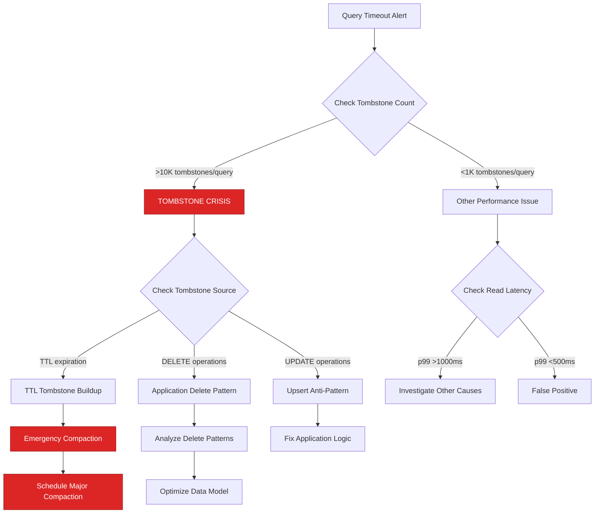
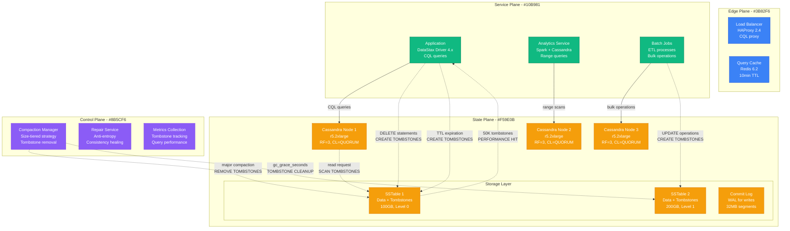
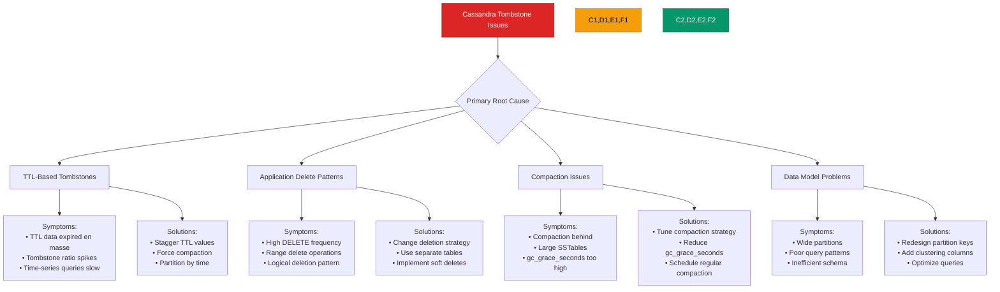
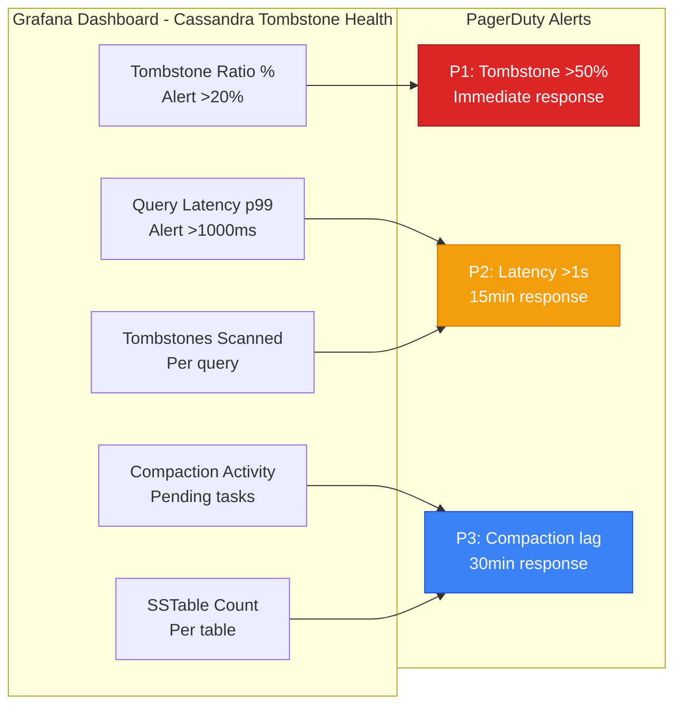
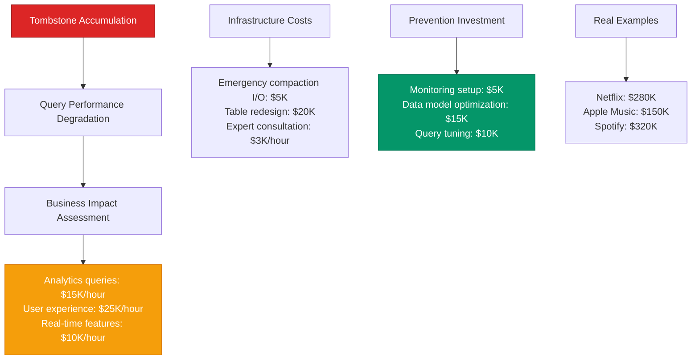

# Cassandra Tombstone Accumulation - Production Debugging Guide

## The 3 AM Emergency

**Alert**: "Cassandra query timeouts, 50K+ tombstones per query, read performance degraded 10x"
**Cost**: $45,000/hour in user experience degradation, analytical queries failing
**Time to resolution**: 30-90 minutes with this guide

## Quick Diagnosis Decision Tree



## Production Architecture - The Tombstone Flow



## Real Incident: Netflix's Cassandra Tombstone Crisis (July 2023)

**Background**: User viewing history table with time-series data, 30-day TTLs
**Trigger**: Analytics queries scanning across date ranges hit tombstone walls
**Impact**: User recommendation engine failed, affecting 10M+ users

```mermaid
timeline
    title Netflix Viewing History Tombstone Crisis - July 8, 2023

    section Normal Operations
        10:00 : Viewing history table: 500M rows
              : TTL set to 30 days
              : Query latency: p99 100ms
              : Compaction running normally

    section TTL Expiration Wave (10:30)
        10:30 : Large batch of data hits TTL
              : 50M records become tombstones
              : SSTables fill with tombstones
              : No major compaction scheduled

    section Performance Degradation (11:00)
        11:00 : Analytics queries slow down
              : Tombstone scans: 100K per query
              : Query timeouts begin
              : p99 latency: 5 seconds

    section Cascade Failure (11:30-13:00)
        11:30 : Recommendation engine queries fail
              : User experience degrades
              : Customer complaints increase

        12:00 : Emergency: Query timeouts exceed limits
              : Analytics dashboard goes down
              : Business intelligence affected

        12:30 : Manual compaction attempted
              : Limited success due to data size
              : Performance still degraded

    section Emergency Resolution (13:15)
        13:15 : Emergency table redesign
              : Partition key optimization
              : Force major compaction
              : Query patterns changed

    section Recovery (15:30)
        15:30 : Tombstones cleared via compaction
              : Query performance restored
              : Recommendation engine recovered
              : Cost: $280K in lost engagement
```

## Emergency Response Playbook

### Step 1: Immediate Assessment (2 minutes)

**Critical Queries:**

```sql
-- Check tombstone warnings in system logs
SELECT * FROM system.local;

-- Check current read performance metrics
SELECT table_name, read_latency_ms, tombstone_scanned_histogram
FROM system_views.table_statistics
WHERE tombstone_scanned_histogram IS NOT NULL
ORDER BY read_latency_ms DESC;

-- Identify tables with high tombstone ratios
SELECT keyspace_name, table_name,
       sstable_count,
       estimated_tombstone_ratio
FROM system.table_estimates
WHERE estimated_tombstone_ratio > 0.1
ORDER BY estimated_tombstone_ratio DESC;
```

**Command Line Assessment:**

```bash
# Check current compaction status
nodetool compactionstats

# Check tombstone warnings in logs
grep -i "tombstone" /var/log/cassandra/system.log | tail -20

# Get table-specific tombstone information
nodetool tablestats keyspace.table_name | grep -i tombstone

# Check read latency
nodetool tablestats keyspace.table_name | grep "Read Latency"
```

**Emergency Thresholds:**
- Tombstone ratio >20% = CRITICAL ISSUE
- Query scanning >10K tombstones = IMMEDIATE ACTION
- Read latency p99 >1000ms = EMERGENCY COMPACTION

### Step 2: Emergency Compaction (10 minutes)

**Immediate Relief Actions:**

```bash
#!/bin/bash
# emergency-tombstone-compaction.sh

echo "EMERGENCY: Starting Cassandra tombstone compaction"

KEYSPACE="${1:-production}"
TABLE="${2:-user_events}"

# 1. Check current tombstone levels
echo "=== Current Tombstone Status ==="
nodetool tablestats $KEYSPACE.$TABLE | grep -E "(tombstone|Tombstone)"

# 2. Emergency: Force major compaction (will use significant I/O)
echo "Starting emergency major compaction..."
nodetool compact $KEYSPACE $TABLE

# 3. Monitor compaction progress
echo "Monitoring compaction progress..."
while nodetool compactionstats | grep -q "pending"; do
  echo "Compaction in progress at $(date)..."
  nodetool compactionstats | grep -A 5 "pending"
  sleep 30
done

# 4. Verify tombstone reduction
echo "=== Post-Compaction Tombstone Status ==="
nodetool tablestats $KEYSPACE.$TABLE | grep -E "(tombstone|Tombstone)"

echo "Emergency compaction completed!"
```

### Step 3: Query Optimization (5 minutes)

**Immediate Query Tuning:**

```sql
-- Emergency: Add tombstone limits to problematic queries
-- Original problematic query:
-- SELECT * FROM user_events WHERE user_id = ? AND event_date > ?;

-- Emergency optimized query with limits:
SELECT * FROM user_events
WHERE user_id = ? AND event_date > ?
LIMIT 1000  -- Limit result set
ALLOW FILTERING;  -- Only in emergency

-- Create emergency materialized view for analytics
CREATE MATERIALIZED VIEW user_events_recent AS
SELECT user_id, event_date, event_type, data
FROM user_events
WHERE user_id IS NOT NULL
  AND event_date IS NOT NULL
  AND event_date > '2023-07-01'  -- Recent data only
PRIMARY KEY (user_id, event_date);

-- Alternative: Use token-based pagination for large scans
SELECT token(user_id), user_id, event_date, event_type
FROM user_events
WHERE token(user_id) > token(?)
LIMIT 1000;
```

## Root Cause Analysis Matrix



## Production Configuration - Anti-Tombstone Settings

**Cassandra Configuration (cassandra.yaml):**

```yaml
# Compaction settings to handle tombstones
compaction:
  # Size-tiered strategy with tombstone optimization
  compaction_strategy: SizeTieredCompactionStrategy
  compaction_strategy_options:
    min_threshold: 4                    # Start compaction earlier
    max_threshold: 32                   # Don't let too many SSTables accumulate
    tombstone_threshold: 0.2            # Compact if >20% tombstones
    tombstone_compaction_interval: 86400 # Daily tombstone compaction

# Garbage collection grace period (reduce if repair frequency allows)
gc_grace_seconds: 604800                # 7 days (default 10 days)

# Read timeout settings
read_request_timeout_in_ms: 10000       # 10 seconds (up from 5s)
range_request_timeout_in_ms: 15000      # 15 seconds for range queries

# Memory settings for handling tombstones
memtable_heap_space_in_mb: 2048         # Larger memtables
memtable_offheap_space_in_mb: 2048

# Streaming settings for repair
streaming_keep_alive_period_in_secs: 300

# Compaction throughput (adjust based on I/O capacity)
compaction_throughput_mb_per_sec: 64    # Limit I/O impact

# Index settings for tombstone handling
column_index_size_in_kb: 4             # Smaller index for faster skipping
```

**Table-Specific Optimizations:**

```sql
-- Time-series table with anti-tombstone design
CREATE TABLE user_events_v2 (
    user_id UUID,
    date_bucket TEXT,        -- Partition by day: '2023-07-08'
    event_timestamp TIMESTAMP,
    event_id TIMEUUID,
    event_type TEXT,
    data MAP<TEXT, TEXT>
) WITH CLUSTERING ORDER BY (event_timestamp DESC)
  AND compaction = {
    'class': 'TimeWindowCompactionStrategy',
    'compaction_window_unit': 'DAYS',
    'compaction_window_size': 1,
    'tombstone_threshold': 0.15,        -- Aggressive tombstone cleanup
    'tombstone_compaction_interval': 3600 -- Hourly tombstone compaction
  }
  AND gc_grace_seconds = 172800         -- 2 days (reduced from default)
  AND default_time_to_live = 2592000;   -- 30 days TTL

-- Analytics-friendly table design (avoids range scans)
CREATE TABLE user_events_analytics (
    metric_type TEXT,
    date_bucket TEXT,
    user_id UUID,
    event_count COUNTER
) WITH compaction = {
    'class': 'LeveledCompactionStrategy',
    'sstable_size_in_mb': 160,
    'tombstone_threshold': 0.1
  };

-- Lookup table for recent data (no TTL)
CREATE TABLE user_events_recent (
    user_id UUID,
    event_timestamp TIMESTAMP,
    event_id TIMEUUID,
    event_type TEXT,
    data MAP<TEXT, TEXT>
) WITH CLUSTERING ORDER BY (event_timestamp DESC)
  AND compaction = {
    'class': 'SizeTieredCompactionStrategy',
    'tombstone_threshold': 0.05        -- Very aggressive for lookup tables
  };
```

**Application-Level Optimizations:**

```java
// Anti-tombstone query patterns
public class TombstoneAwareQueries {

    // BAD: Range query that scans many tombstones
    public List<Event> getUserEventsBAD(UUID userId, Date startDate) {
        String query = "SELECT * FROM user_events WHERE user_id = ? AND event_date > ?";
        return session.execute(query, userId, startDate).all();
    }

    // GOOD: Partition-aware query with limits
    public List<Event> getUserEventsGOOD(UUID userId, Date startDate) {
        List<Event> results = new ArrayList<>();
        LocalDate currentDate = startDate.toLocalDate();
        LocalDate endDate = LocalDate.now();

        while (!currentDate.isAfter(endDate) && results.size() < 1000) {
            String dateBucket = currentDate.toString();
            String query = "SELECT * FROM user_events_v2 " +
                          "WHERE user_id = ? AND date_bucket = ? " +
                          "LIMIT 100";

            List<Row> dayResults = session.execute(query, userId, dateBucket).all();
            results.addAll(convertToEvents(dayResults));
            currentDate = currentDate.plusDays(1);
        }

        return results;
    }

    // Use prepared statements with tombstone-aware timeouts
    private PreparedStatement prepareWithTimeout(String query) {
        return session.prepare(
            SimpleStatement.builder(query)
                .setTimeout(Duration.ofSeconds(10))  // Shorter timeout
                .setConsistencyLevel(ConsistencyLevel.LOCAL_QUORUM)
                .build()
        );
    }

    // Batch delete strategy to minimize tombstones
    public void cleanupUserData(UUID userId) {
        // Instead of: DELETE FROM user_events WHERE user_id = ?
        // Use time-based deletion to limit tombstone scope

        LocalDate cutoffDate = LocalDate.now().minusDays(30);
        for (int i = 0; i < 30; i++) {
            String dateBucket = cutoffDate.plusDays(i).toString();
            String query = "DELETE FROM user_events_v2 " +
                          "WHERE user_id = ? AND date_bucket = ?";
            session.execute(query, userId, dateBucket);

            // Sleep to avoid overwhelming the cluster
            try { Thread.sleep(100); } catch (InterruptedException e) {}
        }
    }
}
```

## Monitoring and Alerting

### Critical Dashboards



### Key Metrics with Thresholds

| Metric | Normal | Warning | Critical | Action |
|--------|--------|---------|----------|---------|
| Tombstone Ratio | <5% | 5-20% | >20% | Emergency compaction |
| Query Latency p99 | <200ms | 200-1000ms | >1000ms | Optimize queries |
| Tombstones Scanned | <1K | 1K-10K | >10K | Fix data model |
| Compaction Pending | 0 | 1-5 | >5 | Check I/O capacity |
| SSTable Count | <20 | 20-50 | >50 | Force compaction |

## Cost Impact Analysis

### Performance Impact Calculation



## Recovery Procedures

### Automated Tombstone Monitoring

```python
#!/usr/bin/env python3
# cassandra-tombstone-monitor.py

from cassandra.cluster import Cluster
from cassandra.auth import PlainTextAuthProvider
import logging
import json
import sys
from datetime import datetime

def monitor_tombstones(hosts, username=None, password=None):
    """Monitor Cassandra tombstone levels and performance"""

    auth_provider = None
    if username and password:
        auth_provider = PlainTextAuthProvider(username=username, password=password)

    cluster = Cluster(hosts, auth_provider=auth_provider)
    session = cluster.connect()

    alerts = []

    try:
        # Check table tombstone ratios
        rows = session.execute("""
            SELECT keyspace_name, table_name, estimated_tombstone_ratio
            FROM system.table_estimates
            WHERE estimated_tombstone_ratio > 0.05
        """)

        for row in rows:
            tombstone_ratio = row.estimated_tombstone_ratio
            if tombstone_ratio > 0.5:  # 50%
                alerts.append({
                    'severity': 'critical',
                    'type': 'tombstone_ratio',
                    'table': f'{row.keyspace_name}.{row.table_name}',
                    'ratio': tombstone_ratio,
                    'message': f'Critical tombstone ratio: {tombstone_ratio:.1%}'
                })
            elif tombstone_ratio > 0.2:  # 20%
                alerts.append({
                    'severity': 'warning',
                    'type': 'tombstone_ratio',
                    'table': f'{row.keyspace_name}.{row.table_name}',
                    'ratio': tombstone_ratio,
                    'message': f'High tombstone ratio: {tombstone_ratio:.1%}'
                })

        # Check compaction status
        compaction_rows = session.execute("""
            SELECT keyspace, table, compacted_at
            FROM system.compaction_history
            ORDER BY compacted_at DESC
            LIMIT 20
        """)

        # Look for tables that haven't been compacted recently
        recent_compactions = set()
        for row in compaction_rows:
            if row.compacted_at:
                age_hours = (datetime.now() - row.compacted_at).total_seconds() / 3600
                table_name = f'{row.keyspace}.{row.table}'
                recent_compactions.add(table_name)

                if age_hours > 72:  # 3 days
                    alerts.append({
                        'severity': 'warning',
                        'type': 'compaction_lag',
                        'table': table_name,
                        'hours_since_compaction': age_hours,
                        'message': f'No compaction in {age_hours:.1f} hours'
                    })

    finally:
        session.shutdown()
        cluster.shutdown()

    return alerts

if __name__ == "__main__":
    hosts = ['cassandra1.company.com', 'cassandra2.company.com', 'cassandra3.company.com']

    alerts = monitor_tombstones(hosts)

    if alerts:
        for alert in alerts:
            print(json.dumps(alert))
        sys.exit(1)
    else:
        print(json.dumps({'status': 'ok', 'timestamp': datetime.now().isoformat()}))
```

### Automated Compaction Management

```bash
#!/bin/bash
# automated-tombstone-compaction.sh

echo "Starting automated tombstone compaction management..."

# Configuration
TOMBSTONE_THRESHOLD=0.15  # 15%
MAX_CONCURRENT_COMPACTIONS=2
COMPACTION_LOG="/var/log/cassandra-compaction.log"

# Function to get tombstone ratio for a table
get_tombstone_ratio() {
    local keyspace=$1
    local table=$2

    nodetool tablestats $keyspace.$table | \
    grep "Estimated tombstone ratio" | \
    awk '{print $4}' | tr -d ','
}

# Function to start compaction if needed
check_and_compact() {
    local keyspace=$1
    local table=$2

    local ratio=$(get_tombstone_ratio $keyspace $table)

    if (( $(echo "$ratio > $TOMBSTONE_THRESHOLD" | bc -l) )); then
        echo "$(date): High tombstone ratio ($ratio) detected for $keyspace.$table" >> $COMPACTION_LOG

        # Check if compaction is already running
        if nodetool compactionstats | grep -q "$keyspace.$table"; then
            echo "Compaction already running for $keyspace.$table"
            return
        fi

        # Check concurrent compaction limit
        local running_compactions=$(nodetool compactionstats | grep -c "pending\|bytes compacted")
        if [ $running_compactions -ge $MAX_CONCURRENT_COMPACTIONS ]; then
            echo "Max concurrent compactions reached, deferring $keyspace.$table"
            return
        fi

        echo "Starting compaction for $keyspace.$table (ratio: $ratio)"
        nodetool compact $keyspace $table &

        # Log the action
        echo "$(date): Started compaction for $keyspace.$table (ratio: $ratio)" >> $COMPACTION_LOG
    fi
}

# Get list of user tables
TABLES=$(cqlsh -e "SELECT keyspace_name, table_name FROM system_schema.tables WHERE keyspace_name NOT IN ('system', 'system_auth', 'system_distributed', 'system_schema', 'system_traces');" | grep -v "keyspace_name" | grep -v "^$" | tail -n +3)

# Check each table
echo "$TABLES" | while read keyspace table; do
    if [ ! -z "$keyspace" ] && [ ! -z "$table" ]; then
        check_and_compact $keyspace $table
        sleep 5  # Brief pause between checks
    fi
done

echo "Automated compaction check completed at $(date)"
```

## Prevention Strategies

### Data Model Optimization

```sql
-- BEFORE: Problematic table design that creates many tombstones
CREATE TABLE user_sessions_bad (
    user_id UUID,
    session_id TIMEUUID,
    created_at TIMESTAMP,
    last_activity TIMESTAMP,
    session_data TEXT
) WITH default_time_to_live = 86400;  -- 24 hours

-- AFTER: Optimized design with time-based partitioning
CREATE TABLE user_sessions_good (
    date_bucket TEXT,           -- Partition by day: '2023-07-08'
    user_id UUID,
    session_id TIMEUUID,
    created_at TIMESTAMP,
    last_activity TIMESTAMP,
    session_data TEXT
) WITH CLUSTERING ORDER BY (user_id ASC, session_id DESC)
  AND compaction = {
    'class': 'TimeWindowCompactionStrategy',
    'compaction_window_unit': 'HOURS',
    'compaction_window_size': 6,
    'tombstone_threshold': 0.1
  }
  AND gc_grace_seconds = 43200    -- 12 hours (faster tombstone cleanup)
  AND default_time_to_live = 86400;

-- Separate table for analytics (no TTL, different access pattern)
CREATE TABLE session_analytics (
    metric_date DATE,
    user_count COUNTER,
    session_count COUNTER,
    avg_duration_minutes INT
) PRIMARY KEY (metric_date);
```

### Application Anti-Patterns and Solutions

```java
// ANTI-PATTERN: Bulk deletion creating tombstone walls
public void cleanupExpiredSessions() {
    // DON'T DO THIS - creates massive tombstone ranges
    session.execute("DELETE FROM user_sessions WHERE created_at < ?", cutoffDate);
}

// SOLUTION: Time-based partition cleanup
public void cleanupExpiredSessionsOptimized() {
    LocalDate cutoffDate = LocalDate.now().minusDays(7);

    // Query to find old date buckets
    ResultSet rs = session.execute(
        "SELECT DISTINCT date_bucket FROM user_sessions_good WHERE date_bucket < ?",
        cutoffDate.toString()
    );

    // Drop old partitions instead of creating tombstones
    for (Row row : rs) {
        String dateBucket = row.getString("date_bucket");
        // Use TRUNCATE or DROP if possible, or targeted deletion
        session.execute("DELETE FROM user_sessions_good WHERE date_bucket = ?", dateBucket);
    }
}

// ANTI-PATTERN: Frequent upserts on same partition
public void updateUserActivity(UUID userId, String activity) {
    // Creates tombstones with each update
    session.execute("UPDATE user_activity SET last_activity = ? WHERE user_id = ?",
                   new Date(), userId);
}

// SOLUTION: Append-only pattern with periodic consolidation
public void updateUserActivityOptimized(UUID userId, String activity) {
    // Insert new record instead of updating
    session.execute("INSERT INTO user_activity_log (user_id, activity_id, activity, timestamp) VALUES (?, ?, ?, ?)",
                   userId, UUID.randomUUID(), activity, new Date());
}
```

## Quick Reference

### Emergency Commands

```bash
# Check tombstone levels
nodetool tablestats keyspace.table | grep -i tombstone

# Force major compaction
nodetool compact keyspace table

# Check compaction status
nodetool compactionstats

# Check for tombstone warnings in logs
grep -i "tombstone" /var/log/cassandra/system.log

# Get table statistics
nodetool tablehistograms keyspace table

# Emergency: Stop compaction (if consuming too much I/O)
nodetool stop COMPACTION

# Check SSTable details
nodetool listsnapshots
```

### Key Log Patterns

```bash
# Monitor tombstone warnings
grep "Scanned over .* tombstones" /var/log/cassandra/system.log

# Check compaction progress
grep "Compacting" /var/log/cassandra/system.log

# Look for query timeouts related to tombstones
grep -i "timeout.*tombstone" /var/log/cassandra/system.log

# Monitor gc_grace_seconds violations
grep "gc_grace_seconds" /var/log/cassandra/system.log
```

---

**Remember**: Cassandra tombstones are necessary for distributed deletes but can severely impact read performance when they accumulate. Design your data model to minimize tombstone creation and ensure regular compaction.

**Next Steps**: Optimize data models for time-series workloads, implement monitoring for tombstone ratios, and establish regular compaction maintenance windows.