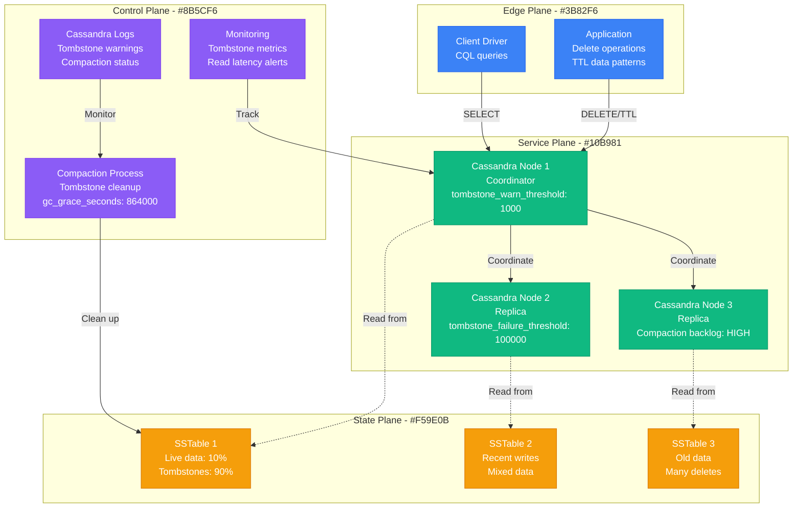

# Cassandra Tombstone Debugging

**Scenario**: Production Cassandra cluster experiencing severe performance degradation due to tombstone accumulation, causing read timeouts and query failures.

**The 3 AM Reality**: Read queries timing out, compaction storms overwhelming cluster resources, and potential data unavailability due to tombstone thresholds being exceeded.

## Symptoms Checklist

- [ ] Read queries consistently timing out (>5 seconds)
- [ ] "TombstoneOverwhelmingException" in Cassandra logs
- [ ] High compaction activity consuming cluster resources
- [ ] sstable counts growing rapidly without data increase
- [ ] Queries failing with "Read timeout" errors

## Cassandra Tombstone Architecture



## Critical Commands & Analysis

### Tombstone Detection
```bash
# Check tombstone thresholds in cassandra.yaml
grep -E "tombstone.*threshold" /etc/cassandra/cassandra.yaml

# Monitor tombstone warnings in logs
tail -f /var/log/cassandra/system.log | grep -i tombstone

# Check sstable tombstone ratios
nodetool cfstats keyspace.table_name | grep -E "(Tombstone|Ratio)"

# Analyze specific sstable content
sstablemetadata /var/lib/cassandra/data/keyspace/table-*/mc-*-big-Data.db | grep -E "(Estimated tombstone|Droppable tombstone)"
```

### Table Analysis
```cql
-- Check table schema for TTL columns
DESCRIBE TABLE keyspace.table_name;

-- Query tombstone-heavy partition
SELECT * FROM keyspace.table_name WHERE partition_key = 'problem_key' LIMIT 100;

-- Check gc_grace_seconds setting
SELECT table_name, gc_grace_seconds FROM system_schema.tables
WHERE keyspace_name = 'your_keyspace';

-- Monitor compaction statistics
SELECT * FROM system.compaction_history
WHERE keyspace_name = 'your_keyspace'
ORDER BY compacted_at DESC LIMIT 10;
```

### Performance Metrics
```bash
# Check read latency metrics
nodetool cfhistograms keyspace.table_name

# Monitor compaction throughput
nodetool compactionstats

# Check pending compactions
nodetool netstats | grep -A 5 "Compaction"

# Sstable count per table
nodetool cfstats | grep -E "Table:|SSTable count:" | paste - -
```

## Common Root Causes & Solutions

### 1. Excessive DELETE Operations (40% of cases)
```cql
-- Problem: Frequent deletes creating many tombstones
DELETE FROM user_sessions WHERE user_id = 'user123' AND session_id = 'session456';
DELETE FROM user_sessions WHERE user_id = 'user123' AND session_id = 'session789';
-- ... thousands of deletes

-- Detection: Check delete patterns
SELECT table_name,
       sum(tombstone_scanned_histogram) as total_tombstones,
       sum(live_scanned_histogram) as total_live
FROM system.table_estimates_by_host_local
GROUP BY table_name;

-- Solution 1: Batch deletes efficiently
BEGIN BATCH
  DELETE FROM user_sessions WHERE user_id = 'user123' AND session_id IN ('session456', 'session789', 'session101');
APPLY BATCH;

-- Solution 2: Use TTL instead of deletes
INSERT INTO user_sessions (user_id, session_id, data)
VALUES ('user123', 'session456', 'session_data')
USING TTL 3600; -- Expires in 1 hour

-- Solution 3: Partition by time for efficient deletion
CREATE TABLE user_sessions_by_day (
    date text,
    user_id text,
    session_id text,
    data text,
    PRIMARY KEY (date, user_id, session_id)
);

-- Drop entire partition when old
DROP TABLE user_sessions_2023_01_01; -- Instead of many DELETEs
```

### 2. Large Range Deletes (25% of cases)
```cql
-- Problem: Range deletes creating partition tombstones
DELETE FROM timeseries_data WHERE device_id = 'sensor123' AND timestamp < '2023-01-01';

-- Detection: Check for range tombstones
sstablemetadata /var/lib/cassandra/data/ks/table-*/mc-*-big-Data.db | grep "Range tombstone"

-- Solution: Avoid range deletes, use time-windowing
CREATE TABLE timeseries_data_hourly (
    hour text,           -- '2023-01-01-14'
    device_id text,
    timestamp timestamp,
    value double,
    PRIMARY KEY (hour, device_id, timestamp)
);

-- Drop old data by dropping entire hour partitions
-- This is much more efficient than range deletes
```

### 3. TTL Expiration Patterns (20% of cases)
```cql
-- Problem: Many records with same TTL expiring simultaneously
INSERT INTO cache_data (key, value) VALUES ('key1', 'value1') USING TTL 3600;
INSERT INTO cache_data (key, value) VALUES ('key2', 'value2') USING TTL 3600;
-- All expire at same time, creating tombstone spike

-- Solution: Add jitter to TTL values
-- In application code:
import random

def insert_with_jittered_ttl(key, value, base_ttl=3600):
    jitter = random.randint(-300, 300)  # ±5 minutes
    ttl = base_ttl + jitter

    session.execute(
        "INSERT INTO cache_data (key, value) VALUES (?, ?) USING TTL ?",
        [key, value, ttl]
    )

-- Alternative: Use different TTL ranges
INSERT INTO cache_data (key, value) VALUES ('key1', 'value1') USING TTL 3300; -- 55 min
INSERT INTO cache_data (key, value) VALUES ('key2', 'value2') USING TTL 3900; -- 65 min
```

### 4. Inadequate Compaction Strategy (10% of cases)
```yaml
# Problem: Default compaction not handling tombstones efficiently
# Check current compaction strategy
nodetool cfstats keyspace.table_name | grep "Compaction Strategy"

# Solution: Optimize compaction for tombstone-heavy tables
# For time-series data with TTL
ALTER TABLE keyspace.table_name WITH
compaction = {
    'class': 'TimeWindowCompactionStrategy',
    'compaction_window_unit': 'HOURS',
    'compaction_window_size': 24,
    'max_threshold': 32,
    'min_threshold': 4
};

# For tables with many deletes
ALTER TABLE keyspace.table_name WITH
compaction = {
    'class': 'LeveledCompactionStrategy',
    'sstable_size_in_mb': 160
} AND gc_grace_seconds = 259200; -- 3 days instead of 10
```

### 5. Inappropriate gc_grace_seconds (5% of cases)
```cql
-- Problem: gc_grace_seconds too long for tombstone-heavy tables
ALTER TABLE keyspace.table_name WITH gc_grace_seconds = 864000; -- 10 days (default)

-- Solution: Reduce gc_grace_seconds for appropriate tables
-- For single-DC or tables that don't need repair
ALTER TABLE keyspace.table_name WITH gc_grace_seconds = 86400; -- 1 day

-- For tables with frequent deletes and fast compaction
ALTER TABLE cache_table WITH gc_grace_seconds = 3600; -- 1 hour

-- WARNING: Only reduce if you understand the implications for repair operations
```

## Immediate Mitigation

### Emergency Response
```bash
# Check current tombstone warnings
grep "Scanned over.*tombstones" /var/log/cassandra/system.log | tail -20

# Temporarily increase tombstone thresholds (emergency only)
# Edit cassandra.yaml
tombstone_warn_threshold: 10000        # Increase from 1000
tombstone_failure_threshold: 1000000   # Increase from 100000

# Restart Cassandra (rolling restart)
sudo systemctl restart cassandra

# Force major compaction on problematic tables (use with caution)
nodetool compact keyspace table_name

# Monitor compaction progress
watch -n 30 'nodetool compactionstats'
```

### Quick Diagnostics
```bash
# Identify tables with highest tombstone ratios
for table in $(nodetool cfstats | grep "Table:" | cut -d' ' -f2); do
    echo "=== $table ==="
    nodetool cfstats $table | grep -E "(Table:|Tombstone|Live)"
    echo
done

# Check for tombstone overwhelming exceptions
grep -c "TombstoneOverwhelmingException" /var/log/cassandra/system.log

# Monitor read latency during tombstone issues
nodetool cfhistograms keyspace.problematic_table | head -20
```

## Long-term Prevention

### Schema Design Best Practices
```cql
-- Time-series data with efficient deletion
CREATE TABLE sensor_data_daily (
    date text,           -- Partition by day
    sensor_id text,
    timestamp timestamp,
    temperature double,
    humidity double,
    PRIMARY KEY (date, sensor_id, timestamp)
) WITH CLUSTERING ORDER BY (sensor_id ASC, timestamp ASC)
AND compaction = {
    'class': 'TimeWindowCompactionStrategy',
    'compaction_window_unit': 'DAYS',
    'compaction_window_size': 1
}
AND gc_grace_seconds = 86400; -- 1 day

-- User session management with TTL
CREATE TABLE user_sessions (
    user_id text,
    session_id text,
    created_at timestamp,
    expires_at timestamp,
    session_data text,
    PRIMARY KEY (user_id, session_id)
) WITH default_time_to_live = 86400; -- Auto-expire sessions

-- Cache table optimized for turnover
CREATE TABLE application_cache (
    cache_key text PRIMARY KEY,
    cache_value text,
    created_at timestamp
) WITH compaction = {
    'class': 'LeveledCompactionStrategy',
    'sstable_size_in_mb': 64
}
AND gc_grace_seconds = 3600; -- 1 hour for fast cleanup
```

### Monitoring and Alerting
```yaml
# Prometheus alerts for tombstone issues
groups:
- name: cassandra-tombstones
  rules:
  - alert: HighTombstoneRatio
    expr: |
      (
        cassandra_table_tombstone_scanned_histogram_total /
        (cassandra_table_live_scanned_histogram_total + cassandra_table_tombstone_scanned_histogram_total)
      ) > 0.8
    for: 5m
    labels:
      severity: warning
    annotations:
      summary: "High tombstone ratio detected"
      description: "Table {{ $labels.table }} has tombstone ratio above 80%"

  - alert: TombstoneWarningsIncreasing
    expr: increase(cassandra_tombstone_warnings_total[10m]) > 10
    for: 2m
    labels:
      severity: critical
    annotations:
      summary: "Tombstone warnings increasing rapidly"
      description: "More than 10 tombstone warnings in last 10 minutes"

  - alert: ReadLatencyHigh
    expr: |
      histogram_quantile(0.99,
        rate(cassandra_table_read_latency_bucket[5m])
      ) > 100
    for: 3m
    labels:
      severity: warning
    annotations:
      summary: "High read latency detected"
      description: "P99 read latency above 100ms for table {{ $labels.table }}"
```

### Application-Level Solutions
```python
# Python example: Efficient tombstone management
from cassandra.cluster import Cluster
from cassandra.policies import DCAwareRoundRobinPolicy
import random
import time

class TombstoneAwareCassandraClient:
    def __init__(self, hosts):
        self.cluster = Cluster(
            hosts,
            load_balancing_policy=DCAwareRoundRobinPolicy()
        )
        self.session = self.cluster.connect()

    def batch_delete_with_limit(self, keyspace, table, conditions, batch_size=100):
        """Delete in small batches to avoid tombstone spikes"""

        # First, get all keys to delete
        select_query = f"SELECT partition_key, clustering_key FROM {keyspace}.{table} WHERE {conditions}"
        rows = self.session.execute(select_query)

        # Process in batches
        batch_count = 0
        from cassandra.query import BatchStatement, SimpleStatement

        for i, row in enumerate(rows):
            if i % batch_size == 0:
                if i > 0:  # Execute previous batch
                    self.session.execute(batch)
                    # Add delay between batches
                    time.sleep(0.1)

                batch = BatchStatement()
                batch_count += 1

            delete_stmt = SimpleStatement(
                f"DELETE FROM {keyspace}.{table} WHERE partition_key = ? AND clustering_key = ?"
            )
            batch.add(delete_stmt, (row.partition_key, row.clustering_key))

        # Execute final batch
        if batch_count > 0:
            self.session.execute(batch)

        return batch_count

    def insert_with_jittered_ttl(self, table, data, base_ttl=3600):
        """Insert with randomized TTL to avoid tombstone spikes"""

        jitter = random.randint(-int(base_ttl * 0.1), int(base_ttl * 0.1))
        actual_ttl = base_ttl + jitter

        insert_query = f"""
            INSERT INTO {table} (key, value, timestamp)
            VALUES (?, ?, ?)
            USING TTL ?
        """

        self.session.execute(insert_query, [
            data['key'],
            data['value'],
            int(time.time()),
            actual_ttl
        ])

    def check_tombstone_ratio(self, keyspace, table):
        """Monitor tombstone ratio for a table"""

        # This requires JMX or custom metrics
        # Implementation depends on your monitoring setup
        query = """
            SELECT live_scanned_histogram, tombstone_scanned_histogram
            FROM system.table_estimates_by_host_local
            WHERE keyspace_name = ? AND table_name = ?
        """

        result = self.session.execute(query, [keyspace, table])
        if result:
            row = result.one()
            if row.live_scanned_histogram and row.tombstone_scanned_histogram:
                total = row.live_scanned_histogram + row.tombstone_scanned_histogram
                ratio = row.tombstone_scanned_histogram / total if total > 0 else 0
                return ratio

        return 0
```

## Production Examples

### Netflix's Viewing History Tombstones (2019)
- **Incident**: User viewing history queries timing out due to excessive tombstones
- **Root Cause**: Frequent deletion of old viewing records creating tombstone hotspots
- **Impact**: Recommendation system degraded, user experience affected
- **Resolution**: Redesigned schema with time-based partitions, reduced gc_grace_seconds
- **Prevention**: Implemented TTL-based expiration instead of explicit deletes

### Uber's Location Data Cleanup (2020)
- **Incident**: Driver location table overwhelmed with tombstones during data cleanup
- **Root Cause**: Range deletes used to purge old location data
- **Impact**: Location queries taking 10+ seconds, affecting ride matching
- **Resolution**: Changed to time-windowed tables, drop old partitions instead of deletes
- **Learning**: Range deletes are extremely expensive in Cassandra

### Discord's Message History Issues (2021)
- **Incident**: Message channel queries failing with tombstone overwhelming exceptions
- **Root Cause**: User message deletions combined with aggressive TTL settings
- **Impact**: Chat history loading failures, user complaints
- **Resolution**: Adjusted TTL jitter, implemented message archival strategy
- **Prevention**: Monitor tombstone ratios per channel, implement graduated TTL

## Recovery Automation

### Tombstone Monitoring Script
```bash
#!/bin/bash
# cassandra-tombstone-monitor.sh

KEYSPACE=${1:-your_keyspace}
TABLE=${2:-your_table}
TOMBSTONE_THRESHOLD=${3:-0.8}  # 80% tombstone ratio alert

# Function to get tombstone ratio
get_tombstone_ratio() {
    local ks=$1
    local tbl=$2

    # Get stats from nodetool
    local stats=$(nodetool cfstats $ks.$tbl 2>/dev/null)

    if [ $? -eq 0 ]; then
        local live=$(echo "$stats" | grep "Live scanned histogram" | awk '{print $4}' | tr -d ',')
        local tombstone=$(echo "$stats" | grep "Tombstone scanned histogram" | awk '{print $4}' | tr -d ',')

        if [ -n "$live" ] && [ -n "$tombstone" ] && [ $((live + tombstone)) -gt 0 ]; then
            local ratio=$(echo "scale=3; $tombstone / ($live + $tombstone)" | bc)
            echo $ratio
        else
            echo "0"
        fi
    else
        echo "0"
    fi
}

# Function to check compaction backlog
check_compaction_backlog() {
    local backlog=$(nodetool compactionstats | grep "pending tasks" | awk '{sum += $1} END {print sum+0}')
    echo ${backlog:-0}
}

# Main monitoring logic
echo "Monitoring tombstone ratio for $KEYSPACE.$TABLE"

RATIO=$(get_tombstone_ratio $KEYSPACE $TABLE)
BACKLOG=$(check_compaction_backlog)

echo "Current tombstone ratio: $RATIO"
echo "Compaction backlog: $BACKLOG tasks"

# Check if ratio exceeds threshold
if [ $(echo "$RATIO > $TOMBSTONE_THRESHOLD" | bc) -eq 1 ]; then
    echo "ALERT: Tombstone ratio ($RATIO) exceeds threshold ($TOMBSTONE_THRESHOLD)"

    # Send alert (customize for your alerting system)
    curl -X POST -H 'Content-type: application/json' \
        --data "{\"text\":\"Cassandra tombstone alert: $KEYSPACE.$TABLE ratio: $RATIO\"}" \
        $SLACK_WEBHOOK

    # Suggest remediation
    echo "Suggested actions:"
    echo "1. Check for problematic delete patterns"
    echo "2. Consider manual compaction: nodetool compact $KEYSPACE $TABLE"
    echo "3. Review gc_grace_seconds setting"
    echo "4. Monitor read latency impact"
fi

# Check for recent tombstone warnings in logs
RECENT_WARNINGS=$(grep "Scanned over.*tombstones" /var/log/cassandra/system.log | grep "$(date '+%Y-%m-%d')" | wc -l)

if [ $RECENT_WARNINGS -gt 10 ]; then
    echo "WARNING: $RECENT_WARNINGS tombstone warnings in logs today"
fi

echo "Monitoring complete"
```

**Remember**: Tombstones in Cassandra are necessary for consistency in a distributed system, but excessive tombstones indicate design or operational issues. Focus on preventing tombstone accumulation through proper schema design, TTL usage patterns, and compaction strategies rather than just raising thresholds.