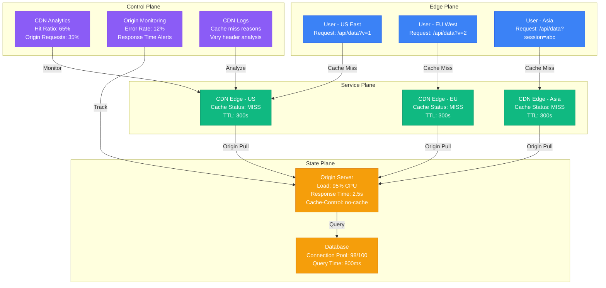

# CDN Cache Miss Debugging

**Scenario**: Production CDN experiencing high cache miss rates, causing increased origin load and poor performance for end users.

**The 3 AM Reality**: Origin servers overwhelmed by direct traffic, users experiencing slow page loads from distant origins, and CDN providing minimal benefit.

## Symptoms Checklist

- [ ] Cache hit ratio below 80% (should be 90%+ for static content)
- [ ] High origin server load and response times
- [ ] Increased bandwidth costs from origin traffic
- [ ] Users reporting slow content loading
- [ ] CDN logs showing frequent cache misses

## CDN Cache Miss Architecture



## Critical Commands & Analysis

### CDN Analytics and Logs
```bash
# CloudFlare analytics API
curl -X GET "https://api.cloudflare.com/client/v4/zones/{zone_id}/analytics/dashboard" \
     -H "Authorization: Bearer {api_token}" \
     --data '{"since":"2023-01-01T00:00:00Z","until":"2023-01-01T23:59:59Z"}'

# AWS CloudFront cache statistics
aws cloudfront get-distribution-config --id DISTRIBUTION_ID

# Analyze CloudFront logs for cache misses
aws logs filter-log-events \
    --log-group-name "/aws/cloudfront/distribution/DISTRIBUTION_ID" \
    --filter-pattern "{ $.sc_status = \"Miss\" }"

# Fastly cache miss analysis
curl -H "Fastly-Token: YOUR_TOKEN" \
     "https://api.fastly.com/stats/service/SERVICE_ID?from=1hour"
```

### Origin Server Analysis
```bash
# Check origin response headers
curl -I https://origin.example.com/api/data

# Analyze origin caching headers
curl -H "Cache-Control: no-cache" -I https://origin.example.com/static/style.css

# Monitor origin server load
top -p $(pgrep -f "nginx\|apache\|node")

# Check origin response times
curl -w "Time: %{time_total}s\n" -o /dev/null -s https://origin.example.com/
```

### Cache Header Analysis
```bash
# Check cache-control headers
curl -s -D - https://cdn.example.com/api/data | grep -i cache

# Analyze vary headers
curl -s -D - https://cdn.example.com/content | grep -i vary

# Test different user agents
curl -H "User-Agent: Mobile" -I https://cdn.example.com/page
curl -H "User-Agent: Desktop" -I https://cdn.example.com/page
```

## Common Root Causes & Solutions

### 1. Dynamic Content Being Cached (35% of cases)
```nginx
# Problem: CDN trying to cache dynamic/personalized content
location /api/ {
    # This content varies per user but has generic cache headers
    proxy_pass http://backend;
    proxy_set_header Host $host;
}

# Solution: Proper cache headers for dynamic content
location /api/user/ {
    proxy_pass http://backend;
    proxy_set_header Host $host;

    # Add appropriate headers
    add_header Cache-Control "private, no-cache, no-store, must-revalidate";
    add_header Pragma "no-cache";
    add_header Expires "0";
}

# Better: Separate cacheable from non-cacheable APIs
location /api/static/ {
    proxy_pass http://backend;
    proxy_cache_valid 200 1h;
    add_header Cache-Control "public, max-age=3600";
}

location /api/dynamic/ {
    proxy_pass http://backend;
    add_header Cache-Control "private, no-cache";
}
```

### 2. Query Parameter Variations (30% of cases)
```javascript
// Problem: URLs with unnecessary query parameters
const problematicUrls = [
    '/api/data?timestamp=1640995200',  // Different each request
    '/api/data?session=abc123',        // User-specific
    '/api/data?_cb=789456',           // Cache buster
    '/api/data?utm_source=google'      // Tracking parameters
];

// Solution 1: Remove unnecessary query parameters at CDN
// CloudFlare Page Rules or CloudFront Behaviors
// Strip query parameters: timestamp, session, _cb, utm_*

// Solution 2: Normalize URLs in application
function normalizeApiUrl(url) {
    const urlObj = new URL(url);

    // Remove cache-busting and tracking parameters
    const paramsToRemove = ['timestamp', 'session', '_cb', 'utm_source', 'utm_medium'];

    paramsToRemove.forEach(param => {
        urlObj.searchParams.delete(param);
    });

    // Sort remaining parameters for consistency
    urlObj.searchParams.sort();

    return urlObj.toString();
}

// Solution 3: Use proper cache keys
// Varnish VCL configuration
sub vcl_hash {
    hash_data(req.url);
    hash_data(req.http.host);

    # Only include specific query parameters in cache key
    if (req.url ~ "^/api/data") {
        # Only version parameter affects caching
        if (req.url ~ "[\?&]v=") {
            hash_data(regsub(req.url, "^.*[\?&]v=([^&]*).*$", "\1"));
        }
    }
}
```

### 3. Incorrect Cache Headers (20% of cases)
```python
# Problem: Origin sending no-cache headers for cacheable content
from flask import Flask, Response

app = Flask(__name__)

@app.route('/static/data.json')
def problematic_static_data():
    data = get_static_data()
    # No cache headers - CDN won't cache
    return Response(json.dumps(data), mimetype='application/json')

# Solution: Proper cache headers based on content type
@app.route('/static/data.json')
def optimized_static_data():
    data = get_static_data()

    response = Response(json.dumps(data), mimetype='application/json')

    # Cacheable for 1 hour, can be cached by CDN and browsers
    response.headers['Cache-Control'] = 'public, max-age=3600, s-maxage=3600'

    # Add ETag for validation
    response.headers['ETag'] = f'"{hash(json.dumps(data))}"'

    return response

@app.route('/api/user/profile')
def user_profile():
    profile = get_user_profile()

    response = Response(json.dumps(profile), mimetype='application/json')

    # Private content, not cacheable by CDN
    response.headers['Cache-Control'] = 'private, max-age=300'  # Browser cache only

    return response

# Configuration for different content types
CACHE_CONFIGS = {
    'static_assets': 'public, max-age=31536000, immutable',  # 1 year
    'api_public': 'public, max-age=3600, s-maxage=3600',     # 1 hour
    'api_user': 'private, max-age=300',                      # 5 minutes browser only
    'html_pages': 'public, max-age=300, s-maxage=3600',     # Different TTLs
}

def set_cache_headers(response, content_type):
    if content_type in CACHE_CONFIGS:
        response.headers['Cache-Control'] = CACHE_CONFIGS[content_type]
    return response
```

### 4. Vary Header Issues (10% of cases)
```nginx
# Problem: Excessive Vary headers causing cache fragmentation
server {
    location / {
        proxy_pass http://backend;

        # Problematic: Too many vary headers
        add_header Vary "User-Agent, Accept-Language, Accept-Encoding, Cookie, Authorization";
    }
}

# Solution: Minimize and optimize Vary headers
server {
    location /static/ {
        proxy_pass http://backend;

        # Only vary on encoding for static assets
        add_header Vary "Accept-Encoding";
        add_header Cache-Control "public, max-age=31536000";
    }

    location /api/ {
        proxy_pass http://backend;

        # Vary only on essential headers
        add_header Vary "Accept-Encoding, Authorization";
        add_header Cache-Control "public, max-age=3600";
    }

    location /pages/ {
        proxy_pass http://backend;

        # Mobile vs desktop versions
        add_header Vary "User-Agent";

        # Use device detection instead of full User-Agent
        set $mobile "";
        if ($http_user_agent ~* "(Mobile|Android|iPhone|iPad)") {
            set $mobile "mobile";
        }

        proxy_set_header X-Device-Type $mobile;
    }
}

# Alternative: Separate URLs for different variants
# Instead of: /page (varies by User-Agent)
# Use: /page/mobile and /page/desktop
```

### 5. Short TTL Values (3% of cases)
```javascript
// Problem: TTL too short for content update frequency
const badCacheConfig = {
    '/api/trending': 30,      // Updates hourly but TTL 30 seconds
    '/static/config.js': 60,  // Rarely changes but TTL 1 minute
    '/images/logo.png': 300   // Never changes but TTL 5 minutes
};

// Solution: TTL based on actual content update patterns
const optimizedCacheConfig = {
    // Trending data updates every hour
    '/api/trending': 3600,        // 1 hour TTL

    // Static assets with versioning
    '/static/v123/config.js': 31536000,  // 1 year (immutable)

    // Images
    '/images/logo.png': 604800,   // 1 week

    // Dynamic content
    '/api/user/feed': 300,        // 5 minutes
    '/api/notifications': 60,     // 1 minute

    // HTML pages
    '/': 1800,                    // 30 minutes
    '/product/*': 3600,           // 1 hour
};

// Implement smart TTL based on content analysis
function calculateOptimalTTL(url, contentType, updateFrequency) {
    const baseValues = {
        'static': 31536000,    // 1 year
        'api': 3600,           // 1 hour
        'html': 1800,          // 30 minutes
        'dynamic': 300         // 5 minutes
    };

    let ttl = baseValues[contentType] || 3600;

    // Adjust based on update frequency
    if (updateFrequency === 'realtime') {
        ttl = Math.min(ttl, 60);
    } else if (updateFrequency === 'hourly') {
        ttl = Math.min(ttl, 3600);
    } else if (updateFrequency === 'daily') {
        ttl = Math.min(ttl, 86400);
    }

    return ttl;
}
```

### 6. Cookie-Based Fragmentation (2% of cases)
```javascript
// Problem: Cookies causing cache misses
// Every user has different cookies, fragmenting cache

// Solution 1: Strip unnecessary cookies at CDN level
// CloudFlare Page Rule: Remove cookies for static assets
// Regex: ^/static/.*$ Action: Remove cookies

// Solution 2: Separate cookied from cookie-free requests
const cookieFreeUrls = [
    '/static/',
    '/images/',
    '/css/',
    '/js/',
    '/api/public/'
];

function shouldStripCookies(url) {
    return cookieFreeUrls.some(prefix => url.startsWith(prefix));
}

// Nginx configuration
map $request_uri $remove_cookies {
    ~^/static/   1;
    ~^/images/   1;
    ~^/css/      1;
    ~^/js/       1;
    default      0;
}

server {
    location / {
        proxy_pass http://backend;

        # Remove cookies for static content
        if ($remove_cookies) {
            proxy_set_header Cookie "";
        }
    }
}

// Solution 3: Use different domains for static content
// Main site: www.example.com (with cookies)
// Static assets: static.example.com (cookie-free)
// API: api.example.com (minimal cookies)
```

## Immediate Mitigation

### Emergency Response
```bash
# Increase TTL temporarily at CDN level
# CloudFlare
curl -X PATCH "https://api.cloudflare.com/client/v4/zones/{zone_id}/settings/browser_cache_ttl" \
     -H "Authorization: Bearer {token}" \
     -H "Content-Type: application/json" \
     --data '{"value": 31536000}'

# CloudFront - update cache behaviors
aws cloudfront get-distribution-config --id DISTRIBUTION_ID > config.json
# Edit config.json to increase TTL values
aws cloudfront update-distribution --id DISTRIBUTION_ID --distribution-config file://config.json

# Add emergency caching headers at origin
# Nginx
location / {
    proxy_pass http://backend;

    # Emergency: Force caching for 1 hour
    proxy_hide_header Cache-Control;
    add_header Cache-Control "public, max-age=3600, s-maxage=3600";
}
```

### Quick Cache Analysis
```bash
# Test cache effectiveness
for i in {1..10}; do
    curl -s -w "Cache: %{http_code} Time: %{time_total}s\n" \
         -H "Cache-Control: no-cache" \
         -o /dev/null \
         https://cdn.example.com/api/data
    sleep 1
done

# Check cache headers
curl -I https://cdn.example.com/static/app.js | grep -E "(Cache-Control|Age|X-Cache)"

# Monitor origin vs CDN traffic
watch -n 5 'curl -s https://cdn.example.com/health | jq .origin_requests'
```

## Long-term Prevention

### CDN Configuration Best Practices
```yaml
# CloudFront configuration example
CacheBehaviors:
  - PathPattern: "/static/*"
    TargetOriginId: "MyOrigin"
    ViewerProtocolPolicy: "redirect-to-https"
    CachePolicyId: "Managed-CachingOptimized"
    TTL:
      DefaultTTL: 31536000  # 1 year
      MaxTTL: 31536000      # 1 year
    QueryStringHandling: "none"
    CookieHandling: "none"

  - PathPattern: "/api/public/*"
    TargetOriginId: "MyOrigin"
    ViewerProtocolPolicy: "redirect-to-https"
    TTL:
      DefaultTTL: 3600      # 1 hour
      MaxTTL: 86400         # 1 day
    QueryStringHandling: "whitelist"
    QueryStringWhitelist: ["version", "format"]
    CookieHandling: "none"

  - PathPattern: "/api/user/*"
    TargetOriginId: "MyOrigin"
    ViewerProtocolPolicy: "redirect-to-https"
    TTL:
      DefaultTTL: 0         # No caching
      MaxTTL: 0
    QueryStringHandling: "all"
    CookieHandling: "all"
```

### Origin Server Optimization
```python
# Advanced caching headers with Flask
from flask import Flask, request, Response
import hashlib
import time

class CacheOptimizedApp:
    def __init__(self):
        self.app = Flask(__name__)
        self.cache_configs = {
            'static': {'max_age': 31536000, 'public': True, 'immutable': True},
            'api_public': {'max_age': 3600, 'public': True},
            'api_user': {'max_age': 300, 'public': False},
            'html': {'max_age': 1800, 'public': True, 'revalidate': True}
        }

    def set_cache_headers(self, response, cache_type, etag=None):
        config = self.cache_configs.get(cache_type, {})

        cache_parts = []

        if config.get('public', False):
            cache_parts.append('public')
        else:
            cache_parts.append('private')

        if 'max_age' in config:
            cache_parts.append(f"max-age={config['max_age']}")

        if config.get('immutable', False):
            cache_parts.append('immutable')

        if config.get('revalidate', False):
            cache_parts.append('must-revalidate')

        response.headers['Cache-Control'] = ', '.join(cache_parts)

        if etag:
            response.headers['ETag'] = f'"{etag}"'

        # Handle conditional requests
        if etag and request.headers.get('If-None-Match') == f'"{etag}"':
            return Response(status=304)

        return response

    def route_static(self, path):
        @self.app.route(f'/static/{path}')
        def static_file():
            content = get_static_content(path)
            etag = hashlib.md5(content.encode()).hexdigest()

            response = Response(content)
            return self.set_cache_headers(response, 'static', etag)

        return static_file

    def route_api(self, endpoint, cache_type='api_public'):
        @self.app.route(f'/api/{endpoint}')
        def api_endpoint():
            data = get_api_data(endpoint)

            # Generate ETag based on data content
            etag = hashlib.md5(json.dumps(data, sort_keys=True).encode()).hexdigest()

            response = Response(json.dumps(data), mimetype='application/json')
            return self.set_cache_headers(response, cache_type, etag)

        return api_endpoint

# Usage
app = CacheOptimizedApp()
app.route_static('app.js')
app.route_api('trending', 'api_public')
app.route_api('user/profile', 'api_user')
```

### Monitoring and Alerting
```yaml
# Prometheus alerts for cache performance
groups:
- name: cdn-cache-performance
  rules:
  - alert: LowCacheHitRatio
    expr: (cdn_cache_hits / (cdn_cache_hits + cdn_cache_misses)) < 0.8
    for: 5m
    labels:
      severity: warning
    annotations:
      summary: "CDN cache hit ratio below 80%"
      description: "Cache hit ratio is {{ $value | humanizePercentage }}"

  - alert: HighOriginLoad
    expr: origin_requests_per_second > 1000
    for: 2m
    labels:
      severity: critical
    annotations:
      summary: "High origin server load"
      description: "Origin receiving {{ $value }} requests/second"

  - alert: CacheMissSpike
    expr: rate(cdn_cache_misses[5m]) > rate(cdn_cache_misses[5m] offset 1h) * 2
    for: 3m
    labels:
      severity: warning
    annotations:
      summary: "Cache miss rate spike detected"
      description: "Cache misses increased by {{ $value }}% compared to 1 hour ago"
```

## Production Examples

### Reddit's Image CDN Optimization (2020)
- **Incident**: Image CDN hit ratio dropped from 95% to 60% overnight
- **Root Cause**: User-generated content URLs including session tokens
- **Impact**: Origin server overload, image loading delays
- **Resolution**: Implemented URL normalization, stripped session parameters
- **Prevention**: Separate image URLs from authenticated session context

### Shopify's API Cache Fragmentation (2019)
- **Incident**: Product API cache hit ratio below 40% during Black Friday
- **Root Cause**: Vary: Cookie header fragmenting cache per user
- **Impact**: Origin API servers overwhelmed, checkout slowdowns
- **Resolution**: Removed cookies from product API requests, separate user context
- **Learning**: Cookie-based caching rarely works for high-traffic APIs

### Netflix's Video Metadata Misses (2021)
- **Incident**: Video metadata API experiencing 70% cache miss rate
- **Root Cause**: Personalized recommendations changing cache keys frequently
- **Impact**: Increased metadata lookup latency, user experience degradation
- **Resolution**: Separated personalized from non-personalized metadata endpoints
- **Prevention**: Cache static metadata separately from personalized data

**Remember**: CDN cache optimization is about understanding your content patterns and user behavior. Always measure cache hit ratios, analyze miss reasons, and optimize cache keys based on actual content update frequencies rather than conservative defaults.