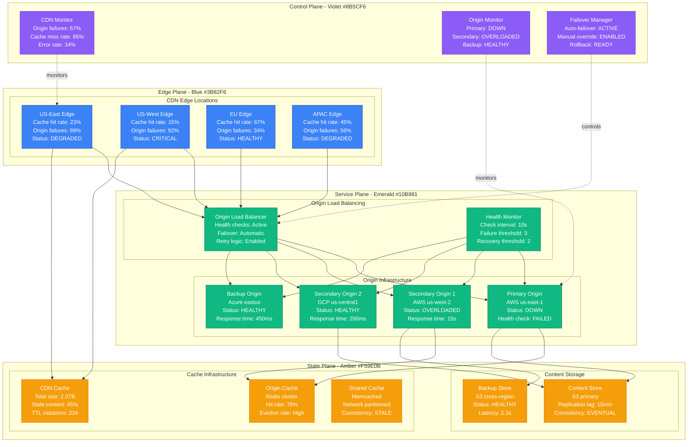
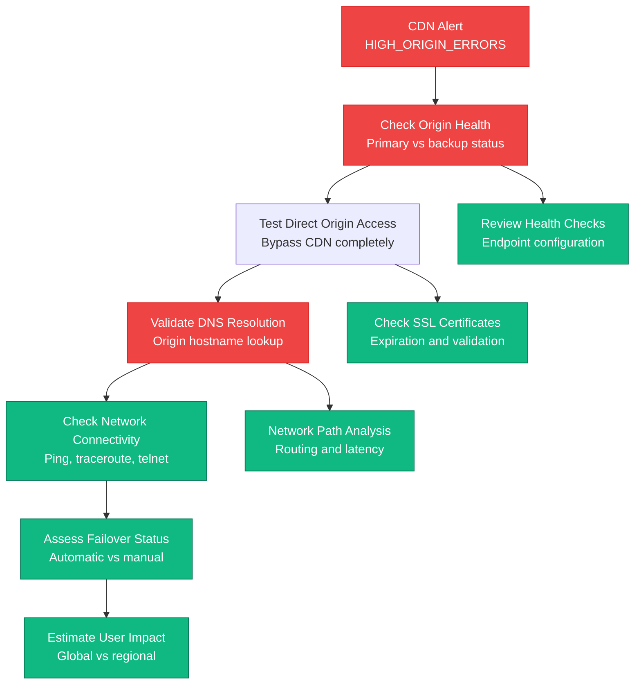
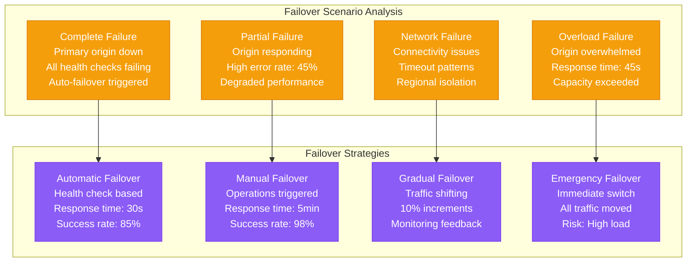
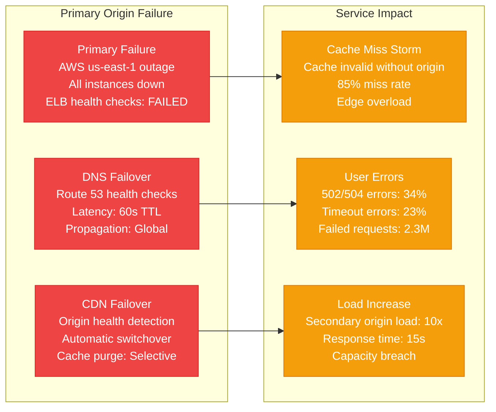
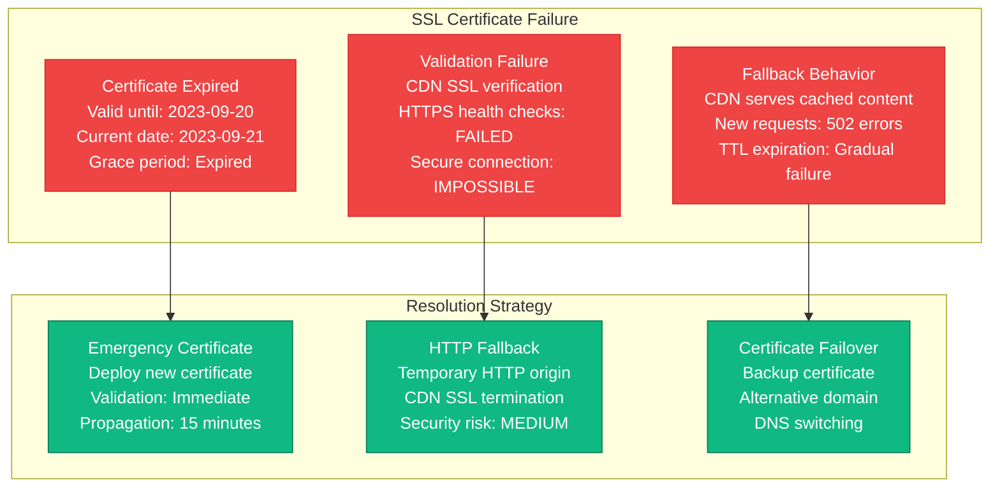
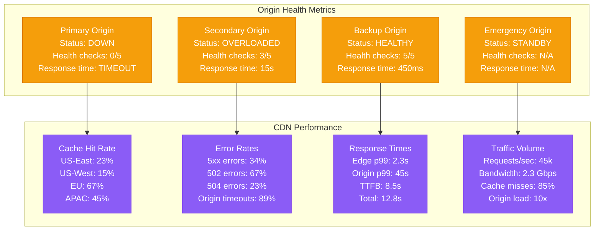

# CDN Origin Failures and Failover Production Debugging

## Overview

CDN origin failures can cause global service disruptions, cache misses, and cascading load on origin servers. When origin servers fail or become unreachable, CDN edge nodes may serve stale content, return errors, or overwhelm backup origins. This guide provides systematic approaches to debug CDN origin failures and implement effective failover strategies.

## Real Incident: Fastly's 2021 Global Outage

**Impact**: 58-minute global internet disruption affecting major websites
**Root Cause**: CDN configuration error caused origin failover loops
**Affected Sites**: Reddit, Amazon, Twitch, GitHub, gov.uk, and thousands more
**Recovery Time**: 58 minutes (49 minutes to identify + 9 minutes to fix)
**Cost**: Estimated $6B+ in global economic impact

## Architecture Overview



## Detection Signals

### Primary Indicators
```mermaid
graph LR
    subgraph OriginFailures[Origin Failure Patterns]
        OF[Origin Failures<br/>Primary: 100% fail rate<br/>Secondary: 67% fail rate<br/>Backup: 12% fail rate]

        TO[Timeout Errors<br/>Connect timeout: 89%<br/>Read timeout: 45%<br/>DNS timeout: 23%]

        HC[Health Check Failures<br/>HTTP 5xx: 234 checks<br/>Connection refused: 156<br/>Timeout: 89]

        RT[Response Time<br/>p99: 45s (target: 2s)<br/>p95: 23s (target: 1s)<br/>Mean: 8.5s (target: 500ms)]
    end

    subgraph CDNImpact[CDN Impact]
        CM[Cache Miss Rate<br/>Normal: 15%<br/>Current: 85%<br/>Spike: 5.6x increase]

        ER[Error Rate<br/>5xx errors: 34%<br/>502 Bad Gateway: 67%<br/>504 Gateway Timeout: 23%]

        TC[Traffic Concentration<br/>Edge overload: 4 regions<br/>Origin overload: 2 servers<br/>Cascading failures]

        SC[Stale Content<br/>Serving stale: 45%<br/>TTL violations: 234<br/>Content age: 4h average]
    end

    OF --> CM
    TO --> ER
    HC --> TC
    RT --> SC

    classDef failureStyle fill:#EF4444,stroke:#DC2626,color:#fff
    classDef impactStyle fill:#F59E0B,stroke:#D97706,color:#fff

    class OF,TO,HC,RT failureStyle
    class CM,ER,TC,SC impactStyle
```

### Detection Commands
```bash
# 1. Check CDN edge status
curl -I https://edge-us-east.cdn.company.com/health
curl -w "@curl-format.txt" -s -o /dev/null https://api.company.com/health

# 2. Test origin connectivity
for origin in origin1.company.com origin2.company.com backup.company.com; do
    echo "Testing $origin:"
    curl -H "Host: api.company.com" -I http://$origin/health
    echo "Response time: $(curl -w '%{time_total}' -s -o /dev/null http://$origin/health)"
done

# 3. Check DNS resolution
dig origin.company.com +trace
nslookup origin.company.com
host -v origin.company.com

# 4. CDN cache analysis
curl -H "Pragma: no-cache" -H "Cache-Control: no-cache" -I https://api.company.com/
curl -H "Cache-Control: max-age=0" -I https://api.company.com/
```

## Debugging Workflow

### Phase 1: Origin Status Assessment (0-5 minutes)



### Phase 2: Failover Analysis (5-15 minutes)



## Common Origin Failure Scenarios

### Scenario 1: Primary Origin Complete Failure



### Scenario 2: Origin SSL Certificate Expiration



## Recovery Procedures

### Automatic Origin Failover Configuration

```yaml
# CloudFlare origin failover configuration
origins:
  - name: primary-origin
    address: origin-primary.company.com
    weight: 100
    enabled: true
    health_check:
      type: https
      path: /health
      interval: 10s
      timeout: 5s
      retries: 3
      expected_codes: "200"
      method: GET
      headers:
        Host: api.company.com
        User-Agent: CloudFlare-HealthCheck

  - name: secondary-origin
    address: origin-secondary.company.com
    weight: 0  # Backup only
    enabled: true
    health_check:
      type: https
      path: /health
      interval: 10s
      timeout: 5s
      retries: 3
      expected_codes: "200"

  - name: emergency-origin
    address: origin-emergency.company.com
    weight: 0  # Emergency only
    enabled: false
    health_check:
      type: http  # Fallback to HTTP if needed
      path: /health
      interval: 30s
      timeout: 10s
      retries: 2

load_balancing:
  method: proximity  # Route to closest healthy origin
  fallback: round_robin
  session_affinity: none
  steering_policy:
    - rule: origin_health
      action: automatic_failover
      threshold: 3_consecutive_failures

health_check_regions:
  - ENAM  # Eastern North America
  - WEU   # Western Europe
  - APAC  # Asia Pacific

---
# AWS CloudFront origin failover
distributions:
  - id: main-distribution
    origins:
      - id: primary
        domain_name: origin.company.com
        custom_origin_config:
          http_port: 80
          https_port: 443
          origin_protocol_policy: https-only
          origin_ssl_protocols: [TLSv1.2]
          origin_read_timeout: 30
          origin_keepalive_timeout: 5

      - id: backup
        domain_name: backup.company.com
        custom_origin_config:
          http_port: 80
          https_port: 443
          origin_protocol_policy: https-only

    cache_behaviors:
      - path_pattern: "/api/*"
        target_origin_id: primary
        viewer_protocol_policy: redirect-to-https
        origin_request_policy_id: managed-cors-s3-origin
        cache_policy_id: managed-caching-disabled

        # Failover configuration
        origin_groups:
          - id: primary-with-backup
            failover_criteria:
              status_codes: [403, 404, 500, 502, 503, 504]
            members:
              - origin_id: primary
                weight: 100
              - origin_id: backup
                weight: 0

health_check:
  type: calculated
  child_health_checks:
    - type: http
      resource_path: "/health"
      request_interval: 10
      failure_threshold: 3
```

### Emergency Origin Failover Script

```bash
#!/bin/bash
# Emergency CDN origin failover script

set -euo pipefail

# Configuration
CDN_PROVIDER="cloudflare"  # cloudflare, aws, fastly
PRIMARY_ORIGIN="origin-primary.company.com"
BACKUP_ORIGIN="origin-backup.company.com"
EMERGENCY_ORIGIN="origin-emergency.company.com"
API_TOKEN="your-api-token"
ZONE_ID="your-zone-id"

LOG_FILE="/var/log/cdn_failover_$(date +%Y%m%d_%H%M%S).log"

log() {
    echo "[$(date '+%Y-%m-%d %H:%M:%S')] $1" | tee -a "$LOG_FILE"
}

# 1. Check origin health
check_origin_health() {
    local origin="$1"
    local timeout="${2:-10}"

    log "Checking health of origin: $origin"

    # HTTP health check
    local http_status=$(curl -s -o /dev/null -w "%{http_code}" \
        --max-time "$timeout" \
        --connect-timeout 5 \
        -H "Host: api.company.com" \
        "http://$origin/health" || echo "000")

    # HTTPS health check
    local https_status=$(curl -s -o /dev/null -w "%{http_code}" \
        --max-time "$timeout" \
        --connect-timeout 5 \
        -H "Host: api.company.com" \
        "https://$origin/health" || echo "000")

    # Response time check
    local response_time=$(curl -s -o /dev/null -w "%{time_total}" \
        --max-time "$timeout" \
        --connect-timeout 5 \
        -H "Host: api.company.com" \
        "https://$origin/health" || echo "99.999")

    log "Origin $origin - HTTP: $http_status, HTTPS: $https_status, Time: ${response_time}s"

    # Consider healthy if HTTPS returns 200 and response time < 5s
    if [[ "$https_status" == "200" ]] && (( $(echo "$response_time < 5.0" | bc -l) )); then
        return 0  # Healthy
    else
        return 1  # Unhealthy
    fi
}

# 2. CloudFlare origin switching
switch_cloudflare_origin() {
    local new_origin="$1"

    log "Switching CloudFlare origin to: $new_origin"

    # Get current load balancer pool
    local pool_id=$(curl -s -X GET \
        "https://api.cloudflare.com/client/v4/zones/$ZONE_ID/load_balancers" \
        -H "Authorization: Bearer $API_TOKEN" \
        -H "Content-Type: application/json" | \
        jq -r '.result[0].default_pools[0]')

    # Update pool with new origin
    curl -s -X PUT \
        "https://api.cloudflare.com/client/v4/zones/$ZONE_ID/load_balancers/pools/$pool_id" \
        -H "Authorization: Bearer $API_TOKEN" \
        -H "Content-Type: application/json" \
        -d "{
            \"origins\": [
                {
                    \"name\": \"$new_origin\",
                    \"address\": \"$new_origin\",
                    \"enabled\": true,
                    \"weight\": 1
                }
            ]
        }" | jq '.success'

    log "CloudFlare origin switch completed"
}

# 3. AWS CloudFront origin switching
switch_cloudfront_origin() {
    local new_origin="$1"
    local distribution_id="$2"

    log "Switching CloudFront origin to: $new_origin"

    # Get current distribution config
    local config=$(aws cloudfront get-distribution-config \
        --id "$distribution_id" \
        --query 'DistributionConfig' \
        --output json)

    local etag=$(aws cloudfront get-distribution-config \
        --id "$distribution_id" \
        --query 'ETag' \
        --output text)

    # Update origin domain name
    local updated_config=$(echo "$config" | \
        jq --arg origin "$new_origin" \
        '.Origins.Items[0].DomainName = $origin')

    # Apply the change
    aws cloudfront update-distribution \
        --id "$distribution_id" \
        --distribution-config "$updated_config" \
        --if-match "$etag"

    log "CloudFront origin switch initiated (propagation ~15 minutes)"
}

# 4. Fastly origin switching
switch_fastly_origin() {
    local new_origin="$1"
    local service_id="$2"

    log "Switching Fastly origin to: $new_origin"

    # Clone the current service version
    local new_version=$(curl -s -X PUT \
        "https://api.fastly.com/service/$service_id/version/1/clone" \
        -H "Fastly-Token: $API_TOKEN" | \
        jq -r '.number')

    # Update backend in the new version
    curl -s -X PUT \
        "https://api.fastly.com/service/$service_id/version/$new_version/backend/origin" \
        -H "Fastly-Token: $API_TOKEN" \
        -H "Content-Type: application/x-www-form-urlencoded" \
        -d "address=$new_origin"

    # Activate the new version
    curl -s -X PUT \
        "https://api.fastly.com/service/$service_id/version/$new_version/activate" \
        -H "Fastly-Token: $API_TOKEN"

    log "Fastly origin switch completed"
}

# 5. Cache purging
purge_cdn_cache() {
    log "Purging CDN cache after origin switch"

    case "$CDN_PROVIDER" in
        "cloudflare")
            curl -s -X POST \
                "https://api.cloudflare.com/client/v4/zones/$ZONE_ID/purge_cache" \
                -H "Authorization: Bearer $API_TOKEN" \
                -H "Content-Type: application/json" \
                -d '{"purge_everything":true}'
            ;;
        "aws")
            aws cloudfront create-invalidation \
                --distribution-id "$DISTRIBUTION_ID" \
                --paths "/*"
            ;;
        "fastly")
            curl -s -X POST \
                "https://api.fastly.com/service/$SERVICE_ID/purge_all" \
                -H "Fastly-Token: $API_TOKEN"
            ;;
    esac

    log "Cache purge initiated"
}

# 6. Validate failover
validate_failover() {
    local expected_origin="$1"

    log "Validating failover to: $expected_origin"

    # Wait for propagation
    sleep 30

    # Test multiple endpoints
    local endpoints=("/health" "/api/status" "/")

    for endpoint in "${endpoints[@]}"; do
        local response=$(curl -s -w "\n%{http_code}\n%{time_total}" \
            "https://api.company.com$endpoint")

        local body=$(echo "$response" | head -n -2)
        local status=$(echo "$response" | tail -n 2 | head -n 1)
        local time=$(echo "$response" | tail -n 1)

        log "Endpoint $endpoint - Status: $status, Time: ${time}s"

        # Check if origin header indicates correct backend
        local origin_header=$(curl -s -I "https://api.company.com$endpoint" | \
            grep -i "x-served-by\|server\|x-cache" || echo "No origin info")

        log "Origin info: $origin_header"
    done

    log "Failover validation completed"
}

# Main failover logic
main() {
    log "Starting emergency CDN origin failover"

    # Check primary origin health
    if check_origin_health "$PRIMARY_ORIGIN"; then
        log "Primary origin is healthy, no failover needed"
        exit 0
    fi

    log "Primary origin is unhealthy, checking backup"

    # Check backup origin health
    if check_origin_health "$BACKUP_ORIGIN"; then
        log "Backup origin is healthy, failing over"

        case "$CDN_PROVIDER" in
            "cloudflare")
                switch_cloudflare_origin "$BACKUP_ORIGIN"
                ;;
            "aws")
                switch_cloudfront_origin "$BACKUP_ORIGIN" "$DISTRIBUTION_ID"
                ;;
            "fastly")
                switch_fastly_origin "$BACKUP_ORIGIN" "$SERVICE_ID"
                ;;
        esac

        purge_cdn_cache
        validate_failover "$BACKUP_ORIGIN"

    elif check_origin_health "$EMERGENCY_ORIGIN"; then
        log "Emergency origin is healthy, failing over"

        case "$CDN_PROVIDER" in
            "cloudflare")
                switch_cloudflare_origin "$EMERGENCY_ORIGIN"
                ;;
            "aws")
                switch_cloudfront_origin "$EMERGENCY_ORIGIN" "$DISTRIBUTION_ID"
                ;;
            "fastly")
                switch_fastly_origin "$EMERGENCY_ORIGIN" "$SERVICE_ID"
                ;;
        esac

        purge_cdn_cache
        validate_failover "$EMERGENCY_ORIGIN"

    else
        log "CRITICAL: All origins are unhealthy!"
        log "Manual intervention required"
        exit 1
    fi

    log "Emergency failover completed successfully"
    log "Log file: $LOG_FILE"
}

# Execute failover
main "$@"
```

## Monitoring and Prevention

### CDN Origin Health Dashboard



## Real Production Examples

### Fastly's 2021 Global Outage
- **Duration**: 58 minutes of global internet disruption
- **Root Cause**: CDN configuration error caused origin failover loops
- **Impact**: Reddit, Amazon, GitHub, gov.uk, and thousands of sites down
- **Recovery**: Configuration rollback + origin health validation
- **Prevention**: Enhanced config validation + staged rollouts

### AWS CloudFront S3 Origin Outage 2017
- **Duration**: 4 hours 15 minutes
- **Root Cause**: S3 us-east-1 outage affected CloudFront origins
- **Impact**: Websites serving stale content or showing errors
- **Recovery**: Origin failover to us-west-2 + cache invalidation
- **Prevention**: Multi-region origin setup + automated failover

### Cloudflare's Origin SSL Certificate Crisis 2019
- **Duration**: 2 hours 30 minutes global impact
- **Root Cause**: Mass SSL certificate expiration affected origin validation
- **Impact**: HTTPS sites returning 502 errors globally
- **Recovery**: Emergency certificate deployment + HTTP fallback
- **Prevention**: Automated certificate renewal + monitoring

## Recovery Checklist

### Immediate Response (0-10 minutes)
- [ ] Identify which origins are failing and error patterns
- [ ] Check origin server health and connectivity directly
- [ ] Validate DNS resolution for origin hostnames
- [ ] Test SSL certificate validity and expiration
- [ ] Trigger manual failover to healthy backup origins
- [ ] Monitor CDN error rates and cache hit ratios

### Investigation (10-30 minutes)
- [ ] Analyze origin server logs for failure root cause
- [ ] Check network connectivity and routing to origins
- [ ] Review recent deployments or configuration changes
- [ ] Validate origin server capacity and performance
- [ ] Examine SSL/TLS handshake and certificate chain
- [ ] Assess regional vs global impact patterns

### Recovery (30-120 minutes)
- [ ] Execute automated or manual origin failover
- [ ] Purge stale content from CDN caches
- [ ] Update DNS records if needed for failover
- [ ] Scale backup origins to handle increased load
- [ ] Monitor failover effectiveness and user impact
- [ ] Validate end-to-end request flow functionality

### Post-Recovery (1-7 days)
- [ ] Conduct thorough post-mortem analysis
- [ ] Review and improve origin failover automation
- [ ] Enhance origin health monitoring and alerting
- [ ] Test disaster recovery procedures and runbooks
- [ ] Implement additional origin redundancy
- [ ] Update incident response and escalation procedures

This comprehensive guide provides the systematic approach needed to handle CDN origin failures and implement effective failover strategies in production, based on real incidents from major CDN providers like Fastly, AWS CloudFront, and Cloudflare.