# Circuit Breaker Failure Debugging - Production Debugging Guide

## Overview

This guide provides systematic workflows for debugging circuit breaker failures in distributed systems. Based on Netflix's Hystrix patterns and Microsoft's resilience engineering practices.

**Time to Resolution**: 5-25 minutes for circuit breaker issues
**Resolution Success Rate**: 92% of circuit failures resolved
**False Positive Rate**: <5%

## 1. Complete Circuit Breaker Investigation Flow

```mermaid
flowchart TD
    CircuitFailure[⚡ Circuit Breaker Failure<br/>Circuit open or half-open stuck] --> CircuitAssessment[1. Circuit Assessment<br/>Current state analysis<br/>⏱️ 2 min]

    CircuitAssessment --> CircuitStates[2. Circuit State Analysis<br/>State transition investigation<br/>⏱️ 3 min]

    CircuitStates --> ClosedState[CLOSED State<br/>Normal operation]
    CircuitStates --> OpenState[OPEN State<br/>Failure protection active]
    CircuitStates --> HalfOpenState[HALF-OPEN State<br/>Testing recovery]
    CircuitStates --> ForcedOpenState[FORCED-OPEN State<br/>Manual override]

    ClosedState --> ClosedAnalysis[3a. Closed State Analysis<br/>• Failure rate monitoring<br/>• Response time tracking<br/>• Success rate validation<br/>⏱️ 5 min]

    OpenState --> OpenAnalysis[3b. Open State Analysis<br/>• Trigger condition analysis<br/>• Fallback behavior check<br/>• Recovery timer status<br/>⏱️ 8 min]

    HalfOpenState --> HalfOpenAnalysis[3c. Half-Open Analysis<br/>• Test request success rate<br/>• Recovery validation<br/>• State transition logic<br/>⏱️ 6 min]

    ForcedOpenState --> ForcedAnalysis[3d. Forced Open Analysis<br/>• Manual override reason<br/>• Administrative action<br/>• Recovery procedures<br/>⏱️ 4 min]

    ClosedAnalysis --> CircuitDiagnosis[4. Circuit Diagnosis<br/>Root cause identification<br/>⏱️ 6 min]
    OpenAnalysis --> CircuitDiagnosis
    HalfOpenAnalysis --> CircuitDiagnosis
    ForcedAnalysis --> CircuitDiagnosis

    CircuitDiagnosis --> CircuitResolution[5. Circuit Resolution<br/>Apply targeted fixes<br/>⏱️ 12 min]

    CircuitResolution --> CircuitValidation[6. Circuit Validation<br/>Test circuit behavior<br/>⏱️ 8 min]

    CircuitValidation --> CircuitTuning[7. Circuit Tuning<br/>Optimize parameters<br/>⏱️ 5 min]

    %% Apply 4-plane colors
    classDef edgeStyle fill:#3B82F6,stroke:#2563EB,color:#fff
    classDef serviceStyle fill:#10B981,stroke:#059669,color:#fff
    classDef stateStyle fill:#F59E0B,stroke:#D97706,color:#fff
    classDef controlStyle fill:#8B5CF6,stroke:#7C3AED,color:#fff

    class CircuitFailure,CircuitAssessment edgeStyle
    class ClosedAnalysis,OpenAnalysis,HalfOpenAnalysis serviceStyle
    class ForcedAnalysis,CircuitStates,CircuitDiagnosis stateStyle
    class CircuitResolution,CircuitValidation,CircuitTuning controlStyle
```



## 2. Netflix Hystrix-Style Circuit Breaker Analysis

```mermaid
flowchart TD
    HystrixFailure[🌪️ Hystrix Circuit Failure<br/>Multiple circuits tripping] --> HystrixDashboard[1. Hystrix Dashboard Analysis<br/>Real-time circuit metrics<br/>⏱️ 3 min]

    HystrixDashboard --> CircuitMetrics[2. Circuit Metrics Review<br/>Key performance indicators<br/>⏱️ 4 min]

    CircuitMetrics --> UserServiceCircuit[User Service Circuit<br/>Authentication calls]
    CircuitMetrics --> PaymentCircuit[Payment Circuit<br/>Transaction processing]
    CircuitMetrics --> InventoryCircuit[Inventory Circuit<br/>Stock validation]
    CircuitMetrics --> RecommendationCircuit[Recommendation Circuit<br/>ML model calls]

    UserServiceCircuit --> UserMetrics[📊 User Service Metrics<br/>• Request Volume: 🔴 1000/sec<br/>• Error Rate: 🔴 85%<br/>• Circuit State: 🔴 OPEN<br/>• Fallback Success: 🟢 95%]

    PaymentCircuit --> PaymentMetrics[📊 Payment Circuit Metrics<br/>• Request Volume: 🟡 200/sec<br/>• Error Rate: 🔴 60%<br/>• Circuit State: 🟡 HALF-OPEN<br/>• Fallback Success: 🟡 80%]

    InventoryCircuit --> InventoryMetrics[📊 Inventory Metrics<br/>• Request Volume: 🟢 500/sec<br/>• Error Rate: 🟡 30%<br/>• Circuit State: 🟢 CLOSED<br/>• Fallback Success: 🟢 98%]

    RecommendationCircuit --> RecommendationMetrics[📊 Recommendation Metrics<br/>• Request Volume: 🔴 2000/sec<br/>• Error Rate: 🔴 90%<br/>• Circuit State: 🔴 OPEN<br/>• Fallback Success: 🟢 100%]

    UserMetrics --> CircuitFailureAnalysis[3. Circuit Failure Analysis<br/>Identify failure patterns<br/>⏱️ 6 min]
    PaymentMetrics --> CircuitFailureAnalysis
    InventoryMetrics --> CircuitFailureAnalysis
    RecommendationMetrics --> CircuitFailureAnalysis

    CircuitFailureAnalysis --> FailurePatterns{Failure Pattern<br/>Analysis?}

    FailurePatterns --> DownstreamFailure[4a. Downstream Failure<br/>• Database connectivity<br/>• External API failure<br/>• Network timeouts<br/>⏱️ 10 min]

    FailurePatterns --> CapacityExceeded[4b. Capacity Exceeded<br/>• Thread pool exhaustion<br/>• Memory pressure<br/>• CPU saturation<br/>⏱️ 8 min]

    FailurePatterns --> ConfigurationError[4c. Configuration Error<br/>• Timeout too aggressive<br/>• Threshold too sensitive<br/>• Wrong fallback logic<br/>⏱️ 6 min]

    DownstreamFailure --> HystrixRecovery[5. Hystrix Recovery<br/>Restore circuit health<br/>⏱️ 15 min]
    CapacityExceeded --> HystrixRecovery
    ConfigurationError --> HystrixRecovery

    HystrixRecovery --> FallbackValidation[6. Fallback Validation<br/>Test degraded functionality<br/>⏱️ 8 min]

    %% Apply 4-plane colors
    classDef edgeStyle fill:#3B82F6,stroke:#2563EB,color:#fff
    classDef serviceStyle fill:#10B981,stroke:#059669,color:#fff
    classDef stateStyle fill:#F59E0B,stroke:#D97706,color:#fff
    classDef controlStyle fill:#8B5CF6,stroke:#7C3AED,color:#fff

    class HystrixFailure,HystrixDashboard edgeStyle
    class UserServiceCircuit,PaymentCircuit,DownstreamFailure serviceStyle
    class InventoryCircuit,RecommendationCircuit,CapacityExceeded stateStyle
    class CircuitFailureAnalysis,HystrixRecovery,FallbackValidation controlStyle
```



## 3. Microsoft-Style Circuit Breaker State Machine Debug

```mermaid
flowchart TD
    StateMachine[⚙️ Circuit State Machine<br/>State transition debugging] --> StateTransitions[1. State Transition Analysis<br/>Track state changes<br/>⏱️ 4 min]

    StateTransitions --> TransitionHistory[2. Transition History<br/>Recent state changes<br/>⏱️ 3 min]

    TransitionHistory --> ClosedToOpen[CLOSED → OPEN<br/>Failure threshold exceeded]
    TransitionHistory --> OpenToHalfOpen[OPEN → HALF-OPEN<br/>Recovery attempt]
    TransitionHistory --> HalfOpenToClosed[HALF-OPEN → CLOSED<br/>Successful recovery]
    TransitionHistory --> HalfOpenToOpen[HALF-OPEN → OPEN<br/>Recovery failed]

    ClosedToOpen --> ClosedToOpenAnalysis[📊 CLOSED → OPEN Analysis<br/>• Failure threshold: 🔴 50% exceeded<br/>• Time window: 🟡 30 seconds<br/>• Failed requests: 🔴 15/20 calls<br/>• Trigger timestamp: 🟢 Logged correctly]

    OpenToHalfOpen --> OpenToHalfOpenAnalysis[📊 OPEN → HALF-OPEN Analysis<br/>• Wait duration: 🟢 60s elapsed<br/>• Timer expiry: 🟢 Correct<br/>• Test requests allowed: 🟢 5 requests<br/>• State change trigger: 🟢 Automatic]

    HalfOpenToClosed --> HalfOpenToClosedAnalysis[📊 HALF-OPEN → CLOSED Analysis<br/>• Test success rate: 🟢 100%<br/>• Required successes: 🟢 5/5 met<br/>• Recovery validation: 🟢 Passed<br/>• Full traffic resume: 🟢 Enabled]

    HalfOpenToOpen --> HalfOpenToOpenAnalysis[📊 HALF-OPEN → OPEN Analysis<br/>• Test failure rate: 🔴 80%<br/>• Failure threshold: 🔴 Exceeded<br/>• Quick failure: 🔴 < 1 second<br/>• Retry wait time: 🟡 Extended to 120s]

    ClosedToOpenAnalysis --> StateValidation[3. State Validation<br/>Verify state machine logic<br/>⏱️ 5 min]
    OpenToHalfOpenAnalysis --> StateValidation
    HalfOpenToClosedAnalysis --> StateValidation
    HalfOpenToOpenAnalysis --> StateValidation

    StateValidation --> StateMachineIssues{State Machine<br/>Issues?}

    StateMachineIssues --> ThresholdTuning[4a. Threshold Tuning<br/>• Adjust failure rate threshold<br/>• Modify time windows<br/>• Set minimum request count<br/>⏱️ 8 min]

    StateMachineIssues --> TimerConfiguration[4b. Timer Configuration<br/>• Wait duration optimization<br/>• Recovery test settings<br/>• Exponential backoff<br/>⏱️ 6 min]

    StateMachineIssues --> TransitionLogic[4c. Transition Logic Fix<br/>• State change conditions<br/>• Edge case handling<br/>• Race condition fixes<br/>⏱️ 12 min]

    ThresholdTuning --> StateMachineOptimization[5. State Machine Optimization<br/>Apply configuration changes<br/>⏱️ 10 min]
    TimerConfiguration --> StateMachineOptimization
    TransitionLogic --> StateMachineOptimization

    StateMachineOptimization --> BehaviorTesting[6. Behavior Testing<br/>Validate state transitions<br/>⏱️ 12 min]

    %% Apply 4-plane colors
    classDef edgeStyle fill:#3B82F6,stroke:#2563EB,color:#fff
    classDef serviceStyle fill:#10B981,stroke:#059669,color:#fff
    classDef stateStyle fill:#F59E0B,stroke:#D97706,color:#fff
    classDef controlStyle fill:#8B5CF6,stroke:#7C3AED,color:#fff

    class StateMachine,StateTransitions edgeStyle
    class ClosedToOpen,OpenToHalfOpen,ThresholdTuning serviceStyle
    class HalfOpenToClosed,HalfOpenToOpen,TimerConfiguration stateStyle
    class StateValidation,StateMachineOptimization,BehaviorTesting controlStyle
```



## 4. Spring Cloud-Style Circuit Breaker Integration Debug

```mermaid
flowchart TD
    SpringCircuit[☁️ Spring Cloud Circuit<br/>Resilience4j integration issues] --> IntegrationCheck[1. Integration Check<br/>Framework configuration<br/>⏱️ 3 min]

    IntegrationCheck --> ConfigurationValidation[2. Configuration Validation<br/>Circuit breaker settings<br/>⏱️ 4 min]

    ConfigurationValidation --> AnnotationBasedCircuits[Annotation-Based<br/>@CircuitBreaker methods]
    ConfigurationValidation --> ProgrammaticCircuits[Programmatic<br/>Manual circuit creation]
    ConfigurationValidation --> ProxyBasedCircuits[Proxy-Based<br/>Feign client integration]

    AnnotationBasedCircuits --> AnnotationAnalysis[📊 Annotation Analysis<br/>• Method interception: 🟢 Working<br/>• AOP proxy: 🟢 Created<br/>• Circuit registration: 🔴 Failed<br/>• Fallback method: 🟡 Partially working]

    ProgrammaticCircuits --> ProgrammaticAnalysis[📊 Programmatic Analysis<br/>• Circuit creation: 🟢 Successful<br/>• Event publishing: 🟡 Delayed<br/>• Metrics collection: 🔴 Not working<br/>• Manual state control: 🟢 Functional]

    ProxyBasedCircuits --> ProxyAnalysis[📊 Proxy Analysis<br/>• Feign client creation: 🟢 OK<br/>• Circuit wrapper: 🔴 Missing<br/>• Load balancer integration: 🟡 Partial<br/>• Timeout coordination: 🔴 Conflicting]

    AnnotationAnalysis --> SpringDiagnosis[3. Spring Diagnosis<br/>Framework-specific issues<br/>⏱️ 6 min]
    ProgrammaticAnalysis --> SpringDiagnosis
    ProxyAnalysis --> SpringDiagnosis

    SpringDiagnosis --> SpringIssueType{Spring Issue<br/>Category?}

    SpringIssueType --> BeanConfiguration[4a. Bean Configuration<br/>• Circuit breaker beans<br/>• Auto-configuration<br/>• Custom configuration<br/>⏱️ 8 min]

    SpringIssueType --> AOPIntegration[4b. AOP Integration<br/>• Aspect weaving<br/>• Method interception<br/>• Proxy creation<br/>⏱️ 10 min]

    SpringIssueType --> MetricsIntegration[4c. Metrics Integration<br/>• Actuator endpoints<br/>• Micrometer metrics<br/>• Custom metrics<br/>⏱️ 6 min]

    BeanConfiguration --> SpringResolution[5. Spring Resolution<br/>Fix framework integration<br/>⏱️ 12 min]
    AOPIntegration --> SpringResolution
    MetricsIntegration --> SpringResolution

    SpringResolution --> EndpointValidation[6. Endpoint Validation<br/>Test circuit functionality<br/>⏱️ 8 min]

    %% Apply 4-plane colors
    classDef edgeStyle fill:#3B82F6,stroke:#2563EB,color:#fff
    classDef serviceStyle fill:#10B981,stroke:#059669,color:#fff
    classDef stateStyle fill:#F59E0B,stroke:#D97706,color:#fff
    classDef controlStyle fill:#8B5CF6,stroke:#7C3AED,color:#fff

    class SpringCircuit,IntegrationCheck edgeStyle
    class AnnotationBasedCircuits,ProgrammaticCircuits,BeanConfiguration serviceStyle
    class ProxyBasedCircuits,ConfigurationValidation,AOPIntegration stateStyle
    class SpringDiagnosis,SpringResolution,EndpointValidation controlStyle
```

## 5. Production Circuit Breaker Debugging Tools

### Circuit Breaker State Monitoring
```python
import time
import requests
import json
from dataclasses import dataclass
from typing import Dict, List, Optional
from enum import Enum

class CircuitState(Enum):
    CLOSED = "CLOSED"
    OPEN = "OPEN"
    HALF_OPEN = "HALF_OPEN"
    FORCED_OPEN = "FORCED_OPEN"

@dataclass
class CircuitBreakerMetrics:
    name: str
    state: CircuitState
    failure_rate: float
    slow_call_rate: float
    call_count: int
    failed_calls: int
    slow_calls: int
    not_permitted_calls: int

class CircuitBreakerMonitor:
    def __init__(self, actuator_base_url: str):
        self.base_url = actuator_base_url.rstrip('/')
        self.circuit_history = {}

    def get_circuit_breaker_metrics(self) -> List[CircuitBreakerMetrics]:
        """Fetch circuit breaker metrics from Spring Boot Actuator"""
        try:
            response = requests.get(f"{self.base_url}/actuator/circuitbreakers")
            data = response.json()

            circuits = []
            for circuit_name, circuit_data in data.get('circuitBreakers', {}).items():
                metrics = circuit_data.get('metrics', {})

                circuits.append(CircuitBreakerMetrics(
                    name=circuit_name,
                    state=CircuitState(circuit_data.get('state', 'CLOSED')),
                    failure_rate=metrics.get('failureRate', 0.0),
                    slow_call_rate=metrics.get('slowCallRate', 0.0),
                    call_count=metrics.get('numberOfCalls', 0),
                    failed_calls=metrics.get('numberOfFailedCalls', 0),
                    slow_calls=metrics.get('numberOfSlowCalls', 0),
                    not_permitted_calls=metrics.get('numberOfNotPermittedCalls', 0)
                ))

            return circuits

        except Exception as e:
            print(f"Error fetching circuit breaker metrics: {e}")
            return []

    def analyze_circuit_health(self, circuits: List[CircuitBreakerMetrics]) -> Dict:
        """Analyze overall circuit breaker health"""
        total_circuits = len(circuits)
        open_circuits = len([c for c in circuits if c.state == CircuitState.OPEN])
        half_open_circuits = len([c for c in circuits if c.state == CircuitState.HALF_OPEN])

        # Identify problematic circuits
        problematic_circuits = []
        for circuit in circuits:
            issues = []

            if circuit.state == CircuitState.OPEN:
                issues.append("Circuit is OPEN")

            if circuit.failure_rate > 50:
                issues.append(f"High failure rate: {circuit.failure_rate:.1f}%")

            if circuit.slow_call_rate > 30:
                issues.append(f"High slow call rate: {circuit.slow_call_rate:.1f}%")

            if circuit.not_permitted_calls > 100:
                issues.append(f"Many rejected calls: {circuit.not_permitted_calls}")

            if issues:
                problematic_circuits.append({
                    'name': circuit.name,
                    'state': circuit.state.value,
                    'issues': issues
                })

        return {
            'total_circuits': total_circuits,
            'open_circuits': open_circuits,
            'half_open_circuits': half_open_circuits,
            'healthy_circuits': total_circuits - open_circuits - half_open_circuits,
            'problematic_circuits': problematic_circuits,
            'overall_health': 'CRITICAL' if open_circuits > total_circuits * 0.3 else
                            'WARNING' if open_circuits > 0 else 'HEALTHY'
        }

    def track_circuit_state_changes(self, circuits: List[CircuitBreakerMetrics]):
        """Track circuit breaker state changes over time"""
        current_time = time.time()

        for circuit in circuits:
            circuit_name = circuit.name
            current_state = circuit.state

            if circuit_name not in self.circuit_history:
                self.circuit_history[circuit_name] = []

            history = self.circuit_history[circuit_name]

            # Check if state changed
            if not history or history[-1]['state'] != current_state:
                state_change = {
                    'timestamp': current_time,
                    'state': current_state,
                    'metrics': {
                        'failure_rate': circuit.failure_rate,
                        'call_count': circuit.call_count,
                        'failed_calls': circuit.failed_calls
                    }
                }
                history.append(state_change)

                # Keep only last 50 state changes
                if len(history) > 50:
                    history.pop(0)

                print(f"Circuit {circuit_name} state changed to {current_state.value} at {time.ctime(current_time)}")

    def get_circuit_recommendations(self, circuit: CircuitBreakerMetrics) -> List[str]:
        """Get recommendations for circuit breaker optimization"""
        recommendations = []

        if circuit.state == CircuitState.OPEN and circuit.failure_rate > 80:
            recommendations.append("Check downstream service health - very high failure rate")

        if circuit.slow_call_rate > 50:
            recommendations.append("Review timeout configuration - many slow calls")

        if circuit.not_permitted_calls > circuit.call_count * 0.5:
            recommendations.append("Circuit may be too sensitive - consider adjusting thresholds")

        if circuit.call_count < 10 and circuit.state == CircuitState.OPEN:
            recommendations.append("Circuit opened with low call volume - check minimum call threshold")

        # State-specific recommendations
        if circuit.state == CircuitState.HALF_OPEN:
            recommendations.append("Monitor test calls closely - circuit is in recovery")

        if circuit.state == CircuitState.FORCED_OPEN:
            recommendations.append("Circuit manually disabled - check for ongoing maintenance")

        return recommendations

    def generate_detailed_report(self) -> Dict:
        """Generate comprehensive circuit breaker report"""
        circuits = self.get_circuit_breaker_metrics()
        health_analysis = self.analyze_circuit_health(circuits)

        detailed_circuits = []
        for circuit in circuits:
            recommendations = self.get_circuit_recommendations(circuit)
            history = self.circuit_history.get(circuit.name, [])

            detailed_circuits.append({
                'name': circuit.name,
                'state': circuit.state.value,
                'metrics': {
                    'failure_rate': circuit.failure_rate,
                    'slow_call_rate': circuit.slow_call_rate,
                    'call_count': circuit.call_count,
                    'failed_calls': circuit.failed_calls,
                    'slow_calls': circuit.slow_calls,
                    'not_permitted_calls': circuit.not_permitted_calls
                },
                'recommendations': recommendations,
                'recent_state_changes': len(history),
                'last_state_change': history[-1]['timestamp'] if history else None
            })

        return {
            'timestamp': time.time(),
            'health_summary': health_analysis,
            'circuits': detailed_circuits
        }

# Usage example
monitor = CircuitBreakerMonitor('http://localhost:8080')

# Continuous monitoring
while True:
    circuits = monitor.get_circuit_breaker_metrics()
    monitor.track_circuit_state_changes(circuits)

    report = monitor.generate_detailed_report()

    if report['health_summary']['overall_health'] != 'HEALTHY':
        print(f"ALERT: Circuit breaker health is {report['health_summary']['overall_health']}")
        for problem in report['health_summary']['problematic_circuits']:
            print(f"  - {problem['name']}: {', '.join(problem['issues'])}")

    time.sleep(30)  # Check every 30 seconds
```

### Circuit Breaker Configuration Validator
```python
import yaml
import re
from typing import Dict, List, Any

class CircuitBreakerConfigValidator:
    def __init__(self):
        self.validation_rules = {
            'failure_rate_threshold': {'min': 1, 'max': 100, 'type': 'percentage'},
            'slow_call_rate_threshold': {'min': 1, 'max': 100, 'type': 'percentage'},
            'slow_call_duration_threshold': {'min': 100, 'max': 60000, 'type': 'milliseconds'},
            'minimum_number_of_calls': {'min': 1, 'max': 1000, 'type': 'count'},
            'sliding_window_size': {'min': 1, 'max': 1000, 'type': 'count'},
            'wait_duration_in_open_state': {'min': 1000, 'max': 600000, 'type': 'milliseconds'},
            'permitted_number_of_calls_in_half_open_state': {'min': 1, 'max': 100, 'type': 'count'}
        }

    def validate_configuration(self, config: Dict[str, Any]) -> Dict[str, List[str]]:
        """Validate circuit breaker configuration"""
        validation_results = {}

        for circuit_name, circuit_config in config.get('instances', {}).items():
            issues = []

            # Validate individual parameters
            for param, value in circuit_config.items():
                param_issues = self._validate_parameter(param, value)
                issues.extend(param_issues)

            # Cross-parameter validation
            cross_validation_issues = self._cross_validate_parameters(circuit_config)
            issues.extend(cross_validation_issues)

            # Best practices check
            best_practice_issues = self._check_best_practices(circuit_config)
            issues.extend(best_practice_issues)

            if issues:
                validation_results[circuit_name] = issues

        return validation_results

    def _validate_parameter(self, param: str, value: Any) -> List[str]:
        """Validate individual parameter"""
        issues = []

        if param in self.validation_rules:
            rule = self.validation_rules[param]

            if not isinstance(value, (int, float)):
                issues.append(f"{param} must be a number, got {type(value).__name__}")
                return issues

            if value < rule['min']:
                issues.append(f"{param} is too low: {value} < {rule['min']}")

            if value > rule['max']:
                issues.append(f"{param} is too high: {value} > {rule['max']}")

        return issues

    def _cross_validate_parameters(self, config: Dict[str, Any]) -> List[str]:
        """Validate parameter relationships"""
        issues = []

        # Sliding window should be larger than minimum calls
        sliding_window = config.get('sliding_window_size', 10)
        min_calls = config.get('minimum_number_of_calls', 5)

        if sliding_window < min_calls:
            issues.append(f"sliding_window_size ({sliding_window}) should be >= minimum_number_of_calls ({min_calls})")

        # Half-open calls should be reasonable compared to sliding window
        half_open_calls = config.get('permitted_number_of_calls_in_half_open_state', 3)
        if half_open_calls > sliding_window:
            issues.append(f"permitted_number_of_calls_in_half_open_state ({half_open_calls}) should be <= sliding_window_size ({sliding_window})")

        # Failure rate and slow call rate thresholds
        failure_rate = config.get('failure_rate_threshold', 50)
        slow_call_rate = config.get('slow_call_rate_threshold', 100)

        if failure_rate + slow_call_rate > 100:
            issues.append(f"Combined failure_rate_threshold ({failure_rate}) and slow_call_rate_threshold ({slow_call_rate}) exceed 100%")

        return issues

    def _check_best_practices(self, config: Dict[str, Any]) -> List[str]:
        """Check configuration against best practices"""
        recommendations = []

        # Recommended ranges for common parameters
        failure_rate = config.get('failure_rate_threshold', 50)
        if failure_rate < 10:
            recommendations.append("Very low failure_rate_threshold may cause frequent circuit opening")
        elif failure_rate > 80:
            recommendations.append("Very high failure_rate_threshold may not provide adequate protection")

        wait_duration = config.get('wait_duration_in_open_state', 60000)
        if wait_duration < 10000:
            recommendations.append("Short wait_duration_in_open_state may cause rapid state changes")
        elif wait_duration > 300000:
            recommendations.append("Long wait_duration_in_open_state may delay recovery")

        min_calls = config.get('minimum_number_of_calls', 5)
        if min_calls < 3:
            recommendations.append("Very low minimum_number_of_calls may cause premature circuit opening")
        elif min_calls > 50:
            recommendations.append("High minimum_number_of_calls may delay circuit protection")

        return recommendations

    def suggest_optimizations(self, config: Dict[str, Any], metrics: Dict[str, Any]) -> List[str]:
        """Suggest configuration optimizations based on metrics"""
        suggestions = []

        # Analyze failure patterns
        failure_rate = metrics.get('failure_rate', 0)
        call_count = metrics.get('call_count', 0)

        if failure_rate > 70 and call_count > 100:
            suggestions.append("Consider lowering failure_rate_threshold due to consistent high failure rate")

        if failure_rate < 5 and call_count > 1000:
            suggestions.append("Consider raising failure_rate_threshold - current failure rate is very low")

        # Analyze slow call patterns
        slow_call_rate = metrics.get('slow_call_rate', 0)
        if slow_call_rate > 50:
            suggestions.append("Consider lowering slow_call_duration_threshold or slow_call_rate_threshold")

        # Analyze circuit state changes
        state_changes = metrics.get('state_changes_per_hour', 0)
        if state_changes > 10:
            suggestions.append("Frequent state changes detected - consider increasing wait_duration_in_open_state")

        return suggestions

# Configuration validation example
validator = CircuitBreakerConfigValidator()

sample_config = {
    'instances': {
        'payment-service': {
            'failure_rate_threshold': 50,
            'slow_call_rate_threshold': 100,
            'slow_call_duration_threshold': 2000,
            'minimum_number_of_calls': 5,
            'sliding_window_size': 10,
            'wait_duration_in_open_state': 60000,
            'permitted_number_of_calls_in_half_open_state': 3
        },
        'user-service': {
            'failure_rate_threshold': 30,
            'minimum_number_of_calls': 10,
            'sliding_window_size': 20,
            'wait_duration_in_open_state': 30000
        }
    }
}

validation_results = validator.validate_configuration(sample_config)

for circuit_name, issues in validation_results.items():
    print(f"Circuit: {circuit_name}")
    for issue in issues:
        print(f"  - {issue}")
```

### Circuit Breaker Load Testing Script
```bash
#!/bin/bash
# Circuit breaker load testing script

SERVICE_URL="http://localhost:8080"
CIRCUIT_ACTUATOR_URL="$SERVICE_URL/actuator/circuitbreakers"
TEST_ENDPOINT="$SERVICE_URL/api/test"
CONCURRENT_REQUESTS=10
TOTAL_REQUESTS=1000

log_message() {
    echo "$(date '+%Y-%m-%d %H:%M:%S'): $1"
}

get_circuit_state() {
    local circuit_name="$1"
    curl -s "$CIRCUIT_ACTUATOR_URL" | jq -r ".circuitBreakers[\"$circuit_name\"].state" 2>/dev/null || echo "UNKNOWN"
}

get_circuit_metrics() {
    local circuit_name="$1"
    curl -s "$CIRCUIT_ACTUATOR_URL" | jq ".circuitBreakers[\"$circuit_name\"].metrics" 2>/dev/null
}

simulate_load() {
    local endpoint="$1"
    local concurrent="$2"
    local total="$3"

    log_message "Starting load test: $concurrent concurrent requests, $total total"

    # Use Apache Bench for load testing
    ab -n "$total" -c "$concurrent" -r "$endpoint" > /tmp/ab_results.txt 2>&1

    # Parse results
    local success_rate=$(grep "Non-2xx responses:" /tmp/ab_results.txt | awk '{print $3}' || echo "0")
    local avg_response_time=$(grep "Time per request:" /tmp/ab_results.txt | head -1 | awk '{print $4}')

    log_message "Load test completed. Success rate: $((total - success_rate))/$total, Avg response time: ${avg_response_time}ms"
}

test_circuit_breaker_behavior() {
    local circuit_name="$1"
    local test_endpoint="$2"

    log_message "Testing circuit breaker: $circuit_name"

    # Initial state check
    local initial_state=$(get_circuit_state "$circuit_name")
    log_message "Initial circuit state: $initial_state"

    # Phase 1: Normal load
    log_message "Phase 1: Normal load testing"
    simulate_load "$test_endpoint" 5 100

    local state_after_normal=$(get_circuit_state "$circuit_name")
    log_message "Circuit state after normal load: $state_after_normal"

    # Phase 2: High load to trigger circuit breaker
    log_message "Phase 2: High load to trigger circuit breaker"
    simulate_load "$test_endpoint" 20 500

    local state_after_high_load=$(get_circuit_state "$circuit_name")
    log_message "Circuit state after high load: $state_after_high_load"

    # Phase 3: Wait for recovery attempt
    if [ "$state_after_high_load" = "OPEN" ]; then
        log_message "Circuit is OPEN. Waiting for recovery attempt..."

        local wait_time=65  # Wait longer than typical wait duration
        for i in $(seq 1 $wait_time); do
            sleep 1
            local current_state=$(get_circuit_state "$circuit_name")

            if [ "$current_state" = "HALF_OPEN" ]; then
                log_message "Circuit transitioned to HALF_OPEN after ${i}s"
                break
            fi

            if [ $((i % 10)) -eq 0 ]; then
                log_message "Waiting for circuit recovery... ${i}s elapsed, state: $current_state"
            fi
        done
    fi

    # Phase 4: Test recovery
    local final_state=$(get_circuit_state "$circuit_name")
    if [ "$final_state" = "HALF_OPEN" ]; then
        log_message "Phase 4: Testing recovery with light load"
        simulate_load "$test_endpoint" 2 10

        sleep 5
        local recovery_state=$(get_circuit_state "$circuit_name")
        log_message "Circuit state after recovery test: $recovery_state"
    fi

    # Final metrics
    log_message "Final circuit metrics:"
    get_circuit_metrics "$circuit_name" | jq '.'
}

validate_circuit_configuration() {
    local circuit_name="$1"

    log_message "Validating circuit configuration for: $circuit_name"

    # Get circuit configuration
    local config=$(curl -s "$SERVICE_URL/actuator/configprops" | jq ".resilience4j.circuitbreaker.instances[\"$circuit_name\"]" 2>/dev/null)

    if [ "$config" = "null" ] || [ -z "$config" ]; then
        log_message "ERROR: Circuit configuration not found for $circuit_name"
        return 1
    fi

    log_message "Circuit configuration:"
    echo "$config" | jq '.'

    # Basic validation
    local failure_threshold=$(echo "$config" | jq -r '.failureRateThreshold // 50')
    local min_calls=$(echo "$config" | jq -r '.minimumNumberOfCalls // 5')
    local wait_duration=$(echo "$config" | jq -r '.waitDurationInOpenState // "60s"')

    log_message "Key settings: Failure threshold: $failure_threshold%, Min calls: $min_calls, Wait duration: $wait_duration"

    # Validation warnings
    if [ "$failure_threshold" -lt 10 ]; then
        log_message "WARNING: Very low failure threshold may cause frequent circuit opening"
    fi

    if [ "$min_calls" -lt 3 ]; then
        log_message "WARNING: Very low minimum calls may cause premature circuit activation"
    fi
}

main() {
    local circuit_name="${1:-test-circuit}"
    local test_endpoint="${2:-$TEST_ENDPOINT}"

    log_message "Starting circuit breaker test for: $circuit_name"

    # Validate configuration
    validate_circuit_configuration "$circuit_name"

    # Test circuit behavior
    test_circuit_breaker_behavior "$circuit_name" "$test_endpoint"

    log_message "Circuit breaker test completed"
}

main "$@"
```

## Common Circuit Breaker Issues & Solutions

### Issue 1: Circuit Opens Too Frequently
```yaml
# Before: Too sensitive configuration
resilience4j:
  circuitbreaker:
    instances:
      payment-service:
        failure-rate-threshold: 20  # Too low
        minimum-number-of-calls: 3  # Too low
        wait-duration-in-open-state: 10s  # Too short

# After: More balanced configuration
resilience4j:
  circuitbreaker:
    instances:
      payment-service:
        failure-rate-threshold: 50
        minimum-number-of-calls: 10
        wait-duration-in-open-state: 60s
        sliding-window-type: count_based
        sliding-window-size: 20
```

### Issue 2: Circuit Stuck in Half-Open State
```java
// Debug half-open state transitions
@Component
public class CircuitBreakerEventListener {

    @EventListener
    public void onCircuitBreakerStateTransition(CircuitBreakerOnStateTransitionEvent event) {
        CircuitBreaker.State fromState = event.getStateTransition().getFromState();
        CircuitBreaker.State toState = event.getStateTransition().getToState();

        log.info("Circuit breaker '{}' transitioned from {} to {}",
            event.getCircuitBreakerName(), fromState, toState);

        if (toState == CircuitBreaker.State.HALF_OPEN) {
            log.info("Circuit breaker '{}' is testing recovery. Monitoring test calls...",
                event.getCircuitBreakerName());
        }
    }

    @EventListener
    public void onCircuitBreakerFailureRateExceeded(CircuitBreakerOnFailureRateExceededEvent event) {
        log.warn("Circuit breaker '{}' failure rate exceeded: {}%",
            event.getCircuitBreakerName(), event.getFailureRate());
    }
}
```

### Issue 3: Fallback Method Not Working
```java
// Correct fallback implementation
@Service
public class PaymentService {

    @CircuitBreaker(name = "payment-service", fallbackMethod = "fallbackPayment")
    public PaymentResult processPayment(PaymentRequest request) {
        return externalPaymentService.process(request);
    }

    // Fallback method must have same signature + exception parameter
    public PaymentResult fallbackPayment(PaymentRequest request, Exception ex) {
        log.warn("Payment service unavailable, using fallback", ex);
        return PaymentResult.builder()
            .status(PaymentStatus.DEFERRED)
            .message("Payment will be processed later")
            .build();
    }
}
```

## Escalation Criteria

| Circuit Issue | Impact Level | Time to Escalate | Contact |
|---------------|--------------|------------------|----------|
| All circuits open | Service outage | 2 minutes | @incident-response |
| Critical circuit stuck | Core feature down | 5 minutes | @service-owners |
| Configuration issues | Degraded performance | 15 minutes | @platform-team |
| Fallback failures | Data integrity risk | 8 minutes | @architecture-team |

## Success Metrics

- **Circuit Health**: 95% of circuits in CLOSED state
- **Recovery Time**: < 5 minutes average time to recover
- **False Positives**: < 5% unnecessary circuit openings
- **Fallback Success**: 98% of fallback executions successful

*Based on production circuit breaker practices from Netflix Hystrix, Microsoft resilience engineering, and Spring Cloud Circuit Breaker implementations.*