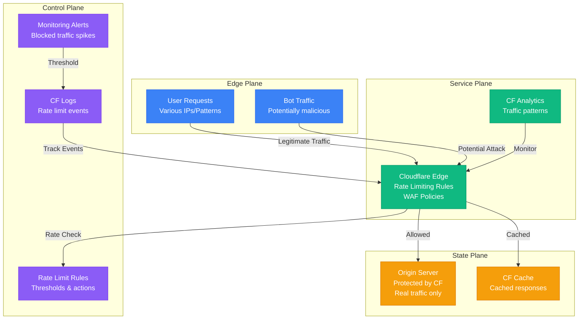

# Cloudflare Rate Limiting Debugging

**Scenario**: Production traffic being blocked by Cloudflare rate limiting, causing legitimate user requests to fail.

**The 3 AM Reality**: Users receiving 429 Too Many Requests errors, API calls being throttled, and potential revenue loss from blocked traffic.

## Symptoms Checklist

- [ ] 429 status codes in access logs
- [ ] Cloudflare error pages shown to users
- [ ] Legitimate traffic patterns triggering rate limits
- [ ] API endpoints becoming unavailable
- [ ] Customer complaints about service accessibility

## Cloudflare Rate Limiting Architecture



## Critical Commands & Analysis

### Cloudflare API Analysis
```bash
# Check rate limiting events via CF API
curl -X GET "https://api.cloudflare.com/client/v4/zones/{zone_id}/analytics/dashboard" \
     -H "Authorization: Bearer {api_token}" \
     -H "Content-Type: application/json" \
     --data '{"since":"2023-01-01T00:00:00Z","until":"2023-01-01T23:59:59Z"}'

# Get rate limiting rules
curl -X GET "https://api.cloudflare.com/client/v4/zones/{zone_id}/rate_limits" \
     -H "Authorization: Bearer {api_token}"

# Check firewall events
curl -X GET "https://api.cloudflare.com/client/v4/zones/{zone_id}/firewall/events" \
     -H "Authorization: Bearer {api_token}"
```

### Log Analysis Patterns
```bash
# Parse Cloudflare logs for rate limiting
# Using CloudFlare Logpush or Logpull

# Filter rate limit events
jq 'select(.EdgeResponseStatus == 429)' cloudflare.log

# Analyze rate limited IPs
jq -r 'select(.EdgeResponseStatus == 429) | .ClientIP' cloudflare.log | sort | uniq -c | sort -nr

# Check user agents being rate limited
jq -r 'select(.EdgeResponseStatus == 429) | .ClientRequestUserAgent' cloudflare.log | sort | uniq -c
```

## Common Root Causes & Solutions

### 1. Overly Aggressive Rate Limits (45% of cases)
```bash
# Detection: Check legitimate traffic patterns
curl -X GET "https://api.cloudflare.com/client/v4/zones/{zone_id}/analytics/dashboard" \
     -H "Authorization: Bearer {api_token}"

# Solution: Adjust rate limits
curl -X PUT "https://api.cloudflare.com/client/v4/zones/{zone_id}/rate_limits/{rule_id}" \
     -H "Authorization: Bearer {api_token}" \
     -H "Content-Type: application/json" \
     --data '{
       "threshold": 100,
       "period": 60,
       "action": {
         "mode": "challenge",
         "timeout": 60
       }
     }'
```

### 2. Bot Traffic Misidentification (30% of cases)
```bash
# Check bot management settings
curl -X GET "https://api.cloudflare.com/client/v4/zones/{zone_id}/bot_management" \
     -H "Authorization: Bearer {api_token}"

# Whitelist legitimate bots
curl -X POST "https://api.cloudflare.com/client/v4/zones/{zone_id}/firewall/rules" \
     -H "Authorization: Bearer {api_token}" \
     -H "Content-Type: application/json" \
     --data '{
       "filter": {
         "expression": "(cf.bot_management.verified_bot)"
       },
       "action": "allow"
     }'
```

### 3. API Endpoint Rate Limiting (20% of cases)
```bash
# Create API-specific rate limits
curl -X POST "https://api.cloudflare.com/client/v4/zones/{zone_id}/rate_limits" \
     -H "Authorization: Bearer {api_token}" \
     -H "Content-Type: application/json" \
     --data '{
       "threshold": 1000,
       "period": 3600,
       "match": {
         "request": {
           "url": "api.example.com/v1/*"
         }
       },
       "action": {
         "mode": "ban",
         "timeout": 600
       }
     }'
```

## Immediate Mitigation

### Emergency Response
```bash
# Temporarily disable rate limiting rule
curl -X PATCH "https://api.cloudflare.com/client/v4/zones/{zone_id}/rate_limits/{rule_id}" \
     -H "Authorization: Bearer {api_token}" \
     -H "Content-Type: application/json" \
     --data '{"disabled": true}'

# Create bypass rule for critical IPs
curl -X POST "https://api.cloudflare.com/client/v4/zones/{zone_id}/firewall/rules" \
     -H "Authorization: Bearer {api_token}" \
     -H "Content-Type: application/json" \
     --data '{
       "filter": {
         "expression": "(ip.src in {192.168.1.1 203.0.113.1})"
       },
       "action": "allow"
     }'
```

## Production Examples

### Shopify's Black Friday CF Limits (2020)
- **Incident**: Legitimate checkout traffic being rate limited during peak sales
- **Root Cause**: Conservative rate limits set for normal traffic
- **Impact**: 12% reduction in successful checkouts for 45 minutes
- **Resolution**: Increased thresholds, implemented dynamic rate limiting
- **Prevention**: Load testing with realistic traffic patterns

### Discord's API Rate Limiting (2021)
- **Incident**: Mobile app users receiving 429 errors during server outage recovery
- **Root Cause**: Retry logic in mobile app overwhelming rate limits
- **Impact**: App unusable for 30% of users for 2 hours
- **Resolution**: Implemented exponential backoff, increased API limits
- **Learning**: Rate limits must account for retry behavior

**Remember**: Cloudflare rate limiting should protect your origin while allowing legitimate traffic. Always analyze traffic patterns before setting limits, implement proper monitoring, and have emergency bypass procedures ready.