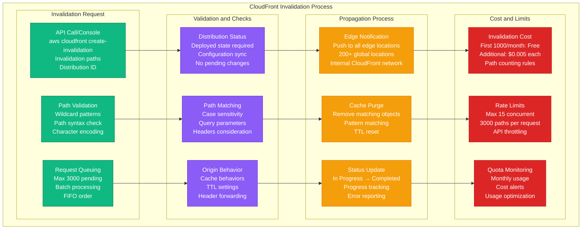
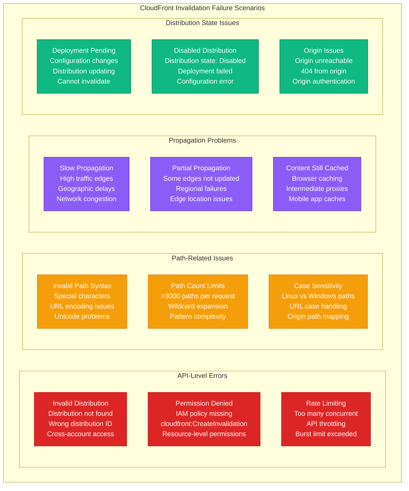
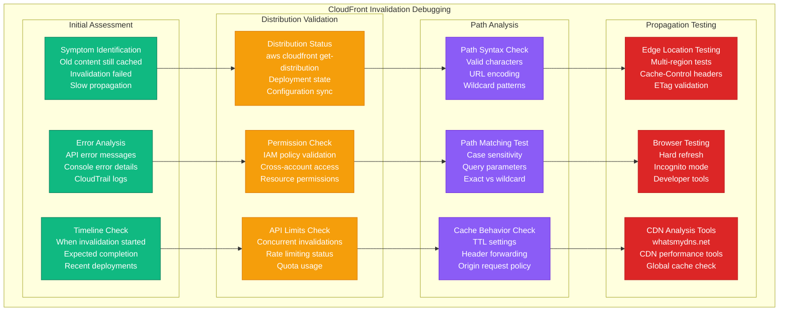

# CloudFront Invalidation Debugging

## Overview

CloudFront invalidation failures prevent updated content from reaching users, causing stale deployments and customer-facing issues. These problems affect 40% of CDN-related incidents, manifesting as cached old content, slow invalidation propagation, and cost overruns from excessive invalidations. This guide provides systematic troubleshooting for invalidation failures and optimization strategies.

## CloudFront Invalidation Flow



## Common Invalidation Failure Scenarios



## Systematic Debugging Process



## 3 AM Debugging Commands

### Quick Status Check
```bash
# Check distribution status
aws cloudfront get-distribution --id E1234567890123

# List recent invalidations
aws cloudfront list-invalidations --distribution-id E1234567890123 --max-items 10

# Check specific invalidation status
aws cloudfront get-invalidation --distribution-id E1234567890123 --id I1234567890ABC

# Check current API limits
aws service-quotas get-service-quota \
  --service-code cloudfront \
  --quota-code L-07B3369A  # CloudFront invalidation requests quota
```

### Distribution and Configuration Validation
```bash
# Verify distribution is deployed
aws cloudfront get-distribution --id E1234567890123 \
  --query 'Distribution.Status' --output text

# Check distribution configuration
aws cloudfront get-distribution-config --id E1234567890123

# List all distributions (if ID unknown)
aws cloudfront list-distributions \
  --query 'DistributionList.Items[*].[Id,DomainName,Status]' \
  --output table

# Check if distribution is enabled
aws cloudfront get-distribution --id E1234567890123 \
  --query 'Distribution.DistributionConfig.Enabled' --output text
```

### Path and Cache Testing
```bash
# Test specific URL caching
curl -I https://your-domain.com/path/to/file.js

# Check CloudFront cache headers
curl -H "Cache-Control: no-cache" -I https://your-domain.com/path/to/file.js

# Test from different edge locations
curl -H "CloudFront-Viewer-Country: US" -I https://your-domain.com/file.js
curl -H "CloudFront-Viewer-Country: GB" -I https://your-domain.com/file.js

# Force cache miss to test origin
curl -H "Cache-Control: no-cache, no-store, must-revalidate" \
  -H "Pragma: no-cache" \
  -H "Expires: 0" \
  -I https://your-domain.com/file.js
```

### Invalidation Creation and Monitoring
```bash
# Create invalidation for specific files
aws cloudfront create-invalidation \
  --distribution-id E1234567890123 \
  --paths "/index.html" "/assets/app.js"

# Create wildcard invalidation
aws cloudfront create-invalidation \
  --distribution-id E1234567890123 \
  --paths "/*"

# Monitor invalidation progress
INVALIDATION_ID="I1234567890ABC"
while true; do
  STATUS=$(aws cloudfront get-invalidation \
    --distribution-id E1234567890123 \
    --id $INVALIDATION_ID \
    --query 'Invalidation.Status' --output text)
  echo "Status: $STATUS"
  [ "$STATUS" = "Completed" ] && break
  sleep 30
done
```

## Common Issues and Solutions

### Issue 1: Permission Denied Errors

**Symptoms:**
```
An error occurred (AccessDenied) when calling the CreateInvalidation operation:
User: arn:aws:iam::123456789012:user/deploy-user is not authorized
to perform: cloudfront:CreateInvalidation on resource: arn:aws:cloudfront::123456789012:distribution/E1234567890123
```

**Root Cause Analysis:**
```bash
# Check current user/role
aws sts get-caller-identity

# Check CloudFront permissions
aws iam get-user-policy --user-name deploy-user --policy-name CloudFrontPolicy

# Test specific permission
aws iam simulate-principal-policy \
  --policy-source-arn arn:aws:iam::123456789012:user/deploy-user \
  --action-names cloudfront:CreateInvalidation \
  --resource-arns arn:aws:cloudfront::123456789012:distribution/E1234567890123
```

**Solution:**
```json
{
  "Version": "2012-10-17",
  "Statement": [
    {
      "Effect": "Allow",
      "Action": [
        "cloudfront:CreateInvalidation",
        "cloudfront:GetInvalidation",
        "cloudfront:ListInvalidations"
      ],
      "Resource": [
        "arn:aws:cloudfront::*:distribution/E1234567890123"
      ]
    }
  ]
}
```

### Issue 2: Invalidation Stuck "In Progress"

**Symptoms:**
- Invalidation shows "InProgress" for >20 minutes
- Content still cached after expected completion
- No error messages in API responses

**Debugging Steps:**
```bash
# Check invalidation details
aws cloudfront get-invalidation \
  --distribution-id E1234567890123 \
  --id I1234567890ABC

# Check for concurrent invalidations
aws cloudfront list-invalidations \
  --distribution-id E1234567890123 \
  --query 'InvalidationList.Items[?Status==`InProgress`]'

# Check distribution deployment status
aws cloudfront get-distribution \
  --id E1234567890123 \
  --query 'Distribution.Status'

# Check CloudFront service health
aws health describe-events \
  --filter services=CLOUDFRONT \
  --query 'events[?eventTypeCode==`AWS_CLOUDFRONT_OPERATIONAL_ISSUE`]'
```

**Common Causes:**
- High traffic causing slow propagation
- Many concurrent invalidations
- Distribution configuration changes pending
- CloudFront service issues

**Solution:**
```bash
# Wait for completion (normal time: 5-15 minutes)
# Check AWS Service Health Dashboard
# Consider using versioned content instead of invalidation

# For urgent fixes, use versioned filenames
# Instead of: /assets/app.js
# Use: /assets/app.v1.2.3.js
```

### Issue 3: Content Still Cached After Invalidation

**Symptoms:**
- Invalidation shows "Completed"
- Old content still served to users
- New content visible in some regions only

**Debugging Steps:**
```bash
# Test from multiple edge locations
for region in us-east-1 eu-west-1 ap-southeast-1; do
  echo "Testing from $region:"
  curl -H "CloudFront-Viewer-Country: ${region:0:2}" \
    -I https://your-domain.com/file.js | grep -E "(Last-Modified|ETag|Date)"
done

# Check browser caching
curl -I https://your-domain.com/file.js | grep -E "(Cache-Control|Expires)"

# Test with cache-busting
curl -I "https://your-domain.com/file.js?$(date +%s)"

# Check if path matches exactly
aws cloudfront get-invalidation \
  --distribution-id E1234567890123 \
  --id I1234567890ABC \
  --query 'Invalidation.InvalidationBatch.Paths'
```

**Common Causes:**
- Browser/client-side caching
- Intermediate proxy caching
- Path case sensitivity mismatch
- Query parameters not invalidated
- Mobile app caching

**Solution:**
```bash
# Force browser refresh
# Ctrl+F5 or Cmd+Shift+R

# Clear browser cache
# Settings -> Privacy -> Clear browsing data

# Use versioned URLs for critical assets
# /assets/app.v1.2.3.js instead of /assets/app.js

# Add cache-busting for testing
curl -H "Cache-Control: no-cache" https://your-domain.com/file.js
```

### Issue 4: Excessive Invalidation Costs

**Symptoms:**
- High CloudFront bills
- Many invalidation requests per deployment
- Frequent wildcard invalidations

**Cost Analysis:**
```bash
# Check monthly invalidation usage
aws cloudfront list-invalidations \
  --distribution-id E1234567890123 \
  --query 'InvalidationList.Items[?starts_with(CreateTime,`2024-01`)]' \
  | jq 'length'

# Analyze invalidation patterns
aws cloudfront list-invalidations \
  --distribution-id E1234567890123 \
  --query 'InvalidationList.Items[*].[CreateTime,InvalidationBatch.Paths.Quantity]' \
  --output table

# Calculate cost impact
INVALIDATIONS_COUNT=$(aws cloudfront list-invalidations \
  --distribution-id E1234567890123 \
  --query 'InvalidationList.Items[?starts_with(CreateTime,`2024-01`)]' \
  | jq 'map(.InvalidationBatch.Paths.Quantity) | add')

COST=$(echo "scale=2; ($INVALIDATIONS_COUNT - 1000) * 0.005" | bc)
echo "Estimated monthly invalidation cost: \$$COST"
```

**Optimization Strategies:**
```bash
# Use versioned filenames instead of invalidation
# Before: /assets/app.js
# After: /assets/app.v1.2.3.js

# Batch invalidations efficiently
aws cloudfront create-invalidation \
  --distribution-id E1234567890123 \
  --paths "/index.html" "/assets/*" "/api/config.json"

# Use specific paths instead of wildcards
# Instead of: "/*"
# Use: "/index.html" "/assets/app.js" "/assets/style.css"
```

## Monitoring and Prevention

### Automated Invalidation Monitoring
```python
#!/usr/bin/env python3
# cloudfront-invalidation-monitor.py

import boto3
import json
from datetime import datetime, timedelta

def monitor_invalidations(distribution_id):
    """Monitor CloudFront invalidation status and costs"""
    cloudfront = boto3.client('cloudfront')

    # Get recent invalidations
    response = cloudfront.list_invalidations(DistributionId=distribution_id)
    invalidations = response['InvalidationList']['Items']

    # Check for stuck invalidations
    stuck_threshold = datetime.now() - timedelta(minutes=30)
    stuck_invalidations = []

    total_paths_this_month = 0
    current_month = datetime.now().strftime('%Y-%m')

    for inv in invalidations:
        create_time = inv['CreateTime'].replace(tzinfo=None)

        # Check for stuck invalidations
        if inv['Status'] == 'InProgress' and create_time < stuck_threshold:
            stuck_invalidations.append({
                'id': inv['Id'],
                'create_time': create_time,
                'paths': inv['InvalidationBatch']['Paths']['Quantity']
            })

        # Count monthly usage
        if create_time.strftime('%Y-%m') == current_month:
            total_paths_this_month += inv['InvalidationBatch']['Paths']['Quantity']

    # Generate report
    report = {
        'distribution_id': distribution_id,
        'stuck_invalidations': stuck_invalidations,
        'monthly_path_count': total_paths_this_month,
        'estimated_monthly_cost': max(0, (total_paths_this_month - 1000) * 0.005),
        'free_quota_remaining': max(0, 1000 - total_paths_this_month)
    }

    return report

def send_alert_if_needed(report):
    """Send alert for issues"""
    alerts = []

    if report['stuck_invalidations']:
        alerts.append(f"🚨 {len(report['stuck_invalidations'])} stuck invalidations")

    if report['monthly_path_count'] > 800:  # Alert at 80% of free quota
        alerts.append(f"⚠️ High invalidation usage: {report['monthly_path_count']}/1000 free paths used")

    if report['estimated_monthly_cost'] > 10:
        alerts.append(f"💰 High invalidation costs: ${report['estimated_monthly_cost']:.2f}")

    if alerts:
        # Send to Slack/Teams/email
        message = f"CloudFront Invalidation Alert:\n" + "\n".join(alerts)
        print(message)
        # implement_alert_sending(message)

if __name__ == "__main__":
    DISTRIBUTION_ID = "E1234567890123"
    report = monitor_invalidations(DISTRIBUTION_ID)
    send_alert_if_needed(report)
    print(json.dumps(report, indent=2, default=str))
```

### CI/CD Integration for Smart Invalidation
```yaml
# .github/workflows/deploy-and-invalidate.yml
name: Deploy and Smart Invalidate

on:
  push:
    branches: [main]

jobs:
  deploy:
    runs-on: ubuntu-latest
    steps:
    - uses: actions/checkout@v3
      with:
        fetch-depth: 2  # Need previous commit for diff

    - name: Build application
      run: npm run build

    - name: Deploy to S3
      run: aws s3 sync ./build s3://your-bucket --delete

    - name: Determine changed files
      id: changes
      run: |
        CHANGED_FILES=$(git diff --name-only HEAD~1 HEAD | grep -E '\.(html|js|css|json)$' || true)
        if [ -z "$CHANGED_FILES" ]; then
          echo "invalidate=false" >> $GITHUB_OUTPUT
        else
          echo "invalidate=true" >> $GITHUB_OUTPUT
          echo "files=$CHANGED_FILES" >> $GITHUB_OUTPUT
        fi

    - name: Smart CloudFront Invalidation
      if: steps.changes.outputs.invalidate == 'true'
      run: |
        # Convert file paths to CloudFront paths
        PATHS=""
        for file in ${{ steps.changes.outputs.files }}; do
          if [[ $file == "index.html" ]]; then
            PATHS="$PATHS /index.html /"
          elif [[ $file == *.html ]]; then
            PATHS="$PATHS /$file"
          elif [[ $file == build/* ]]; then
            CLOUDFRONT_PATH="/${file#build/}"
            PATHS="$PATHS $CLOUDFRONT_PATH"
          fi
        done

        if [ -n "$PATHS" ]; then
          echo "Invalidating paths: $PATHS"
          aws cloudfront create-invalidation \
            --distribution-id ${{ secrets.CLOUDFRONT_DISTRIBUTION_ID }} \
            --paths $PATHS
        fi
```

### Cost Optimization Script
```bash
#!/bin/bash
# optimize-invalidations.sh

DISTRIBUTION_ID="E1234567890123"

# Analyze current invalidation patterns
echo "=== CloudFront Invalidation Analysis ==="

# Get monthly usage
CURRENT_MONTH=$(date +%Y-%m)
MONTHLY_INVALIDATIONS=$(aws cloudfront list-invalidations \
  --distribution-id $DISTRIBUTION_ID \
  --query "InvalidationList.Items[?starts_with(CreateTime,'$CURRENT_MONTH')]" \
  | jq 'map(.InvalidationBatch.Paths.Quantity) | add // 0')

echo "Monthly invalidation paths used: $MONTHLY_INVALIDATIONS"
echo "Free quota remaining: $((1000 - MONTHLY_INVALIDATIONS))"

if [ $MONTHLY_INVALIDATIONS -gt 800 ]; then
  echo "⚠️  WARNING: Approaching free quota limit"
fi

# Check for wildcard usage
WILDCARD_COUNT=$(aws cloudfront list-invalidations \
  --distribution-id $DISTRIBUTION_ID \
  --query "InvalidationList.Items[?starts_with(CreateTime,'$CURRENT_MONTH')]" \
  | jq '[.[] | select(.InvalidationBatch.Paths.Items[] | contains("*"))] | length')

echo "Wildcard invalidations this month: $WILDCARD_COUNT"

if [ $WILDCARD_COUNT -gt 5 ]; then
  echo "💡 SUGGESTION: Consider using versioned filenames instead of wildcards"
fi

# Optimization recommendations
echo ""
echo "=== Optimization Recommendations ==="
echo "1. Use versioned filenames: app.v1.2.3.js instead of app.js"
echo "2. Batch related files in single invalidation request"
echo "3. Use specific paths instead of wildcards when possible"
echo "4. Consider cache-busting query parameters for testing"
```

## Best Practices

### 1. Efficient Invalidation Strategies
```bash
# Good: Specific paths
aws cloudfront create-invalidation \
  --distribution-id E1234567890123 \
  --paths "/index.html" "/assets/app.js" "/assets/style.css"

# Better: Versioned filenames (no invalidation needed)
# /assets/app.v1.2.3.js
# /assets/style.v1.2.3.css

# Good: Batched invalidation
aws cloudfront create-invalidation \
  --distribution-id E1234567890123 \
  --paths "/api/*" "/assets/images/*"

# Avoid: Frequent wildcard invalidations
# aws cloudfront create-invalidation --paths "/*"
```

### 2. Cache Headers Optimization
```nginx
# Nginx configuration for CloudFront
location /assets/ {
  # Long cache for versioned assets
  expires 1y;
  add_header Cache-Control "public, immutable";
}

location = /index.html {
  # Short cache for HTML
  expires 5m;
  add_header Cache-Control "public, must-revalidate";
}

location /api/ {
  # No cache for API responses
  expires -1;
  add_header Cache-Control "no-cache, no-store, must-revalidate";
}
```

### 3. Monitoring and Alerting
```yaml
# CloudWatch alarm for invalidation costs
Resources:
  InvalidationCostAlarm:
    Type: AWS::CloudWatch::Alarm
    Properties:
      AlarmName: CloudFront-Invalidation-Cost-High
      MetricName: InvalidationRequests
      Namespace: AWS/CloudFront
      Statistic: Sum
      Period: 2592000  # 30 days
      Threshold: 800   # 80% of free quota
      ComparisonOperator: GreaterThanThreshold
      AlarmActions:
        - !Ref SNSTopicArn
```

## Quick Reference

### Essential Commands
```bash
# Check invalidation status
aws cloudfront get-invalidation --distribution-id E123 --id I456

# Create targeted invalidation
aws cloudfront create-invalidation --distribution-id E123 --paths "/file.js"

# Test cache behavior
curl -I https://domain.com/file.js

# Check distribution status
aws cloudfront get-distribution --id E123 --query 'Distribution.Status'
```

### Emergency Checklist
1. ✅ Check distribution deployment status
2. ✅ Verify IAM permissions for invalidation
3. ✅ Confirm invalidation paths are correct
4. ✅ Test content from multiple regions
5. ✅ Check browser/client-side caching
6. ✅ Monitor invalidation costs and quotas

*Keep this guide accessible for quick CloudFront invalidation troubleshooting during deployments.*