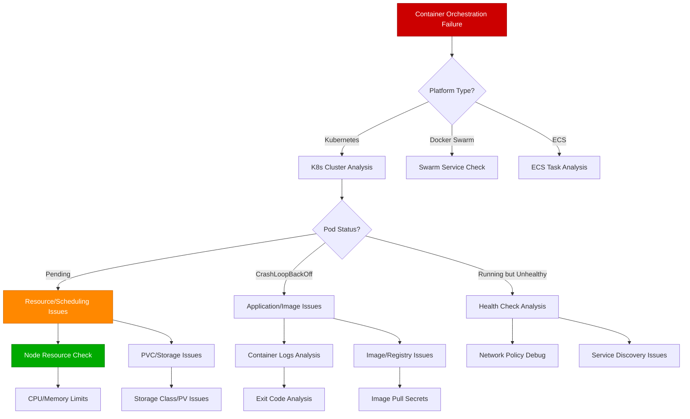

# Container Orchestration Issues Guide

## Overview

Container orchestration failures in Kubernetes and other platforms can cause service outages, resource exhaustion, and complex networking issues. This guide provides systematic approaches used by platform teams at Google, Microsoft, and Red Hat to diagnose and resolve container orchestration issues in production environments.

**Time to Resolution**: 10-30 minutes for pod restart issues, 1-4 hours for complex networking or storage problems

## Decision Tree



## Immediate Triage Commands (First 5 Minutes)

### 1. Cluster and Pod Overview
```bash
# Overall cluster health
kubectl cluster-info
kubectl get nodes -o wide
kubectl top nodes

# Pod status across all namespaces
kubectl get pods --all-namespaces | grep -v Running | grep -v Completed
kubectl get events --sort-by='.lastTimestamp' | head -20

# Resource utilization
kubectl top pods --all-namespaces --sort-by=memory
kubectl top pods --all-namespaces --sort-by=cpu
```

### 2. Problem Pod Investigation
```bash
# Detailed pod information
kubectl describe pod $POD_NAME -n $NAMESPACE

# Pod logs (current and previous containers)
kubectl logs $POD_NAME -n $NAMESPACE --tail=100
kubectl logs $POD_NAME -n $NAMESPACE --previous

# Resource requests and limits
kubectl get pod $POD_NAME -n $NAMESPACE -o jsonpath='{range .spec.containers[*]}{.name}{": requests="}{.resources.requests}{" limits="}{.resources.limits}{"\n"}{end}'

# Pod placement and affinity
kubectl get pod $POD_NAME -n $NAMESPACE -o jsonpath='{.spec.nodeName}' && echo
kubectl get pod $POD_NAME -n $NAMESPACE -o jsonpath='{.spec.affinity}'
```

### 3. Node and Storage Status
```bash
# Node conditions and taints
kubectl describe node $NODE_NAME | grep -A 10 -E "(Conditions|Taints)"

# Storage and PVC status
kubectl get pvc --all-namespaces
kubectl describe pvc $PVC_NAME -n $NAMESPACE

# Network policy and service status
kubectl get networkpolicies --all-namespaces
kubectl get services --all-namespaces | grep -v ClusterIP
```

## Kubernetes Pod Troubleshooting

### 1. Pod Status Analysis Script
```bash
#!/bin/bash

# Comprehensive Kubernetes pod troubleshooting script
POD_NAME="$1"
NAMESPACE="${2:-default}"

if [ -z "$POD_NAME" ]; then
    echo "Usage: $0 <pod_name> [namespace]"
    exit 1
fi

echo "=== Kubernetes Pod Troubleshooting: $POD_NAME in $NAMESPACE ==="

# Pod basic information
echo "--- Pod Status ---"
kubectl get pod $POD_NAME -n $NAMESPACE -o wide
echo ""

# Pod details
echo "--- Pod Description ---"
kubectl describe pod $POD_NAME -n $NAMESPACE
echo ""

# Container status
echo "--- Container Status ---"
kubectl get pod $POD_NAME -n $NAMESPACE -o jsonpath='{range .status.containerStatuses[*]}{.name}{": ready="}{.ready}{" restartCount="}{.restartCount}{" state="}{.state}{"\n"}{end}'
echo ""

# Resource usage vs limits
echo "--- Resource Analysis ---"
echo "Requests and Limits:"
kubectl get pod $POD_NAME -n $NAMESPACE -o jsonpath='{range .spec.containers[*]}{.name}{":\n  requests: "}{.resources.requests}{"  \n  limits: "}{.resources.limits}{"\n"}{end}'

echo ""
echo "Current Usage:"
kubectl top pod $POD_NAME -n $NAMESPACE --containers 2>/dev/null || echo "Metrics not available"
echo ""

# Node information
NODE_NAME=$(kubectl get pod $POD_NAME -n $NAMESPACE -o jsonpath='{.spec.nodeName}')
if [ -n "$NODE_NAME" ]; then
    echo "--- Node Information: $NODE_NAME ---"
    kubectl describe node $NODE_NAME | grep -A 5 -E "(Conditions|Allocatable|Allocated resources)"
    echo ""
fi

# Logs
echo "--- Container Logs (Last 50 lines) ---"
kubectl logs $POD_NAME -n $NAMESPACE --tail=50 2>/dev/null || echo "No logs available"

# Previous container logs if pod has restarted
RESTART_COUNT=$(kubectl get pod $POD_NAME -n $NAMESPACE -o jsonpath='{.status.containerStatuses[0].restartCount}')
if [ "$RESTART_COUNT" -gt 0 ]; then
    echo ""
    echo "--- Previous Container Logs (Last 50 lines) ---"
    kubectl logs $POD_NAME -n $NAMESPACE --previous --tail=50 2>/dev/null || echo "No previous logs available"
fi

# Events related to this pod
echo ""
echo "--- Recent Events ---"
kubectl get events -n $NAMESPACE --field-selector involvedObject.name=$POD_NAME --sort-by='.lastTimestamp' | tail -10

# Storage information if PVCs are present
PVC_NAMES=$(kubectl get pod $POD_NAME -n $NAMESPACE -o jsonpath='{range .spec.volumes[*]}{.persistentVolumeClaim.claimName}{"\n"}{end}' | grep -v '^$')
if [ -n "$PVC_NAMES" ]; then
    echo ""
    echo "--- Persistent Volume Claims ---"
    for pvc in $PVC_NAMES; do
        echo "PVC: $pvc"
        kubectl describe pvc $pvc -n $NAMESPACE | grep -E "(Status|Capacity|Access|StorageClass)"
        echo ""
    done
fi

# Network information
echo "--- Network Configuration ---"
kubectl get pod $POD_NAME -n $NAMESPACE -o jsonpath='{.status.podIP}' | xargs -I {} echo "Pod IP: {}"
kubectl get pod $POD_NAME -n $NAMESPACE -o jsonpath='{.spec.serviceAccountName}' | xargs -I {} echo "Service Account: {}"

# Security context
echo ""
echo "--- Security Context ---"
kubectl get pod $POD_NAME -n $NAMESPACE -o jsonpath='{.spec.securityContext}' | jq . 2>/dev/null || echo "Default security context"
kubectl get pod $POD_NAME -n $NAMESPACE -o jsonpath='{range .spec.containers[*]}{.name}{": "}{.securityContext}{"\n"}{end}'

echo ""
echo "=== End Pod Troubleshooting ==="
```

### 2. Resource Limit and Request Analysis
```python
# Python script for advanced Kubernetes resource analysis
import subprocess
import json
import sys
from typing import Dict, List, Optional
from dataclasses import dataclass

@dataclass
class ResourceRequirements:
    requests_cpu: Optional[str]
    requests_memory: Optional[str]
    limits_cpu: Optional[str]
    limits_memory: Optional[str]

@dataclass
class PodResourceStatus:
    name: str
    namespace: str
    node: str
    phase: str
    containers: List[Dict]
    resource_requirements: ResourceRequirements
    current_usage: Optional[Dict]

class KubernetesResourceAnalyzer:
    def __init__(self):
        self.pods_data = []

    def get_all_pods_resource_status(self, namespace: str = None) -> List[PodResourceStatus]:
        """Get resource status for all pods"""
        # Get pod information
        cmd = ['kubectl', 'get', 'pods', '-o', 'json']
        if namespace:
            cmd.extend(['-n', namespace])
        else:
            cmd.append('--all-namespaces')

        try:
            result = subprocess.run(cmd, capture_output=True, text=True, check=True)
            pods_json = json.loads(result.stdout)
        except subprocess.CalledProcessError as e:
            print(f"Error getting pods: {e}")
            return []

        pods_status = []
        for pod in pods_json['items']:
            status = self._analyze_pod_resources(pod)
            if status:
                pods_status.append(status)

        return pods_status

    def _analyze_pod_resources(self, pod_data: Dict) -> Optional[PodResourceStatus]:
        """Analyze resource requirements and usage for a single pod"""
        metadata = pod_data.get('metadata', {})
        spec = pod_data.get('spec', {})
        status = pod_data.get('status', {})

        name = metadata.get('name')
        namespace = metadata.get('namespace', 'default')
        node = spec.get('nodeName', 'unscheduled')
        phase = status.get('phase', 'Unknown')

        if not name:
            return None

        # Extract resource requirements
        containers = spec.get('containers', [])
        total_requests_cpu = 0
        total_requests_memory = 0
        total_limits_cpu = 0
        total_limits_memory = 0

        container_info = []

        for container in containers:
            resources = container.get('resources', {})
            requests = resources.get('requests', {})
            limits = resources.get('limits', {})

            # Parse CPU requests (convert to millicores)
            cpu_request = self._parse_cpu(requests.get('cpu', '0'))
            memory_request = self._parse_memory(requests.get('memory', '0'))
            cpu_limit = self._parse_cpu(limits.get('cpu', '0'))
            memory_limit = self._parse_memory(limits.get('memory', '0'))

            total_requests_cpu += cpu_request
            total_requests_memory += memory_request
            total_limits_cpu += cpu_limit
            total_limits_memory += memory_limit

            container_info.append({
                'name': container.get('name'),
                'requests_cpu_m': cpu_request,
                'requests_memory_bytes': memory_request,
                'limits_cpu_m': cpu_limit,
                'limits_memory_bytes': memory_limit
            })

        resource_req = ResourceRequirements(
            requests_cpu=f"{total_requests_cpu}m",
            requests_memory=f"{total_requests_memory}",
            limits_cpu=f"{total_limits_cpu}m" if total_limits_cpu > 0 else None,
            limits_memory=f"{total_limits_memory}" if total_limits_memory > 0 else None
        )

        # Get current usage if possible
        current_usage = self._get_pod_metrics(name, namespace)

        return PodResourceStatus(
            name=name,
            namespace=namespace,
            node=node,
            phase=phase,
            containers=container_info,
            resource_requirements=resource_req,
            current_usage=current_usage
        )

    def _parse_cpu(self, cpu_str: str) -> int:
        """Parse CPU value and convert to millicores"""
        if not cpu_str or cpu_str == '0':
            return 0

        cpu_str = cpu_str.lower()
        if cpu_str.endswith('m'):
            return int(cpu_str[:-1])
        elif cpu_str.endswith('n'):
            return int(cpu_str[:-1]) // 1000000
        else:
            # Assume it's in cores
            return int(float(cpu_str) * 1000)

    def _parse_memory(self, memory_str: str) -> int:
        """Parse memory value and convert to bytes"""
        if not memory_str or memory_str == '0':
            return 0

        memory_str = memory_str.upper()
        multipliers = {
            'K': 1024,
            'M': 1024**2,
            'G': 1024**3,
            'T': 1024**4,
            'KI': 1024,
            'MI': 1024**2,
            'GI': 1024**3,
            'TI': 1024**4
        }

        for suffix, multiplier in multipliers.items():
            if memory_str.endswith(suffix):
                return int(float(memory_str[:-len(suffix)]) * multiplier)

        # If no suffix, assume bytes
        return int(memory_str)

    def _get_pod_metrics(self, name: str, namespace: str) -> Optional[Dict]:
        """Get current resource usage metrics for a pod"""
        try:
            cmd = ['kubectl', 'top', 'pod', name, '-n', namespace, '--no-headers']
            result = subprocess.run(cmd, capture_output=True, text=True)

            if result.returncode == 0:
                lines = result.stdout.strip().split('\n')
                for line in lines:
                    parts = line.split()
                    if len(parts) >= 3:
                        return {
                            'cpu_usage': parts[1],
                            'memory_usage': parts[2]
                        }
        except Exception:
            pass

        return None

    def find_resource_issues(self, pods: List[PodResourceStatus]) -> Dict[str, List[str]]:
        """Identify potential resource-related issues"""
        issues = {
            'no_requests': [],
            'no_limits': [],
            'high_memory_usage': [],
            'high_cpu_usage': [],
            'pending_pods': [],
            'crashloop_candidates': []
        }

        for pod in pods:
            pod_identifier = f"{pod.namespace}/{pod.name}"

            # Check for missing resource requests
            if pod.resource_requirements.requests_cpu == '0m' or pod.resource_requirements.requests_memory == '0':
                issues['no_requests'].append(pod_identifier)

            # Check for missing resource limits
            if not pod.resource_requirements.limits_cpu or not pod.resource_requirements.limits_memory:
                issues['no_limits'].append(pod_identifier)

            # Check for pending pods (scheduling issues)
            if pod.phase == 'Pending':
                issues['pending_pods'].append(pod_identifier)

            # Check current usage vs limits if metrics available
            if pod.current_usage:
                # This is simplified - would need more sophisticated parsing
                issues['crashloop_candidates'].append(pod_identifier)

        return issues

    def generate_resource_report(self, namespace: str = None) -> Dict:
        """Generate comprehensive resource analysis report"""
        pods = self.get_all_pods_resource_status(namespace)
        issues = self.find_resource_issues(pods)

        # Calculate cluster resource summary
        total_requested_cpu = sum(self._parse_cpu(pod.resource_requirements.requests_cpu or '0') for pod in pods)
        total_requested_memory = sum(self._parse_memory(pod.resource_requirements.requests_memory or '0') for pod in pods)

        total_limited_cpu = sum(
            self._parse_cpu(pod.resource_requirements.limits_cpu or '0') for pod in pods
            if pod.resource_requirements.limits_cpu
        )
        total_limited_memory = sum(
            self._parse_memory(pod.resource_requirements.limits_memory or '0') for pod in pods
            if pod.resource_requirements.limits_memory
        )

        return {
            'timestamp': subprocess.run(['date'], capture_output=True, text=True).stdout.strip(),
            'total_pods': len(pods),
            'cluster_summary': {
                'total_requested_cpu_cores': total_requested_cpu / 1000,
                'total_requested_memory_gb': total_requested_memory / (1024**3),
                'total_limited_cpu_cores': total_limited_cpu / 1000,
                'total_limited_memory_gb': total_limited_memory / (1024**3)
            },
            'issues': issues,
            'recommendations': self._generate_recommendations(issues)
        }

    def _generate_recommendations(self, issues: Dict[str, List[str]]) -> List[str]:
        """Generate recommendations based on identified issues"""
        recommendations = []

        if issues['no_requests']:
            recommendations.append(
                f"Add resource requests to {len(issues['no_requests'])} pods for proper scheduling"
            )

        if issues['no_limits']:
            recommendations.append(
                f"Add resource limits to {len(issues['no_limits'])} pods to prevent resource exhaustion"
            )

        if issues['pending_pods']:
            recommendations.append(
                f"Investigate {len(issues['pending_pods'])} pending pods - check node capacity and scheduling constraints"
            )

        if not any(issues.values()):
            recommendations.append("No major resource configuration issues detected")

        return recommendations

# Usage example
if __name__ == '__main__':
    analyzer = KubernetesResourceAnalyzer()

    # Get namespace from command line or use all namespaces
    namespace = sys.argv[1] if len(sys.argv) > 1 else None

    print(f"Analyzing Kubernetes resources{' in namespace: ' + namespace if namespace else ' across all namespaces'}")
    print("=" * 80)

    report = analyzer.generate_resource_report(namespace)

    print(f"Analysis completed at: {report['timestamp']}")
    print(f"Total pods analyzed: {report['total_pods']}")
    print()

    print("Cluster Resource Summary:")
    summary = report['cluster_summary']
    print(f"  Total CPU Requests: {summary['total_requested_cpu_cores']:.2f} cores")
    print(f"  Total Memory Requests: {summary['total_requested_memory_gb']:.2f} GB")
    print(f"  Total CPU Limits: {summary['total_limited_cpu_cores']:.2f} cores")
    print(f"  Total Memory Limits: {summary['total_limited_memory_gb']:.2f} GB")
    print()

    print("Issues Detected:")
    issues = report['issues']
    for issue_type, affected_pods in issues.items():
        if affected_pods:
            print(f"  {issue_type.replace('_', ' ').title()}: {len(affected_pods)} pods")
            for pod in affected_pods[:5]:  # Show first 5
                print(f"    - {pod}")
            if len(affected_pods) > 5:
                print(f"    ... and {len(affected_pods) - 5} more")
    print()

    print("Recommendations:")
    for rec in report['recommendations']:
        print(f"  - {rec}")
```

### 3. Storage and PVC Troubleshooting
```bash
# Persistent Volume troubleshooting script
#!/bin/bash

echo "=== Kubernetes Storage Troubleshooting ==="

# Overall storage status
echo "--- Storage Classes ---"
kubectl get storageclass
echo ""

echo "--- Persistent Volumes ---"
kubectl get pv -o wide
echo ""

echo "--- Persistent Volume Claims (All Namespaces) ---"
kubectl get pvc --all-namespaces -o wide
echo ""

# Find problematic PVCs
echo "--- Problematic PVCs ---"
kubectl get pvc --all-namespaces | grep -v Bound | grep -v STATUS

# Check for PVCs with issues
for pvc_info in $(kubectl get pvc --all-namespaces -o jsonpath='{range .items[*]}{.metadata.namespace}{"/"}{.metadata.name}{"/"}{.status.phase}{"\n"}{end}' | grep -v Bound); do
    namespace=$(echo $pvc_info | cut -d'/' -f1)
    pvc_name=$(echo $pvc_info | cut -d'/' -f2)
    phase=$(echo $pvc_info | cut -d'/' -f3)

    echo ""
    echo "--- Problematic PVC: $namespace/$pvc_name (Phase: $phase) ---"
    kubectl describe pvc $pvc_name -n $namespace

    # Check events related to this PVC
    echo "Events:"
    kubectl get events -n $namespace --field-selector involvedObject.name=$pvc_name

    # Check pods using this PVC
    echo "Pods using this PVC:"
    kubectl get pods -n $namespace -o json | jq -r ".items[] | select(.spec.volumes[]?.persistentVolumeClaim?.claimName==\"$pvc_name\") | .metadata.name"
done

# Node storage capacity
echo ""
echo "--- Node Storage Capacity ---"
kubectl describe nodes | grep -A 5 -B 5 -E "(Capacity|Allocatable).*storage"

# CSI driver status (if applicable)
echo ""
echo "--- CSI Driver Pods ---"
kubectl get pods -n kube-system | grep csi
```

## Network Policy and Service Mesh Debugging

### 1. Network Connectivity Testing
```bash
# Network connectivity testing script
#!/bin/bash

SOURCE_POD="$1"
TARGET_SERVICE="$2"
NAMESPACE="${3:-default}"

if [ -z "$SOURCE_POD" ] || [ -z "$TARGET_SERVICE" ]; then
    echo "Usage: $0 <source_pod> <target_service> [namespace]"
    echo "Example: $0 frontend-pod backend-service production"
    exit 1
fi

echo "=== Network Connectivity Test ==="
echo "Source: $SOURCE_POD in $NAMESPACE"
echo "Target: $TARGET_SERVICE"
echo ""

# Check if source pod exists and is running
POD_STATUS=$(kubectl get pod $SOURCE_POD -n $NAMESPACE -o jsonpath='{.status.phase}' 2>/dev/null)
if [ "$POD_STATUS" != "Running" ]; then
    echo "ERROR: Source pod $SOURCE_POD is not running (Status: $POD_STATUS)"
    exit 1
fi

# Get target service information
SERVICE_IP=$(kubectl get service $TARGET_SERVICE -n $NAMESPACE -o jsonpath='{.spec.clusterIP}' 2>/dev/null)
SERVICE_PORT=$(kubectl get service $TARGET_SERVICE -n $NAMESPACE -o jsonpath='{.spec.ports[0].port}' 2>/dev/null)

if [ -z "$SERVICE_IP" ]; then
    echo "ERROR: Service $TARGET_SERVICE not found in namespace $NAMESPACE"
    exit 1
fi

echo "Service IP: $SERVICE_IP"
echo "Service Port: $SERVICE_PORT"
echo ""

# DNS resolution test
echo "--- DNS Resolution Test ---"
kubectl exec $SOURCE_POD -n $NAMESPACE -- nslookup $TARGET_SERVICE 2>/dev/null
echo ""

# Network connectivity test
echo "--- Network Connectivity Test ---"
kubectl exec $SOURCE_POD -n $NAMESPACE -- nc -zv $SERVICE_IP $SERVICE_PORT 2>&1 || echo "Connection failed"
echo ""

# HTTP connectivity test (if port 80 or 8080)
if [ "$SERVICE_PORT" = "80" ] || [ "$SERVICE_PORT" = "8080" ]; then
    echo "--- HTTP Connectivity Test ---"
    kubectl exec $SOURCE_POD -n $NAMESPACE -- wget -O- --timeout=5 http://$SERVICE_IP:$SERVICE_PORT 2>/dev/null | head -5
    echo ""
fi

# Check network policies affecting the source pod
echo "--- Network Policies (Source Pod) ---"
kubectl get networkpolicies -n $NAMESPACE -o json | jq -r '.items[] | select(.spec.podSelector.matchLabels as $labels | "'$SOURCE_POD'" | test(".*")) | .metadata.name' 2>/dev/null

# Check network policies affecting the target service
echo "--- Network Policies (Target Service) ---"
TARGET_PODS=$(kubectl get pods -n $NAMESPACE -l "$(kubectl get service $TARGET_SERVICE -n $NAMESPACE -o jsonpath='{.spec.selector}' | sed 's/[{}]//g' | sed 's/:/=/g')" -o jsonpath='{.items[*].metadata.name}')
if [ -n "$TARGET_PODS" ]; then
    echo "Target pods: $TARGET_PODS"
    kubectl get networkpolicies -n $NAMESPACE
else
    echo "No target pods found for service $TARGET_SERVICE"
fi

echo ""
echo "--- Service Endpoints ---"
kubectl get endpoints $TARGET_SERVICE -n $NAMESPACE

echo ""
echo "=== End Network Connectivity Test ==="
```

### 2. Istio Service Mesh Troubleshooting
```bash
# Istio service mesh debugging script
#!/bin/bash

NAMESPACE="${1:-default}"
POD_NAME="$2"

echo "=== Istio Service Mesh Troubleshooting ==="

# Istio system status
echo "--- Istio Control Plane Status ---"
kubectl get pods -n istio-system
echo ""

echo "--- Istio Version ---"
istioctl version
echo ""

# Check proxy status
if [ -n "$POD_NAME" ]; then
    echo "--- Proxy Status for $POD_NAME ---"
    istioctl proxy-status $POD_NAME.$NAMESPACE
    echo ""

    echo "--- Proxy Configuration ---"
    istioctl proxy-config cluster $POD_NAME.$NAMESPACE
    echo ""

    echo "--- Envoy Access Logs (Last 20 lines) ---"
    kubectl logs $POD_NAME -n $NAMESPACE -c istio-proxy --tail=20
    echo ""
else
    echo "--- All Proxy Status ---"
    istioctl proxy-status
    echo ""
fi

# Check Istio configuration
echo "--- Virtual Services ---"
kubectl get virtualservices -n $NAMESPACE
echo ""

echo "--- Destination Rules ---"
kubectl get destinationrules -n $NAMESPACE
echo ""

echo "--- Gateways ---"
kubectl get gateways -n $NAMESPACE
echo ""

echo "--- Service Entries ---"
kubectl get serviceentries -n $NAMESPACE
echo ""

# Check for configuration issues
echo "--- Configuration Analysis ---"
istioctl analyze -n $NAMESPACE
echo ""

# Mutual TLS status
echo "--- Mutual TLS Status ---"
istioctl authn tls-check $POD_NAME.$NAMESPACE 2>/dev/null || echo "TLS check not available"
echo ""

echo "=== End Istio Troubleshooting ==="
```

## Production Case Studies

### Case Study 1: Google - Kubernetes Pod Stuck in Pending

**Problem**: Critical application pods stuck in Pending state during peak traffic, causing service unavailability

**Investigation Process**:
1. **Node resource analysis** revealed CPU requests exceeding node capacity
2. **Pod affinity rules** were too restrictive for available nodes
3. **Storage provisioning** delays due to PVC creation backlog

**Commands Used**:
```bash
# Check pending pods and reasons
kubectl get pods --all-namespaces | grep Pending
kubectl describe pod $POD_NAME -n $NAMESPACE | grep -A 10 Events

# Node capacity analysis
kubectl describe nodes | grep -A 10 "Allocated resources"
kubectl top nodes

# PVC status check
kubectl get pvc --all-namespaces | grep -v Bound
kubectl describe pvc $PVC_NAME -n $NAMESPACE

# Scheduler logs
kubectl logs -n kube-system -l component=kube-scheduler --tail=100
```

**Resolution**: Adjusted resource requests, relaxed affinity rules, added more nodes, optimized storage class
**Time to Resolution**: 45 minutes

### Case Study 2: Microsoft - Container Image Pull Failures

**Problem**: Multiple services failing to start due to image pull errors during deployment

**Root Cause**: Registry authentication issues and network connectivity problems

**Investigation Commands**:
```bash
# Check image pull errors
kubectl get events --all-namespaces | grep "Failed to pull image"

# Image pull secrets verification
kubectl get secrets --all-namespaces | grep docker-registry
kubectl describe secret $SECRET_NAME -n $NAMESPACE

# Node-level Docker/containerd issues
# SSH to nodes and check:
sudo systemctl status docker
sudo systemctl status containerd
docker pull $IMAGE_NAME

# Network connectivity to registry
kubectl run debug-pod --image=busybox --rm -it --restart=Never -- nslookup registry.company.com
```

**Resolution**: Fixed image pull secrets, updated registry certificates, configured HTTP proxy settings
**Time to Resolution**: 2 hours

### Case Study 3: Red Hat - OpenShift Storage Performance Issues

**Problem**: Database pods experiencing high I/O latency causing application timeouts

**Root Cause**: Storage class misconfiguration and insufficient IOPS allocation

**Investigation Process**:
```bash
# Storage performance analysis
kubectl get storageclass -o wide
kubectl describe pv | grep -E "(StorageClass|IOPS|Throughput)"

# Pod I/O metrics
kubectl exec $DB_POD_NAME -- iostat -x 1 5

# Storage driver logs
kubectl logs -n kube-system -l app=csi-driver --tail=100

# Node storage performance
kubectl describe nodes | grep -A 5 -B 5 "ephemeral-storage\|storage"
```

**Resolution**: Switched to high-performance storage class, increased IOPS allocation, optimized volume mount options
**Time to Resolution**: 3 hours

## Advanced Container Debugging Tools

### 1. Multi-Container Pod Debugging
```python
# Python script for advanced multi-container pod debugging
import subprocess
import json
import time
from typing import Dict, List, Optional
from datetime import datetime, timedelta

class MultiContainerPodDebugger:
    def __init__(self, pod_name: str, namespace: str = 'default'):
        self.pod_name = pod_name
        self.namespace = namespace

    def get_pod_containers(self) -> List[Dict]:
        """Get all containers in the pod with their status"""
        cmd = ['kubectl', 'get', 'pod', self.pod_name, '-n', self.namespace, '-o', 'json']
        try:
            result = subprocess.run(cmd, capture_output=True, text=True, check=True)
            pod_data = json.loads(result.stdout)

            containers = []
            container_statuses = pod_data.get('status', {}).get('containerStatuses', [])
            init_container_statuses = pod_data.get('status', {}).get('initContainerStatuses', [])

            # Process init containers
            for init_status in init_container_statuses:
                containers.append({
                    'name': init_status['name'],
                    'type': 'init',
                    'ready': init_status.get('ready', False),
                    'restart_count': init_status.get('restartCount', 0),
                    'state': init_status.get('state', {}),
                    'last_state': init_status.get('lastState', {})
                })

            # Process regular containers
            for status in container_statuses:
                containers.append({
                    'name': status['name'],
                    'type': 'main',
                    'ready': status.get('ready', False),
                    'restart_count': status.get('restartCount', 0),
                    'state': status.get('state', {}),
                    'last_state': status.get('lastState', {})
                })

            return containers

        except subprocess.CalledProcessError as e:
            print(f"Error getting pod information: {e}")
            return []

    def analyze_container_states(self, containers: List[Dict]) -> Dict[str, List[str]]:
        """Analyze container states for issues"""
        issues = {
            'not_ready': [],
            'high_restarts': [],
            'failed_states': [],
            'waiting_states': []
        }

        for container in containers:
            container_id = f"{container['name']} ({container['type']})"

            # Check if container is not ready
            if not container['ready']:
                issues['not_ready'].append(container_id)

            # Check for high restart count
            if container['restart_count'] > 5:
                issues['high_restarts'].append(f"{container_id} - {container['restart_count']} restarts")

            # Check current state
            current_state = container['state']
            if 'terminated' in current_state:
                term_info = current_state['terminated']
                exit_code = term_info.get('exitCode', 0)
                if exit_code != 0:
                    issues['failed_states'].append(f"{container_id} - exited with code {exit_code}")

            if 'waiting' in current_state:
                wait_reason = current_state['waiting'].get('reason', 'Unknown')
                issues['waiting_states'].append(f"{container_id} - waiting: {wait_reason}")

        return issues

    def get_container_logs(self, container_name: str, lines: int = 100) -> Dict[str, str]:
        """Get logs for a specific container"""
        logs = {}

        # Current logs
        cmd = ['kubectl', 'logs', self.pod_name, '-n', self.namespace, '-c', container_name, f'--tail={lines}']
        try:
            result = subprocess.run(cmd, capture_output=True, text=True)
            logs['current'] = result.stdout if result.returncode == 0 else f"Error: {result.stderr}"
        except Exception as e:
            logs['current'] = f"Error getting current logs: {e}"

        # Previous logs (if container restarted)
        cmd_prev = cmd + ['--previous']
        try:
            result = subprocess.run(cmd_prev, capture_output=True, text=True)
            logs['previous'] = result.stdout if result.returncode == 0 else "No previous logs"
        except Exception as e:
            logs['previous'] = "No previous logs available"

        return logs

    def debug_pod_networking(self) -> Dict[str, any]:
        """Debug pod networking issues"""
        network_info = {}

        # Get pod IP
        cmd = ['kubectl', 'get', 'pod', self.pod_name, '-n', self.namespace,
               '-o', 'jsonpath={.status.podIP}']
        try:
            result = subprocess.run(cmd, capture_output=True, text=True, check=True)
            network_info['pod_ip'] = result.stdout.strip()
        except Exception as e:
            network_info['pod_ip'] = f"Error: {e}"

        # Test DNS resolution from pod
        cmd = ['kubectl', 'exec', self.pod_name, '-n', self.namespace, '--',
               'nslookup', 'kubernetes.default.svc.cluster.local']
        try:
            result = subprocess.run(cmd, capture_output=True, text=True)
            network_info['dns_test'] = result.stdout if result.returncode == 0 else result.stderr
        except Exception as e:
            network_info['dns_test'] = f"Error: {e}"

        # Get network policies affecting this pod
        cmd = ['kubectl', 'get', 'networkpolicies', '-n', self.namespace, '-o', 'json']
        try:
            result = subprocess.run(cmd, capture_output=True, text=True, check=True)
            policies_data = json.loads(result.stdout)
            network_info['network_policies'] = [policy['metadata']['name'] for policy in policies_data['items']]
        except Exception as e:
            network_info['network_policies'] = f"Error: {e}"

        return network_info

    def generate_debug_report(self) -> Dict[str, any]:
        """Generate comprehensive debug report"""
        print(f"Generating debug report for pod {self.pod_name} in namespace {self.namespace}")

        containers = self.get_pod_containers()
        issues = self.analyze_container_states(containers)
        network_info = self.debug_pod_networking()

        # Get logs for all containers
        container_logs = {}
        for container in containers:
            container_logs[container['name']] = self.get_container_logs(container['name'])

        # Get recent events
        cmd = ['kubectl', 'get', 'events', '-n', self.namespace,
               '--field-selector', f'involvedObject.name={self.pod_name}',
               '--sort-by', '.lastTimestamp']
        try:
            result = subprocess.run(cmd, capture_output=True, text=True, check=True)
            recent_events = result.stdout
        except Exception as e:
            recent_events = f"Error getting events: {e}"

        return {
            'timestamp': datetime.now().isoformat(),
            'pod_name': self.pod_name,
            'namespace': self.namespace,
            'containers': containers,
            'identified_issues': issues,
            'network_info': network_info,
            'container_logs': container_logs,
            'recent_events': recent_events,
            'recommendations': self._generate_recommendations(issues, containers)
        }

    def _generate_recommendations(self, issues: Dict[str, List[str]], containers: List[Dict]) -> List[str]:
        """Generate recommendations based on identified issues"""
        recommendations = []

        if issues['not_ready']:
            recommendations.append("Investigate readiness probe failures for non-ready containers")

        if issues['high_restarts']:
            recommendations.append("Check container logs and resource limits for frequently restarting containers")

        if issues['failed_states']:
            recommendations.append("Examine exit codes and container logs to understand termination reasons")

        if issues['waiting_states']:
            recommendations.append("Check image availability and resource constraints for waiting containers")

        # Check for missing resource requests/limits
        needs_resources = []
        for container in containers:
            if container['type'] == 'main':  # Focus on main containers
                needs_resources.append(container['name'])

        if needs_resources:
            recommendations.append("Consider adding resource requests and limits to containers")

        if not any(issues.values()):
            recommendations.append("No obvious issues detected - check application logs and metrics")

        return recommendations

# Usage example
if __name__ == '__main__':
    import sys

    if len(sys.argv) < 2:
        print("Usage: python debug_pod.py <pod_name> [namespace]")
        sys.exit(1)

    pod_name = sys.argv[1]
    namespace = sys.argv[2] if len(sys.argv) > 2 else 'default'

    debugger = MultiContainerPodDebugger(pod_name, namespace)
    report = debugger.generate_debug_report()

    print(f"\n=== Debug Report for {pod_name} ===")
    print(f"Timestamp: {report['timestamp']}")
    print(f"Containers: {len(report['containers'])}")

    print(f"\nContainers:")
    for container in report['containers']:
        status = "Ready" if container['ready'] else "Not Ready"
        print(f"  {container['name']} ({container['type']}): {status}, Restarts: {container['restart_count']}")

    print(f"\nIdentified Issues:")
    for issue_type, issue_list in report['identified_issues'].items():
        if issue_list:
            print(f"  {issue_type.replace('_', ' ').title()}:")
            for issue in issue_list:
                print(f"    - {issue}")

    print(f"\nNetwork Info:")
    print(f"  Pod IP: {report['network_info'].get('pod_ip', 'Unknown')}")
    print(f"  Network Policies: {len(report['network_info'].get('network_policies', []))}")

    print(f"\nRecommendations:")
    for rec in report['recommendations']:
        print(f"  - {rec}")
```

## 3 AM Debugging Checklist

When you're called at 3 AM for container orchestration issues:

### First 2 Minutes
- [ ] Check overall cluster health: `kubectl get nodes`
- [ ] Identify failing pods: `kubectl get pods --all-namespaces | grep -v Running`
- [ ] Check recent events: `kubectl get events --sort-by='.lastTimestamp' | tail -20`
- [ ] Verify if issue is isolated or cluster-wide

### Minutes 2-5
- [ ] Get details on problem pods: `kubectl describe pod $POD_NAME`
- [ ] Check container logs: `kubectl logs $POD_NAME --previous`
- [ ] Verify resource availability on nodes
- [ ] Check storage and networking status

### Minutes 5-15
- [ ] Analyze resource requests vs node capacity
- [ ] Check for image pull issues or registry problems
- [ ] Verify network policies and service mesh configuration
- [ ] Look for storage provisioning or mounting issues

### If Still Debugging After 15 Minutes
- [ ] Escalate to platform/infrastructure team
- [ ] Consider scaling up cluster resources
- [ ] Check for underlying infrastructure issues
- [ ] Implement temporary workarounds (manual pod rescheduling)

## Container Orchestration Metrics and SLOs

### Key Metrics to Track
- **Pod startup time** (time from scheduled to running)
- **Container restart rate** (restarts per hour)
- **Node resource utilization** (CPU, memory, storage)
- **Image pull success rate**
- **PVC provisioning time**

### Example SLO Configuration
```yaml
container_orchestration_slos:
  - name: "Pod Startup Time"
    description: "95% of pods start within 60 seconds"
    metric: "pod_startup_duration"
    target: 60  # seconds
    percentile: 95
    window: "5m"

  - name: "Container Restart Rate"
    description: "Container restart rate below 5% per hour"
    metric: "container_restarts_per_hour / total_containers"
    target: 0.05
    window: "1h"
```

**Remember**: Container orchestration issues can have cascading effects across your entire application stack. Quick identification and resolution of pod, networking, and storage issues are critical for maintaining service availability.

This guide represents proven strategies from platform teams managing thousands of containers across globally distributed Kubernetes clusters.