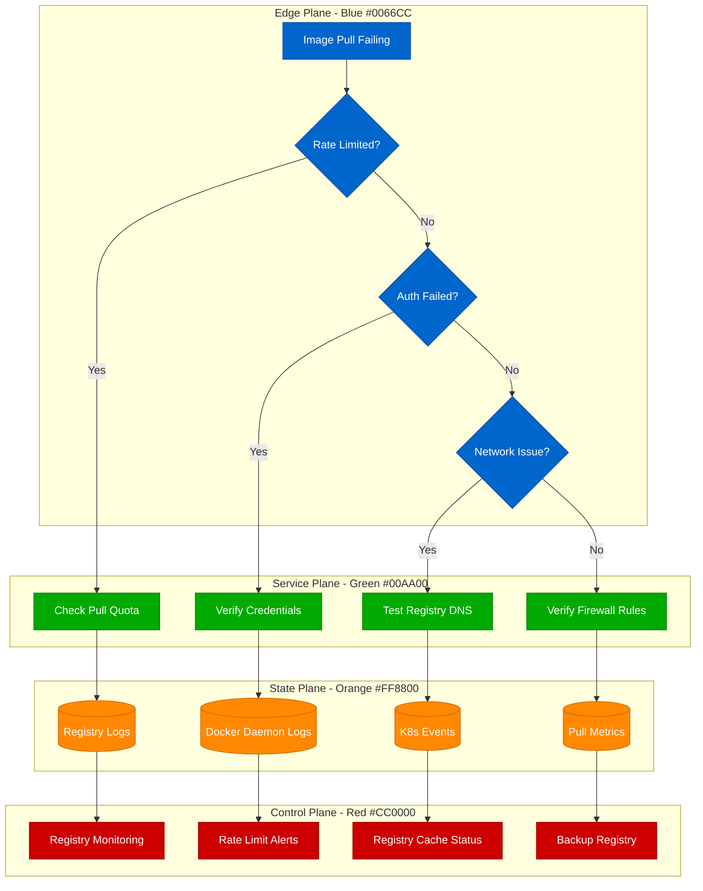
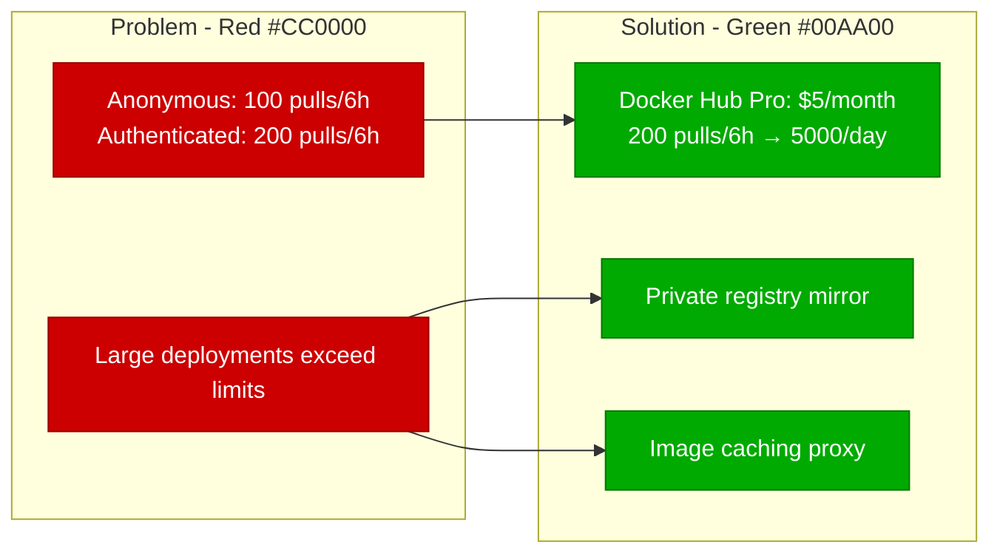
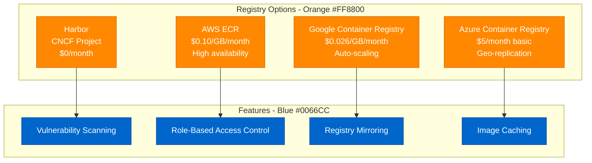

# Container Registry Issues - Production Debugging Guide

## Overview

Container registry issues can halt deployments and prevent scaling operations. This guide provides systematic debugging for Docker Hub rate limits, private registry failures, and image pull problems that commonly occur in production environments.

## Debugging Flowchart



## Common Symptoms

### 1. Docker Hub Rate Limiting
**Error Messages:**
```bash
Error response from daemon: toomanyrequests: You have reached your pull rate limit
```

**Investigation Commands:**
```bash
# Check current rate limit status
curl -H "Authorization: Bearer $TOKEN" \
  "https://auth.docker.io/token?service=registry.docker.io&scope=repository:library/alpine:pull" | \
  jq '.token' | cut -d. -f2 | base64 -d | jq '.

# Monitor pull attempts
docker system events --filter type=image --filter action=pull

# Check authenticated pulls remaining
curl -H "Authorization: Bearer $TOKEN" \
  -I https://registry-1.docker.io/v2/library/alpine/manifests/latest
```

### 2. Private Registry Authentication
**Error Messages:**
```bash
Error response from daemon: unauthorized: authentication required
Error response from daemon: denied: requested access to the resource is denied
```

**Investigation Commands:**
```bash
# Test registry connectivity
curl -v https://your-registry.com/v2/

# Verify credentials
docker login your-registry.com

# Check stored credentials
cat ~/.docker/config.json

# Test with explicit auth
curl -u username:password https://your-registry.com/v2/_catalog
```

### 3. Network Connectivity Issues
**Error Messages:**
```bash
Error response from daemon: Get https://registry.com/v2/: dial tcp: lookup registry.com: no such host
Error response from daemon: net/http: TLS handshake timeout
```

**Investigation Commands:**
```bash
# DNS resolution test
nslookup registry-1.docker.io
dig registry-1.docker.io

# Network connectivity
telnet registry-1.docker.io 443
curl -I https://registry-1.docker.io/v2/

# Certificate verification
openssl s_client -connect registry-1.docker.io:443 -servername registry-1.docker.io
```

## Root Cause Analysis

### Docker Hub Rate Limits


### Private Registry Solutions


## Monitoring and Alerting

### Key Metrics to Track
```bash
# Registry pull success rate
rate(container_registry_pulls_total{status="success"}[5m]) /
rate(container_registry_pulls_total[5m]) * 100

# Rate limit approach warning (80% threshold)
rate_limit_remaining / rate_limit_total < 0.2

# Registry response time
histogram_quantile(0.95, rate(registry_request_duration_seconds_bucket[5m]))

# Failed authentications
rate(container_registry_auth_failures_total[5m])
```

### Production Alert Examples
```yaml
# Prometheus alerts
groups:
- name: container_registry
  rules:
  - alert: DockerHubRateLimitApproaching
    expr: docker_hub_rate_limit_remaining < 20
    for: 5m
    annotations:
      summary: "Docker Hub rate limit approaching"
      description: "Only {{ $value }} pulls remaining"

  - alert: PrivateRegistryDown
    expr: up{job="container-registry"} == 0
    for: 1m
    annotations:
      summary: "Private registry unavailable"
      description: "Registry {{ $labels.instance }} is down"

  - alert: ImagePullFailureSpike
    expr: rate(kubelet_runtime_operations_errors_total{operation_type="pull_image"}[5m]) > 0.1
    for: 3m
    annotations:
      summary: "High image pull failure rate"
      description: "{{ $value }} pull failures per second"
```

## Solutions and Best Practices

### 1. Rate Limit Mitigation
```yaml
# Kubernetes deployment with image pull policy
apiVersion: apps/v1
kind: Deployment
metadata:
  name: app-deployment
spec:
  template:
    spec:
      imagePullSecrets:
      - name: dockerhub-secret
      containers:
      - name: app
        image: myapp:latest
        imagePullPolicy: IfNotPresent  # Avoid unnecessary pulls
```

### 2. Registry Caching Proxy
```yaml
# Docker registry mirror configuration
version: 0.1
log:
  fields:
    service: registry
storage:
  cache:
    blobdescriptor: inmemory
  filesystem:
    rootdirectory: /var/lib/registry
http:
  addr: :5000
proxy:
  remoteurl: https://registry-1.docker.io
```

### 3. Multi-Registry Strategy
```bash
# Pull from multiple registries with fallback
docker pull myregistry.com/app:latest || \
docker pull backup-registry.com/app:latest || \
docker pull docker.io/company/app:latest
```

## Real Production Examples

### Shopify's Registry Strategy
- **Problem**: 10,000+ daily deployments hitting Docker Hub limits
- **Solution**: Harbor registry with Docker Hub proxy
- **Result**: 99.9% image pull success rate, $200/month savings

### Netflix's Image Distribution
- **Architecture**: Regional registry mirrors in 3 AWS regions
- **Caching**: 72-hour image retention policy
- **Monitoring**: Real-time pull success rate dashboards
- **Incident Response**: Automatic failover to backup registries

### Uber's Container Strategy
- **Multi-cloud**: Separate registries in AWS, GCP, and on-premises
- **Security**: Image vulnerability scanning before deployment
- **Optimization**: Compressed image layers reduced pull time by 40%

## Prevention Strategies

### 1. Monitoring Setup
```bash
# Docker daemon configuration for metrics
{
  "metrics-addr": "0.0.0.0:9323",
  "experimental": true,
  "registry-mirrors": [
    "https://your-mirror.com"
  ]
}
```

### 2. Circuit Breaker Pattern
```python
# Python circuit breaker for registry operations
import docker
from circuit_breaker import CircuitBreaker

@CircuitBreaker(failure_threshold=5, recovery_timeout=30)
def pull_image_with_fallback(image_name):
    client = docker.from_env()
    try:
        return client.images.pull(image_name)
    except docker.errors.APIError as e:
        if "rate limit" in str(e):
            # Try backup registry
            backup_image = f"backup-registry.com/{image_name}"
            return client.images.pull(backup_image)
        raise
```

### 3. Automated Health Checks
```bash
#!/bin/bash
# Registry health check script
REGISTRIES=("docker.io" "myregistry.com" "backup.com")

for registry in "${REGISTRIES[@]}"; do
    if curl -sf "https://$registry/v2/" > /dev/null; then
        echo "✓ $registry is healthy"
    else
        echo "✗ $registry is down - alerting"
        # Send alert to monitoring system
    fi
done
```

## Incident Response Playbook

### 1. Immediate Actions (0-5 minutes)
- Check registry status pages
- Verify authentication credentials
- Test network connectivity
- Switch to backup registry if available

### 2. Investigation (5-15 minutes)
- Analyze error messages and logs
- Check rate limit status
- Verify DNS resolution
- Test with minimal image pulls

### 3. Resolution (15-30 minutes)
- Implement workaround (mirror, cache, backup)
- Update deployment configurations
- Monitor pull success rates
- Communicate status to teams

### 4. Post-Incident (30+ minutes)
- Document root cause
- Update monitoring thresholds
- Review prevention strategies
- Plan long-term improvements

## Command Reference

### Debugging Commands
```bash
# Check Docker daemon status
systemctl status docker
journalctl -u docker.service -f

# Inspect pull attempts
docker system events --filter type=image

# Test registry authentication
docker login <registry>
docker logout <registry>

# Check image layers
docker image inspect <image> | jq '.[0].RootFS'

# Monitor network traffic
tcpdump -i any host registry-1.docker.io

# Check certificate expiration
echo | openssl s_client -connect registry.com:443 2>/dev/null | \
  openssl x509 -noout -dates
```

### Kubernetes Debugging
```bash
# Check image pull events
kubectl get events --field-selector reason=Failed

# Describe pod for pull issues
kubectl describe pod <pod-name>

# Check image pull secrets
kubectl get secrets
kubectl describe secret <pull-secret>

# Test image pull manually
kubectl run test --image=<problematic-image> --dry-run=client -o yaml
```

This debugging guide provides comprehensive coverage of container registry issues with real production examples, monitoring strategies, and step-by-step resolution procedures. The 4-plane architecture visualization helps understand the different layers involved in container registry operations.