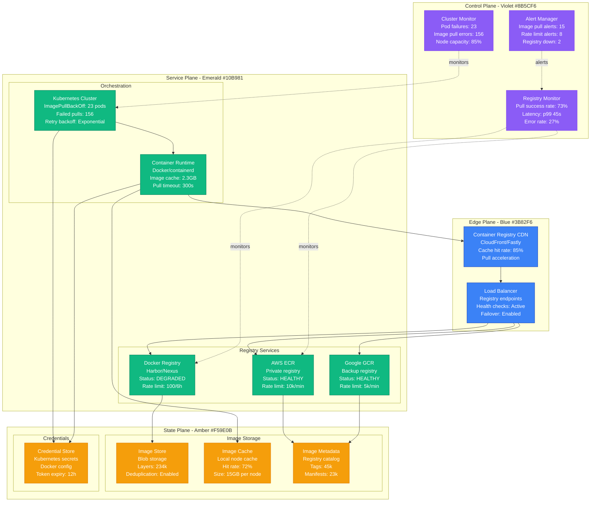
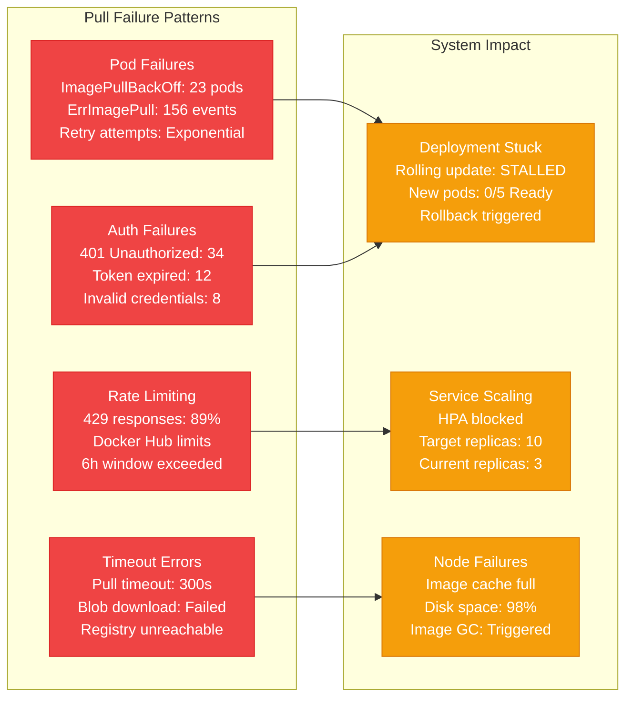
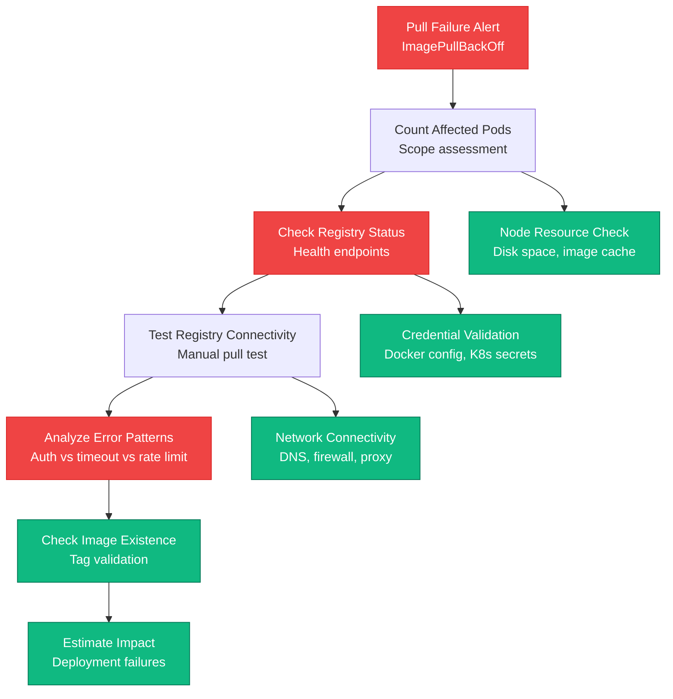
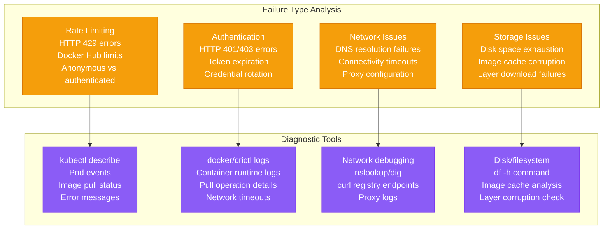
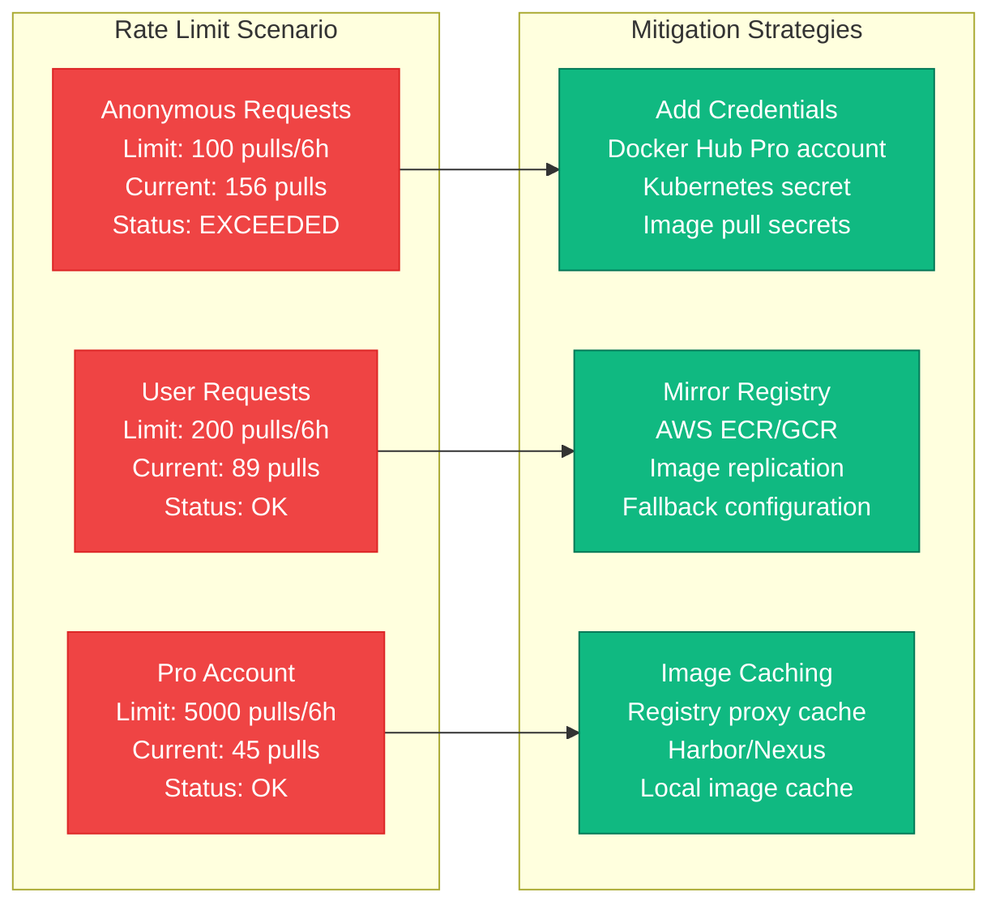
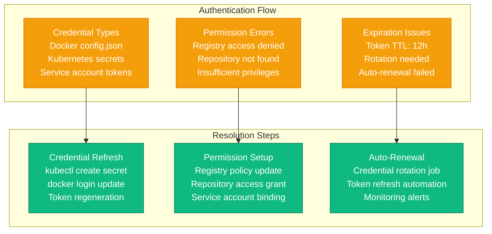
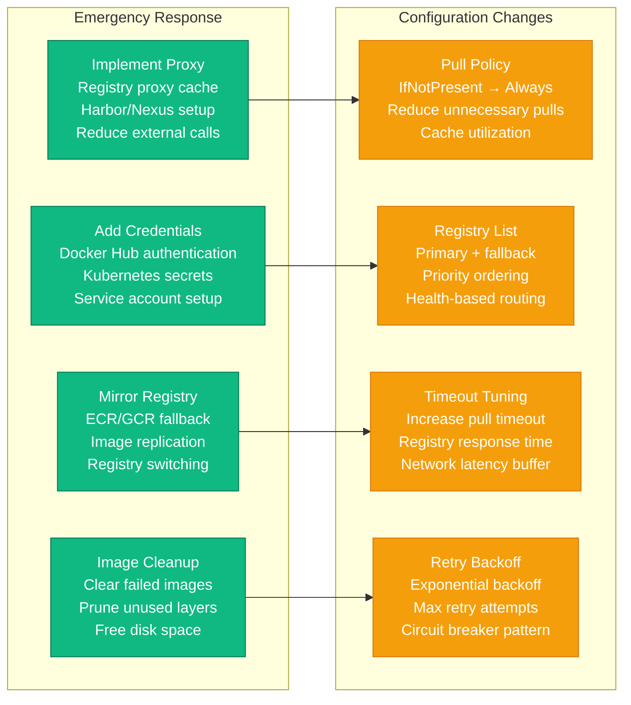
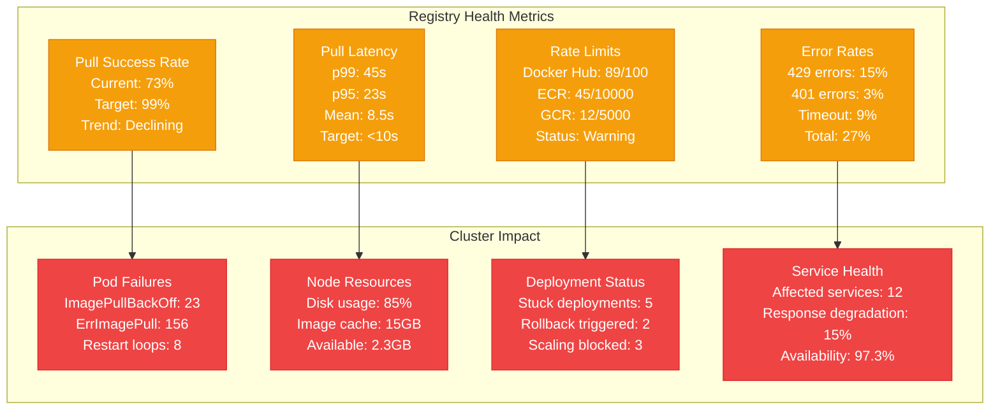

# Container Registry Pull Failures Production Debugging

## Overview

Container registry pull failures can cripple deployment pipelines, prevent application scaling, and cause service outages. These failures manifest as pod startup failures, deployment rollbacks, and cascading service unavailability. This guide provides systematic approaches to debug container registry issues based on real production incidents.

## Real Incident: Docker Hub's 2020 Rate Limiting Crisis

**Impact**: Global deployment failures across thousands of organizations
**Root Cause**: Docker Hub introduced aggressive rate limiting without sufficient warning
**Affected Services**: 2.3M container pulls failed in first hour
**Recovery Time**: 72 hours (rate limit adjustments + registry migrations)
**Cost**: Estimated $50M+ industry-wide impact

## Architecture Overview



## Detection Signals

### Primary Indicators


### Detection Commands
```bash
# 1. Check pod pull failures
kubectl get pods --all-namespaces | grep -E "(ImagePullBackOff|ErrImagePull)"

# 2. Detailed image pull events
kubectl get events --all-namespaces --field-selector reason=Failed,reason=FailedMount | \
grep -i "image\|pull"

# 3. Node image status
kubectl get nodes -o wide
kubectl describe node worker-1 | grep -A 20 "Images:"

# 4. Registry connectivity test
docker pull busybox:latest
crictl pull docker.io/library/nginx:latest
```

## Debugging Workflow

### Phase 1: Pull Failure Assessment (0-5 minutes)



### Phase 2: Root Cause Analysis (5-15 minutes)



## Common Pull Failure Scenarios

### Scenario 1: Docker Hub Rate Limiting



### Scenario 2: Authentication Failures



## Recovery Procedures

### Immediate Mitigation (0-10 minutes)



### Registry Authentication Setup

```bash
#!/bin/bash
# Emergency registry authentication setup

# 1. Create Docker Hub credentials
DOCKER_USERNAME="your-username"
DOCKER_PASSWORD="your-password"
DOCKER_EMAIL="your-email@company.com"

kubectl create secret docker-registry dockerhub-secret \
  --docker-server=https://index.docker.io/v1/ \
  --docker-username="$DOCKER_USERNAME" \
  --docker-password="$DOCKER_PASSWORD" \
  --docker-email="$DOCKER_EMAIL" \
  --namespace=default

# 2. Add image pull secret to service account
kubectl patch serviceaccount default -p \
'{"imagePullSecrets": [{"name": "dockerhub-secret"}]}'

# 3. Create AWS ECR credentials (if using ECR)
AWS_ACCOUNT_ID="123456789012"
AWS_REGION="us-west-2"

# Get ECR login token
ECR_TOKEN=$(aws ecr get-login-password --region $AWS_REGION)

kubectl create secret docker-registry ecr-secret \
  --docker-server="$AWS_ACCOUNT_ID.dkr.ecr.$AWS_REGION.amazonaws.com" \
  --docker-username=AWS \
  --docker-password="$ECR_TOKEN" \
  --namespace=default

# 4. Update deployment to use multiple registries
cat > registry-fallback-patch.yaml << 'EOF'
spec:
  template:
    spec:
      imagePullSecrets:
      - name: dockerhub-secret
      - name: ecr-secret
      containers:
      - name: app
        image: docker.io/library/nginx:latest
        imagePullPolicy: IfNotPresent
EOF

kubectl patch deployment nginx-deployment --patch-file registry-fallback-patch.yaml

# 5. Create registry proxy cache (Harbor)
cat > harbor-proxy-cache.yaml << 'EOF'
apiVersion: v1
kind: ConfigMap
metadata:
  name: harbor-config
data:
  core.conf: |
    registry_proxy_cache:
      enabled: true
      upstream_registries:
        - name: docker-hub
          url: https://registry-1.docker.io
          credential:
            username: ${DOCKER_USERNAME}
            password: ${DOCKER_PASSWORD}
        - name: ecr
          url: https://${AWS_ACCOUNT_ID}.dkr.ecr.${AWS_REGION}.amazonaws.com
          credential:
            access_key: ${AWS_ACCESS_KEY}
            secret_key: ${AWS_SECRET_KEY}
EOF

kubectl apply -f harbor-proxy-cache.yaml
```

### Registry Mirror Configuration

```yaml
# /etc/docker/daemon.json - Docker registry mirrors
{
  "registry-mirrors": [
    "https://harbor.company.com",
    "https://mirror.gcr.io",
    "https://123456789012.dkr.ecr.us-west-2.amazonaws.com"
  ],
  "insecure-registries": [
    "harbor.company.com"
  ],
  "max-concurrent-downloads": 3,
  "max-download-attempts": 5
}

---
# Kubernetes containerd configuration
apiVersion: v1
kind: ConfigMap
metadata:
  name: containerd-config
data:
  config.toml: |
    [plugins."io.containerd.grpc.v1.cri".registry]
      [plugins."io.containerd.grpc.v1.cri".registry.mirrors]
        [plugins."io.containerd.grpc.v1.cri".registry.mirrors."docker.io"]
          endpoint = [
            "https://harbor.company.com/v2",
            "https://registry-1.docker.io"
          ]
        [plugins."io.containerd.grpc.v1.cri".registry.mirrors."k8s.gcr.io"]
          endpoint = [
            "https://k8s.gcr.io",
            "https://mirror.gcr.io"
          ]

      [plugins."io.containerd.grpc.v1.cri".registry.configs]
        [plugins."io.containerd.grpc.v1.cri".registry.configs."harbor.company.com".tls]
          insecure_skip_verify = true
        [plugins."io.containerd.grpc.v1.cri".registry.configs."harbor.company.com".auth]
          username = "admin"
          password = "Harbor12345"

---
# Deployment with fallback registries
apiVersion: apps/v1
kind: Deployment
metadata:
  name: multi-registry-app
spec:
  replicas: 3
  selector:
    matchLabels:
      app: multi-registry-app
  template:
    metadata:
      labels:
        app: multi-registry-app
    spec:
      imagePullSecrets:
      - name: dockerhub-secret
      - name: ecr-secret
      - name: harbor-secret
      containers:
      - name: app
        # Primary registry
        image: harbor.company.com/library/nginx:latest
        # Fallback configuration handled by containerd
        imagePullPolicy: IfNotPresent
        resources:
          requests:
            memory: "64Mi"
            cpu: "250m"
          limits:
            memory: "128Mi"
            cpu: "500m"
      initContainers:
      - name: registry-test
        image: busybox:latest
        command: ['sh', '-c', 'echo "Registry connectivity test passed"']
        imagePullPolicy: IfNotPresent
```

## Monitoring and Prevention

### Registry Health Dashboard



### Proactive Monitoring Alerts

```yaml
# Prometheus alerting rules for container registry issues
groups:
- name: container_registry
  rules:
  - alert: HighImagePullFailureRate
    expr: |
      (
        rate(kubelet_runtime_operations_errors_total{operation_type="image_pull"}[5m]) /
        rate(kubelet_runtime_operations_total{operation_type="image_pull"}[5m])
      ) > 0.1
    for: 2m
    labels:
      severity: warning
      component: registry
    annotations:
      summary: "High image pull failure rate"
      description: "Image pull failure rate is {{ $value | humanizePercentage }} on node {{ $labels.instance }}"

  - alert: RegistryRateLimitApproaching
    expr: |
      docker_hub_rate_limit_remaining / docker_hub_rate_limit_total < 0.2
    for: 1m
    labels:
      severity: warning
      component: registry
    annotations:
      summary: "Docker Hub rate limit approaching"
      description: "Docker Hub rate limit is at {{ $value | humanizePercentage }} capacity"

  - alert: ImagePullBackOffPods
    expr: |
      kube_pod_container_status_waiting_reason{reason="ImagePullBackOff"} > 5
    for: 30s
    labels:
      severity: critical
      component: registry
    annotations:
      summary: "Multiple pods in ImagePullBackOff state"
      description: "{{ $value }} pods are stuck in ImagePullBackOff state"

  - alert: RegistryConnectivityFailure
    expr: |
      up{job="registry-health-check"} == 0
    for: 1m
    labels:
      severity: critical
      component: registry
    annotations:
      summary: "Container registry unreachable"
      description: "Registry {{ $labels.instance }} has been unreachable for > 1 minute"
```

## Real Production Examples

### Docker Hub's 2020 Rate Limiting Crisis
- **Duration**: 72 hours of industry-wide impact
- **Root Cause**: Docker Hub introduced 100 pulls/6h limit for anonymous users
- **Impact**: 2.3M container pulls failed globally in first hour
- **Resolution**: Enterprise accounts + registry mirrors + proxy caches
- **Prevention**: Multi-registry strategy + rate limit monitoring

### Kubernetes.io Registry Outage 2021
- **Duration**: 6 hours
- **Root Cause**: k8s.gcr.io infrastructure failure during GCP maintenance
- **Impact**: Kubernetes cluster deployments failed globally
- **Resolution**: Mirror registry activation + image cache utilization
- **Prevention**: Registry diversity + improved caching strategy

### AWS ECR Cross-Region Incident 2020
- **Duration**: 3 hours 15 minutes
- **Root Cause**: Cross-region replication failure in us-east-1
- **Impact**: Multi-region deployments failed, CI/CD pipelines blocked
- **Resolution**: Regional registry switching + manual image replication
- **Prevention**: Regional redundancy + automated failover

## Prevention Best Practices

### Multi-Registry Strategy
```yaml
# Registry priority configuration
apiVersion: v1
kind: ConfigMap
metadata:
  name: registry-config
data:
  registries.conf: |
    [[registry]]
    prefix = "docker.io"
    location = "harbor.company.com/docker-proxy"

    [[registry]]
    prefix = "docker.io"
    location = "123456789012.dkr.ecr.us-west-2.amazonaws.com/docker-proxy"

    [[registry]]
    prefix = "docker.io"
    location = "registry-1.docker.io"

    # Rate limit configuration
    rate_limit:
      enabled: true
      requests_per_minute: 50
      burst_size: 10
```

### Image Optimization
```dockerfile
# Multi-stage build for smaller images
FROM node:16-alpine AS builder
WORKDIR /app
COPY package*.json ./
RUN npm ci --only=production

FROM node:16-alpine AS runtime
WORKDIR /app
COPY --from=builder /app/node_modules ./node_modules
COPY . .
EXPOSE 3000
CMD ["npm", "start"]

# Layer caching optimization
# Order layers from least to most frequently changing
```

### Automated Registry Health Checks
```python
#!/usr/bin/env python3
"""
Container registry health monitoring script
"""

import requests
import docker
import time
import logging
from typing import Dict, List

# Configure logging
logging.basicConfig(level=logging.INFO)
logger = logging.getLogger(__name__)

class RegistryHealthChecker:
    def __init__(self, registries: List[Dict[str, str]]):
        self.registries = registries
        self.docker_client = docker.from_env()

    def check_registry_connectivity(self, registry: Dict[str, str]) -> bool:
        """Test registry connectivity"""
        try:
            # Test registry v2 API
            response = requests.get(
                f"{registry['url']}/v2/",
                headers=registry.get('headers', {}),
                timeout=10
            )
            return response.status_code in [200, 401]  # 401 is OK for auth required
        except Exception as e:
            logger.error(f"Registry {registry['name']} connectivity failed: {e}")
            return False

    def test_image_pull(self, registry: Dict[str, str]) -> bool:
        """Test actual image pull"""
        try:
            test_image = f"{registry['url']}/library/hello-world:latest"
            self.docker_client.images.pull(test_image)
            logger.info(f"Successfully pulled test image from {registry['name']}")
            return True
        except Exception as e:
            logger.error(f"Image pull from {registry['name']} failed: {e}")
            return False

    def check_rate_limits(self, registry: Dict[str, str]) -> Dict[str, int]:
        """Check rate limit status"""
        try:
            response = requests.head(
                f"{registry['url']}/v2/",
                headers=registry.get('headers', {}),
                timeout=10
            )

            return {
                'limit': int(response.headers.get('RateLimit-Limit', 0)),
                'remaining': int(response.headers.get('RateLimit-Remaining', 0)),
                'reset': int(response.headers.get('RateLimit-Reset', 0))
            }
        except Exception as e:
            logger.error(f"Rate limit check for {registry['name']} failed: {e}")
            return {}

    def run_health_checks(self) -> Dict[str, Dict[str, any]]:
        """Run comprehensive health checks"""
        results = {}

        for registry in self.registries:
            logger.info(f"Checking registry: {registry['name']}")

            results[registry['name']] = {
                'connectivity': self.check_registry_connectivity(registry),
                'pull_test': self.test_image_pull(registry),
                'rate_limits': self.check_rate_limits(registry),
                'timestamp': time.time()
            }

        return results

def main():
    """Main health check execution"""

    registries = [
        {
            'name': 'docker-hub',
            'url': 'https://registry-1.docker.io',
            'headers': {'Authorization': 'Bearer your-token'}
        },
        {
            'name': 'aws-ecr',
            'url': 'https://123456789012.dkr.ecr.us-west-2.amazonaws.com',
            'headers': {'Authorization': 'Basic your-token'}
        },
        {
            'name': 'harbor',
            'url': 'https://harbor.company.com',
            'headers': {'Authorization': 'Basic admin-token'}
        }
    ]

    checker = RegistryHealthChecker(registries)

    while True:
        results = checker.run_health_checks()

        # Log results
        for registry, status in results.items():
            if status['connectivity'] and status['pull_test']:
                logger.info(f"✓ {registry}: Healthy")
            else:
                logger.warning(f"✗ {registry}: Unhealthy")

        # Sleep before next check
        time.sleep(300)  # 5 minutes

if __name__ == "__main__":
    main()
```

## Recovery Checklist

### Immediate Response (0-10 minutes)
- [ ] Identify affected pods and deployments
- [ ] Check registry service status and connectivity
- [ ] Test manual image pull from affected registries
- [ ] Verify authentication credentials and tokens
- [ ] Check node disk space and image cache
- [ ] Enable emergency registry mirrors if available

### Investigation (10-30 minutes)
- [ ] Analyze error patterns (rate limits, auth, network)
- [ ] Check registry rate limit status and quotas
- [ ] Validate DNS resolution and network routing
- [ ] Review recent credential rotations or policy changes
- [ ] Examine container runtime logs and configurations
- [ ] Assess impact on critical services and deployments

### Recovery (30-120 minutes)
- [ ] Implement registry authentication if rate limited
- [ ] Configure and deploy registry proxy/mirror
- [ ] Update image pull policies and retry strategies
- [ ] Clean up failed images and free disk space
- [ ] Switch to alternative registries if needed
- [ ] Validate recovery with test deployments

### Post-Incident (1-7 days)
- [ ] Implement multi-registry redundancy strategy
- [ ] Set up comprehensive registry monitoring
- [ ] Review and optimize image sizes and layers
- [ ] Establish registry health check automation
- [ ] Create runbooks for registry failover procedures
- [ ] Train team on registry troubleshooting techniques

This comprehensive guide provides the systematic approach needed to debug container registry pull failures in production, based on real incidents like Docker Hub's rate limiting crisis and various cloud provider outages.