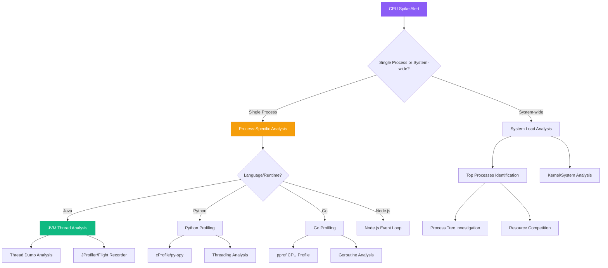

# CPU Spike Diagnosis Guide

## Overview

CPU spikes in distributed systems can cause cascading failures, service timeouts, and degraded user experience. This guide provides systematic approaches to identify, analyze, and resolve CPU performance issues using techniques battle-tested at companies like Google, Netflix, and Amazon.

**Time to Resolution**: 15-60 minutes for common issues, 2-4 hours for complex threading problems

## Decision Tree



## Immediate Triage Commands (First 5 Minutes)

### 1. System CPU Overview
```bash
# Current CPU usage by core
top -n1 | head -20
htop -C  # if available, shows CPU usage by core

# CPU usage over time
iostat -x 1 5

# System load averages
uptime
cat /proc/loadavg

# Quick process identification
ps aux --sort=-%cpu | head -20
```

### 2. Process-Level CPU Analysis
```bash
# CPU usage by process with threads
ps -eLf --sort=-%cpu | head -20

# Process tree with CPU
pstree -p | xargs -I {} sh -c 'echo -n "{} "; ps -p {} -o pcpu= 2>/dev/null || echo "N/A"' | sort -k2 -nr | head -10

# Real-time process monitoring
pidstat 1 5  # requires sysstat package
```

### 3. Container CPU Monitoring
```bash
# Docker container CPU usage
docker stats --no-stream --format "table {{.Container}}\t{{.Name}}\t{{.CPUPerc}}\t{{.MemUsage}}"

# Kubernetes pod CPU usage
kubectl top pods --all-namespaces --sort-by=cpu

# Container resource limits
kubectl describe pod HIGH_CPU_POD | grep -A 10 "Limits"
```

## Language-Specific CPU Profiling

### Java/JVM CPU Analysis

#### 1. Thread Dump Analysis
```bash
# Generate thread dump
jstack $(pgrep java) > threaddump_$(date +%s).txt

# Multiple thread dumps for comparison
for i in {1..3}; do
  echo "=== Thread Dump $i at $(date) ===" >> threaddumps.txt
  jstack $(pgrep java) >> threaddumps.txt
  sleep 10
done

# Analyze thread states
grep -A 2 -B 2 "RUNNABLE\|BLOCKED\|WAITING" threaddump_*.txt | grep -E "(RUNNABLE|BLOCKED|WAITING)" | sort | uniq -c | sort -nr
```

#### 2. Java Flight Recorder (JFR)
```bash
# Start JFR recording (requires JVM 11+)
jcmd $(pgrep java) JFR.start duration=60s filename=cpu_analysis.jfr

# Start with specific settings for CPU analysis
jcmd $(pgrep java) JFR.start settings=profile duration=60s filename=detailed_cpu.jfr

# Analyze JFR file (requires JDK)
jfr print --events CPULoad,ThreadCPULoad cpu_analysis.jfr > cpu_analysis.txt

# Alternative: JFR to flame graph (requires jfr-flame-graph tool)
java -cp jfr-flame-graph.jar app.ConvertToFlameGraph cpu_analysis.jfr > flamegraph.txt
```

#### 3. JProfiler Command Line
```bash
# Attach JProfiler to running process (requires JProfiler license)
java -jar jprofiler_agent.jar --attach=$(pgrep java) --config=/path/to/config.xml

# CPU sampling with async-profiler (open source alternative)
java -jar async-profiler.jar -e cpu -d 30 -f profile.html $(pgrep java)
```

### Python CPU Analysis

#### 1. cProfile Analysis
```python
import cProfile
import pstats
import io

# Profile specific function
def profile_function():
    pr = cProfile.Profile()
    pr.enable()

    # Your function here
    cpu_intensive_function()

    pr.disable()

    # Analyze results
    s = io.StringIO()
    ps = pstats.Stats(pr, stream=s).sort_stats('cumulative')
    ps.print_stats()
    print(s.getvalue())

# Profile entire script
# python -m cProfile -s cumulative your_script.py > profile_output.txt
```

#### 2. py-spy Real-time Profiling
```bash
# Install py-spy
pip install py-spy

# Real-time CPU profiling
py-spy record -o profile.svg --pid 12345 --duration 60

# Top-like interface
py-spy top --pid 12345

# Flame graph generation
py-spy record -o flamegraph.svg --pid 12345 --duration 30 --rate 100 --subprocesses
```

#### 3. Line-by-Line Profiling
```python
# Install line_profiler
# pip install line_profiler

# Add @profile decorator to functions
@profile
def cpu_intensive_function():
    total = 0
    for i in range(1000000):
        total += i * i
    return total

# Run with kernprof
# kernprof -l -v your_script.py
```

### Go CPU Analysis

#### 1. Built-in CPU Profiling
```go
package main

import (
    "log"
    "net/http"
    _ "net/http/pprof"
    "runtime"
    "time"
)

func main() {
    // Enable pprof endpoint
    go func() {
        log.Println(http.ListenAndServe("localhost:6060", nil))
    }()

    // Your application code here
    for {
        cpuIntensiveWork()
        time.Sleep(time.Second)
    }
}

func cpuIntensiveWork() {
    // Simulate CPU-intensive work
    for i := 0; i < 100000; i++ {
        _ = i * i
    }
}
```

#### 2. Command Line Profiling
```bash
# CPU profile collection
go tool pprof -http=:8080 http://localhost:6060/debug/pprof/profile?seconds=30

# Sample for 30 seconds and generate flame graph
go tool pprof -http=:8081 http://localhost:6060/debug/pprof/profile

# Text-based analysis
go tool pprof -text http://localhost:6060/debug/pprof/profile
go tool pprof -top http://localhost:6060/debug/pprof/profile
```

#### 3. Goroutine Analysis
```bash
# Check goroutine count
curl http://localhost:6060/debug/pprof/goroutine?debug=1 | grep "^goroutine" | wc -l

# Analyze goroutine stacks
go tool pprof http://localhost:6060/debug/pprof/goroutine

# Block profiling for contention
go tool pprof http://localhost:6060/debug/pprof/block
```

### Node.js CPU Analysis

#### 1. V8 CPU Profiling
```javascript
// Built-in profiler (Node.js 12+)
const { Session } = require('inspector');
const fs = require('fs');

function startCPUProfiling() {
    const session = new Session();
    session.connect();

    session.post('Profiler.enable', () => {
        session.post('Profiler.start', () => {
            // Your CPU-intensive code here
            setTimeout(() => {
                session.post('Profiler.stop', (err, { profile }) => {
                    fs.writeFileSync('profile.cpuprofile', JSON.stringify(profile));
                    console.log('CPU profile saved');
                    session.disconnect();
                });
            }, 30000); // Profile for 30 seconds
        });
    });
}
```

#### 2. Event Loop Monitoring
```javascript
// Event loop lag monitoring
function measureEventLoopLag() {
    const start = process.hrtime.bigint();

    setImmediate(() => {
        const lag = Number(process.hrtime.bigint() - start) / 1e6; // Convert to ms
        console.log(`Event loop lag: ${lag.toFixed(2)}ms`);

        // Continue monitoring
        setTimeout(measureEventLoopLag, 1000);
    });
}

measureEventLoopLag();
```

#### 3. Clinic.js Profiling
```bash
# Install clinic.js
npm install -g clinic

# CPU profiling
clinic doctor -- node your-app.js

# Flame graph generation
clinic flame -- node your-app.js

# Bubble profiling for async operations
clinic bubbleprof -- node your-app.js
```

## System-Level CPU Analysis

### 1. CPU Utilization Breakdown
```bash
# Detailed CPU statistics
sar -u 1 10  # CPU utilization every second for 10 seconds

# CPU usage by mode (user, system, iowait, etc.)
vmstat 1 5

# Per-core CPU usage
mpstat -P ALL 1 5

# Interrupts per CPU
cat /proc/interrupts | head -20
```

### 2. Context Switching Analysis
```bash
# Context switches per second
sar -w 1 10

# Process context switching
pidstat -w 1 5

# System-wide context switching
vmstat 1 5 | awk 'NR>2 {print $12, $13}'  # cs (context switches) and in (interrupts)
```

### 3. CPU Cache and Performance Counters
```bash
# Install perf tools (Linux)
# apt-get install linux-tools-$(uname -r)

# CPU cache misses
perf stat -e cache-misses,cache-references -p PID sleep 10

# Performance counter analysis
perf top -p PID

# CPU cycles and instructions
perf stat -e cycles,instructions,cache-references,cache-misses -p PID sleep 30
```

## Platform-Specific CPU Monitoring

### AWS

#### CloudWatch CPU Metrics
```bash
# EC2 instance CPU utilization
aws cloudwatch get-metric-statistics \
  --namespace AWS/EC2 \
  --metric-name CPUUtilization \
  --dimensions Name=InstanceId,Value=i-1234567890abcdef0 \
  --start-time $(date -u -d '1 hour ago' +%Y-%m-%dT%H:%M:%S) \
  --end-time $(date -u +%Y-%m-%dT%H:%M:%S) \
  --period 300 \
  --statistics Average,Maximum

# ECS task CPU utilization
aws cloudwatch get-metric-statistics \
  --namespace AWS/ECS \
  --metric-name CPUUtilization \
  --dimensions Name=ServiceName,Value=my-service Name=ClusterName,Value=my-cluster \
  --start-time $(date -u -d '1 hour ago' +%Y-%m-%dT%H:%M:%S) \
  --end-time $(date -u +%Y-%m-%dT%H:%M:%S) \
  --period 300 \
  --statistics Average,Maximum
```

#### X-Ray CPU Analysis
```bash
# Find traces with high CPU usage
aws xray get-trace-summaries \
  --time-range-type TimeRangeByStartTime \
  --start-time $(date -u -d '1 hour ago' +%Y-%m-%dT%H:%M:%S) \
  --end-time $(date -u +%Y-%m-%dT%H:%M:%S) \
  --filter-expression "annotation.cpu_usage > 80"
```

### GCP

#### Google Cloud Monitoring
```bash
# Compute Engine CPU metrics
gcloud monitoring metrics list --filter="resource.type=gce_instance AND metric.type:cpu"

# GKE pod CPU usage
kubectl top pods --sort-by=cpu --all-namespaces
kubectl describe node | grep -A 5 "Allocated resources"

# Cloud Functions CPU usage
gcloud functions logs read FUNCTION_NAME --limit=50 | grep "CPU"
```

### Azure

#### Azure Monitor
```bash
# Virtual Machine CPU metrics
az monitor metrics list \
  --resource "/subscriptions/SUB_ID/resourceGroups/RG_NAME/providers/Microsoft.Compute/virtualMachines/VM_NAME" \
  --metric "Percentage CPU" \
  --start-time $(date -u -d '1 hour ago' +%Y-%m-%dT%H:%M:%S.%3NZ)

# Container CPU usage
az monitor metrics list \
  --resource "/subscriptions/SUB_ID/resourceGroups/RG_NAME/providers/Microsoft.ContainerInstance/containerGroups/CONTAINER_GROUP" \
  --metric "CpuUsage"
```

## Production Case Studies

### Case Study 1: Netflix - Java Microservice CPU Spike

**Problem**: Recommendation service CPU usage spiked to 95% during prime time, causing 2-second response delays

**Investigation Process**:
1. **Thread dump analysis** revealed 50+ threads blocked on JSON serialization
2. **JFR profiling** showed 60% CPU time spent in Jackson ObjectMapper
3. **Code analysis** found inefficient repeated serialization of large objects

**Commands Used**:
```bash
# Generated thread dumps
for i in {1..5}; do
  jstack 12345 > threaddump_$i.txt
  sleep 30
done

# JFR CPU analysis
jcmd 12345 JFR.start duration=60s filename=cpu_spike.jfr settings=profile
jfr print --events CPULoad,MethodProfiling cpu_spike.jfr | grep -E "(ObjectMapper|serialize)"

# Found hot methods
async-profiler.jar -e cpu -d 30 -f flamegraph.html 12345
```

**Resolution**: Implemented object caching and lazy serialization
**Time to Resolution**: 2.5 hours

### Case Study 2: Uber - Go Service CPU Exhaustion

**Problem**: Ride matching service consuming 8 CPU cores during peak hours, causing request timeouts

**Root Cause**: Inefficient map iteration in hot path, processing 10M+ entries per request

**Investigation Commands**:
```bash
# CPU profiling
go tool pprof -http=:8080 http://ride-matcher:6060/debug/pprof/profile

# Found hot function
go tool pprof -top http://ride-matcher:6060/debug/pprof/profile | head -10

# Identified expensive operations
go tool pprof -list=matchRiders http://ride-matcher:6060/debug/pprof/profile
```

**Key Finding**: Single function consuming 78% of CPU time

**Resolution**: Replaced linear map iteration with spatial indexing (R-tree)
**Time to Resolution**: 4 hours

### Case Study 3: Shopify - Ruby CPU Saturation

**Problem**: Order processing API CPU usage at 100% during Black Friday, orders timing out

**Root Cause**: N+1 database queries in order validation logic

**Investigation Process**:
```bash
# Ruby profiling with ruby-prof
gem install ruby-prof
ruby-prof --mode=cpu_time --file=profile_output.html your_app.rb

# Stackprof for production profiling
gem install stackprof
StackProf.run(mode: :cpu, out: 'cpu_profile.dump') do
  # Critical section of code
  process_orders
end

# Analysis
stackprof cpu_profile.dump --text --limit=20
```

**Resolution**: Added eager loading and database query optimization
**Time to Resolution**: 3 hours

## Flame Graph Generation and Analysis

### 1. Creating Flame Graphs
```bash
# For Java applications with async-profiler
java -jar async-profiler.jar -e cpu -d 30 -f flamegraph.html PID

# For Linux perf
perf record -F 997 -p PID -g -- sleep 30
perf script | stackcollapse-perf.pl | flamegraph.pl > flamegraph.svg

# For Python with py-spy
py-spy record -o flamegraph.svg --pid PID --duration 60

# For Go applications
go tool pprof -http=:8080 http://localhost:6060/debug/pprof/profile
```

### 2. Flame Graph Interpretation
```bash
# Key patterns to look for in flame graphs:
# 1. Wide plateaus = CPU-intensive functions
# 2. Tall stacks = deep call chains
# 3. Multiple thin towers = scattered CPU usage
# 4. Missing samples = I/O wait or blocking

# Analysis script for flame graph data
cat flamegraph_data.txt | awk '
{
    split($1, stack, ";")
    samples = $2

    # Count samples by function
    for (i = 1; i <= length(stack); i++) {
        func_samples[stack[i]] += samples
        total_samples += samples
    }
}
END {
    for (func in func_samples) {
        percentage = (func_samples[func] / total_samples) * 100
        if (percentage > 5) {  # Show functions using >5% CPU
            printf "%s: %.2f%%\n", func, percentage
        }
    }
}' | sort -k2 -nr | head -10
```

## Prevention Strategies

### 1. CPU Resource Limiting
```yaml
# Kubernetes CPU limits and requests
apiVersion: v1
kind: Pod
metadata:
  name: cpu-managed-app
spec:
  containers:
  - name: app
    image: my-app:latest
    resources:
      requests:
        cpu: "200m"      # 0.2 CPU cores
        memory: "256Mi"
      limits:
        cpu: "500m"      # 0.5 CPU cores maximum
        memory: "512Mi"
    # CPU throttling notifications
    env:
    - name: CPU_LIMIT_NOTIFICATION
      value: "true"
```

### 2. Automated CPU Monitoring
```python
# CPU monitoring with alerting
import psutil
import time
import logging
from collections import deque

class CPUMonitor:
    def __init__(self, pid, warning_threshold=80, critical_threshold=95):
        self.process = psutil.Process(pid)
        self.warning_threshold = warning_threshold
        self.critical_threshold = critical_threshold
        self.cpu_history = deque(maxlen=60)  # Keep 60 seconds of history

    def monitor(self):
        while True:
            try:
                cpu_percent = self.process.cpu_percent(interval=1)
                self.cpu_history.append(cpu_percent)

                # Average CPU over last 60 seconds
                avg_cpu = sum(self.cpu_history) / len(self.cpu_history)

                if cpu_percent > self.critical_threshold:
                    self.send_alert(f"CRITICAL: CPU usage {cpu_percent:.1f}%")
                    self.collect_debug_info()
                elif avg_cpu > self.warning_threshold:
                    self.send_alert(f"WARNING: Average CPU usage {avg_cpu:.1f}%")

                self.log_metrics(cpu_percent, avg_cpu)

            except psutil.NoSuchProcess:
                logging.error("Process no longer exists")
                break
            except Exception as e:
                logging.error(f"Monitoring error: {e}")

            time.sleep(1)

    def collect_debug_info(self):
        try:
            # Collect thread information
            threads = self.process.threads()
            logging.info(f"Thread count: {len(threads)}")

            # Memory usage
            memory_info = self.process.memory_info()
            logging.info(f"Memory usage: {memory_info.rss / 1024 / 1024:.2f} MB")

            # Open files
            open_files = len(self.process.open_files())
            logging.info(f"Open files: {open_files}")

        except Exception as e:
            logging.error(f"Debug info collection failed: {e}")

    def send_alert(self, message):
        logging.error(f"CPU ALERT: {message}")
        # Integration with alerting system (Slack, PagerDuty, etc.)

# Usage
monitor = CPUMonitor(12345)  # Replace with actual PID
monitor.monitor()
```

### 3. Circuit Breakers for CPU Protection
```java
// Java circuit breaker implementation for CPU protection
public class CPUCircuitBreaker {
    private static final double CPU_THRESHOLD = 0.8; // 80%
    private static final int FAILURE_COUNT_THRESHOLD = 3;
    private static final long RECOVERY_TIMEOUT = 30000; // 30 seconds

    private int failureCount = 0;
    private long lastFailureTime = 0;
    private CircuitState state = CircuitState.CLOSED;

    public enum CircuitState {
        CLOSED, OPEN, HALF_OPEN
    }

    public <T> T execute(Supplier<T> operation) throws Exception {
        if (state == CircuitState.OPEN) {
            if (System.currentTimeMillis() - lastFailureTime > RECOVERY_TIMEOUT) {
                state = CircuitState.HALF_OPEN;
            } else {
                throw new RuntimeException("Circuit breaker is OPEN due to high CPU usage");
            }
        }

        double cpuUsage = getCurrentCPUUsage();
        if (cpuUsage > CPU_THRESHOLD) {
            recordFailure();
            throw new RuntimeException("CPU usage too high: " + cpuUsage);
        }

        try {
            T result = operation.get();
            recordSuccess();
            return result;
        } catch (Exception e) {
            recordFailure();
            throw e;
        }
    }

    private void recordFailure() {
        failureCount++;
        lastFailureTime = System.currentTimeMillis();
        if (failureCount >= FAILURE_COUNT_THRESHOLD) {
            state = CircuitState.OPEN;
        }
    }

    private void recordSuccess() {
        failureCount = 0;
        state = CircuitState.CLOSED;
    }

    private double getCurrentCPUUsage() {
        return ManagementFactory.getOperatingSystemMXBean().getProcessCpuLoad();
    }
}
```

## 3 AM Debugging Checklist

When you're called at 3 AM for CPU spikes:

### First 2 Minutes
- [ ] Check current CPU usage: `top -n1` or `htop`
- [ ] Identify top CPU-consuming processes: `ps aux --sort=-%cpu | head -10`
- [ ] Check system load: `uptime` and `cat /proc/loadavg`
- [ ] Verify if issue is ongoing or resolved

### Minutes 2-5
- [ ] Check recent deployments or changes
- [ ] Look for patterns: specific times, traffic spikes, cron jobs
- [ ] Check container/pod CPU limits and usage
- [ ] Review monitoring dashboards for trends

### Minutes 5-15
- [ ] Generate thread dumps for Java applications
- [ ] Start CPU profiling for the problematic service
- [ ] Check for runaway processes or infinite loops
- [ ] Analyze context switching and I/O wait

### If Still Debugging After 15 Minutes
- [ ] Escalate to senior engineer or team lead
- [ ] Consider restarting affected services
- [ ] Implement temporary CPU throttling
- [ ] Collect detailed profiling data for analysis

## CPU Metrics and SLOs

### Key CPU Metrics to Track
- **CPU utilization percentage** (target: <70% average, <90% peak)
- **Load average** (target: <number of CPU cores)
- **Context switches per second** (baseline dependent)
- **CPU wait time** (iowait, steal time)
- **Process CPU time distribution**

### Example SLO Configuration
```yaml
cpu_slos:
  - name: "Service CPU Usage"
    description: "Service CPU usage stays below 80%"
    metric: "rate(process_cpu_seconds_total[5m]) * 100"
    target: 80
    window: "5m"

  - name: "System Load Average"
    description: "1-minute load average stays below CPU count"
    metric: "system_load1"
    target: 4  # for 4-core system
    window: "5m"
```

**Remember**: CPU spikes can indicate deeper architectural issues. While quick fixes like restarting services may resolve immediate problems, understanding the root cause prevents future incidents and ensures system scalability.

This guide represents battle-tested approaches from teams managing hundreds of thousands of CPU cores across global distributed systems.