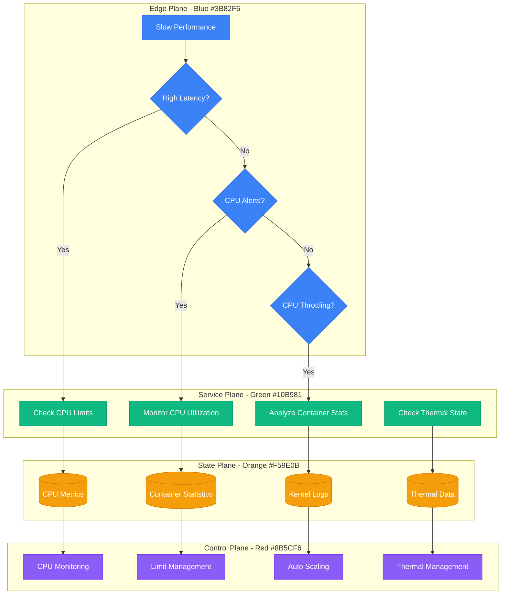
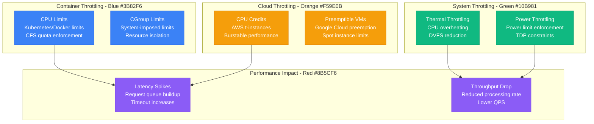

# CPU Throttling - Production Debugging Guide

## Overview

CPU throttling can cause performance degradation, increased latency, and service instability in containerized and cloud environments. This guide covers systematic debugging for container CPU limits, thermal throttling, and resource contention in production systems.

## Debugging Flowchart



## CPU Throttling Investigation

### 1. Container CPU Throttling
```bash
# Check container CPU limits
docker stats --no-stream
docker inspect container_name | jq '.[0].HostConfig.CpuQuota'
docker inspect container_name | jq '.[0].HostConfig.CpuPeriod'

# Kubernetes CPU limits
kubectl describe pod pod-name | grep -A 5 "Limits\|Requests"
kubectl top pods --containers

# Check CPU throttling in cgroups
cat /sys/fs/cgroup/cpu/docker/*/cpu.stat | grep throttled
cat /sys/fs/cgroup/cpu,cpuacct/kubepods/*/cpu.stat

# Monitor throttling events
watch -n 1 'cat /sys/fs/cgroup/cpu/docker/*/cpu.stat | grep throttled'

# Check CPU usage vs limits
kubectl get pods -o custom-columns=NAME:.metadata.name,CPU_REQ:.spec.containers[*].resources.requests.cpu,CPU_LIM:.spec.containers[*].resources.limits.cpu
```

### 2. System-Level CPU Analysis
```bash
# Check overall CPU utilization
top -p 1 -n 1 | head -5
htop -C

# CPU frequency scaling
cat /proc/cpuinfo | grep MHz
cpupower frequency-info

# Thermal throttling detection
dmesg | grep -i "thermal\|throttl"
cat /proc/cpuinfo | grep "cpu MHz"

# Check CPU governor
cat /sys/devices/system/cpu/cpu*/cpufreq/scaling_governor

# Monitor CPU frequency changes
watch -n 1 'grep "cpu MHz" /proc/cpuinfo'

# Check for context switches
vmstat 1 5 | grep -v procs
sar -w 1 5
```

### 3. Process-Level CPU Debugging
```bash
# Identify CPU-intensive processes
ps aux --sort=-%cpu | head -10
pidstat -u 1 5

# Check process CPU affinity
taskset -p PID

# Monitor CPU usage per core
mpstat -P ALL 1 5

# Check for CPU steal time (virtualized environments)
sar -u 1 5 | grep -v Average

# Process scheduler information
cat /proc/PID/sched
cat /proc/PID/stat | awk '{print "CPU time:", $14+$15}'
```

## CPU Throttling Patterns

### Throttling Sources Matrix


## Real Production Examples

### AWS EC2 CPU Credits Monitoring
```python
#!/usr/bin/env python3
# AWS CPU credit monitoring for t-instance families

import boto3
import time
from datetime import datetime, timedelta
import json

class AWSCPUCreditMonitor:
    def __init__(self, region='us-east-1'):
        self.ec2 = boto3.client('ec2', region_name=region)
        self.cloudwatch = boto3.client('cloudwatch', region_name=region)

    def get_t_instances(self):
        """Get all t-family instances"""
        response = self.ec2.describe_instances(
            Filters=[
                {'Name': 'instance-state-name', 'Values': ['running']},
                {'Name': 'instance-type', 'Values': ['t2.*', 't3.*', 't3a.*', 't4g.*']}
            ]
        )

        instances = []
        for reservation in response['Reservations']:
            for instance in reservation['Instances']:
                instances.append({
                    'InstanceId': instance['InstanceId'],
                    'InstanceType': instance['InstanceType'],
                    'LaunchTime': instance['LaunchTime']
                })

        return instances

    def get_cpu_credit_metrics(self, instance_id, hours=24):
        """Get CPU credit metrics for an instance"""
        end_time = datetime.utcnow()
        start_time = end_time - timedelta(hours=hours)

        metrics = {}

        # CPU Credit Balance
        response = self.cloudwatch.get_metric_statistics(
            Namespace='AWS/EC2',
            MetricName='CPUCreditBalance',
            Dimensions=[{'Name': 'InstanceId', 'Value': instance_id}],
            StartTime=start_time,
            EndTime=end_time,
            Period=300,  # 5 minutes
            Statistics=['Average', 'Minimum']
        )
        metrics['CPUCreditBalance'] = response['Datapoints']

        # CPU Credit Usage
        response = self.cloudwatch.get_metric_statistics(
            Namespace='AWS/EC2',
            MetricName='CPUCreditUsage',
            Dimensions=[{'Name': 'InstanceId', 'Value': instance_id}],
            StartTime=start_time,
            EndTime=end_time,
            Period=300,
            Statistics=['Average', 'Maximum']
        )
        metrics['CPUCreditUsage'] = response['Datapoints']

        # CPU Utilization
        response = self.cloudwatch.get_metric_statistics(
            Namespace='AWS/EC2',
            MetricName='CPUUtilization',
            Dimensions=[{'Name': 'InstanceId', 'Value': instance_id}],
            StartTime=start_time,
            EndTime=end_time,
            Period=300,
            Statistics=['Average', 'Maximum']
        )
        metrics['CPUUtilization'] = response['Datapoints']

        return metrics

    def analyze_cpu_throttling(self, instance_id):
        """Analyze CPU throttling patterns"""
        metrics = self.get_cpu_credit_metrics(instance_id)

        analysis = {
            'instance_id': instance_id,
            'timestamp': datetime.utcnow().isoformat(),
            'throttling_detected': False,
            'credit_exhaustion_events': 0,
            'recommendations': []
        }

        # Check CPU credit balance
        if metrics['CPUCreditBalance']:
            min_balance = min(point['Minimum'] for point in metrics['CPUCreditBalance'])
            avg_balance = sum(point['Average'] for point in metrics['CPUCreditBalance']) / len(metrics['CPUCreditBalance'])

            if min_balance < 1:
                analysis['throttling_detected'] = True
                analysis['credit_exhaustion_events'] += 1
                analysis['recommendations'].append("CPU credit balance dropped to zero - instance was throttled")

            if avg_balance < 10:
                analysis['recommendations'].append("Low CPU credit balance - consider upgrading instance type")

        # Check CPU utilization patterns
        if metrics['CPUUtilization']:
            max_cpu = max(point['Maximum'] for point in metrics['CPUUtilization'])
            avg_cpu = sum(point['Average'] for point in metrics['CPUUtilization']) / len(metrics['CPUUtilization'])

            if max_cpu > 80 and avg_cpu > 40:
                analysis['recommendations'].append("High sustained CPU usage - consider non-burstable instance type")

        # Check credit usage vs balance correlation
        if metrics['CPUCreditUsage'] and metrics['CPUCreditBalance']:
            credit_usage_points = sorted(metrics['CPUCreditUsage'], key=lambda x: x['Timestamp'])
            credit_balance_points = sorted(metrics['CPUCreditBalance'], key=lambda x: x['Timestamp'])

            for i, usage_point in enumerate(credit_usage_points):
                if i < len(credit_balance_points):
                    balance_point = credit_balance_points[i]
                    if usage_point['Average'] > 0.1 and balance_point['Average'] < 5:
                        analysis['credit_exhaustion_events'] += 1

        return analysis

    def monitor_all_instances(self):
        """Monitor all t-instances for CPU throttling"""
        instances = self.get_t_instances()
        results = []

        for instance in instances:
            print(f"Analyzing instance {instance['InstanceId']} ({instance['InstanceType']})...")
            analysis = self.analyze_cpu_throttling(instance['InstanceId'])
            analysis.update(instance)
            results.append(analysis)

        return results

    def generate_report(self):
        """Generate comprehensive CPU throttling report"""
        results = self.monitor_all_instances()

        report = {
            'timestamp': datetime.utcnow().isoformat(),
            'total_instances': len(results),
            'throttled_instances': len([r for r in results if r['throttling_detected']]),
            'instances': results,
            'summary': {
                'critical_instances': [],
                'warning_instances': [],
                'healthy_instances': []
            }
        }

        for result in results:
            if result['throttling_detected']:
                report['summary']['critical_instances'].append(result['InstanceId'])
            elif result['recommendations']:
                report['summary']['warning_instances'].append(result['InstanceId'])
            else:
                report['summary']['healthy_instances'].append(result['InstanceId'])

        return report

# Usage
monitor = AWSCPUCreditMonitor()
report = monitor.generate_report()
print(json.dumps(report, indent=2, default=str))
```

### Kubernetes CPU Throttling Detection
```python
#!/usr/bin/env python3
# Kubernetes CPU throttling detection

import subprocess
import json
import time
from typing import Dict, List
from kubernetes import client, config

class K8sCPUThrottlingDetector:
    def __init__(self):
        try:
            config.load_incluster_config()
        except:
            config.load_kube_config()

        self.v1 = client.CoreV1Api()
        self.metrics_v1beta1 = client.CustomObjectsApi()

    def get_pod_cpu_throttling(self, namespace: str = None) -> List[Dict]:
        """Get CPU throttling information for pods"""
        results = []

        # Get all pods
        if namespace:
            pods = self.v1.list_namespaced_pod(namespace)
        else:
            pods = self.v1.list_pod_for_all_namespaces()

        for pod in pods.items:
            pod_info = {
                'name': pod.metadata.name,
                'namespace': pod.metadata.namespace,
                'node': pod.spec.node_name,
                'containers': []
            }

            # Check each container
            for container in pod.spec.containers:
                container_info = {
                    'name': container.name,
                    'cpu_request': self._get_cpu_value(container.resources.requests, 'cpu') if container.resources and container.resources.requests else None,
                    'cpu_limit': self._get_cpu_value(container.resources.limits, 'cpu') if container.resources and container.resources.limits else None,
                    'throttling_detected': False,
                    'throttling_metrics': {}
                }

                # Get throttling metrics from cgroups
                throttling_stats = self._get_container_throttling_stats(
                    pod.metadata.namespace,
                    pod.metadata.name,
                    container.name
                )

                if throttling_stats:
                    container_info['throttling_metrics'] = throttling_stats
                    container_info['throttling_detected'] = throttling_stats.get('throttled_periods', 0) > 0

                pod_info['containers'].append(container_info)

            results.append(pod_info)

        return results

    def _get_cpu_value(self, resources, key):
        """Extract CPU value from resource specification"""
        if not resources or key not in resources:
            return None

        value = resources[key]
        if isinstance(value, str):
            if value.endswith('m'):
                return int(value[:-1]) / 1000.0
            else:
                return float(value)
        return value

    def _get_container_throttling_stats(self, namespace: str, pod_name: str, container_name: str) -> Dict:
        """Get container throttling statistics from cgroups"""
        try:
            # This would require running on the node or having access to node metrics
            # In practice, you'd use metrics-server or Prometheus

            # Example using kubectl exec to read cgroup stats
            command = [
                'kubectl', 'exec', '-n', namespace, pod_name, '-c', container_name,
                '--', 'cat', '/sys/fs/cgroup/cpu/cpu.stat'
            ]

            result = subprocess.run(command, capture_output=True, text=True, timeout=10)

            if result.returncode == 0:
                stats = {}
                for line in result.stdout.strip().split('\n'):
                    if line:
                        key, value = line.split(' ', 1)
                        if key in ['nr_periods', 'nr_throttled', 'throttled_time']:
                            stats[key] = int(value)

                # Calculate throttling percentage
                if stats.get('nr_periods', 0) > 0:
                    stats['throttling_percentage'] = (stats.get('nr_throttled', 0) / stats['nr_periods']) * 100

                return stats

        except Exception as e:
            print(f"Error getting throttling stats for {namespace}/{pod_name}/{container_name}: {e}")

        return {}

    def get_node_cpu_pressure(self) -> List[Dict]:
        """Get CPU pressure information from nodes"""
        nodes = self.v1.list_node()
        node_info = []

        for node in nodes.items:
            # Get node conditions
            conditions = {}
            if node.status.conditions:
                for condition in node.status.conditions:
                    conditions[condition.type] = condition.status == 'True'

            # Get allocatable vs capacity
            capacity = node.status.capacity or {}
            allocatable = node.status.allocatable or {}

            cpu_capacity = self._parse_cpu_quantity(capacity.get('cpu', '0'))
            cpu_allocatable = self._parse_cpu_quantity(allocatable.get('cpu', '0'))

            node_info.append({
                'name': node.metadata.name,
                'cpu_capacity': cpu_capacity,
                'cpu_allocatable': cpu_allocatable,
                'cpu_pressure': conditions.get('PIDPressure', False),
                'memory_pressure': conditions.get('MemoryPressure', False),
                'disk_pressure': conditions.get('DiskPressure', False),
                'ready': conditions.get('Ready', False)
            })

        return node_info

    def _parse_cpu_quantity(self, cpu_str: str) -> float:
        """Parse Kubernetes CPU quantity string"""
        if cpu_str.endswith('m'):
            return int(cpu_str[:-1]) / 1000.0
        else:
            return float(cpu_str)

    def detect_throttling_patterns(self) -> Dict:
        """Detect CPU throttling patterns across the cluster"""
        pod_data = self.get_pod_cpu_throttling()
        node_data = self.get_node_cpu_pressure()

        analysis = {
            'timestamp': time.time(),
            'total_pods': len(pod_data),
            'throttled_pods': 0,
            'throttled_containers': 0,
            'high_risk_pods': [],
            'recommendations': [],
            'node_pressure': {}
        }

        # Analyze pod throttling
        for pod in pod_data:
            pod_throttled = False
            for container in pod['containers']:
                if container['throttling_detected']:
                    analysis['throttled_containers'] += 1
                    pod_throttled = True

                    # Check for high throttling
                    throttling_pct = container['throttling_metrics'].get('throttling_percentage', 0)
                    if throttling_pct > 10:  # More than 10% of periods throttled
                        analysis['high_risk_pods'].append({
                            'pod': f"{pod['namespace']}/{pod['name']}",
                            'container': container['name'],
                            'throttling_percentage': throttling_pct,
                            'cpu_limit': container['cpu_limit']
                        })

            if pod_throttled:
                analysis['throttled_pods'] += 1

        # Analyze node pressure
        for node in node_data:
            analysis['node_pressure'][node['name']] = {
                'cpu_utilization': (node['cpu_capacity'] - node['cpu_allocatable']) / node['cpu_capacity'] * 100,
                'under_pressure': node['cpu_pressure'] or node['memory_pressure'] or node['disk_pressure']
            }

        # Generate recommendations
        if analysis['throttled_containers'] > 0:
            analysis['recommendations'].append(
                f"Found {analysis['throttled_containers']} throttled containers - review CPU limits"
            )

        if len(analysis['high_risk_pods']) > 0:
            analysis['recommendations'].append(
                f"Found {len(analysis['high_risk_pods'])} high-risk pods with significant throttling"
            )

        pressure_nodes = [name for name, info in analysis['node_pressure'].items() if info['under_pressure']]
        if pressure_nodes:
            analysis['recommendations'].append(
                f"Nodes under pressure: {', '.join(pressure_nodes)} - consider scaling"
            )

        return analysis

    def generate_throttling_report(self) -> str:
        """Generate human-readable throttling report"""
        analysis = self.detect_throttling_patterns()

        report_lines = [
            "Kubernetes CPU Throttling Report",
            "=" * 40,
            f"Timestamp: {time.strftime('%Y-%m-%d %H:%M:%S', time.localtime(analysis['timestamp']))}",
            "",
            f"Total Pods Analyzed: {analysis['total_pods']}",
            f"Throttled Pods: {analysis['throttled_pods']}",
            f"Throttled Containers: {analysis['throttled_containers']}",
            ""
        ]

        if analysis['high_risk_pods']:
            report_lines.extend([
                "High-Risk Pods (>10% throttling):",
                "-" * 35
            ])

            for pod_info in analysis['high_risk_pods']:
                report_lines.append(
                    f"  {pod_info['pod']}/{pod_info['container']}: "
                    f"{pod_info['throttling_percentage']:.1f}% throttled "
                    f"(limit: {pod_info['cpu_limit']})"
                )

            report_lines.append("")

        if analysis['recommendations']:
            report_lines.extend([
                "Recommendations:",
                "-" * 15
            ])

            for i, rec in enumerate(analysis['recommendations'], 1):
                report_lines.append(f"  {i}. {rec}")

        return "\n".join(report_lines)

# Usage
detector = K8sCPUThrottlingDetector()
report = detector.generate_throttling_report()
print(report)
```

This CPU throttling debugging guide provides comprehensive tools and techniques for identifying, analyzing, and resolving CPU performance bottlenecks in containerized and cloud environments, with specific focus on production debugging scenarios.