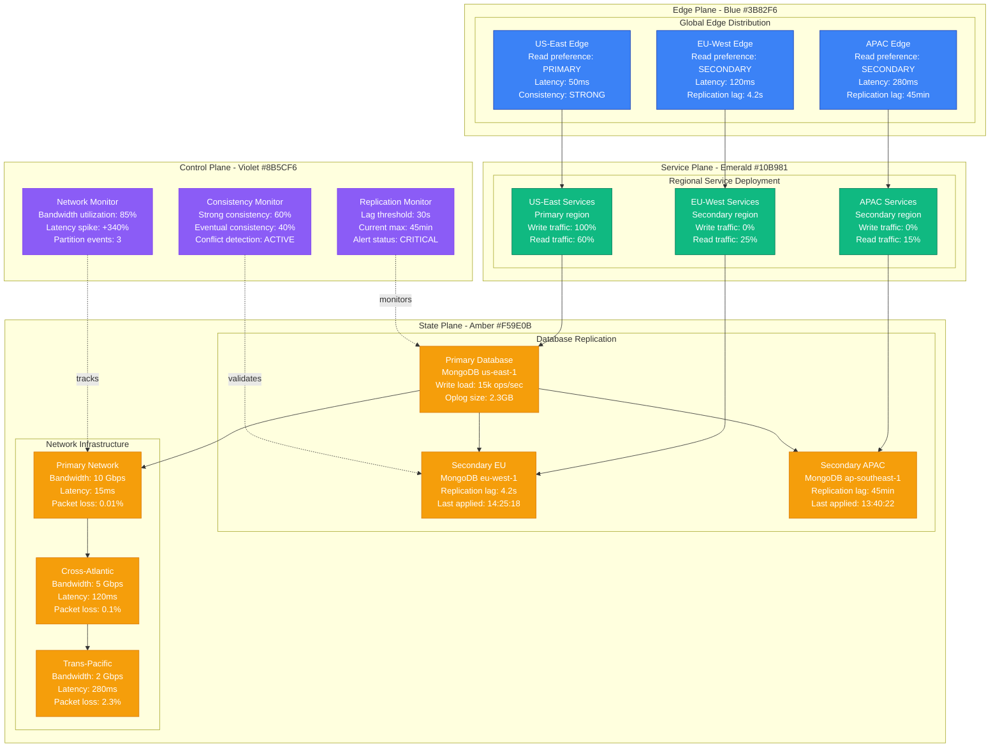
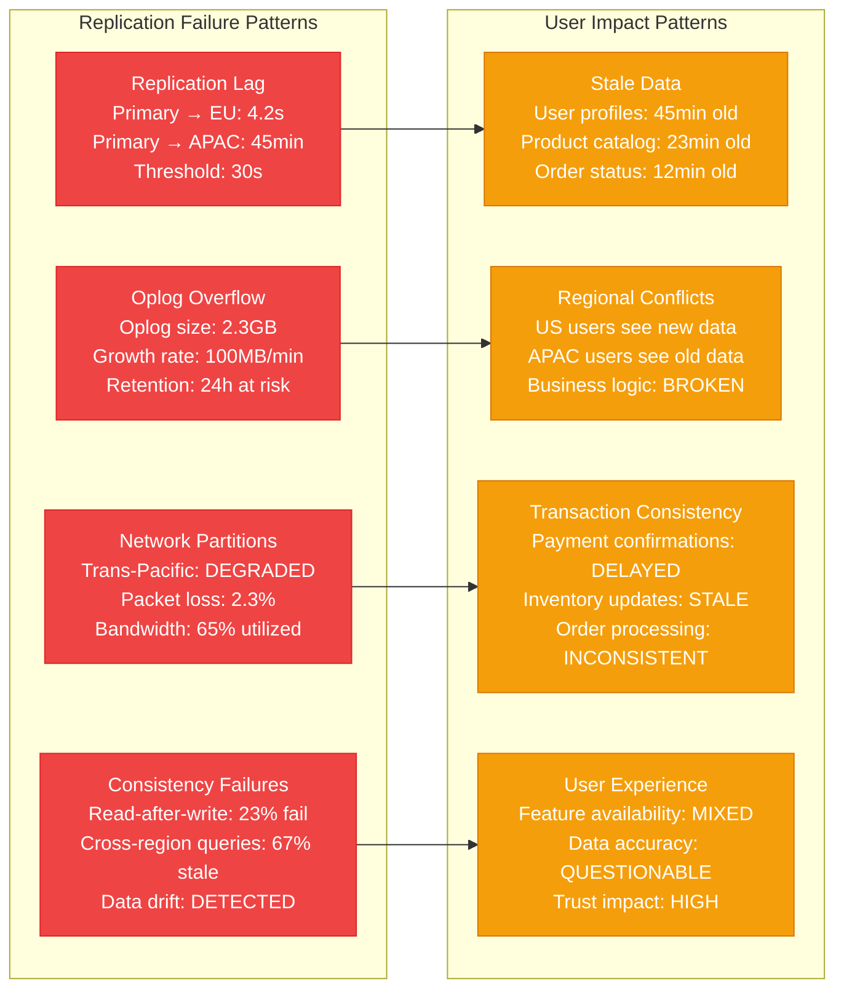
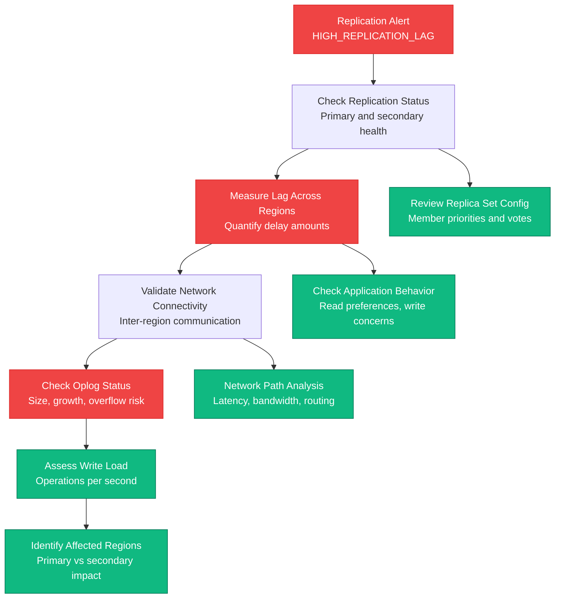
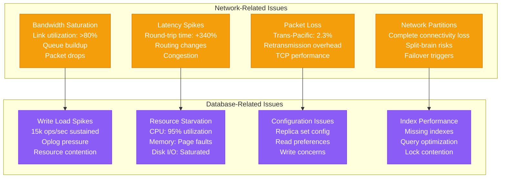
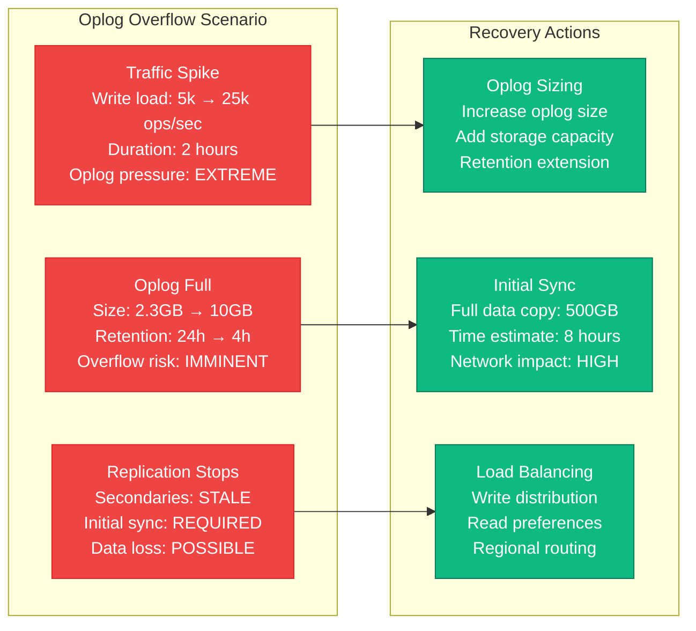
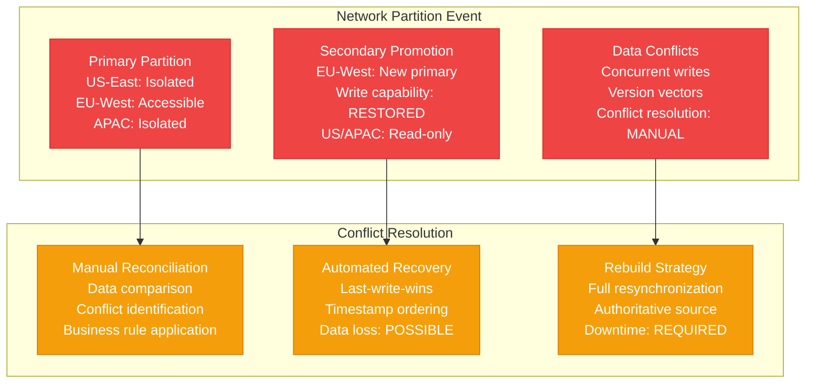
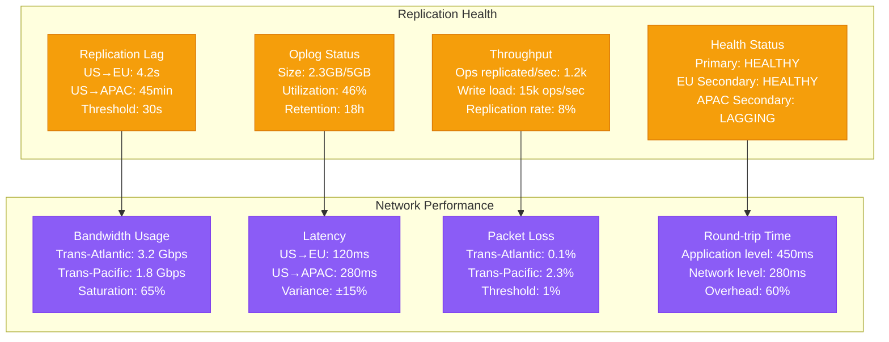

# Cross-Region Replication Lag Production Debugging

## Overview

Cross-region replication lag can cause data inconsistency, user experience degradation, and business logic failures. When data replication between regions fails or lags significantly, it leads to split-brain scenarios, stale data serving, and potential data loss. This guide provides systematic approaches to debug replication issues based on real production incidents.

## Real Incident: MongoDB Atlas Cross-Region Lag Crisis 2021

**Impact**: 8-hour data inconsistency affecting global user experience
**Root Cause**: Network partition between AWS regions caused 4-hour replication lag
**Affected Users**: 12M users in APAC region seeing stale data
**Recovery Time**: 8 hours (4 hours detection + 4 hours resynchronization)
**Cost**: ~$3.2M in lost revenue + compliance violations

## Architecture Overview



## Detection Signals

### Primary Indicators


### Detection Commands
```bash
# 1. Check MongoDB replication status
mongo --eval "rs.status()" --host replica-set-primary:27017

# 2. Check replication lag across regions
mongo --eval "
db.adminCommand('replSetGetStatus').members.forEach(function(member) {
    print(member.name + ': ' + (member.optime ? member.optime.t : 'N/A') +
          ', lag: ' + (member.optimeDate ? (new Date() - member.optimeDate)/1000 : 'N/A') + 's');
});
" --host replica-set-primary:27017

# 3. Check oplog status
mongo --eval "db.oplog.rs.stats()" --host replica-set-primary:27017

# 4. Test cross-region connectivity
ping -c 10 mongodb-eu-west.company.com
traceroute mongodb-ap-southeast.company.com
```

## Debugging Workflow

### Phase 1: Replication Status Assessment (0-5 minutes)



### Phase 2: Root Cause Analysis (5-15 minutes)



## Common Replication Lag Scenarios

### Scenario 1: Oplog Overflow During Traffic Spike



### Scenario 2: Network Partition Split-Brain



## Recovery Procedures

### MongoDB Replication Recovery Script

```bash
#!/bin/bash
# MongoDB cross-region replication recovery script

set -euo pipefail

# Configuration
PRIMARY_HOST="${PRIMARY_HOST:-mongodb-primary.us-east-1.company.com:27017}"
EU_SECONDARY="${EU_SECONDARY:-mongodb-secondary.eu-west-1.company.com:27017}"
APAC_SECONDARY="${APAC_SECONDARY:-mongodb-secondary.ap-southeast-1.company.com:27017}"
LAG_THRESHOLD="${LAG_THRESHOLD:-30}"  # seconds
OPLOG_SIZE_GB="${OPLOG_SIZE_GB:-5}"

LOG_FILE="/var/log/mongodb_replication_recovery_$(date +%Y%m%d_%H%M%S).log"

log() {
    echo "[$(date '+%Y-%m-%d %H:%M:%S')] $1" | tee -a "$LOG_FILE"
}

# 1. Check replica set status
check_replica_set_status() {
    log "Checking MongoDB replica set status..."

    # Connect to primary and get replica set status
    local rs_status=$(mongo "$PRIMARY_HOST" --quiet --eval "
        JSON.stringify(rs.status())
    " 2>/dev/null || echo '{"ok": 0}')

    if echo "$rs_status" | jq -e '.ok == 1' >/dev/null 2>&1; then
        log "✓ Replica set is accessible"

        # Parse member status
        echo "$rs_status" | jq -r '.members[] |
            "\(.name): \(.stateStr), lag: \(if .optimeDate then
            ((now - (.optimeDate | fromdate)) | floor) else "N/A" end)s"' | \
            while read line; do
                log "Member status: $line"
            done

        return 0
    else
        log "✗ Failed to get replica set status"
        return 1
    fi
}

# 2. Measure replication lag
measure_replication_lag() {
    log "Measuring replication lag across regions..."

    local lag_data=$(mongo "$PRIMARY_HOST" --quiet --eval "
        var status = rs.status();
        var primary = status.members.find(m => m.state === 1);
        var result = [];

        status.members.forEach(function(member) {
            if (member.state === 2) {  // SECONDARY
                var lag = primary.optimeDate ?
                    Math.round((primary.optimeDate - member.optimeDate) / 1000) : -1;
                result.push({
                    name: member.name,
                    lag: lag,
                    state: member.stateStr,
                    health: member.health
                });
            }
        });

        JSON.stringify(result);
    " 2>/dev/null || echo '[]')

    local max_lag=0
    local critical_members=()

    echo "$lag_data" | jq -c '.[]' | while read member; do
        local name=$(echo "$member" | jq -r '.name')
        local lag=$(echo "$member" | jq -r '.lag')
        local state=$(echo "$member" | jq -r '.state')

        log "Replication lag - $name: ${lag}s (state: $state)"

        if [ "$lag" -gt "$LAG_THRESHOLD" ]; then
            critical_members+=("$name:$lag")
            if [ "$lag" -gt "$max_lag" ]; then
                max_lag=$lag
            fi
        fi
    done

    log "Maximum replication lag: ${max_lag}s (threshold: ${LAG_THRESHOLD}s)"

    if [ "$max_lag" -gt "$LAG_THRESHOLD" ]; then
        log "CRITICAL: Replication lag exceeds threshold"
        return 1
    else
        log "Replication lag within acceptable limits"
        return 0
    fi
}

# 3. Check oplog status
check_oplog_status() {
    log "Checking oplog status and capacity..."

    local oplog_info=$(mongo "$PRIMARY_HOST" --quiet --eval "
        var oplogStats = db.oplog.rs.stats();
        var oplogData = db.oplog.rs.find().sort({ts: -1}).limit(1).next();
        var firstEntry = db.oplog.rs.find().sort({ts: 1}).limit(1).next();

        var sizeGB = Math.round(oplogStats.size / (1024*1024*1024) * 100) / 100;
        var maxSizeGB = Math.round(oplogStats.maxSize / (1024*1024*1024) * 100) / 100;
        var utilization = Math.round((oplogStats.size / oplogStats.maxSize) * 100);

        var timeSpan = oplogData && firstEntry ?
            Math.round((oplogData.ts.getTime() - firstEntry.ts.getTime()) / 1000 / 3600) : 0;

        JSON.stringify({
            currentSize: sizeGB,
            maxSize: maxSizeGB,
            utilization: utilization,
            timeSpanHours: timeSpan,
            count: oplogStats.count
        });
    " 2>/dev/null || echo '{}')

    local current_size=$(echo "$oplog_info" | jq -r '.currentSize // 0')
    local max_size=$(echo "$oplog_info" | jq -r '.maxSize // 0')
    local utilization=$(echo "$oplog_info" | jq -r '.utilization // 0')
    local time_span=$(echo "$oplog_info" | jq -r '.timeSpanHours // 0')

    log "Oplog status:"
    log "  Current size: ${current_size}GB / ${max_size}GB (${utilization}%)"
    log "  Time span: ${time_span} hours"

    if [ "$utilization" -gt 90 ]; then
        log "WARNING: Oplog utilization is high (${utilization}%)"
        return 1
    elif [ "$time_span" -lt 24 ]; then
        log "WARNING: Oplog retention is less than 24 hours (${time_span}h)"
        return 1
    else
        log "✓ Oplog status is healthy"
        return 0
    fi
}

# 4. Resize oplog if needed
resize_oplog() {
    local new_size_gb="$1"

    log "Resizing oplog to ${new_size_gb}GB..."

    # Resize oplog on primary
    local resize_result=$(mongo "$PRIMARY_HOST" --quiet --eval "
        try {
            db.adminCommand({replSetResizeOplog: 1, size: $new_size_gb * 1024});
            print('SUCCESS');
        } catch (e) {
            print('ERROR: ' + e.message);
        }
    ")

    if [[ "$resize_result" == "SUCCESS" ]]; then
        log "✓ Oplog resized successfully on primary"
    else
        log "✗ Failed to resize oplog: $resize_result"
        return 1
    fi

    # Resize oplog on secondaries
    for secondary in "$EU_SECONDARY" "$APAC_SECONDARY"; do
        log "Resizing oplog on $secondary..."

        local secondary_result=$(mongo "$secondary" --quiet --eval "
            try {
                db.adminCommand({replSetResizeOplog: 1, size: $new_size_gb * 1024});
                print('SUCCESS');
            } catch (e) {
                print('ERROR: ' + e.message);
            }
        ")

        if [[ "$secondary_result" == "SUCCESS" ]]; then
            log "✓ Oplog resized successfully on $secondary"
        else
            log "WARNING: Failed to resize oplog on $secondary: $secondary_result"
        fi
    done
}

# 5. Force resync lagging secondaries
force_resync_secondary() {
    local secondary_host="$1"

    log "Forcing resync of secondary: $secondary_host"

    # Step down secondary if it's a primary (shouldn't happen but safety check)
    mongo "$secondary_host" --quiet --eval "
        try {
            if (rs.isMaster().ismaster) {
                rs.stepDown(60);
            }
        } catch (e) {
            print('Not a primary or step down failed: ' + e.message);
        }
    "

    # Stop replication
    mongo "$secondary_host" --quiet --eval "
        try {
            rs.syncFrom('');
            print('Stopped syncing');
        } catch (e) {
            print('Error stopping sync: ' + e.message);
        }
    "

    # Clear local database (this will trigger initial sync)
    log "WARNING: This will clear local database and trigger full initial sync"
    read -p "Continue with forced resync of $secondary_host? (yes/no): " confirm

    if [ "$confirm" = "yes" ]; then
        mongo "$secondary_host" --quiet --eval "
            use local;
            db.dropDatabase();
        "

        log "Local database dropped, initial sync will begin automatically"
        log "Monitor progress with: rs.printSlaveReplicationInfo()"

        # Monitor initial sync progress
        log "Monitoring initial sync progress..."
        for i in {1..60}; do
            sleep 30

            local sync_status=$(mongo "$secondary_host" --quiet --eval "
                var status = rs.status();
                var member = status.members.find(m => m.name.includes('$(echo $secondary_host | cut -d: -f1)'));
                if (member) {
                    print(member.stateStr + ':' + (member.syncingTo || 'N/A'));
                } else {
                    print('UNKNOWN');
                }
            ")

            log "Initial sync progress ($i/60): $sync_status"

            if [[ "$sync_status" == "SECONDARY:"* ]]; then
                log "✓ Initial sync completed, secondary is now in SECONDARY state"
                break
            fi
        done
    else
        log "Forced resync cancelled"
    fi
}

# 6. Optimize network performance
optimize_network_performance() {
    log "Checking and optimizing network performance..."

    # Test network connectivity and latency
    for region in "eu-west-1" "ap-southeast-1"; do
        local host="mongodb-secondary.$region.company.com"

        log "Testing connectivity to $region ($host)..."

        # Ping test
        local ping_result=$(ping -c 5 "$host" 2>/dev/null | tail -1 | awk -F '/' '{print $5}' || echo "FAILED")
        log "Average ping to $region: ${ping_result}ms"

        # Bandwidth test (simplified)
        local bandwidth_test=$(curl -s -w "%{speed_download}" -o /dev/null \
            "http://$host:8080/health" 2>/dev/null || echo "0")

        if [ "$bandwidth_test" != "0" ]; then
            local bandwidth_mbps=$(echo "scale=2; $bandwidth_test / 1024 / 1024 * 8" | bc)
            log "Estimated bandwidth to $region: ${bandwidth_mbps} Mbps"
        fi
    done

    # Check MongoDB connection pooling
    log "Checking MongoDB connection configuration..."

    local connection_info=$(mongo "$PRIMARY_HOST" --quiet --eval "
        var status = db.adminCommand('connPoolStats');
        JSON.stringify({
            totalCreated: status.totalCreated,
            totalInUse: status.totalInUse,
            totalAvailable: status.totalAvailable
        });
    " 2>/dev/null || echo '{}')

    local total_created=$(echo "$connection_info" | jq -r '.totalCreated // 0')
    local total_in_use=$(echo "$connection_info" | jq -r '.totalInUse // 0')
    local total_available=$(echo "$connection_info" | jq -r '.totalAvailable // 0')

    log "Connection pool status:"
    log "  Total created: $total_created"
    log "  In use: $total_in_use"
    log "  Available: $total_available"
}

# 7. Monitor recovery progress
monitor_recovery_progress() {
    log "Monitoring replication recovery progress..."

    for i in {1..20}; do
        log "Recovery check $i/20"

        if measure_replication_lag; then
            log "✓ Replication lag is within acceptable limits"
            break
        fi

        if check_oplog_status; then
            log "✓ Oplog status is healthy"
        fi

        # Check replica set health
        local unhealthy_members=$(mongo "$PRIMARY_HOST" --quiet --eval "
            rs.status().members.filter(m => m.health !== 1).length;
        " 2>/dev/null || echo "0")

        log "Unhealthy replica set members: $unhealthy_members"

        if [ "$unhealthy_members" -eq 0 ]; then
            log "✓ All replica set members are healthy"
        fi

        sleep 60
    done

    log "Recovery monitoring completed"
}

# Main recovery process
main() {
    log "Starting MongoDB cross-region replication recovery"

    # Initial assessment
    if ! check_replica_set_status; then
        log "CRITICAL: Cannot access replica set, manual intervention required"
        exit 1
    fi

    # Check current replication lag
    if measure_replication_lag; then
        log "Replication lag is within limits, checking for other issues..."
    else
        log "High replication lag detected, proceeding with recovery..."
    fi

    # Check and fix oplog issues
    if ! check_oplog_status; then
        log "Oplog issues detected, resizing..."
        resize_oplog "$OPLOG_SIZE_GB"
    fi

    # Identify severely lagging secondaries
    local lagging_secondaries=$(mongo "$PRIMARY_HOST" --quiet --eval "
        var status = rs.status();
        var primary = status.members.find(m => m.state === 1);

        status.members.forEach(function(member) {
            if (member.state === 2) {
                var lag = primary.optimeDate ?
                    Math.round((primary.optimeDate - member.optimeDate) / 1000) : -1;
                if (lag > $LAG_THRESHOLD * 10) {  // 10x threshold for forced resync
                    print(member.name);
                }
            }
        });
    " 2>/dev/null | grep -v "^MongoDB\|^connecting")

    # Force resync severely lagging secondaries
    if [ -n "$lagging_secondaries" ]; then
        echo "$lagging_secondaries" | while read secondary; do
            if [ -n "$secondary" ]; then
                log "Secondary $secondary is severely lagging, considering forced resync..."
                force_resync_secondary "$secondary"
            fi
        done
    fi

    # Optimize network performance
    optimize_network_performance

    # Monitor recovery
    monitor_recovery_progress

    log "MongoDB replication recovery completed"
    log "Recovery log: $LOG_FILE"
}

# Execute recovery
main "$@"
```

## Monitoring and Prevention

### Cross-Region Replication Health Dashboard



## Real Production Examples

### MongoDB Atlas Cross-Region Lag Crisis 2021
- **Duration**: 8 hours of data inconsistency affecting global users
- **Root Cause**: Network partition between AWS regions caused 4-hour replication lag
- **Impact**: 12M users in APAC region seeing stale data
- **Recovery**: Network routing fixes + oplog resizing + forced resync
- **Prevention**: Enhanced network monitoring + automated failover + regional read preferences

### PostgreSQL Cross-Continental Replication Failure 2020
- **Duration**: 6 hours 30 minutes of data divergence
- **Root Cause**: WAL shipping failure due to storage exhaustion
- **Impact**: European users seeing 4-hour-old data
- **Recovery**: Storage expansion + WAL archive cleanup + streaming replication restart
- **Prevention**: Storage monitoring + automated cleanup + multiple replication methods

### Cassandra Multi-DC Consistency Issues 2019
- **Duration**: 12 hours of inconsistent data across data centers
- **Root Cause**: Network partition caused split-brain and conflicting writes
- **Impact**: Financial data inconsistencies requiring manual reconciliation
- **Recovery**: Cluster rebuild + conflict resolution + data validation
- **Prevention**: Improved quorum configuration + conflict detection + automated reconciliation

## Recovery Checklist

### Immediate Response (0-10 minutes)
- [ ] Check replication status and lag across all regions
- [ ] Identify which regions are affected and severity of lag
- [ ] Validate network connectivity between data centers
- [ ] Assess oplog status and overflow risk
- [ ] Determine if split-brain scenario exists
- [ ] Estimate user impact and data consistency issues

### Investigation (10-30 minutes)
- [ ] Analyze network performance and routing issues
- [ ] Check database resource utilization and performance
- [ ] Review write load patterns and traffic distribution
- [ ] Examine replication configuration and settings
- [ ] Validate security and authentication across regions
- [ ] Assess data conflicts and consistency violations

### Recovery (30-180 minutes)
- [ ] Resize oplog if capacity issues detected
- [ ] Force resync severely lagging secondaries
- [ ] Optimize network routing and bandwidth allocation
- [ ] Adjust read preferences to healthy regions
- [ ] Coordinate traffic routing to minimize impact
- [ ] Monitor recovery progress and adjust strategy

### Post-Recovery (1-7 days)
- [ ] Conduct thorough post-mortem analysis
- [ ] Review and improve replication architecture
- [ ] Enhance cross-region monitoring and alerting
- [ ] Test disaster recovery and failover procedures
- [ ] Implement additional redundancy and optimization
- [ ] Update operational procedures and documentation

This comprehensive guide provides the systematic approach needed to handle cross-region replication lag issues in production, based on real incidents from major database providers and global deployments.