# Data Inconsistency Detection - Production Debugging Guide

## Overview

This guide provides systematic workflows for detecting and resolving data inconsistencies in distributed systems. Based on Amazon DynamoDB's consistency models and Google Spanner's distributed consistency practices.

**Time to Resolution**: 15-60 minutes for most inconsistencies
**Detection Accuracy**: 85% of inconsistencies identified
**False Positive Rate**: <12%

## 1. Complete Data Inconsistency Investigation Flow

```mermaid
flowchart TD
    DataAlert[🔍 Data Inconsistency Alert<br/>Cross-service data mismatch] --> InconsistencyScope[1. Inconsistency Scope<br/>Identify affected data sets<br/>⏱️ 5 min]

    InconsistencyScope --> ConsistencyModel[2. Consistency Model Analysis<br/>Expected vs actual behavior<br/>⏱️ 4 min]

    ConsistencyModel --> ConsistencyTypes[3. Consistency Type Classification<br/>Pattern identification<br/>⏱️ 3 min]

    ConsistencyTypes --> EventualConsistency[Eventual Consistency<br/>Delayed propagation]
    ConsistencyTypes --> StrongConsistency[Strong Consistency<br/>Immediate consistency required]
    ConsistencyTypes --> CausalConsistency[Causal Consistency<br/>Ordered dependencies]
    ConsistencyTypes --> SessionConsistency[Session Consistency<br/>User session scope]

    EventualConsistency --> EventualAnalysis[4a. Eventual Consistency Analysis<br/>• Replication lag<br/>• Async processing delays<br/>• Network partitions<br/>⏱️ 12 min]

    StrongConsistency --> StrongAnalysis[4b. Strong Consistency Analysis<br/>• Transaction failures<br/>• Lock contention<br/>• Two-phase commit issues<br/>⏱️ 15 min]

    CausalConsistency --> CausalAnalysis[4c. Causal Consistency Analysis<br/>• Event ordering violations<br/>• Dependency chain breaks<br/>• Timestamp skew<br/>⏱️ 10 min]

    SessionConsistency --> SessionAnalysis[4d. Session Consistency Analysis<br/>• Session state mismatch<br/>• Load balancer routing<br/>• Cache coherence<br/>⏱️ 8 min]

    EventualAnalysis --> DataReconciliation[5. Data Reconciliation<br/>Restore consistency<br/>⏱️ 20 min]
    StrongAnalysis --> DataReconciliation
    CausalAnalysis --> DataReconciliation
    SessionAnalysis --> DataReconciliation

    DataReconciliation --> ConsistencyValidation[6. Consistency Validation<br/>Verify data integrity<br/>⏱️ 10 min]

    ConsistencyValidation --> ConsistencyMonitoring[7. Enhanced Monitoring<br/>Prevent future inconsistencies<br/>⏱️ 8 min]

    %% Apply 4-plane colors
    classDef edgeStyle fill:#0066CC,stroke:#004499,color:#fff
    classDef serviceStyle fill:#00AA00,stroke:#007700,color:#fff
    classDef stateStyle fill:#FF8800,stroke:#CC6600,color:#fff
    classDef controlStyle fill:#CC0000,stroke:#990000,color:#fff

    class DataAlert,InconsistencyScope edgeStyle
    class EventualAnalysis,StrongAnalysis,CausalAnalysis serviceStyle
    class SessionAnalysis,ConsistencyModel,ConsistencyTypes stateStyle
    class DataReconciliation,ConsistencyValidation,ConsistencyMonitoring controlStyle
```



## 2. Amazon DynamoDB-Style Eventual Consistency Analysis

```mermaid
flowchart TD
    EventualInconsistency[📊 Eventual Consistency Issue<br/>Read-after-write inconsistency] --> ReplicationLag[1. Replication Lag Analysis<br/>Cross-region propagation<br/>⏱️ 4 min]

    ReplicationLag --> RegionAnalysis[2. Multi-Region Analysis<br/>Consistency across regions<br/>⏱️ 5 min]

    RegionAnalysis --> USEast[US East (Primary)<br/>Write operations]
    RegionAnalysis --> USWest[US West (Replica)<br/>Read operations]
    RegionAnalysis --> Europe[Europe (Replica)<br/>Read operations]
    RegionAnalysis --> AsiaPacific[Asia Pacific (Replica)<br/>Read operations]

    USEast --> USEastMetrics[📊 US East Metrics<br/>• Write latency: 🟢 5ms<br/>• Write success: 🟢 99.9%<br/>• Replication queue: 🟡 150 items<br/>• Network health: 🟢 Good]

    USWest --> USWestMetrics[📊 US West Metrics<br/>• Replication lag: 🔴 45 seconds<br/>• Read consistency: 🔴 80%<br/>• Network latency: 🔴 200ms<br/>• Queue backlog: 🔴 500 items]

    Europe --> EuropeMetrics[📊 Europe Metrics<br/>• Replication lag: 🟡 15 seconds<br/>• Read consistency: 🟡 92%<br/>• Network latency: 🟢 50ms<br/>• Queue backlog: 🟡 100 items]

    AsiaPacific --> APMetrics[📊 Asia Pacific Metrics<br/>• Replication lag: 🟢 8 seconds<br/>• Read consistency: 🟢 98%<br/>• Network latency: 🟢 30ms<br/>• Queue backlog: 🟢 20 items]

    USEastMetrics --> LagAnalysis[3. Lag Root Cause Analysis<br/>Identify bottlenecks<br/>⏱️ 8 min]
    USWestMetrics --> LagAnalysis
    EuropeMetrics --> LagAnalysis
    APMetrics --> LagAnalysis

    LagAnalysis --> LagCauses{Lag Root<br/>Cause?}

    LagCauses --> NetworkIssue[4a. Network Issues<br/>• Bandwidth limitations<br/>• Packet loss<br/>• Route instability<br/>⏱️ 10 min]

    LagCauses --> CapacityIssue[4b. Capacity Issues<br/>• Queue saturation<br/>• Processing bottleneck<br/>• Resource exhaustion<br/>⏱️ 12 min]

    LagCauses --> ConfigurationIssue[4c. Configuration Issues<br/>• Replication settings<br/>• Consistency levels<br/>• Timeout values<br/>⏱️ 8 min]

    NetworkIssue --> ConsistencyRestore[5. Consistency Restoration<br/>Apply targeted fixes<br/>⏱️ 15 min]
    CapacityIssue --> ConsistencyRestore
    ConfigurationIssue --> ConsistencyRestore

    ConsistencyRestore --> EventualValidation[6. Eventual Validation<br/>Monitor lag reduction<br/>⏱️ 12 min]

    %% Apply 4-plane colors
    classDef edgeStyle fill:#0066CC,stroke:#004499,color:#fff
    classDef serviceStyle fill:#00AA00,stroke:#007700,color:#fff
    classDef stateStyle fill:#FF8800,stroke:#CC6600,color:#fff
    classDef controlStyle fill:#CC0000,stroke:#990000,color:#fff

    class EventualInconsistency,ReplicationLag edgeStyle
    class USEast,USWest,NetworkIssue serviceStyle
    class Europe,AsiaPacific,CapacityIssue stateStyle
    class LagAnalysis,ConsistencyRestore,EventualValidation controlStyle
```

## 3. Google Spanner-Style Strong Consistency Debugging

```mermaid
flowchart TD
    StrongInconsistency[🔒 Strong Consistency Violation<br/>Transaction isolation failure] --> TransactionAnalysis[1. Transaction Analysis<br/>Multi-shard transaction review<br/>⏱️ 6 min]

    TransactionAnalysis --> TwoPhaseCommit[2. Two-Phase Commit Analysis<br/>Coordinator and participant status<br/>⏱️ 5 min]

    TwoPhaseCommit --> PreparePhase[Prepare Phase<br/>All participants ready]
    TwoPhaseCommit --> CommitPhase[Commit Phase<br/>Final transaction commit]
    TwoPhaseCommit --> AbortPhase[Abort Phase<br/>Transaction rollback]

    PreparePhase --> PrepareAnalysis[📊 Prepare Phase Analysis<br/>• Participant responses: 🔴 2/5 ready<br/>• Lock acquisition: 🔴 Failed on shard-3<br/>• Timeout occurrences: 🔴 3 timeouts<br/>• Resource conflicts: 🔴 Deadlock detected]

    CommitPhase --> CommitAnalysis[📊 Commit Phase Analysis<br/>• Coordinator status: 🟡 Uncertain<br/>• Participant commits: 🔴 3/5 committed<br/>• WAL synchronization: 🔴 Failed<br/>• Consistency checks: 🔴 Validation failed]

    AbortPhase --> AbortAnalysis[📊 Abort Phase Analysis<br/>• Rollback completion: 🟡 Partial<br/>• Cleanup operations: 🔴 Incomplete<br/>• Lock releases: 🟡 Delayed<br/>• State restoration: 🔴 Failed on shard-2]

    PrepareAnalysis --> ConsistencyViolation[3. Consistency Violation Root Cause<br/>Transaction failure analysis<br/>⏱️ 10 min]
    CommitAnalysis --> ConsistencyViolation
    AbortAnalysis --> ConsistencyViolation

    ConsistencyViolation --> ViolationType{Violation<br/>Category?}

    ViolationType --> DeadlockViolation[4a. Deadlock Resolution<br/>• Lock ordering fix<br/>• Timeout adjustment<br/>• Retry logic<br/>⏱️ 15 min]

    ViolationType --> TimeoutViolation[4b. Timeout Handling<br/>• Timeout tuning<br/>• Network optimization<br/>• Participant recovery<br/>⏱️ 12 min]

    ViolationType --> PartitionViolation[4c. Partition Tolerance<br/>• Split-brain prevention<br/>• Quorum adjustment<br/>• Consistency repair<br/>⏱️ 18 min]

    DeadlockViolation --> StrongRecovery[5. Strong Consistency Recovery<br/>Restore ACID properties<br/>⏱️ 20 min]
    TimeoutViolation --> StrongRecovery
    PartitionViolation --> StrongRecovery

    StrongRecovery --> ACIDValidation[6. ACID Validation<br/>Verify transaction properties<br/>⏱️ 15 min]

    %% Apply 4-plane colors
    classDef edgeStyle fill:#0066CC,stroke:#004499,color:#fff
    classDef serviceStyle fill:#00AA00,stroke:#007700,color:#fff
    classDef stateStyle fill:#FF8800,stroke:#CC6600,color:#fff
    classDef controlStyle fill:#CC0000,stroke:#990000,color:#fff

    class StrongInconsistency,TransactionAnalysis edgeStyle
    class PreparePhase,CommitPhase,DeadlockViolation serviceStyle
    class AbortPhase,TwoPhaseCommit,TimeoutViolation stateStyle
    class ConsistencyViolation,StrongRecovery,ACIDValidation controlStyle
```



## 4. Facebook-Style Session Consistency Investigation


## 5. Production Data Consistency Monitoring

### Database Consistency Checks
```sql
-- PostgreSQL: Check referential integrity
SELECT
    conname AS constraint_name,
    conrelid::regclass AS table_name,
    confrelid::regclass AS foreign_table,
    CASE
        WHEN NOT EXISTS (
            SELECT 1 FROM pg_trigger
            WHERE tgconstraint = pg_constraint.oid
        ) THEN 'VIOLATED'
        ELSE 'OK'
    END AS status
FROM pg_constraint
WHERE contype = 'f';

-- Check for orphaned records
SELECT 'orders' AS table_name, COUNT(*) AS orphaned_count
FROM orders o
LEFT JOIN customers c ON o.customer_id = c.id
WHERE c.id IS NULL

UNION ALL

SELECT 'order_items' AS table_name, COUNT(*) AS orphaned_count
FROM order_items oi
LEFT JOIN orders o ON oi.order_id = o.id
WHERE o.id IS NULL;

-- Check cross-service data consistency
WITH order_totals AS (
    SELECT
        order_id,
        SUM(price * quantity) AS calculated_total
    FROM order_items
    GROUP BY order_id
)
SELECT
    o.id,
    o.total_amount AS stored_total,
    ot.calculated_total,
    ABS(o.total_amount - ot.calculated_total) AS difference
FROM orders o
JOIN order_totals ot ON o.id = ot.order_id
WHERE ABS(o.total_amount - ot.calculated_total) > 0.01;
```

### Eventual Consistency Monitoring
```python
import asyncio
import time
from typing import Dict, List, Tuple

class EventualConsistencyMonitor:
    def __init__(self, regions: List[str]):
        self.regions = regions
        self.consistency_lag = {}
        self.inconsistent_keys = set()

    async def write_test_data(self, key: str, value: str, primary_region: str):
        """Write test data to primary region"""
        timestamp = time.time()
        # Simulate write to primary region
        await self.write_to_region(primary_region, key, value, timestamp)
        return timestamp

    async def read_from_all_regions(self, key: str) -> Dict[str, Tuple[str, float]]:
        """Read data from all regions and return values with timestamps"""
        results = {}
        tasks = []

        for region in self.regions:
            task = asyncio.create_task(self.read_from_region(region, key))
            tasks.append((region, task))

        for region, task in tasks:
            try:
                value, timestamp = await task
                results[region] = (value, timestamp)
            except Exception as e:
                results[region] = (None, 0.0)

        return results

    async def measure_consistency_lag(self, key: str, expected_value: str,
                                    write_timestamp: float) -> Dict[str, float]:
        """Measure replication lag across regions"""
        lag_measurements = {}
        max_wait_time = 300  # 5 minutes
        check_interval = 1   # 1 second

        for elapsed in range(0, max_wait_time, check_interval):
            region_data = await self.read_from_all_regions(key)

            for region, (value, read_timestamp) in region_data.items():
                if region not in lag_measurements and value == expected_value:
                    lag_measurements[region] = elapsed
                    print(f"Consistency achieved in {region}: {elapsed}s")

            # If all regions are consistent, break
            if len(lag_measurements) == len(self.regions):
                break

            await asyncio.sleep(check_interval)

        # Mark regions that never achieved consistency
        for region in self.regions:
            if region not in lag_measurements:
                lag_measurements[region] = float('inf')
                print(f"Consistency NOT achieved in {region} after {max_wait_time}s")

        return lag_measurements

    async def run_consistency_test(self, test_cases: List[Tuple[str, str]]):
        """Run comprehensive consistency test"""
        results = {}

        for key, value in test_cases:
            print(f"Testing consistency for key: {key}")

            # Write to primary region
            write_time = await self.write_test_data(key, value, self.regions[0])

            # Measure consistency lag
            lag_data = await self.measure_consistency_lag(key, value, write_time)

            results[key] = {
                'write_timestamp': write_time,
                'consistency_lag': lag_data,
                'max_lag': max(lag for lag in lag_data.values() if lag != float('inf')),
                'failed_regions': [region for region, lag in lag_data.items()
                                 if lag == float('inf')]
            }

        return results

    async def write_to_region(self, region: str, key: str, value: str, timestamp: float):
        """Simulate write operation to specific region"""
        # Implementation would use actual database/service calls
        await asyncio.sleep(0.1)  # Simulate network delay

    async def read_from_region(self, region: str, key: str) -> Tuple[str, float]:
        """Simulate read operation from specific region"""
        # Implementation would use actual database/service calls
        await asyncio.sleep(0.05)  # Simulate network delay
        return "test_value", time.time()

# Usage example
async def main():
    regions = ['us-east-1', 'us-west-2', 'eu-west-1', 'ap-southeast-1']
    monitor = EventualConsistencyMonitor(regions)

    test_cases = [
        ('user:123:profile', 'updated_profile_data'),
        ('order:456:status', 'shipped'),
        ('inventory:789:count', '50')
    ]

    results = await monitor.run_consistency_test(test_cases)

    for key, data in results.items():
        print(f"\nKey: {key}")
        print(f"Max lag: {data['max_lag']}s")
        if data['failed_regions']:
            print(f"Failed regions: {data['failed_regions']}")

# Run the test
# asyncio.run(main())
```

### Strong Consistency Validation
```python
import threading
import time
import random
from concurrent.futures import ThreadPoolExecutor, as_completed

class StrongConsistencyValidator:
    def __init__(self, database_connection):
        self.db = database_connection
        self.lock = threading.Lock()
        self.test_results = []

    def test_read_your_writes(self, user_id: int, iterations: int = 100):
        """Test read-your-writes consistency"""
        failures = []

        for i in range(iterations):
            # Generate test data
            test_value = f"test_value_{user_id}_{i}_{int(time.time())}"

            try:
                # Write data
                self.db.execute(
                    "UPDATE users SET profile_data = %s WHERE id = %s",
                    (test_value, user_id)
                )

                # Immediately read back
                result = self.db.query(
                    "SELECT profile_data FROM users WHERE id = %s",
                    (user_id,)
                )

                if result[0]['profile_data'] != test_value:
                    failures.append({
                        'iteration': i,
                        'expected': test_value,
                        'actual': result[0]['profile_data'],
                        'timestamp': time.time()
                    })

            except Exception as e:
                failures.append({
                    'iteration': i,
                    'error': str(e),
                    'timestamp': time.time()
                })

        return failures

    def test_monotonic_reads(self, user_id: int, iterations: int = 100):
        """Test monotonic read consistency"""
        failures = []
        last_version = 0

        for i in range(iterations):
            try:
                result = self.db.query(
                    "SELECT version, profile_data FROM users WHERE id = %s",
                    (user_id,)
                )

                current_version = result[0]['version']

                if current_version < last_version:
                    failures.append({
                        'iteration': i,
                        'last_version': last_version,
                        'current_version': current_version,
                        'violation': 'monotonic_read',
                        'timestamp': time.time()
                    })

                last_version = max(last_version, current_version)

                # Small delay between reads
                time.sleep(0.01)

            except Exception as e:
                failures.append({
                    'iteration': i,
                    'error': str(e),
                    'timestamp': time.time()
                })

        return failures

    def test_writes_follow_reads(self, user_id: int, iterations: int = 50):
        """Test writes-follow-reads consistency"""
        failures = []

        for i in range(iterations):
            try:
                # Read current value
                read_result = self.db.query(
                    "SELECT version, profile_data FROM users WHERE id = %s",
                    (user_id,)
                )

                read_version = read_result[0]['version']
                read_data = read_result[0]['profile_data']

                # Write based on read value
                new_data = f"{read_data}_modified_{i}"

                write_result = self.db.execute(
                    "UPDATE users SET profile_data = %s, version = version + 1 "
                    "WHERE id = %s AND version = %s",
                    (new_data, user_id, read_version)
                )

                if write_result.rowcount == 0:
                    # Write failed due to version mismatch
                    failures.append({
                        'iteration': i,
                        'read_version': read_version,
                        'violation': 'writes_follow_reads',
                        'timestamp': time.time()
                    })

            except Exception as e:
                failures.append({
                    'iteration': i,
                    'error': str(e),
                    'timestamp': time.time()
                })

        return failures

    def run_comprehensive_test(self, user_ids: List[int], concurrent_threads: int = 10):
        """Run comprehensive consistency tests"""
        all_results = {
            'read_your_writes': [],
            'monotonic_reads': [],
            'writes_follow_reads': []
        }

        with ThreadPoolExecutor(max_workers=concurrent_threads) as executor:
            # Submit all test tasks
            futures = []

            for user_id in user_ids:
                futures.append(executor.submit(self.test_read_your_writes, user_id))
                futures.append(executor.submit(self.test_monotonic_reads, user_id))
                futures.append(executor.submit(self.test_writes_follow_reads, user_id))

            # Collect results
            for i, future in enumerate(as_completed(futures)):
                test_type = ['read_your_writes', 'monotonic_reads', 'writes_follow_reads'][i % 3]
                result = future.result()
                all_results[test_type].extend(result)

        # Analyze results
        analysis = {}
        for test_type, failures in all_results.items():
            total_tests = len(user_ids) * (100 if test_type != 'writes_follow_reads' else 50)
            failure_rate = len(failures) / total_tests * 100

            analysis[test_type] = {
                'total_tests': total_tests,
                'failures': len(failures),
                'failure_rate': failure_rate,
                'sample_failures': failures[:5]  # Show first 5 failures
            }

        return analysis

# Usage example
"""
# Initialize validator with database connection
validator = StrongConsistencyValidator(database_connection)

# Run tests on multiple users
user_ids = list(range(1, 21))  # Test users 1-20
results = validator.run_comprehensive_test(user_ids)

for test_type, data in results.items():
    print(f"\n{test_type.upper()} TEST RESULTS:")
    print(f"Total tests: {data['total_tests']}")
    print(f"Failures: {data['failures']}")
    print(f"Failure rate: {data['failure_rate']:.2f}%")

    if data['sample_failures']:
        print("Sample failures:")
        for failure in data['sample_failures']:
            print(f"  {failure}")
"""
```

### Data Reconciliation Script
```bash
#!/bin/bash
# Data reconciliation script for distributed systems

DATABASE_HOSTS=("db1.internal" "db2.internal" "db3.internal")
RECONCILIATION_LOG="/var/log/data_reconciliation.log"

log_message() {
    echo "$(date): $1" | tee -a "$RECONCILIATION_LOG"
}

check_table_counts() {
    local table="$1"
    log_message "Checking table counts for $table"

    for host in "${DATABASE_HOSTS[@]}"; do
        local count=$(psql -h "$host" -t -c "SELECT COUNT(*) FROM $table;" 2>/dev/null)
        if [ $? -eq 0 ]; then
            echo "$host: $count"
        else
            log_message "ERROR: Failed to query $host for table $table"
        fi
    done
}

detect_data_drift() {
    local table="$1"
    local primary_host="${DATABASE_HOSTS[0]}"

    log_message "Detecting data drift for table $table"

    # Get checksums from all hosts
    for host in "${DATABASE_HOSTS[@]}"; do
        log_message "Calculating checksum for $table on $host"

        local checksum=$(psql -h "$host" -t -c "
            SELECT MD5(string_agg(MD5(CAST(($table.*)::text AS text)), '' ORDER BY id))
            FROM $table;
        " 2>/dev/null)

        if [ $? -eq 0 ]; then
            echo "$host: $checksum"
        else
            log_message "ERROR: Failed to calculate checksum on $host"
        fi
    done
}

reconcile_missing_records() {
    local table="$1"
    local source_host="$2"
    local target_host="$3"

    log_message "Reconciling missing records for $table from $source_host to $target_host"

    # Find missing records
    local missing_records=$(psql -h "$source_host" -t -c "
        SELECT id FROM $table s
        WHERE NOT EXISTS (
            SELECT 1 FROM $table t
            WHERE t.id = s.id
        );
    " 2>/dev/null)

    if [ -n "$missing_records" ]; then
        log_message "Found missing records: $missing_records"

        # Copy missing records
        while IFS= read -r record_id; do
            if [ -n "$record_id" ]; then
                log_message "Copying record $record_id from $source_host to $target_host"

                # Export record from source
                pg_dump -h "$source_host" --data-only --table="$table" \
                    --where="id=$record_id" > "/tmp/${table}_${record_id}.sql"

                # Import to target
                psql -h "$target_host" < "/tmp/${table}_${record_id}.sql"

                # Cleanup
                rm -f "/tmp/${table}_${record_id}.sql"
            fi
        done <<< "$missing_records"
    else
        log_message "No missing records found for $table"
    fi
}

validate_referential_integrity() {
    local host="$1"

    log_message "Validating referential integrity on $host"

    # Check foreign key constraints
    local violations=$(psql -h "$host" -t -c "
        SELECT
            conname AS constraint_name,
            conrelid::regclass AS table_name,
            'Violation detected' AS status
        FROM pg_constraint
        WHERE contype = 'f'
        AND NOT EXISTS (
            SELECT 1 FROM pg_trigger
            WHERE tgconstraint = pg_constraint.oid
        );
    " 2>/dev/null)

    if [ -n "$violations" ]; then
        log_message "ALERT: Referential integrity violations found on $host:"
        echo "$violations" | tee -a "$RECONCILIATION_LOG"
        return 1
    else
        log_message "Referential integrity check passed on $host"
        return 0
    fi
}

main() {
    local tables=("users" "orders" "order_items" "products")

    log_message "Starting data reconciliation process"

    for table in "${tables[@]}"; do
        log_message "Processing table: $table"

        # Check table counts
        check_table_counts "$table"

        # Detect data drift
        detect_data_drift "$table"

        # Reconcile between primary and replicas
        for ((i=1; i<${#DATABASE_HOSTS[@]}; i++)); do
            reconcile_missing_records "$table" "${DATABASE_HOSTS[0]}" "${DATABASE_HOSTS[i]}"
            reconcile_missing_records "$table" "${DATABASE_HOSTS[i]}" "${DATABASE_HOSTS[0]}"
        done
    done

    # Validate referential integrity on all hosts
    for host in "${DATABASE_HOSTS[@]}"; do
        validate_referential_integrity "$host"
    done

    log_message "Data reconciliation process completed"
}

main "$@"
```

## Common Data Inconsistency Patterns

### Pattern 1: Split-Brain Scenarios
```python
# Split-brain detection and resolution
class SplitBrainDetector:
    def __init__(self, cluster_nodes):
        self.nodes = cluster_nodes
        self.quorum_size = len(cluster_nodes) // 2 + 1

    def detect_split_brain(self):
        active_partitions = []

        for node in self.nodes:
            partition = self.get_node_partition(node)
            if partition and len(partition) >= self.quorum_size:
                active_partitions.append(partition)

        if len(active_partitions) > 1:
            return {
                'split_brain_detected': True,
                'partitions': active_partitions,
                'recommended_action': 'manual_intervention_required'
            }

        return {'split_brain_detected': False}

    def resolve_split_brain(self, authoritative_partition):
        # Force other partitions to rejoin
        for node in self.nodes:
            if node not in authoritative_partition:
                self.force_node_rejoin(node, authoritative_partition[0])
```

### Pattern 2: Clock Skew Issues
```bash
# Clock synchronization monitoring
check_clock_skew() {
    local servers=("server1" "server2" "server3")
    local max_skew=1000  # milliseconds

    echo "Checking clock skew across servers..."

    for server in "${servers[@]}"; do
        local remote_time=$(ssh "$server" 'date +%s%3N')
        local local_time=$(date +%s%3N)
        local skew=$((remote_time - local_time))
        local abs_skew=${skew#-}  # absolute value

        echo "$server: ${skew}ms skew"

        if [ "$abs_skew" -gt "$max_skew" ]; then
            echo "ALERT: High clock skew on $server: ${skew}ms"
            # Trigger NTP sync
            ssh "$server" 'sudo ntpdate -s time.nist.gov'
        fi
    done
}
```

## Escalation Criteria

| Consistency Type | Impact Level | Time to Escalate | Contact |
|------------------|--------------|------------------|----------|
| Strong Consistency | Transaction failures | 10 minutes | @database-team |
| Eventual Consistency | User experience | 30 minutes | @backend-team |
| Session Consistency | User session issues | 15 minutes | @frontend-team |
| Causal Consistency | Business logic errors | 20 minutes | @architecture-team |

## Success Metrics

- **Detection Time**: < 10 minutes for consistency violations
- **Resolution Accuracy**: 85% of inconsistencies resolved correctly
- **MTTR**: Mean time to resolution < 60 minutes
- **Data Integrity**: 99.9% consistency maintained

*Based on production data consistency practices from Amazon DynamoDB, Google Spanner, Facebook, and distributed systems engineering teams.*