# Database Connection Exhaustion Production Debugging

## Emergency Response Overview

**Incident Severity**: P1 - Service degradation/unavailable
**MTTR Target**: < 3 minutes for immediate relief, < 15 minutes for full resolution
**Primary Tools**: `pg_stat_activity`, `SHOW PROCESSLIST`, `ss`, `pgbouncer`, `mysql status`

```mermaid
graph TB
    subgraph EdgePlane[Edge Plane - Blue #3B82F6]
        ALERT[🚨 Connection Pool Alert<br/>Available: 0/100<br/>Queue: 250 waiting]
        MONITOR[Connection Monitor<br/>Grafana Dashboard<br/>P99 latency: 15s]
        HEALTH[Health Check Failing<br/>Database timeout<br/>503 Service Unavailable]
    end

    subgraph ServicePlane[Service Plane - Emerald #10B981]
        APP1[App Server 1<br/>Tomcat: 250 threads<br/>HikariCP: 0/20 active]
        APP2[App Server 2<br/>Spring Boot<br/>Connection timeout errors]
        POOLER[Connection Pooler<br/>PgBouncer/ProxySQL<br/>Pool exhausted]
    end

    subgraph StatePlane[State Plane - Amber #F59E0B]
        PG[PostgreSQL 14<br/>max_connections: 100<br/>Active: 95<br/>Idle: 5]
        MYSQL[MySQL 8.0<br/>max_connections: 151<br/>Active: 148<br/>Running queries: 89]
        SLOW[Slow Query Log<br/>Long-running queries<br/>Lock contention detected]
    end

    subgraph ControlPlane[Control Plane - Violet #8B5CF6]
        METRICS[Database Metrics<br/>pg_stat_database<br/>connection_count<br/>idle_time]
        LOGS[Application Logs<br/>Connection timeout<br/>Pool validation failed]
    end

    ALERT --> APP1
    APP1 --> POOLER
    APP2 --> POOLER
    POOLER --> PG
    POOLER --> MYSQL
    PG --> SLOW
    MYSQL --> SLOW
    SLOW --> METRICS
    METRICS --> LOGS
    LOGS --> MONITOR
    MONITOR --> HEALTH

    %% Apply Tailwind 4-plane colors
    classDef edgeStyle fill:#3B82F6,stroke:#1E40AF,color:#fff,stroke-width:2px
    classDef serviceStyle fill:#10B981,stroke:#047857,color:#fff,stroke-width:2px
    classDef stateStyle fill:#F59E0B,stroke:#D97706,color:#fff,stroke-width:2px
    classDef controlStyle fill:#8B5CF6,stroke:#7C3AED,color:#fff,stroke-width:2px

    class ALERT,MONITOR,HEALTH edgeStyle
    class APP1,APP2,POOLER serviceStyle
    class PG,MYSQL,SLOW stateStyle
    class METRICS,LOGS controlStyle
```



## 3 AM Debugging Flowchart

```mermaid
flowchart TD
    START[🚨 Connection Pool Exhausted<br/>Database timeouts detected] --> CHECK_POOL{Check Connection<br/>Pool Status}

    CHECK_POOL -->|PostgreSQL| PG_STATUS[SELECT count(*) FROM pg_stat_activity<br/>WHERE state = 'active']
    CHECK_POOL -->|MySQL| MYSQL_STATUS[SHOW STATUS LIKE 'Threads_connected'<br/>SHOW STATUS LIKE 'Max_used_connections']

    PG_STATUS --> PG_ANALYSIS{Active Connections<br/>vs Max Connections}
    MYSQL_STATUS --> MYSQL_ANALYSIS{Connected Threads<br/>vs Max Connections}

    PG_ANALYSIS -->|> 90% max| IMMEDIATE_PG[❌ EMERGENCY ACTION<br/>Kill idle connections<br/>Increase max_connections]
    PG_ANALYSIS -->|< 90% max| PG_DEEP_DIVE[Check for long queries<br/>Lock contention analysis]

    MYSQL_ANALYSIS -->|> 90% max| IMMEDIATE_MYSQL[❌ EMERGENCY ACTION<br/>Kill sleeping connections<br/>Increase max_connections]
    MYSQL_ANALYSIS -->|< 90% max| MYSQL_DEEP_DIVE[Check processlist<br/>Lock analysis]

    IMMEDIATE_PG --> KILL_PG_IDLE[SELECT pg_terminate_backend(pid)<br/>FROM pg_stat_activity<br/>WHERE state = 'idle']
    IMMEDIATE_MYSQL --> KILL_MYSQL_SLEEP[KILL sleeping connections<br/>WHERE Command = 'Sleep'<br/>AND Time > 300]

    PG_DEEP_DIVE --> CHECK_LOCKS[SELECT * FROM pg_locks<br/>WHERE NOT granted]
    MYSQL_DEEP_DIVE --> CHECK_MYSQL_LOCKS[SHOW ENGINE INNODB STATUS<br/>Look for lock waits]

    KILL_PG_IDLE --> INCREASE_PG_MAX[ALTER SYSTEM SET<br/>max_connections = 200<br/>SELECT pg_reload_conf()]
    KILL_MYSQL_SLEEP --> INCREASE_MYSQL_MAX[SET GLOBAL max_connections = 300<br/>Update my.cnf for persistence]

    CHECK_LOCKS --> LONG_QUERIES[Find long-running queries<br/>SELECT query, query_start<br/>FROM pg_stat_activity<br/>WHERE state = 'active']
    CHECK_MYSQL_LOCKS --> MYSQL_LONG_QUERIES[SELECT * FROM<br/>information_schema.processlist<br/>WHERE Time > 60]

    LONG_QUERIES --> KILL_LONG[Kill long-running queries<br/>SELECT pg_cancel_backend(pid)]
    MYSQL_LONG_QUERIES --> KILL_MYSQL_LONG[KILL problematic queries<br/>Based on process ID]

    INCREASE_PG_MAX --> VERIFY_RELIEF{Traffic<br/>Restored?}
    INCREASE_MYSQL_MAX --> VERIFY_RELIEF
    KILL_LONG --> VERIFY_RELIEF
    KILL_MYSQL_LONG --> VERIFY_RELIEF

    VERIFY_RELIEF -->|YES| POST_INCIDENT[✅ Immediate Relief<br/>Monitor connection usage<br/>Plan capacity increase]
    VERIFY_RELIEF -->|NO| ESCALATE[🚨 ESCALATE<br/>Add read replicas<br/>Scale application pool]

    POST_INCIDENT --> ROOT_CAUSE[Root Cause Analysis<br/>App pool tuning<br/>Query optimization]

    %% Apply Tailwind colors
    classDef emergencyStyle fill:#EF4444,stroke:#DC2626,color:#fff,stroke-width:2px
    classDef warningStyle fill:#F59E0B,stroke:#D97706,color:#fff,stroke-width:2px
    classDef actionStyle fill:#3B82F6,stroke:#1E40AF,color:#fff,stroke-width:2px
    classDef successStyle fill:#10B981,stroke:#047857,color:#fff,stroke-width:2px

    class IMMEDIATE_PG,IMMEDIATE_MYSQL,ESCALATE emergencyStyle
    class PG_DEEP_DIVE,MYSQL_DEEP_DIVE,CHECK_LOCKS,CHECK_MYSQL_LOCKS warningStyle
    class KILL_PG_IDLE,KILL_MYSQL_SLEEP,INCREASE_PG_MAX,INCREASE_MYSQL_MAX,KILL_LONG,KILL_MYSQL_LONG actionStyle
    class POST_INCIDENT,ROOT_CAUSE successStyle
```

## Critical Commands & Immediate Actions

### PostgreSQL Emergency Response (< 2 minutes)

```bash
# 1. CONNECTION STATUS CHECK
psql -h localhost -U postgres -c "
SELECT
    count(*) as total_connections,
    count(*) FILTER (WHERE state = 'active') as active,
    count(*) FILTER (WHERE state = 'idle') as idle,
    count(*) FILTER (WHERE state = 'idle in transaction') as idle_in_transaction
FROM pg_stat_activity;"

# 2. CHECK MAX CONNECTIONS
psql -h localhost -U postgres -c "SHOW max_connections;"

# 3. IDENTIFY CONNECTION HOGS
psql -h localhost -U postgres -c "
SELECT
    pid,
    usename,
    application_name,
    client_addr,
    backend_start,
    state,
    query_start,
    LEFT(query, 100) as query_preview
FROM pg_stat_activity
WHERE state != 'idle'
ORDER BY backend_start;
"

# 4. EMERGENCY: KILL IDLE CONNECTIONS (Netflix approach)
psql -h localhost -U postgres -c "
SELECT pg_terminate_backend(pid)
FROM pg_stat_activity
WHERE state = 'idle'
AND backend_start < NOW() - INTERVAL '5 minutes'
AND pid != pg_backend_pid();
"

# 5. EMERGENCY: INCREASE MAX CONNECTIONS
psql -h localhost -U postgres -c "
ALTER SYSTEM SET max_connections = 200;
SELECT pg_reload_conf();
"

# 6. KILL LONG-RUNNING QUERIES (> 10 minutes)
psql -h localhost -U postgres -c "
SELECT pg_cancel_backend(pid)
FROM pg_stat_activity
WHERE state = 'active'
AND query_start < NOW() - INTERVAL '10 minutes'
AND query NOT LIKE '%pg_stat_activity%';
"
```

### MySQL Emergency Response (< 2 minutes)

```bash
# 1. CONNECTION STATUS CHECK
mysql -e "
SELECT
    (SELECT VARIABLE_VALUE FROM information_schema.GLOBAL_STATUS WHERE VARIABLE_NAME='Threads_connected') as current_connections,
    (SELECT VARIABLE_VALUE FROM information_schema.GLOBAL_VARIABLES WHERE VARIABLE_NAME='max_connections') as max_connections,
    (SELECT VARIABLE_VALUE FROM information_schema.GLOBAL_STATUS WHERE VARIABLE_NAME='Max_used_connections') as max_used_connections;
"

# 2. PROCESS LIST ANALYSIS
mysql -e "
SELECT
    id,
    user,
    host,
    db,
    command,
    time,
    state,
    LEFT(info, 100) as query_preview
FROM information_schema.processlist
WHERE command != 'Sleep'
ORDER BY time DESC;
"

# 3. EMERGENCY: KILL SLEEPING CONNECTIONS (Uber approach)
mysql -e "
SELECT GROUP_CONCAT(CONCAT('KILL ',id,';') SEPARATOR ' ') as kill_commands
FROM information_schema.processlist
WHERE command = 'Sleep'
AND time > 300
AND user != 'root';
" | tail -n +2 | mysql

# 4. EMERGENCY: INCREASE MAX CONNECTIONS
mysql -e "SET GLOBAL max_connections = 300;"
# Update my.cnf for persistence:
# max_connections = 300

# 5. KILL LONG-RUNNING QUERIES (> 300 seconds)
mysql -e "
SELECT GROUP_CONCAT(CONCAT('KILL ',id,';') SEPARATOR ' ') as kill_commands
FROM information_schema.processlist
WHERE time > 300
AND command NOT IN ('Sleep', 'Binlog Dump')
AND user != 'root';
" | tail -n +2 | mysql

# 6. CHECK FOR DEADLOCKS
mysql -e "SHOW ENGINE INNODB STATUS\G" | grep -A 20 "LATEST DETECTED DEADLOCK"
```

### Connection Pool Analysis

```bash
# APPLICATION POOL STATUS (HikariCP via JMX)
curl -s http://localhost:8080/actuator/metrics/hikaricp.connections.active | jq .
curl -s http://localhost:8080/actuator/metrics/hikaricp.connections.idle | jq .
curl -s http://localhost:8080/actuator/metrics/hikaricp.connections.pending | jq .

# PGBOUNCER STATS (if using connection pooler)
psql -h pgbouncer-host -p 6432 -U pgbouncer pgbouncer -c "SHOW POOLS;"
psql -h pgbouncer-host -p 6432 -U pgbouncer pgbouncer -c "SHOW CLIENTS;"

# PROXYSQL STATS (MySQL connection pooler)
mysql -h proxysql-host -P 6032 -u admin -p -e "SELECT * FROM stats_mysql_connection_pool;"
```

## Common Root Causes & Probabilities

### 1. Application Connection Pool Misconfiguration (40% of cases)
**Stripe Example**: HikariCP pool size too small (10) for 200 concurrent threads

```java
// PROBLEMATIC CONFIG
HikariConfig config = new HikariConfig();
config.setMaximumPoolSize(10);        // TOO SMALL
config.setConnectionTimeout(30000);   // 30 seconds
config.setIdleTimeout(600000);        // 10 minutes - TOO LONG

// OPTIMAL CONFIG (Stripe's production settings)
config.setMaximumPoolSize(20);        // 2x CPU cores
config.setMinimumIdle(5);             // Always ready connections
config.setConnectionTimeout(5000);    // 5 seconds - fail fast
config.setIdleTimeout(300000);        // 5 minutes
config.setMaxLifetime(1200000);       // 20 minutes
```

### 2. Long-Running/Runaway Queries (25% of cases)
**Netflix Example**: Analytics query without proper indexes ran for 6 hours, holding connections

```sql
-- IDENTIFY LONG RUNNERS (PostgreSQL)
SELECT
    pid,
    query_start,
    NOW() - query_start as duration,
    state,
    LEFT(query, 200) as query
FROM pg_stat_activity
WHERE state = 'active'
AND NOW() - query_start > INTERVAL '5 minutes'
ORDER BY query_start;

-- IDENTIFY LONG RUNNERS (MySQL)
SELECT
    id,
    user,
    time,
    state,
    LEFT(info, 200) as query
FROM information_schema.processlist
WHERE time > 300
AND command != 'Sleep'
ORDER BY time DESC;
```

### 3. Lock Contention/Deadlocks (20% of cases)
**Uber Example**: Payment processing deadlock caused connection buildup during Black Friday

```sql
-- POSTGRESQL LOCK ANALYSIS
SELECT
    blocked_locks.pid AS blocked_pid,
    blocked_activity.usename AS blocked_user,
    blocking_locks.pid AS blocking_pid,
    blocking_activity.usename AS blocking_user,
    blocked_activity.query AS blocked_statement,
    blocking_activity.query AS current_statement_in_blocking_process
FROM pg_catalog.pg_locks blocked_locks
JOIN pg_catalog.pg_stat_activity blocked_activity ON blocked_activity.pid = blocked_locks.pid
JOIN pg_catalog.pg_locks blocking_locks ON blocking_locks.locktype = blocked_locks.locktype
    AND blocking_locks.database IS NOT DISTINCT FROM blocked_locks.database
    AND blocking_locks.relation IS NOT DISTINCT FROM blocked_locks.relation
    AND blocking_locks.page IS NOT DISTINCT FROM blocked_locks.page
    AND blocking_locks.tuple IS NOT DISTINCT FROM blocked_locks.tuple
    AND blocking_locks.virtualxid IS NOT DISTINCT FROM blocked_locks.virtualxid
    AND blocking_locks.transactionid IS NOT DISTINCT FROM blocked_locks.transactionid
    AND blocking_locks.classid IS NOT DISTINCT FROM blocked_locks.classid
    AND blocking_locks.objid IS NOT DISTINCT FROM blocked_locks.objid
    AND blocking_locks.objsubid IS NOT DISTINCT FROM blocked_locks.objsubid
    AND blocking_locks.pid != blocked_locks.pid
JOIN pg_catalog.pg_stat_activity blocking_activity ON blocking_activity.pid = blocking_locks.pid
WHERE NOT blocked_locks.granted;

-- MYSQL DEADLOCK DETECTION
SHOW ENGINE INNODB STATUS;
-- Look for "LATEST DETECTED DEADLOCK" section
```

### 4. Database Configuration Limits (10% of cases)
**GitHub Example**: Default max_connections (100) insufficient for microservices architecture

```bash
# POSTGRESQL LIMITS CHECK
psql -c "
SELECT
    setting as max_connections,
    (SELECT count(*) FROM pg_stat_activity) as current_connections,
    (SELECT count(*) FROM pg_stat_activity WHERE state = 'active') as active_connections,
    ROUND(100.0 * (SELECT count(*) FROM pg_stat_activity) / setting::int, 2) as usage_percentage
FROM pg_settings WHERE name = 'max_connections';
"

# MYSQL LIMITS CHECK
mysql -e "
SELECT
    @@max_connections as max_connections,
    (SELECT VARIABLE_VALUE FROM information_schema.GLOBAL_STATUS WHERE VARIABLE_NAME='Threads_connected') as current_connections,
    ROUND(100.0 * (SELECT VARIABLE_VALUE FROM information_schema.GLOBAL_STATUS WHERE VARIABLE_NAME='Threads_connected') / @@max_connections, 2) as usage_percentage;
"
```

### 5. Connection Leaks in Application Code (5% of cases)
**Meta Example**: Missing `finally` blocks in JDBC code caused gradual connection exhaustion

```java
// PROBLEMATIC CODE
public User getUser(int id) {
    Connection conn = dataSource.getConnection();  // LEAK: No try-catch-finally
    PreparedStatement stmt = conn.prepareStatement("SELECT * FROM users WHERE id = ?");
    stmt.setInt(1, id);
    ResultSet rs = stmt.executeQuery();
    // Missing connection.close() - LEAK!
    return mapUser(rs);
}

// CORRECT CODE (Meta's standard)
public User getUser(int id) {
    try (Connection conn = dataSource.getConnection();
         PreparedStatement stmt = conn.prepareStatement("SELECT * FROM users WHERE id = ?")) {
        stmt.setInt(1, id);
        try (ResultSet rs = stmt.executeQuery()) {
            return mapUser(rs);
        }
    } catch (SQLException e) {
        log.error("Failed to get user {}", id, e);
        throw new DatabaseException("User retrieval failed", e);
    }
}
```

## Recovery Procedures (< 10 minutes)

### Phase 1: Immediate Relief (< 2 minutes)

```bash
# POSTGRESQL EMERGENCY RELIEF
#!/bin/bash
echo "=== PostgreSQL Emergency Connection Relief ==="

# 1. Get current status
CURRENT_CONN=$(psql -t -c "SELECT count(*) FROM pg_stat_activity;")
MAX_CONN=$(psql -t -c "SHOW max_connections;" | xargs)
echo "Current: $CURRENT_CONN / Max: $MAX_CONN"

# 2. Kill idle connections > 5 minutes
KILLED_IDLE=$(psql -t -c "
SELECT count(pg_terminate_backend(pid))
FROM pg_stat_activity
WHERE state = 'idle'
AND backend_start < NOW() - INTERVAL '5 minutes'
AND pid != pg_backend_pid();
")
echo "Killed idle connections: $KILLED_IDLE"

# 3. Increase max_connections temporarily
psql -c "ALTER SYSTEM SET max_connections = $((MAX_CONN * 2));"
psql -c "SELECT pg_reload_conf();"
echo "Doubled max_connections to $((MAX_CONN * 2))"

# MYSQL EMERGENCY RELIEF
#!/bin/bash
echo "=== MySQL Emergency Connection Relief ==="

# 1. Get current status
CURRENT_CONN=$(mysql -sN -e "SELECT VARIABLE_VALUE FROM information_schema.GLOBAL_STATUS WHERE VARIABLE_NAME='Threads_connected';")
MAX_CONN=$(mysql -sN -e "SELECT VARIABLE_VALUE FROM information_schema.GLOBAL_VARIABLES WHERE VARIABLE_NAME='max_connections';")
echo "Current: $CURRENT_CONN / Max: $MAX_CONN"

# 2. Kill sleeping connections > 5 minutes
mysql -e "
SELECT GROUP_CONCAT(CONCAT('KILL ',id,';') SEPARATOR ' ')
FROM information_schema.processlist
WHERE command = 'Sleep' AND time > 300 AND user != 'root';
" | tail -n +2 | mysql

# 3. Increase max_connections
mysql -e "SET GLOBAL max_connections = $((MAX_CONN * 2));"
echo "Doubled max_connections to $((MAX_CONN * 2))"
```

### Phase 2: Identify and Kill Problem Queries (< 5 minutes)

```bash
# POSTGRESQL PROBLEM QUERY IDENTIFICATION
psql -c "
SELECT
    pid,
    usename,
    query_start,
    NOW() - query_start as duration,
    state,
    wait_event,
    LEFT(query, 200) as query
FROM pg_stat_activity
WHERE state = 'active'
AND NOW() - query_start > INTERVAL '2 minutes'
ORDER BY query_start;
"

# Kill queries running > 10 minutes
psql -c "
SELECT pg_cancel_backend(pid), query
FROM pg_stat_activity
WHERE state = 'active'
AND NOW() - query_start > INTERVAL '10 minutes'
AND query NOT LIKE '%pg_stat_activity%';
"

# MYSQL PROBLEM QUERY IDENTIFICATION
mysql -e "
SELECT
    id,
    user,
    host,
    db,
    command,
    time,
    state,
    LEFT(info, 200) as query
FROM information_schema.processlist
WHERE time > 120
AND command NOT IN ('Sleep', 'Binlog Dump')
ORDER BY time DESC;
"

# Kill long-running queries
mysql -e "
SELECT GROUP_CONCAT(CONCAT('KILL ',id,';') SEPARATOR ' ')
FROM information_schema.processlist
WHERE time > 600
AND command NOT IN ('Sleep', 'Binlog Dump')
AND user != 'root';
" | tail -n +2 | mysql
```

### Phase 3: Application Pool Recovery (< 10 minutes)

```bash
# RESTART APPLICATION SERVERS (Rolling restart)
#!/bin/bash
for server in app-server-1 app-server-2 app-server-3; do
    echo "Restarting $server..."

    # Drain traffic
    curl -X POST http://$server:8080/actuator/health/liveness -d '{"status":"OUT_OF_SERVICE"}'
    sleep 30

    # Restart
    systemctl restart app-service

    # Wait for health check
    while ! curl -f http://$server:8080/actuator/health; do
        sleep 5
    done

    echo "$server restarted successfully"
done

# UPDATE CONNECTION POOL CONFIGURATION (HikariCP)
# application.yml
spring:
  datasource:
    hikari:
      maximum-pool-size: 30        # Increased from 20
      minimum-idle: 10             # Increased from 5
      connection-timeout: 5000     # 5 seconds
      idle-timeout: 300000         # 5 minutes
      max-lifetime: 1200000        # 20 minutes
      leak-detection-threshold: 60000  # 1 minute - detect leaks
```

## Real-World Examples

### Stripe: 2020 Payment Processing Outage

**Scenario**: Black Friday traffic spike caused database connection exhaustion

**Timeline**:
- T+0: Traffic increased 500% over normal
- T+2min: Database connections maxed out (150/150)
- T+3min: Payment API returning 503 errors
- T+5min: All payment processing stopped

**Root Cause**: Application pool configured for normal traffic (pool size: 10)

**Recovery Actions**:
1. Emergency increase of max_connections: 150 → 300
2. Killed long-running analytics queries (> 5 minutes)
3. Scaled application servers 3x
4. Reconfigured connection pools: 10 → 25 per instance

**Prevention**: Implemented auto-scaling based on connection pool utilization

### Netflix: 2019 Microservices Connection Storm

**Scenario**: Cascade failure when one service's database became slow

**Root Cause**: Service A's slow queries → connection buildup → Service B couldn't connect → Service B errors → retry storm

**Detection**:
```sql
-- Identified via this query
SELECT
    application_name,
    count(*) as connections,
    count(*) FILTER (WHERE state = 'active') as active
FROM pg_stat_activity
WHERE application_name != ''
GROUP BY application_name
ORDER BY connections DESC;
```

**Recovery**:
1. Circuit breakers activated automatically
2. Killed connections from failing service
3. Implemented connection pooler (PgBouncer) between services and database

### Uber: 2021 Analytics Query Runaway

**Scenario**: Data science team's query ran for 4 hours, exhausting connections

**Detection**: Monitoring alert fired when connection usage > 90%

**Query Analysis**:
```sql
-- The problematic query (simplified)
SELECT u.*, r.*, p.*
FROM users u
JOIN rides r ON u.id = r.user_id
JOIN payments p ON r.id = p.ride_id
WHERE u.created_at > '2021-01-01'  -- 50M+ records, no proper indexes
```

**Resolution**:
1. Immediately killed the query
2. Added proper indexes for analytics workload
3. Implemented query timeout limits (30 minutes max)
4. Separated analytics database (read replica)

## Monitoring & Prevention

### Key Metrics to Track

```bash
# POSTGRESQL METRICS
SELECT
    'postgresql_connections_total' as metric,
    count(*) as value
FROM pg_stat_activity
UNION ALL
SELECT
    'postgresql_connections_active',
    count(*) FILTER (WHERE state = 'active')
FROM pg_stat_activity
UNION ALL
SELECT
    'postgresql_connections_idle',
    count(*) FILTER (WHERE state = 'idle')
FROM pg_stat_activity;

# MYSQL METRICS
SELECT
    'mysql_connections_total' as metric,
    VARIABLE_VALUE as value
FROM information_schema.GLOBAL_STATUS
WHERE VARIABLE_NAME = 'Threads_connected'
UNION ALL
SELECT
    'mysql_max_connections',
    VARIABLE_VALUE
FROM information_schema.GLOBAL_VARIABLES
WHERE VARIABLE_NAME = 'max_connections';
```

### Alerting Rules (Prometheus)

```yaml
# CONNECTION POOL EXHAUSTION WARNING
- alert: DatabaseConnectionsHigh
  expr: (postgresql_connections_total / postgresql_max_connections) > 0.8
  for: 2m
  labels:
    severity: warning
  annotations:
    summary: "Database connection usage above 80%"
    description: "Connection usage is {{ $value | humanizePercentage }} on {{ $labels.instance }}"

# CONNECTION POOL EXHAUSTION CRITICAL
- alert: DatabaseConnectionsCritical
  expr: (postgresql_connections_total / postgresql_max_connections) > 0.95
  for: 30s
  labels:
    severity: critical
  annotations:
    summary: "Database connection usage critical"
    description: "Connection usage is {{ $value | humanizePercentage }} on {{ $labels.instance }}"

# LONG RUNNING QUERIES
- alert: DatabaseLongRunningQueries
  expr: postgresql_long_running_queries > 5
  for: 1m
  labels:
    severity: warning
  annotations:
    summary: "Long running queries detected"
    description: "{{ $value }} queries running longer than 5 minutes"

# APPLICATION POOL EXHAUSTION
- alert: HikariCPPoolExhausted
  expr: (hikaricp_connections_active / hikaricp_connections_max) > 0.9
  for: 1m
  labels:
    severity: critical
  annotations:
    summary: "HikariCP connection pool exhausted"
    description: "Pool usage {{ $value | humanizePercentage }} on {{ $labels.application }}"
```

### Automated Recovery Scripts

```bash
# CONNECTION WATCHDOG (Netflix approach)
#!/bin/bash
# /opt/scripts/connection-watchdog.sh

DB_HOST="localhost"
DB_USER="postgres"
ALERT_THRESHOLD=85
CRITICAL_THRESHOLD=95

while true; do
    # Check connection usage
    USAGE=$(psql -h $DB_HOST -U $DB_USER -t -c "
        SELECT ROUND(100.0 * count(*) / (SELECT setting::int FROM pg_settings WHERE name = 'max_connections'), 2)
        FROM pg_stat_activity;
    " | xargs)

    echo "$(date): Connection usage: ${USAGE}%"

    if (( $(echo "$USAGE > $CRITICAL_THRESHOLD" | bc -l) )); then
        echo "CRITICAL: Connection usage > ${CRITICAL_THRESHOLD}%. Taking emergency action."

        # Kill idle connections
        psql -h $DB_HOST -U $DB_USER -c "
            SELECT pg_terminate_backend(pid)
            FROM pg_stat_activity
            WHERE state = 'idle'
            AND backend_start < NOW() - INTERVAL '5 minutes'
            AND pid != pg_backend_pid();
        "

        # Alert operations team
        curl -X POST $SLACK_WEBHOOK -d "{\"text\":\"🚨 Database connection emergency on $DB_HOST - ${USAGE}% usage\"}"

    elif (( $(echo "$USAGE > $ALERT_THRESHOLD" | bc -l) )); then
        echo "WARNING: Connection usage > ${ALERT_THRESHOLD}%"

        # Log long-running queries
        psql -h $DB_HOST -U $DB_USER -c "
            SELECT pid, query_start, LEFT(query, 100)
            FROM pg_stat_activity
            WHERE state = 'active'
            AND NOW() - query_start > INTERVAL '5 minutes';
        " >> /var/log/long-queries.log
    fi

    sleep 30
done
```

## Production Best Practices

### Connection Pool Configuration

```yaml
# HIKARICP PRODUCTION CONFIG (Java/Spring Boot)
spring:
  datasource:
    hikari:
      # Core settings
      maximum-pool-size: 20                    # 2x CPU cores typical
      minimum-idle: 5                          # Always-ready connections

      # Timeouts
      connection-timeout: 5000                 # 5s - fail fast
      idle-timeout: 300000                     # 5min - prevent stale connections
      max-lifetime: 1800000                    # 30min - force refresh

      # Health and monitoring
      leak-detection-threshold: 60000          # 1min - detect leaks early
      validation-timeout: 5000                 # 5s - health check timeout

      # Advanced tuning
      connection-test-query: "SELECT 1"        # Simple health check
      auto-commit: false                       # Explicit transaction control

# PGBOUNCER CONFIG (Connection Pooler)
[databases]
production = host=postgres-primary port=5432 dbname=app_db

[pgbouncer]
pool_mode = transaction                       # Most efficient for web apps
max_client_conn = 1000                       # Total client connections
default_pool_size = 20                       # Connections per database
reserve_pool_size = 5                        # Emergency connections
server_idle_timeout = 300                    # 5min - close idle server connections
```

### Database Configuration Tuning

```bash
# POSTGRESQL PRODUCTION SETTINGS
# postgresql.conf
max_connections = 200                         # Based on application needs
shared_buffers = 256MB                        # 25% of RAM typical
effective_cache_size = 1GB                    # Available OS cache
work_mem = 4MB                               # Per-operation memory
maintenance_work_mem = 64MB                   # VACUUM, CREATE INDEX memory

# Connection and authentication
listen_addresses = '*'
max_wal_size = 1GB
min_wal_size = 80MB

# MYSQL PRODUCTION SETTINGS
# my.cnf
[mysqld]
max_connections = 300                         # Based on application needs
max_connect_errors = 100000                   # Avoid connection blocking
connect_timeout = 10                          # Connection establishment timeout
wait_timeout = 300                           # 5min - close idle connections
interactive_timeout = 300                    # 5min - interactive session timeout

# InnoDB settings
innodb_buffer_pool_size = 512MB              # 70-80% of RAM
innodb_lock_wait_timeout = 50                # 50s - deadlock detection
```

## Incident Response Checklist

### Immediate Response (< 2 minutes)
- [ ] Check current vs max connections on database
- [ ] Identify and kill idle connections > 5 minutes
- [ ] Kill obviously problematic queries (> 10 minutes)
- [ ] Temporarily increase max_connections if needed
- [ ] Check application connection pool status

### Investigation (< 5 minutes)
- [ ] Analyze connection distribution by application
- [ ] Identify long-running queries and lock contention
- [ ] Check for connection leaks in application logs
- [ ] Review recent deployments or configuration changes
- [ ] Monitor connection pool metrics and trends

### Recovery (< 10 minutes)
- [ ] Scale application servers if needed
- [ ] Optimize or kill problematic queries
- [ ] Restart application servers with updated pool config
- [ ] Implement temporary circuit breakers if needed
- [ ] Verify connection usage returns to normal levels

### Post-Incident (< 30 minutes)
- [ ] Analyze root cause (query optimization, pool tuning, scaling)
- [ ] Update connection pool configurations
- [ ] Implement additional monitoring and alerting
- [ ] Schedule database capacity planning review
- [ ] Document lessons learned and prevention measures

**Remember**: Database connections are a finite resource. Monitor them like you monitor CPU and memory - because when they're gone, your application stops working.