# Database Connection Pool Debugging - Production Debugging Guide

## Overview

This guide provides systematic workflows for debugging database connection pool issues in distributed systems. Based on HikariCP's production optimization and PostgreSQL connection management practices.

**Time to Resolution**: 8-35 minutes for connection pool issues
**Resolution Success Rate**: 88% of pool issues resolved
**False Positive Rate**: <10%

## 1. Complete Connection Pool Investigation Flow

```mermaid
flowchart TD
    PoolAlert[🔌 Connection Pool Alert<br/>Pool exhausted or timeout] --> PoolAnalysis[1. Pool Analysis<br/>Current pool state<br/>⏱️ 3 min]

    PoolAnalysis --> PoolMetrics[2. Pool Metrics Review<br/>Key pool indicators<br/>⏱️ 4 min]

    PoolMetrics --> PoolIssueTypes[3. Pool Issue Classification<br/>Problem categorization<br/>⏱️ 2 min]

    PoolIssueTypes --> PoolExhaustion[Pool Exhaustion<br/>All connections in use]
    PoolIssueTypes --> ConnectionLeak[Connection Leak<br/>Connections not returned]
    PoolIssueTypes --> SlowConnections[Slow Connections<br/>High acquisition time]
    PoolIssueTypes --> DatabaseThrottling[Database Throttling<br/>DB-side limitations]

    PoolExhaustion --> ExhaustionAnalysis[4a. Exhaustion Analysis<br/>• Active connections count<br/>• Queue length analysis<br/>• Request volume spike<br/>⏱️ 8 min]

    ConnectionLeak --> LeakAnalysis[4b. Leak Analysis<br/>• Connection lifetime tracking<br/>• Application code review<br/>• Stack trace analysis<br/>⏱️ 12 min]

    SlowConnections --> SlowAnalysis[4c. Slow Connection Analysis<br/>• Network latency check<br/>• Database load analysis<br/>• Authentication delays<br/>⏱️ 10 min]

    DatabaseThrottling --> ThrottlingAnalysis[4d. Throttling Analysis<br/>• DB connection limits<br/>• Resource constraints<br/>• Lock contention<br/>⏱️ 8 min]

    ExhaustionAnalysis --> PoolOptimization[5. Pool Optimization<br/>Apply targeted fixes<br/>⏱️ 15 min]
    LeakAnalysis --> PoolOptimization
    SlowAnalysis --> PoolOptimization
    ThrottlingAnalysis --> PoolOptimization

    PoolOptimization --> PoolValidation[6. Pool Validation<br/>Test connection behavior<br/>⏱️ 8 min]

    PoolValidation --> PoolMonitoring[7. Enhanced Monitoring<br/>Prevent future issues<br/>⏱️ 5 min]

    %% Apply 4-plane colors
    classDef edgeStyle fill:#0066CC,stroke:#004499,color:#fff
    classDef serviceStyle fill:#00AA00,stroke:#007700,color:#fff
    classDef stateStyle fill:#FF8800,stroke:#CC6600,color:#fff
    classDef controlStyle fill:#CC0000,stroke:#990000,color:#fff

    class PoolAlert,PoolAnalysis edgeStyle
    class ExhaustionAnalysis,LeakAnalysis,SlowAnalysis serviceStyle
    class ThrottlingAnalysis,PoolMetrics,PoolIssueTypes stateStyle
    class PoolOptimization,PoolValidation,PoolMonitoring controlStyle
```



## 2. HikariCP-Style Connection Pool Monitoring

```mermaid
flowchart TD
    HikariPool[🏊 HikariCP Pool<br/>Production connection pool] --> HikariMetrics[1. HikariCP Metrics<br/>Real-time pool statistics<br/>⏱️ 3 min]

    HikariMetrics --> PoolState[2. Pool State Analysis<br/>Current pool configuration<br/>⏱️ 4 min]

    PoolState --> PoolConfiguration[📊 Pool Configuration<br/>• Maximum Pool Size: 🟡 20<br/>• Minimum Idle: 🟢 5<br/>• Connection Timeout: 🔴 30s<br/>• Idle Timeout: 🟢 10min]

    PoolConfiguration --> ActiveConnections[📊 Active Connections<br/>• Total Active: 🔴 18/20<br/>• Total Idle: 🔴 2/5<br/>• Pending Threads: 🔴 15<br/>• Creation Rate: 🟡 5/min]

    ActiveConnections --> ConnectionLifecycle[📊 Connection Lifecycle<br/>• Avg Connection Age: 🟡 45min<br/>• Max Connection Age: 🔴 2hrs<br/>• Failed Acquisitions: 🔴 25<br/>• Leak Detection: 🔴 3 leaks]

    ConnectionLifecycle --> DatabaseMetrics[📊 Database Metrics<br/>• DB Connections: 🔴 95/100<br/>• Query Response Time: 🟡 150ms<br/>• Lock Wait Time: 🔴 500ms<br/>• CPU Usage: 🟡 75%]

    PoolConfiguration --> PoolDiagnosis[3. Pool Diagnosis<br/>Identify root cause<br/>⏱️ 6 min]
    ActiveConnections --> PoolDiagnosis
    ConnectionLifecycle --> PoolDiagnosis
    DatabaseMetrics --> PoolDiagnosis

    PoolDiagnosis --> DiagnosisResult{Diagnosis<br/>Result?}

    DiagnosisResult --> PoolSizingIssue[4a. Pool Sizing Issue<br/>• Under-provisioned pool<br/>• Traffic spike handling<br/>• Auto-scaling needs<br/>⏱️ 10 min]

    DiagnosisResult --> ApplicationIssue[4b. Application Issue<br/>• Connection leaks<br/>• Long-running transactions<br/>• Improper connection usage<br/>⏱️ 12 min]

    DiagnosisResult --> DatabaseIssue[4c. Database Issue<br/>• Query performance<br/>• Lock contention<br/>• Resource constraints<br/>⏱️ 15 min]

    PoolSizingIssue --> HikariOptimization[5. HikariCP Optimization<br/>Pool configuration tuning<br/>⏱️ 12 min]
    ApplicationIssue --> HikariOptimization
    DatabaseIssue --> HikariOptimization

    HikariOptimization --> LoadTesting[6. Load Testing<br/>Validate pool performance<br/>⏱️ 15 min]

    LoadTesting --> ProductionDeployment[7. Production Deployment<br/>Apply optimizations<br/>⏱️ 10 min]

    %% Apply 4-plane colors
    classDef edgeStyle fill:#0066CC,stroke:#004499,color:#fff
    classDef serviceStyle fill:#00AA00,stroke:#007700,color:#fff
    classDef stateStyle fill:#FF8800,stroke:#CC6600,color:#fff
    classDef controlStyle fill:#CC0000,stroke:#990000,color:#fff

    class HikariPool,HikariMetrics edgeStyle
    class PoolSizingIssue,ApplicationIssue,DatabaseIssue serviceStyle
    class PoolState,ActiveConnections,ConnectionLifecycle stateStyle
    class PoolDiagnosis,HikariOptimization,LoadTesting controlStyle
```



## 3. PostgreSQL-Style Connection Analysis

```mermaid
flowchart TD
    PostgreSQLConn[🐘 PostgreSQL Connection<br/>Database connection analysis] --> ConnectionQuery[1. Connection Query<br/>Active connection analysis<br/>⏱️ 4 min]

    ConnectionQuery --> ConnectionStates[2. Connection States<br/>Categorize by activity<br/>⏱️ 3 min]

    ConnectionStates --> ActiveConnections[Active Connections<br/>Currently executing queries]
    ConnectionStates --> IdleConnections[Idle Connections<br/>Available for use]
    ConnectionStates --> IdleInTransaction[Idle in Transaction<br/>Potential leaked transactions]
    ConnectionStates --> WaitingConnections[Waiting Connections<br/>Blocked by locks or resources]

    ActiveConnections --> ActiveAnalysis[📊 Active Connection Analysis<br/>• Query Duration: 🔴 > 30s queries<br/>• Lock Acquisition: 🟡 Waiting for locks<br/>• Resource Usage: 🔴 High CPU/Memory<br/>• Client Applications: 🟢 Identified]

    IdleConnections --> IdleAnalysis[📊 Idle Connection Analysis<br/>• Connection Age: 🟢 < 5min average<br/>• Pool Utilization: 🟡 60% idle<br/>• Client Distribution: 🟢 Even spread<br/>• Timeout Settings: 🟢 Configured]

    IdleInTransaction --> TransactionAnalysis[📊 Transaction Analysis<br/>• Transaction Duration: 🔴 > 1hr<br/>• Locks Held: 🔴 Table locks<br/>• Client State: 🔴 Disconnected<br/>• Auto-rollback: 🟡 Pending]

    WaitingConnections --> WaitingAnalysis[📊 Waiting Analysis<br/>• Lock Wait Time: 🔴 > 10min<br/>• Blocking Queries: 🔴 Long SELECT<br/>• Deadlock Risk: 🟡 Moderate<br/>• Queue Depth: 🔴 15 waiting]

    ActiveAnalysis --> PostgreSQLDiagnosis[3. PostgreSQL Diagnosis<br/>Connection issue root cause<br/>⏱️ 8 min]
    IdleAnalysis --> PostgreSQLDiagnosis
    TransactionAnalysis --> PostgreSQLDiagnosis
    WaitingAnalysis --> PostgreSQLDiagnosis

    PostgreSQLDiagnosis --> DiagnosisType{Issue Type<br/>Classification?}

    DiagnosisType --> LongQueries[4a. Long Query Issues<br/>• Query optimization<br/>• Index analysis<br/>• Execution plan review<br/>⏱️ 15 min]

    DiagnosisType --> TransactionLeaks[4b. Transaction Leaks<br/>• Application code review<br/>• Connection cleanup<br/>• Auto-commit settings<br/>⏱️ 12 min]

    DiagnosisType --> LockContention[4c. Lock Contention<br/>• Lock hierarchy analysis<br/>• Query scheduling<br/>• Isolation level review<br/>⏱️ 10 min]

    LongQueries --> PostgreSQLOptimization[5. PostgreSQL Optimization<br/>Database-side improvements<br/>⏱️ 20 min]
    TransactionLeaks --> PostgreSQLOptimization
    LockContention --> PostgreSQLOptimization

    PostgreSQLOptimization --> ConnectionValidation[6. Connection Validation<br/>Verify improvements<br/>⏱️ 12 min]

    %% Apply 4-plane colors
    classDef edgeStyle fill:#0066CC,stroke:#004499,color:#fff
    classDef serviceStyle fill:#00AA00,stroke:#007700,color:#fff
    classDef stateStyle fill:#FF8800,stroke:#CC6600,color:#fff
    classDef controlStyle fill:#CC0000,stroke:#990000,color:#fff

    class PostgreSQLConn,ConnectionQuery edgeStyle
    class ActiveConnections,IdleConnections,LongQueries serviceStyle
    class IdleInTransaction,WaitingConnections,TransactionLeaks stateStyle
    class PostgreSQLDiagnosis,PostgreSQLOptimization,ConnectionValidation controlStyle
```



## 4. Spring Boot-Style Connection Pool Integration Debug


## 5. Production Connection Pool Monitoring Tools

### HikariCP Pool Monitoring
```java
import com.zaxxer.hikari.HikariDataSource;
import com.zaxxer.hikari.HikariPoolMXBean;
import javax.management.MBeanServer;
import javax.management.ObjectName;
import java.lang.management.ManagementFactory;
import java.util.concurrent.Executors;
import java.util.concurrent.ScheduledExecutorService;
import java.util.concurrent.TimeUnit;

@Component
public class HikariPoolMonitor {

    private final HikariDataSource dataSource;
    private final ScheduledExecutorService scheduler = Executors.newScheduledThreadPool(1);
    private final MBeanServer mBeanServer = ManagementFactory.getPlatformMBeanServer();

    public HikariPoolMonitor(HikariDataSource dataSource) {
        this.dataSource = dataSource;
        startMonitoring();
    }

    public void startMonitoring() {
        scheduler.scheduleAtFixedRate(this::logPoolMetrics, 0, 30, TimeUnit.SECONDS);
    }

    public void logPoolMetrics() {
        try {
            String poolName = dataSource.getPoolName();
            ObjectName poolObjectName = new ObjectName("com.zaxxer.hikari:type=Pool (" + poolName + ")");

            if (mBeanServer.isRegistered(poolObjectName)) {
                HikariPoolMXBean poolBean = MBeanProxy.newProxyInstance(
                    mBeanServer, poolObjectName, HikariPoolMXBean.class, false);

                PoolMetrics metrics = collectMetrics(poolBean);
                analyzeMetrics(metrics);
                logMetrics(metrics);

                // Check for alerts
                checkForAlerts(metrics);
            }
        } catch (Exception e) {
            log.error("Error collecting pool metrics", e);
        }
    }

    private PoolMetrics collectMetrics(HikariPoolMXBean poolBean) {
        return PoolMetrics.builder()
            .totalConnections(poolBean.getTotalConnections())
            .activeConnections(poolBean.getActiveConnections())
            .idleConnections(poolBean.getIdleConnections())
            .threadsAwaitingConnection(poolBean.getThreadsAwaitingConnection())
            .maximumPoolSize(dataSource.getMaximumPoolSize())
            .minimumIdle(dataSource.getMinimumIdle())
            .connectionTimeout(dataSource.getConnectionTimeout())
            .idleTimeout(dataSource.getIdleTimeout())
            .maxLifetime(dataSource.getMaxLifetime())
            .build();
    }

    private void analyzeMetrics(PoolMetrics metrics) {
        // Calculate pool utilization
        double utilization = (double) metrics.getActiveConnections() / metrics.getMaximumPoolSize();
        metrics.setUtilization(utilization);

        // Calculate efficiency
        double efficiency = (double) metrics.getActiveConnections() /
                           Math.max(metrics.getTotalConnections(), 1);
        metrics.setEfficiency(efficiency);

        // Check for warning conditions
        if (utilization > 0.8) {
            metrics.addWarning("High pool utilization: " + String.format("%.1f%%", utilization * 100));
        }

        if (metrics.getThreadsAwaitingConnection() > 0) {
            metrics.addWarning("Threads waiting for connections: " + metrics.getThreadsAwaitingConnection());
        }

        if (efficiency < 0.5 && metrics.getTotalConnections() > 2) {
            metrics.addWarning("Low pool efficiency: " + String.format("%.1f%%", efficiency * 100));
        }
    }

    private void checkForAlerts(PoolMetrics metrics) {
        // Critical alerts
        if (metrics.getUtilization() > 0.95) {
            sendAlert("CRITICAL", "Pool nearly exhausted: " +
                     metrics.getActiveConnections() + "/" + metrics.getMaximumPoolSize() + " connections in use");
        }

        if (metrics.getThreadsAwaitingConnection() > 10) {
            sendAlert("CRITICAL", "Many threads waiting for connections: " +
                     metrics.getThreadsAwaitingConnection());
        }

        // Warning alerts
        if (metrics.getUtilization() > 0.8) {
            sendAlert("WARNING", "High pool utilization: " +
                     String.format("%.1f%%", metrics.getUtilization() * 100));
        }

        if (metrics.getIdleConnections() == 0 && metrics.getActiveConnections() > 0) {
            sendAlert("WARNING", "No idle connections available");
        }
    }

    private void sendAlert(String severity, String message) {
        log.warn("[{}] HikariCP Pool Alert: {}", severity, message);
        // Integration with alerting system (Slack, PagerDuty, etc.)
    }

    @Data
    @Builder
    public static class PoolMetrics {
        private int totalConnections;
        private int activeConnections;
        private int idleConnections;
        private int threadsAwaitingConnection;
        private int maximumPoolSize;
        private int minimumIdle;
        private long connectionTimeout;
        private long idleTimeout;
        private long maxLifetime;
        private double utilization;
        private double efficiency;
        private List<String> warnings = new ArrayList<>();

        public void addWarning(String warning) {
            warnings.add(warning);
        }
    }
}
```

### Database Connection Analysis Script
```python
import psycopg2
import time
from dataclasses import dataclass
from typing import List, Dict, Optional
import json

@dataclass
class DatabaseConnection:
    pid: int
    user: str
    application_name: str
    client_addr: str
    state: str
    query_start: Optional[str]
    state_change: Optional[str]
    query: str
    wait_event_type: Optional[str]
    wait_event: Optional[str]

class PostgreSQLConnectionAnalyzer:
    def __init__(self, connection_params: Dict[str, str]):
        self.connection_params = connection_params

    def get_connection_stats(self) -> List[DatabaseConnection]:
        """Get detailed connection statistics from PostgreSQL"""
        query = """
        SELECT
            pid,
            usename as user,
            application_name,
            client_addr,
            state,
            query_start,
            state_change,
            query,
            wait_event_type,
            wait_event
        FROM pg_stat_activity
        WHERE state IS NOT NULL
        ORDER BY query_start DESC NULLS LAST;
        """

        connections = []
        try:
            with psycopg2.connect(**self.connection_params) as conn:
                with conn.cursor() as cursor:
                    cursor.execute(query)
                    rows = cursor.fetchall()

                    for row in rows:
                        connections.append(DatabaseConnection(
                            pid=row[0],
                            user=row[1],
                            application_name=row[2] or 'unknown',
                            client_addr=row[3] or 'local',
                            state=row[4],
                            query_start=row[5],
                            state_change=row[6],
                            query=row[7] or '',
                            wait_event_type=row[8],
                            wait_event=row[9]
                        ))

        except Exception as e:
            print(f"Error fetching connection stats: {e}")

        return connections

    def analyze_connection_issues(self, connections: List[DatabaseConnection]) -> Dict:
        """Analyze connections for potential issues"""
        analysis = {
            'total_connections': len(connections),
            'connections_by_state': {},
            'long_running_queries': [],
            'idle_in_transaction': [],
            'waiting_connections': [],
            'application_breakdown': {},
            'potential_leaks': []
        }

        current_time = time.time()

        for conn in connections:
            # Count by state
            state = conn.state
            analysis['connections_by_state'][state] = analysis['connections_by_state'].get(state, 0) + 1

            # Application breakdown
            app = conn.application_name
            analysis['application_breakdown'][app] = analysis['application_breakdown'].get(app, 0) + 1

            # Long running queries (> 5 minutes)
            if conn.query_start:
                query_duration = self._calculate_duration(conn.query_start, current_time)
                if query_duration > 300:  # 5 minutes
                    analysis['long_running_queries'].append({
                        'pid': conn.pid,
                        'duration_seconds': query_duration,
                        'user': conn.user,
                        'application': conn.application_name,
                        'query': conn.query[:200] + '...' if len(conn.query) > 200 else conn.query
                    })

            # Idle in transaction (potential leaks)
            if conn.state == 'idle in transaction':
                state_duration = self._calculate_duration(conn.state_change, current_time)
                if state_duration > 60:  # 1 minute
                    analysis['idle_in_transaction'].append({
                        'pid': conn.pid,
                        'duration_seconds': state_duration,
                        'user': conn.user,
                        'application': conn.application_name
                    })

            # Waiting connections
            if conn.wait_event_type:
                analysis['waiting_connections'].append({
                    'pid': conn.pid,
                    'wait_event_type': conn.wait_event_type,
                    'wait_event': conn.wait_event,
                    'user': conn.user,
                    'application': conn.application_name
                })

        # Identify potential connection leaks by application
        for app, count in analysis['application_breakdown'].items():
            if count > 20:  # Threshold for investigation
                analysis['potential_leaks'].append({
                    'application': app,
                    'connection_count': count,
                    'recommendation': 'Investigate connection pooling and cleanup'
                })

        return analysis

    def _calculate_duration(self, start_time, current_time):
        """Calculate duration in seconds"""
        if not start_time:
            return 0
        try:
            from datetime import datetime
            if isinstance(start_time, str):
                start_dt = datetime.fromisoformat(start_time.replace('Z', '+00:00'))
            else:
                start_dt = start_time

            current_dt = datetime.fromtimestamp(current_time, tz=start_dt.tzinfo)
            return (current_dt - start_dt).total_seconds()
        except Exception:
            return 0

    def get_connection_limits(self) -> Dict:
        """Get database connection limits and current usage"""
        queries = {
            'max_connections': "SHOW max_connections;",
            'current_connections': "SELECT count(*) FROM pg_stat_activity;",
            'superuser_reserved': "SHOW superuser_reserved_connections;",
            'connection_limit_by_user': """
                SELECT usename,
                       COALESCE(rolconnlimit, -1) as connection_limit,
                       COUNT(*) as current_connections
                FROM pg_stat_activity a
                LEFT JOIN pg_roles r ON a.usename = r.rolname
                WHERE usename IS NOT NULL
                GROUP BY usename, rolconnlimit;
            """
        }

        results = {}
        try:
            with psycopg2.connect(**self.connection_params) as conn:
                with conn.cursor() as cursor:
                    for key, query in queries.items():
                        cursor.execute(query)
                        if key == 'connection_limit_by_user':
                            results[key] = cursor.fetchall()
                        else:
                            results[key] = cursor.fetchone()[0]

        except Exception as e:
            print(f"Error fetching connection limits: {e}")

        return results

    def generate_recommendations(self, analysis: Dict, limits: Dict) -> List[str]:
        """Generate recommendations based on analysis"""
        recommendations = []

        # Connection pool sizing
        max_connections = limits.get('max_connections', 100)
        current_connections = analysis['total_connections']
        utilization = current_connections / max_connections

        if utilization > 0.8:
            recommendations.append(
                f"High connection utilization ({utilization:.1%}). "
                f"Consider increasing max_connections or optimizing connection usage."
            )

        # Long running queries
        if analysis['long_running_queries']:
            recommendations.append(
                f"Found {len(analysis['long_running_queries'])} long-running queries. "
                f"Review query performance and add appropriate timeouts."
            )

        # Idle in transaction
        if analysis['idle_in_transaction']:
            recommendations.append(
                f"Found {len(analysis['idle_in_transaction'])} idle in transaction connections. "
                f"Check application connection handling and transaction management."
            )

        # Waiting connections
        if analysis['waiting_connections']:
            recommendations.append(
                f"Found {len(analysis['waiting_connections'])} waiting connections. "
                f"Review lock contention and query performance."
            )

        # Application-specific issues
        for leak in analysis['potential_leaks']:
            recommendations.append(
                f"Application '{leak['application']}' has {leak['connection_count']} connections. "
                f"{leak['recommendation']}"
            )

        return recommendations

    def monitor_connections(self, interval_seconds: int = 60):
        """Continuous connection monitoring"""
        while True:
            try:
                connections = self.get_connection_stats()
                limits = self.get_connection_limits()
                analysis = self.analyze_connection_issues(connections)
                recommendations = self.generate_recommendations(analysis, limits)

                # Log summary
                print(f"\n=== Connection Analysis at {time.ctime()} ===")
                print(f"Total connections: {analysis['total_connections']}")
                print(f"Connections by state: {analysis['connections_by_state']}")

                if analysis['long_running_queries']:
                    print(f"Long running queries: {len(analysis['long_running_queries'])}")

                if analysis['idle_in_transaction']:
                    print(f"Idle in transaction: {len(analysis['idle_in_transaction'])}")

                if recommendations:
                    print("Recommendations:")
                    for rec in recommendations:
                        print(f"  - {rec}")

                time.sleep(interval_seconds)

            except KeyboardInterrupt:
                print("Monitoring stopped")
                break
            except Exception as e:
                print(f"Error during monitoring: {e}")
                time.sleep(interval_seconds)

# Usage example
connection_params = {
    'host': 'localhost',
    'database': 'myapp',
    'user': 'monitor_user',
    'password': 'monitor_password',
    'port': 5432
}

analyzer = PostgreSQLConnectionAnalyzer(connection_params)

# One-time analysis
connections = analyzer.get_connection_stats()
limits = analyzer.get_connection_limits()
analysis = analyzer.analyze_connection_issues(connections)
recommendations = analyzer.generate_recommendations(analysis, limits)

print("Connection Analysis Results:")
print(json.dumps(analysis, indent=2, default=str))
print("\nRecommendations:")
for rec in recommendations:
    print(f"- {rec}")

# Continuous monitoring
# analyzer.monitor_connections(interval_seconds=30)
```

### Connection Pool Load Testing
```bash
#!/bin/bash
# Connection pool load testing script

SERVICE_URL="http://localhost:8080"
DB_ENDPOINT="$SERVICE_URL/api/data"
METRICS_ENDPOINT="$SERVICE_URL/actuator/metrics/hikaricp"
CONCURRENT_CONNECTIONS=(5 10 20 50 100)
DURATION=60  # seconds per test

log_message() {
    echo "$(date '+%Y-%m-%d %H:%M:%S'): $1"
}

get_pool_metrics() {
    curl -s "$METRICS_ENDPOINT" | jq '.' 2>/dev/null
}

simulate_database_load() {
    local concurrent="$1"
    local duration="$2"
    local endpoint="$3"

    log_message "Starting load test: $concurrent concurrent connections for ${duration}s"

    # Start background processes
    for i in $(seq 1 "$concurrent"); do
        {
            local start_time=$(date +%s)
            local end_time=$((start_time + duration))
            local request_count=0
            local success_count=0

            while [ $(date +%s) -lt $end_time ]; do
                if curl -s -f "$endpoint" >/dev/null 2>&1; then
                    ((success_count++))
                fi
                ((request_count++))
                sleep 0.1  # 10 requests per second per connection
            done

            echo "Worker $i: $success_count/$request_count successful requests"
        } &
    done

    # Monitor pool metrics during test
    local monitor_start=$(date +%s)
    local monitor_end=$((monitor_start + duration))

    while [ $(date +%s) -lt $monitor_end ]; do
        local metrics=$(get_pool_metrics)
        if [ -n "$metrics" ]; then
            local active=$(echo "$metrics" | jq '.measurements[] | select(.statistic=="VALUE") | .value' 2>/dev/null | head -1)
            local total=$(echo "$metrics" | jq '.measurements[] | select(.statistic=="VALUE") | .value' 2>/dev/null | tail -1)
            echo "Pool status: $active active, $total total connections"
        fi
        sleep 5
    done

    # Wait for all background jobs to complete
    wait

    log_message "Load test completed for $concurrent concurrent connections"
}

analyze_pool_performance() {
    local concurrent="$1"

    log_message "Analyzing pool performance for $concurrent concurrent connections"

    # Get detailed pool metrics
    local metrics=$(curl -s "$METRICS_ENDPOINT.connections" 2>/dev/null)
    local active_metrics=$(curl -s "$METRICS_ENDPOINT.connections.active" 2>/dev/null)
    local idle_metrics=$(curl -s "$METRICS_ENDPOINT.connections.idle" 2>/dev/null)
    local pending_metrics=$(curl -s "$METRICS_ENDPOINT.connections.pending" 2>/dev/null)

    if [ -n "$metrics" ]; then
        echo "=== Pool Performance Analysis ==="
        echo "Concurrent connections tested: $concurrent"

        local total_connections=$(echo "$metrics" | jq '.measurements[] | select(.statistic=="VALUE") | .value' 2>/dev/null)
        local active_connections=$(echo "$active_metrics" | jq '.measurements[] | select(.statistic=="VALUE") | .value' 2>/dev/null)
        local idle_connections=$(echo "$idle_metrics" | jq '.measurements[] | select(.statistic=="VALUE") | .value' 2>/dev/null)
        local pending_connections=$(echo "$pending_metrics" | jq '.measurements[] | select(.statistic=="VALUE") | .value' 2>/dev/null)

        echo "Total connections: $total_connections"
        echo "Active connections: $active_connections"
        echo "Idle connections: $idle_connections"
        echo "Pending connections: $pending_connections"

        # Calculate utilization
        if [ -n "$total_connections" ] && [ "$total_connections" -gt 0 ]; then
            local utilization=$(echo "scale=2; $active_connections * 100 / $total_connections" | bc)
            echo "Pool utilization: ${utilization}%"

            # Performance recommendations
            if (( $(echo "$utilization > 90" | bc -l) )); then
                echo "WARNING: Very high pool utilization - consider increasing pool size"
            elif (( $(echo "$utilization < 30" | bc -l) )); then
                echo "INFO: Low pool utilization - pool may be oversized"
            fi
        fi

        if [ -n "$pending_connections" ] && [ "$pending_connections" -gt 0 ]; then
            echo "ALERT: Pending connections detected - pool may be undersized"
        fi
    else
        echo "ERROR: Could not retrieve pool metrics"
    fi
}

test_connection_pool_scaling() {
    log_message "Starting connection pool scaling test"

    for concurrent in "${CONCURRENT_CONNECTIONS[@]}"; do
        log_message "Testing with $concurrent concurrent connections"

        # Get baseline metrics
        local baseline_metrics=$(get_pool_metrics)
        log_message "Baseline metrics collected"

        # Run load test
        simulate_database_load "$concurrent" "$DURATION" "$DB_ENDPOINT"

        # Analyze results
        analyze_pool_performance "$concurrent"

        # Cool down period
        log_message "Cooling down for 30 seconds..."
        sleep 30
    done

    log_message "Connection pool scaling test completed"
}

validate_pool_configuration() {
    log_message "Validating connection pool configuration"

    # Get Spring Boot configuration
    local config=$(curl -s "$SERVICE_URL/actuator/configprops" | jq '.datasource' 2>/dev/null)

    if [ -n "$config" ]; then
        echo "=== Pool Configuration ==="
        echo "$config" | jq '.'

        # Extract key settings
        local max_pool_size=$(echo "$config" | jq -r '.. | objects | select(has("maximumPoolSize")) | .maximumPoolSize' 2>/dev/null)
        local min_idle=$(echo "$config" | jq -r '.. | objects | select(has("minimumIdle")) | .minimumIdle' 2>/dev/null)
        local connection_timeout=$(echo "$config" | jq -r '.. | objects | select(has("connectionTimeout")) | .connectionTimeout' 2>/dev/null)

        # Validation checks
        if [ -n "$max_pool_size" ] && [ "$max_pool_size" -lt 10 ]; then
            echo "WARNING: Maximum pool size ($max_pool_size) may be too small for production"
        fi

        if [ -n "$connection_timeout" ] && [ "$connection_timeout" -lt 20000 ]; then
            echo "WARNING: Connection timeout ($connection_timeout ms) may be too aggressive"
        fi

    else
        echo "ERROR: Could not retrieve datasource configuration"
    fi
}

main() {
    log_message "Starting comprehensive connection pool test"

    # Validate configuration
    validate_pool_configuration

    # Test pool scaling
    test_connection_pool_scaling

    log_message "All tests completed"
}

main "$@"
```

## Common Connection Pool Issues & Solutions

### Issue 1: Pool Exhaustion
```yaml
# Before: Undersized pool
spring:
  datasource:
    hikari:
      maximum-pool-size: 5      # Too small
      minimum-idle: 1           # Too small
      connection-timeout: 20000 # Too short

# After: Right-sized pool
spring:
  datasource:
    hikari:
      maximum-pool-size: 20
      minimum-idle: 5
      connection-timeout: 30000
      idle-timeout: 600000
      max-lifetime: 1800000
```

### Issue 2: Connection Leaks
```java
// Problematic code - potential leak
@Repository
public class UserRepository {
    @Autowired
    private DataSource dataSource;

    public User findById(Long id) {
        Connection conn = dataSource.getConnection(); // Potential leak
        // ... query logic
        return user;
    }
}

// Correct implementation
@Repository
public class UserRepository {
    @Autowired
    private JdbcTemplate jdbcTemplate;

    public User findById(Long id) {
        return jdbcTemplate.queryForObject(
            "SELECT * FROM users WHERE id = ?",
            new UserRowMapper(),
            id
        );
    }
}
```

### Issue 3: Long Running Transactions
```sql
-- Find long running transactions
SELECT
    pid,
    now() - pg_stat_activity.query_start AS duration,
    query,
    state,
    application_name
FROM pg_stat_activity
WHERE (now() - pg_stat_activity.query_start) > interval '5 minutes'
AND state != 'idle';

-- Kill long running transactions
SELECT pg_terminate_backend(pid)
FROM pg_stat_activity
WHERE (now() - pg_stat_activity.query_start) > interval '30 minutes'
AND state != 'idle';
```

## Escalation Criteria

| Pool Issue | Impact Level | Time to Escalate | Contact |
|------------|--------------|------------------|----------|
| Pool exhaustion | Service outage | 3 minutes | @database-team |
| Connection leaks | Performance degraded | 10 minutes | @backend-team |
| Database locks | Partial functionality | 8 minutes | @dba-team |
| Configuration issues | Sub-optimal performance | 20 minutes | @platform-team |

## Success Metrics

- **Pool Utilization**: 60-80% optimal range
- **Connection Wait Time**: < 100ms average
- **Leak Detection**: 0 leaked connections
- **Configuration Compliance**: 95% of pools properly configured

*Based on production connection pool practices from HikariCP, PostgreSQL, Spring Boot, and enterprise database management teams.*