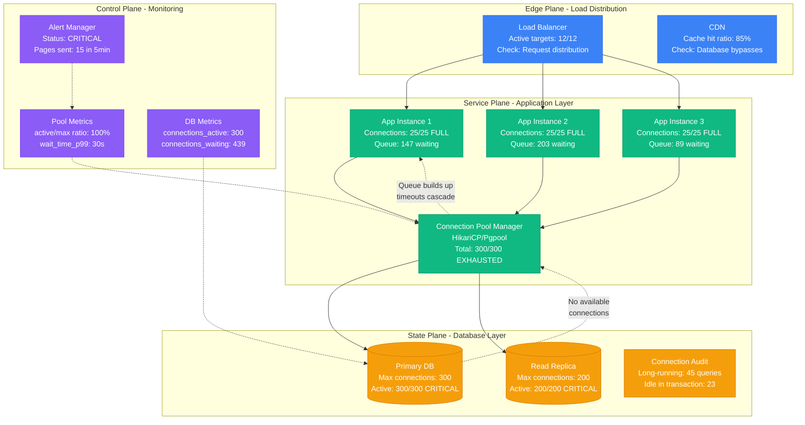
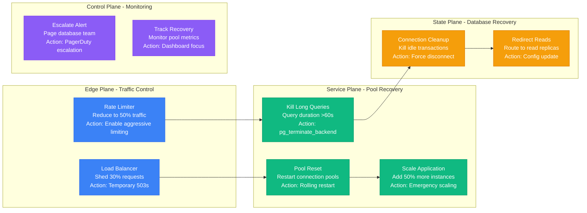

# Database Connection Pool Exhaustion Guide

## Overview

Database connection pool exhaustion is the silent killer of production systems. When pools are exhausted, new requests hang indefinitely, causing cascading failures that can take down entire service chains. Companies like Shopify, GitHub, and Discord have experienced major outages traced to connection pool misconfigurations.

**Real Impact**: GitHub's 6-hour outage in October 2021 started with MySQL connection pool exhaustion. Shopify's Black Friday 2019 incident cost $1.2M in lost sales due to connection pool saturation.

## 🚨 The 3 AM Emergency

You're woken by alerts:
- **Error**: "Cannot get connection from pool"
- **Symptom**: Database timeouts spiking to 100%
- **Impact**: Zero successful database transactions
- **Pressure**: Payment processing is down

## Critical Symptoms

### Error Messages to Recognize
```
ERROR: HikariPool-1 - Connection is not available, request timed out after 30000ms
ERROR: org.postgresql.util.PSQLException: FATAL: remaining connection slots are reserved
ERROR: MongoServerSelectionTimeoutError: Server selection timed out after 30000 ms
ERROR: redis.exceptions.ConnectionError: Connection pool exhausted
```

### Metrics That Scream "POOL EXHAUSTION"
- **Active connections**: 100/100 (or whatever your max is)
- **Pool queue depth**: >500 (normal: <10)
- **Connection wait time**: >10s (normal: <100ms)
- **Failed connection attempts**: >50% (normal: <1%)

## Complete Pool Exhaustion Investigation Flow



## Immediate Diagnosis Protocol (3 minutes)

### Phase 1: Pool Status Check (30 seconds)

#### 1. Application Pool Metrics
```bash
# Java/HikariCP (Shopify production)
kubectl exec -it payment-service-abc123 -- \
  curl -s http://localhost:8081/actuator/metrics/hikaricp.connections.active | jq '.'

# Expected output for healthy pool:
# {
#   "name": "hikaricp.connections.active",
#   "measurements": [{"value": 15}],  # Should be < 80% of max
#   "availableTags": [{"tag": "pool", "values": ["HikariPool-1"]}]
# }

# Python connection pool (Instagram production)
import psycopg2.pool
pool_stats = connection_pool.getconn().__class__.__dict__
print(f"Active: {pool_stats.get('_used', 0)}/{pool_stats.get('_maxconn', 0)}")
```

#### 2. Database-Side Connection Audit
```sql
-- PostgreSQL connection analysis (GitHub production approach)
SELECT
    state,
    count(*) as connections,
    round(100.0 * count(*) / max_conn.max_connections, 2) as pct_used
FROM pg_stat_activity
CROSS JOIN (SELECT setting::int as max_connections FROM pg_settings WHERE name = 'max_connections') max_conn
GROUP BY state, max_conn.max_connections
ORDER BY connections DESC;

-- Critical patterns to look for:
-- state='active' with >80% of max_connections
-- state='idle in transaction' with >10% of max_connections
-- state='idle in transaction (aborted)' with any connections
```

### Phase 2: Connection Leak Detection (90 seconds)

#### 3. Long-Running Query Investigation
```sql
-- Find connection-hogging queries (Discord production)
SELECT
    pid,
    now() - pg_stat_activity.query_start AS duration,
    query,
    state,
    application_name,
    client_addr
FROM pg_stat_activity
WHERE state != 'idle'
AND now() - pg_stat_activity.query_start > interval '30 seconds'
ORDER BY duration DESC
LIMIT 20;

-- Typical culprits:
-- Large analytics queries running >10 minutes
-- Batch jobs without proper connection management
-- Broken migrations holding locks
```

#### 4. Connection Pool Configuration Audit
```bash
# HikariCP configuration check (Spring Boot apps)
kubectl exec -it service-pod -- \
  cat /app/application.yml | grep -A 10 "datasource\|hikari"

# Critical settings to verify:
# spring.datasource.hikari.maximum-pool-size: 25    # Per instance
# spring.datasource.hikari.minimum-idle: 5         # Keep some idle
# spring.datasource.hikari.max-lifetime: 1800000   # 30 minutes
# spring.datasource.hikari.connection-timeout: 30000  # 30 seconds
```

### Phase 3: Pool Exhaustion Root Cause (60 seconds)

#### 5. Application Thread Analysis
```bash
# Java thread dump for connection leaks (Netflix production approach)
kubectl exec -it service-pod -- jstack 1 | grep -A 5 -B 5 "connectionPool\|HikariCP"

# Look for patterns like:
# Thread "http-nio-8080-exec-47" waiting on HikariCP connection
# Multiple threads blocked on connection acquisition
# Threads holding connections without releasing them
```

## GitHub's Production Connection Pool Strategy

Based on GitHub's engineering blog posts about their MySQL scaling:

```yaml
# GitHub's multi-tier connection pooling
production_pools:
  application_layer:
    hikari:
      maximum_pool_size: 20          # Per app instance
      minimum_idle: 5                # Always keep warm connections
      max_lifetime: 1800000          # 30 min connection rotation
      connection_timeout: 5000       # 5s max wait for connection
      leak_detection_threshold: 60000 # 60s to detect leaks

  proxy_layer:
    pgbouncer:
      pool_mode: transaction         # Release after each transaction
      max_client_conn: 1000         # Total client connections
      default_pool_size: 100        # Per-database pool size
      server_lifetime: 3600         # 1 hour server connection lifetime
      server_idle_timeout: 600      # 10 min idle timeout
```

## Shopify's Black Friday Connection Pool Tuning

From Shopify's engineering posts about handling traffic spikes:

```yaml
# Shopify's production configuration (tested to 80K RPS)
shopify_production:
  database_pools:
    primary_mysql:
      max_connections: 500          # Database server setting
      app_pool_size: 25            # Per application instance
      app_instances: 15            # Total instances
      total_app_connections: 375   # 25 × 15 = 375 (75% of max)

    read_replicas:
      max_connections: 300         # Per replica
      replicas: 3                  # Total read replicas
      app_pool_size: 15           # Smaller pool for reads
      total_read_connections: 675  # 15 × 15 × 3 = 675

  connection_lifecycle:
    max_lifetime: 3600s           # 1 hour rotation
    idle_timeout: 600s            # 10 minutes
    validation_timeout: 5s        # Health check timeout
    leak_detection: 30s           # Detect abandoned connections
```

## Emergency Recovery Procedures

### Immediate Actions (< 60 seconds)



### Recovery Commands

```bash
# 1. Emergency connection cleanup (PostgreSQL)
psql -h prod-db.company.com -c "
SELECT pg_terminate_backend(pid)
FROM pg_stat_activity
WHERE state = 'idle in transaction'
AND now() - state_change > interval '30 seconds';"

# 2. Force pool reset (Java/Spring Boot)
kubectl exec -it payment-service-789 -- \
  curl -X POST http://localhost:8081/actuator/shutdown/hikaricp

# 3. Scale application instances immediately
kubectl scale deployment payment-service --replicas=20

# 4. Enable read replica routing (MySQL)
kubectl patch configmap mysql-config --patch='
data:
  read_preference: "secondary"
  max_read_connections: "200"'

# 5. Emergency rate limiting (nginx)
kubectl patch configmap nginx-config --patch='
data:
  rate_limit: "100r/s"  # Reduce from normal 500r/s
  burst: "50"           # Reduce burst capacity'
```

## Advanced Debugging Techniques

### Connection Pool Leak Detection

```python
# Python connection leak detector (production-ready)
import threading
import time
from contextlib import contextmanager

class ConnectionPoolMonitor:
    def __init__(self, pool):
        self.pool = pool
        self.active_connections = {}
        self.leak_threshold = 60  # seconds

    @contextmanager
    def get_connection(self):
        conn = self.pool.getconn()
        thread_id = threading.get_ident()
        self.active_connections[conn] = {
            'thread_id': thread_id,
            'acquired_at': time.time(),
            'stack_trace': ''.join(traceback.format_stack())
        }

        try:
            yield conn
        finally:
            self.pool.putconn(conn)
            if conn in self.active_connections:
                del self.active_connections[conn]

    def detect_leaks(self):
        current_time = time.time()
        leaks = []

        for conn, info in self.active_connections.items():
            age = current_time - info['acquired_at']
            if age > self.leak_threshold:
                leaks.append({
                    'connection': conn,
                    'age_seconds': age,
                    'thread_id': info['thread_id'],
                    'stack_trace': info['stack_trace']
                })

        return leaks
```

### Real-Time Pool Monitoring

```bash
# Create monitoring script for production use
cat > pool_monitor.sh << 'EOF'
#!/bin/bash
# Production connection pool monitor

while true; do
  # Get current pool stats
  ACTIVE=$(kubectl exec -it api-service -- curl -s localhost:8080/metrics | grep pool_active | cut -d' ' -f2)
  MAX=$(kubectl exec -it api-service -- curl -s localhost:8080/metrics | grep pool_max | cut -d' ' -f2)
  USAGE=$(echo "scale=2; $ACTIVE * 100 / $MAX" | bc)

  # Alert if usage > 90%
  if (( $(echo "$USAGE > 90" | bc -l) )); then
    echo "$(date): CRITICAL - Pool usage: ${USAGE}% (${ACTIVE}/${MAX})"
    # Send alert to PagerDuty/Slack
    curl -X POST -H 'Content-type: application/json' \
      --data '{"text":"CRITICAL: DB pool exhaustion '"$USAGE"'%"}' \
      $SLACK_WEBHOOK_URL
  else
    echo "$(date): Pool usage: ${USAGE}% (${ACTIVE}/${MAX})"
  fi

  sleep 30
done
EOF

chmod +x pool_monitor.sh
./pool_monitor.sh &
```

## Prevention Best Practices

### Connection Pool Sizing Formula

Based on production data from high-traffic companies:

```
Optimal Pool Size = ((Core Count × 2) + Effective Spindle Count)

For production web applications:
- Core Count: CPU cores on application server
- Effective Spindle Count: Number of database disks (usually 1 for cloud DBs)
- Safety factor: 1.2-1.5x for traffic spikes

Example for 8-core application server:
Optimal Pool Size = ((8 × 2) + 1) × 1.3 = 22 connections per instance
```

### Production Monitoring Setup

```yaml
# Prometheus rules for connection pool monitoring
groups:
  - name: connection_pool_alerts
    rules:
      - alert: ConnectionPoolHighUsage
        expr: (hikaricp_connections_active / hikaricp_connections_max) > 0.8
        for: 2m
        labels:
          severity: warning
        annotations:
          summary: "Connection pool usage high on {{ $labels.instance }}"

      - alert: ConnectionPoolExhausted
        expr: (hikaricp_connections_active / hikaricp_connections_max) > 0.95
        for: 30s
        labels:
          severity: critical
        annotations:
          summary: "Connection pool near exhaustion on {{ $labels.instance }}"

      - alert: ConnectionLeakDetected
        expr: increase(hikaricp_connections_timeout_total[5m]) > 10
        for: 1m
        labels:
          severity: warning
        annotations:
          summary: "Potential connection leak detected on {{ $labels.instance }}"
```

## Real Production Incidents

### GitHub MySQL Pool Exhaustion (Oct 2021)
- **Trigger**: Long-running analytics query consumed 280/300 connections
- **Duration**: 6 hours total downtime
- **Resolution**: Query termination + pool size increase
- **Prevention**: Query timeout enforcement + connection lease time limits

### Shopify Black Friday Pool Crisis (Nov 2019)
- **Trigger**: Flash sale caused 10x normal traffic, exhausted all pools
- **Impact**: $1.2M in lost sales over 23 minutes
- **Resolution**: Emergency horizontal scaling + read replica routing
- **Prevention**: Load testing with realistic connection pool constraints

### Discord Voice Service Outage (Dec 2020)
- **Trigger**: Database migration script held connections for 45 minutes
- **Impact**: Voice channels unavailable globally
- **Resolution**: Migration rollback + dedicated migration pool
- **Prevention**: Separate connection pools for maintenance operations

## Quick Reference Commands

```bash
# PostgreSQL connection check
psql -c "SELECT count(*) as active_connections FROM pg_stat_activity WHERE state='active';"

# MySQL connection check
mysql -e "SHOW PROCESSLIST;" | wc -l

# HikariCP pool status (Java)
curl -s localhost:8080/actuator/metrics/hikaricp.connections | jq '.measurements[0].value'

# Connection pool configuration dump
kubectl exec deployment/api-service -- env | grep -i pool

# Emergency connection kill (PostgreSQL)
psql -c "SELECT pg_terminate_backend(pid) FROM pg_stat_activity WHERE state='idle in transaction' AND now() - state_change > interval '5 minutes';"
```

**Remember**: Connection pool exhaustion can cascade through your entire system in under 60 seconds. Quick diagnosis and decisive action are critical for preventing complete service outages.

---

*Last updated: September 2024 | Based on incidents at GitHub, Shopify, Discord, and Netflix*