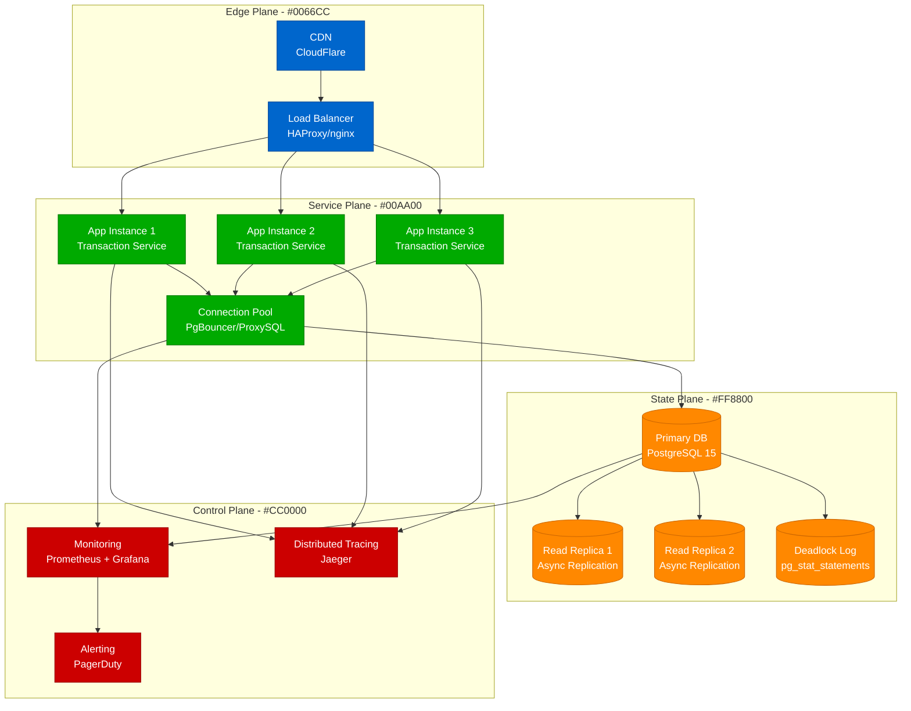
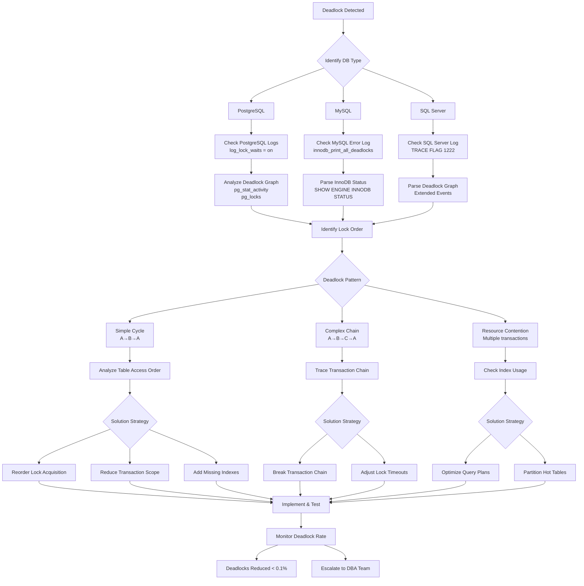

# Database Deadlocks - Systematic Detection and Resolution

## Overview

This guide provides comprehensive strategies for identifying, analyzing, and resolving database deadlocks across PostgreSQL, MySQL, and SQL Server. Based on production experiences from Stripe, PayPal, and Robinhood's financial transaction systems.

## Architecture Context



## Deadlock Detection Flowchart



## Database-Specific Detection

### PostgreSQL Deadlock Analysis

#### Enable Deadlock Logging
```sql
-- Enable comprehensive logging
ALTER SYSTEM SET log_lock_waits = on;
ALTER SYSTEM SET deadlock_timeout = '1s';
ALTER SYSTEM SET log_statement = 'all';
SELECT pg_reload_conf();
```

#### Detection Queries
```sql
-- Current lock waits
SELECT
    blocked_locks.pid AS blocked_pid,
    blocked_activity.usename AS blocked_user,
    blocking_locks.pid AS blocking_pid,
    blocking_activity.usename AS blocking_user,
    blocked_activity.query AS blocked_statement,
    blocking_activity.query AS current_statement_in_blocking_process,
    blocked_activity.application_name AS blocked_application,
    blocking_activity.application_name AS blocking_application
FROM pg_catalog.pg_locks blocked_locks
JOIN pg_catalog.pg_stat_activity blocked_activity
    ON blocked_activity.pid = blocked_locks.pid
JOIN pg_catalog.pg_locks blocking_locks
    ON blocking_locks.locktype = blocked_locks.locktype
    AND blocking_locks.database IS NOT DISTINCT FROM blocked_locks.database
    AND blocking_locks.relation IS NOT DISTINCT FROM blocked_locks.relation
    AND blocking_locks.page IS NOT DISTINCT FROM blocked_locks.page
    AND blocking_locks.tuple IS NOT DISTINCT FROM blocked_locks.tuple
    AND blocking_locks.virtualxid IS NOT DISTINCT FROM blocked_locks.virtualxid
    AND blocking_locks.transactionid IS NOT DISTINCT FROM blocked_locks.transactionid
    AND blocking_locks.classid IS NOT DISTINCT FROM blocked_locks.classid
    AND blocking_locks.objid IS NOT DISTINCT FROM blocked_locks.objid
    AND blocking_locks.objsubid IS NOT DISTINCT FROM blocked_locks.objsubid
    AND blocking_locks.pid != blocked_locks.pid
JOIN pg_catalog.pg_stat_activity blocking_activity
    ON blocking_activity.pid = blocking_locks.pid
WHERE NOT blocked_locks.granted;

-- Deadlock history analysis
SELECT
    query,
    calls,
    total_time,
    mean_time,
    rows
FROM pg_stat_statements
WHERE query LIKE '%deadlock%'
   OR query LIKE '%lock timeout%'
ORDER BY calls DESC;
```

### MySQL/InnoDB Deadlock Analysis

#### Enable Deadlock Logging
```sql
-- Enable deadlock logging
SET GLOBAL innodb_print_all_deadlocks = ON;

-- Check current deadlock information
SHOW ENGINE INNODB STATUS\G

-- Enable performance schema for lock monitoring
UPDATE performance_schema.setup_instruments
SET ENABLED = 'YES'
WHERE NAME LIKE 'wait/lock%';
```

#### Detection Queries
```sql
-- Current lock waits
SELECT
    r.trx_id waiting_trx_id,
    r.trx_mysql_thread_id waiting_thread,
    r.trx_query waiting_query,
    b.trx_id blocking_trx_id,
    b.trx_mysql_thread_id blocking_thread,
    b.trx_query blocking_query
FROM information_schema.innodb_lock_waits w
INNER JOIN information_schema.innodb_trx b
    ON b.trx_id = w.blocking_trx_id
INNER JOIN information_schema.innodb_trx r
    ON r.trx_id = w.requesting_trx_id;

-- Lock contention analysis
SELECT
    object_schema,
    object_name,
    lock_type,
    lock_duration,
    COUNT(*) as wait_count,
    AVG(timer_wait/1000000000) as avg_wait_seconds
FROM performance_schema.events_waits_history_long
WHERE event_name LIKE 'wait/lock%'
GROUP BY object_schema, object_name, lock_type, lock_duration
ORDER BY wait_count DESC;
```

### SQL Server Deadlock Analysis

#### Enable Deadlock Monitoring
```sql
-- Enable deadlock trace
DBCC TRACEON(1222, -1);

-- Create extended event session for deadlock monitoring
CREATE EVENT SESSION [DeadlockMonitor] ON SERVER
ADD EVENT sqlserver.xml_deadlock_report(
    ACTION(sqlserver.client_app_name,sqlserver.database_name,
           sqlserver.nt_username,sqlserver.session_id,
           sqlserver.sql_text,sqlserver.username))
ADD TARGET package0.event_file(SET filename=N'DeadlockMonitor')
WITH (MAX_MEMORY=4096 KB,EVENT_RETENTION_MODE=ALLOW_SINGLE_EVENT_LOSS,
      MAX_DISPATCH_LATENCY=30 SECONDS,MAX_EVENT_SIZE=0 KB,
      MEMORY_PARTITION_MODE=NONE,TRACK_CAUSALITY=OFF,STARTUP_STATE=ON);

ALTER EVENT SESSION [DeadlockMonitor] ON SERVER STATE = START;
```

#### Detection Queries
```sql
-- Current blocking processes
SELECT
    r.session_id AS blocked_session_id,
    s.login_name AS blocked_user,
    r.blocking_session_id,
    bs.login_name AS blocking_user,
    r.wait_type,
    r.wait_resource,
    r.wait_time,
    SUBSTRING(st.text, (r.statement_start_offset/2)+1,
        ((CASE r.statement_end_offset
            WHEN -1 THEN DATALENGTH(st.text)
            ELSE r.statement_end_offset
        END - r.statement_start_offset)/2) + 1) AS statement_text
FROM sys.dm_exec_requests r
INNER JOIN sys.dm_exec_sessions s ON r.session_id = s.session_id
INNER JOIN sys.dm_exec_sessions bs ON r.blocking_session_id = bs.session_id
CROSS APPLY sys.dm_exec_sql_text(r.sql_handle) st
WHERE r.blocking_session_id <> 0;
```

## Common Deadlock Patterns & Solutions

### 1. Classic Two-Resource Deadlock

#### Problem Pattern
```sql
-- Transaction 1
BEGIN;
UPDATE accounts SET balance = balance - 100 WHERE id = 1;  -- Lock A
UPDATE accounts SET balance = balance + 100 WHERE id = 2;  -- Wait for Lock B
COMMIT;

-- Transaction 2 (concurrent)
BEGIN;
UPDATE accounts SET balance = balance - 50 WHERE id = 2;   -- Lock B
UPDATE accounts SET balance = balance + 50 WHERE id = 1;   -- Wait for Lock A
COMMIT;
```

#### Solution: Ordered Locking
```sql
-- Both transactions acquire locks in same order
BEGIN;
UPDATE accounts
SET balance = CASE
    WHEN id = 1 THEN balance - 100
    WHEN id = 2 THEN balance + 100
END
WHERE id IN (1, 2)
ORDER BY id;  -- Consistent ordering prevents deadlock
COMMIT;
```

### 2. Foreign Key Deadlock

#### Problem Pattern
```sql
-- Transaction 1
INSERT INTO orders (customer_id, amount) VALUES (123, 100.00);
-- Acquires shared lock on customers(123)

-- Transaction 2 (concurrent)
UPDATE customers SET last_order_date = NOW() WHERE id = 123;
-- Tries to acquire exclusive lock on customers(123)
INSERT INTO orders (customer_id, amount) VALUES (123, 50.00);
-- Waits for customers(123) lock
```

#### Solution: Lock Ordering + Batching
```sql
-- Use explicit locking with consistent order
BEGIN;
-- Explicitly lock customer first
SELECT id FROM customers WHERE id = 123 FOR UPDATE;
INSERT INTO orders (customer_id, amount) VALUES (123, 100.00);
UPDATE customers SET last_order_date = NOW() WHERE id = 123;
COMMIT;
```

### 3. Index Range Lock Deadlock

#### Problem Pattern
```sql
-- Transaction 1
SELECT * FROM inventory
WHERE product_id BETWEEN 100 AND 200
FOR UPDATE;

-- Transaction 2 (concurrent)
SELECT * FROM inventory
WHERE product_id BETWEEN 150 AND 250
FOR UPDATE;
```

#### Solution: Pagination + Timeout
```sql
-- Use smaller ranges with timeout
SET lock_timeout = 5000; -- 5 seconds

-- Process in smaller chunks
SELECT * FROM inventory
WHERE product_id BETWEEN 100 AND 125
FOR UPDATE;
```

## Production Examples

### Stripe: Payment Processing Deadlocks
```sql
-- Problem: Transfer deadlocks between accounts
-- Original problematic code
BEGIN;
UPDATE accounts SET balance = balance - :amount
WHERE account_id = :from_account;
UPDATE accounts SET balance = balance + :amount
WHERE account_id = :to_account;
COMMIT;

-- Solution: Deterministic lock ordering
BEGIN;
UPDATE accounts
SET balance = CASE
    WHEN account_id = LEAST(:from_account, :to_account)
        THEN balance + (:amount * SIGN(:to_account - :from_account))
    WHEN account_id = GREATEST(:from_account, :to_account)
        THEN balance - (:amount * SIGN(:to_account - :from_account))
END
WHERE account_id IN (:from_account, :to_account)
ORDER BY account_id;
COMMIT;
```

### PayPal: Transaction Log Deadlocks
```sql
-- Problem: Concurrent transaction logging
-- Solution: Use advisory locks for coordination
BEGIN;
-- Acquire advisory lock based on account hash
SELECT pg_advisory_xact_lock(hashtext(account_id::text));

INSERT INTO transaction_log (account_id, amount, type, timestamp)
VALUES (:account_id, :amount, :type, NOW());

UPDATE account_summary
SET last_transaction = NOW(),
    transaction_count = transaction_count + 1
WHERE account_id = :account_id;
COMMIT;
```

### Robinhood: Stock Order Deadlocks
```sql
-- Problem: Order processing deadlocks
-- Solution: Event-driven architecture with single writer
-- Instead of concurrent updates, use event queue

-- Producer (Order Service)
INSERT INTO order_events (order_id, event_type, data, created_at)
VALUES (:order_id, 'ORDER_PLACED', :order_data, NOW());

-- Consumer (Single threaded processor)
-- Processes events in order, eliminating deadlocks
BEGIN;
SELECT * FROM order_events
WHERE processed = false
ORDER BY created_at
LIMIT 100
FOR UPDATE SKIP LOCKED;

-- Process events without deadlock risk
COMMIT;
```

## Monitoring & Alerting

### PostgreSQL Monitoring
```sql
-- Create deadlock monitoring view
CREATE OR REPLACE VIEW deadlock_monitor AS
SELECT
    schemaname,
    tablename,
    n_tup_ins + n_tup_upd + n_tup_del as total_operations,
    n_tup_hot_upd,
    n_live_tup,
    n_dead_tup,
    last_vacuum,
    last_autovacuum,
    last_analyze,
    last_autoanalyze
FROM pg_stat_user_tables
WHERE n_tup_ins + n_tup_upd + n_tup_del > 1000
ORDER BY total_operations DESC;

-- Deadlock detection function
CREATE OR REPLACE FUNCTION detect_potential_deadlocks()
RETURNS TABLE(
    waiting_pid int,
    waiting_query text,
    blocking_pid int,
    blocking_query text,
    wait_duration interval
) AS $$
BEGIN
    RETURN QUERY
    SELECT
        w.pid as waiting_pid,
        w.query as waiting_query,
        b.pid as blocking_pid,
        b.query as blocking_query,
        NOW() - w.query_start as wait_duration
    FROM pg_stat_activity w
    JOIN pg_stat_activity b ON w.pid = ANY(pg_blocking_pids(w.pid))
    WHERE w.state = 'active'
      AND w.wait_event_type = 'Lock'
      AND NOW() - w.query_start > interval '5 seconds';
END;
$$ LANGUAGE plpgsql;
```

### Prometheus Metrics
```yaml
# PostgreSQL deadlock metrics
- name: postgresql_deadlocks_total
  query: SELECT COALESCE(SUM(deadlocks), 0) as deadlocks FROM pg_stat_database
  help: "Total number of deadlocks detected"

- name: postgresql_lock_waits_total
  query: SELECT COUNT(*) as lock_waits FROM pg_stat_activity WHERE wait_event_type = 'Lock'
  help: "Current number of processes waiting for locks"

- name: postgresql_longest_lock_wait_seconds
  query: SELECT COALESCE(EXTRACT(epoch FROM MAX(NOW() - query_start)), 0) FROM pg_stat_activity WHERE wait_event_type = 'Lock'
  help: "Longest current lock wait time in seconds"
```

### Grafana Alerts
```yaml
- alert: HighDeadlockRate
  expr: rate(postgresql_deadlocks_total[5m]) > 0.1
  for: 2m
  labels:
    severity: warning
  annotations:
    summary: "High deadlock rate detected"
    description: "Deadlock rate is {{ $value }} per second"

- alert: LongLockWait
  expr: postgresql_longest_lock_wait_seconds > 60
  for: 1m
  labels:
    severity: critical
  annotations:
    summary: "Long lock wait detected"
    description: "Lock wait time is {{ $value }} seconds"
```

## Prevention Strategies

### 1. Application-Level Prevention
```python
# Python example with consistent lock ordering
import hashlib
from contextlib import contextmanager

@contextmanager
def ordered_lock_accounts(*account_ids):
    """Acquire locks in deterministic order to prevent deadlocks"""
    sorted_ids = sorted(account_ids)

    with db.transaction():
        # Acquire advisory locks in order
        for account_id in sorted_ids:
            lock_key = int(hashlib.md5(str(account_id).encode()).hexdigest()[:8], 16)
            db.execute("SELECT pg_advisory_xact_lock(%s)", [lock_key])

        yield
```

### 2. Database Design Prevention
```sql
-- Use partial indexes to reduce lock contention
CREATE INDEX CONCURRENTLY idx_active_orders
ON orders (customer_id, created_at)
WHERE status = 'active';

-- Partition hot tables by time or hash
CREATE TABLE orders_2024_q1 PARTITION OF orders
FOR VALUES FROM ('2024-01-01') TO ('2024-04-01');

-- Use materialized views for heavy aggregations
CREATE MATERIALIZED VIEW customer_stats AS
SELECT
    customer_id,
    COUNT(*) as order_count,
    SUM(amount) as total_spent,
    MAX(created_at) as last_order
FROM orders
GROUP BY customer_id;
```

### 3. Connection Pool Configuration
```yaml
# PgBouncer configuration for deadlock reduction
[databases]
production = host=db.example.com port=5432 dbname=app

[pgbouncer]
pool_mode = transaction
max_client_conn = 100
default_pool_size = 20
reserve_pool_size = 5
reserve_pool_timeout = 5
```

## Recovery Procedures

### Immediate Response (< 5 minutes)
1. **Identify affected transactions**
   ```sql
   SELECT * FROM pg_stat_activity WHERE wait_event_type = 'Lock';
   ```

2. **Kill blocking sessions if necessary**
   ```sql
   SELECT pg_terminate_backend(pid) FROM pg_stat_activity
   WHERE state = 'idle in transaction'
   AND query_start < NOW() - interval '5 minutes';
   ```

3. **Monitor deadlock resolution**
   ```bash
   # Watch PostgreSQL logs for deadlock messages
   tail -f /var/log/postgresql/postgresql.log | grep -i deadlock
   ```

### Short-term Fixes (< 1 hour)
1. **Analyze deadlock patterns**
2. **Implement query timeouts**
3. **Add missing indexes**
4. **Reduce transaction scope**

### Long-term Solutions (< 1 week)
1. **Redesign problematic transactions**
2. **Implement event-driven architecture**
3. **Add table partitioning**
4. **Review application concurrency patterns**

## Success Metrics

- **Deadlock Rate**: < 0.01% of total transactions
- **Average Lock Wait Time**: < 100ms
- **Maximum Lock Wait Time**: < 5 seconds
- **Deadlock Resolution Time**: < 30 seconds
- **False Positive Rate**: < 1% of deadlock alerts

## The 3 AM Test

**Scenario**: Your payment processing system is experiencing deadlocks causing transaction failures during peak load.

**This guide provides**:
1. **Immediate detection**: Database-specific queries to identify deadlock chains
2. **Root cause analysis**: Pattern recognition for common deadlock scenarios
3. **Quick resolution**: Kill blocking sessions and apply immediate fixes
4. **Prevention**: Code patterns and database design to prevent recurrence
5. **Monitoring**: Automated alerts for early deadlock detection

**Expected outcome**: Deadlocks resolved within 15 minutes, payment processing restored, permanent fixes deployed within 24 hours.