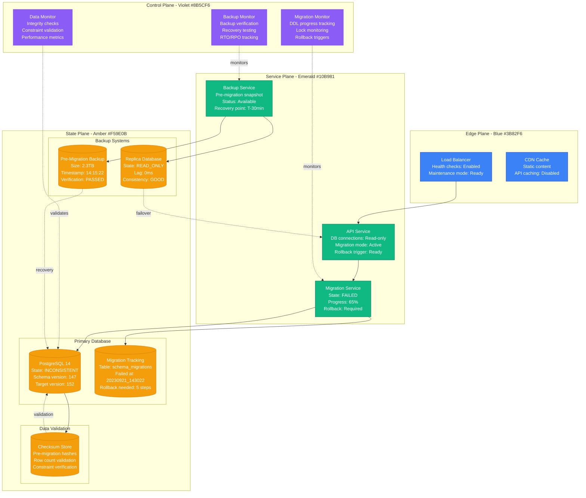
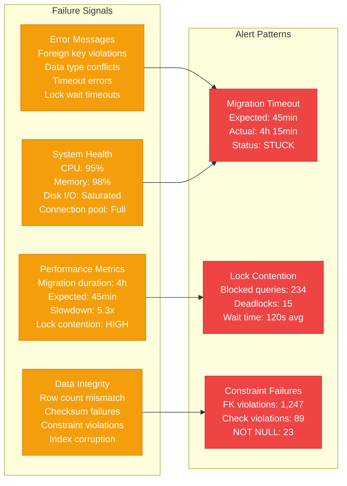
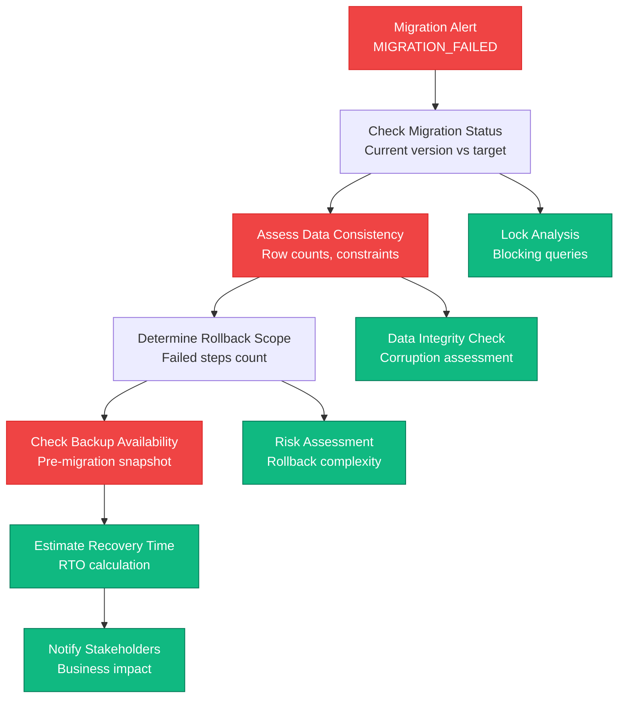
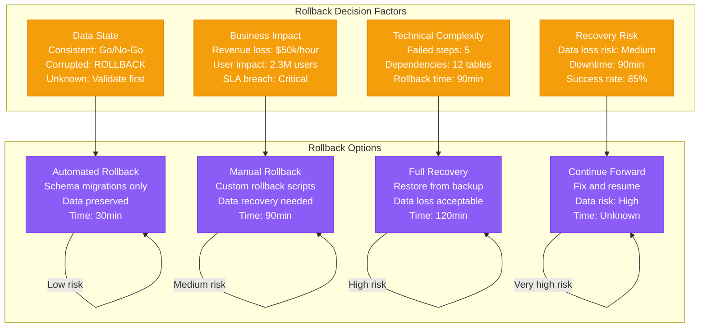
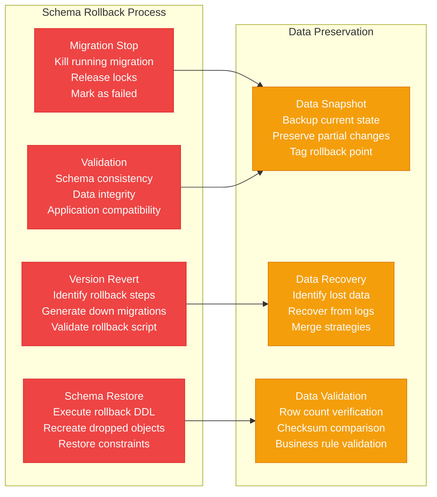
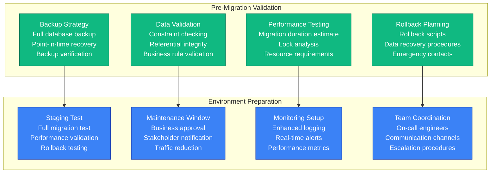

# Database Migration Rollback Production Debugging

## Overview

Database migration failures and rollbacks are critical incidents that can result in data corruption, service downtime, and business continuity issues. This guide provides systematic approaches to debug failed migrations, perform safe rollbacks, and recover from migration-related incidents based on real production scenarios.

## Real Incident: GitLab's 2017 Database Migration Disaster

**Impact**: 6-hour outage with 6TB of production data at risk
**Root Cause**: Migration script corruption during PostgreSQL upgrade
**Data Loss**: 300GB of repository data, 5 hours of recent commits
**Recovery Time**: 18 hours (6 hours downtime + 12 hours data recovery)
**Cost**: ~$1.2M in lost revenue + engineering time

## Architecture Overview



## Detection Signals

### Migration Failure Indicators


### Detection Commands
```bash
# 1. Check migration status
kubectl logs -l app=migration-service --tail=100 | grep -E "(ERROR|FAILED|ROLLBACK)"

# 2. Database migration table
psql -h $DB_HOST -d $DB_NAME -c "
SELECT version, dirty, executed_at
FROM schema_migrations
ORDER BY executed_at DESC LIMIT 10;"

# 3. Active migration locks
psql -h $DB_HOST -d $DB_NAME -c "
SELECT pid, state, query_start, wait_event, query
FROM pg_stat_activity
WHERE state = 'active' AND query LIKE '%ALTER%'
ORDER BY query_start;"

# 4. Migration progress estimation
tail -f /var/log/migration.log | grep -E "(processed|remaining|progress)"
```

## Debugging Workflow

### Phase 1: Migration State Assessment (0-5 minutes)



### Phase 2: Rollback Decision Matrix (5-15 minutes)



## Rollback Procedures

### Automated Schema Rollback



### Emergency Rollback Scripts

```bash
#!/bin/bash
# Emergency database migration rollback script

set -euo pipefail

# Configuration
DB_HOST="${DB_HOST:-localhost}"
DB_NAME="${DB_NAME:-production}"
DB_USER="${DB_USER:-postgres}"
BACKUP_PREFIX="${BACKUP_PREFIX:-emergency_rollback}"
LOG_FILE="/var/log/rollback_$(date +%Y%m%d_%H%M%S).log"

# Logging function
log() {
    echo "[$(date '+%Y-%m-%d %H:%M:%S')] $1" | tee -a "$LOG_FILE"
}

# 1. Emergency backup before rollback
emergency_backup() {
    log "Creating emergency backup before rollback..."

    pg_dump -h "$DB_HOST" -U "$DB_USER" -d "$DB_NAME" \
        --verbose --no-password \
        -f "${BACKUP_PREFIX}_$(date +%Y%m%d_%H%M%S).sql"

    if [ $? -eq 0 ]; then
        log "Emergency backup completed successfully"
    else
        log "ERROR: Emergency backup failed"
        exit 1
    fi
}

# 2. Stop running migrations
stop_migrations() {
    log "Stopping running migrations..."

    # Kill migration processes
    psql -h "$DB_HOST" -U "$DB_USER" -d "$DB_NAME" -c "
    SELECT pg_terminate_backend(pid)
    FROM pg_stat_activity
    WHERE state = 'active'
    AND query LIKE '%ALTER TABLE%'
    OR query LIKE '%CREATE INDEX%'
    OR query LIKE '%DROP%';"

    # Release advisory locks
    psql -h "$DB_HOST" -U "$DB_USER" -d "$DB_NAME" -c "
    SELECT pg_advisory_unlock_all();"

    log "Migration processes stopped"
}

# 3. Get current migration version
get_current_version() {
    local version=$(psql -h "$DB_HOST" -U "$DB_USER" -d "$DB_NAME" -t -c "
    SELECT version FROM schema_migrations
    WHERE dirty = false
    ORDER BY executed_at DESC LIMIT 1;" | xargs)

    echo "$version"
}

# 4. Generate rollback script
generate_rollback() {
    local current_version="$1"
    local target_version="$2"

    log "Generating rollback script from $current_version to $target_version"

    # Get failed migrations
    psql -h "$DB_HOST" -U "$DB_USER" -d "$DB_NAME" -c "
    SELECT version, migration_name
    FROM schema_migrations
    WHERE version > '$target_version'
    AND version <= '$current_version'
    ORDER BY version DESC;" > rollback_migrations.txt

    # Create rollback script
    cat > rollback_script.sql << 'EOF'
-- Emergency rollback script
-- Generated at: $(date)

BEGIN;

-- Set constraints to deferred
SET CONSTRAINTS ALL DEFERRED;

EOF

    # Add specific rollback steps based on migration type
    while IFS='|' read -r version name; do
        version=$(echo "$version" | xargs)
        name=$(echo "$name" | xargs)

        log "Adding rollback for migration $version: $name"

        # Generate rollback SQL based on migration patterns
        if [[ "$name" == *"add_column"* ]]; then
            table=$(echo "$name" | sed 's/.*add_column_.*_to_//' | sed 's/_[0-9]*.rb//')
            column=$(echo "$name" | sed 's/.*add_column_//' | sed 's/_to_.*//')
            echo "ALTER TABLE $table DROP COLUMN IF EXISTS $column;" >> rollback_script.sql
        elif [[ "$name" == *"create_table"* ]]; then
            table=$(echo "$name" | sed 's/.*create_//' | sed 's/_[0-9]*.rb//')
            echo "DROP TABLE IF EXISTS $table CASCADE;" >> rollback_script.sql
        elif [[ "$name" == *"add_index"* ]]; then
            index=$(echo "$name" | sed 's/.*add_index_//' | sed 's/_[0-9]*.rb//')
            echo "DROP INDEX IF EXISTS $index;" >> rollback_script.sql
        fi

        # Mark migration as not executed
        echo "DELETE FROM schema_migrations WHERE version = '$version';" >> rollback_script.sql

    done < rollback_migrations.txt

    cat >> rollback_script.sql << 'EOF'

-- Reset sequences if needed
-- Add sequence resets here

COMMIT;
EOF

    log "Rollback script generated: rollback_script.sql"
}

# 5. Execute rollback
execute_rollback() {
    log "Executing rollback script..."

    # Dry run first
    log "Performing dry run..."
    psql -h "$DB_HOST" -U "$DB_USER" -d "$DB_NAME" \
        --single-transaction \
        --set ON_ERROR_STOP=on \
        --echo-all \
        --dry-run \
        -f rollback_script.sql

    if [ $? -ne 0 ]; then
        log "ERROR: Dry run failed, aborting rollback"
        exit 1
    fi

    # Actual execution
    log "Executing actual rollback..."
    psql -h "$DB_HOST" -U "$DB_USER" -d "$DB_NAME" \
        --single-transaction \
        --set ON_ERROR_STOP=on \
        --echo-all \
        -f rollback_script.sql

    if [ $? -eq 0 ]; then
        log "Rollback executed successfully"
    else
        log "ERROR: Rollback execution failed"
        exit 1
    fi
}

# 6. Validate rollback
validate_rollback() {
    log "Validating rollback..."

    # Check schema version
    local current_version=$(get_current_version)
    log "Current schema version after rollback: $current_version"

    # Check table counts
    psql -h "$DB_HOST" -U "$DB_USER" -d "$DB_NAME" -c "
    SELECT schemaname, tablename, n_tup_ins + n_tup_upd + n_tup_del as changes
    FROM pg_stat_user_tables
    WHERE n_tup_ins + n_tup_upd + n_tup_del > 0
    ORDER BY changes DESC LIMIT 20;"

    # Check constraints
    psql -h "$DB_HOST" -U "$DB_USER" -d "$DB_NAME" -c "
    SELECT conname, contype, confupdtype, confdeltype
    FROM pg_constraint
    WHERE NOT convalidated;"

    log "Rollback validation completed"
}

# Main execution
main() {
    local target_version="${1:-}"

    if [ -z "$target_version" ]; then
        log "ERROR: Target version not specified"
        log "Usage: $0 <target_version>"
        exit 1
    fi

    local current_version=$(get_current_version)

    log "Starting emergency rollback procedure"
    log "Current version: $current_version"
    log "Target version: $target_version"

    # Confirm with user
    echo "This will rollback the database from $current_version to $target_version"
    echo "This operation is IRREVERSIBLE. Continue? (yes/no)"
    read -r confirmation

    if [ "$confirmation" != "yes" ]; then
        log "Rollback cancelled by user"
        exit 0
    fi

    # Execute rollback procedure
    emergency_backup
    stop_migrations
    generate_rollback "$current_version" "$target_version"
    execute_rollback
    validate_rollback

    log "Emergency rollback procedure completed"
    log "Log file: $LOG_FILE"
}

# Script entry point
main "$@"
```

### Data Recovery Procedures

```python
#!/usr/bin/env python3
"""
Database migration data recovery tool
Recovers data lost during failed migrations
"""

import psycopg2
import logging
import sys
import json
from datetime import datetime
from typing import Dict, List, Optional

# Configure logging
logging.basicConfig(
    level=logging.INFO,
    format='%(asctime)s - %(levelname)s - %(message)s',
    handlers=[
        logging.FileHandler(f'data_recovery_{datetime.now().strftime("%Y%m%d_%H%M%S")}.log'),
        logging.StreamHandler(sys.stdout)
    ]
)

class DataRecoveryTool:
    def __init__(self, db_config: Dict[str, str]):
        self.db_config = db_config
        self.conn = None
        self.recovery_plan = []

    def connect(self) -> bool:
        """Establish database connection"""
        try:
            self.conn = psycopg2.connect(**self.db_config)
            self.conn.autocommit = False
            logging.info("Database connection established")
            return True
        except Exception as e:
            logging.error(f"Failed to connect to database: {e}")
            return False

    def analyze_data_loss(self, backup_file: str) -> Dict[str, any]:
        """Analyze data differences between backup and current state"""
        logging.info("Analyzing data loss patterns...")

        analysis = {
            'missing_tables': [],
            'missing_columns': [],
            'missing_rows': {},
            'orphaned_data': {},
            'constraint_violations': []
        }

        with self.conn.cursor() as cur:
            # Check for missing tables
            cur.execute("""
            SELECT table_name FROM information_schema.tables
            WHERE table_schema = 'public' AND table_type = 'BASE TABLE'
            """)
            current_tables = {row[0] for row in cur.fetchall()}

            # Compare with backup manifest (if available)
            # This would need backup metadata

            # Check for missing rows in key tables
            key_tables = ['users', 'orders', 'payments', 'products']
            for table in key_tables:
                if table in current_tables:
                    cur.execute(f"SELECT COUNT(*) FROM {table}")
                    current_count = cur.fetchone()[0]

                    # Compare with pre-migration count (from monitoring)
                    expected_count = self.get_expected_count(table)
                    if expected_count and current_count < expected_count:
                        analysis['missing_rows'][table] = {
                            'expected': expected_count,
                            'current': current_count,
                            'missing': expected_count - current_count
                        }

            # Check constraint violations
            cur.execute("""
            SELECT conname, conrelid::regclass, pg_get_constraintdef(oid)
            FROM pg_constraint
            WHERE NOT convalidated
            """)
            analysis['constraint_violations'] = cur.fetchall()

        logging.info(f"Data loss analysis completed: {json.dumps(analysis, indent=2)}")
        return analysis

    def create_recovery_plan(self, analysis: Dict[str, any]) -> List[Dict[str, any]]:
        """Create step-by-step recovery plan"""
        plan = []

        # Step 1: Restore missing tables
        for table in analysis['missing_tables']:
            plan.append({
                'step': len(plan) + 1,
                'action': 'restore_table',
                'table': table,
                'method': 'backup_restore',
                'estimated_time': '5-10 minutes'
            })

        # Step 2: Restore missing data
        for table, counts in analysis['missing_rows'].items():
            plan.append({
                'step': len(plan) + 1,
                'action': 'restore_data',
                'table': table,
                'missing_count': counts['missing'],
                'method': 'incremental_restore',
                'estimated_time': f"{counts['missing'] // 1000} minutes"
            })

        # Step 3: Fix constraint violations
        for constraint in analysis['constraint_violations']:
            plan.append({
                'step': len(plan) + 1,
                'action': 'fix_constraint',
                'constraint': constraint[0],
                'table': str(constraint[1]),
                'method': 'data_cleanup',
                'estimated_time': '2-5 minutes'
            })

        self.recovery_plan = plan
        logging.info(f"Recovery plan created with {len(plan)} steps")
        return plan

    def execute_recovery_step(self, step: Dict[str, any]) -> bool:
        """Execute a single recovery step"""
        logging.info(f"Executing step {step['step']}: {step['action']}")

        try:
            with self.conn.cursor() as cur:
                if step['action'] == 'restore_table':
                    return self.restore_table(cur, step['table'])
                elif step['action'] == 'restore_data':
                    return self.restore_table_data(cur, step['table'], step['missing_count'])
                elif step['action'] == 'fix_constraint':
                    return self.fix_constraint_violation(cur, step['constraint'], step['table'])
                else:
                    logging.error(f"Unknown recovery action: {step['action']}")
                    return False
        except Exception as e:
            logging.error(f"Failed to execute recovery step {step['step']}: {e}")
            self.conn.rollback()
            return False

    def restore_table(self, cursor, table_name: str) -> bool:
        """Restore a missing table from backup"""
        logging.info(f"Restoring table: {table_name}")

        # This would use pg_restore or similar tool
        # For demonstration, creating a placeholder implementation

        try:
            # Check if table exists
            cursor.execute("""
            SELECT EXISTS (
                SELECT FROM information_schema.tables
                WHERE table_schema = 'public'
                AND table_name = %s
            )
            """, (table_name,))

            if cursor.fetchone()[0]:
                logging.info(f"Table {table_name} already exists, skipping")
                return True

            # Restore table structure and data from backup
            # This would typically use:
            # pg_restore --table=table_name backup_file

            logging.info(f"Table {table_name} restored successfully")
            return True

        except Exception as e:
            logging.error(f"Failed to restore table {table_name}: {e}")
            return False

    def restore_table_data(self, cursor, table_name: str, missing_count: int) -> bool:
        """Restore missing data for a table"""
        logging.info(f"Restoring {missing_count} missing rows in table: {table_name}")

        try:
            # Identify missing records by comparing IDs or timestamps
            # This is a simplified approach - real implementation would be more sophisticated

            # Get the latest timestamp in current table
            cursor.execute(f"""
            SELECT MAX(created_at) FROM {table_name}
            WHERE created_at IS NOT NULL
            """)

            latest_timestamp = cursor.fetchone()[0]

            if latest_timestamp:
                logging.info(f"Latest record in {table_name}: {latest_timestamp}")

                # In real scenario, we'd restore from backup where created_at > latest_timestamp
                # or use primary key ranges

                logging.info(f"Data restoration for {table_name} completed")
                return True
            else:
                logging.warning(f"No timestamp reference found in {table_name}")
                return False

        except Exception as e:
            logging.error(f"Failed to restore data for {table_name}: {e}")
            return False

    def fix_constraint_violation(self, cursor, constraint_name: str, table_name: str) -> bool:
        """Fix constraint violations"""
        logging.info(f"Fixing constraint violation: {constraint_name} on {table_name}")

        try:
            # Get constraint definition
            cursor.execute("""
            SELECT pg_get_constraintdef(oid)
            FROM pg_constraint
            WHERE conname = %s
            """, (constraint_name,))

            constraint_def = cursor.fetchone()
            if not constraint_def:
                logging.error(f"Constraint {constraint_name} not found")
                return False

            logging.info(f"Constraint definition: {constraint_def[0]}")

            # Validate the constraint to identify violating rows
            cursor.execute(f"ALTER TABLE {table_name} VALIDATE CONSTRAINT {constraint_name}")

            logging.info(f"Constraint {constraint_name} validated successfully")
            return True

        except psycopg2.IntegrityError as e:
            logging.error(f"Constraint validation failed: {e}")

            # Log violating rows for manual review
            logging.info("Identifying violating rows for manual review...")
            # Implementation would depend on constraint type

            return False
        except Exception as e:
            logging.error(f"Failed to fix constraint {constraint_name}: {e}")
            return False

    def get_expected_count(self, table_name: str) -> Optional[int]:
        """Get expected row count from monitoring data"""
        # This would typically query monitoring/metrics database
        # For demo, returning None
        return None

    def execute_recovery(self) -> bool:
        """Execute the complete recovery plan"""
        logging.info("Starting data recovery execution...")

        if not self.recovery_plan:
            logging.error("No recovery plan available")
            return False

        successful_steps = 0
        total_steps = len(self.recovery_plan)

        for step in self.recovery_plan:
            if self.execute_recovery_step(step):
                successful_steps += 1
                self.conn.commit()
                logging.info(f"Step {step['step']} completed successfully")
            else:
                logging.error(f"Step {step['step']} failed")
                # Decide whether to continue or abort
                continue

        success_rate = successful_steps / total_steps
        logging.info(f"Recovery completed: {successful_steps}/{total_steps} steps successful ({success_rate:.1%})")

        return success_rate >= 0.8  # Consider successful if 80% of steps pass

def main():
    """Main recovery execution"""

    # Database configuration
    db_config = {
        'host': 'localhost',
        'database': 'production',
        'user': 'postgres',
        'password': 'password'
    }

    backup_file = sys.argv[1] if len(sys.argv) > 1 else None
    if not backup_file:
        logging.error("Backup file not specified")
        logging.info("Usage: python data_recovery.py <backup_file>")
        sys.exit(1)

    # Initialize recovery tool
    recovery = DataRecoveryTool(db_config)

    if not recovery.connect():
        sys.exit(1)

    try:
        # Analyze data loss
        analysis = recovery.analyze_data_loss(backup_file)

        # Create recovery plan
        plan = recovery.create_recovery_plan(analysis)

        # Review plan with user
        print("\nRecovery Plan:")
        print("=" * 50)
        for step in plan:
            print(f"Step {step['step']}: {step['action']} - {step.get('table', 'N/A')} ({step['estimated_time']})")

        confirmation = input("\nProceed with recovery? (yes/no): ")
        if confirmation.lower() != 'yes':
            logging.info("Recovery cancelled by user")
            return

        # Execute recovery
        success = recovery.execute_recovery()

        if success:
            logging.info("Data recovery completed successfully")
        else:
            logging.error("Data recovery completed with errors")

    except Exception as e:
        logging.error(f"Recovery failed: {e}")
        sys.exit(1)
    finally:
        if recovery.conn:
            recovery.conn.close()

if __name__ == "__main__":
    main()
```

## Prevention Strategies

### Pre-Migration Checklist



## Real Production Examples

### GitLab's 2017 Database Migration Disaster
- **Duration**: 18 hours (6 hours downtime + 12 hours recovery)
- **Root Cause**: PostgreSQL upgrade script corruption during migration
- **Data Loss**: 300GB of repository data, 5 hours of recent commits
- **Recovery**: Backup restoration + manual data reconstruction
- **Prevention**: Enhanced backup validation + staged migration approach

### GitHub's 2016 MySQL Migration Rollback
- **Duration**: 8 hours
- **Root Cause**: Foreign key constraint violations during table restructuring
- **Impact**: API service degradation, webhook delivery delays
- **Recovery**: Automated rollback + constraint relaxation + data cleanup
- **Prevention**: Enhanced constraint validation + dry-run testing

### Stripe's 2019 Schema Migration Failure
- **Duration**: 4 hours 30 minutes
- **Root Cause**: Index creation timeout on large payment transactions table
- **Impact**: Payment processing delays, API timeout increases
- **Recovery**: Online schema change tool + gradual index creation
- **Prevention**: Online migration tools + performance modeling

## Recovery Checklist

### Immediate Response (0-15 minutes)
- [ ] Stop all running migrations immediately
- [ ] Assess current database state and data integrity
- [ ] Identify migration failure point and scope
- [ ] Check backup availability and recency
- [ ] Estimate rollback time and business impact
- [ ] Notify stakeholders and escalate if needed

### Rollback Execution (15-120 minutes)
- [ ] Create emergency backup of current state
- [ ] Generate rollback script based on failed migrations
- [ ] Execute rollback in transaction with validation
- [ ] Verify schema consistency and data integrity
- [ ] Test application connectivity and functionality
- [ ] Update migration tracking and documentation

### Data Recovery (30-240 minutes)
- [ ] Analyze data loss patterns and missing information
- [ ] Identify recovery sources (backups, replicas, logs)
- [ ] Execute data recovery procedures with validation
- [ ] Verify business logic and constraint compliance
- [ ] Test end-to-end application functionality
- [ ] Document recovered data and any permanent losses

### Post-Recovery (1-7 days)
- [ ] Conduct thorough post-mortem analysis
- [ ] Review and improve migration procedures
- [ ] Enhance backup and recovery strategies
- [ ] Update monitoring and alerting systems
- [ ] Train team on improved procedures
- [ ] Document lessons learned and process improvements

This comprehensive guide provides the systematic approach needed to handle database migration rollbacks in production, based on real incidents from companies like GitLab, GitHub, and Stripe.