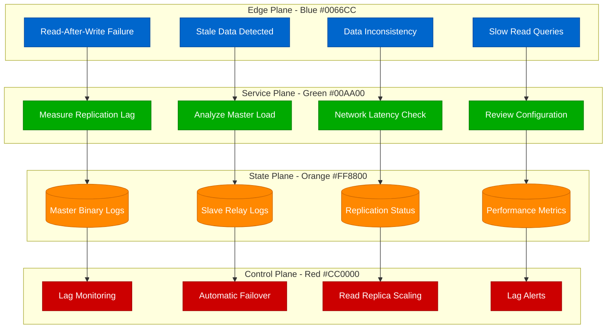
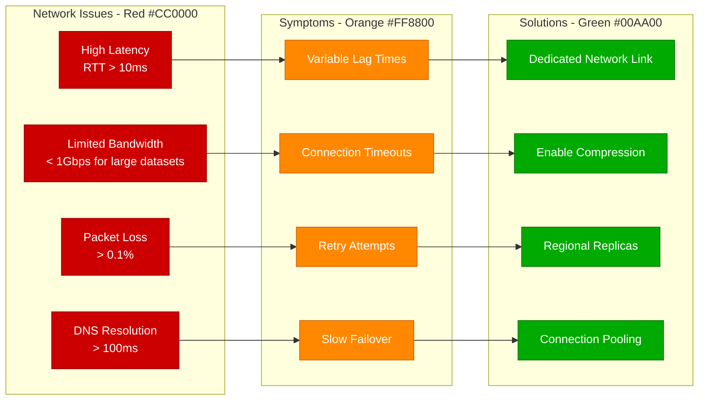
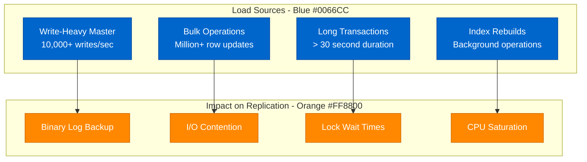
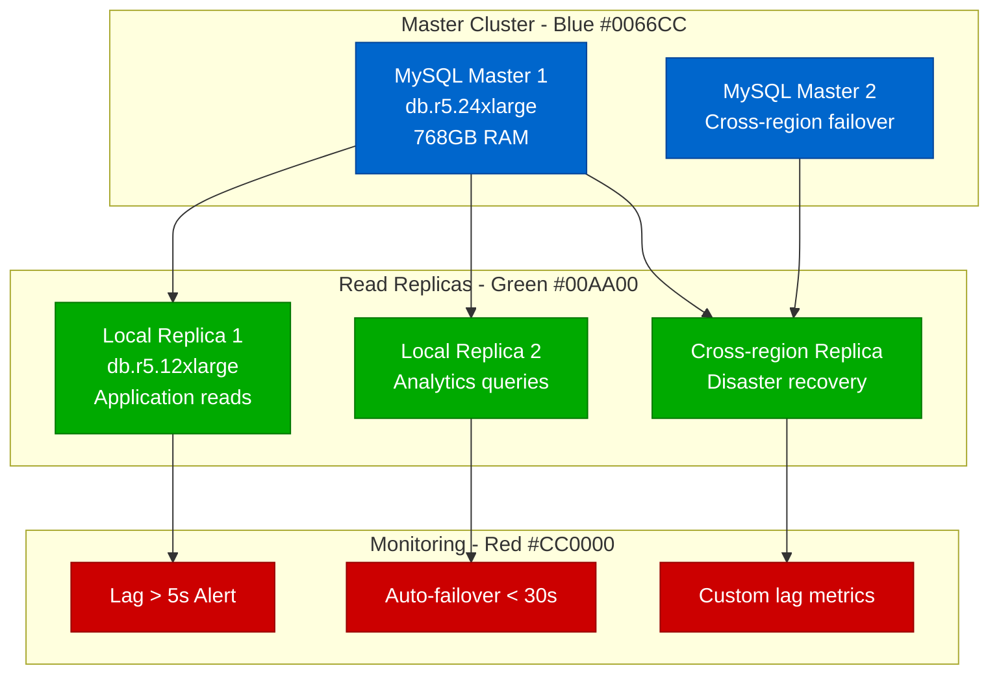

# Database Replication Lag - Production Debugging Guide

## Overview

Database replication lag can cause data inconsistency, read-after-write failures, and user experience degradation. This guide covers systematic debugging for master-slave lag in MySQL, PostgreSQL, MongoDB, and other database systems commonly used in production.

## Debugging Flowchart



## Common Replication Lag Symptoms

### 1. Read-After-Write Failures
**User Experience:**
```
User creates post → Success response
User refreshes page → Post not visible
User tries again 30s later → Post appears
```

**Detection Queries:**
```sql
-- MySQL: Check replica lag
SHOW SLAVE STATUS\G
-- Look for Seconds_Behind_Master

-- PostgreSQL: Check streaming replication lag
SELECT
    client_addr,
    client_hostname,
    client_port,
    state,
    sent_lsn,
    write_lsn,
    flush_lsn,
    replay_lsn,
    write_lag,
    flush_lag,
    replay_lag
FROM pg_stat_replication;

-- MongoDB: Check replica set lag
rs.status()
// Look for optimeDate differences
```

### 2. Data Inconsistency Between Replicas
**Symptoms:**
```bash
# Different results from master vs replica
mysql master> SELECT COUNT(*) FROM orders WHERE created_today = 1;
+----------+
| count(*) |
+----------+
|     1247 |
+----------+

mysql replica> SELECT COUNT(*) FROM orders WHERE created_today = 1;
+----------+
| count(*) |
+----------+
|     1189 |  -- 58 orders behind!
+----------+
```

## Database-Specific Debugging

### MySQL Replication Lag Analysis

**Check Current Lag:**
```sql
-- On replica server
SHOW SLAVE STATUS\G

-- Key metrics to monitor:
-- Seconds_Behind_Master: Lag in seconds
-- Slave_IO_Running: Should be 'Yes'
-- Slave_SQL_Running: Should be 'Yes'
-- Last_Error: Any replication errors
-- Relay_Log_Space: Size of relay logs
```

**Advanced Lag Investigation:**
```sql
-- Check binary log position difference
-- On master:
SHOW MASTER STATUS;
-- Record File and Position

-- On replica:
SHOW SLAVE STATUS\G
-- Compare Master_Log_File, Read_Master_Log_Pos
-- With Relay_Master_Log_File, Exec_Master_Log_Pos

-- Calculate exact lag in transactions
SELECT
    (@@global.gtid_executed) as replica_gtid,
    'MASTER_GTID_HERE' as master_gtid;

-- Check for long-running transactions on master
SELECT * FROM information_schema.INNODB_TRX
WHERE trx_started < NOW() - INTERVAL 30 SECOND;
```

**MySQL Performance Tuning:**
```sql
-- Optimize replication performance
SET GLOBAL slave_parallel_workers = 8;  -- Parallel replication
SET GLOBAL slave_parallel_type = 'LOGICAL_CLOCK';
SET GLOBAL slave_preserve_commit_order = ON;

-- Binary log optimization
SET GLOBAL sync_binlog = 1;
SET GLOBAL innodb_flush_log_at_trx_commit = 1;

-- Relay log optimization
SET GLOBAL relay_log_recovery = ON;
SET GLOBAL relay_log_purge = ON;
```

### PostgreSQL Streaming Replication

**Monitor Replication Status:**
```sql
-- On primary server
SELECT
    client_addr,
    client_hostname,
    client_port,
    state,
    sent_lsn,
    write_lsn,
    flush_lsn,
    replay_lsn,
    (extract(epoch from write_lag))::int as write_lag_seconds,
    (extract(epoch from flush_lag))::int as flush_lag_seconds,
    (extract(epoch from replay_lag))::int as replay_lag_seconds
FROM pg_stat_replication;

-- Check WAL segment lag
SELECT
    pg_wal_lsn_diff(pg_current_wal_lsn(), replay_lsn) as lag_bytes,
    pg_wal_lsn_diff(pg_current_wal_lsn(), replay_lsn) / 16777216 as lag_segments
FROM pg_stat_replication;
```

**Standby Server Analysis:**
```sql
-- On standby server
SELECT
    pg_last_wal_receive_lsn() as last_received,
    pg_last_wal_replay_lsn() as last_replayed,
    pg_wal_lsn_diff(pg_last_wal_receive_lsn(), pg_last_wal_replay_lsn()) as replay_lag_bytes;

-- Check recovery status
SELECT
    pg_is_in_recovery() as in_recovery,
    pg_last_wal_replay_timestamp() as last_replay_time,
    extract(epoch from (clock_timestamp() - pg_last_wal_replay_timestamp())) as lag_seconds;
```

**PostgreSQL Configuration Optimization:**
```bash
# postgresql.conf optimizations for replication
wal_level = replica
max_wal_senders = 10
max_replication_slots = 10
hot_standby = on
hot_standby_feedback = on

# Reduce lag with faster WAL shipping
archive_timeout = 60  # Ship WAL every 60 seconds
wal_sender_timeout = 60000  # 60 second timeout
wal_receiver_timeout = 60000

# Optimize WAL writing
wal_compression = on
wal_buffers = 16MB
checkpoint_completion_target = 0.9
```

### MongoDB Replica Set Lag

**Check Replica Set Status:**
```javascript
// Connect to replica set
rs.status()

// Check individual member lag
rs.status().members.forEach(function(member) {
    print("Member: " + member.name +
          ", State: " + member.stateStr +
          ", OptimeDate: " + member.optimeDate +
          ", Lag: " + (rs.status().members[0].optimeDate - member.optimeDate)/1000 + "s");
});

// Check oplog size and utilization
db.oplog.rs.stats()
db.runCommand("isMaster")

// Analyze slow operations
db.runCommand({profile: 2, slowms: 100})
db.system.profile.find().sort({ts: -1}).limit(5).pretty()
```

**MongoDB Optimization:**
```javascript
// Increase oplog size (requires restart)
// In mongod.conf:
// replication:
//   oplogSizeMB: 2048

// Optimize write concern for faster replication
db.runCommand({
    setDefaultRWConcern: 1,
    defaultWriteConcern: {
        w: "majority",
        j: true,
        wtimeout: 5000
    }
});

// Check write concern performance
db.runCommand({getDefaultRWConcern: 1})
```

## Root Cause Analysis Matrix

### Network-Related Lag


### Load-Related Lag


## Real Production Examples

### Instagram's MySQL Replication at Scale
**Challenge:** 1TB+ databases with millions of writes/second

**Architecture:**


**Configuration:**
```sql
-- Master optimizations
innodb_flush_log_at_trx_commit = 2  -- Faster writes, slight risk
sync_binlog = 1000  -- Batch sync for performance
binlog_format = ROW  -- Most efficient for replication
expire_logs_days = 7  -- Manage disk space

-- Replica optimizations
slave_parallel_workers = 16  -- Parallel apply
slave_parallel_type = LOGICAL_CLOCK
slave_preserve_commit_order = ON
read_only = ON  -- Prevent accidental writes
```

### GitHub's PostgreSQL Streaming Replication
**Challenge:** Code repository data with high write bursts

**Solution:**
- **Synchronous replication** for critical data (user accounts, permissions)
- **Asynchronous replication** for repository data
- **Cascading replication** to reduce master load

**Configuration:**
```bash
# postgresql.conf
synchronous_standby_names = 'replica1,replica2'
synchronous_commit = on  # For critical transactions
wal_level = replica
max_wal_senders = 10
wal_keep_segments = 1000  # Keep WAL for delayed replicas

# Custom application logic
-- Critical writes (user auth)
BEGIN;
SET synchronous_commit = on;
INSERT INTO user_sessions ...;
COMMIT;

-- Non-critical writes (repository stats)
BEGIN;
SET synchronous_commit = off;
UPDATE repository_stats ...;
COMMIT;
```

### MongoDB Replica Set at Scale (Uber)
**Challenge:** Real-time location data with global distribution

**Architecture:**
```javascript
// Replica set configuration
rs.initiate({
    _id: "location-replica-set",
    members: [
        {_id: 0, host: "mongo-us-east-1:27017", priority: 1},
        {_id: 1, host: "mongo-us-west-1:27017", priority: 0.5},
        {_id: 2, host: "mongo-eu-west-1:27017", priority: 0.5, hidden: true},
        {_id: 3, host: "mongo-asia-1:27017", priority: 0, arbiterOnly: true}
    ],
    settings: {
        getLastErrorDefaults: {w: "majority", wtimeout: 5000},
        heartbeatIntervalMillis: 2000,
        electionTimeoutMillis: 10000
    }
});

// Write concern for different data types
// Critical location updates
db.driver_locations.insertOne(
    {driverId: 123, lat: 37.7749, lng: -122.4194, timestamp: new Date()},
    {writeConcern: {w: "majority", j: true, wtimeout: 3000}}
);

// Analytics data (can tolerate lag)
db.trip_analytics.insertOne(
    {tripId: 456, metrics: {...}},
    {writeConcern: {w: 1, j: false}}
);
```

## Monitoring and Alerting

### Prometheus Metrics for Replication Lag
```yaml
# MySQL exporter metrics
mysql_slave_lag_seconds
mysql_slave_sql_running
mysql_slave_io_running

# PostgreSQL exporter metrics
pg_replication_lag_seconds
pg_stat_replication_write_lag
pg_stat_replication_flush_lag
pg_stat_replication_replay_lag

# MongoDB exporter metrics
mongodb_replset_member_replication_lag_seconds
mongodb_replset_member_health
mongodb_replset_oplog_size_bytes
```

### Production Alert Rules
```yaml
# Prometheus alerting rules
groups:
- name: database_replication
  rules:
  - alert: MySQLReplicationLagHigh
    expr: mysql_slave_lag_seconds > 30
    for: 2m
    labels:
      severity: warning
    annotations:
      summary: "MySQL replication lag is high"
      description: "Slave is {{ $value }} seconds behind master"

  - alert: PostgreSQLReplicationLagCritical
    expr: pg_replication_lag_seconds > 60
    for: 1m
    labels:
      severity: critical
    annotations:
      summary: "PostgreSQL replication lag critical"
      description: "Standby server lag: {{ $value }} seconds"

  - alert: MongoDBReplicationLagWarning
    expr: mongodb_replset_member_replication_lag_seconds > 10
    for: 3m
    labels:
      severity: warning
    annotations:
      summary: "MongoDB replica set lag detected"
      description: "Member {{ $labels.member }} lag: {{ $value }}s"

  - alert: ReplicationStopped
    expr: |
      mysql_slave_sql_running == 0 or
      mysql_slave_io_running == 0 or
      pg_stat_replication_write_lag > 300
    for: 30s
    labels:
      severity: critical
    annotations:
      summary: "Database replication stopped"
      description: "Replication has stopped on {{ $labels.instance }}"
```

### Custom Lag Monitoring Script
```python
#!/usr/bin/env python3
import pymysql
import psycopg2
import pymongo
import time
import json
from datetime import datetime

class ReplicationMonitor:
    def __init__(self, config):
        self.config = config
        self.metrics = {}

    def check_mysql_lag(self):
        """Check MySQL replication lag"""
        try:
            conn = pymysql.connect(**self.config['mysql']['replica'])
            cursor = conn.cursor()
            cursor.execute("SHOW SLAVE STATUS")
            result = cursor.fetchone()

            if result:
                lag = result[32]  # Seconds_Behind_Master
                io_running = result[10]  # Slave_IO_Running
                sql_running = result[11]  # Slave_SQL_Running

                self.metrics['mysql_lag_seconds'] = lag or 0
                self.metrics['mysql_io_running'] = io_running == 'Yes'
                self.metrics['mysql_sql_running'] = sql_running == 'Yes'

            conn.close()
        except Exception as e:
            print(f"MySQL lag check failed: {e}")
            self.metrics['mysql_lag_seconds'] = -1

    def check_postgresql_lag(self):
        """Check PostgreSQL replication lag"""
        try:
            conn = psycopg2.connect(**self.config['postgresql']['standby'])
            cursor = conn.cursor()

            cursor.execute("""
                SELECT extract(epoch from (clock_timestamp() - pg_last_wal_replay_timestamp()))
            """)
            lag = cursor.fetchone()[0]
            self.metrics['postgresql_lag_seconds'] = lag or 0

            conn.close()
        except Exception as e:
            print(f"PostgreSQL lag check failed: {e}")
            self.metrics['postgresql_lag_seconds'] = -1

    def check_mongodb_lag(self):
        """Check MongoDB replica set lag"""
        try:
            client = pymongo.MongoClient(**self.config['mongodb'])
            status = client.admin.command("replSetGetStatus")

            primary_optime = None
            max_lag = 0

            for member in status['members']:
                if member['stateStr'] == 'PRIMARY':
                    primary_optime = member['optimeDate']

            for member in status['members']:
                if member['stateStr'] == 'SECONDARY':
                    lag = (primary_optime - member['optimeDate']).total_seconds()
                    max_lag = max(max_lag, lag)

            self.metrics['mongodb_lag_seconds'] = max_lag
            client.close()
        except Exception as e:
            print(f"MongoDB lag check failed: {e}")
            self.metrics['mongodb_lag_seconds'] = -1

    def run_checks(self):
        """Run all replication lag checks"""
        self.check_mysql_lag()
        self.check_postgresql_lag()
        self.check_mongodb_lag()

        # Add timestamp
        self.metrics['timestamp'] = datetime.utcnow().isoformat()

        return self.metrics

    def alert_if_needed(self):
        """Send alerts if lag exceeds thresholds"""
        thresholds = self.config.get('thresholds', {})

        for db_type in ['mysql', 'postgresql', 'mongodb']:
            lag_key = f'{db_type}_lag_seconds'
            if lag_key in self.metrics:
                lag = self.metrics[lag_key]
                threshold = thresholds.get(db_type, 30)

                if lag > threshold and lag > 0:
                    self.send_alert(db_type, lag, threshold)

    def send_alert(self, db_type, lag, threshold):
        """Send alert to monitoring system"""
        alert = {
            'alert': f'{db_type}_replication_lag',
            'severity': 'warning' if lag < threshold * 2 else 'critical',
            'message': f'{db_type} replication lag: {lag:.1f}s (threshold: {threshold}s)',
            'timestamp': datetime.utcnow().isoformat()
        }
        print(f"ALERT: {json.dumps(alert)}")
        # Integration with your alerting system (PagerDuty, Slack, etc.)

if __name__ == "__main__":
    config = {
        'mysql': {
            'replica': {
                'host': 'mysql-replica.internal',
                'user': 'monitor',
                'password': 'password',
                'database': 'information_schema'
            }
        },
        'postgresql': {
            'standby': {
                'host': 'postgres-standby.internal',
                'user': 'monitor',
                'password': 'password',
                'database': 'postgres'
            }
        },
        'mongodb': {
            'host': 'mongo-replica.internal',
            'port': 27017,
            'username': 'monitor',
            'password': 'password'
        },
        'thresholds': {
            'mysql': 30,      # 30 seconds
            'postgresql': 15,  # 15 seconds
            'mongodb': 10      # 10 seconds
        }
    }

    monitor = ReplicationMonitor(config)

    while True:
        metrics = monitor.run_checks()
        monitor.alert_if_needed()

        print(f"Replication status: {json.dumps(metrics, indent=2)}")
        time.sleep(60)  # Check every minute
```

## Prevention and Best Practices

### 1. Proactive Lag Prevention
```bash
# Automated replica scaling based on lag
#!/bin/bash
MYSQL_LAG_THRESHOLD=10
CURRENT_LAG=$(mysql -e "SHOW SLAVE STATUS\G" | grep "Seconds_Behind_Master" | awk '{print $2}')

if [ "$CURRENT_LAG" -gt "$MYSQL_LAG_THRESHOLD" ]; then
    echo "Lag detected: ${CURRENT_LAG}s. Adding read replica..."
    # Trigger auto-scaling or alert operations team
    aws rds create-db-instance-read-replica \
        --db-instance-identifier "emergency-replica-$(date +%s)" \
        --source-db-instance-identifier "production-master"
fi
```

### 2. Application-Level Lag Handling
```python
# Python application with lag-aware routing
import time
import random
from datetime import datetime, timedelta

class LagAwareRouter:
    def __init__(self, master_conn, replica_conns, max_lag_seconds=5):
        self.master = master_conn
        self.replicas = replica_conns
        self.max_lag_seconds = max_lag_seconds
        self.recent_writes = {}  # Track recent writes by user/session

    def write(self, user_id, query, params):
        """Execute write on master and track timing"""
        result = self.master.execute(query, params)
        self.recent_writes[user_id] = datetime.utcnow()
        return result

    def read(self, user_id, query, params, force_master=False):
        """Execute read with lag-aware routing"""
        # Check if user has recent writes
        if user_id in self.recent_writes:
            write_time = self.recent_writes[user_id]
            time_since_write = (datetime.utcnow() - write_time).total_seconds()

            # Force master read for recent writes
            if time_since_write < self.max_lag_seconds or force_master:
                return self.master.execute(query, params)
            else:
                # Clean up old entries
                del self.recent_writes[user_id]

        # Route to healthy replica
        healthy_replicas = self.get_healthy_replicas()
        if healthy_replicas:
            replica = random.choice(healthy_replicas)
            return replica.execute(query, params)
        else:
            # Fallback to master if no healthy replicas
            return self.master.execute(query, params)

    def get_healthy_replicas(self):
        """Return replicas with acceptable lag"""
        healthy = []
        for replica in self.replicas:
            lag = self.check_replica_lag(replica)
            if lag < self.max_lag_seconds:
                healthy.append(replica)
        return healthy

    def check_replica_lag(self, replica):
        """Check individual replica lag"""
        try:
            result = replica.execute("SHOW SLAVE STATUS")
            return result.get('Seconds_Behind_Master', 0) or 0
        except:
            return float('inf')  # Treat errors as infinite lag
```

This comprehensive database replication lag debugging guide provides systematic approaches to identifying, analyzing, and resolving replication issues across different database systems in production environments.