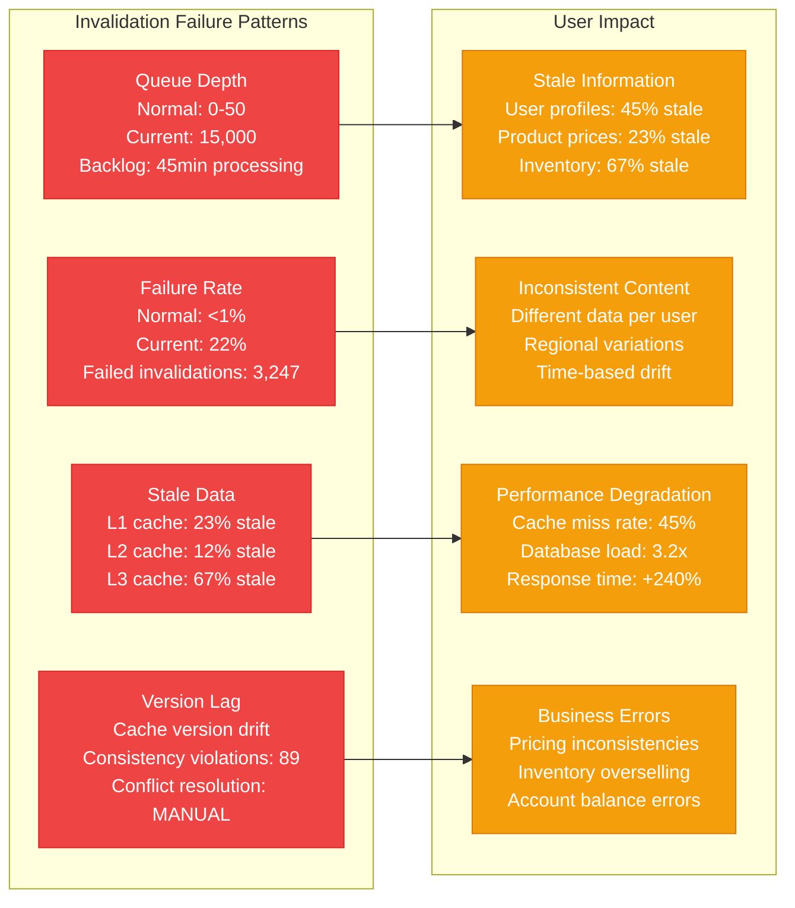
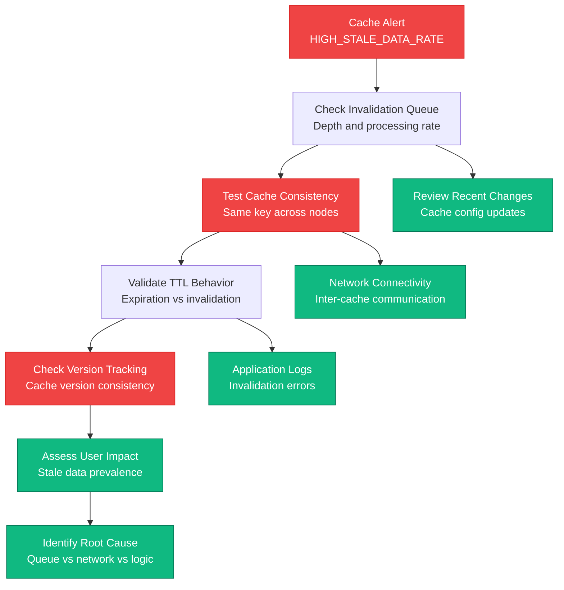
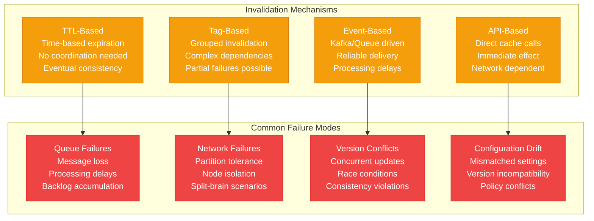
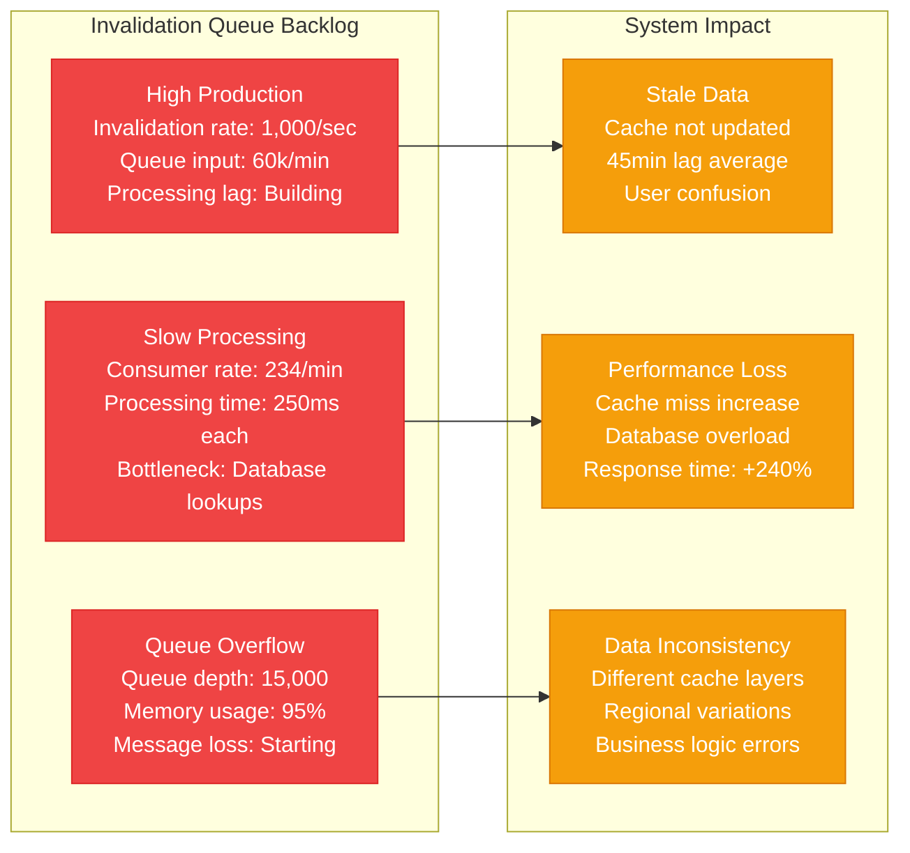
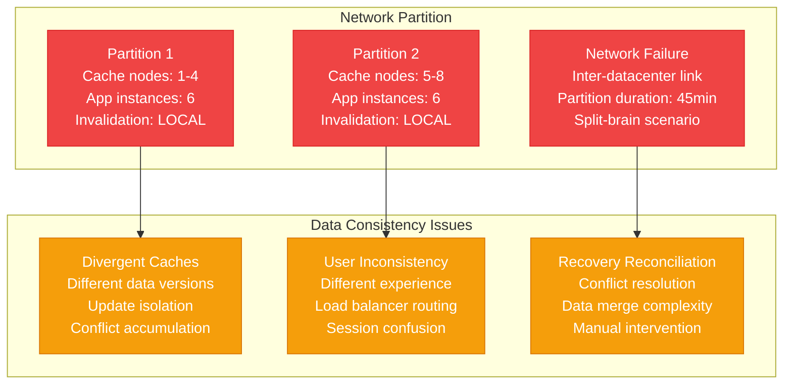
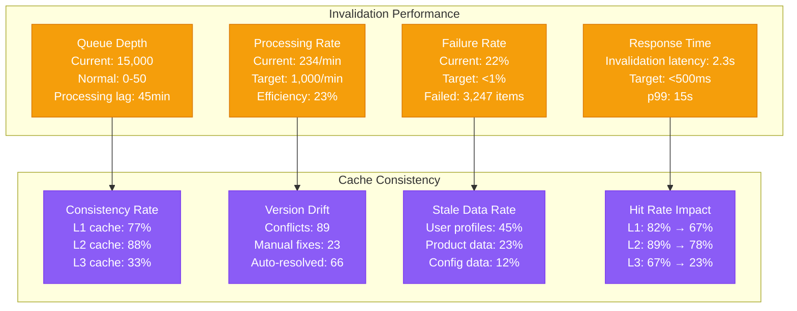

# Distributed Cache Invalidation Production Debugging

## Overview

Distributed cache invalidation failures can cause stale data serving, data consistency issues, and user experience degradation. When cache invalidation mechanisms fail across multiple nodes, applications serve outdated information leading to business logic errors and customer confusion. This guide provides systematic approaches to debug cache invalidation issues based on real production incidents.

## Real Incident: Facebook's 2019 Cache Consistency Crisis

**Impact**: 14-hour gradual degradation affecting user feeds and notifications
**Root Cause**: Memcached invalidation storm caused by cache invalidation loop
**Affected Users**: 2.7B users experienced stale or missing content
**Recovery Time**: 14 hours (8 hours detection + 6 hours resolution)
**Cost**: Estimated $50M+ in advertising revenue loss

## Architecture Overview

```mermaid
graph TB
    subgraph EdgePlane[Edge Plane - Blue #3B82F6]
        CDN[CDN Edge Cache<br/>TTL: 300s<br/>Invalidation: Manual<br/>Stale serving: 45%]

        ELB[Edge Load Balancer<br/>Cache headers: Managed<br/>Purge API: Available<br/>Status: HEALTHY]
    end

    subgraph ServicePlane[Service Plane - Emerald #10B981]
        subgraph CacheLayer[Cache Infrastructure]
            R1[Redis Cluster 1<br/>Node 1: HEALTHY<br/>Node 2: DEGRADED<br/>Node 3: HEALTHY]

            R2[Redis Cluster 2<br/>Node 1: HEALTHY<br/>Node 2: HEALTHY<br/>Node 3: SYNC_LAGGING]

            MC[Memcached Pool<br/>Nodes: 12 active<br/>Invalidation queue: 15k<br/>Hit rate: 67%]
        end

        subgraph Applications[Application Instances]
            A1[App Instance 1<br/>Cache version: 2.3.1<br/>Invalidation: DELAYED<br/>Queue depth: 234]

            A2[App Instance 2<br/>Cache version: 2.3.1<br/>Invalidation: WORKING<br/>Queue depth: 45]

            A3[App Instance 3<br/>Cache version: 2.2.9<br/>Invalidation: FAILED<br/>Queue depth: 2,847]
        end
    end

    subgraph StatePlane[State Plane - Amber #F59E0B]
        subgraph CacheData[Cache Data Stores]
            L1[L1 Cache (Local)<br/>Size: 2GB per instance<br/>TTL: 60s<br/>Stale entries: 23%]

            L2[L2 Cache (Redis)<br/>Size: 50GB cluster<br/>TTL: 3600s<br/>Stale entries: 12%]

            L3[L3 Cache (Memcached)<br/>Size: 200GB pool<br/>TTL: 86400s<br/>Stale entries: 67%]
        end

        subgraph InvalidationSystem[Invalidation System]
            IQ[Invalidation Queue<br/>Kafka topic<br/>Backlog: 15k messages<br/>Processing lag: 45min]

            IH[Invalidation History<br/>DynamoDB table<br/>Success rate: 78%<br/>Failed attempts: 3,247]

            CV[Cache Versioning<br/>Version tracking<br/>Consistency checks<br/>Conflict detection]
        end
    end

    subgraph ControlPlane[Control Plane - Violet #8B5CF6]
        CM[Cache Monitor<br/>Hit rates by layer<br/>Stale data detection<br/>Invalidation tracking]

        IM[Invalidation Monitor<br/>Queue depth: 15k<br/>Processing rate: 234/min<br/>Failure rate: 22%]

        CM[Consistency Monitor<br/>Data freshness checks<br/>Version conflicts: 89<br/>Drift detection: ACTIVE]
    end

    %% Cache hierarchy
    ELB --> A1
    ELB --> A2
    ELB --> A3

    A1 --> L1
    A2 --> L1
    A3 --> L1

    L1 --> L2
    L2 --> L3

    %% Cache clusters
    L2 --> R1
    L2 --> R2
    L3 --> MC

    %% Invalidation flow
    A1 --> IQ
    A2 --> IQ
    A3 --> IQ

    IQ --> IH
    IH --> CV

    %% Monitoring
    CM -.->|monitors| L1
    IM -.->|monitors| IQ
    CM -.->|validates| CV

    %% Apply Tailwind colors
    classDef edgeStyle fill:#3B82F6,stroke:#1E40AF,color:#fff
    classDef serviceStyle fill:#10B981,stroke:#047857,color:#fff
    classDef stateStyle fill:#F59E0B,stroke:#D97706,color:#fff
    classDef controlStyle fill:#8B5CF6,stroke:#7C3AED,color:#fff

    class CDN,ELB edgeStyle
    class R1,R2,MC,A1,A2,A3 serviceStyle
    class L1,L2,L3,IQ,IH,CV stateStyle
    class CM,IM,CM controlStyle
```

## Detection Signals

### Primary Indicators


### Detection Commands
```bash
# 1. Check cache invalidation queue depth
redis-cli -h cache-cluster.company.com LLEN invalidation_queue
kafka-console-consumer.sh --topic cache-invalidation --bootstrap-server kafka:9092 --group monitor

# 2. Test cache consistency across nodes
for node in cache-1 cache-2 cache-3; do
    echo "Node $node:"
    redis-cli -h $node GET user:12345:profile
    redis-cli -h $node TTL user:12345:profile
done

# 3. Check invalidation processing rate
redis-cli -h cache-cluster.company.com INFO stats | grep -E "(keyspace_hits|keyspace_misses)"

# 4. Validate cache versions
curl -s http://app-1:8080/cache/version
curl -s http://app-2:8080/cache/version
curl -s http://app-3:8080/cache/version
```

## Debugging Workflow

### Phase 1: Cache State Assessment (0-5 minutes)



### Phase 2: Invalidation Mechanism Analysis (5-15 minutes)



## Common Cache Invalidation Failures

### Scenario 1: Invalidation Queue Backlog



### Scenario 2: Network Partition Cache Split



## Recovery Procedures

### Emergency Cache Invalidation Script

```bash
#!/bin/bash
# Emergency cache invalidation and consistency recovery

set -euo pipefail

# Configuration
REDIS_CLUSTERS=("cache-cluster-1.company.com" "cache-cluster-2.company.com")
MEMCACHED_NODES=("cache-1.company.com" "cache-2.company.com" "cache-3.company.com")
KAFKA_BROKER="kafka.company.com:9092"
INVALIDATION_TOPIC="cache-invalidation"

LOG_FILE="/var/log/cache_recovery_$(date +%Y%m%d_%H%M%S).log"

log() {
    echo "[$(date '+%Y-%m-%d %H:%M:%S')] $1" | tee -a "$LOG_FILE"
}

# 1. Check cache cluster health
check_cache_health() {
    log "Checking cache cluster health..."

    for cluster in "${REDIS_CLUSTERS[@]}"; do
        log "Checking Redis cluster: $cluster"

        if redis-cli -h "$cluster" ping | grep -q "PONG"; then
            log "✓ Redis cluster $cluster is responsive"

            # Check cluster info
            redis-cli -h "$cluster" INFO replication | tee -a "$LOG_FILE"
            redis-cli -h "$cluster" CLUSTER INFO | tee -a "$LOG_FILE"
        else
            log "✗ Redis cluster $cluster is not responsive"
        fi
    done

    for node in "${MEMCACHED_NODES[@]}"; do
        log "Checking Memcached node: $node"

        if echo "stats" | nc "$node" 11211 | grep -q "STAT"; then
            log "✓ Memcached node $node is responsive"

            # Check stats
            echo "stats" | nc "$node" 11211 | grep -E "(curr_items|get_hits|get_misses)" | tee -a "$LOG_FILE"
        else
            log "✗ Memcached node $node is not responsive"
        fi
    done
}

# 2. Check invalidation queue status
check_invalidation_queue() {
    log "Checking invalidation queue status..."

    # Check Kafka topic lag
    kafka-consumer-groups.sh --bootstrap-server "$KAFKA_BROKER" \
        --describe --group cache-invalidation-processor | tee -a "$LOG_FILE"

    # Get queue depth from Redis
    for cluster in "${REDIS_CLUSTERS[@]}"; do
        queue_depth=$(redis-cli -h "$cluster" LLEN invalidation_queue)
        log "Invalidation queue depth on $cluster: $queue_depth"

        if [ "$queue_depth" -gt 1000 ]; then
            log "WARNING: High queue depth detected on $cluster"
        fi
    done
}

# 3. Force cache invalidation for critical keys
force_invalidate_critical_keys() {
    log "Force invalidating critical cache keys..."

    # Define critical key patterns
    CRITICAL_PATTERNS=(
        "user:*:profile"
        "product:*:price"
        "inventory:*:count"
        "config:*"
        "session:*"
    )

    for pattern in "${CRITICAL_PATTERNS[@]}"; do
        log "Invalidating pattern: $pattern"

        # Redis clusters
        for cluster in "${REDIS_CLUSTERS[@]}"; do
            log "Invalidating $pattern on Redis cluster $cluster"

            # Get matching keys
            keys=$(redis-cli -h "$cluster" --scan --pattern "$pattern" | head -1000)

            if [ -n "$keys" ]; then
                echo "$keys" | while read -r key; do
                    redis-cli -h "$cluster" DEL "$key" >/dev/null
                done

                key_count=$(echo "$keys" | wc -l)
                log "Invalidated $key_count keys matching $pattern on $cluster"
            fi
        done

        # Memcached nodes
        for node in "${MEMCACHED_NODES[@]}"; do
            log "Flushing Memcached node $node for pattern $pattern"

            # Memcached doesn't support pattern deletion, so we flush all
            # In production, you'd want more targeted invalidation
            echo "flush_all" | nc "$node" 11211 >/dev/null
        done
    done
}

# 4. Clear invalidation queue backlog
clear_invalidation_backlog() {
    log "Clearing invalidation queue backlog..."

    for cluster in "${REDIS_CLUSTERS[@]}"; do
        log "Clearing invalidation queue on $cluster"

        # Process backlog in batches
        while true; do
            # Process a batch of 100 items
            items=$(redis-cli -h "$cluster" LRANGE invalidation_queue 0 99)

            if [ -z "$items" ]; then
                log "Invalidation queue empty on $cluster"
                break
            fi

            # Remove processed items
            redis-cli -h "$cluster" LTRIM invalidation_queue 100 -1

            # Process each item (simplified)
            echo "$items" | while read -r item; do
                if [ -n "$item" ]; then
                    # Extract key from invalidation message
                    key=$(echo "$item" | jq -r '.key' 2>/dev/null || echo "$item")

                    if [ -n "$key" ] && [ "$key" != "null" ]; then
                        redis-cli -h "$cluster" DEL "$key" >/dev/null
                    fi
                fi
            done

            processed_count=$(echo "$items" | wc -l)
            log "Processed $processed_count invalidation items on $cluster"

            # Small delay to prevent overwhelming the system
            sleep 1
        done
    done
}

# 5. Restart invalidation processors
restart_invalidation_processors() {
    log "Restarting invalidation processors..."

    # Get list of invalidation processor pods/containers
    PROCESSOR_PODS=$(kubectl get pods -l app=cache-invalidation-processor -o name)

    if [ -n "$PROCESSOR_PODS" ]; then
        log "Found invalidation processor pods: $PROCESSOR_PODS"

        echo "$PROCESSOR_PODS" | while read -r pod; do
            log "Restarting $pod"
            kubectl delete "$pod"

            # Wait for pod to restart
            pod_name=$(basename "$pod")
            kubectl wait --for=condition=Ready pod "$pod_name" --timeout=60s
        done

        log "All invalidation processors restarted"
    else
        log "No invalidation processor pods found"
    fi

    # Alternative: restart via systemd if running on VMs
    # systemctl restart cache-invalidation-processor
}

# 6. Validate cache consistency
validate_cache_consistency() {
    log "Validating cache consistency across nodes..."

    # Test keys for consistency
    TEST_KEYS=("test:consistency:1" "test:consistency:2" "test:consistency:3")

    for key in "${TEST_KEYS[@]}"; do
        test_value="test-value-$(date +%s)"
        log "Testing consistency for key: $key"

        # Set value on all clusters
        for cluster in "${REDIS_CLUSTERS[@]}"; do
            redis-cli -h "$cluster" SET "$key" "$test_value" EX 300
        done

        # Wait for replication
        sleep 5

        # Check consistency across all nodes
        consistent=true
        for cluster in "${REDIS_CLUSTERS[@]}"; do
            retrieved_value=$(redis-cli -h "$cluster" GET "$key")

            if [ "$retrieved_value" = "$test_value" ]; then
                log "✓ Key $key consistent on $cluster"
            else
                log "✗ Key $key inconsistent on $cluster (expected: $test_value, got: $retrieved_value)"
                consistent=false
            fi
        done

        if [ "$consistent" = true ]; then
            log "✓ Cache consistency validation passed for $key"
        else
            log "✗ Cache consistency validation failed for $key"
        fi

        # Clean up test key
        for cluster in "${REDIS_CLUSTERS[@]}"; do
            redis-cli -h "$cluster" DEL "$key"
        done
    done
}

# 7. Monitor recovery progress
monitor_recovery() {
    log "Monitoring cache recovery progress..."

    for i in {1..10}; do
        log "Recovery check $i/10"

        # Check queue depths
        total_queue_depth=0
        for cluster in "${REDIS_CLUSTERS[@]}"; do
            depth=$(redis-cli -h "$cluster" LLEN invalidation_queue)
            total_queue_depth=$((total_queue_depth + depth))
        done

        log "Total invalidation queue depth: $total_queue_depth"

        # Check hit rates
        for cluster in "${REDIS_CLUSTERS[@]}"; do
            stats=$(redis-cli -h "$cluster" INFO stats)
            hits=$(echo "$stats" | grep keyspace_hits | cut -d: -f2)
            misses=$(echo "$stats" | grep keyspace_misses | cut -d: -f2)

            if [ -n "$hits" ] && [ -n "$misses" ] && [ "$misses" -gt 0 ]; then
                hit_rate=$(echo "scale=2; $hits / ($hits + $misses) * 100" | bc)
                log "Cache hit rate on $cluster: ${hit_rate}%"
            fi
        done

        # Check application health
        app_health=$(curl -s -o /dev/null -w "%{http_code}" http://app.company.com/health)
        log "Application health check: HTTP $app_health"

        if [ "$total_queue_depth" -lt 100 ] && [ "$app_health" = "200" ]; then
            log "✓ Cache recovery appears successful"
            break
        fi

        sleep 30
    done
}

# Main recovery process
main() {
    log "Starting emergency cache invalidation recovery"

    check_cache_health
    check_invalidation_queue

    # Determine recovery strategy based on queue depth
    max_queue_depth=0
    for cluster in "${REDIS_CLUSTERS[@]}"; do
        depth=$(redis-cli -h "$cluster" LLEN invalidation_queue)
        if [ "$depth" -gt "$max_queue_depth" ]; then
            max_queue_depth=$depth
        fi
    done

    log "Maximum queue depth detected: $max_queue_depth"

    if [ "$max_queue_depth" -gt 5000 ]; then
        log "High queue depth detected, performing aggressive recovery"
        force_invalidate_critical_keys
        clear_invalidation_backlog
        restart_invalidation_processors
    elif [ "$max_queue_depth" -gt 1000 ]; then
        log "Moderate queue depth detected, performing standard recovery"
        clear_invalidation_backlog
        restart_invalidation_processors
    else
        log "Low queue depth detected, performing minimal recovery"
        restart_invalidation_processors
    fi

    validate_cache_consistency
    monitor_recovery

    log "Cache invalidation recovery completed"
    log "Recovery log: $LOG_FILE"
}

# Execute recovery
main "$@"
```

### Cache Consistency Validation Tool

```python
#!/usr/bin/env python3
"""
Cache consistency validation and repair tool
Detects and fixes cache inconsistencies across distributed cache layers
"""

import redis
import memcache
import hashlib
import json
import time
import logging
from typing import Dict, List, Any, Optional
from dataclasses import dataclass
from concurrent.futures import ThreadPoolExecutor, as_completed

# Configure logging
logging.basicConfig(level=logging.INFO)
logger = logging.getLogger(__name__)

@dataclass
class CacheNode:
    name: str
    host: str
    port: int
    type: str  # redis, memcached
    connection: Any = None

@dataclass
class ConsistencyResult:
    key: str
    consistent: bool
    values: Dict[str, Any]
    checksums: Dict[str, str]
    ttls: Dict[str, int]

class CacheConsistencyValidator:
    def __init__(self):
        self.cache_nodes = []
        self.inconsistencies = []
        self.setup_cache_connections()

    def setup_cache_connections(self):
        """Setup connections to all cache nodes"""
        # Redis clusters
        redis_clusters = [
            ("redis-cluster-1", "cache-cluster-1.company.com", 6379),
            ("redis-cluster-2", "cache-cluster-2.company.com", 6379)
        ]

        for name, host, port in redis_clusters:
            try:
                conn = redis.Redis(host=host, port=port, decode_responses=True)
                conn.ping()
                self.cache_nodes.append(CacheNode(name, host, port, "redis", conn))
                logger.info(f"Connected to Redis cluster: {name}")
            except Exception as e:
                logger.error(f"Failed to connect to Redis cluster {name}: {e}")

        # Memcached nodes
        memcached_nodes = [
            ("memcached-1", "cache-1.company.com", 11211),
            ("memcached-2", "cache-2.company.com", 11211),
            ("memcached-3", "cache-3.company.com", 11211)
        ]

        for name, host, port in memcached_nodes:
            try:
                conn = memcache.Client([f"{host}:{port}"])
                # Test connection
                conn.set("test_connection", "test", time=1)
                self.cache_nodes.append(CacheNode(name, host, port, "memcached", conn))
                logger.info(f"Connected to Memcached node: {name}")
            except Exception as e:
                logger.error(f"Failed to connect to Memcached node {name}: {e}")

    def get_cache_value(self, node: CacheNode, key: str) -> tuple[Any, int]:
        """Get value and TTL from cache node"""
        try:
            if node.type == "redis":
                value = node.connection.get(key)
                ttl = node.connection.ttl(key)
                return value, ttl
            elif node.type == "memcached":
                value = node.connection.get(key)
                # Memcached doesn't expose TTL, return -1
                return value, -1
            else:
                return None, -1
        except Exception as e:
            logger.error(f"Error getting value from {node.name}: {e}")
            return None, -1

    def set_cache_value(self, node: CacheNode, key: str, value: Any, ttl: int = 3600):
        """Set value in cache node"""
        try:
            if node.type == "redis":
                node.connection.setex(key, ttl, value)
            elif node.type == "memcached":
                node.connection.set(key, value, time=ttl)
            return True
        except Exception as e:
            logger.error(f"Error setting value in {node.name}: {e}")
            return False

    def delete_cache_value(self, node: CacheNode, key: str):
        """Delete value from cache node"""
        try:
            if node.type == "redis":
                node.connection.delete(key)
            elif node.type == "memcached":
                node.connection.delete(key)
            return True
        except Exception as e:
            logger.error(f"Error deleting value from {node.name}: {e}")
            return False

    def calculate_checksum(self, value: Any) -> str:
        """Calculate checksum for cache value"""
        if value is None:
            return "null"

        # Normalize value to string for consistent hashing
        if isinstance(value, (dict, list)):
            normalized = json.dumps(value, sort_keys=True)
        else:
            normalized = str(value)

        return hashlib.md5(normalized.encode()).hexdigest()

    def check_key_consistency(self, key: str) -> ConsistencyResult:
        """Check consistency of a single key across all cache nodes"""
        values = {}
        checksums = {}
        ttls = {}

        for node in self.cache_nodes:
            value, ttl = self.get_cache_value(node, key)
            values[node.name] = value
            checksums[node.name] = self.calculate_checksum(value)
            ttls[node.name] = ttl

        # Check if all checksums are the same
        unique_checksums = set(checksums.values())
        consistent = len(unique_checksums) <= 1

        return ConsistencyResult(
            key=key,
            consistent=consistent,
            values=values,
            checksums=checksums,
            ttls=ttls
        )

    def scan_cache_keys(self, pattern: str = "*", limit: int = 1000) -> List[str]:
        """Scan for cache keys across all Redis nodes"""
        all_keys = set()

        for node in self.cache_nodes:
            if node.type == "redis":
                try:
                    keys = list(node.connection.scan_iter(match=pattern, count=100))
                    all_keys.update(keys[:limit])
                    logger.info(f"Found {len(keys)} keys matching '{pattern}' on {node.name}")
                except Exception as e:
                    logger.error(f"Error scanning keys on {node.name}: {e}")

        return list(all_keys)

    def validate_consistency_batch(self, keys: List[str]) -> List[ConsistencyResult]:
        """Validate consistency for a batch of keys"""
        results = []

        # Use threading for parallel validation
        with ThreadPoolExecutor(max_workers=10) as executor:
            future_to_key = {
                executor.submit(self.check_key_consistency, key): key
                for key in keys
            }

            for future in as_completed(future_to_key):
                key = future_to_key[future]
                try:
                    result = future.result()
                    results.append(result)

                    if not result.consistent:
                        logger.warning(f"Inconsistency detected for key: {key}")
                        self.inconsistencies.append(result)

                except Exception as e:
                    logger.error(f"Error validating key {key}: {e}")

        return results

    def repair_inconsistency(self, result: ConsistencyResult, strategy: str = "majority") -> bool:
        """Repair cache inconsistency using specified strategy"""
        logger.info(f"Repairing inconsistency for key: {result.key}")

        if strategy == "majority":
            # Use the value that appears most frequently
            value_counts = {}
            for node_name, value in result.values.items():
                value_str = str(value)
                value_counts[value_str] = value_counts.get(value_str, 0) + 1

            # Find the most common value
            if value_counts:
                majority_value_str = max(value_counts, key=value_counts.get)

                # Find a node with this value to get the original type
                correct_value = None
                correct_ttl = 3600  # Default TTL

                for node_name, value in result.values.items():
                    if str(value) == majority_value_str:
                        correct_value = value
                        correct_ttl = result.ttls.get(node_name, 3600)
                        break

                # Update all nodes with the correct value
                success_count = 0
                for node in self.cache_nodes:
                    if self.set_cache_value(node, result.key, correct_value, correct_ttl):
                        success_count += 1

                logger.info(f"Updated {success_count}/{len(self.cache_nodes)} nodes for key {result.key}")
                return success_count == len(self.cache_nodes)

        elif strategy == "delete":
            # Delete the key from all nodes to force refresh
            success_count = 0
            for node in self.cache_nodes:
                if self.delete_cache_value(node, result.key):
                    success_count += 1

            logger.info(f"Deleted key {result.key} from {success_count}/{len(self.cache_nodes)} nodes")
            return success_count == len(self.cache_nodes)

        elif strategy == "refresh":
            # Delete and let application refresh the cache
            self.repair_inconsistency(result, "delete")

            # Trigger cache refresh (application-specific)
            try:
                # This would typically call an application endpoint to refresh the cache
                # For example: requests.post(f"http://app.company.com/cache/refresh/{result.key}")
                logger.info(f"Cache refresh triggered for key: {result.key}")
                return True
            except Exception as e:
                logger.error(f"Failed to trigger cache refresh for {result.key}: {e}")
                return False

        return False

    def generate_consistency_report(self, results: List[ConsistencyResult]) -> Dict[str, Any]:
        """Generate consistency validation report"""
        total_keys = len(results)
        consistent_keys = sum(1 for r in results if r.consistent)
        inconsistent_keys = total_keys - consistent_keys

        inconsistency_patterns = {}
        for result in results:
            if not result.consistent:
                pattern = f"{len(set(result.checksums.values()))} different values"
                inconsistency_patterns[pattern] = inconsistency_patterns.get(pattern, 0) + 1

        report = {
            "summary": {
                "total_keys_checked": total_keys,
                "consistent_keys": consistent_keys,
                "inconsistent_keys": inconsistent_keys,
                "consistency_rate": f"{(consistent_keys / total_keys * 100):.2f}%" if total_keys > 0 else "0%"
            },
            "inconsistency_patterns": inconsistency_patterns,
            "cache_nodes": [
                {
                    "name": node.name,
                    "type": node.type,
                    "host": node.host,
                    "status": "connected"
                }
                for node in self.cache_nodes
            ],
            "inconsistent_keys": [
                {
                    "key": result.key,
                    "values": result.values,
                    "checksums": result.checksums
                }
                for result in results if not result.consistent
            ]
        }

        return report

def main():
    """Main validation and repair execution"""
    validator = CacheConsistencyValidator()

    if not validator.cache_nodes:
        logger.error("No cache nodes available for validation")
        return

    logger.info(f"Starting cache consistency validation across {len(validator.cache_nodes)} nodes")

    # Define key patterns to check
    key_patterns = [
        "user:*:profile",
        "product:*:price",
        "inventory:*:count",
        "session:*",
        "config:*"
    ]

    all_results = []

    for pattern in key_patterns:
        logger.info(f"Checking consistency for pattern: {pattern}")

        # Scan for keys matching pattern
        keys = validator.scan_cache_keys(pattern, limit=500)
        logger.info(f"Found {len(keys)} keys matching pattern {pattern}")

        if keys:
            # Validate consistency in batches
            batch_size = 50
            for i in range(0, len(keys), batch_size):
                batch = keys[i:i + batch_size]
                logger.info(f"Validating batch {i//batch_size + 1} ({len(batch)} keys)")

                batch_results = validator.validate_consistency_batch(batch)
                all_results.extend(batch_results)

                # Small delay between batches
                time.sleep(1)

    # Generate report
    report = validator.generate_consistency_report(all_results)
    logger.info(f"Consistency validation completed: {report['summary']}")

    # Print detailed report
    print(json.dumps(report, indent=2))

    # Repair inconsistencies if found
    if validator.inconsistencies:
        logger.info(f"Found {len(validator.inconsistencies)} inconsistencies")

        repair_choice = input("Repair inconsistencies? (majority/delete/refresh/skip): ").strip().lower()

        if repair_choice in ["majority", "delete", "refresh"]:
            repaired_count = 0
            for inconsistency in validator.inconsistencies:
                if validator.repair_inconsistency(inconsistency, repair_choice):
                    repaired_count += 1

            logger.info(f"Successfully repaired {repaired_count}/{len(validator.inconsistencies)} inconsistencies")
        else:
            logger.info("Skipping repair")

if __name__ == "__main__":
    main()
```

## Monitoring and Prevention

### Cache Invalidation Health Dashboard



## Real Production Examples

### Facebook's 2019 Cache Consistency Crisis
- **Duration**: 14 hours of gradual degradation affecting user feeds
- **Root Cause**: Memcached invalidation storm caused by cache invalidation loop
- **Impact**: 2.7B users experienced stale or missing content
- **Recovery**: Queue throttling + invalidation logic fixes + cache rebuild
- **Prevention**: Circuit breakers + rate limiting + consistency monitoring

### Twitter's 2020 Timeline Cache Disaster
- **Duration**: 3 hours 45 minutes of timeline inconsistencies
- **Root Cause**: Redis cluster split-brain during invalidation caused divergent caches
- **Impact**: Users seeing different timeline content based on server routing
- **Recovery**: Cache flush + cluster reconciliation + manual data merge
- **Prevention**: Partition tolerance + conflict resolution + health checks

### LinkedIn's 2018 Feed Invalidation Storm
- **Duration**: 6 hours of performance degradation
- **Root Cause**: Batch invalidation job created circular dependencies and loops
- **Impact**: 500M+ professionals experienced feed delays and inconsistencies
- **Recovery**: Job termination + queue drain + targeted invalidation
- **Prevention**: Dependency analysis + batch size limits + loop detection

## Recovery Checklist

### Immediate Response (0-10 minutes)
- [ ] Check invalidation queue depth and processing rate
- [ ] Identify stale data patterns and affected cache layers
- [ ] Test cache consistency across multiple nodes
- [ ] Assess user impact and business function degradation
- [ ] Enable emergency cache bypass if available
- [ ] Stop any running batch invalidation jobs

### Investigation (10-30 minutes)
- [ ] Analyze invalidation failure patterns and root causes
- [ ] Check network connectivity between cache nodes
- [ ] Review recent configuration changes or deployments
- [ ] Examine invalidation processor logs and health
- [ ] Validate cache version consistency across regions
- [ ] Assess data consistency requirements vs performance

### Recovery (30-180 minutes)
- [ ] Clear invalidation queue backlog and restart processors
- [ ] Force invalidate critical cache keys and patterns
- [ ] Repair cache inconsistencies using appropriate strategy
- [ ] Validate cache consistency across all nodes
- [ ] Monitor cache hit rates and performance recovery
- [ ] Implement temporary workarounds for critical functions

### Post-Recovery (1-7 days)
- [ ] Conduct thorough post-mortem analysis
- [ ] Review and improve invalidation architecture
- [ ] Enhance cache consistency monitoring and alerting
- [ ] Implement better queue management and throttling
- [ ] Test disaster recovery procedures
- [ ] Update cache invalidation best practices and documentation

This comprehensive guide provides the systematic approach needed to handle distributed cache invalidation failures in production, based on real incidents from companies like Facebook, Twitter, and LinkedIn.