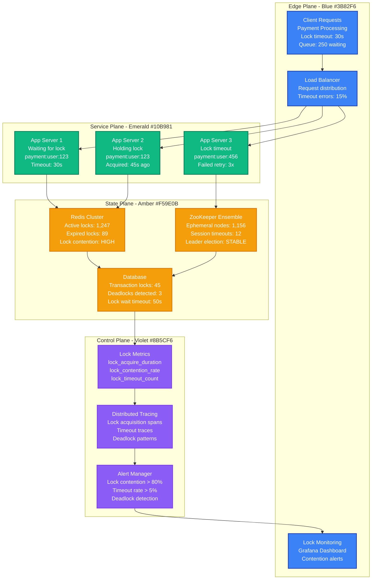
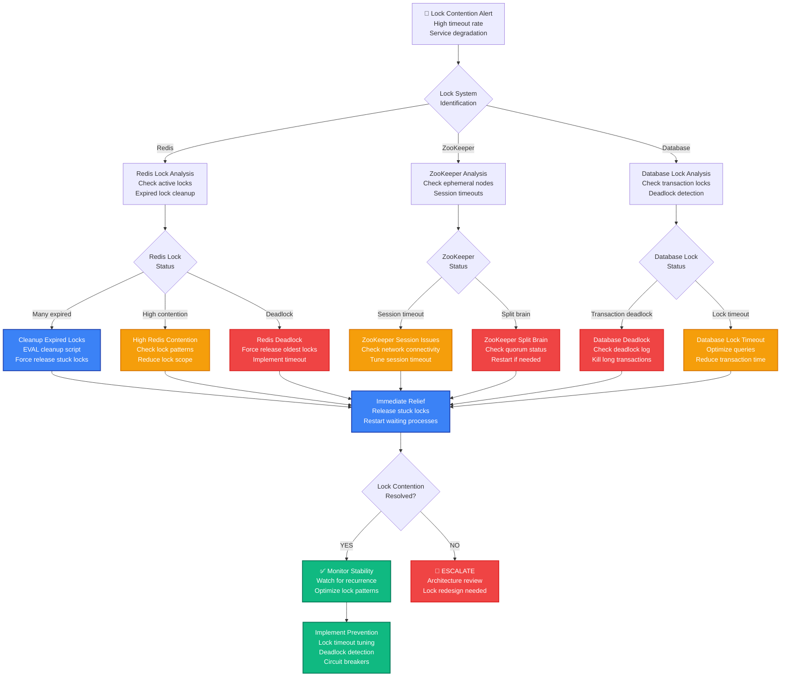

# Distributed Lock Contention Production Debugging

## Emergency Response Overview

**Incident Severity**: P0/P1 - Service deadlock, transaction failures
**MTTR Target**: < 2 minutes for deadlock breaking, < 10 minutes for root cause resolution
**Primary Tools**: Redis CLI, ZooKeeper CLI, application logs, distributed tracing



## 3 AM Debugging Flowchart



## Critical Commands & Immediate Actions

### Redis Lock Emergency Commands (< 1 minute)

```bash
# 1. CHECK ACTIVE LOCKS
redis-cli --scan --pattern "lock:*" | wc -l
redis-cli --scan --pattern "lock:*" | head -20

# 2. ANALYZE LOCK PATTERNS
redis-cli --scan --pattern "lock:*" | xargs -I {} redis-cli TTL {} | sort -n

# 3. FIND EXPIRED/STUCK LOCKS
redis-cli EVAL "
local locks = redis.call('KEYS', 'lock:*')
local expired = {}
for i=1,#locks do
  local ttl = redis.call('TTL', locks[i])
  if ttl == -1 or ttl > 3600 then
    table.insert(expired, locks[i])
  end
end
return expired
" 0

# 4. EMERGENCY LOCK CLEANUP (Netflix approach)
redis-cli EVAL "
local locks = redis.call('KEYS', 'lock:*')
local deleted = 0
for i=1,#locks do
  local ttl = redis.call('TTL', locks[i])
  if ttl == -1 or ttl > 1800 then
    redis.call('DEL', locks[i])
    deleted = deleted + 1
  end
end
return deleted
" 0

# 5. FORCE RELEASE SPECIFIC LOCK (DANGEROUS!)
LOCK_KEY="lock:payment:user:123"
redis-cli DEL $LOCK_KEY
echo "Lock $LOCK_KEY forcefully released"
```

### ZooKeeper Lock Emergency Commands

```bash
# 1. CHECK ZOOKEEPER STATUS
echo stat | nc localhost 2181
echo mntr | nc localhost 2181 | grep -E "(outstanding|watch|connection)"

# 2. LIST ACTIVE LOCKS
zkCli.sh -server localhost:2181 ls /locks
zkCli.sh -server localhost:2181 ls /distributed-locks

# 3. CHECK SESSION TIMEOUTS
echo dump | nc localhost 2181 | grep -A 5 "Sessions with Ephemerals"

# 4. EMERGENCY LOCK CLEANUP
#!/bin/bash
# List all lock nodes
LOCK_NODES=$(zkCli.sh -server localhost:2181 ls /locks | grep -oE '\[.*\]' | tr -d '[],' | xargs)

for node in $LOCK_NODES; do
    # Check if node is ephemeral and old
    STAT=$(zkCli.sh -server localhost:2181 stat /locks/$node)
    CTIME=$(echo "$STAT" | grep ctime | awk '{print $2}')

    # If older than 30 minutes (1800000 ms), consider removing
    CURRENT_TIME=$(date +%s)000
    AGE=$((CURRENT_TIME - CTIME))

    if [ $AGE -gt 1800000 ]; then
        echo "Removing old lock: /locks/$node (age: ${AGE}ms)"
        zkCli.sh -server localhost:2181 delete /locks/$node
    fi
done

# 5. CHECK ZOOKEEPER ENSEMBLE HEALTH
for server in zk1:2181 zk2:2181 zk3:2181; do
    echo "Checking $server..."
    echo stat | nc ${server/:/ } | grep Mode
done
```

### Stripe Production Lock Analysis

```bash
# STRIPE'S LOCK CONTENTION ANALYSIS SCRIPT
#!/bin/bash

echo "=== STRIPE DISTRIBUTED LOCK ANALYSIS ==="
echo "Time: $(date)"

# 1. REDIS LOCK ANALYSIS
echo "=== REDIS LOCK ANALYSIS ==="
REDIS_HOST=${REDIS_HOST:-localhost}
REDIS_PORT=${REDIS_PORT:-6379}

# Count locks by pattern
echo "Lock count by pattern:"
for pattern in "lock:payment:*" "lock:user:*" "lock:order:*" "lock:inventory:*"; do
    count=$(redis-cli -h $REDIS_HOST -p $REDIS_PORT --scan --pattern "$pattern" | wc -l)
    echo "$pattern: $count"
done

# Check for stuck locks (TTL = -1)
STUCK_LOCKS=$(redis-cli -h $REDIS_HOST -p $REDIS_PORT EVAL "
local locks = redis.call('KEYS', 'lock:*')
local stuck = 0
for i=1,#locks do
  if redis.call('TTL', locks[i]) == -1 then
    stuck = stuck + 1
  end
end
return stuck
" 0)

echo "Stuck locks (no TTL): $STUCK_LOCKS"

# Check for contention hotspots
echo "Lock contention analysis:"
redis-cli -h $REDIS_HOST -p $REDIS_PORT --scan --pattern "lock:*" | \
    sed 's/lock:\([^:]*\):.*/\1/' | sort | uniq -c | sort -nr | head -10

# 2. APPLICATION METRICS
echo "=== APPLICATION LOCK METRICS ==="

# Check application logs for lock timeouts
LOCK_TIMEOUTS=$(tail -n 1000 /var/log/app.log | grep -c "lock.*timeout" || echo "0")
LOCK_ERRORS=$(tail -n 1000 /var/log/app.log | grep -c "lock.*error" || echo "0")

echo "Lock timeouts (last 1000 log lines): $LOCK_TIMEOUTS"
echo "Lock errors (last 1000 log lines): $LOCK_ERRORS"

# 3. DEADLOCK DETECTION
echo "=== DEADLOCK DETECTION ==="

# Simple deadlock detection - check for circular waits
redis-cli -h $REDIS_HOST -p $REDIS_PORT EVAL "
local locks = redis.call('KEYS', 'lock:*')
local waiters = {}
for i=1,#locks do
  local value = redis.call('GET', locks[i])
  if value then
    local data = cjson.decode(value)
    if data.waiting_for then
      waiters[locks[i]] = data.waiting_for
    end
  end
end
-- Simple cycle detection would go here
return #locks
" 0

echo "=== ANALYSIS COMPLETE ==="
```

## Common Root Causes & Probabilities

### 1. Lock Timeout Misconfiguration (40% of cases)
**Uber Example**: Payment processing locks timing out during high traffic

```javascript
// PROBLEMATIC CODE - Short timeout
const acquireLock = async (lockKey) => {
  const lock = await redlock.acquire([lockKey], 5000);  // 5s - TOO SHORT!

  try {
    // Payment processing takes 8-12 seconds during peak
    await processPayment(paymentData);  // This exceeds lock timeout!
  } finally {
    await lock.release();
  }
};

// UBER'S SOLUTION - Dynamic timeout based on operation
const acquireLock = async (lockKey, operation = 'default') => {
  const timeouts = {
    payment: 30000,      // 30s for payment processing
    inventory: 10000,    // 10s for inventory updates
    user_update: 5000,   // 5s for user updates
    default: 15000       // 15s default
  };

  const timeout = timeouts[operation] || timeouts.default;
  const lock = await redlock.acquire([lockKey], timeout);

  // Set up lock extension for long operations
  const extender = setInterval(async () => {
    try {
      await lock.extend(timeout);
    } catch (err) {
      console.warn('Failed to extend lock:', err.message);
    }
  }, timeout * 0.5);  // Extend at 50% of timeout

  try {
    await processOperation(operationData);
  } finally {
    clearInterval(extender);
    await lock.release();
  }
};

// DETECTION COMMANDS
grep "lock.*timeout" /var/log/app.log | tail -20
redis-cli --scan --pattern "lock:*" | xargs -I {} redis-cli TTL {}
```

### 2. Lock Granularity Issues (25% of cases)
**Netflix Example**: Too coarse-grained locks blocking entire user operations

```javascript
// PROBLEMATIC CODE - Too coarse grained
const updateUserProfile = async (userId, updates) => {
  const lock = await acquireLock(`user:${userId}`);  // BLOCKS ALL user operations!

  try {
    await updateProfile(userId, updates.profile);
    await updatePreferences(userId, updates.preferences);
    await updateBilling(userId, updates.billing);     // Each step blocks everything
  } finally {
    await lock.release();
  }
};

// NETFLIX'S SOLUTION - Fine-grained locks
const updateUserProfile = async (userId, updates) => {
  const locks = [];

  try {
    // Only lock what we're actually updating
    if (updates.profile) {
      locks.push(await acquireLock(`user:${userId}:profile`));
      await updateProfile(userId, updates.profile);
    }

    if (updates.preferences) {
      locks.push(await acquireLock(`user:${userId}:preferences`));
      await updatePreferences(userId, updates.preferences);
    }

    if (updates.billing) {
      locks.push(await acquireLock(`user:${userId}:billing`));
      await updateBilling(userId, updates.billing);
    }
  } finally {
    // Release all acquired locks
    await Promise.all(locks.map(lock => lock.release()));
  }
};

// DETECTION - Check lock contention patterns
redis-cli --scan --pattern "lock:user:*" | \
  cut -d: -f3 | sort | uniq -c | sort -nr
```

### 3. Deadlock Scenarios (20% of cases)
**Stripe Example**: Order processing deadlock between inventory and payment

```javascript
// PROBLEMATIC CODE - Potential deadlock
// Process A: Lock inventory → Lock payment
const processOrderA = async (orderId) => {
  const inventoryLock = await acquireLock(`inventory:${productId}`);
  const paymentLock = await acquireLock(`payment:${userId}`);

  // Process order...
};

// Process B: Lock payment → Lock inventory (DEADLOCK!)
const processRefundB = async (orderId) => {
  const paymentLock = await acquireLock(`payment:${userId}`);
  const inventoryLock = await acquireLock(`inventory:${productId}`);

  // Process refund...
};

// STRIPE'S SOLUTION - Ordered lock acquisition
const lockOrder = ['inventory', 'payment', 'user'];

const acquireLocksInOrder = async (lockRequests) => {
  // Sort locks by predefined order to prevent deadlock
  const sortedLocks = lockRequests.sort((a, b) =>
    lockOrder.indexOf(a.type) - lockOrder.indexOf(b.type)
  );

  const locks = [];
  try {
    for (const lockReq of sortedLocks) {
      const lock = await acquireLock(`${lockReq.type}:${lockReq.id}`);
      locks.push(lock);
    }
    return locks;
  } catch (error) {
    // Release any locks acquired so far
    await Promise.all(locks.map(lock => lock.release()));
    throw error;
  }
};

// Usage
const processOrder = async (orderId, productId, userId) => {
  const locks = await acquireLocksInOrder([
    { type: 'inventory', id: productId },
    { type: 'payment', id: userId }
  ]);

  try {
    // Process safely - no deadlock possible
  } finally {
    await Promise.all(locks.map(lock => lock.release()));
  }
};
```

### 4. Lock Cleanup Failures (10% of cases)
**GitHub Example**: Application crashes leaving orphaned locks

```javascript
// PROBLEMATIC CODE - No cleanup on crash
const processRepository = async (repoId) => {
  const lock = await acquireLock(`repo:${repoId}`);

  // If process crashes here, lock is never released!
  await processRepositoryData(repoId);

  await lock.release();
};

// GITHUB'S SOLUTION - TTL-based locks with heartbeat
class TTLLock {
  constructor(redisClient, key, ttl = 30000) {
    this.redis = redisClient;
    this.key = key;
    this.ttl = ttl;
    this.acquired = false;
    this.heartbeatInterval = null;
  }

  async acquire(timeout = 10000) {
    const start = Date.now();

    while (Date.now() - start < timeout) {
      const result = await this.redis.set(
        this.key,
        process.pid + ':' + Date.now(),
        'PX', this.ttl,     // TTL in milliseconds
        'NX'                // Only if not exists
      );

      if (result === 'OK') {
        this.acquired = true;
        this.startHeartbeat();
        return true;
      }

      await new Promise(resolve => setTimeout(resolve, 100));
    }

    throw new Error(`Failed to acquire lock: ${this.key}`);
  }

  startHeartbeat() {
    this.heartbeatInterval = setInterval(async () => {
      try {
        // Extend TTL if we still own the lock
        const value = await this.redis.get(this.key);
        if (value && value.startsWith(process.pid + ':')) {
          await this.redis.pexpire(this.key, this.ttl);
        } else {
          this.stopHeartbeat();
        }
      } catch (error) {
        console.error('Heartbeat failed:', error);
        this.stopHeartbeat();
      }
    }, this.ttl / 3);  // Heartbeat at 1/3 of TTL
  }

  async release() {
    if (!this.acquired) return;

    this.stopHeartbeat();

    // Only delete if we still own it
    await this.redis.eval(`
      if redis.call("GET", KEYS[1]) == ARGV[1] then
        return redis.call("DEL", KEYS[1])
      else
        return 0
      end
    `, 1, this.key, process.pid + ':');

    this.acquired = false;
  }

  stopHeartbeat() {
    if (this.heartbeatInterval) {
      clearInterval(this.heartbeatInterval);
      this.heartbeatInterval = null;
    }
  }
}

// CLEANUP SCRIPT for orphaned locks
const cleanupOrphanedLocks = async () => {
  const locks = await redis.keys('lock:*');

  for (const lock of locks) {
    const value = await redis.get(lock);
    if (value) {
      const [pid, timestamp] = value.split(':');
      const age = Date.now() - parseInt(timestamp);

      // If lock is older than 5 minutes, check if process exists
      if (age > 300000) {
        try {
          process.kill(parseInt(pid), 0);  // Check if process exists
        } catch (error) {
          // Process doesn't exist, remove lock
          await redis.del(lock);
          console.log(`Cleaned up orphaned lock: ${lock}`);
        }
      }
    }
  }
};
```

### 5. High Lock Contention Hotspots (5% of cases)
**Meta Example**: Popular user profile causing lock bottleneck

```javascript
// PROBLEMATIC CODE - Single hot lock
const updateUserCounter = async (userId) => {
  const lock = await acquireLock(`user:${userId}:counter`);

  try {
    const counter = await redis.get(`counter:${userId}`);
    await redis.set(`counter:${userId}`, parseInt(counter) + 1);
  } finally {
    await lock.release();
  }
};

// META'S SOLUTION - Sharded locks
class ShardedCounter {
  constructor(redisClient, shardCount = 10) {
    this.redis = redisClient;
    this.shardCount = shardCount;
  }

  getShardKey(userId) {
    const hash = this.hash(userId);
    const shard = hash % this.shardCount;
    return `counter:${userId}:shard:${shard}`;
  }

  hash(str) {
    let hash = 0;
    for (let i = 0; i < str.length; i++) {
      const char = str.charCodeAt(i);
      hash = ((hash << 5) - hash) + char;
      hash = hash & hash; // Convert to 32-bit integer
    }
    return Math.abs(hash);
  }

  async increment(userId) {
    const shardKey = this.getShardKey(userId);
    const lockKey = `lock:${shardKey}`;

    const lock = await acquireLock(lockKey);
    try {
      await this.redis.incr(shardKey);
    } finally {
      await lock.release();
    }
  }

  async getTotal(userId) {
    const promises = [];
    for (let i = 0; i < this.shardCount; i++) {
      promises.push(
        this.redis.get(`counter:${userId}:shard:${i}`)
      );
    }

    const values = await Promise.all(promises);
    return values.reduce((sum, val) => sum + (parseInt(val) || 0), 0);
  }
}

// DETECTION - Identify hot locks
const findHotLocks = async () => {
  const logs = await getLockAcquisitionLogs(); // From application logs
  const lockFrequency = {};

  logs.forEach(log => {
    lockFrequency[log.lockKey] = (lockFrequency[log.lockKey] || 0) + 1;
  });

  const hotLocks = Object.entries(lockFrequency)
    .sort(([,a], [,b]) => b - a)
    .slice(0, 10);

  console.log('Hot locks:', hotLocks);
  return hotLocks;
};
```

## Recovery Procedures (< 10 minutes)

### Phase 1: Emergency Lock Release (< 2 minutes)

```bash
# EMERGENCY LOCK CLEANUP SCRIPT
#!/bin/bash
REDIS_HOST=${1:-localhost}
REDIS_PORT=${2:-6379}

echo "=== EMERGENCY DISTRIBUTED LOCK CLEANUP ==="
echo "Redis: $REDIS_HOST:$REDIS_PORT"
echo "Time: $(date)"

# 1. Count current locks
TOTAL_LOCKS=$(redis-cli -h $REDIS_HOST -p $REDIS_PORT --scan --pattern "lock:*" | wc -l)
echo "Total active locks: $TOTAL_LOCKS"

# 2. Find and remove expired locks
EXPIRED_LOCKS=$(redis-cli -h $REDIS_HOST -p $REDIS_PORT EVAL "
local locks = redis.call('KEYS', 'lock:*')
local expired = 0
for i=1,#locks do
  local ttl = redis.call('TTL', locks[i])
  if ttl == -1 or ttl > 3600 then
    redis.call('DEL', locks[i])
    expired = expired + 1
  end
end
return expired
" 0)

echo "Cleaned up expired locks: $EXPIRED_LOCKS"

# 3. Force release locks older than 30 minutes
OLD_LOCKS=$(redis-cli -h $REDIS_HOST -p $REDIS_PORT EVAL "
local locks = redis.call('KEYS', 'lock:*')
local old = 0
local current_time = redis.call('TIME')[1]
for i=1,#locks do
  local value = redis.call('GET', locks[i])
  if value then
    local timestamp = string.match(value, ':(%d+)$')
    if timestamp and (current_time - timestamp/1000) > 1800 then
      redis.call('DEL', locks[i])
      old = old + 1
    end
  end
end
return old
" 0)

echo "Cleaned up old locks: $OLD_LOCKS"

# 4. Check for deadlocks and break them
echo "Checking for potential deadlocks..."
redis-cli -h $REDIS_HOST -p $REDIS_PORT --scan --pattern "lock:*" | \
head -50 | \
xargs -I {} redis-cli -h $REDIS_HOST -p $REDIS_PORT TTL {} | \
awk '$1 > 300 {print "Long-running lock detected"}' | \
wc -l

REMAINING_LOCKS=$(redis-cli -h $REDIS_HOST -p $REDIS_PORT --scan --pattern "lock:*" | wc -l)
echo "Remaining active locks: $REMAINING_LOCKS"

echo "=== EMERGENCY CLEANUP COMPLETE ==="
```

### Phase 2: ZooKeeper Lock Recovery (< 5 minutes)

```bash
# ZOOKEEPER LOCK RECOVERY SCRIPT
#!/bin/bash
ZK_HOSTS=${1:-"localhost:2181"}

echo "=== ZOOKEEPER LOCK RECOVERY ==="
echo "ZooKeeper: $ZK_HOSTS"

# 1. Check ZooKeeper health
echo "Checking ZooKeeper ensemble health..."
for server in $(echo $ZK_HOSTS | tr ',' ' '); do
    echo "Server $server:"
    echo stat | nc ${server/:/ } | grep Mode
done

# 2. List all locks
echo "Current lock nodes:"
zkCli.sh -server $ZK_HOSTS ls /locks 2>/dev/null || \
zkCli.sh -server $ZK_HOSTS ls /distributed-locks 2>/dev/null || \
echo "No standard lock paths found"

# 3. Clean up orphaned ephemeral nodes
echo "Cleaning up orphaned lock nodes..."
LOCK_PATH="/locks"

# Get all lock nodes
LOCK_NODES=$(zkCli.sh -server $ZK_HOSTS ls $LOCK_PATH 2>/dev/null | \
    grep -oE '\[.*\]' | tr -d '[],' | xargs)

if [ ! -z "$LOCK_NODES" ]; then
    for node in $LOCK_NODES; do
        # Check node age
        STAT=$(zkCli.sh -server $ZK_HOSTS stat $LOCK_PATH/$node 2>/dev/null)
        if [ $? -eq 0 ]; then
            CTIME=$(echo "$STAT" | grep ctime | awk '{print $2}')
            CURRENT_TIME=$(date +%s)000
            AGE=$((CURRENT_TIME - CTIME))

            # Remove nodes older than 30 minutes (1800000 ms)
            if [ $AGE -gt 1800000 ]; then
                echo "Removing old lock node: $LOCK_PATH/$node (age: ${AGE}ms)"
                zkCli.sh -server $ZK_HOSTS delete $LOCK_PATH/$node 2>/dev/null
            fi
        fi
    done
else
    echo "No lock nodes found"
fi

# 4. Check for split-brain scenarios
echo "Checking for split-brain scenarios..."
LEADERS=$(for server in $(echo $ZK_HOSTS | tr ',' ' '); do
    echo stat | nc ${server/:/ } | grep Mode | grep -c leader
done | paste -sd+ | bc)

if [ $LEADERS -gt 1 ]; then
    echo "WARNING: Multiple leaders detected! Split-brain scenario."
    echo "Consider restarting ZooKeeper ensemble."
else
    echo "Single leader detected - ensemble healthy"
fi

echo "=== ZOOKEEPER RECOVERY COMPLETE ==="
```

### Phase 3: Application Lock Recovery (< 10 minutes)

```javascript
// APPLICATION-LEVEL LOCK RECOVERY
class LockRecoveryManager {
  constructor(redisClient, options = {}) {
    this.redis = redisClient;
    this.appInstanceId = options.instanceId || `${process.pid}:${Date.now()}`;
    this.lockPrefix = options.lockPrefix || 'lock:';
    this.maxLockAge = options.maxLockAge || 1800000; // 30 minutes
  }

  async emergencyCleanup() {
    console.log('Starting emergency lock cleanup...');

    const results = {
      totalLocks: 0,
      expiredCleaned: 0,
      orphanedCleaned: 0,
      errors: []
    };

    try {
      // 1. Get all locks
      const lockKeys = await this.redis.keys(`${this.lockPrefix}*`);
      results.totalLocks = lockKeys.length;

      console.log(`Found ${lockKeys.length} active locks`);

      for (const lockKey of lockKeys) {
        try {
          const lockValue = await this.redis.get(lockKey);
          const ttl = await this.redis.ttl(lockKey);

          // Clean up locks without TTL
          if (ttl === -1) {
            await this.redis.del(lockKey);
            results.expiredCleaned++;
            console.log(`Cleaned expired lock: ${lockKey}`);
            continue;
          }

          // Clean up very old locks
          if (lockValue) {
            const [instanceId, timestamp] = lockValue.split(':');
            const age = Date.now() - parseInt(timestamp);

            if (age > this.maxLockAge) {
              await this.redis.del(lockKey);
              results.orphanedCleaned++;
              console.log(`Cleaned orphaned lock: ${lockKey} (age: ${age}ms)`);
            }
          }
        } catch (error) {
          results.errors.push(`Error processing ${lockKey}: ${error.message}`);
        }
      }

      console.log('Emergency cleanup completed:', results);
      return results;

    } catch (error) {
      console.error('Emergency cleanup failed:', error);
      throw error;
    }
  }

  async breakDeadlocks() {
    console.log('Checking for deadlocks...');

    // Simple deadlock detection: find circular waits
    const lockKeys = await this.redis.keys(`${this.lockPrefix}*`);
    const lockGraph = new Map();

    // Build dependency graph
    for (const lockKey of lockKeys) {
      const lockValue = await this.redis.get(lockKey);
      if (lockValue) {
        try {
          const lockData = JSON.parse(lockValue);
          if (lockData.waitingFor) {
            lockGraph.set(lockKey, lockData.waitingFor);
          }
        } catch (error) {
          // Ignore locks with non-JSON values
        }
      }
    }

    // Detect cycles (simplified)
    const visited = new Set();
    const deadlocks = [];

    for (const [lock, waitingFor] of lockGraph) {
      if (!visited.has(lock)) {
        const cycle = this.detectCycle(lock, lockGraph, new Set(), []);
        if (cycle.length > 0) {
          deadlocks.push(cycle);
          cycle.forEach(l => visited.add(l));
        }
      }
    }

    // Break deadlocks by removing oldest lock
    for (const deadlock of deadlocks) {
      console.log(`Deadlock detected: ${deadlock.join(' -> ')}`);

      // Find oldest lock in cycle
      let oldestLock = deadlock[0];
      let oldestTime = Infinity;

      for (const lock of deadlock) {
        const value = await this.redis.get(lock);
        if (value) {
          const timestamp = parseInt(value.split(':')[1]);
          if (timestamp < oldestTime) {
            oldestTime = timestamp;
            oldestLock = lock;
          }
        }
      }

      // Break deadlock by removing oldest lock
      await this.redis.del(oldestLock);
      console.log(`Broke deadlock by removing: ${oldestLock}`);
    }

    return deadlocks.length;
  }

  detectCycle(start, graph, visiting, path) {
    if (visiting.has(start)) {
      // Found cycle
      const cycleStart = path.indexOf(start);
      return path.slice(cycleStart);
    }

    if (path.includes(start)) {
      return []; // Already processed
    }

    visiting.add(start);
    path.push(start);

    const next = graph.get(start);
    if (next && graph.has(next)) {
      const cycle = this.detectCycle(next, graph, visiting, path);
      if (cycle.length > 0) {
        return cycle;
      }
    }

    visiting.delete(start);
    path.pop();
    return [];
  }

  async healthCheck() {
    const health = {
      totalLocks: 0,
      expiredLocks: 0,
      oldLocks: 0,
      averageAge: 0,
      status: 'healthy'
    };

    try {
      const lockKeys = await this.redis.keys(`${this.lockPrefix}*`);
      health.totalLocks = lockKeys.length;

      if (lockKeys.length === 0) {
        return health;
      }

      let totalAge = 0;
      const currentTime = Date.now();

      for (const lockKey of lockKeys) {
        const ttl = await this.redis.ttl(lockKey);
        const value = await this.redis.get(lockKey);

        if (ttl === -1) {
          health.expiredLocks++;
        }

        if (value) {
          const timestamp = parseInt(value.split(':')[1]);
          const age = currentTime - timestamp;
          totalAge += age;

          if (age > this.maxLockAge) {
            health.oldLocks++;
          }
        }
      }

      health.averageAge = totalAge / lockKeys.length;

      // Determine health status
      if (health.expiredLocks > lockKeys.length * 0.1 ||
          health.oldLocks > lockKeys.length * 0.05) {
        health.status = 'unhealthy';
      } else if (health.expiredLocks > 0 || health.oldLocks > 0) {
        health.status = 'degraded';
      }

      return health;

    } catch (error) {
      health.status = 'error';
      health.error = error.message;
      return health;
    }
  }
}

// Usage in emergency response
const lockRecovery = new LockRecoveryManager(redisClient);

async function emergencyLockRecovery() {
  try {
    // 1. Health check
    const health = await lockRecovery.healthCheck();
    console.log('Lock system health:', health);

    // 2. Emergency cleanup if needed
    if (health.status !== 'healthy') {
      await lockRecovery.emergencyCleanup();
    }

    // 3. Break any deadlocks
    const deadlocksFound = await lockRecovery.breakDeadlocks();
    console.log(`Deadlocks resolved: ${deadlocksFound}`);

    // 4. Final health check
    const finalHealth = await lockRecovery.healthCheck();
    console.log('Final lock system health:', finalHealth);

  } catch (error) {
    console.error('Emergency lock recovery failed:', error);
    throw error;
  }
}
```

## Monitoring & Prevention

### Key Lock Metrics

```javascript
// COMPREHENSIVE LOCK MONITORING
class LockMonitoring {
  constructor(redisClient, metricsClient) {
    this.redis = redisClient;
    this.metrics = metricsClient;
    this.lockStats = new Map();
  }

  async recordLockAcquisition(lockKey, duration, success) {
    const lockType = this.getLockType(lockKey);

    // Record metrics
    this.metrics.timing('lock.acquire.duration', duration, {
      lock_type: lockType,
      success: success
    });

    this.metrics.increment('lock.acquire.total', {
      lock_type: lockType,
      success: success
    });

    // Update local stats
    if (!this.lockStats.has(lockType)) {
      this.lockStats.set(lockType, {
        total: 0,
        failures: 0,
        totalDuration: 0,
        maxDuration: 0
      });
    }

    const stats = this.lockStats.get(lockType);
    stats.total++;
    if (!success) stats.failures++;
    stats.totalDuration += duration;
    stats.maxDuration = Math.max(stats.maxDuration, duration);
  }

  async checkLockHealth() {
    const health = {
      totalLocks: 0,
      locksByType: {},
      contentionRate: 0,
      averageHoldTime: 0,
      stuckLocks: 0
    };

    try {
      // Get all active locks
      const lockKeys = await this.redis.keys('lock:*');
      health.totalLocks = lockKeys.length;

      // Analyze by type
      for (const lockKey of lockKeys) {
        const lockType = this.getLockType(lockKey);
        health.locksByType[lockType] = (health.locksByType[lockType] || 0) + 1;

        // Check for stuck locks
        const ttl = await this.redis.ttl(lockKey);
        if (ttl === -1) {
          health.stuckLocks++;
        }
      }

      // Calculate contention rate
      const totalAttempts = Array.from(this.lockStats.values())
        .reduce((sum, stats) => sum + stats.total, 0);
      const totalFailures = Array.from(this.lockStats.values())
        .reduce((sum, stats) => sum + stats.failures, 0);

      health.contentionRate = totalAttempts > 0 ? totalFailures / totalAttempts : 0;

      // Send metrics
      this.metrics.gauge('lock.health.total', health.totalLocks);
      this.metrics.gauge('lock.health.contention_rate', health.contentionRate);
      this.metrics.gauge('lock.health.stuck_locks', health.stuckLocks);

      return health;

    } catch (error) {
      console.error('Lock health check failed:', error);
      throw error;
    }
  }

  getLockType(lockKey) {
    // Extract lock type from key pattern
    const parts = lockKey.split(':');
    return parts.length > 1 ? parts[1] : 'unknown';
  }

  async startMonitoring(interval = 30000) {
    setInterval(async () => {
      try {
        await this.checkLockHealth();
      } catch (error) {
        console.error('Lock monitoring error:', error);
      }
    }, interval);
  }
}

// ALERTING CONFIGURATION
const lockAlerts = [
  {
    name: 'HighLockContention',
    condition: 'lock_contention_rate > 0.2',
    duration: '2m',
    severity: 'warning',
    description: 'Lock contention rate above 20%'
  },
  {
    name: 'LockTimeoutSpike',
    condition: 'rate(lock_timeout_total[5m]) > 10',
    duration: '1m',
    severity: 'critical',
    description: 'Lock timeouts exceeding 10/minute'
  },
  {
    name: 'StuckLocks',
    condition: 'stuck_locks_count > 5',
    duration: '1m',
    severity: 'critical',
    description: 'More than 5 stuck locks detected'
  },
  {
    name: 'DeadlockDetected',
    condition: 'deadlock_count > 0',
    duration: '0s',
    severity: 'critical',
    description: 'Deadlock pattern detected'
  }
];
```

## Incident Response Checklist

### Immediate Response (< 2 minutes)
- [ ] Check lock system health (Redis/ZooKeeper status)
- [ ] Count active locks and identify stuck/expired locks
- [ ] Look for deadlock patterns in application logs
- [ ] Force release obviously stuck locks (>30 minutes old)
- [ ] Check application error rates and timeouts

### Investigation (< 5 minutes)
- [ ] Analyze lock contention patterns and hot spots
- [ ] Review recent deployments for lock logic changes
- [ ] Check database transaction logs for conflicts
- [ ] Examine lock timeout configurations vs operation durations
- [ ] Identify potential deadlock scenarios

### Resolution (< 10 minutes)
- [ ] Clean up expired and orphaned locks
- [ ] Break identified deadlocks by removing oldest locks
- [ ] Tune lock timeouts and granularity if needed
- [ ] Restart services with problematic lock handling
- [ ] Implement circuit breakers for high-contention scenarios

### Post-Incident (< 30 minutes)
- [ ] Set up enhanced lock monitoring and alerting
- [ ] Review lock architecture and granularity design
- [ ] Implement lock cleanup automation
- [ ] Document deadlock prevention patterns
- [ ] Plan capacity testing for lock contention scenarios

**Remember**: Distributed locks are a double-edged sword - they ensure consistency but can become bottlenecks. Always design for lock failures and have cleanup mechanisms ready.