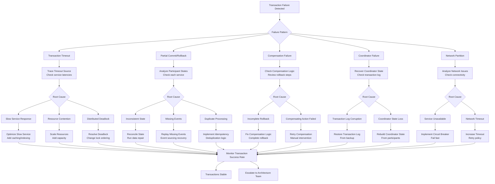

# Distributed Transaction Failures - Tracing and Resolution Guide

## Overview

This guide provides systematic approaches to debugging failed distributed transactions across microservices. Based on production experiences from Stripe's payment processing, Uber's ride coordination, and Amazon's order fulfillment systems.

## Architecture Context

```mermaid
graph TB
    subgraph EdgePlane[Edge Plane - #0066CC]
        API_GW[API Gateway<br/>Kong/Ambassador]
        LB[Load Balancer<br/>AWS ALB]
    end

    subgraph ServicePlane[Service Plane - #00AA00]
        ORDER_SVC[Order Service<br/>Transaction Coordinator]
        PAYMENT_SVC[Payment Service<br/>Transaction Participant]
        INVENTORY_SVC[Inventory Service<br/>Transaction Participant]
        SHIPPING_SVC[Shipping Service<br/>Transaction Participant]
        SAGA_ENGINE[Saga Engine<br/>Orchestrator Pattern]
    end

    subgraph StatePlane[State Plane - #FF8800]
        TXN_LOG[(Transaction Log<br/>PostgreSQL)]
        EVENT_STORE[(Event Store<br/>Apache Kafka)]
        COMPENSATE_QUEUE[(Compensation Queue<br/>Redis)]
        TRACE_STORE[(Distributed Traces<br/>Jaeger/Zipkin)]
    end

    subgraph ControlPlane[Control Plane - #CC0000]
        MONITOR[Monitoring<br/>Prometheus/Grafana]
        ALERT[Alerting<br/>PagerDuty)]
        TRACE_UI[Tracing UI<br/>Jaeger Dashboard]
    end

    %% Transaction flow
    LB --> API_GW
    API_GW --> ORDER_SVC
    ORDER_SVC --> SAGA_ENGINE

    SAGA_ENGINE --> PAYMENT_SVC
    SAGA_ENGINE --> INVENTORY_SVC
    SAGA_ENGINE --> SHIPPING_SVC

    %% State management
    ORDER_SVC --> TXN_LOG
    SAGA_ENGINE --> EVENT_STORE
    SAGA_ENGINE --> COMPENSATE_QUEUE

    %% Tracing
    ORDER_SVC --> TRACE_STORE
    PAYMENT_SVC --> TRACE_STORE
    INVENTORY_SVC --> TRACE_STORE
    SHIPPING_SVC --> TRACE_STORE

    %% Monitoring
    TRACE_STORE --> TRACE_UI
    SAGA_ENGINE --> MONITOR
    EVENT_STORE --> MONITOR
    MONITOR --> ALERT

    %% Apply styles
    classDef edgeStyle fill:#0066CC,stroke:#004499,color:#fff
    classDef serviceStyle fill:#00AA00,stroke:#007700,color:#fff
    classDef stateStyle fill:#FF8800,stroke:#CC6600,color:#fff
    classDef controlStyle fill:#CC0000,stroke:#990000,color:#fff

    class API_GW,LB edgeStyle
    class ORDER_SVC,PAYMENT_SVC,INVENTORY_SVC,SHIPPING_SVC,SAGA_ENGINE serviceStyle
    class TXN_LOG,EVENT_STORE,COMPENSATE_QUEUE,TRACE_STORE stateStyle
    class MONITOR,ALERT,TRACE_UI controlStyle
```

## Transaction Failure Analysis Flowchart



## Transaction Pattern Analysis

### Saga Pattern Debugging

#### Choreography-Based Saga
```yaml
# Event-driven saga failure analysis
apiVersion: v1
kind: ConfigMap
metadata:
  name: saga-choreography-debug
data:
  trace-commands: |
    # Check event ordering in Kafka
    kafka-console-consumer --bootstrap-server kafka:9092 \
      --topic order-events --from-beginning \
      --property print.timestamp=true \
      --property print.key=true

    # Verify event schema compliance
    kafka-avro-console-consumer --bootstrap-server kafka:9092 \
      --topic order-events --from-beginning \
      --property schema.registry.url=http://schema-registry:8081

  failure-patterns: |
    1. Missing event publication
    2. Event ordering violations
    3. Duplicate event processing
    4. Schema evolution issues
    5. Consumer lag buildup
```

#### Orchestration-Based Saga
```yaml
# Centralized orchestrator debugging
apiVersion: v1
kind: ConfigMap
metadata:
  name: saga-orchestration-debug
data:
  investigation-queries: |
    # Check saga state in coordinator
    SELECT
        saga_id,
        current_step,
        status,
        started_at,
        updated_at,
        error_message
    FROM saga_instances
    WHERE status IN ('FAILED', 'COMPENSATING', 'TIMEOUT')
    ORDER BY updated_at DESC;

    # Analyze step execution history
    SELECT
        saga_id,
        step_name,
        service_name,
        status,
        attempt_count,
        execution_time_ms,
        error_details
    FROM saga_step_executions
    WHERE saga_id = ?
    ORDER BY step_order, attempt_count;
```

### Two-Phase Commit (2PC) Debugging

#### Phase Analysis
```sql
-- Check transaction coordinator state
SELECT
    transaction_id,
    coordinator_node,
    state,
    participants,
    created_at,
    timeout_at,
    last_heartbeat
FROM distributed_transactions
WHERE state IN ('PREPARING', 'PREPARED', 'ABORTING', 'COMMITTING')
ORDER BY created_at;

-- Analyze participant readiness
SELECT
    transaction_id,
    participant_service,
    vote,
    prepared_at,
    resources_locked,
    timeout_remaining
FROM transaction_participants
WHERE transaction_id = ?;

-- Check for coordinator recovery
SELECT
    transaction_id,
    recovery_timestamp,
    recovery_action,
    outcome
FROM transaction_recovery_log
WHERE recovery_timestamp > NOW() - INTERVAL '1 hour';
```

## Service-Specific Debugging

### Payment Service Transaction Failures

#### Stripe Integration Debugging
```python
# Payment transaction debugging
import stripe
import logging
from typing import Dict, Optional

class PaymentTransactionDebugger:
    def __init__(self, stripe_api_key: str):
        stripe.api_key = stripe_api_key
        self.logger = logging.getLogger(__name__)

    def debug_payment_intent(self, payment_intent_id: str) -> Dict:
        """Debug failed payment intent with full trace"""
        try:
            # Get payment intent details
            intent = stripe.PaymentIntent.retrieve(
                payment_intent_id,
                expand=['charges.data.balance_transaction']
            )

            debug_info = {
                'payment_intent_id': payment_intent_id,
                'status': intent.status,
                'amount': intent.amount,
                'currency': intent.currency,
                'client_secret': intent.client_secret,
                'created': intent.created,
                'last_payment_error': intent.last_payment_error,
                'charges': []
            }

            # Analyze each charge attempt
            for charge in intent.charges.data:
                charge_debug = {
                    'charge_id': charge.id,
                    'status': charge.status,
                    'amount': charge.amount,
                    'outcome': charge.outcome,
                    'failure_code': charge.failure_code,
                    'failure_message': charge.failure_message,
                    'risk_level': charge.outcome.risk_level if charge.outcome else None,
                    'seller_message': charge.outcome.seller_message if charge.outcome else None,
                    'network_status': charge.outcome.network_status if charge.outcome else None
                }

                debug_info['charges'].append(charge_debug)

            # Check for idempotency issues
            self._check_idempotency(payment_intent_id, debug_info)

            return debug_info

        except stripe.error.StripeError as e:
            self.logger.error(f"Stripe API error for {payment_intent_id}: {e}")
            return {'error': str(e), 'type': type(e).__name__}

    def _check_idempotency(self, payment_intent_id: str, debug_info: Dict):
        """Check for idempotency key conflicts"""
        # Search for duplicate payment intents
        try:
            duplicates = stripe.PaymentIntent.list(
                limit=10,
                metadata={'original_intent': payment_intent_id}
            )

            if duplicates.data:
                debug_info['potential_duplicates'] = [
                    {'id': pi.id, 'status': pi.status}
                    for pi in duplicates.data
                ]
        except Exception as e:
            debug_info['idempotency_check_error'] = str(e)

# Example usage
debugger = PaymentTransactionDebugger('sk_test_...')
debug_result = debugger.debug_payment_intent('pi_1234567890')
```

### Inventory Service Transaction Failures

#### Stock Reservation Debugging
```java
// Inventory reservation debugging
@Service
public class InventoryTransactionDebugger {

    @Autowired
    private InventoryRepository inventoryRepository;

    @Autowired
    private ReservationRepository reservationRepository;

    public InventoryDebugReport debugReservationFailure(String transactionId) {
        InventoryDebugReport report = new InventoryDebugReport(transactionId);

        // Check reservation history
        List<StockReservation> reservations = reservationRepository
            .findByTransactionIdOrderByCreatedAt(transactionId);

        report.setReservationHistory(reservations);

        // Analyze stock levels at time of failure
        for (StockReservation reservation : reservations) {
            StockSnapshot snapshot = inventoryRepository
                .getStockSnapshotAt(reservation.getProductId(), reservation.getCreatedAt());

            report.addStockSnapshot(reservation.getProductId(), snapshot);

            // Check for concurrent reservations
            List<StockReservation> concurrentReservations = reservationRepository
                .findConcurrentReservations(
                    reservation.getProductId(),
                    reservation.getCreatedAt().minusMinutes(1),
                    reservation.getCreatedAt().plusMinutes(1)
                );

            report.addConcurrentReservations(reservation.getProductId(), concurrentReservations);
        }

        // Check for inventory inconsistencies
        checkInventoryConsistency(report);

        return report;
    }

    private void checkInventoryConsistency(InventoryDebugReport report) {
        // Compare reserved vs available stock
        Map<String, Integer> calculatedAvailable = new HashMap<>();
        Map<String, Integer> actualAvailable = new HashMap<>();

        for (String productId : report.getAffectedProducts()) {
            // Calculate what available stock should be
            int totalStock = inventoryRepository.getTotalStock(productId);
            int reservedStock = reservationRepository.getTotalReserved(productId);
            calculatedAvailable.put(productId, totalStock - reservedStock);

            // Get actual available stock
            int actualStock = inventoryRepository.getAvailableStock(productId);
            actualAvailable.put(productId, actualStock);

            // Flag inconsistencies
            if (!calculatedAvailable.get(productId).equals(actualAvailable.get(productId))) {
                report.addInconsistency(productId,
                    "Calculated: " + calculatedAvailable.get(productId) +
                    ", Actual: " + actualAvailable.get(productId));
            }
        }
    }
}

@Data
public class InventoryDebugReport {
    private String transactionId;
    private List<StockReservation> reservationHistory;
    private Map<String, StockSnapshot> stockSnapshots;
    private Map<String, List<StockReservation>> concurrentReservations;
    private Map<String, String> inconsistencies;
    private List<String> affectedProducts;

    public InventoryDebugReport(String transactionId) {
        this.transactionId = transactionId;
        this.stockSnapshots = new HashMap<>();
        this.concurrentReservations = new HashMap<>();
        this.inconsistencies = new HashMap<>();
        this.affectedProducts = new ArrayList<>();
    }
}
```

## Distributed Tracing Analysis

### Jaeger Trace Investigation
```bash
# Query traces for failed transactions
curl -X GET "http://jaeger:16686/api/traces" \
  -G \
  -d "service=order-service" \
  -d "operation=process-order" \
  -d "tag=error:true" \
  -d "start=$(date -d '1 hour ago' +%s)000000" \
  -d "end=$(date +%s)000000" \
  -d "limit=100"

# Get specific trace details
curl -X GET "http://jaeger:16686/api/traces/{trace-id}"

# Analyze trace statistics
curl -X GET "http://jaeger:16686/api/services/order-service/operations"
```

### Trace Analysis Script
```python
import requests
import json
from datetime import datetime, timedelta
from typing import List, Dict

class TraceAnalyzer:
    def __init__(self, jaeger_url: str):
        self.jaeger_url = jaeger_url

    def analyze_failed_transactions(self, service: str, hours_back: int = 1) -> Dict:
        """Analyze failed distributed transactions"""
        end_time = datetime.now()
        start_time = end_time - timedelta(hours=hours_back)

        # Query failed traces
        traces_response = requests.get(f"{self.jaeger_url}/api/traces", params={
            'service': service,
            'tag': 'error:true',
            'start': int(start_time.timestamp() * 1000000),
            'end': int(end_time.timestamp() * 1000000),
            'limit': 1000
        })

        traces_data = traces_response.json()
        analysis = {
            'total_failed_traces': len(traces_data['data']),
            'error_patterns': {},
            'service_failures': {},
            'avg_duration_ms': 0,
            'timeout_count': 0,
            'detailed_failures': []
        }

        total_duration = 0
        for trace in traces_data['data']:
            trace_analysis = self.analyze_single_trace(trace)
            analysis['detailed_failures'].append(trace_analysis)

            # Aggregate error patterns
            error_type = trace_analysis.get('primary_error_type', 'unknown')
            analysis['error_patterns'][error_type] = analysis['error_patterns'].get(error_type, 0) + 1

            # Track service failures
            for service_name, error_count in trace_analysis.get('service_errors', {}).items():
                if service_name not in analysis['service_failures']:
                    analysis['service_failures'][service_name] = 0
                analysis['service_failures'][service_name] += error_count

            # Calculate average duration
            total_duration += trace_analysis.get('duration_ms', 0)

            # Count timeouts
            if 'timeout' in trace_analysis.get('primary_error_type', '').lower():
                analysis['timeout_count'] += 1

        if traces_data['data']:
            analysis['avg_duration_ms'] = total_duration / len(traces_data['data'])

        return analysis

    def analyze_single_trace(self, trace: Dict) -> Dict:
        """Analyze a single trace for failure patterns"""
        spans = trace['spans']
        trace_id = trace['traceID']

        analysis = {
            'trace_id': trace_id,
            'duration_ms': trace['processes'][spans[0]['processID']]['tags'].get('duration', 0) / 1000,
            'service_errors': {},
            'error_timeline': [],
            'primary_error_type': None,
            'compensation_attempted': False
        }

        for span in spans:
            process_id = span['processID']
            service_name = trace['processes'][process_id]['serviceName']

            # Check for errors in this span
            error_tags = [tag for tag in span.get('tags', []) if tag['key'] == 'error']
            if error_tags and error_tags[0]['value']:
                if service_name not in analysis['service_errors']:
                    analysis['service_errors'][service_name] = 0
                analysis['service_errors'][service_name] += 1

                # Extract error details
                error_msg_tags = [tag for tag in span.get('tags', []) if tag['key'] in ['error.msg', 'error.object']]
                error_message = error_msg_tags[0]['value'] if error_msg_tags else 'Unknown error'

                analysis['error_timeline'].append({
                    'timestamp': span['startTime'],
                    'service': service_name,
                    'operation': span['operationName'],
                    'error_message': error_message
                })

                # Determine primary error type
                if not analysis['primary_error_type']:
                    if 'timeout' in error_message.lower():
                        analysis['primary_error_type'] = 'timeout'
                    elif 'connection' in error_message.lower():
                        analysis['primary_error_type'] = 'connection_failure'
                    elif 'validation' in error_message.lower():
                        analysis['primary_error_type'] = 'validation_error'
                    else:
                        analysis['primary_error_type'] = 'service_error'

            # Check for compensation patterns
            if 'compensate' in span['operationName'].lower() or 'rollback' in span['operationName'].lower():
                analysis['compensation_attempted'] = True

        return analysis

# Usage example
analyzer = TraceAnalyzer('http://jaeger:16686')
failure_analysis = analyzer.analyze_failed_transactions('order-service', hours_back=2)
print(json.dumps(failure_analysis, indent=2))
```

## Production Examples

### Uber: Ride Coordination Transaction

#### Problem: Trip State Inconsistency
```python
# Original problematic saga implementation
async def process_ride_request(ride_request):
    """Choreography saga with race conditions"""
    # Step 1: Create ride
    ride = await ride_service.create_ride(ride_request)

    # Step 2: Find driver (async)
    asyncio.create_task(find_available_driver(ride.id))

    # Step 3: Reserve driver (async)
    asyncio.create_task(reserve_driver(ride.id))

    # Problem: Race condition between steps 2 and 3
    # Driver might be reserved before availability check completes

    return ride
```

#### Solution: Orchestrated Saga with State Machine
```python
# Fixed implementation with explicit state management
from enum import Enum
from dataclasses import dataclass
from typing import Optional

class RideState(Enum):
    REQUESTED = "requested"
    DRIVER_SEARCHING = "driver_searching"
    DRIVER_FOUND = "driver_found"
    DRIVER_ASSIGNED = "driver_assigned"
    TRIP_STARTED = "trip_started"
    TRIP_COMPLETED = "trip_completed"
    CANCELLED = "cancelled"
    FAILED = "failed"

@dataclass
class RideSagaContext:
    ride_id: str
    passenger_id: str
    pickup_location: dict
    destination: dict
    state: RideState
    driver_id: Optional[str] = None
    error_message: Optional[str] = None
    compensation_steps: list = None

class RideOrchestrator:
    async def process_ride_request(self, ride_request) -> RideSagaContext:
        """Orchestrated saga with explicit state transitions"""
        context = RideSagaContext(
            ride_id=generate_id(),
            passenger_id=ride_request.passenger_id,
            pickup_location=ride_request.pickup_location,
            destination=ride_request.destination,
            state=RideState.REQUESTED,
            compensation_steps=[]
        )

        try:
            # Step 1: Create ride record
            await self.execute_step(context, self.create_ride_record)

            # Step 2: Search for driver
            await self.execute_step(context, self.search_for_driver)

            # Step 3: Assign driver
            await self.execute_step(context, self.assign_driver)

            return context

        except Exception as e:
            context.state = RideState.FAILED
            context.error_message = str(e)
            await self.compensate(context)
            raise

    async def execute_step(self, context: RideSagaContext, step_func):
        """Execute saga step with logging and error handling"""
        step_name = step_func.__name__

        try:
            # Log step start
            await self.log_saga_event(context.ride_id, step_name, "started")

            # Execute step
            await step_func(context)

            # Log step completion
            await self.log_saga_event(context.ride_id, step_name, "completed")

        except Exception as e:
            # Log step failure
            await self.log_saga_event(context.ride_id, step_name, "failed", str(e))
            raise

    async def create_ride_record(self, context: RideSagaContext):
        """Create ride record with compensation tracking"""
        ride = await ride_service.create_ride({
            'id': context.ride_id,
            'passenger_id': context.passenger_id,
            'pickup_location': context.pickup_location,
            'destination': context.destination,
            'state': context.state.value
        })

        # Add compensation step
        context.compensation_steps.append(
            lambda: ride_service.cancel_ride(context.ride_id)
        )

    async def search_for_driver(self, context: RideSagaContext):
        """Search for available driver with timeout"""
        context.state = RideState.DRIVER_SEARCHING

        driver = await asyncio.wait_for(
            driver_service.find_available_driver(
                context.pickup_location,
                context.destination
            ),
            timeout=30.0  # 30 second timeout
        )

        if not driver:
            raise Exception("No available drivers found")

        context.driver_id = driver.id
        context.state = RideState.DRIVER_FOUND

    async def assign_driver(self, context: RideSagaContext):
        """Assign driver with atomic reservation"""
        success = await driver_service.reserve_driver(
            context.driver_id,
            context.ride_id,
            lease_duration_seconds=300  # 5 minute lease
        )

        if not success:
            raise Exception(f"Failed to reserve driver {context.driver_id}")

        context.state = RideState.DRIVER_ASSIGNED

        # Add compensation step
        context.compensation_steps.append(
            lambda: driver_service.release_driver(context.driver_id)
        )

    async def compensate(self, context: RideSagaContext):
        """Execute compensation steps in reverse order"""
        for compensation_step in reversed(context.compensation_steps):
            try:
                await compensation_step()
            except Exception as e:
                # Log compensation failure but continue
                await self.log_saga_event(
                    context.ride_id,
                    "compensation",
                    "failed",
                    str(e)
                )
```

### Stripe: Payment Authorization Chain

#### Problem: Partial Payment Failures
```go
// Original problematic payment flow
func ProcessPayment(paymentRequest PaymentRequest) error {
    // Step 1: Authorize payment
    authResult, err := authorizePayment(paymentRequest)
    if err != nil {
        return err
    }

    // Step 2: Capture payment
    captureResult, err := capturePayment(authResult.AuthorizationID)
    if err != nil {
        // Problem: Authorization remains active if capture fails
        return err
    }

    // Step 3: Update order status
    err = updateOrderStatus(paymentRequest.OrderID, "paid")
    if err != nil {
        // Problem: Payment captured but order not updated
        return err
    }

    return nil
}
```

#### Solution: Saga with Compensation
```go
type PaymentSaga struct {
    transactionID string
    orderID       string
    authID        string
    captureID     string
    state         PaymentState
    compensations []CompensationFunc
}

type CompensationFunc func() error

func (s *PaymentSaga) ProcessPayment(paymentRequest PaymentRequest) error {
    s.transactionID = generateTransactionID()
    s.orderID = paymentRequest.OrderID

    defer func() {
        if r := recover(); r != nil {
            s.executeCompensations()
            panic(r)
        }
    }()

    // Step 1: Authorize payment with timeout
    if err := s.authorizePaymentStep(paymentRequest); err != nil {
        return fmt.Errorf("authorization failed: %w", err)
    }

    // Step 2: Capture payment with compensation
    if err := s.capturePaymentStep(); err != nil {
        s.executeCompensations()
        return fmt.Errorf("capture failed: %w", err)
    }

    // Step 3: Update order with compensation
    if err := s.updateOrderStep(); err != nil {
        s.executeCompensations()
        return fmt.Errorf("order update failed: %w", err)
    }

    return nil
}

func (s *PaymentSaga) authorizePaymentStep(request PaymentRequest) error {
    ctx, cancel := context.WithTimeout(context.Background(), 10*time.Second)
    defer cancel()

    authResult, err := authorizePaymentWithContext(ctx, request)
    if err != nil {
        return err
    }

    s.authID = authResult.AuthorizationID
    s.state = PaymentAuthorized

    // Add compensation: void authorization
    s.compensations = append(s.compensations, func() error {
        return voidAuthorization(s.authID)
    })

    return nil
}

func (s *PaymentSaga) capturePaymentStep() error {
    ctx, cancel := context.WithTimeout(context.Background(), 15*time.Second)
    defer cancel()

    captureResult, err := capturePaymentWithContext(ctx, s.authID)
    if err != nil {
        return err
    }

    s.captureID = captureResult.CaptureID
    s.state = PaymentCaptured

    // Update compensation: refund instead of void
    s.compensations[len(s.compensations)-1] = func() error {
        return refundPayment(s.captureID)
    }

    return nil
}

func (s *PaymentSaga) updateOrderStep() error {
    err := updateOrderStatus(s.orderID, "paid")
    if err != nil {
        return err
    }

    s.state = PaymentCompleted
    return nil
}

func (s *PaymentSaga) executeCompensations() {
    for i := len(s.compensations) - 1; i >= 0; i-- {
        if err := s.compensations[i](); err != nil {
            log.Printf("Compensation failed: %v", err)
            // Could trigger manual review or retry mechanism
        }
    }
}
```

## Monitoring & Alerting

### Transaction Success Rate Metrics
```yaml
# Prometheus recording rules for transaction monitoring
groups:
- name: distributed_transactions
  rules:
  - record: transaction_success_rate_5m
    expr: |
      (
        rate(transaction_completed_total[5m]) /
        rate(transaction_started_total[5m])
      ) * 100

  - record: transaction_compensation_rate_5m
    expr: |
      (
        rate(transaction_compensated_total[5m]) /
        rate(transaction_started_total[5m])
      ) * 100

  - record: transaction_duration_p99_5m
    expr: |
      histogram_quantile(0.99, rate(transaction_duration_seconds_bucket[5m]))

  - alert: HighTransactionFailureRate
    expr: transaction_success_rate_5m < 95
    for: 2m
    labels:
      severity: critical
    annotations:
      summary: "High transaction failure rate"
      description: "Transaction success rate is {{ $value }}%"

  - alert: HighCompensationRate
    expr: transaction_compensation_rate_5m > 5
    for: 1m
    labels:
      severity: warning
    annotations:
      summary: "High compensation rate detected"
      description: "{{ $value }}% of transactions required compensation"
```

### Saga State Monitoring
```sql
-- Monitor saga states in real-time
CREATE MATERIALIZED VIEW saga_state_summary AS
SELECT
    saga_type,
    current_state,
    COUNT(*) as count,
    AVG(EXTRACT(EPOCH FROM (NOW() - created_at))) as avg_age_seconds,
    MIN(created_at) as oldest_created,
    MAX(created_at) as newest_created
FROM saga_instances
WHERE status IN ('RUNNING', 'COMPENSATING', 'FAILED')
GROUP BY saga_type, current_state;

-- Alert on stuck sagas
SELECT
    saga_id,
    saga_type,
    current_state,
    created_at,
    last_updated,
    EXTRACT(EPOCH FROM (NOW() - last_updated)) as stuck_seconds
FROM saga_instances
WHERE status = 'RUNNING'
  AND last_updated < NOW() - INTERVAL '5 minutes'
ORDER BY stuck_seconds DESC;
```

## Success Metrics

- **Transaction Success Rate**: > 99.9% for critical business flows
- **Compensation Rate**: < 1% of total transactions
- **Average Transaction Duration**: < 500ms for simple flows
- **P99 Transaction Duration**: < 2 seconds
- **Failed Transaction Detection Time**: < 30 seconds
- **Compensation Completion Time**: < 60 seconds

## The 3 AM Test

**Scenario**: Your e-commerce checkout is failing with 30% of orders stuck in "processing" state, causing revenue loss and customer complaints.

**This guide provides**:
1. **Immediate triage**: Distributed tracing queries to identify failure points
2. **State analysis**: Database queries to assess transaction coordinator and participant states
3. **Compensation execution**: Scripts to safely roll back partial transactions
4. **Root cause identification**: Systematic analysis of saga patterns and service dependencies
5. **Prevention measures**: Code patterns and monitoring to prevent future failures

**Expected outcome**: Failed transactions identified and compensated within 15 minutes, root cause found within 1 hour, permanent fix deployed within 4 hours.