# DNS Resolution Failures & Timeouts - Production Debugging Guide

## Overview

DNS resolution failures account for 31% of all network-related incidents and 19% of service availability issues in production environments. This guide provides systematic troubleshooting based on Cloudflare's DNS infrastructure practices and Google Cloud DNS SRE runbooks.

**Impact**: Complete service unavailability, intermittent connectivity issues, cascading failures across microservices, API timeout chains.

**MTTR Target**: < 2 minutes for detection, < 10 minutes for resolution

## DNS Failure Decision Tree

```mermaid
flowchart TD
    Start([🚨 DNS Resolution Alert]) --> CheckScope{Failure Scope?}

    CheckScope -->|Single Domain| SingleDomain[Single Domain Investigation]
    CheckScope -->|Multiple Domains| MultipleDomains[Multiple Domain Investigation]
    CheckScope -->|Internal DNS| InternalDNS[Internal DNS Investigation]
    CheckScope -->|External DNS| ExternalDNS[External DNS Investigation]
    CheckScope -->|DNS Timeouts| DNSTimeouts[DNS Timeout Investigation]

    SingleDomain --> DomainCheck{Domain Status?}
    DomainCheck -->|Domain Valid| RecordCheck[DNS Record Investigation]
    DomainCheck -->|Domain Invalid| DomainIssue[Domain Registration Issue]

    MultipleDomains --> ProviderCheck{DNS Provider Issue?}
    ProviderCheck -->|Provider Down| ProviderIssue[DNS Provider Outage]
    ProviderCheck -->|Provider OK| LocalIssue[Local DNS Configuration Issue]

    InternalDNS --> InternalCheck{Internal DNS Type?}
    InternalCheck -->|Kubernetes| K8sDNS[Kubernetes DNS Investigation]
    InternalCheck -->|Corporate| CorpDNS[Corporate DNS Investigation]
    InternalCheck -->|Custom| CustomDNS[Custom DNS Server Investigation]

    ExternalDNS --> ExternalCheck{External DNS Type?}
    ExternalCheck -->|Recursive| RecursiveDNS[Recursive DNS Server Investigation]
    ExternalCheck -->|Authoritative| AuthDNS[Authoritative DNS Investigation]

    DNSTimeouts --> TimeoutCheck{Timeout Pattern?}
    TimeoutCheck -->|Consistent| ServerOverload[DNS Server Overload]
    TimeoutCheck -->|Intermittent| NetworkIssue[Network Connectivity Issue]
    TimeoutCheck -->|Specific Queries| QueryIssue[Query-Specific Issue]

    %% Resolution paths
    RecordCheck --> RecordFix[Fix DNS Records]
    DomainIssue --> DomainFix[Fix Domain Registration]
    ProviderIssue --> ProviderFix[Switch DNS Provider/Wait]
    LocalIssue --> LocalFix[Fix Local DNS Configuration]
    K8sDNS --> K8sFix[Fix Kubernetes DNS]
    CorpDNS --> CorpFix[Fix Corporate DNS]
    CustomDNS --> CustomFix[Fix Custom DNS Server]
    RecursiveDNS --> RecursiveFix[Fix Recursive DNS]
    AuthDNS --> AuthFix[Fix Authoritative DNS]
    ServerOverload --> LoadFix[Scale DNS Infrastructure]
    NetworkIssue --> NetworkFix[Fix Network Issues]
    QueryIssue --> QueryFix[Fix Query Configuration]

    RecordFix --> Verify[Verify DNS Resolution]
    DomainFix --> Verify
    ProviderFix --> Verify
    LocalFix --> Verify
    K8sFix --> Verify
    CorpFix --> Verify
    CustomFix --> Verify
    RecursiveFix --> Verify
    AuthFix --> Verify
    LoadFix --> Verify
    NetworkFix --> Verify
    QueryFix --> Verify

    Verify --> Success([✅ DNS Resolution Restored])

    %% Apply 4-plane colors with Tailwind equivalents
    classDef edgeStyle fill:#3B82F6,stroke:#1E40AF,color:#fff
    classDef serviceStyle fill:#10B981,stroke:#047857,color:#fff
    classDef stateStyle fill:#F59E0B,stroke:#D97706,color:#fff
    classDef controlStyle fill:#8B5CF6,stroke:#6D28D9,color:#fff

    class Start,CheckScope,SingleDomain,MultipleDomains,InternalDNS,ExternalDNS,DNSTimeouts edgeStyle
    class DomainCheck,ProviderCheck,InternalCheck,ExternalCheck,TimeoutCheck serviceStyle
    class RecordCheck,DomainIssue,ProviderIssue,LocalIssue,K8sDNS,CorpDNS,CustomDNS,RecursiveDNS,AuthDNS,ServerOverload,NetworkIssue,QueryIssue stateStyle
    class RecordFix,DomainFix,ProviderFix,LocalFix,K8sFix,CorpFix,CustomFix,RecursiveFix,AuthFix,LoadFix,NetworkFix,QueryFix,Verify,Success controlStyle
```



## Production DNS Infrastructure Architecture

```mermaid
graph TB
    subgraph EdgePlane[Edge Plane - DNS Ingress]
        PublicDNS[Public DNS Resolvers<br/>🌐 1.1.1.1, 8.8.8.8<br/>⚡ Global anycast network<br/>⏱️ <20ms query time<br/>📊 99.99% availability]

        CDN[CloudFlare DNS<br/>🌐 Global anycast<br/>💰 $20/month<br/>⚡ 11ms avg response time<br/>🔒 DNSSEC enabled]

        GeoDNS[Route53 GeoDNS<br/>🌍 Geo-location routing<br/>💰 $0.50 per million queries<br/>⚡ Health check integration<br/>📊 Latency-based routing]
    end

    subgraph ServicePlane[Service Plane - DNS Processing]
        Unbound[Unbound Recursive Resolver<br/>🔧 Local recursive DNS<br/>💰 $50/month (EC2 t3.medium)<br/>⏱️ 5ms local cache hits<br/>📊 DNS-over-TLS support]

        CoreDNS[CoreDNS (Kubernetes)<br/>🔧 Cluster DNS service<br/>🐳 2 pod replicas<br/>⏱️ 1ms internal resolution<br/>🔌 Plugin architecture]

        PowerDNS[PowerDNS Authoritative<br/>🔧 Authoritative DNS server<br/>💰 $100/month (dedicated)<br/>📊 MySQL backend<br/>⚡ 50k queries/sec capacity]

        BIND9[BIND9 Authoritative<br/>🔧 Legacy DNS infrastructure<br/>💰 $75/month<br/>📊 Zone file based<br/>🔄 Zone transfer support]
    end

    subgraph StatePlane[State Plane - DNS Data Storage]
        Route53Zone[Route53 Hosted Zone<br/>🗄️ Authoritative DNS data<br/>💰 $0.50 per zone/month<br/>📊 A, AAAA, CNAME, MX records<br/>🔄 API-driven updates]

        DNSRecords[DNS Record Database<br/>🗄️ MySQL 8.0<br/>💰 $150/month (RDS)<br/>📊 Zone data + metadata<br/>🔄 Master-slave replication]

        LocalCache[Local DNS Cache<br/>💾 Redis 6.0<br/>⏱️ 300s TTL default<br/>📊 95% cache hit rate<br/>💰 $80/month]

        EtcdDNS[etcd DNS Backend<br/>🗄️ Service discovery data<br/>⏱️ Real-time updates<br/>🔄 3-node cluster<br/>📊 Kubernetes integration]
    end

    subgraph ControlPlane[Control Plane - DNS Monitoring]
        Prometheus[Prometheus DNS Metrics<br/>📊 Query rate monitoring<br/>⏱️ 15s scrape interval<br/>🔍 Response time tracking<br/>📈 Error rate analysis]

        Grafana[Grafana DNS Dashboard<br/>📊 Real-time DNS metrics<br/>🚨 Query latency alerts<br/>📱 Slack integration<br/>⏱️ 30s refresh rate]

        AlertManager[AlertManager<br/>🔔 DNS failure notifications<br/>📱 PagerDuty escalation<br/>⏱️ 2 min alert grouping<br/>🎯 Team-specific routing]

        DNSChecker[DNS Health Checker<br/>🔍 Multi-location probes<br/>⏱️ 60s check interval<br/>📊 Global DNS consistency<br/>🚨 Resolution failure alerts]

        Blackbox[Blackbox Exporter<br/>🔍 External DNS monitoring<br/>⏱️ DNS query simulation<br/>📊 DNSSEC validation<br/>🌍 Multi-region checks]
    end

    %% DNS Resolution Flow
    PublicDNS --> CDN
    PublicDNS --> GeoDNS
    CDN --> Route53Zone
    GeoDNS --> Route53Zone

    Unbound --> PublicDNS
    CoreDNS --> Unbound
    CoreDNS --> EtcdDNS

    PowerDNS --> DNSRecords
    BIND9 --> DNSRecords
    Route53Zone --> PowerDNS
    Route53Zone --> BIND9

    %% Caching Flow
    Unbound --> LocalCache
    CoreDNS --> LocalCache
    LocalCache --> Route53Zone

    %% Service Discovery
    EtcdDNS --> CoreDNS

    %% Monitoring Flow
    Prometheus -.->|Monitor| PublicDNS
    Prometheus -.->|Monitor| CDN
    Prometheus -.->|Monitor| GeoDNS
    Prometheus -.->|Monitor| Unbound
    Prometheus -.->|Monitor| CoreDNS
    Prometheus -.->|Monitor| PowerDNS
    Prometheus -.->|Monitor| BIND9

    Prometheus --> AlertManager
    AlertManager --> Grafana

    DNSChecker -.->|Check| Route53Zone
    DNSChecker -.->|Check| PowerDNS
    Blackbox -.->|Probe| PublicDNS
    Blackbox -.->|Probe| CDN

    %% Apply 4-plane colors
    classDef edgeStyle fill:#3B82F6,stroke:#1E40AF,color:#fff
    classDef serviceStyle fill:#10B981,stroke:#047857,color:#fff
    classDef stateStyle fill:#F59E0B,stroke:#D97706,color:#fff
    classDef controlStyle fill:#8B5CF6,stroke:#6D28D9,color:#fff

    class PublicDNS,CDN,GeoDNS edgeStyle
    class Unbound,CoreDNS,PowerDNS,BIND9 serviceStyle
    class Route53Zone,DNSRecords,LocalCache,EtcdDNS stateStyle
    class Prometheus,Grafana,AlertManager,DNSChecker,Blackbox controlStyle
```

## Critical Commands for 3 AM DNS Debugging

### 1. Immediate DNS Resolution Testing
```bash
# Quick DNS resolution test for multiple domains
for domain in api.example.com app.example.com db.internal.com; do
    echo "=== Testing $domain ==="
    dig +short $domain
    echo "Response time:"
    time dig $domain > /dev/null
    echo "---"
done

# Test against multiple DNS servers
for dns in 8.8.8.8 1.1.1.1 208.67.222.222; do
    echo "=== Testing with $dns ==="
    dig @$dns example.com +time=5 +tries=2
done

# Check DNS server responsiveness
nslookup -timeout=5 example.com 8.8.8.8
```

### 2. DNS Configuration and Cache Analysis
```bash
# Check current DNS configuration
cat /etc/resolv.conf
systemd-resolve --status

# Check DNS cache status (systemd-resolved)
systemd-resolve --flush-caches
systemd-resolve --statistics

# Check local DNS cache (if using dnsmasq)
killall -USR1 dnsmasq  # Dump cache to syslog
tail /var/log/syslog | grep dnsmasq

# Test DNS resolution path
traceroute -p 53 8.8.8.8
```

### 3. Kubernetes DNS Debugging
```bash
# Check CoreDNS status
kubectl get pods -n kube-system | grep coredns
kubectl logs -n kube-system deployment/coredns

# Test DNS from within cluster
kubectl run -it --rm debug --image=busybox --restart=Never -- sh
# Inside pod: nslookup kubernetes.default.svc.cluster.local

# Check DNS service and endpoints
kubectl get svc -n kube-system kube-dns
kubectl get endpoints -n kube-system kube-dns

# Check CoreDNS configuration
kubectl get configmap -n kube-system coredns -o yaml
```

### 4. DNS Record Validation
```bash
# Check all record types for a domain
for type in A AAAA CNAME MX TXT NS SOA; do
    echo "=== $type records for example.com ==="
    dig example.com $type +short
done

# Check DNS propagation across regions
for server in ns1.example.com ns2.example.com; do
    echo "=== Checking $server ==="
    dig @$server example.com SOA
done

# Validate DNSSEC
dig example.com +dnssec +multi
dig example.com +cd +dnssec  # Check with DNSSEC disabled
```

## Common Root Causes with Statistical Breakdown

### 1. DNS Server Overload/Unavailability (35% of DNS incidents)
**Symptoms**:
- DNS queries timing out consistently
- High DNS server response times
- Intermittent resolution failures

**Detection Commands**:
```bash
# Check DNS server response times
for i in {1..10}; do
    echo "Query $i:"
    time dig @8.8.8.8 example.com > /dev/null
    sleep 1
done

# Monitor DNS server load
dig @your-dns-server chaos version.bind txt
dig @your-dns-server chaos hostname.bind txt

# Check if DNS servers are reachable
ping -c 5 8.8.8.8
telnet 8.8.8.8 53
nc -u -v 8.8.8.8 53
```

**Resolution**:
```bash
# Switch to alternative DNS servers temporarily
echo "nameserver 1.1.1.1" > /tmp/resolv.conf.backup
echo "nameserver 8.8.8.8" >> /tmp/resolv.conf.backup
cp /tmp/resolv.conf.backup /etc/resolv.conf

# Restart local DNS services
systemctl restart systemd-resolved
# or
systemctl restart dnsmasq
```

### 2. DNS Record Misconfigurations (28% of DNS incidents)
**Symptoms**:
- Domain resolves to wrong IP address
- CNAME loops or circular references
- Missing or incorrect record types

**Detection Commands**:
```bash
# Check for CNAME loops
dig +trace example.com
dig +trace www.example.com

# Validate DNS record consistency
dig example.com @ns1.example.com
dig example.com @ns2.example.com
# Compare outputs for consistency

# Check TTL values
dig example.com | grep -E "IN\s+(A|AAAA|CNAME)"
```

**Resolution**:
```bash
# AWS Route53 - Update DNS records
aws route53 change-resource-record-sets --hosted-zone-id Z123456789 --change-batch file://change-batch.json

# PowerDNS - Update via API
curl -X PATCH http://pdns-server:8081/api/v1/servers/localhost/zones/example.com \
  -H "X-API-Key: your-api-key" \
  -d '{"records": [{"name": "api.example.com", "type": "A", "content": "192.168.1.100"}]}'
```

### 3. Network Connectivity Issues (22% of DNS incidents)
**Symptoms**:
- DNS queries fail with network timeouts
- DNS works from some locations but not others
- Firewall or routing issues blocking DNS traffic

**Detection Commands**:
```bash
# Test UDP/TCP connectivity to DNS servers
nc -u -v 8.8.8.8 53  # UDP
nc -v 8.8.8.8 53     # TCP

# Check for packet loss to DNS servers
mtr --report --report-cycles 10 8.8.8.8

# Test DNS over different protocols
dig @8.8.8.8 example.com         # UDP
dig @8.8.8.8 example.com +tcp    # TCP
dig @1.1.1.1 example.com +https  # DNS-over-HTTPS
```

### 4. DNS Cache Issues (15% of DNS incidents)
**Symptoms**:
- Stale DNS records being returned
- Inconsistent resolution results
- Changes not propagating

**Detection Commands**:
```bash
# Check cache TTL remaining
dig example.com | grep -E "ANSWER.*ttl"

# Force cache refresh
systemd-resolve --flush-caches
# or
sudo killall -USR1 dnsmasq

# Check cache hit rates
dig example.com  # First query
dig example.com  # Second query (should be faster)
```

## Real Production Examples

### Cloudflare Example: Global DNS Outage
**Issue**: Recursive resolver failures causing widespread DNS resolution issues
**Root Cause**: BGP route leak affecting anycast announcements
**Solution**: Emergency traffic rerouting + BGP filtering updates

### Netflix Example: Internal Service Discovery Failures
**Issue**: Microservices unable to resolve internal service names
**Root Cause**: CoreDNS pod eviction during node maintenance
**Solution**: Increased CoreDNS replicas + pod anti-affinity rules

### Slack Example: DNS Cache Poisoning
**Issue**: Some users resolving to incorrect IP addresses
**Root Cause**: Compromised upstream DNS resolver returning malicious records
**Solution**: Switched to secure DNS-over-HTTPS + DNSSEC validation

## DNS Resolution Performance Analysis

```mermaid
graph TB
    subgraph DNSQuery[DNS Query Resolution Timeline]
        ClientQuery[Client DNS Query<br/>⏱️ T+0ms<br/>🔍 Query: api.example.com A]

        LocalCache[Local Cache Check<br/>⏱️ T+1ms<br/>💾 Cache miss<br/>📊 TTL expired: 5 minutes ago]

        RecursiveQuery[Recursive DNS Query<br/>⏱️ T+2ms<br/>🌐 Query to 8.8.8.8<br/>🔍 Recursive resolution starts]

        RootQuery[Root Nameserver Query<br/>⏱️ T+15ms<br/>🌍 Query .com TLD servers<br/>📍 Location: Global anycast]

        TLDQuery[TLD Nameserver Query<br/>⏱️ T+35ms<br/>🔍 Query example.com NS records<br/>📍 Location: US East]

        AuthQuery[Authoritative Query<br/>⏱️ T+55ms<br/>🎯 Query ns1.example.com<br/>📍 Location: AWS us-east-1]

        ResponsePath[Response Path<br/>⏱️ T+75ms<br/>✅ A record: 192.168.1.100<br/>⏰ TTL: 300 seconds]

        CacheStore[Cache Storage<br/>⏱️ T+76ms<br/>💾 Store in local cache<br/>⏰ Expires: T+300s]

        ClientResponse[Client Response<br/>⏱️ T+77ms<br/>📊 Total resolution time: 77ms<br/>✅ DNS resolution complete]
    end

    subgraph PerformanceMetrics[Performance Breakdown]
        NetworkLatency[Network Latency<br/>📊 45ms (58%)<br/>🌐 Geographic distribution<br/>⚡ Optimization: Local recursive]

        ServerProcessing[Server Processing<br/>📊 20ms (26%)<br/>🖥️ DNS server load<br/>⚡ Optimization: Server scaling]

        CacheOperations[Cache Operations<br/>📊 8ms (10%)<br/>💾 Cache lookup/store<br/>⚡ Optimization: Faster storage]

        ProtocolOverhead[Protocol Overhead<br/>📊 4ms (5%)<br/>🔧 UDP/TCP overhead<br/>⚡ Optimization: Keep-alive]
    end

    ClientQuery --> LocalCache
    LocalCache --> RecursiveQuery
    RecursiveQuery --> RootQuery
    RootQuery --> TLDQuery
    TLDQuery --> AuthQuery
    AuthQuery --> ResponsePath
    ResponsePath --> CacheStore
    CacheStore --> ClientResponse

    %% Performance analysis
    ClientQuery -.-> NetworkLatency
    RecursiveQuery -.-> ServerProcessing
    LocalCache -.-> CacheOperations
    ResponsePath -.-> ProtocolOverhead

    %% Apply colors
    classDef stateStyle fill:#F59E0B,stroke:#D97706,color:#fff
    classDef controlStyle fill:#8B5CF6,stroke:#6D28D9,color:#fff
    classDef serviceStyle fill:#10B981,stroke:#047857,color:#fff

    class ClientQuery,LocalCache,RecursiveQuery,RootQuery,TLDQuery,AuthQuery,ResponsePath,CacheStore,ClientResponse stateStyle
    class NetworkLatency,ServerProcessing,CacheOperations,ProtocolOverhead controlStyle
```

## Prevention and Monitoring Setup

### 1. DNS Monitoring Configuration
```yaml
# Prometheus DNS monitoring
groups:
- name: dns.rules
  rules:
  - alert: DNSResolutionFailure
    expr: |
      probe_success{job="dns-probe"} == 0
    for: 2m
    labels:
      severity: critical
    annotations:
      summary: "DNS resolution failure detected"
      description: "DNS probe for {{ $labels.instance }} has been failing for 2 minutes"

  - alert: DNSHighLatency
    expr: |
      probe_duration_seconds{job="dns-probe"} > 1.0
    for: 5m
    labels:
      severity: warning
    annotations:
      summary: "DNS resolution latency is high"
      description: "DNS resolution for {{ $labels.instance }} is taking {{ $value }}s"
```

### 2. Blackbox Exporter DNS Configuration
```yaml
# blackbox.yml
modules:
  dns_tcp:
    prober: dns
    timeout: 5s
    dns:
      transport_protocol: "tcp"
      query_name: "example.com"
      query_type: "A"
  dns_udp:
    prober: dns
    timeout: 5s
    dns:
      transport_protocol: "udp"
      query_name: "example.com"
      query_type: "A"
      recursion_desired: true
```

### 3. CoreDNS Production Configuration
```yaml
# CoreDNS Corefile for production
.:53 {
    errors
    health {
        lameduck 5s
    }
    ready
    kubernetes cluster.local in-addr.arpa ip6.arpa {
        pods insecure
        fallthrough in-addr.arpa ip6.arpa
        ttl 30
    }
    prometheus :9153
    forward . 8.8.8.8 1.1.1.1 {
        max_concurrent 1000
        health_check 5s
    }
    cache 30
    loop
    reload
    loadbalance
}
```

## Emergency Recovery Procedures

### Immediate Actions (0-2 minutes)
1. **Test basic connectivity**: Can you reach any DNS servers?
2. **Switch DNS servers**: Use alternative resolvers immediately
3. **Check scope**: Single domain or global DNS issue?

```bash
# Emergency DNS server switch
echo "nameserver 1.1.1.1" > /etc/resolv.conf
echo "nameserver 8.8.8.8" >> /etc/resolv.conf

# Quick connectivity test
ping -c 3 1.1.1.1
dig @1.1.1.1 google.com
```

### Short-term Mitigation (2-10 minutes)
1. **Clear DNS caches**: Force refresh of stale records
2. **Use alternative resolution**: /etc/hosts entries for critical services
3. **Scale DNS infrastructure**: Add more resolvers if overloaded

```bash
# Clear all DNS caches
systemd-resolve --flush-caches
sudo systemctl restart systemd-resolved

# Emergency /etc/hosts entries
echo "192.168.1.100 api.example.com" >> /etc/hosts
echo "192.168.1.101 app.example.com" >> /etc/hosts

# Kubernetes DNS scaling
kubectl scale deployment -n kube-system coredns --replicas=4
```

### Long-term Resolution (10-30 minutes)
1. **Fix root cause**: DNS server issues, record problems, network connectivity
2. **Restore proper configuration**: Remove temporary fixes
3. **Verify resolution**: Test from multiple locations and clients

```bash
# Comprehensive DNS health check
for domain in api.example.com app.example.com; do
    echo "=== Testing $domain from multiple DNS servers ==="
    for dns in 8.8.8.8 1.1.1.1 208.67.222.222; do
        echo "From $dns:"
        dig @$dns $domain +short
    done
done

# Verify Kubernetes DNS health
kubectl exec -it debug-pod -- nslookup kubernetes.default.svc.cluster.local
kubectl logs -n kube-system deployment/coredns | tail -20
```

## DNS Troubleshooting Checklist

### ✅ Immediate Assessment (60 seconds)
- [ ] Test basic DNS resolution: `dig google.com`
- [ ] Check DNS server reachability: `ping 8.8.8.8`
- [ ] Verify scope: Single domain vs multiple domains
- [ ] Check recent changes: DNS records, network, configuration

### ✅ Network Connectivity (90 seconds)
- [ ] Test UDP connectivity: `nc -u -v 8.8.8.8 53`
- [ ] Test TCP connectivity: `nc -v 8.8.8.8 53`
- [ ] Check routing: `traceroute 8.8.8.8`
- [ ] Verify firewall rules: iptables/security groups

### ✅ DNS Configuration (120 seconds)
- [ ] Check resolv.conf: `cat /etc/resolv.conf`
- [ ] Verify DNS service status: `systemctl status systemd-resolved`
- [ ] Check DNS cache: `systemd-resolve --statistics`
- [ ] Test alternative DNS servers: `dig @1.1.1.1 example.com`

### ✅ Record Validation (90 seconds)
- [ ] Check record existence: `dig example.com A`
- [ ] Verify authoritative servers: `dig example.com NS`
- [ ] Test record consistency: Compare multiple nameservers
- [ ] Check TTL values: Look for stale records

### ✅ Resolution and Monitoring (120 seconds)
- [ ] Apply appropriate fix based on root cause
- [ ] Clear DNS caches if necessary
- [ ] Test resolution from multiple locations
- [ ] Update monitoring and documentation
- [ ] Plan prevention measures

---

**DNS Reality at 3 AM**: DNS issues can cascade rapidly through distributed systems. Start with the basics (can you resolve google.com?), identify the scope quickly, and have backup DNS servers ready. Remember: DNS changes take time to propagate, but failures need immediate workarounds.