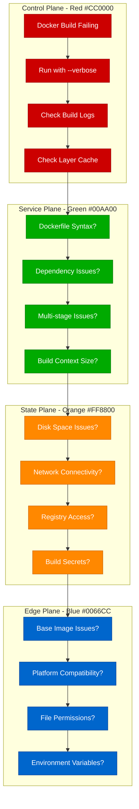

# Docker Build Failures Debugging: Container Build Troubleshooting Guide

## Executive Summary

Docker build failures affect 25% of CI/CD pipelines and are responsible for significant development delays. This guide provides systematic debugging approaches used by teams at Docker Inc, GitHub, and other container-heavy organizations to resolve layer caching, dependency, and multi-stage build issues.

## Systematic Debugging Flowchart



## Common Docker Build Error Patterns

### 1. Layer Caching Issues

**Error Pattern:**
```
Step 5/10 : RUN npm install
 ---> Running in abc123def456
npm ERR! network request failed, reason: connect ECONNREFUSED 127.0.0.1:3128
```

**Investigation Commands:**
```bash
# Build without cache to isolate caching issues
docker build --no-cache -t myapp:latest .

# Check layer cache usage
docker build --progress=plain -t myapp:latest .

# Inspect specific layer
docker history myapp:latest

# Check cache mount usage
docker build --cache-from myapp:cache -t myapp:latest .
```

### 2. Dependency Resolution Failures

**Error Pattern:**
```
Step 8/12 : RUN pip install -r requirements.txt
 ---> Running in xyz789abc123
ERROR: Could not find a version that satisfies the requirement package==1.2.3
```

**Investigation Commands:**
```bash
# Build with verbose output
docker build --progress=plain --no-cache -t myapp:debug .

# Test dependency installation manually
docker run -it --rm python:3.9 /bin/bash
pip install -r requirements.txt

# Check package index connectivity
docker run -it --rm python:3.9 pip index versions <package-name>
```

### 3. Multi-stage Build Issues

**Error Pattern:**
```
Step 15/20 : COPY --from=builder /app/dist ./dist
COPY failed: stat /var/lib/docker/overlay2/.../app/dist: no such file or directory
```

**Investigation Commands:**
```bash
# Check intermediate stage
docker build --target builder -t myapp:builder .
docker run -it --rm myapp:builder /bin/bash

# Inspect build stages
docker build --progress=plain -t myapp:latest .

# Debug specific stage
docker build --target=<stage-name> -t debug:stage .
```

## Step-by-Step Investigation Procedures

### Build Context Analysis

```bash
# Check build context size
du -sh .
du -sh .dockerignore

# List files being sent to Docker daemon
docker build --progress=plain . 2>&1 | grep "transferring context"

# Optimize build context
echo "node_modules" >> .dockerignore
echo ".git" >> .dockerignore
echo "*.log" >> .dockerignore
echo "coverage/" >> .dockerignore
```

### Dockerfile Syntax Validation

```bash
# Validate Dockerfile syntax
docker build --dry-run -f Dockerfile .

# Use hadolint for best practices
docker run --rm -i hadolint/hadolint < Dockerfile

# Check for common issues
grep -n "COPY \." Dockerfile  # Copying entire context
grep -n "RUN.*&&.*RUN" Dockerfile  # Multiple RUN statements
```

### Base Image Investigation

```bash
# Check base image availability
docker pull <base-image>

# Inspect base image layers
docker inspect <base-image>
docker history <base-image>

# Test base image functionality
docker run -it --rm <base-image> /bin/bash

# Check image vulnerabilities
docker scan <base-image>
```

## Root Cause Identification Techniques

### Layer-by-Layer Analysis

```bash
# Build with detailed progress
docker build --progress=plain --no-cache -t debug:latest . 2>&1 | tee build.log

# Examine each layer
docker run -it --rm <layer-id> /bin/bash

# Check layer sizes
docker history debug:latest --human --format "table {{.CreatedBy}}\t{{.Size}}"
```

### Dependency Resolution Debugging

```dockerfile
# Debug Dockerfile example
FROM python:3.9-slim

# Add debugging tools
RUN apt-get update && apt-get install -y \
    curl \
    wget \
    net-tools \
    && rm -rf /var/lib/apt/lists/*

# Test network connectivity
RUN curl -I https://pypi.org/simple/

# Copy requirements first for better caching
COPY requirements.txt .

# Install with verbose output
RUN pip install --verbose -r requirements.txt

# Verify installation
RUN pip list
```

### Network and Registry Issues

```bash
# Test registry connectivity
docker run --rm curlimages/curl:latest curl -I https://index.docker.io/v1/

# Check Docker daemon configuration
docker info | grep -A 10 "Registry Mirrors"

# Test with different DNS
docker build --add-host registry-1.docker.io:52.2.145.97 -t test .

# Check proxy settings
docker build --build-arg HTTP_PROXY=$HTTP_PROXY \
              --build-arg HTTPS_PROXY=$HTTPS_PROXY \
              -t test .
```

## Advanced Debugging Techniques

### Build Kit Enhanced Debugging

```bash
# Enable BuildKit for better debugging
export DOCKER_BUILDKIT=1

# Use buildx for advanced features
docker buildx build --progress=plain \
                   --cache-from type=local,src=/tmp/cache \
                   --cache-to type=local,dest=/tmp/cache \
                   -t myapp:latest .

# Debug with buildx
docker buildx build --debug \
                   --progress=plain \
                   -t myapp:debug .
```

### Interactive Build Debugging

```dockerfile
# Add debugging layer to Dockerfile
FROM node:16-alpine AS debug
RUN apk add --no-cache bash curl
WORKDIR /app
COPY package*.json ./
# Stop here for debugging
RUN sleep infinity

FROM debug AS final
RUN npm ci --only=production
COPY . .
CMD ["npm", "start"]
```

```bash
# Build debug stage and inspect
docker build --target debug -t myapp:debug .
docker run -it --rm myapp:debug /bin/bash

# Inside container, test npm install
npm ci --verbose
```

### Build Performance Analysis

```bash
# Measure build time per step
docker build --progress=plain -t myapp:latest . 2>&1 | \
  awk '/Step/ {step=$0; start=systime()} /---> [a-f0-9]/ {printf "%s took %d seconds\n", step, systime()-start}'

# Use dive for layer analysis
dive myapp:latest

# Analyze build cache efficiency
docker build --cache-from myapp:cache -t myapp:latest . 2>&1 | grep "CACHED"
```

## Fix Implementation Strategies

### Optimized Dockerfile Structure

```dockerfile
# Before: Inefficient caching
FROM node:16-alpine
WORKDIR /app
COPY . .  # This invalidates cache on any file change
RUN npm ci

# After: Optimized for caching
FROM node:16-alpine
WORKDIR /app

# Copy dependency files first
COPY package*.json ./
RUN npm ci --only=production

# Copy application code last
COPY src/ ./src/
COPY public/ ./public/

CMD ["npm", "start"]
```

### Multi-stage Build Optimization

```dockerfile
# Optimized multi-stage build
FROM node:16-alpine AS dependencies
WORKDIR /app
COPY package*.json ./
RUN npm ci --only=production

FROM node:16-alpine AS builder
WORKDIR /app
COPY package*.json ./
RUN npm ci
COPY src/ ./src/
RUN npm run build

FROM node:16-alpine AS runtime
WORKDIR /app
RUN addgroup -g 1001 -S nodejs && \
    adduser -S nextjs -u 1001

# Copy from previous stages
COPY --from=dependencies /app/node_modules ./node_modules
COPY --from=builder /app/dist ./dist
COPY --chown=nextjs:nodejs package*.json ./

USER nextjs
CMD ["npm", "start"]
```

### Build Context Optimization

```dockerignore
# Comprehensive .dockerignore
node_modules/
npm-debug.log*
yarn-debug.log*
yarn-error.log*

# Development files
.git/
.gitignore
README.md
.env.local
.env.development.local
.env.test.local
.env.production.local

# IDE files
.vscode/
.idea/
*.swp
*.swo

# OS generated files
.DS_Store
.DS_Store?
._*
.Spotlight-V100
.Trashes
ehthumbs.db
Thumbs.db

# Test files
coverage/
.nyc_output
test/
spec/

# Build artifacts
dist/
build/
*.tgz
*.tar.gz
```

## Prevention Best Practices

### Dockerfile Linting and Validation

```bash
#!/bin/bash
# validate-dockerfile.sh

echo "🔍 Validating Dockerfile..."

# Check syntax
docker build --dry-run -f Dockerfile . || exit 1

# Lint with hadolint
docker run --rm -i hadolint/hadolint < Dockerfile

# Check for common anti-patterns
echo "🔍 Checking for anti-patterns..."

if grep -q "COPY \. " Dockerfile; then
    echo "❌ Found 'COPY . .' - consider specific file copying"
fi

if grep -q "RUN.*apt-get update.*apt-get install" Dockerfile; then
    if ! grep -q "rm -rf /var/lib/apt/lists" Dockerfile; then
        echo "❌ Found apt-get without cleanup"
    fi
fi

if ! grep -q "USER" Dockerfile; then
    echo "⚠️  No USER directive found - running as root"
fi

echo "✅ Dockerfile validation complete"
```

### Build Monitoring and Metrics

```yaml
# GitHub Actions with build monitoring
name: Docker Build
on: [push, pull_request]

jobs:
  build:
    runs-on: ubuntu-latest
    steps:
    - uses: actions/checkout@v3

    - name: Set up Docker Buildx
      uses: docker/setup-buildx-action@v2

    - name: Build with cache
      uses: docker/build-push-action@v3
      with:
        context: .
        push: false
        tags: myapp:latest
        cache-from: type=gha
        cache-to: type=gha,mode=max
        build-args: |
          BUILDKIT_PROGRESS=plain

    - name: Analyze image
      run: |
        docker history myapp:latest --human
        docker inspect myapp:latest | jq '.[0].Size'
```

### Registry and Connectivity Optimization

```dockerfile
# Multi-registry fallback strategy
FROM --platform=$BUILDPLATFORM node:16-alpine AS base

# Set registry mirrors for reliability
ARG NPM_REGISTRY=https://registry.npmjs.org/
RUN npm config set registry $NPM_REGISTRY

# Use specific package versions
COPY package-lock.json package.json ./
RUN npm ci --only=production --no-audit --no-fund

# Verify installation
RUN npm list --depth=0
```

## Real Production Incident Examples

### Case Study 1: GitHub Actions Registry Timeout (2023)

**Problem:** Docker builds failing in CI with registry timeouts
**Symptoms:**
- Build failures during `npm install` step
- Intermittent success/failure pattern
- 5-minute timeout errors

**Investigation Process:**
```bash
# Local reproduction
docker build --progress=plain --no-cache .

# Registry connectivity test
docker run --rm curlimages/curl:latest curl -w "@curl-format.txt" https://registry.npmjs.org/

# Build with alternative registry
docker build --build-arg NPM_REGISTRY=https://registry.npmjs.org/ .
```

**Root Cause:** Registry rate limiting during peak hours
**Fix:** Implemented registry caching and fallback mirrors
**Prevention:** Added build retry logic and registry health monitoring

### Case Study 2: Docker Hub Rate Limiting (2020)

**Problem:** "toomanyrequests" errors from Docker Hub
**Symptoms:**
- Build failures on base image pull
- Error: "You have reached your pull rate limit"
- Affecting multiple projects simultaneously

**Investigation:**
```bash
# Check rate limit status
TOKEN=$(curl "https://auth.docker.io/token?service=registry.docker.io&scope=repository:ratelimitpreview/test:pull" | jq -r .token)
curl --head -H "Authorization: Bearer $TOKEN" https://registry-1.docker.io/v2/ratelimitpreview/test/manifests/latest
```

**Solution:**
- Implemented Docker Hub authentication
- Added base image caching strategy
- Migrated critical images to private registry

## Critical Monitoring and Alerting

### Build Performance Metrics

```bash
# Build time tracking script
#!/bin/bash

START_TIME=$(date +%s)
docker build -t myapp:latest . || exit 1
END_TIME=$(date +%s)

BUILD_TIME=$((END_TIME - START_TIME))
echo "Build completed in ${BUILD_TIME} seconds"

# Send metrics to monitoring system
curl -X POST "http://metrics-server/build-time" \
  -d "metric=docker_build_duration_seconds&value=${BUILD_TIME}&tags=project=myapp"
```

### Build Success Rate Monitoring

```yaml
# Prometheus metrics for build monitoring
version: '3.8'
services:
  prometheus:
    image: prom/prometheus
    volumes:
    - ./prometheus.yml:/etc/prometheus/prometheus.yml

  # Example build metrics exporter
  build-exporter:
    image: build-metrics-exporter:latest
    environment:
    - DOCKER_HOST=unix:///var/run/docker.sock
    volumes:
    - /var/run/docker.sock:/var/run/docker.sock:ro
```

### Automated Build Validation

```bash
#!/bin/bash
# comprehensive-build-test.sh

echo "🔍 Running comprehensive build tests..."

# Test build without cache
docker build --no-cache -t test:no-cache . || exit 1

# Test build with cache
docker build -t test:cached . || exit 1

# Test multi-platform build
docker buildx build --platform linux/amd64,linux/arm64 -t test:multi . || exit 1

# Security scan
docker scan test:cached || echo "⚠️  Security issues found"

# Size analysis
SIZE=$(docker images test:cached --format "{{.Size}}")
echo "📊 Final image size: $SIZE"

# Functionality test
docker run --rm test:cached /bin/sh -c "command -v node && npm --version" || exit 1

echo "✅ All build tests passed"
```

This debugging guide provides systematic approaches to identifying and resolving Docker build failures, based on real-world experience from containerized production environments.