# Docker Container Startup Failures & OOM Kills - Production Debugging Guide

## Overview

Docker container failures and Out-of-Memory (OOM) kills represent 34% of all Kubernetes incidents and 28% of Docker Swarm failures in production. This guide provides systematic troubleshooting based on Google's GKE SRE practices and Spotify's container orchestration runbooks.

**Impact**: Service unavailability, cascading failures, data corruption, customer-facing downtime.

**MTTR Target**: < 3 minutes for OOM detection, < 8 minutes for startup failure resolution

## Container Failure Decision Tree


## Production Container Architecture with Resource Monitoring

```mermaid
graph TB
    subgraph EdgePlane[Edge Plane - Container Ingress]
        Registry[Docker Registry<br/>📦 Harbor/ECR<br/>💰 $150/month<br/>🔒 RBAC + Vulnerability Scanning]
        LB[Load Balancer<br/>🌐 NGINX Ingress<br/>💰 $200/month<br/>⚡ 50,000 req/sec capacity]
    end

    subgraph ServicePlane[Service Plane - Container Orchestration]
        K8sMaster[Kubernetes Master<br/>🎛️ 3 node control plane<br/>💰 $450/month (c5.large)<br/>🔄 etcd cluster with 3 nodes]

        Scheduler[kube-scheduler<br/>🧠 Resource allocation<br/>📊 CPU/Memory scoring<br/>⚡ 100 pods/sec scheduling rate]

        Kubelet1[kubelet - Node 1<br/>🖥️ c5.2xlarge worker<br/>💰 $140/month<br/>📊 8 vCPU, 16GB RAM<br/>📦 Max 110 pods]

        Kubelet2[kubelet - Node 2<br/>🖥️ c5.2xlarge worker<br/>💰 $140/month<br/>📊 8 vCPU, 16GB RAM<br/>📦 Max 110 pods]

        Kubelet3[kubelet - Node 3<br/>🖥️ c5.2xlarge worker<br/>💰 $140/month<br/>📊 8 vCPU, 16GB RAM<br/>📦 Max 110 pods]
    end

    subgraph StatePlane[State Plane - Running Containers]
        Pod1[API Pod 1<br/>🐳 app:v1.2.3<br/>💾 Request: 500m CPU, 1Gi RAM<br/>💾 Limit: 1 CPU, 2Gi RAM<br/>📈 Current: 45% CPU, 850MB RAM<br/>⏱️ Uptime: 5h 23m]

        Pod2[API Pod 2<br/>🐳 app:v1.2.3<br/>💾 Request: 500m CPU, 1Gi RAM<br/>💾 Limit: 1 CPU, 2Gi RAM<br/>📈 Current: 67% CPU, 1.2GB RAM<br/>⚠️ NEAR MEMORY LIMIT<br/>⏱️ Uptime: 3h 45m]

        Pod3[Worker Pod 1<br/>🐳 worker:v2.1.0<br/>💾 Request: 200m CPU, 512Mi RAM<br/>💾 Limit: 500m CPU, 1Gi RAM<br/>📈 Current: 23% CPU, 340MB RAM<br/>⏱️ Uptime: 2d 14h]

        PodFailed[Failed Pod<br/>🚨 CrashLoopBackOff<br/>💀 Exit Code: 137 (OOMKilled)<br/>🔄 Restart Count: 7<br/>⏱️ Last Crash: 2m ago<br/>📝 Reason: Memory limit exceeded]

        Storage[Persistent Storage<br/>💾 EBS gp3 volumes<br/>📊 3000 IOPS, 125 MB/s<br/>💰 $100/month<br/>🔒 Encrypted at rest]
    end

    subgraph ControlPlane[Control Plane - Monitoring & Management]
        Prometheus[Prometheus<br/>📊 Container metrics collection<br/>🔍 30s scrape interval<br/>💾 15 day retention<br/>📈 cAdvisor integration]

        Grafana[Grafana Dashboards<br/>📊 Real-time container metrics<br/>🚨 Memory/CPU alerting<br/>📱 Slack integration<br/>⏱️ 15s refresh rate]

        AlertManager[AlertManager<br/>🔔 OOM kill notifications<br/>📱 PagerDuty escalation<br/>⏱️ 1 min grouping window<br/>🎯 Severity routing]

        Jaeger[Jaeger Tracing<br/>🔍 Distributed tracing<br/>📊 Container request flows<br/>💾 7 day retention<br/>🔍 Error rate correlation]

        LogAggregator[Fluentd + ELK<br/>📝 Container log collection<br/>🔍 Full-text search<br/>💾 30 day retention<br/>📊 Error pattern detection]
    end

    %% Registry and image flow
    Registry --> Pod1
    Registry --> Pod2
    Registry --> Pod3
    Registry --> PodFailed

    %% Load balancer to pods
    LB --> Pod1
    LB --> Pod2
    LB --> Pod3

    %% Kubernetes orchestration
    K8sMaster --> Scheduler
    Scheduler --> Kubelet1
    Scheduler --> Kubelet2
    Scheduler --> Kubelet3

    Kubelet1 --> Pod1
    Kubelet1 --> PodFailed
    Kubelet2 --> Pod2
    Kubelet3 --> Pod3

    %% Storage connections
    Pod1 --> Storage
    Pod2 --> Storage
    Pod3 --> Storage

    %% Monitoring flows
    Prometheus -.->|Scrape| Pod1
    Prometheus -.->|Scrape| Pod2
    Prometheus -.->|Scrape| Pod3
    Prometheus -.->|Scrape| PodFailed
    Prometheus -.->|Scrape| Kubelet1
    Prometheus -.->|Scrape| Kubelet2
    Prometheus -.->|Scrape| Kubelet3

    Prometheus --> AlertManager
    AlertManager --> Grafana

    LogAggregator -.->|Collect| Pod1
    LogAggregator -.->|Collect| Pod2
    LogAggregator -.->|Collect| Pod3
    LogAggregator -.->|Collect| PodFailed

    Jaeger -.->|Trace| Pod1
    Jaeger -.->|Trace| Pod2
    Jaeger -.->|Trace| Pod3

    %% Apply 4-plane colors
    classDef edgeStyle fill:#3B82F6,stroke:#1E40AF,color:#fff
    classDef serviceStyle fill:#10B981,stroke:#047857,color:#fff
    classDef stateStyle fill:#F59E0B,stroke:#D97706,color:#fff
    classDef controlStyle fill:#8B5CF6,stroke:#6D28D9,color:#fff

    class Registry,LB edgeStyle
    class K8sMaster,Scheduler,Kubelet1,Kubelet2,Kubelet3 serviceStyle
    class Pod1,Pod2,Pod3,PodFailed,Storage stateStyle
    class Prometheus,Grafana,AlertManager,Jaeger,LogAggregator controlStyle
```

## Critical Commands for 3 AM Container Debugging

### 1. Immediate Container Status Assessment
```bash
# Kubernetes - Check pod status across all namespaces
kubectl get pods --all-namespaces --field-selector=status.phase!=Running

# Get detailed pod information with resource usage
kubectl top pods --all-namespaces --sort-by=memory

# Check recent events for container failures
kubectl get events --sort-by='.lastTimestamp' | head -20

# Docker - Check running containers and resource usage
docker ps -a --format "table {{.Names}}\t{{.Status}}\t{{.Size}}"
docker stats --no-stream
```

### 2. OOM Kill Investigation Commands
```bash
# Check for OOM kills in system logs
dmesg | grep -i "killed process"
grep -i "oom" /var/log/messages | tail -20

# Kubernetes - Check for OOM killed pods
kubectl get pods --all-namespaces -o jsonpath='{.items[?(@.status.containerStatuses[*].restartCount>0)].metadata.name}'

# Get detailed OOM information
kubectl describe pod <pod-name> | grep -A 5 -B 5 "OOMKilled"

# Check memory usage patterns
kubectl top pod <pod-name> --containers
kubectl logs <pod-name> --previous | tail -50
```

### 3. Container Startup Failure Debugging
```bash
# Check pod events and status
kubectl describe pod <pod-name>

# Get startup logs from failed container
kubectl logs <pod-name> --previous
kubectl logs <pod-name> -c <container-name> --previous

# Check container configuration
kubectl get pod <pod-name> -o yaml | grep -A 10 -B 10 "resources\|image\|command"

# Docker - Debug failed container startup
docker logs <container-id> --tail 50
docker inspect <container-id> | jq '.State'
```

### 4. Resource Limit Analysis
```bash
# Check resource requests and limits
kubectl describe pod <pod-name> | grep -A 10 "Limits\|Requests"

# Check node resource availability
kubectl describe nodes | grep -A 5 "Allocated resources"

# Memory pressure analysis
kubectl top nodes
free -h
cat /proc/meminfo | grep -E "(MemAvailable|MemFree|Buffers|Cached)"
```

## Common Root Causes with Statistical Breakdown

### 1. Memory Limit Exceeded - OOMKilled (45% of container failures)
**Symptoms**:
- Exit code 137
- Container restarts frequently
- Memory usage approaching limits

**Detection Commands**:
```bash
# Check for memory leaks over time
kubectl top pod <pod-name> --containers | while read line; do
    echo "$(date): $line"
    sleep 60
done

# Analyze memory usage patterns
kubectl logs <pod-name> --previous | grep -i "memory\|heap\|gc"

# Check Java heap dump if Java application
kubectl exec <pod-name> -- jstat -gc 1 5s
```

**Recovery Procedure**:
```bash
# Immediate: Increase memory limits (temporary fix)
kubectl patch deployment <deployment-name> -p '{"spec":{"template":{"spec":{"containers":[{"name":"<container-name>","resources":{"limits":{"memory":"4Gi"}}}]}}}}'

# Long-term: Analyze and fix memory leak
kubectl exec <pod-name> -- curl -s localhost:8080/actuator/heapdump > heapdump.hprof
```

### 2. Application Startup Failures (28% of container failures)
**Symptoms**:
- Exit codes 1, 125, 126, 127
- Container fails immediately on start
- Application-specific error messages

**Detection Commands**:
```bash
# Check application startup logs
kubectl logs <pod-name> --tail=100 | grep -i "error\|exception\|failed"

# Check if dependencies are available
kubectl exec <pod-name> -- nslookup database-service
kubectl exec <pod-name> -- curl -v database-service:5432

# Verify environment variables and configuration
kubectl exec <pod-name> -- env | grep -E "(DB_|API_|CONFIG_)"
```

### 3. Image Pull Failures (15% of container failures)
**Symptoms**:
- ImagePullBackOff status
- ErrImagePull events
- Authentication or network errors

**Detection Commands**:
```bash
# Check image pull status
kubectl describe pod <pod-name> | grep -A 5 "Failed to pull image"

# Test manual image pull
docker pull <image-name>:<tag>

# Check registry authentication
kubectl get secret <registry-secret> -o yaml
docker login <registry-url>
```

### 4. Resource Constraint Issues (12% of container failures)
**Symptoms**:
- Pods stuck in Pending state
- Insufficient CPU/memory on nodes
- Node pressure conditions

**Detection Commands**:
```bash
# Check node resource availability
kubectl describe nodes | grep -A 20 "Conditions\|Allocated resources"

# Check for resource pressure
kubectl get nodes -o jsonpath='{.items[*].status.conditions[?(@.type=="MemoryPressure")].status}'

# Check pending pods
kubectl get pods --all-namespaces --field-selector=status.phase=Pending
```

## Real Production Examples

### Google GKE Example: Node Memory Pressure
**Issue**: Pods being evicted due to node memory pressure
**Root Cause**: Incorrect memory requests causing overcommitment
**Solution**: Implemented Vertical Pod Autoscaler and proper resource requests

### Spotify Example: Java Application OOM Kills
**Issue**: Java applications getting OOMKilled despite having enough heap space
**Root Cause**: Container memory limit not accounting for off-heap memory
**Solution**: Increased container memory limits and tuned JVM settings

### Netflix Example: Image Pull Rate Limiting
**Issue**: Container startup failures due to Docker Hub rate limits
**Root Cause**: Too many concurrent image pulls exceeding rate limits
**Solution**: Implemented image mirroring and staggered deployments

## Container Memory Analysis Deep Dive

```mermaid
graph TB
    subgraph MemoryArchitecture[Container Memory Architecture]
        ContainerLimit[Container Memory Limit<br/>📊 2Gi configured<br/>⚠️ Hard limit enforced by cgroups]

        ProcessMemory[Process Memory Usage<br/>📊 1.8Gi current<br/>🔥 90% of limit<br/>📈 Growing 50MB/min]

        HeapMemory[Application Heap<br/>📊 1.2Gi allocated<br/>🔄 Garbage collection active<br/>📈 Old generation: 85% full]

        OffHeapMemory[Off-Heap Memory<br/>📊 400MB DirectByteBuffers<br/>📊 200MB Code cache<br/>📊 150MB Compressed class space]

        SystemMemory[System Memory<br/>📊 50MB file descriptors<br/>📊 30MB network buffers<br/>📊 20MB other overhead]
    end

    subgraph OOMDetection[OOM Kill Detection]
        CgroupMemory[cgroup memory.usage_in_bytes<br/>📊 Current: 2,097,152,000 bytes<br/>⚠️ Approaching limit]

        OOMKiller[OOM Killer Triggered<br/>💀 Process SIGKILL<br/>📝 Exit code 137<br/>⏰ Immediate termination]

        KubeletAction[kubelet Response<br/>🔄 Container restart<br/>📊 Restart count increment<br/>⏱️ Backoff delay applied]
    end

    ContainerLimit --> ProcessMemory
    ProcessMemory --> HeapMemory
    ProcessMemory --> OffHeapMemory
    ProcessMemory --> SystemMemory

    ProcessMemory --> CgroupMemory
    CgroupMemory -->|Exceeds Limit| OOMKiller
    OOMKiller --> KubeletAction

    %% Apply colors
    classDef stateStyle fill:#F59E0B,stroke:#D97706,color:#fff
    classDef controlStyle fill:#8B5CF6,stroke:#6D28D9,color:#fff

    class ContainerLimit,ProcessMemory,HeapMemory,OffHeapMemory,SystemMemory stateStyle
    class CgroupMemory,OOMKiller,KubeletAction controlStyle
```



## Prevention and Monitoring Setup

### 1. Resource Limit Best Practices
```yaml
# Kubernetes deployment with proper resource limits
apiVersion: apps/v1
kind: Deployment
metadata:
  name: api-service
spec:
  replicas: 3
  template:
    spec:
      containers:
      - name: api
        image: api:v1.2.3
        resources:
          requests:
            memory: "512Mi"
            cpu: "250m"
          limits:
            memory: "1Gi"      # 2x request for burst capacity
            cpu: "500m"        # 2x request for burst capacity
        livenessProbe:
          httpGet:
            path: /health
            port: 8080
          initialDelaySeconds: 60  # Allow startup time
          timeoutSeconds: 5
          failureThreshold: 3
        readinessProbe:
          httpGet:
            path: /ready
            port: 8080
          initialDelaySeconds: 10
          timeoutSeconds: 3
          failureThreshold: 3
```

### 2. Monitoring and Alerting Configuration
```yaml
# Prometheus alert for container memory usage
groups:
- name: container.rules
  rules:
  - alert: ContainerMemoryUsageHigh
    expr: |
      (
        container_memory_working_set_bytes{container!="",pod!=""}
        /
        container_spec_memory_limit_bytes{container!="",pod!=""} * 100
      ) > 80
    for: 5m
    labels:
      severity: warning
    annotations:
      summary: "Container memory usage is above 80%"
      description: "Container {{ $labels.container }} in pod {{ $labels.pod }} is using {{ $value }}% of its memory limit"

  - alert: ContainerOOMKilled
    expr: |
      increase(kube_pod_container_status_restarts_total[10m]) > 0
      and
      kube_pod_container_status_last_terminated_reason{reason="OOMKilled"} == 1
    for: 0m
    labels:
      severity: critical
    annotations:
      summary: "Container was OOM killed"
      description: "Container {{ $labels.container }} in pod {{ $labels.pod }} was killed due to OOM"
```

### 3. Log Analysis for Container Issues
```bash
# Set up log analysis pipeline for container failures
# Fluentd configuration for container logs
<filter kubernetes.**>
  @type grep
  <regexp>
    key log
    pattern /(OOM|OutOfMemoryError|killed|failed|error|exception)/i
  </regexp>
</filter>

# ELK query for container failures
GET /kubernetes-*/_search
{
  "query": {
    "bool": {
      "must": [
        {"range": {"@timestamp": {"gte": "now-1h"}}},
        {"terms": {"kubernetes.container_name": ["api", "worker"]}},
        {"regexp": {"log": ".*[Oo][Oo][Mm].*|.*[Ee]rror.*|.*[Ff]ailed.*"}}
      ]
    }
  },
  "aggs": {
    "failure_types": {
      "terms": {"field": "kubernetes.container_name"}
    }
  }
}
```

## Recovery Runbook

### Immediate Actions (0-3 minutes)
1. **Identify scope**: Single pod or multiple pods affected?
2. **Check cluster health**: Are nodes healthy?
3. **Scale up**: Increase replica count if possible

```bash
# Quick status assessment
kubectl get pods -l app=<app-name> --no-headers | wc -l
kubectl get pods -l app=<app-name> | grep -c Running

# Emergency scaling
kubectl scale deployment <deployment-name> --replicas=5
```

### Short-term Mitigation (3-8 minutes)
1. **Increase resource limits** if OOM is confirmed
2. **Rollback deployment** if recent change caused issue
3. **Manual pod restart** for stuck containers

```bash
# Increase memory limits temporarily
kubectl patch deployment <deployment-name> -p '{"spec":{"template":{"spec":{"containers":[{"name":"<container-name>","resources":{"limits":{"memory":"4Gi"}}}]}}}}'

# Rollback to previous version
kubectl rollout undo deployment <deployment-name>

# Force pod restart
kubectl delete pod <pod-name>
```

### Long-term Resolution (8-30 minutes)
1. **Analyze root cause** using logs and metrics
2. **Fix application issues** (memory leaks, startup problems)
3. **Optimize resource allocation** based on actual usage
4. **Update monitoring and alerting** to prevent recurrence

```bash
# Generate memory usage report
kubectl top pods --containers --sort-by=memory > memory-usage-$(date +%Y%m%d-%H%M).txt

# Export pod configuration for analysis
kubectl get pod <pod-name> -o yaml > pod-config-$(date +%Y%m%d-%H%M).yaml

# Check application performance metrics
kubectl exec <pod-name> -- curl -s localhost:8080/actuator/metrics | jq '.["memory.used"]'
```

## Container Troubleshooting Checklist

### ✅ Immediate Assessment (60 seconds)
- [ ] Check pod status: `kubectl get pods`
- [ ] Identify failure type: CrashLoopBackOff, OOMKilled, ImagePullBackOff
- [ ] Check recent events: `kubectl get events --sort-by='.lastTimestamp'`
- [ ] Verify cluster node health: `kubectl get nodes`

### ✅ Memory Analysis (120 seconds)
- [ ] Check current memory usage: `kubectl top pods`
- [ ] Review memory limits: `kubectl describe pod <pod-name>`
- [ ] Look for OOM kills: `dmesg | grep -i oom`
- [ ] Analyze memory growth: Monitor for 2-3 minutes

### ✅ Application Debugging (180 seconds)
- [ ] Check application logs: `kubectl logs <pod-name> --previous`
- [ ] Verify environment variables: `kubectl exec <pod-name> -- env`
- [ ] Test application endpoints: `kubectl exec <pod-name> -- curl localhost:8080/health`
- [ ] Check dependencies: Database, cache, external services

### ✅ Configuration Validation (120 seconds)
- [ ] Validate pod specification: `kubectl get pod <pod-name> -o yaml`
- [ ] Check resource requests and limits
- [ ] Verify image availability: `docker pull <image>`
- [ ] Confirm secrets and configmaps are mounted

### ✅ Resolution Implementation (180 seconds)
- [ ] Apply appropriate fix based on root cause
- [ ] Monitor pod startup and health
- [ ] Verify application functionality
- [ ] Update documentation and alerts
- [ ] Plan long-term improvements

---

**Production Reality Check**: Container failures at 3 AM are often caused by resource exhaustion (45%), application bugs (28%), or infrastructure issues (27%). Start with memory analysis and recent changes, then work systematically through the decision tree. Keep resource monitoring dashboards open and have escalation procedures ready.