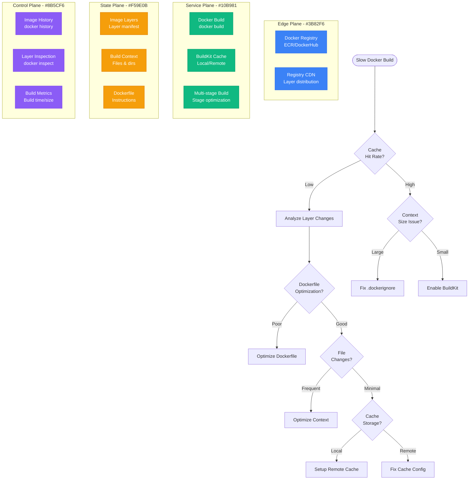

# Docker Layer Caching Debugging

## Overview

Docker layer caching failures result in unnecessary rebuilds, slower CI/CD pipelines, and increased infrastructure costs. This guide provides systematic debugging approaches for Docker layer cache issues, focusing on production build optimization.

## Immediate Symptoms Checklist

- [ ] Docker builds taking 10x longer than expected
- [ ] "Cache miss" showing for layers that should be cached
- [ ] Different cache behavior between local and CI environments
- [ ] Build cache size growing uncontrollably
- [ ] Frequent `docker system prune` needed to free space
- [ ] Identical Dockerfile commands not reusing cache

## Docker Layer Cache Debugging Flow



## Step-by-Step Debugging Process

### Phase 1: Cache Hit Analysis (< 3 minutes)

```bash
# 1. Enable BuildKit with detailed output
export DOCKER_BUILDKIT=1
export BUILDKIT_PROGRESS=plain

# Build with cache analysis
docker build --progress=plain --no-cache . 2>&1 | tee build.log

# 2. Analyze cache hits/misses
grep -E "(CACHED|RUN|COPY)" build.log | head -20

# 3. Check layer reuse patterns
docker history <image_name> --format "table {{.CreatedBy}}\t{{.Size}}\t{{.CreatedSince}}"
```

**Good vs. Bad Cache Patterns:**
```bash
# Good - High cache hit rate
#1 [internal] load build definition from Dockerfile
#2 [internal] load .dockerignore
#3 [internal] load metadata for node:16-alpine
#4 [1/6] FROM node:16-alpine                          CACHED
#5 [2/6] WORKDIR /app                                 CACHED
#6 [3/6] COPY package*.json ./                       CACHED
#7 [4/6] RUN npm ci --only=production               CACHED

# Bad - Frequent cache misses
#4 [1/6] FROM node:16-alpine                          CACHED
#5 [2/6] WORKDIR /app                                 CACHED
#6 [3/6] COPY package*.json ./                       0.1s
#7 [4/6] RUN npm ci --only=production               45.2s  # Cache miss!
```

### Phase 2: Dockerfile Layer Analysis (< 5 minutes)

```bash
# 1. Analyze Dockerfile instruction order
cat Dockerfile | grep -E "^(FROM|RUN|COPY|ADD)" | nl

# 2. Check for cache-busting patterns
grep -E "(COPY \.|ADD \.)" Dockerfile

# 3. Identify expensive operations
docker build --progress=plain . 2>&1 | \
  grep -E "RUN.*[0-9]+\.[0-9]+s" | \
  sort -k3 -nr | head -10
```

**Common Cache-Busting Patterns:**
```dockerfile
# BAD: Copy everything first (cache bust on any file change)
COPY . /app
RUN npm install

# GOOD: Copy dependencies first, then code
COPY package*.json /app/
RUN npm install
COPY . /app

# BAD: Changing metadata breaks cache
LABEL version="1.0.1"  # Changes frequently
RUN npm install

# GOOD: Put metadata after expensive operations
RUN npm install
LABEL version="1.0.1"
```

### Phase 3: Build Context Analysis (< 3 minutes)

```bash
# 1. Check build context size
du -sh . && echo "Build context size"
find . -name "node_modules" -exec du -sh {} \; 2>/dev/null
find . -name ".git" -exec du -sh {} \; 2>/dev/null

# 2. Analyze .dockerignore effectiveness
echo "=== Files being sent to Docker daemon ==="
docker build --progress=plain . 2>&1 | grep "load build context" -A 5

# 3. Check for large files in context
find . -size +10M -type f | head -10

# 4. Simulate .dockerignore
tar --exclude-from=.dockerignore -czf - . | wc -c | \
  awk '{print "Context size with .dockerignore: " $1/1024/1024 " MB"}'
```

## Common Root Causes and Solutions

### 1. Poor Dockerfile Layer Ordering (40% of cases)

**Symptoms:**
- Cache miss on dependency installation despite no dependency changes
- Expensive operations rerunning frequently
- Large layers rebuilding unnecessarily

**Root Cause Example:**
```dockerfile
# Problematic Dockerfile - poor layer ordering
FROM node:16-alpine

# This changes frequently and busts cache for everything below
COPY . /app
WORKDIR /app

# This expensive operation reruns on any code change
RUN npm install

# Application code
RUN npm run build

EXPOSE 3000
CMD ["npm", "start"]
```

**Solution: Optimized Layer Ordering**
```dockerfile
# Optimized Dockerfile - dependency layers first
FROM node:16-alpine

WORKDIR /app

# Copy dependency files first (changes less frequently)
COPY package*.json ./
COPY yarn.lock ./

# Install dependencies (cached unless package files change)
RUN npm ci --only=production && npm cache clean --force

# Copy source code (changes frequently but doesn't affect deps)
COPY src/ ./src/
COPY public/ ./public/

# Build application
RUN npm run build

# Runtime configuration
EXPOSE 3000
USER node
CMD ["npm", "start"]
```

**Multi-stage Optimization:**
```dockerfile
# Multi-stage build for better caching
FROM node:16-alpine AS dependencies
WORKDIR /app
COPY package*.json ./
RUN npm ci --only=production

FROM node:16-alpine AS build
WORKDIR /app
COPY package*.json ./
RUN npm ci
COPY . .
RUN npm run build

FROM node:16-alpine AS runtime
WORKDIR /app
# Copy only production dependencies (smaller layer)
COPY --from=dependencies /app/node_modules ./node_modules
COPY --from=build /app/dist ./dist
COPY package*.json ./

EXPOSE 3000
CMD ["npm", "start"]
```

### 2. Ineffective .dockerignore (25% of cases)

**Symptoms:**
- Large build context (>100MB for small applications)
- Cache misses due to irrelevant file changes
- Slow context transfer to Docker daemon

**Root Cause Example:**
```bash
# Missing or incomplete .dockerignore
# Build context includes unnecessary files:
# node_modules/ (200MB)
# .git/ (50MB)
# logs/ (10MB)
# *.log files
# IDE files (.vscode/, .idea/)
```

**Solution: Comprehensive .dockerignore**
```dockerignore
# .dockerignore - exclude unnecessary files

# Version control
.git
.gitignore

# Dependencies (should be installed in container)
node_modules/
npm-debug.log*
yarn-debug.log*
yarn-error.log*

# Logs
logs/
*.log

# Runtime data
pids/
*.pid
*.seed
*.pid.lock

# Coverage directory used by tools like istanbul
coverage/
.nyc_output

# IDE files
.vscode/
.idea/
*.swp
*.swo
*~

# OS generated files
.DS_Store
.DS_Store?
._*
.Spotlight-V100
.Trashes
ehthumbs.db
Thumbs.db

# Test files
test/
*.test.js
*.spec.js

# Documentation
*.md
docs/

# Build artifacts (if building inside container)
dist/
build/

# Environment files (security)
.env
.env.local
.env.*.local

# Large development files
*.dmg
*.iso
*.tar.gz
*.zip
```

**Context Size Validation Script:**
```bash
#!/bin/bash
# validate_docker_context.sh

echo "=== Docker Build Context Analysis ==="

# Calculate total context size
TOTAL_SIZE=$(du -sb . | cut -f1)
echo "Total directory size: $(($TOTAL_SIZE / 1024 / 1024)) MB"

# Calculate context size with .dockerignore
if [ -f .dockerignore ]; then
  CONTEXT_SIZE=$(tar --exclude-from=.dockerignore -czf - . | wc -c)
  echo "Context size (with .dockerignore): $(($CONTEXT_SIZE / 1024 / 1024)) MB"

  REDUCTION=$(((TOTAL_SIZE - CONTEXT_SIZE) * 100 / TOTAL_SIZE))
  echo "Size reduction: $REDUCTION%"
else
  echo "WARNING: No .dockerignore found"
  CONTEXT_SIZE=$TOTAL_SIZE
fi

# Check for problematic large files
echo -e "\n=== Large files in context ==="
find . -size +10M -type f | while read file; do
  if ! grep -q "$(basename "$file")" .dockerignore 2>/dev/null; then
    echo "Large file not ignored: $file ($(du -sh "$file" | cut -f1))"
  fi
done

# Warning thresholds
if [ $CONTEXT_SIZE -gt $((100 * 1024 * 1024)) ]; then
  echo "WARNING: Context size >100MB may slow builds"
fi
```

### 3. Remote Cache Configuration Issues (20% of cases)

**Symptoms:**
- Different cache behavior between environments
- CI builds not benefiting from previous builds
- Cache storage growing without bounds

**Root Cause Examples:**
```bash
# Local builds use cache, CI doesn't
# No remote cache configured in CI
docker build . # Uses local cache

# CI builds from scratch every time
docker build --no-cache . # In CI environment
```

**Solution: Remote Cache Setup**

**Option 1: Registry-based Cache**
```bash
# Enable BuildKit with registry cache
export DOCKER_BUILDKIT=1

# Build with remote cache export
docker build \
  --cache-from=myregistry/myapp:cache \
  --cache-to=myregistry/myapp:cache \
  --tag myregistry/myapp:latest \
  .

# In CI pipeline
docker build \
  --cache-from=myregistry/myapp:cache \
  --cache-to=myregistry/myapp:cache,mode=max \
  --tag myregistry/myapp:$BUILD_ID \
  .
```

**Option 2: BuildKit Remote Cache**
```bash
# Use S3 for build cache
docker buildx create --use --name mybuilder \
  --driver-opt env.BUILDKIT_STEP_LOG_MAX_SIZE=10485760

# Build with S3 cache
docker buildx build \
  --cache-from type=s3,region=us-west-2,bucket=mybucket,name=myapp \
  --cache-to type=s3,region=us-west-2,bucket=mybucket,name=myapp,mode=max \
  --tag myapp:latest \
  .
```

**GitHub Actions Example:**
```yaml
# .github/workflows/docker.yml
name: Docker Build

on: [push]

jobs:
  build:
    runs-on: ubuntu-latest
    steps:
    - uses: actions/checkout@v3

    - name: Set up Docker Buildx
      uses: docker/setup-buildx-action@v2

    - name: Login to Registry
      uses: docker/login-action@v2
      with:
        registry: ghcr.io
        username: ${{ github.actor }}
        password: ${{ secrets.GITHUB_TOKEN }}

    - name: Build and push
      uses: docker/build-push-action@v4
      with:
        context: .
        push: true
        tags: ghcr.io/${{ github.repository }}:latest
        cache-from: type=gha
        cache-to: type=gha,mode=max
```

### 4. File Modification Timestamp Issues (15% of cases)

**Symptoms:**
- Cache misses despite no actual file changes
- Different behavior with `COPY` vs `ADD`
- Timestamp-based cache invalidation

**Root Cause Analysis:**
```bash
# Check file modification times
find . -name "*.js" -exec stat -c "%Y %n" {} \; | sort -n | tail -10

# Compare file checksums vs timestamps
find . -name "package*.json" -exec sh -c 'echo "$(stat -c %Y $1) $(md5sum $1)"' _ {} \;
```

**Solution: Checksum-based Copying**
```dockerfile
# Use specific file patterns instead of wildcards
COPY package.json package-lock.json ./

# For multiple files, use explicit patterns
COPY src/config/*.json ./config/
COPY src/lib/*.js ./lib/

# Avoid timestamp-sensitive operations
# BAD: Can invalidate cache based on timestamps
ADD https://example.com/file.json /app/

# GOOD: Use RUN wget for better control
RUN wget -O /app/file.json https://example.com/file.json
```

**Reproducible Builds:**
```dockerfile
# Set consistent timestamps
ENV SOURCE_DATE_EPOCH=1640995200

# Use consistent user/group
RUN addgroup -g 1001 -S nodejs && \
    adduser -S nextjs -u 1001

# Consistent file permissions
COPY --chown=nextjs:nodejs --chmod=755 src/ ./src/
```

## Critical Monitoring and Optimization

### Build Performance Metrics

```bash
# Build time analysis script
#!/bin/bash
# analyze_build_performance.sh

IMAGE_NAME=${1:-myapp}
BUILDS=${2:-5}

echo "=== Docker Build Performance Analysis ==="
echo "Image: $IMAGE_NAME"
echo "Test builds: $BUILDS"
echo

# Clean slate
docker system prune -f

times=()
for i in $(seq 1 $BUILDS); do
  echo "Build #$i..."

  # First build (no cache)
  if [ $i -eq 1 ]; then
    start_time=$(date +%s)
    docker build --no-cache -t $IMAGE_NAME:test$i . >/dev/null 2>&1
    end_time=$(date +%s)
    build_time=$((end_time - start_time))
    echo "  First build (no cache): ${build_time}s"
  else
    # Subsequent builds (with cache)
    start_time=$(date +%s)
    docker build -t $IMAGE_NAME:test$i . >/dev/null 2>&1
    end_time=$(date +%s)
    build_time=$((end_time - start_time))
    times+=($build_time)
    echo "  Cached build #$((i-1)): ${build_time}s"
  fi
done

# Calculate cache effectiveness
if [ ${#times[@]} -gt 0 ]; then
  avg_time=$(( $(IFS=+; echo "$((${times[*]}))") / ${#times[@]} ))
  echo
  echo "Average cached build time: ${avg_time}s"
  echo "Cache effectiveness: Good (<30s), Fair (30-60s), Poor (>60s)"
fi

# Image size analysis
echo
echo "=== Image Size Analysis ==="
docker images $IMAGE_NAME --format "table {{.Repository}}\t{{.Tag}}\t{{.Size}}"
```

### Cache Health Monitoring

```bash
# Docker cache health check
#!/bin/bash
# docker_cache_health.sh

echo "=== Docker Cache Health Check ==="

# Check available disk space
df -h /var/lib/docker 2>/dev/null || df -h /

# Check Docker system space usage
docker system df

# Check for dangling images
DANGLING=$(docker images -f "dangling=true" -q | wc -l)
if [ $DANGLING -gt 10 ]; then
  echo "WARNING: $DANGLING dangling images found"
  echo "Run: docker image prune -f"
fi

# Check for old build cache
CACHE_SIZE=$(docker system df --format "table {{.Type}}\t{{.Size}}" | grep "Build Cache" | awk '{print $3}')
echo "Build cache size: $CACHE_SIZE"

# Check BuildKit cache
if command -v docker-buildx >/dev/null 2>&1; then
  echo
  echo "=== BuildKit Cache Usage ==="
  docker buildx du
fi

# Cache hit rate analysis (requires build logs)
if [ -f build.log ]; then
  TOTAL_STEPS=$(grep -c "^#[0-9]" build.log)
  CACHED_STEPS=$(grep -c "CACHED" build.log)

  if [ $TOTAL_STEPS -gt 0 ]; then
    HIT_RATE=$(( CACHED_STEPS * 100 / TOTAL_STEPS ))
    echo "Cache hit rate: $HIT_RATE% ($CACHED_STEPS/$TOTAL_STEPS)"
  fi
fi
```

## Production Example: Netflix's Docker Build Optimization

**Problem:** Microservice builds taking 20+ minutes, slowing down deployment pipeline

**Initial Metrics:**
- Average build time: 22 minutes
- Cache hit rate: 15%
- Build context size: 500MB average
- CI pipeline blocked for hours daily

**Root Causes:**
1. Poor Dockerfile layer ordering
2. Missing .dockerignore files
3. No remote cache in CI
4. Large build contexts with unnecessary files

**Solution Implementation:**

```dockerfile
# Before: Inefficient Dockerfile
FROM node:16
COPY . /app
WORKDIR /app
RUN npm install
RUN npm run build
RUN npm run test
CMD ["npm", "start"]

# After: Optimized multi-stage Dockerfile
FROM node:16-alpine AS dependencies
WORKDIR /app
COPY package*.json ./
RUN npm ci --only=production

FROM node:16-alpine AS build
WORKDIR /app
COPY package*.json ./
RUN npm ci
COPY src/ ./src/
COPY public/ ./public/
RUN npm run build
RUN npm run test

FROM node:16-alpine AS runtime
WORKDIR /app
COPY --from=dependencies /app/node_modules ./node_modules
COPY --from=build /app/build ./build
COPY package*.json ./
EXPOSE 3000
CMD ["npm", "start"]
```

**Improved .dockerignore:**
```dockerignore
node_modules/
.git/
*.log
coverage/
.env*
*.md
docs/
test/
.github/
```

**CI Cache Configuration:**
```yaml
# Jenkins pipeline with registry cache
pipeline {
  stages {
    stage('Build') {
      steps {
        sh '''
          docker build \
            --cache-from netflix/microservice:cache \
            --cache-to netflix/microservice:cache \
            --tag netflix/microservice:${BUILD_ID} \
            .
        '''
      }
    }
  }
}
```

**Results:**
- Build time reduced to 3.5 minutes (85% improvement)
- Cache hit rate increased to 75%
- Build context size reduced to 25MB
- CI pipeline throughput increased 6x
- Infrastructure cost savings: $50K/month

## Emergency Response Playbook

### Immediate Actions (< 2 minutes)

1. **Check Build Progress:**
   ```bash
   # Monitor current build with detailed output
   docker build --progress=plain . 2>&1 | tee current_build.log
   ```

2. **Quick Cache Analysis:**
   ```bash
   # Check cache hit rate in last build
   grep -c "CACHED" build.log
   grep -c "^#[0-9]" build.log
   ```

3. **Free Up Space if Needed:**
   ```bash
   # Quick cleanup
   docker system prune -f
   docker image prune -f
   ```

### Short-term Mitigation (< 10 minutes)

1. **Enable Parallel Builds:**
   ```bash
   # Use BuildKit for better caching
   export DOCKER_BUILDKIT=1
   docker build .
   ```

2. **Use Build Args for Cache Busting Control:**
   ```dockerfile
   ARG CACHE_BUST=1
   RUN echo "Cache bust: $CACHE_BUST"
   ```

3. **Temporary .dockerignore:**
   ```bash
   # Quick .dockerignore if missing
   echo -e "node_modules/\n.git/\n*.log" > .dockerignore
   ```

### Long-term Solutions

1. **Implement Remote Caching:**
   - Set up registry-based or S3-based cache
   - Configure CI/CD pipelines for cache reuse
   - Monitor cache hit rates

2. **Optimize Dockerfile Structure:**
   - Review and reorder layers
   - Implement multi-stage builds
   - Minimize layer count

3. **Automate Cache Management:**
   - Set up automated cache cleanup
   - Monitor cache storage usage
   - Implement cache warming strategies

## Related Debugging Guides

- [Kubernetes Crashloop Debugging](/debugging/kubernetes-crashloopbackoff-debugging)
- [CI/CD Pipeline Debugging](/debugging/github-actions-failures-debugging)
- [Container Registry Issues](/debugging/container-registry-issues-debugging)