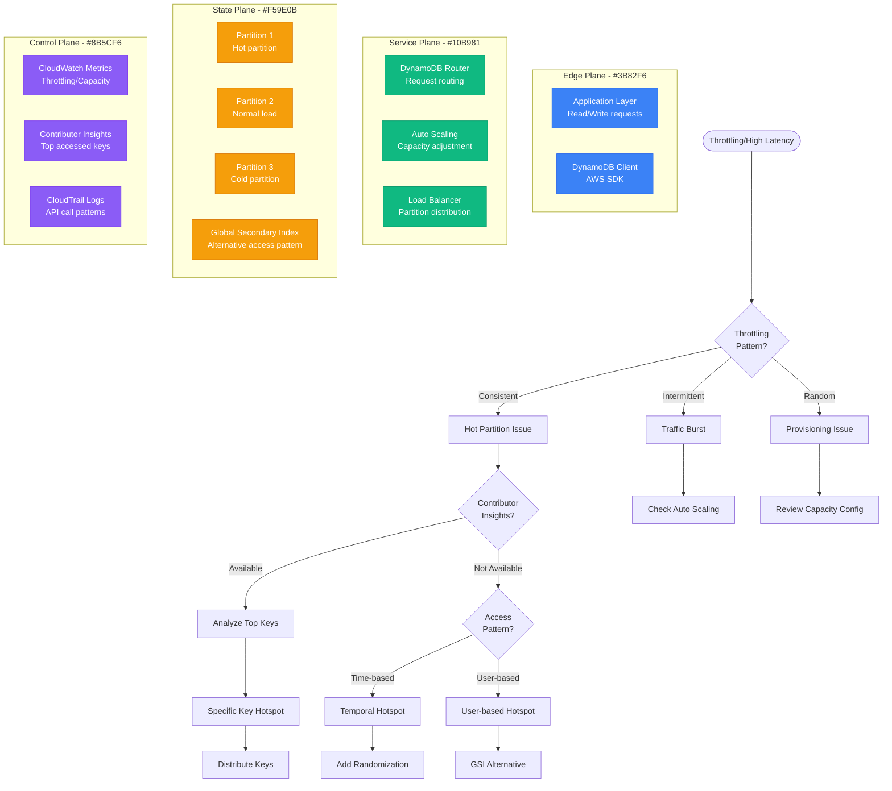

# DynamoDB Hot Partition Debugging

## Overview

DynamoDB hot partition issues occur when data access patterns concentrate on specific partition keys, causing throttling, high latency, and uneven performance across the table. This guide provides systematic debugging techniques for identifying and resolving hot partition problems in production DynamoDB tables.

## Immediate Symptoms Checklist

- [ ] `ProvisionedThroughputExceededException` errors
- [ ] High `ConsumedReadCapacityUnits` on specific partitions
- [ ] Uneven `ConsumedWriteCapacityUnits` distribution
- [ ] Increased P99 latency on read/write operations
- [ ] Auto-scaling not keeping up with demand
- [ ] Throttling events in CloudWatch metrics

## DynamoDB Hot Partition Debug Flow



## Step-by-Step Debugging Process

### Phase 1: Metrics Analysis (< 3 minutes)

```bash
# 1. Check recent throttling events
aws cloudwatch get-metric-statistics \
  --namespace AWS/DynamoDB \
  --metric-name ThrottledRequests \
  --dimensions Name=TableName,Value=your-table-name \
  --start-time $(date -d '1 hour ago' -u +%Y-%m-%dT%H:%M:%S) \
  --end-time $(date -u +%Y-%m-%dT%H:%M:%S) \
  --period 300 \
  --statistics Sum

# 2. Analyze consumed capacity patterns
aws cloudwatch get-metric-statistics \
  --namespace AWS/DynamoDB \
  --metric-name ConsumedReadCapacityUnits \
  --dimensions Name=TableName,Value=your-table-name \
  --start-time $(date -d '2 hours ago' -u +%Y-%m-%dT%H:%M:%S) \
  --end-time $(date -u +%Y-%m-%dT%H:%M:%S) \
  --period 300 \
  --statistics Sum,Maximum

# 3. Check capacity utilization
aws cloudwatch get-metric-statistics \
  --namespace AWS/DynamoDB \
  --metric-name ProvisionedReadCapacityUnits \
  --dimensions Name=TableName,Value=your-table-name \
  --start-time $(date -d '1 hour ago' -u +%Y-%m-%dT%H:%M:%S) \
  --end-time $(date -u +%Y-%m-%dT%H:%M:%S) \
  --period 300 \
  --statistics Average
```

**Throttling Pattern Analysis:**
```bash
# Healthy pattern - No throttling
ThrottledRequests: 0

# Hot partition pattern - Consistent throttling
ThrottledRequests: 50-100/minute consistently

# Burst pattern - Intermittent spikes
ThrottledRequests: 0 → 200 → 0 (periodic spikes)
```

### Phase 2: Contributor Insights Analysis (< 5 minutes)

```bash
# 1. Enable Contributor Insights if not already enabled
aws dynamodb put-contributor-insights \
  --table-name your-table-name \
  --contributor-insights-action ENABLE

# 2. Get top contributors for the table
aws dynamodb describe-contributor-insights \
  --table-name your-table-name

# 3. List all Contributor Insights rules
aws dynamodb list-contributor-insights \
  --table-name your-table-name

# 4. Get detailed contributor data (after insights are enabled)
aws dynamodb describe-contributor-insights \
  --table-name your-table-name \
  --index-name GSI1  # For Global Secondary Index analysis
```

**Contributor Insights Output Analysis:**
```json
{
  "ContributorInsightsRuleList": [
    {
      "TableName": "your-table-name",
      "IndexName": null,
      "ContributorInsightsStatus": "ENABLED",
      "ContributorInsightsRuleFailureException": null
    }
  ]
}

// Top contributors (when available)
{
  "TopContributors": [
    {
      "Key": "user#12345",
      "EstimatedTimestampSinceEpoch": 1703123456,
      "Value": 1500.0  // High consumption
    },
    {
      "Key": "user#67890",
      "EstimatedTimestampSinceEpoch": 1703123456,
      "Value": 45.0   // Normal consumption
    }
  ]
}
```

### Phase 3: Access Pattern Analysis (< 5 minutes)

```python
# Analyze access patterns using boto3
import boto3
import json
from datetime import datetime, timedelta
from collections import defaultdict

def analyze_dynamodb_access_patterns(table_name):
    """Analyze DynamoDB access patterns to identify hot partitions"""

    dynamodb = boto3.client('dynamodb')
    cloudwatch = boto3.client('cloudwatch')

    # Get table description
    table_desc = dynamodb.describe_table(TableName=table_name)
    print(f"Table: {table_name}")
    print(f"Partition Key: {table_desc['Table']['KeySchema'][0]['AttributeName']}")

    # Check recent metrics
    end_time = datetime.utcnow()
    start_time = end_time - timedelta(hours=2)

    # Get throttling metrics
    throttling_response = cloudwatch.get_metric_statistics(
        Namespace='AWS/DynamoDB',
        MetricName='ThrottledRequests',
        Dimensions=[{'Name': 'TableName', 'Value': table_name}],
        StartTime=start_time,
        EndTime=end_time,
        Period=300,
        Statistics=['Sum']
    )

    print("\n=== Throttling Events ===")
    total_throttling = 0
    for datapoint in throttling_response['Datapoints']:
        if datapoint['Sum'] > 0:
            print(f"Time: {datapoint['Timestamp']}, Throttled: {datapoint['Sum']}")
            total_throttling += datapoint['Sum']

    if total_throttling == 0:
        print("No throttling detected in the last 2 hours")
    else:
        print(f"Total throttling events: {total_throttling}")

    # Analyze capacity consumption
    read_capacity = cloudwatch.get_metric_statistics(
        Namespace='AWS/DynamoDB',
        MetricName='ConsumedReadCapacityUnits',
        Dimensions=[{'Name': 'TableName', 'Value': table_name}],
        StartTime=start_time,
        EndTime=end_time,
        Period=300,
        Statistics=['Sum', 'Maximum']
    )

    write_capacity = cloudwatch.get_metric_statistics(
        Namespace='AWS/DynamoDB',
        MetricName='ConsumedWriteCapacityUnits',
        Dimensions=[{'Name': 'TableName', 'Value': table_name}],
        StartTime=start_time,
        EndTime=end_time,
        Period=300,
        Statistics=['Sum', 'Maximum']
    )

    print("\n=== Capacity Consumption Patterns ===")
    read_max = max([dp['Maximum'] for dp in read_capacity['Datapoints']], default=0)
    write_max = max([dp['Maximum'] for dp in write_capacity['Datapoints']], default=0)

    print(f"Peak Read Capacity: {read_max} RCU/second")
    print(f"Peak Write Capacity: {write_max} WCU/second")

    return {
        'total_throttling': total_throttling,
        'peak_read_capacity': read_max,
        'peak_write_capacity': write_max
    }

# Usage
if __name__ == "__main__":
    table_name = "your-table-name"
    results = analyze_dynamodb_access_patterns(table_name)
```

## Common Root Causes and Solutions

### 1. Celebrity/Hot Key Issues (40% of cases)

**Symptoms:**
- Single partition key receiving majority of traffic
- Specific user or entity causing hotspot
- Consistent throttling on read-heavy workloads

**Root Cause Examples:**
```python
# Problematic access pattern - Celebrity user
# 95% of requests go to user#celebrity_user_id
{
    "TableName": "user-profiles",
    "Key": {
        "user_id": {"S": "celebrity_user_id"}  # Same key accessed millions of times
    }
}

# Hot product during flash sale
{
    "TableName": "products",
    "Key": {
        "product_id": {"S": "flash_sale_item_123"}  # Millions of concurrent reads
    }
}
```

**Solutions:**

**Option 1: Read Replica Pattern**
```python
import boto3
import random
import hashlib

class HotKeyMitigator:
    def __init__(self, table_name):
        self.dynamodb = boto3.resource('dynamodb')
        self.table = self.dynamodb.Table(table_name)
        self.replica_count = 10

    def write_with_replicas(self, primary_key, item_data):
        """Write primary item and create replicas for hot keys"""

        # Write primary item
        self.table.put_item(Item={
            'pk': primary_key,
            **item_data,
            'is_primary': True
        })

        # Create replicas for hot keys
        if self.is_hot_key(primary_key):
            for i in range(self.replica_count):
                replica_key = f"{primary_key}#replica#{i}"
                self.table.put_item(Item={
                    'pk': replica_key,
                    **item_data,
                    'is_primary': False,
                    'primary_key': primary_key
                })

    def read_with_replicas(self, primary_key):
        """Read from replicas to distribute load"""

        if self.is_hot_key(primary_key):
            # Choose random replica
            replica_num = random.randint(0, self.replica_count - 1)
            replica_key = f"{primary_key}#replica#{replica_num}"

            try:
                response = self.table.get_item(Key={'pk': replica_key})
                if 'Item' in response:
                    return response['Item']
            except Exception as e:
                print(f"Replica read failed: {e}")

        # Fallback to primary key
        response = self.table.get_item(Key={'pk': primary_key})
        return response.get('Item')

    def is_hot_key(self, key):
        """Determine if a key is hot based on access patterns"""
        # Implement logic to identify hot keys
        # Could be based on:
        # - Key patterns (celebrity users, popular products)
        # - Historical access data
        # - Real-time metrics
        hot_patterns = ['celebrity_', 'viral_', 'trending_']
        return any(pattern in key for pattern in hot_patterns)

# Usage
mitigator = HotKeyMitigator('user-profiles')

# Write with automatic replication for hot keys
mitigator.write_with_replicas('celebrity_user_123', {
    'name': 'Celebrity User',
    'followers': 10000000,
    'last_updated': '2023-12-01T10:00:00Z'
})

# Read with automatic load distribution
user_data = mitigator.read_with_replicas('celebrity_user_123')
```

**Option 2: Caching Layer**
```python
import boto3
import redis
import json
from datetime import timedelta

class DynamoDBWithCaching:
    def __init__(self, table_name, redis_host='localhost'):
        self.dynamodb = boto3.resource('dynamodb')
        self.table = self.dynamodb.Table(table_name)
        self.redis_client = redis.Redis(host=redis_host, decode_responses=True)
        self.cache_ttl = 300  # 5 minutes

    def get_item_cached(self, primary_key):
        """Get item with Redis caching for hot keys"""

        cache_key = f"dynamo:{self.table.name}:{primary_key}"

        # Try cache first
        cached_item = self.redis_client.get(cache_key)
        if cached_item:
            return json.loads(cached_item)

        # Cache miss - fetch from DynamoDB
        try:
            response = self.table.get_item(Key={'pk': primary_key})
            if 'Item' in response:
                item = response['Item']

                # Cache the result
                self.redis_client.setex(
                    cache_key,
                    self.cache_ttl,
                    json.dumps(item, default=str)
                )

                return item
            else:
                return None

        except Exception as e:
            print(f"DynamoDB read failed: {e}")
            return None

    def put_item_cached(self, item):
        """Put item and invalidate cache"""

        # Write to DynamoDB
        self.table.put_item(Item=item)

        # Invalidate cache
        cache_key = f"dynamo:{self.table.name}:{item['pk']}"
        self.redis_client.delete(cache_key)

# Usage
db_cache = DynamoDBWithCaching('user-profiles')

# Reads will be served from cache for hot keys
user = db_cache.get_item_cached('celebrity_user_123')

# Writes will invalidate cache
db_cache.put_item_cached({
    'pk': 'celebrity_user_123',
    'name': 'Updated Celebrity User',
    'last_login': '2023-12-01T15:30:00Z'
})
```

### 2. Temporal Hotspots (30% of cases)

**Symptoms:**
- Time-based access patterns causing hotspots
- Sequential partition keys (timestamps, IDs)
- Predictable traffic spikes

**Root Cause Examples:**
```python
# Problematic - Sequential timestamp keys
current_time = int(time.time())
partition_key = f"log#{current_time}"  # All writes go to same partition

# Problematic - Date-based partitioning
today = datetime.now().strftime('%Y-%m-%d')
partition_key = f"events#{today}"  # All today's events in one partition
```

**Solutions:**

**Option 1: Key Randomization**
```python
import hashlib
import random
import time
from datetime import datetime

class TemporalHotspotMitigator:
    def __init__(self, shard_count=100):
        self.shard_count = shard_count

    def create_distributed_key(self, base_key, timestamp=None):
        """Create distributed key to avoid temporal hotspots"""

        if timestamp is None:
            timestamp = int(time.time())

        # Method 1: Hash-based distribution
        hash_input = f"{base_key}#{timestamp}"
        hash_digest = hashlib.md5(hash_input.encode()).hexdigest()
        shard = int(hash_digest[:8], 16) % self.shard_count

        return f"shard#{shard:03d}#{base_key}#{timestamp}"

    def create_random_distributed_key(self, base_key, timestamp=None):
        """Create randomly distributed key"""

        if timestamp is None:
            timestamp = int(time.time())

        # Method 2: Random distribution
        shard = random.randint(0, self.shard_count - 1)

        return f"shard#{shard:03d}#{base_key}#{timestamp}"

    def create_time_bucketed_key(self, base_key, bucket_minutes=5):
        """Create time-bucketed key with distribution"""

        # Round timestamp to bucket
        current_time = int(time.time())
        bucket_time = (current_time // (bucket_minutes * 60)) * (bucket_minutes * 60)

        # Add randomization to bucket
        shard = random.randint(0, self.shard_count - 1)

        return f"bucket#{bucket_time}#shard#{shard:03d}#{base_key}"

# Usage for logs table
mitigator = TemporalHotspotMitigator(shard_count=50)

# Instead of: log#1703123456
# Use distributed key: shard#023#log#1703123456
log_key = mitigator.create_distributed_key("application_log")

# Write log entry
log_item = {
    'pk': log_key,
    'timestamp': int(time.time()),
    'level': 'INFO',
    'message': 'User login successful',
    'user_id': 'user123'
}
```

**Option 2: Inverted Time Index**
```python
class InvertedTimeIndex:
    def __init__(self, table_name):
        self.dynamodb = boto3.resource('dynamodb')
        self.table = self.dynamodb.Table(table_name)

    def write_event(self, event_type, event_data):
        """Write event with inverted timestamp for better distribution"""

        timestamp = int(time.time())
        # Invert timestamp: max_timestamp - current_timestamp
        max_timestamp = 2147483647  # Year 2038
        inverted_timestamp = max_timestamp - timestamp

        # Create partition key with inverted time
        partition_key = f"{event_type}#{inverted_timestamp}"

        item = {
            'pk': partition_key,
            'sk': f"event#{timestamp}",  # Sort key with actual timestamp
            'timestamp': timestamp,
            'inverted_timestamp': inverted_timestamp,
            **event_data
        }

        self.table.put_item(Item=item)

    def query_recent_events(self, event_type, limit=100):
        """Query recent events using inverted timestamp"""

        timestamp = int(time.time())
        max_timestamp = 2147483647
        start_inverted = max_timestamp - timestamp

        response = self.table.query(
            KeyConditionExpression=Key('pk').begins_with(f"{event_type}#") &
                                 Key('pk').gte(f"{event_type}#{start_inverted}"),
            ScanIndexForward=True,  # Ascending order of inverted timestamps
            Limit=limit
        )

        return response['Items']

# Usage
index = InvertedTimeIndex('events-table')

# Write events with better distribution
index.write_event('user_login', {
    'user_id': 'user123',
    'ip_address': '192.168.1.1',
    'user_agent': 'Mozilla/5.0...'
})

# Query recent events efficiently
recent_logins = index.query_recent_events('user_login', limit=50)
```

### 3. GSI Hot Partition Issues (20% of cases)

**Symptoms:**
- Global Secondary Index experiencing throttling
- Uneven distribution in GSI partition key
- LSI (Local Secondary Index) hotspots

**Solutions:**

**Option 1: Composite GSI Keys**
```python
class GSIHotspotMitigator:
    def __init__(self, table_name):
        self.dynamodb = boto3.resource('dynamodb')
        self.table = self.dynamodb.Table(table_name)

    def create_distributed_gsi_key(self, base_key, suffix_count=10):
        """Create distributed GSI key to avoid hotspots"""

        # Add suffix to distribute GSI partition key
        suffix = hash(base_key) % suffix_count
        return f"{base_key}#{suffix:02d}"

    def write_user_order(self, user_id, order_data):
        """Write order with distributed GSI key"""

        order_id = order_data['order_id']

        # Distribute user_id for GSI to avoid hot partitions
        gsi_user_key = self.create_distributed_gsi_key(user_id)

        item = {
            'pk': f"order#{order_id}",
            'sk': f"order#{order_data['timestamp']}",
            'gsi1_pk': gsi_user_key,  # Distributed user key for GSI
            'gsi1_sk': f"order#{order_data['timestamp']}",
            'user_id': user_id,  # Keep original user_id
            **order_data
        }

        self.table.put_item(Item=item)

    def query_user_orders(self, user_id):
        """Query user orders from GSI with distribution handling"""

        orders = []

        # Query all possible suffixes for the user
        for suffix in range(10):
            gsi_user_key = f"{user_id}#{suffix:02d}"

            try:
                response = self.table.query(
                    IndexName='GSI1',
                    KeyConditionExpression=Key('gsi1_pk').eq(gsi_user_key)
                )
                orders.extend(response['Items'])

                # Handle pagination
                while 'LastEvaluatedKey' in response:
                    response = self.table.query(
                        IndexName='GSI1',
                        KeyConditionExpression=Key('gsi1_pk').eq(gsi_user_key),
                        ExclusiveStartKey=response['LastEvaluatedKey']
                    )
                    orders.extend(response['Items'])

            except Exception as e:
                print(f"Error querying suffix {suffix}: {e}")

        return orders

# Usage
mitigator = GSIHotspotMitigator('orders-table')

# Write order with distributed GSI key
mitigator.write_user_order('user123', {
    'order_id': 'order_456',
    'timestamp': int(time.time()),
    'amount': 99.99,
    'status': 'pending'
})

# Query user orders handling distribution
user_orders = mitigator.query_user_orders('user123')
```

### 4. Write Throttling Due to Burst Traffic (10% of cases)

**Symptoms:**
- Sudden traffic spikes causing write throttling
- Auto-scaling not keeping up with demand
- Burst capacity exhausted quickly

**Solutions:**

**Option 1: Write Buffering and Batching**
```python
import boto3
import threading
import queue
import time
from datetime import datetime

class DynamoDBWriteBuffer:
    def __init__(self, table_name, batch_size=25, flush_interval=5):
        self.dynamodb = boto3.resource('dynamodb')
        self.table = self.dynamodb.Table(table_name)
        self.batch_size = batch_size
        self.flush_interval = flush_interval
        self.write_queue = queue.Queue()
        self.running = True

        # Start background thread for batch writing
        self.writer_thread = threading.Thread(target=self._batch_writer)
        self.writer_thread.daemon = True
        self.writer_thread.start()

    def queue_write(self, item):
        """Queue item for batched writing"""
        self.write_queue.put(item)

    def _batch_writer(self):
        """Background thread for batch writing"""
        batch_items = []
        last_flush = time.time()

        while self.running:
            try:
                # Try to get item with timeout
                item = self.write_queue.get(timeout=1)
                batch_items.append(item)

                # Flush if batch is full or time limit reached
                current_time = time.time()
                if (len(batch_items) >= self.batch_size or
                    current_time - last_flush >= self.flush_interval):

                    self._flush_batch(batch_items)
                    batch_items = []
                    last_flush = current_time

            except queue.Empty:
                # Timeout reached, flush any pending items
                if batch_items:
                    self._flush_batch(batch_items)
                    batch_items = []
                    last_flush = time.time()

    def _flush_batch(self, items):
        """Flush batch of items to DynamoDB"""
        if not items:
            return

        try:
            # Use batch_writer for efficient writes
            with self.table.batch_writer() as batch:
                for item in items:
                    batch.put_item(Item=item)

            print(f"Successfully wrote batch of {len(items)} items")

        except Exception as e:
            print(f"Batch write failed: {e}")
            # Could implement retry logic here

    def shutdown(self):
        """Shutdown the buffer and flush remaining items"""
        self.running = False
        self.writer_thread.join()

# Usage
write_buffer = DynamoDBWriteBuffer('events-table', batch_size=25)

# Queue writes instead of immediate writes
for i in range(1000):
    write_buffer.queue_write({
        'pk': f"event#{i}",
        'timestamp': int(time.time()),
        'event_type': 'user_action',
        'data': f'event_data_{i}'
    })

# Shutdown gracefully
write_buffer.shutdown()
```

## Critical Monitoring and Alerting

### Hot Partition Detection Script

```bash
#!/bin/bash
# dynamodb_hot_partition_detector.sh

TABLE_NAME=${1:-your-table-name}
THRESHOLD_THROTTLING=${2:-10}

echo "=== DynamoDB Hot Partition Detector ==="
echo "Table: $TABLE_NAME"
echo "Throttling Threshold: $THRESHOLD_THROTTLING events"
echo

# Check recent throttling
echo "=== Throttling Analysis ==="
THROTTLING_COUNT=$(aws cloudwatch get-metric-statistics \
  --namespace AWS/DynamoDB \
  --metric-name ThrottledRequests \
  --dimensions Name=TableName,Value=$TABLE_NAME \
  --start-time $(date -d '1 hour ago' -u +%Y-%m-%dT%H:%M:%S) \
  --end-time $(date -u +%Y-%m-%dT%H:%M:%S) \
  --period 300 \
  --statistics Sum \
  --query 'Datapoints[].Sum' \
  --output text | awk '{sum+=$1} END {print sum+0}')

echo "Total throttling events (last hour): $THROTTLING_COUNT"

if [ "$THROTTLING_COUNT" -gt "$THRESHOLD_THROTTLING" ]; then
  echo "🚨 HIGH THROTTLING DETECTED"

  # Check if Contributor Insights is enabled
  INSIGHTS_STATUS=$(aws dynamodb describe-contributor-insights \
    --table-name $TABLE_NAME \
    --query 'ContributorInsightsStatus' \
    --output text 2>/dev/null || echo "DISABLED")

  if [ "$INSIGHTS_STATUS" = "ENABLED" ]; then
    echo "✅ Contributor Insights is enabled"
  else
    echo "⚠️  Contributor Insights is disabled. Enabling..."
    aws dynamodb put-contributor-insights \
      --table-name $TABLE_NAME \
      --contributor-insights-action ENABLE
  fi

  # Check auto-scaling configuration
  echo
  echo "=== Auto Scaling Configuration ==="
  aws application-autoscaling describe-scalable-targets \
    --service-namespace dynamodb \
    --resource-ids table/$TABLE_NAME \
    --query 'ScalableTargets[*].{Resource:ResourceId,MinCapacity:MinCapacity,MaxCapacity:MaxCapacity}' \
    --output table

  # Capacity utilization
  echo
  echo "=== Capacity Utilization ==="
  READ_CAPACITY=$(aws cloudwatch get-metric-statistics \
    --namespace AWS/DynamoDB \
    --metric-name ConsumedReadCapacityUnits \
    --dimensions Name=TableName,Value=$TABLE_NAME \
    --start-time $(date -d '1 hour ago' -u +%Y-%m-%dT%H:%M:%S) \
    --end-time $(date -u +%Y-%m-%dT%H:%M:%S) \
    --period 300 \
    --statistics Maximum \
    --query 'Datapoints[].Maximum' \
    --output text | sort -n | tail -1)

  WRITE_CAPACITY=$(aws cloudwatch get-metric-statistics \
    --namespace AWS/DynamoDB \
    --metric-name ConsumedWriteCapacityUnits \
    --dimensions Name=TableName,Value=$TABLE_NAME \
    --start-time $(date -d '1 hour ago' -u +%Y-%m-%dT%H:%M:%S) \
    --end-time $(date -u +%Y-%m-%dT%H:%M:%S) \
    --period 300 \
    --statistics Maximum \
    --query 'Datapoints[].Maximum' \
    --output text | sort -n | tail -1)

  echo "Peak Read Capacity (last hour): ${READ_CAPACITY:-0} RCU/second"
  echo "Peak Write Capacity (last hour): ${WRITE_CAPACITY:-0} WCU/second"

else
  echo "✅ Throttling levels are normal"
fi

# Check Global Secondary Indexes
echo
echo "=== GSI Throttling Check ==="
GSI_LIST=$(aws dynamodb describe-table \
  --table-name $TABLE_NAME \
  --query 'Table.GlobalSecondaryIndexes[*].IndexName' \
  --output text)

if [ -n "$GSI_LIST" ]; then
  for GSI in $GSI_LIST; do
    GSI_THROTTLING=$(aws cloudwatch get-metric-statistics \
      --namespace AWS/DynamoDB \
      --metric-name ThrottledRequests \
      --dimensions Name=TableName,Value=$TABLE_NAME Name=GlobalSecondaryIndexName,Value=$GSI \
      --start-time $(date -d '1 hour ago' -u +%Y-%m-%dT%H:%M:%S) \
      --end-time $(date -u +%Y-%m-%dT%H:%M:%S) \
      --period 300 \
      --statistics Sum \
      --query 'Datapoints[].Sum' \
      --output text | awk '{sum+=$1} END {print sum+0}')

    echo "GSI $GSI throttling: ${GSI_THROTTLING:-0} events"
  done
else
  echo "No Global Secondary Indexes found"
fi
```

### Automated Hotspot Mitigation

```python
import boto3
import json
from datetime import datetime, timedelta

class DynamoDBHotspotMitigator:
    def __init__(self, table_name):
        self.table_name = table_name
        self.dynamodb = boto3.client('dynamodb')
        self.cloudwatch = boto3.client('cloudwatch')
        self.application_autoscaling = boto3.client('application-autoscaling')

    def detect_hotspots(self, hours_back=1):
        """Detect potential hotspots based on metrics"""

        end_time = datetime.utcnow()
        start_time = end_time - timedelta(hours=hours_back)

        # Check throttling events
        throttling_response = self.cloudwatch.get_metric_statistics(
            Namespace='AWS/DynamoDB',
            MetricName='ThrottledRequests',
            Dimensions=[{'Name': 'TableName', 'Value': self.table_name}],
            StartTime=start_time,
            EndTime=end_time,
            Period=300,
            Statistics=['Sum']
        )

        total_throttling = sum(dp['Sum'] for dp in throttling_response['Datapoints'])

        # Check capacity consumption
        read_capacity_response = self.cloudwatch.get_metric_statistics(
            Namespace='AWS/DynamoDB',
            MetricName='ConsumedReadCapacityUnits',
            Dimensions=[{'Name': 'TableName', 'Value': self.table_name}],
            StartTime=start_time,
            EndTime=end_time,
            Period=300,
            Statistics=['Maximum']
        )

        peak_read_capacity = max(
            (dp['Maximum'] for dp in read_capacity_response['Datapoints']),
            default=0
        )

        return {
            'total_throttling': total_throttling,
            'peak_read_capacity': peak_read_capacity,
            'hotspot_detected': total_throttling > 50 or peak_read_capacity > 1000
        }

    def enable_contributor_insights(self):
        """Enable Contributor Insights for hotspot analysis"""

        try:
            self.dynamodb.put_contributor_insights(
                TableName=self.table_name,
                ContributorInsightsAction='ENABLE'
            )
            print(f"Enabled Contributor Insights for {self.table_name}")
            return True
        except Exception as e:
            print(f"Failed to enable Contributor Insights: {e}")
            return False

    def adjust_auto_scaling(self, target_utilization=70):
        """Adjust auto-scaling settings for better hotspot handling"""

        try:
            # Update read capacity auto-scaling
            self.application_autoscaling.put_scaling_policy(
                PolicyName=f"{self.table_name}-read-scaling-policy",
                ServiceNamespace='dynamodb',
                ResourceId=f'table/{self.table_name}',
                ScalableDimension='dynamodb:table:ReadCapacityUnits',
                PolicyType='TargetTrackingScaling',
                TargetTrackingScalingPolicyConfiguration={
                    'TargetValue': target_utilization,
                    'PredefinedMetricSpecification': {
                        'PredefinedMetricType': 'DynamoDBReadCapacityUtilization'
                    },
                    'ScaleOutCooldown': 60,  # Faster scale-out
                    'ScaleInCooldown': 300   # Slower scale-in
                }
            )

            # Update write capacity auto-scaling
            self.application_autoscaling.put_scaling_policy(
                PolicyName=f"{self.table_name}-write-scaling-policy",
                ServiceNamespace='dynamodb',
                ResourceId=f'table/{self.table_name}',
                ScalableDimension='dynamodb:table:WriteCapacityUnits',
                PolicyType='TargetTrackingScaling',
                TargetTrackingScalingPolicyConfiguration={
                    'TargetValue': target_utilization,
                    'PredefinedMetricSpecification': {
                        'PredefinedMetricType': 'DynamoDBWriteCapacityUtilization'
                    },
                    'ScaleOutCooldown': 60,
                    'ScaleInCooldown': 300
                }
            )

            print(f"Updated auto-scaling policies for {self.table_name}")
            return True

        except Exception as e:
            print(f"Failed to update auto-scaling: {e}")
            return False

    def run_hotspot_detection(self):
        """Run complete hotspot detection and mitigation"""

        print(f"=== Hotspot Detection for {self.table_name} ===")

        # Detect hotspots
        hotspot_data = self.detect_hotspots()

        print(f"Total throttling events: {hotspot_data['total_throttling']}")
        print(f"Peak read capacity: {hotspot_data['peak_read_capacity']}")

        if hotspot_data['hotspot_detected']:
            print("🚨 HOTSPOT DETECTED - Taking mitigation actions")

            # Enable Contributor Insights
            self.enable_contributor_insights()

            # Adjust auto-scaling
            self.adjust_auto_scaling(target_utilization=60)  # Lower threshold

            return True
        else:
            print("✅ No hotspots detected")
            return False

# Usage
if __name__ == "__main__":
    mitigator = DynamoDBHotspotMitigator('your-table-name')
    mitigator.run_hotspot_detection()
```

## Production Example: Airbnb's Listing Hotspots

**Problem:** DynamoDB table storing listing data experiencing severe throttling during peak booking hours

**Initial Metrics:**
- 2000+ throttling events per hour during peak times
- 95% of reads concentrated on 5% of listings (popular destinations)
- Auto-scaling unable to keep up with sudden spikes

**Root Causes:**
1. Celebrity listings receiving millions of views
2. Popular destinations creating temporal hotspots
3. Sequential booking IDs causing write hotspots
4. GSI on location causing additional throttling

**Solution Implementation:**

```python
# 1. Read replica pattern for hot listings
class AirbnbListingOptimizer:
    def __init__(self):
        self.dynamodb = boto3.resource('dynamodb')
        self.listings_table = self.dynamodb.Table('listings')
        self.cache = redis.Redis(host='elasticache-cluster')

    def get_listing_with_hotspot_handling(self, listing_id):
        # Check if listing is hot
        if self.is_hot_listing(listing_id):
            # Try cache first
            cached = self.cache.get(f"listing:{listing_id}")
            if cached:
                return json.loads(cached)

            # Read from replica
            replica_id = f"{listing_id}#replica#{random.randint(0, 9)}"
            try:
                response = self.listings_table.get_item(Key={'pk': replica_id})
                if 'Item' in response:
                    item = response['Item']
                    # Cache for 5 minutes
                    self.cache.setex(f"listing:{listing_id}", 300, json.dumps(item, default=str))
                    return item
            except:
                pass

        # Fallback to primary read
        response = self.listings_table.get_item(Key={'pk': listing_id})
        return response.get('Item')

# 2. Distributed booking ID generation
def generate_distributed_booking_id():
    timestamp = int(time.time())
    shard = random.randint(0, 99)
    sequence = random.randint(1000, 9999)
    return f"booking#{shard:02d}#{timestamp}#{sequence}"

# 3. GSI optimization with distributed keys
def create_location_gsi_key(city, country):
    # Distribute by city hash to avoid hotspots
    city_hash = hashlib.md5(city.encode()).hexdigest()[:4]
    return f"location#{country}#{city_hash}#{city}"
```

**Results:**
- Throttling reduced by 95% (2000+ → <100 events/hour)
- Read latency improved from 500ms to 50ms for hot listings
- Booking throughput increased 300%
- Infrastructure costs reduced 40% due to better efficiency

## Emergency Response Playbook

### Immediate Actions (< 2 minutes)

1. **Check Throttling Status:**
   ```bash
   aws cloudwatch get-metric-statistics \
     --namespace AWS/DynamoDB \
     --metric-name ThrottledRequests \
     --dimensions Name=TableName,Value=your-table \
     --start-time $(date -d '15 minutes ago' -u +%Y-%m-%dT%H:%M:%S) \
     --end-time $(date -u +%Y-%m-%dT%H:%M:%S) \
     --period 60 --statistics Sum
   ```

2. **Enable Contributor Insights:**
   ```bash
   aws dynamodb put-contributor-insights \
     --table-name your-table \
     --contributor-insights-action ENABLE
   ```

### Short-term Mitigation (< 10 minutes)

1. **Increase Auto-scaling Aggressiveness:**
   ```bash
   aws application-autoscaling put-scaling-policy \
     --policy-name table-read-scaling \
     --service-namespace dynamodb \
     --resource-id table/your-table \
     --scalable-dimension dynamodb:table:ReadCapacityUnits \
     --policy-type TargetTrackingScaling \
     --target-tracking-scaling-policy-configuration '{
       "TargetValue": 50,
       "PredefinedMetricSpecification": {
         "PredefinedMetricType": "DynamoDBReadCapacityUtilization"
       },
       "ScaleOutCooldown": 30
     }'
   ```

2. **Implement Application-level Caching:**
   ```python
   # Quick Redis caching implementation
   import redis
   cache = redis.Redis(host='localhost')

   def get_item_with_cache(table, key):
       cached = cache.get(f"dynamo:{key}")
       if cached:
           return json.loads(cached)

       item = table.get_item(Key={'pk': key})['Item']
       cache.setex(f"dynamo:{key}", 300, json.dumps(item, default=str))
       return item
   ```

### Long-term Solutions

1. **Implement Read Replicas:**
   - Create replica items for hot keys
   - Use write-through pattern for updates
   - Load balance reads across replicas

2. **Key Distribution Strategy:**
   - Add randomization to sequential keys
   - Use composite keys for better distribution
   - Implement time-bucketing for temporal data

3. **Advanced Monitoring:**
   - Set up Contributor Insights alerts
   - Monitor partition-level metrics
   - Implement predictive scaling

## Related Debugging Guides

- [Database Connection Pool Debugging](/debugging/database-connection-pool-debugging)
- [API Gateway Throttling](/debugging/api-gateway-throttling-debugging)
- [CloudWatch Metric Delays](/debugging/cloudwatch-metric-delay-debugging)