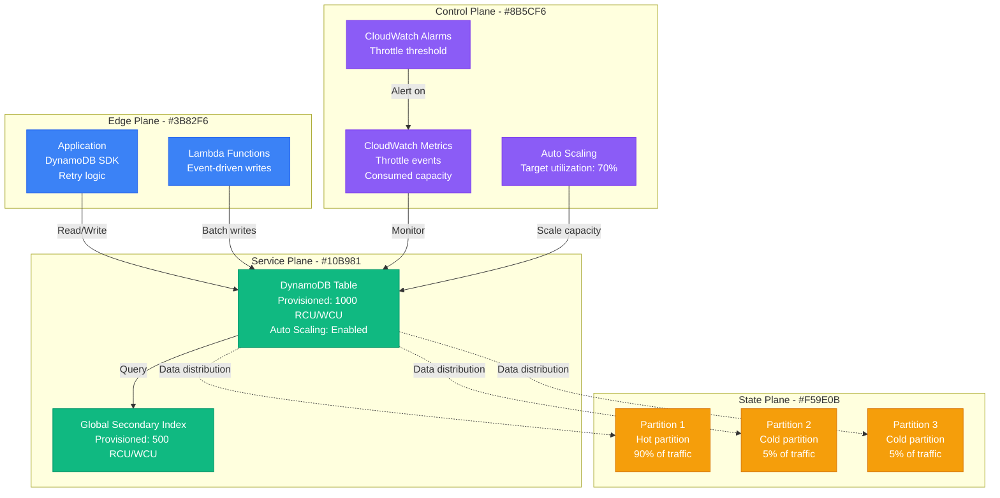

# DynamoDB Throttling Debugging

**Scenario**: Production DynamoDB tables experiencing throttling, causing application errors and performance degradation.

**The 3 AM Reality**: Applications timing out on database operations, ProvisionedThroughputExceededException errors, and user-facing feature failures.

## Symptoms Checklist

- [ ] ProvisionedThroughputExceededException in application logs
- [ ] Increased DynamoDB response times
- [ ] CloudWatch throttle metrics showing spikes
- [ ] Application retry logic being triggered frequently
- [ ] Hot partition warnings in DynamoDB console

## DynamoDB Throttling Architecture



## Critical Commands & Analysis

### CloudWatch Metrics Analysis
```bash
# Check throttle events
aws cloudwatch get-metric-statistics \
    --namespace AWS/DynamoDB \
    --metric-name ReadThrottleEvents \
    --dimensions Name=TableName,Value=MyTable \
    --start-time 2023-01-01T00:00:00Z \
    --end-time 2023-01-01T23:59:59Z \
    --period 300 \
    --statistics Sum

# Monitor consumed vs provisioned capacity
aws cloudwatch get-metric-statistics \
    --namespace AWS/DynamoDB \
    --metric-name ConsumedReadCapacityUnits \
    --dimensions Name=TableName,Value=MyTable \
    --start-time 2023-01-01T00:00:00Z \
    --end-time 2023-01-01T23:59:59Z \
    --period 300 \
    --statistics Average,Maximum

# Check auto scaling activities
aws application-autoscaling describe-scaling-activities \
    --service-namespace dynamodb \
    --resource-id table/MyTable
```

### DynamoDB Table Analysis
```bash
# Get table description
aws dynamodb describe-table --table-name MyTable

# Check table capacity settings
aws dynamodb describe-table --table-name MyTable \
    --query 'Table.{ReadCapacity:ProvisionedThroughput.ReadCapacityUnits,WriteCapacity:ProvisionedThroughput.WriteCapacityUnits}'

# Monitor item access patterns
aws dynamodb describe-table --table-name MyTable \
    --query 'Table.GlobalSecondaryIndexes[*].{IndexName:IndexName,ReadCapacity:ProvisionedThroughput.ReadCapacityUnits,WriteCapacity:ProvisionedThroughput.WriteCapacityUnits}'
```

## Common Root Causes & Solutions

### 1. Hot Partition Key (40% of cases)
```python
# Detection: Check access patterns
import boto3

cloudwatch = boto3.client('cloudwatch')

# Get partition key distribution
def analyze_partition_distribution():
    # This requires DynamoDB Contributor Insights
    response = cloudwatch.get_metric_statistics(
        Namespace='AWS/DynamoDB',
        MetricName='HotPartitionReadThrottleEvents',
        Dimensions=[{'Name': 'TableName', 'Value': 'MyTable'}],
        StartTime=datetime.utcnow() - timedelta(hours=1),
        EndTime=datetime.utcnow(),
        Period=300,
        Statistics=['Sum']
    )

# Solution: Improve partition key design
# Bad: Using timestamp as partition key
# partition_key = datetime.now().strftime("%Y-%m-%d")

# Good: Add randomization
import hashlib
import random

def generate_partition_key(user_id):
    # Add random suffix to distribute load
    suffix = random.randint(0, 9)
    return f"{user_id}#{suffix}"

# Query all partitions for user
def query_user_data(user_id):
    items = []
    for suffix in range(10):
        partition_key = f"{user_id}#{suffix}"
        # Query each partition
        response = dynamodb.query(
            TableName='MyTable',
            KeyConditionExpression='partition_key = :pk',
            ExpressionAttributeValues={':pk': partition_key}
        )
        items.extend(response['Items'])
    return items
```

### 2. Insufficient Provisioned Capacity (30% of cases)
```bash
# Emergency capacity increase
aws dynamodb update-table \
    --table-name MyTable \
    --provisioned-throughput ReadCapacityUnits=2000,WriteCapacityUnits=2000

# Enable auto scaling
aws application-autoscaling register-scalable-target \
    --service-namespace dynamodb \
    --resource-id table/MyTable \
    --scalable-dimension dynamodb:table:ReadCapacityUnits \
    --min-capacity 100 \
    --max-capacity 4000

# Create scaling policy
aws application-autoscaling put-scaling-policy \
    --service-namespace dynamodb \
    --resource-id table/MyTable \
    --scalable-dimension dynamodb:table:ReadCapacityUnits \
    --policy-name ReadCapacityScalingPolicy \
    --policy-type TargetTrackingScaling \
    --target-tracking-scaling-policy-configuration '{
        "TargetValue": 70.0,
        "PredefinedMetricSpecification": {
            "PredefinedMetricType": "DynamoDBReadCapacityUtilization"
        }
    }'
```

### 3. Inefficient Query Patterns (20% of cases)
```python
# Bad: Full table scan
def get_user_orders_bad(user_id):
    response = dynamodb.scan(
        TableName='Orders',
        FilterExpression='user_id = :uid',
        ExpressionAttributeValues={':uid': user_id}
    )
    return response['Items']

# Good: Use proper key design
def get_user_orders_good(user_id):
    response = dynamodb.query(
        TableName='Orders',
        IndexName='UserIdIndex',  # GSI with user_id as partition key
        KeyConditionExpression='user_id = :uid',
        ExpressionAttributeValues={':uid': user_id}
    )
    return response['Items']

# Batch operations for efficiency
def batch_get_items(item_keys):
    response = dynamodb.batch_get_item(
        RequestItems={
            'MyTable': {
                'Keys': item_keys
            }
        }
    )
    return response['Responses']['MyTable']
```

### 4. GSI Throttling (7% of cases)
```bash
# Check GSI capacity
aws dynamodb describe-table --table-name MyTable \
    --query 'Table.GlobalSecondaryIndexes[*].{IndexName:IndexName,ReadCapacity:ProvisionedThroughput.ReadCapacityUnits,WriteCapacity:ProvisionedThroughput.WriteCapacityUnits}'

# Update GSI capacity
aws dynamodb update-table \
    --table-name MyTable \
    --global-secondary-index-updates '[{
        "Update": {
            "IndexName": "UserIdIndex",
            "ProvisionedThroughput": {
                "ReadCapacityUnits": 1000,
                "WriteCapacityUnits": 1000
            }
        }
    }]'
```

### 5. Burst Capacity Exhaustion (3% of cases)
```python
# Implement exponential backoff
import boto3
import time
import random
from botocore.exceptions import ClientError

def dynamodb_operation_with_backoff(operation, max_retries=5):
    for attempt in range(max_retries):
        try:
            return operation()
        except ClientError as e:
            if e.response['Error']['Code'] == 'ProvisionedThroughputExceededException':
                if attempt < max_retries - 1:
                    # Exponential backoff with jitter
                    delay = (2 ** attempt) + random.uniform(0, 1)
                    time.sleep(delay)
                    continue
            raise e

# Usage
def safe_put_item(item):
    return dynamodb_operation_with_backoff(
        lambda: dynamodb.put_item(TableName='MyTable', Item=item)
    )
```

## Immediate Mitigation

### Emergency Response
```bash
# Increase table capacity immediately
aws dynamodb update-table \
    --table-name MyTable \
    --provisioned-throughput ReadCapacityUnits=5000,WriteCapacityUnits=5000

# Enable contributor insights for hot partition analysis
aws dynamodb put-contributor-insights \
    --table-name MyTable \
    --contributor-insights-specification TableName=MyTable,ContributorInsightsAction=ENABLE

# Check current throttle rate
aws cloudwatch get-metric-statistics \
    --namespace AWS/DynamoDB \
    --metric-name ReadThrottleEvents \
    --dimensions Name=TableName,Value=MyTable \
    --start-time $(date -u -d '1 hour ago' +%Y-%m-%dT%H:%M:%SZ) \
    --end-time $(date -u +%Y-%m-%dT%H:%M:%SZ) \
    --period 300 \
    --statistics Sum
```

## Production Examples

### Uber's Surge Pricing Throttling (2019)
- **Incident**: DynamoDB throttling during New Year's Eve surge
- **Root Cause**: Hot partition on timestamp-based partition key
- **Impact**: Surge pricing calculations failed, revenue loss
- **Resolution**: Redesigned partition key with geographic distribution
- **Prevention**: Load testing with realistic traffic patterns

### Airbnb's Search Throttling (2020)
- **Incident**: Search feature throttling during travel surge post-lockdown
- **Root Cause**: GSI capacity insufficient for search query volume
- **Impact**: Search results incomplete or timeout for 25% of users
- **Resolution**: Increased GSI capacity, implemented search result caching
- **Learning**: GSI capacity planning must consider query patterns

**Remember**: DynamoDB throttling is often a design issue rather than just capacity. Focus on partition key distribution, efficient access patterns, and proper capacity planning. Always implement exponential backoff in your application code.