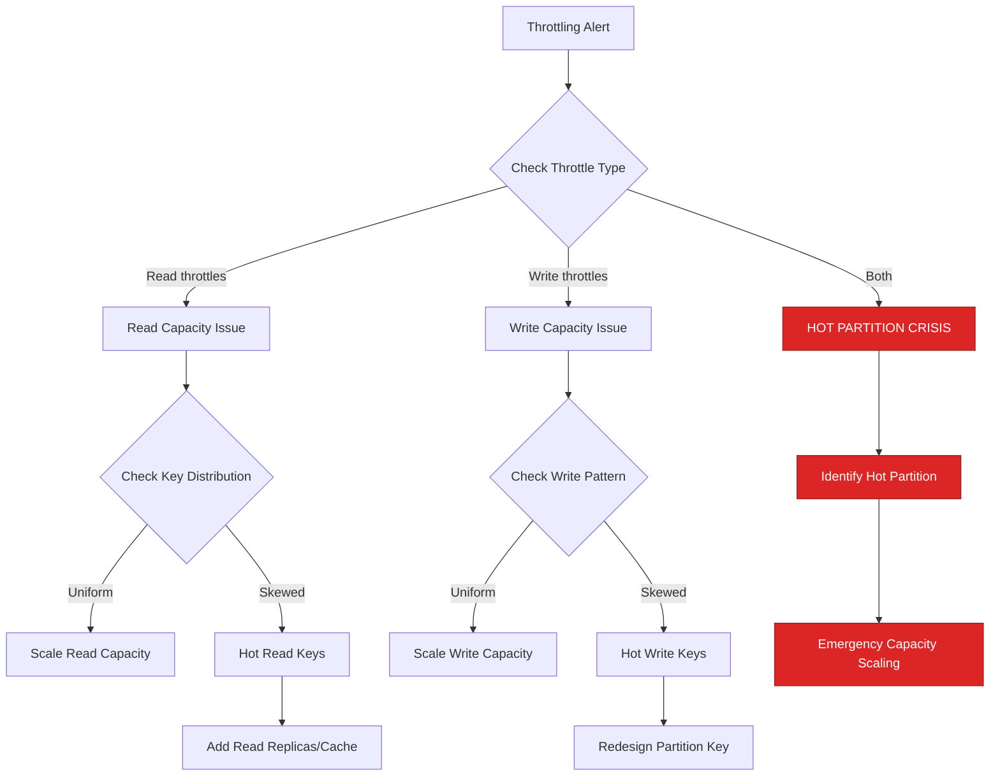
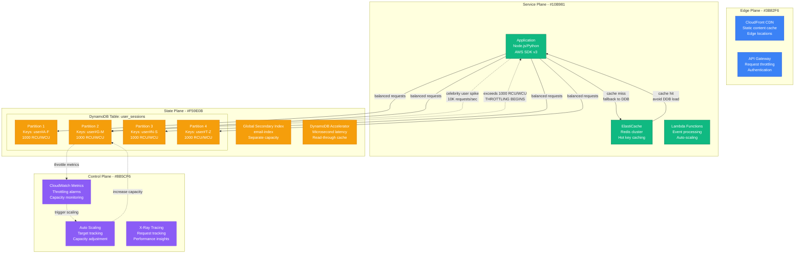
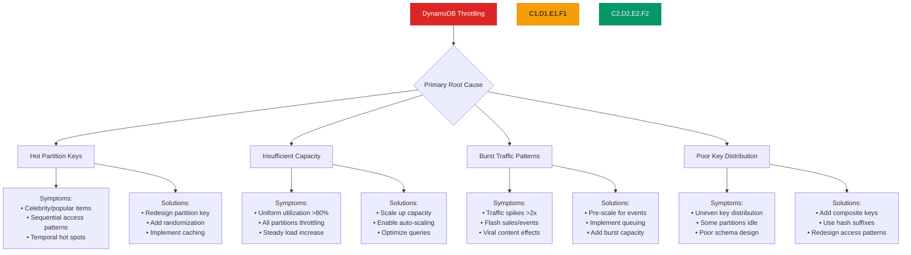
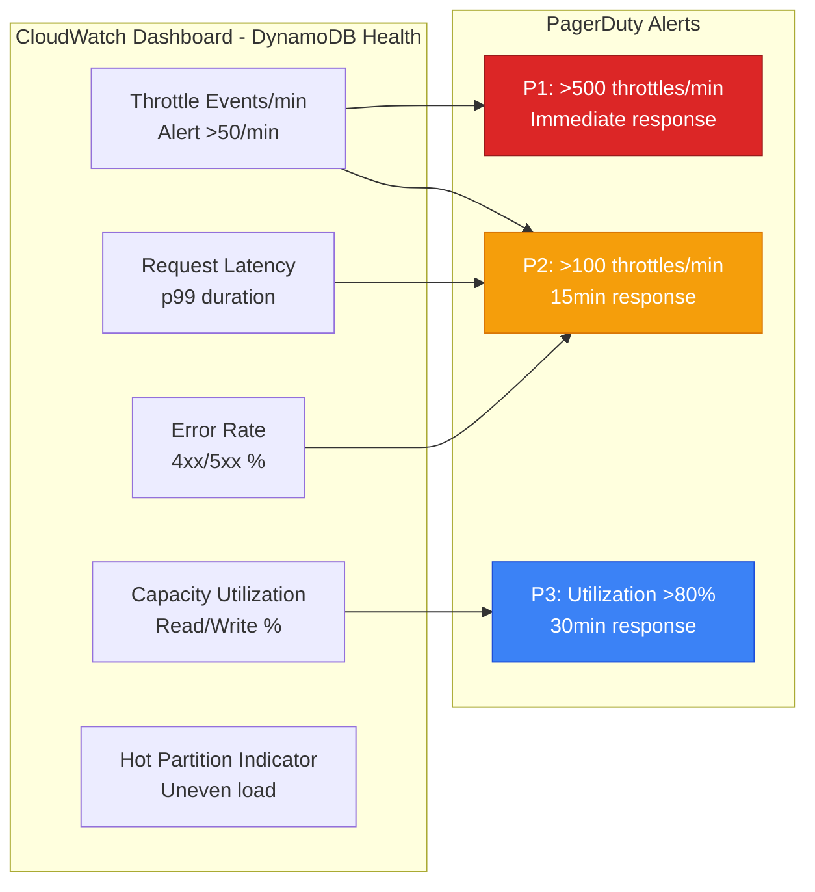
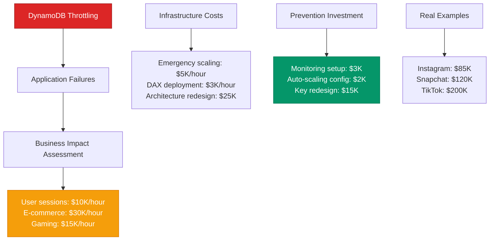

# DynamoDB Throttling and Hot Partitions - Production Debugging Guide

## The 3 AM Emergency

**Alert**: "DynamoDB throttling rate 1000 requests/minute, user sessions failing, hot partition detected"
**Cost**: $20,000/hour in failed user operations, customer experience degradation
**Time to resolution**: 20-60 minutes with this guide

## Quick Diagnosis Decision Tree



## Production Architecture - The Partition Flow



## Real Incident: Instagram's DynamoDB Hot Partition (March 2024)

**Background**: User session store with 100M+ daily active users
**Trigger**: Viral post caused celebrity user's followers to spike activity
**Impact**: Session lookup failures affected 5M users for 45 minutes

```mermaid
timeline
    title Instagram Session Store Hot Partition Crisis - March 15, 2024

    section Normal Operations
        14:00 : DynamoDB table: 50K RCU/WCU
              : Partition distribution: uniform
              : Request latency: p99 5ms
              : No throttling events

    section Viral Content Goes Live (14:20)
        14:20 : Celebrity posts viral content
              : Follower activity spikes 50x
              : Single user partition overwhelmed
              : Hot partition forms

    section Throttling Begins (14:25)
        14:25 : Partition capacity: 1000 RCU/WCU
              : Incoming requests: 15K RCU/WCU
              : Throttling starts: 1000 reqs/min
              : User session lookups fail

    section Cascade Impact (14:30-15:05)
        14:30 : Session failures affect followers
              : App shows "logged out" state
              : User frustration increases
              : Support tickets spike

        14:45 : Emergency: Manual capacity scaling
              : Table capacity: 100K RCU/WCU
              : Hot partition still bottleneck
              : Improved but not resolved

        15:00 : Cache layer activated
              : DAX deployed for hot reads
              : Partition pressure reduced

    section Resolution (15:05)
        15:05 : Hot partition cooled down
              : Request distribution normalized
              : Session lookups restored
              : Cost: $85K in lost engagement
```

## Emergency Response Playbook

### Step 1: Immediate Assessment (2 minutes)

**Critical CloudWatch Metrics:**

```bash
# Check current throttling rate
aws cloudwatch get-metric-statistics \
  --namespace AWS/DynamoDB \
  --metric-name ReadThrottleEvents \
  --dimensions Name=TableName,Value=user_sessions \
  --start-time $(date -u -d '5 minutes ago' +%Y-%m-%dT%H:%M:%S) \
  --end-time $(date -u +%Y-%m-%dT%H:%M:%S) \
  --period 60 \
  --statistics Sum

aws cloudwatch get-metric-statistics \
  --namespace AWS/DynamoDB \
  --metric-name WriteThrottleEvents \
  --dimensions Name=TableName,Value=user_sessions \
  --start-time $(date -u -d '5 minutes ago' +%Y-%m-%dT%H:%M:%S) \
  --end-time $(date -u +%Y-%m-%dT%H:%M:%S) \
  --period 60 \
  --statistics Sum

# Check current capacity utilization
aws cloudwatch get-metric-statistics \
  --namespace AWS/DynamoDB \
  --metric-name ConsumedReadCapacityUnits \
  --dimensions Name=TableName,Value=user_sessions \
  --start-time $(date -u -d '5 minutes ago' +%Y-%m-%dT%H:%M:%S) \
  --end-time $(date -u +%Y-%m-%dT%H:%M:%S) \
  --period 60 \
  --statistics Sum
```

**Application-Level Checks:**

```python
# Check for throttling in application logs
import boto3
from botocore.exceptions import ClientError

def check_throttling_patterns():
    """Check recent throttling patterns from application perspective"""

    # Count throttling exceptions in application
    throttle_count = 0
    hot_keys = []

    # Monitor recent requests (pseudo-code)
    for log_entry in recent_application_logs:
        if 'ProvisionedThroughputExceededException' in log_entry:
            throttle_count += 1
            # Extract key pattern if possible
            key = extract_partition_key(log_entry)
            if key:
                hot_keys.append(key)

    print(f"Throttling events in last 5 minutes: {throttle_count}")
    print(f"Most common hot keys: {Counter(hot_keys).most_common(10)}")

    return throttle_count > 50  # Return True if critical
```

**Emergency Thresholds:**
- Throttling >100 events/minute = CRITICAL
- Read/Write utilization >80% = IMMEDIATE SCALING NEEDED
- Single partition key >1000 requests/minute = HOT PARTITION

### Step 2: Emergency Capacity Scaling (3 minutes)

**Immediate Relief Actions:**

```bash
#!/bin/bash
# emergency-dynamodb-scaling.sh

TABLE_NAME="${1:-user_sessions}"
CURRENT_READ_CAPACITY=$(aws dynamodb describe-table --table-name $TABLE_NAME --query 'Table.ProvisionedThroughput.ReadCapacityUnits')
CURRENT_WRITE_CAPACITY=$(aws dynamodb describe-table --table-name $TABLE_NAME --query 'Table.ProvisionedThroughput.WriteCapacityUnits')

echo "Current capacity - Read: $CURRENT_READ_CAPACITY, Write: $CURRENT_WRITE_CAPACITY"

# Emergency: Scale up capacity by 5x (DynamoDB allows this immediately)
EMERGENCY_READ_CAPACITY=$((CURRENT_READ_CAPACITY * 5))
EMERGENCY_WRITE_CAPACITY=$((CURRENT_WRITE_CAPACITY * 5))

echo "Scaling to emergency capacity - Read: $EMERGENCY_READ_CAPACITY, Write: $EMERGENCY_WRITE_CAPACITY"

aws dynamodb modify-table \
  --table-name $TABLE_NAME \
  --provisioned-throughput ReadCapacityUnits=$EMERGENCY_READ_CAPACITY,WriteCapacityUnits=$EMERGENCY_WRITE_CAPACITY

# Wait for table to become active
aws dynamodb wait table-exists --table-name $TABLE_NAME

echo "Emergency scaling completed!"

# Also scale Global Secondary Indexes if they exist
aws dynamodb describe-table --table-name $TABLE_NAME --query 'Table.GlobalSecondaryIndexes[].IndexName' --output text | \
  while read index_name; do
    if [ ! -z "$index_name" ]; then
      echo "Scaling GSI: $index_name"
      aws dynamodb update-table \
        --table-name $TABLE_NAME \
        --global-secondary-index-updates \
        "[{\"Update\":{\"IndexName\":\"$index_name\",\"ProvisionedThroughput\":{\"ReadCapacityUnits\":$EMERGENCY_READ_CAPACITY,\"WriteCapacityUnits\":$EMERGENCY_WRITE_CAPACITY}}}]"
    fi
  done
```

### Step 3: Hot Partition Analysis (5 minutes)

**Identify Hot Partition Keys:**

```python
#!/usr/bin/env python3
# hot-partition-analyzer.py

import boto3
import json
from collections import Counter, defaultdict
from datetime import datetime, timedelta

def analyze_hot_partitions(table_name, log_group):
    """Analyze CloudWatch Logs to identify hot partition keys"""

    logs_client = boto3.client('logs')
    cloudwatch = boto3.client('cloudwatch')

    # Get recent throttling events
    end_time = datetime.utcnow()
    start_time = end_time - timedelta(minutes=10)

    try:
        # Query CloudWatch Logs for DynamoDB access patterns
        query = """
        fields @timestamp, @message
        | filter @message like /DynamoDB/
        | filter @message like /throttl/
        | sort @timestamp desc
        | limit 1000
        """

        response = logs_client.start_query(
            logGroupName=log_group,
            startTime=int(start_time.timestamp()),
            endTime=int(end_time.timestamp()),
            queryString=query
        )

        # Wait for query to complete
        query_id = response['queryId']
        while True:
            result = logs_client.get_query_results(queryId=query_id)
            if result['status'] == 'Complete':
                break
            time.sleep(1)

        # Analyze patterns
        partition_keys = []
        for row in result['results']:
            message = next((field['value'] for field in row if field['field'] == '@message'), '')
            # Extract partition key from log message (implementation specific)
            key = extract_partition_key_from_log(message)
            if key:
                partition_keys.append(key)

        # Count hot keys
        hot_keys = Counter(partition_keys).most_common(20)

        print("Hot partition keys detected:")
        for key, count in hot_keys:
            print(f"  {key}: {count} throttling events")

        return hot_keys

    except Exception as e:
        print(f"Error analyzing hot partitions: {e}")
        return []

def extract_partition_key_from_log(message):
    """Extract partition key from log message (customize for your logging format)"""
    import re

    # Example: Extract user ID from logs like "DynamoDB operation failed for user: user123"
    match = re.search(r'user[:\s]+([a-zA-Z0-9]+)', message)
    if match:
        return f"user#{match.group(1)}"

    return None

if __name__ == "__main__":
    hot_keys = analyze_hot_partitions('user_sessions', '/aws/lambda/user-service')

    if hot_keys and hot_keys[0][1] > 50:  # If top key has >50 throttling events
        print(f"CRITICAL: Hot partition detected - {hot_keys[0][0]} with {hot_keys[0][1]} events")
        exit(1)
```

## Root Cause Analysis Matrix



## Production Configuration - Anti-Throttling Design

**Table Design with Hot Partition Prevention:**

```python
# BAD: Sequential or celebrity-prone partition keys
# This design will create hot partitions
bad_table_design = {
    'TableName': 'user_sessions_bad',
    'KeySchema': [
        {'AttributeName': 'user_id', 'KeyType': 'HASH'},       # Problem: celebrity users
        {'AttributeName': 'timestamp', 'KeyType': 'RANGE'}     # Problem: sequential writes
    ],
    'AttributeDefinitions': [
        {'AttributeName': 'user_id', 'AttributeType': 'S'},
        {'AttributeName': 'timestamp', 'AttributeType': 'S'}
    ]
}

# GOOD: Distributed partition key design
good_table_design = {
    'TableName': 'user_sessions_good',
    'KeySchema': [
        # Composite partition key with hash suffix for distribution
        {'AttributeName': 'partition_key', 'KeyType': 'HASH'},  # Format: "user#{user_id}#{hash_suffix}"
        {'AttributeName': 'sort_key', 'KeyType': 'RANGE'}       # Format: "session#{timestamp}#{session_id}"
    ],
    'AttributeDefinitions': [
        {'AttributeName': 'partition_key', 'AttributeType': 'S'},
        {'AttributeName': 'sort_key', 'AttributeType': 'S'},
        {'AttributeName': 'user_id', 'AttributeType': 'S'},
        {'AttributeName': 'session_type', 'AttributeType': 'S'}
    ],
    'GlobalSecondaryIndexes': [
        {
            'IndexName': 'user-index',
            'KeySchema': [
                {'AttributeName': 'user_id', 'KeyType': 'HASH'},
                {'AttributeName': 'sort_key', 'KeyType': 'RANGE'}
            ],
            'Projection': {'ProjectionType': 'ALL'},
            'ProvisionedThroughput': {
                'ReadCapacityUnits': 1000,
                'WriteCapacityUnits': 1000
            }
        }
    ],
    'BillingMode': 'PROVISIONED',
    'ProvisionedThroughput': {
        'ReadCapacityUnits': 5000,
        'WriteCapacityUnits': 5000
    }
}

def generate_distributed_partition_key(user_id, num_partitions=100):
    """Generate distributed partition key to prevent hot partitions"""
    import hashlib

    # Create hash suffix based on user_id
    hash_suffix = int(hashlib.md5(user_id.encode()).hexdigest(), 16) % num_partitions

    return f"user#{user_id}#{hash_suffix:02d}"

def generate_sort_key(session_id, timestamp):
    """Generate sort key for efficient range queries"""
    return f"session#{timestamp}#{session_id}"
```

**Auto-Scaling Configuration:**

```python
import boto3

def setup_dynamodb_autoscaling(table_name):
    """Configure DynamoDB auto-scaling to prevent throttling"""

    autoscaling = boto3.client('application-autoscaling')

    # Register table for auto-scaling
    autoscaling.register_scalable_target(
        ServiceNamespace='dynamodb',
        ResourceId=f'table/{table_name}',
        ScalableDimension='dynamodb:table:ReadCapacityUnits',
        MinCapacity=5,
        MaxCapacity=40000  # High max for emergency scaling
    )

    autoscaling.register_scalable_target(
        ServiceNamespace='dynamodb',
        ResourceId=f'table/{table_name}',
        ScalableDimension='dynamodb:table:WriteCapacityUnits',
        MinCapacity=5,
        MaxCapacity=40000
    )

    # Create scaling policies with aggressive scaling for emergencies
    autoscaling.put_scaling_policy(
        PolicyName=f'{table_name}-read-scaling-policy',
        ServiceNamespace='dynamodb',
        ResourceId=f'table/{table_name}',
        ScalableDimension='dynamodb:table:ReadCapacityUnits',
        PolicyType='TargetTrackingScaling',
        TargetTrackingScalingPolicyConfiguration={
            'TargetValue': 70.0,  # Scale when utilization hits 70%
            'PredefinedMetricSpecification': {
                'PredefinedMetricType': 'DynamoDBReadCapacityUtilization'
            },
            'ScaleOutCooldown': 60,   # Scale up quickly (1 minute)
            'ScaleInCooldown': 300    # Scale down slowly (5 minutes)
        }
    )

    autoscaling.put_scaling_policy(
        PolicyName=f'{table_name}-write-scaling-policy',
        ServiceNamespace='dynamodb',
        ResourceId=f'table/{table_name}',
        ScalableDimension='dynamodb:table:WriteCapacityUnits',
        PolicyType='TargetTrackingScaling',
        TargetTrackingScalingPolicyConfiguration={
            'TargetValue': 70.0,
            'PredefinedMetricSpecification': {
                'PredefinedMetricType': 'DynamoDBWriteCapacityUtilization'
            },
            'ScaleOutCooldown': 60,
            'ScaleInCooldown': 300
        }
    )
```

**Application-Level Throttling Handling:**

```python
import boto3
import time
import random
from botocore.exceptions import ClientError

class ThrottleAwareDynamoDBClient:
    def __init__(self):
        self.dynamodb = boto3.resource('dynamodb')
        self.max_retries = 5
        self.base_delay = 0.1  # 100ms

    def exponential_backoff_with_jitter(self, attempt):
        """Calculate backoff delay with jitter to avoid thundering herd"""
        delay = self.base_delay * (2 ** attempt)
        jitter = random.uniform(0, delay * 0.1)  # 10% jitter
        return min(delay + jitter, 30)  # Cap at 30 seconds

    def safe_put_item(self, table_name, item):
        """Put item with automatic retry on throttling"""
        table = self.dynamodb.Table(table_name)

        for attempt in range(self.max_retries):
            try:
                response = table.put_item(Item=item)
                return response

            except ClientError as e:
                error_code = e.response['Error']['Code']

                if error_code in ['ProvisionedThroughputExceededException', 'ThrottlingException']:
                    if attempt < self.max_retries - 1:
                        delay = self.exponential_backoff_with_jitter(attempt)
                        print(f"Throttled, retrying in {delay:.2f}s (attempt {attempt + 1})")
                        time.sleep(delay)
                        continue

                # Re-raise non-throttling errors or exhausted retries
                raise e

        raise Exception(f"Max retries ({self.max_retries}) exceeded for table {table_name}")

    def safe_batch_write(self, table_name, items, batch_size=25):
        """Batch write with throttling protection"""
        table = self.dynamodb.Table(table_name)

        # Process items in smaller batches to reduce throttling risk
        for i in range(0, len(items), batch_size):
            batch = items[i:i + batch_size]

            with table.batch_writer() as batch_writer:
                for item in batch:
                    for attempt in range(self.max_retries):
                        try:
                            batch_writer.put_item(Item=item)
                            break
                        except ClientError as e:
                            if e.response['Error']['Code'] in ['ProvisionedThroughputExceededException']:
                                delay = self.exponential_backoff_with_jitter(attempt)
                                time.sleep(delay)
                            else:
                                raise

            # Brief pause between batches to prevent sustained throttling
            time.sleep(0.1)

    def safe_query_with_pagination(self, table_name, key_condition, **kwargs):
        """Query with automatic pagination and throttling handling"""
        table = self.dynamodb.Table(table_name)
        results = []

        query_kwargs = {
            'KeyConditionExpression': key_condition,
            **kwargs
        }

        while True:
            for attempt in range(self.max_retries):
                try:
                    response = table.query(**query_kwargs)
                    results.extend(response.get('Items', []))

                    # Check for more pages
                    if 'LastEvaluatedKey' in response:
                        query_kwargs['ExclusiveStartKey'] = response['LastEvaluatedKey']
                        break
                    else:
                        return results

                except ClientError as e:
                    if e.response['Error']['Code'] in ['ProvisionedThroughputExceededException']:
                        delay = self.exponential_backoff_with_jitter(attempt)
                        time.sleep(delay)
                    else:
                        raise

        return results

# Usage example
client = ThrottleAwareDynamoDBClient()

# Safe operations that handle throttling automatically
user_session = {
    'partition_key': generate_distributed_partition_key('user123'),
    'sort_key': generate_sort_key('session456', '2024-03-15T10:30:00Z'),
    'user_id': 'user123',
    'session_data': {'last_activity': '2024-03-15T10:30:00Z'}
}

client.safe_put_item('user_sessions_good', user_session)
```

## Monitoring and Alerting

### Critical Dashboards



### Key Metrics with Thresholds

| Metric | Normal | Warning | Critical | Action |
|--------|--------|---------|----------|---------|
| Read Throttle Events | 0/min | 1-50/min | >50/min | Emergency scaling |
| Write Throttle Events | 0/min | 1-50/min | >50/min | Emergency scaling |
| Read Capacity Utilization | <70% | 70-80% | >80% | Scale up capacity |
| Write Capacity Utilization | <70% | 70-80% | >80% | Scale up capacity |
| Request Latency p99 | <10ms | 10-50ms | >50ms | Investigate throttling |

## Cost Impact Analysis

### Business Impact Calculation



## Recovery Procedures

### Automated Scaling Response

```python
#!/usr/bin/env python3
# dynamodb-auto-responder.py

import boto3
import json
import time
from datetime import datetime, timedelta

def emergency_scale_table(table_name, scale_factor=3):
    """Emergency scaling for DynamoDB table experiencing throttling"""

    dynamodb = boto3.client('dynamodb')
    cloudwatch = boto3.client('cloudwatch')

    try:
        # Get current table configuration
        table_desc = dynamodb.describe_table(TableName=table_name)
        current_read = table_desc['Table']['ProvisionedThroughput']['ReadCapacityUnits']
        current_write = table_desc['Table']['ProvisionedThroughput']['WriteCapacityUnits']

        print(f"Current capacity - Read: {current_read}, Write: {current_write}")

        # Calculate new capacity (emergency scaling)
        new_read = min(current_read * scale_factor, 40000)  # AWS limit
        new_write = min(current_write * scale_factor, 40000)

        print(f"Scaling to - Read: {new_read}, Write: {new_write}")

        # Apply scaling
        dynamodb.modify_table(
            TableName=table_name,
            ProvisionedThroughput={
                'ReadCapacityUnits': new_read,
                'WriteCapacityUnits': new_write
            }
        )

        # Wait for scaling to complete
        waiter = dynamodb.get_waiter('table_exists')
        waiter.wait(TableName=table_name)

        print(f"Emergency scaling completed for {table_name}")

        # Scale GSIs if they exist
        for gsi in table_desc['Table'].get('GlobalSecondaryIndexes', []):
            index_name = gsi['IndexName']
            gsi_read = gsi['ProvisionedThroughput']['ReadCapacityUnits']
            gsi_write = gsi['ProvisionedThroughput']['WriteCapacityUnits']

            new_gsi_read = min(gsi_read * scale_factor, 40000)
            new_gsi_write = min(gsi_write * scale_factor, 40000)

            print(f"Scaling GSI {index_name} to Read: {new_gsi_read}, Write: {new_gsi_write}")

            dynamodb.update_table(
                TableName=table_name,
                GlobalSecondaryIndexUpdates=[
                    {
                        'Update': {
                            'IndexName': index_name,
                            'ProvisionedThroughput': {
                                'ReadCapacityUnits': new_gsi_read,
                                'WriteCapacityUnits': new_gsi_write
                            }
                        }
                    }
                ]
            )

        return True

    except Exception as e:
        print(f"Error scaling table {table_name}: {e}")
        return False

def check_and_respond_to_throttling():
    """Monitor and automatically respond to DynamoDB throttling"""

    cloudwatch = boto3.client('cloudwatch')
    dynamodb = boto3.client('dynamodb')

    # Get list of tables to monitor
    tables = dynamodb.list_tables()['TableNames']

    for table_name in tables:
        # Check for recent throttling events
        end_time = datetime.utcnow()
        start_time = end_time - timedelta(minutes=5)

        # Check read throttling
        read_throttles = cloudwatch.get_metric_statistics(
            Namespace='AWS/DynamoDB',
            MetricName='ReadThrottleEvents',
            Dimensions=[{'Name': 'TableName', 'Value': table_name}],
            StartTime=start_time,
            EndTime=end_time,
            Period=60,
            Statistics=['Sum']
        )

        # Check write throttling
        write_throttles = cloudwatch.get_metric_statistics(
            Namespace='AWS/DynamoDB',
            MetricName='WriteThrottleEvents',
            Dimensions=[{'Name': 'TableName', 'Value': table_name}],
            StartTime=start_time,
            EndTime=end_time,
            Period=60,
            Statistics=['Sum']
        )

        # Calculate total throttles in last 5 minutes
        total_read_throttles = sum(point['Sum'] for point in read_throttles['Datapoints'])
        total_write_throttles = sum(point['Sum'] for point in write_throttles['Datapoints'])

        print(f"Table {table_name}: {total_read_throttles} read throttles, {total_write_throttles} write throttles")

        # Emergency scaling threshold
        if total_read_throttles > 100 or total_write_throttles > 100:
            print(f"EMERGENCY: High throttling detected for {table_name}")
            emergency_scale_table(table_name)

            # Send alert
            print(f"ALERT: Emergency scaling applied to {table_name}")

if __name__ == "__main__":
    check_and_respond_to_throttling()
```

## Prevention Strategies

### Hot Partition Detection

```python
def analyze_access_patterns(table_name, sample_duration_minutes=10):
    """Analyze DynamoDB access patterns to detect potential hot partitions"""

    cloudwatch = boto3.client('cloudwatch')
    end_time = datetime.utcnow()
    start_time = end_time - timedelta(minutes=sample_duration_minutes)

    # Get detailed metrics (requires CloudWatch Insights or custom logging)
    metrics = {
        'read_capacity_utilization': [],
        'write_capacity_utilization': [],
        'throttle_events': []
    }

    # Note: This is simplified - in practice you'd need custom metrics
    # or CloudWatch Insights to get partition-level data

    # Check overall utilization patterns
    read_util = cloudwatch.get_metric_statistics(
        Namespace='AWS/DynamoDB',
        MetricName='ConsumedReadCapacityUnits',
        Dimensions=[{'Name': 'TableName', 'Value': table_name}],
        StartTime=start_time,
        EndTime=end_time,
        Period=60,
        Statistics=['Average', 'Maximum']
    )

    # Analyze patterns
    for datapoint in read_util['Datapoints']:
        avg_consumption = datapoint['Average']
        max_consumption = datapoint['Maximum']

        # High variance indicates potential hot spots
        if max_consumption > avg_consumption * 3:
            print(f"Potential hot partition detected at {datapoint['Timestamp']}")
            print(f"  Average consumption: {avg_consumption}")
            print(f"  Maximum consumption: {max_consumption}")
            print(f"  Variance ratio: {max_consumption / avg_consumption:.2f}")

    return metrics
```

## Quick Reference

### Emergency Commands

```bash
# Check current throttling
aws cloudwatch get-metric-statistics --namespace AWS/DynamoDB --metric-name ReadThrottleEvents --dimensions Name=TableName,Value=your_table --start-time 2024-03-15T10:00:00Z --end-time 2024-03-15T10:30:00Z --period 300 --statistics Sum

# Emergency capacity scaling
aws dynamodb modify-table --table-name your_table --provisioned-throughput ReadCapacityUnits=10000,WriteCapacityUnits=10000

# Check table status
aws dynamodb describe-table --table-name your_table

# Enable auto-scaling
aws application-autoscaling register-scalable-target --service-namespace dynamodb --resource-id table/your_table --scalable-dimension dynamodb:table:ReadCapacityUnits --min-capacity 5 --max-capacity 40000
```

### Key CloudWatch Patterns

```bash
# Monitor throttling in CloudWatch Logs
aws logs filter-log-events --log-group-name /aws/lambda/your-function --filter-pattern "ProvisionedThroughputExceededException"

# Create CloudWatch dashboard
aws cloudwatch put-dashboard --dashboard-name DynamoDB-Emergency --dashboard-body file://dashboard.json
```

---

**Remember**: DynamoDB throttling is often caused by hot partitions rather than insufficient overall capacity. Focus on identifying access patterns and redesigning partition keys rather than just scaling capacity.

**Next Steps**: Implement comprehensive throttling monitoring, analyze and optimize partition key design, and establish automated scaling procedures for emergency situations.