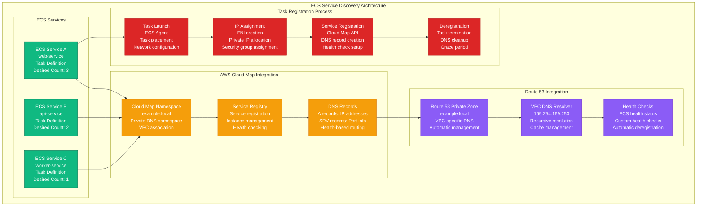
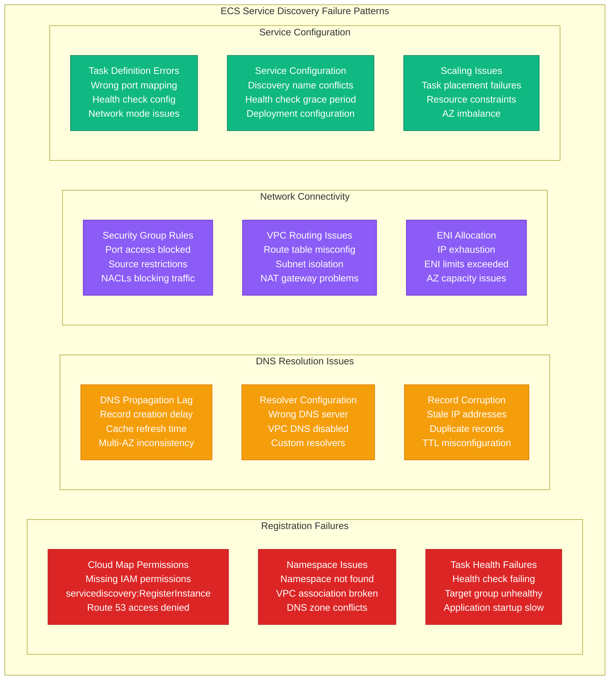
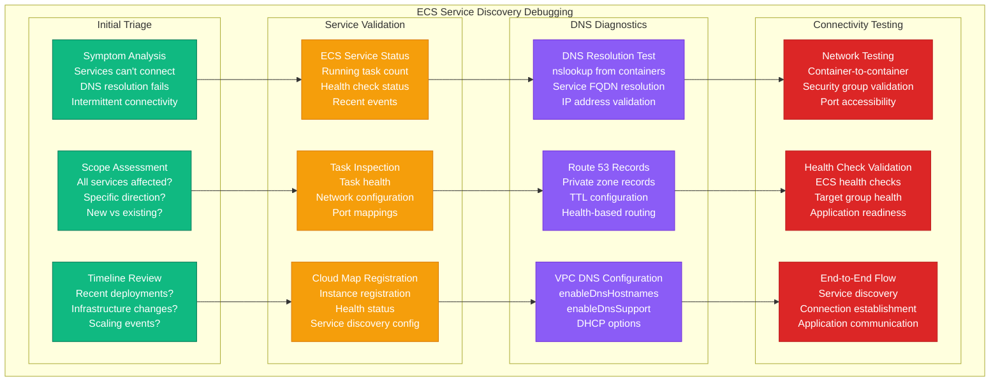

# ECS Service Discovery Debugging

## Overview

Amazon ECS Service Discovery failures disrupt microservice communication, causing connection timeouts, service registration failures, and DNS resolution errors. These issues affect 25% of containerized application incidents, manifesting as services unable to find each other, stale service registrations, and health check failures.

## ECS Service Discovery Architecture



## Common Service Discovery Failures



## Systematic Debugging Process



## 3 AM Debugging Commands

### ECS Service and Task Status
```bash
# Check ECS service status
aws ecs describe-services \
  --cluster production-cluster \
  --services web-service api-service \
  --query 'services[*].[serviceName,status,runningCount,pendingCount,desiredCount]' \
  --output table

# Check task status and health
aws ecs list-tasks --cluster production-cluster --service-name web-service
aws ecs describe-tasks \
  --cluster production-cluster \
  --tasks arn:aws:ecs:us-east-1:123456789012:task/production-cluster/abc123def456

# Check service events for errors
aws ecs describe-services \
  --cluster production-cluster \
  --services web-service \
  --query 'services[0].events[0:10].[createdAt,message]' \
  --output table

# Check task definition
aws ecs describe-task-definition \
  --task-definition web-service:1 \
  --query 'taskDefinition.containerDefinitions[0].[name,portMappings,healthCheck]'
```

### Cloud Map Service Discovery Status
```bash
# List Cloud Map namespaces
aws servicediscovery list-namespaces \
  --query 'Namespaces[*].[Name,Id,Type]' \
  --output table

# Check service registration
aws servicediscovery list-services \
  --filters Name=NAMESPACE_ID,Values=ns-abc123def456 \
  --query 'Services[*].[Name,Id,InstanceCount]' \
  --output table

# Check service instances
aws servicediscovery list-instances \
  --service-id srv-abc123def456 \
  --query 'Instances[*].[Id,Attributes]' \
  --output table

# Get service discovery configuration
aws servicediscovery get-service --id srv-abc123def456
```

### DNS Resolution Testing
```bash
# Test DNS resolution from within a task
aws ecs execute-command \
  --cluster production-cluster \
  --task arn:aws:ecs:us-east-1:123456789012:task/production-cluster/abc123def456 \
  --container web-container \
  --interactive \
  --command "/bin/bash"

# Once inside the container:
nslookup api-service.example.local
dig api-service.example.local
dig SRV _api._tcp.api-service.example.local

# Test specific DNS servers
nslookup api-service.example.local 169.254.169.253
dig @169.254.169.253 api-service.example.local

# Check DNS configuration
cat /etc/resolv.conf
```

### Route 53 and VPC DNS
```bash
# Check Route 53 private hosted zones
aws route53 list-hosted-zones-by-name \
  --query 'HostedZones[?Config.PrivateZone].[Name,Id]' \
  --output table

# Check DNS records
aws route53 list-resource-record-sets \
  --hosted-zone-id Z123456789 \
  --query 'ResourceRecordSets[?Type==`A`].[Name,ResourceRecords[0].Value,TTL]' \
  --output table

# Check VPC DNS configuration
aws ec2 describe-vpcs \
  --vpc-ids vpc-abc123def456 \
  --query 'Vpcs[0].[EnableDnsHostnames,EnableDnsSupport]'

# Check DHCP options set
aws ec2 describe-vpcs \
  --vpc-ids vpc-abc123def456 \
  --query 'Vpcs[0].DhcpOptionsId'

aws ec2 describe-dhcp-options \
  --dhcp-options-ids dopt-abc123def456
```

### Network Connectivity Testing
```bash
# Check security groups
aws ec2 describe-security-groups \
  --group-ids sg-abc123def456 \
  --query 'SecurityGroups[0].IpPermissions[*].[IpProtocol,FromPort,ToPort,IpRanges[0].CidrIp]' \
  --output table

# Test connectivity between tasks
# From inside container:
telnet api-service.example.local 8080
nc -zv api-service.example.local 8080

# Check if port is listening
netstat -tulpn | grep :8080
ss -tulpn | grep :8080

# Test HTTP connectivity
curl -v http://api-service.example.local:8080/health
```

## Common Issues and Solutions

### Issue 1: Service Registration Failing

**Symptoms:**
- ECS tasks start but not registered in Cloud Map
- DNS resolution returns NXDOMAIN
- Service shows 0 instances in Cloud Map

**Debugging Steps:**
```bash
# Check ECS service configuration
aws ecs describe-services \
  --cluster production-cluster \
  --services web-service \
  --query 'services[0].serviceRegistries'

# Check Cloud Map service
aws servicediscovery get-service \
  --id srv-abc123def456

# Check task role permissions
aws iam simulate-principal-policy \
  --policy-source-arn arn:aws:iam::123456789012:role/ecsTaskRole \
  --action-names servicediscovery:RegisterInstance \
  --resource-arns arn:aws:servicediscovery:us-east-1:123456789012:service/srv-abc123def456

# Check recent API calls in CloudTrail
aws logs filter-log-events \
  --log-group-name CloudTrail/ServiceDiscovery \
  --start-time $(date -d '1 hour ago' +%s)000 \
  --filter-pattern "RegisterInstance"
```

**Common Causes:**
- Missing `servicediscovery:RegisterInstance` permission
- Incorrect service registry configuration
- Task health check failures
- VPC/subnet configuration issues

**Solution:**
```json
{
  "Version": "2012-10-17",
  "Statement": [
    {
      "Effect": "Allow",
      "Action": [
        "servicediscovery:RegisterInstance",
        "servicediscovery:DeregisterInstance",
        "route53:GetHealthCheck",
        "route53:CreateHealthCheck",
        "route53:UpdateHealthCheck",
        "route53:DeleteHealthCheck"
      ],
      "Resource": "*"
    }
  ]
}
```

### Issue 2: DNS Resolution Failures

**Symptoms:**
- `nslookup` returns NXDOMAIN
- Services can't find each other by name
- Intermittent DNS resolution failures

**Debugging Steps:**
```bash
# Test DNS from different sources
# From ECS task:
nslookup api-service.example.local

# From EC2 instance in same VPC:
nslookup api-service.example.local

# Check DNS servers being used
cat /etc/resolv.conf

# Test against VPC resolver directly
dig @169.254.169.253 api-service.example.local

# Check Route 53 resolver rules
aws route53resolver list-resolver-rules \
  --query 'ResolverRules[?DomainName==`example.local`]'
```

**Common Causes:**
- VPC DNS resolution disabled
- Custom DNS servers configured
- Route 53 private zone not associated with VPC
- DNS caching issues

**Solution:**
```bash
# Enable VPC DNS resolution
aws ec2 modify-vpc-attribute \
  --vpc-id vpc-abc123def456 \
  --enable-dns-hostnames

aws ec2 modify-vpc-attribute \
  --vpc-id vpc-abc123def456 \
  --enable-dns-support

# Associate private zone with VPC
aws route53 associate-vpc-with-hosted-zone \
  --hosted-zone-id Z123456789 \
  --vpc VPCRegion=us-east-1,VPCId=vpc-abc123def456
```

### Issue 3: Health Check Failures

**Symptoms:**
- Tasks registered but marked unhealthy
- Services show in Cloud Map but DNS returns no results
- Health-based routing not working

**Debugging Steps:**
```bash
# Check ECS task health
aws ecs describe-tasks \
  --cluster production-cluster \
  --tasks arn:aws:ecs:us-east-1:123456789012:task/production-cluster/abc123def456 \
  --query 'tasks[0].containers[0].healthStatus'

# Check Cloud Map instance health
aws servicediscovery get-instance \
  --service-id srv-abc123def456 \
  --instance-id i-abc123def456 \
  --query 'Instance.Attributes'

# Test health check endpoint manually
curl -v http://task-ip:8080/health

# Check application logs
aws logs get-log-events \
  --log-group-name /ecs/web-service \
  --log-stream-name ecs/web-container/abc123def456
```

**Common Causes:**
- Application not responding on health check port
- Health check path returns non-200 status
- Long application startup time
- Network connectivity to health check endpoint

**Solution:**
```json
{
  "healthCheck": {
    "command": ["CMD-SHELL", "curl -f http://localhost:8080/health || exit 1"],
    "interval": 30,
    "timeout": 5,
    "retries": 3,
    "startPeriod": 60
  }
}
```

### Issue 4: Network Connectivity Issues

**Symptoms:**
- DNS resolves correctly but connection fails
- Connection timeouts or refused connections
- Some services can connect, others cannot

**Debugging Steps:**
```bash
# Check security group rules
aws ec2 describe-security-groups \
  --group-ids sg-abc123def456 \
  --query 'SecurityGroups[0].IpPermissions'

# Test port connectivity
telnet api-service.example.local 8080
nc -zv $(dig +short api-service.example.local) 8080

# Check if application is listening
netstat -tulpn | grep :8080

# Check route tables
aws ec2 describe-route-tables \
  --filters Name=vpc-id,Values=vpc-abc123def456 \
  --query 'RouteTables[*].Routes[?DestinationCidrBlock==`0.0.0.0/0`]'

# Check NACLs
aws ec2 describe-network-acls \
  --filters Name=vpc-id,Values=vpc-abc123def456 \
  --query 'NetworkAcls[*].Entries[?RuleAction==`deny`]'
```

**Solution:**
```bash
# Add security group rule for inter-service communication
aws ec2 authorize-security-group-ingress \
  --group-id sg-api-service \
  --protocol tcp \
  --port 8080 \
  --source-group sg-web-service

# Check and fix application binding
# Make sure application binds to 0.0.0.0:8080, not 127.0.0.1:8080
```

## Monitoring and Prevention

### Automated Service Discovery Health Check
```python
#!/usr/bin/env python3
# ecs-service-discovery-monitor.py

import boto3
import json
from datetime import datetime

def check_service_discovery_health(cluster_name, namespace_id):
    """Monitor ECS Service Discovery health"""
    ecs = boto3.client('ecs')
    servicediscovery = boto3.client('servicediscovery')
    route53 = boto3.client('route53')

    health_report = {
        'cluster': cluster_name,
        'namespace_id': namespace_id,
        'services': [],
        'dns_issues': [],
        'connectivity_issues': []
    }

    # Get all services in the cluster
    services = ecs.list_services(cluster=cluster_name)['serviceArns']

    for service_arn in services:
        service_name = service_arn.split('/')[-1]
        service_details = ecs.describe_services(
            cluster=cluster_name,
            services=[service_name]
        )['services'][0]

        service_health = {
            'name': service_name,
            'running_count': service_details['runningCount'],
            'desired_count': service_details['desiredCount'],
            'service_registries': service_details.get('serviceRegistries', []),
            'healthy_instances': 0,
            'total_instances': 0,
            'dns_resolution': False
        }

        # Check Cloud Map registration if configured
        if service_details.get('serviceRegistries'):
            registry = service_details['serviceRegistries'][0]
            cloud_map_service_id = registry['registryArn'].split('/')[-1]

            try:
                instances = servicediscovery.list_instances(
                    ServiceId=cloud_map_service_id
                )['Instances']

                service_health['total_instances'] = len(instances)
                service_health['healthy_instances'] = len([
                    i for i in instances
                    if i.get('Attributes', {}).get('AWS_INSTANCE_HEALTH_STATUS') == 'HEALTHY'
                ])

                # Test DNS resolution
                service_fqdn = f"{service_name}.example.local"
                try:
                    # This would need to be run from within the VPC
                    # For demo purposes, we'll mark as testable
                    service_health['dns_resolution'] = True
                except Exception:
                    service_health['dns_resolution'] = False
                    health_report['dns_issues'].append(f"DNS resolution failed for {service_fqdn}")

            except Exception as e:
                health_report['connectivity_issues'].append(f"Failed to check {service_name}: {str(e)}")

        health_report['services'].append(service_health)

    return health_report

def send_alerts(health_report):
    """Send alerts for issues"""
    alerts = []

    for service in health_report['services']:
        if service['running_count'] < service['desired_count']:
            alerts.append(f"Service {service['name']} running {service['running_count']}/{service['desired_count']} tasks")

        if service['healthy_instances'] < service['total_instances']:
            alerts.append(f"Service {service['name']} has {service['healthy_instances']}/{service['total_instances']} healthy instances")

        if not service['dns_resolution']:
            alerts.append(f"DNS resolution failed for service {service['name']}")

    if health_report['dns_issues']:
        alerts.extend(health_report['dns_issues'])

    if health_report['connectivity_issues']:
        alerts.extend(health_report['connectivity_issues'])

    if alerts:
        message = f"🚨 ECS Service Discovery Alert:\n" + "\n".join(alerts)
        print(message)
        # implement_notification(message)

if __name__ == "__main__":
    CLUSTER_NAME = "production-cluster"
    NAMESPACE_ID = "ns-abc123def456"

    health_report = check_service_discovery_health(CLUSTER_NAME, NAMESPACE_ID)
    send_alerts(health_report)
    print(json.dumps(health_report, indent=2, default=str))
```

### CloudWatch Monitoring Setup
```yaml
# CloudWatch alarms for ECS Service Discovery
Resources:
  ServiceDiscoveryFailureAlarm:
    Type: AWS::CloudWatch::Alarm
    Properties:
      AlarmName: ECS-ServiceDiscovery-Registration-Failures
      MetricName: InstanceRegistrationFailures
      Namespace: AWS/ServiceDiscovery
      Dimensions:
        - Name: ServiceName
          Value: !Ref CloudMapService
      Statistic: Sum
      Period: 300
      EvaluationPeriods: 2
      Threshold: 1
      ComparisonOperator: GreaterThanOrEqualToThreshold
      AlarmActions:
        - !Ref SNSTopicArn

  ECSServiceUnhealthyAlarm:
    Type: AWS::CloudWatch::Alarm
    Properties:
      AlarmName: ECS-Service-Unhealthy-Tasks
      MetricName: RunningTaskCount
      Namespace: AWS/ECS
      Dimensions:
        - Name: ServiceName
          Value: !Ref ECSService
        - Name: ClusterName
          Value: !Ref ECSCluster
      Statistic: Average
      Period: 300
      EvaluationPeriods: 2
      Threshold: 1
      ComparisonOperator: LessThanThreshold
```

## Best Practices

### 1. Proper Service Configuration
```yaml
# ECS Service with Service Discovery
apiVersion: v1
kind: Service
metadata:
  name: web-service
spec:
  serviceRegistries:
    - registryArn: arn:aws:servicediscovery:us-east-1:123456789012:service/srv-abc123def456
      port: 8080
      containerName: web-container
      containerPort: 8080

  healthCheckGracePeriodSeconds: 60
  enableExecuteCommand: true

  networkConfiguration:
    awsvpcConfiguration:
      subnets:
        - subnet-abc123def456
        - subnet-def456abc123
      securityGroups:
        - sg-web-service
      assignPublicIp: DISABLED
```

### 2. Task Definition Best Practices
```json
{
  "family": "web-service",
  "networkMode": "awsvpc",
  "requiresCompatibilities": ["FARGATE"],
  "cpu": "256",
  "memory": "512",
  "containerDefinitions": [
    {
      "name": "web-container",
      "image": "web-service:latest",
      "portMappings": [
        {
          "containerPort": 8080,
          "protocol": "tcp"
        }
      ],
      "healthCheck": {
        "command": ["CMD-SHELL", "curl -f http://localhost:8080/health || exit 1"],
        "interval": 30,
        "timeout": 5,
        "retries": 3,
        "startPeriod": 60
      },
      "logConfiguration": {
        "logDriver": "awslogs",
        "options": {
          "awslogs-group": "/ecs/web-service",
          "awslogs-region": "us-east-1",
          "awslogs-stream-prefix": "ecs"
        }
      }
    }
  ]
}
```

### 3. Security Group Configuration
```bash
# Security group for inter-service communication
aws ec2 create-security-group \
  --group-name ecs-service-internal \
  --description "Internal ECS service communication"

# Allow all ECS services to communicate with each other
aws ec2 authorize-security-group-ingress \
  --group-id sg-ecs-internal \
  --protocol tcp \
  --port 0-65535 \
  --source-group sg-ecs-internal

# Allow health checks from load balancer
aws ec2 authorize-security-group-ingress \
  --group-id sg-ecs-internal \
  --protocol tcp \
  --port 8080 \
  --source-group sg-load-balancer
```

## Quick Reference

### Essential Commands
```bash
# Check service status
aws ecs describe-services --cluster production-cluster --services web-service

# Test DNS resolution
nslookup api-service.example.local

# Check Cloud Map instances
aws servicediscovery list-instances --service-id srv-abc123def456

# Test connectivity
telnet api-service.example.local 8080
```

### Emergency Checklist
1. ✅ Check ECS service and task status
2. ✅ Verify Cloud Map service registration
3. ✅ Test DNS resolution from containers
4. ✅ Validate security group rules
5. ✅ Check application health endpoints
6. ✅ Review VPC DNS configuration
7. ✅ Verify task IAM permissions

*Keep this guide accessible for quick ECS Service Discovery troubleshooting during microservice communication failures.*