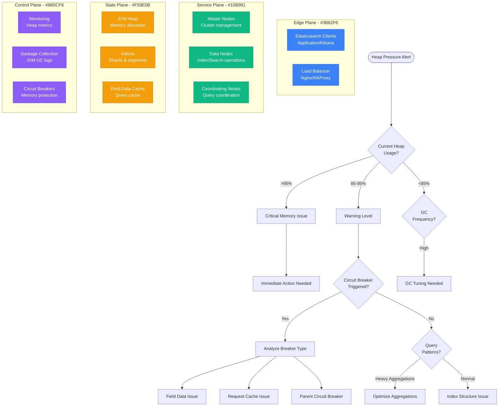

# Elasticsearch Heap Pressure Debugging

## Overview

Elasticsearch heap pressure occurs when the JVM heap usage approaches or exceeds configured limits, leading to performance degradation, circuit breaker triggers, and potential cluster instability. This guide provides systematic debugging for heap pressure issues in production Elasticsearch clusters.

## Immediate Symptoms Checklist

- [ ] `CircuitBreakerException` errors in application logs
- [ ] Elasticsearch nodes becoming unresponsive
- [ ] Query performance severely degraded
- [ ] Indexing operations failing or slowing down
- [ ] Memory usage consistently above 85%
- [ ] Frequent garbage collection pauses

## Elasticsearch Heap Pressure Debug Flow



## Step-by-Step Debugging Process

### Phase 1: Heap Usage Analysis (< 3 minutes)

```bash
# 1. Check current heap usage across cluster
curl -X GET "localhost:9200/_nodes/stats/jvm?pretty" | \
  jq '.nodes[] | {name: .name, heap_used_percent: .jvm.mem.heap_used_percent, heap_max: .jvm.mem.heap_max_in_bytes}'

# 2. Check cluster health and circuit breakers
curl -X GET "localhost:9200/_cluster/health?pretty"
curl -X GET "localhost:9200/_nodes/stats/breaker?pretty"

# 3. Analyze heap usage over time
curl -X GET "localhost:9200/_nodes/stats/jvm?pretty" | \
  jq '.nodes[] | {
    name: .name,
    heap_used: .jvm.mem.heap_used_in_bytes,
    heap_max: .jvm.mem.heap_max_in_bytes,
    heap_percent: .jvm.mem.heap_used_percent,
    gc_count: .jvm.gc.collectors.old.collection_count,
    gc_time: .jvm.gc.collectors.old.collection_time_in_millis
  }'
```

**Heap Status Indicators:**
```json
// Good heap health
{
  "heap_used_percent": 65,
  "gc_collection_count": 12,
  "gc_collection_time_in_millis": 450
}

// Heap pressure warning
{
  "heap_used_percent": 87,
  "gc_collection_count": 156,
  "gc_collection_time_in_millis": 8500
}

// Critical heap pressure
{
  "heap_used_percent": 95,
  "gc_collection_count": 500,
  "gc_collection_time_in_millis": 45000
}
```

### Phase 2: Circuit Breaker Analysis (< 5 minutes)

```bash
# 1. Check all circuit breaker statuses
curl -X GET "localhost:9200/_nodes/stats/breaker?pretty" | \
  jq '.nodes[] | {
    node: .name,
    breakers: {
      parent: {
        estimated: .breakers.parent.estimated_size_in_bytes,
        limit: .breakers.parent.limit_size_in_bytes,
        tripped: .breakers.parent.tripped
      },
      fielddata: {
        estimated: .breakers.fielddata.estimated_size_in_bytes,
        limit: .breakers.fielddata.limit_size_in_bytes,
        tripped: .breakers.fielddata.tripped
      },
      request: {
        estimated: .breakers.request.estimated_size_in_bytes,
        limit: .breakers.request.limit_size_in_bytes,
        tripped: .breakers.request.tripped
      }
    }
  }'

# 2. Monitor active field data usage
curl -X GET "localhost:9200/_nodes/stats/indices/fielddata?pretty" | \
  jq '.nodes[] | {
    node: .name,
    fielddata_memory: .indices.fielddata.memory_size_in_bytes,
    fielddata_evictions: .indices.fielddata.evictions
  }'

# 3. Check query cache usage
curl -X GET "localhost:9200/_nodes/stats/indices/query_cache?pretty" | \
  jq '.nodes[] | {
    node: .name,
    cache_memory: .indices.query_cache.memory_size_in_bytes,
    cache_hit_count: .indices.query_cache.hit_count,
    cache_miss_count: .indices.query_cache.miss_count,
    cache_evictions: .indices.query_cache.evictions
  }'
```

### Phase 3: Memory Consumer Identification (< 5 minutes)

```bash
# 1. Analyze index-level memory usage
curl -X GET "localhost:9200/_cat/indices?v&h=index,memory.total&s=memory.total:desc"

# 2. Check segment memory usage by index
curl -X GET "localhost:9200/_cat/segments?v&h=index,shard,segment,size,memory&s=memory:desc" | head -20

# 3. Identify large shards
curl -X GET "localhost:9200/_cat/shards?v&h=index,shard,prirep,store&s=store:desc" | head -20

# 4. Check for expensive ongoing operations
curl -X GET "localhost:9200/_tasks?detailed=true&actions=*search*" | \
  jq '.tasks | to_entries[] | {
    task_id: .key,
    action: .value.action,
    running_time: .value.running_time_in_nanos,
    description: .value.description
  }'
```

## Common Root Causes and Solutions

### 1. Field Data Memory Explosion (40% of cases)

**Symptoms:**
- Field data circuit breaker frequently triggered
- Sudden heap usage spikes during aggregation queries
- Queries with many unique field values causing OOM

**Root Cause Analysis:**
```bash
# Check field data usage by field
curl -X GET "localhost:9200/_nodes/stats/indices/fielddata?fields=*&pretty" | \
  jq '.nodes[].indices.fielddata.fields | to_entries | sort_by(.value.memory_size_in_bytes) | reverse'

# Identify problematic queries
grep "CircuitBreakingException" /var/log/elasticsearch/elasticsearch.log | \
  grep "fielddata" | tail -10

# Check indices with doc_values disabled
curl -X GET "localhost:9200/_mapping" | \
  jq 'to_entries[] | {
    index: .key,
    fields: [.value.mappings.properties | to_entries[] |
      select(.value.doc_values == false) | .key]
  } | select(.fields | length > 0)'
```

**Common Field Data Issues:**
```json
// Problematic mapping - no doc_values
{
  "mappings": {
    "properties": {
      "user_id": {
        "type": "keyword",
        "doc_values": false  // Forces field data usage
      },
      "session_id": {
        "type": "text",
        "fielddata": true    // Text field with field data enabled
      }
    }
  }
}
```

**Solutions:**

**Option 1: Enable Doc Values**
```json
// Fix mapping to use doc_values
{
  "mappings": {
    "properties": {
      "user_id": {
        "type": "keyword",
        "doc_values": true   // Use doc_values instead of field data
      },
      "session_id": {
        "type": "keyword",   // Change from text to keyword
        "doc_values": true
      }
    }
  }
}
```

**Option 2: Optimize Field Data Settings**
```yaml
# elasticsearch.yml configuration
indices.fielddata.cache.size: 20%  # Limit field data cache
indices.breaker.fielddata.limit: 40%  # Increase breaker limit if needed
indices.breaker.fielddata.overhead: 1.03  # Reduce overhead estimate
```

**Option 3: Query Optimization**
```json
// Before: Heavy aggregation causing field data loading
{
  "query": {
    "match_all": {}
  },
  "aggs": {
    "unique_users": {
      "terms": {
        "field": "user_id",  // Large cardinality field
        "size": 10000
      }
    }
  }
}

// After: Optimized aggregation with doc_values
{
  "query": {
    "range": {
      "timestamp": {
        "gte": "now-1d"  // Reduce data scope
      }
    }
  },
  "aggs": {
    "unique_users": {
      "terms": {
        "field": "user_id.keyword",  // Use keyword field with doc_values
        "size": 100  // Reduce bucket size
      }
    }
  }
}
```

### 2. Query Cache Memory Issues (25% of cases)

**Symptoms:**
- Request circuit breaker triggering
- High memory usage during complex queries
- Query cache hit rate dropping

**Debugging Query Cache:**
```bash
# Check query cache efficiency
curl -X GET "localhost:9200/_nodes/stats/indices/query_cache?pretty" | \
  jq '.nodes[] | {
    node: .name,
    memory_size: .indices.query_cache.memory_size_in_bytes,
    hit_count: .indices.query_cache.hit_count,
    miss_count: .indices.query_cache.miss_count,
    cache_count: .indices.query_cache.cache_count,
    evictions: .indices.query_cache.evictions,
    hit_ratio: (.indices.query_cache.hit_count /
                (.indices.query_cache.hit_count + .indices.query_cache.miss_count))
  }'

# Clear query cache if needed
curl -X POST "localhost:9200/_cache/clear?query=true"
```

**Solutions:**

**Option 1: Tune Query Cache Settings**
```yaml
# elasticsearch.yml
indices.queries.cache.size: 5%  # Reduce from default 10%
indices.queries.cache.count: 1000  # Limit number of cached queries

# Per-index settings
PUT /my-index/_settings
{
  "index.queries.cache.enabled": false  # Disable for write-heavy indices
}
```

**Option 2: Optimize Queries for Caching**
```json
// Non-cacheable query (uses "now")
{
  "query": {
    "range": {
      "timestamp": {
        "gte": "now-1h"  // Dynamic, not cacheable
      }
    }
  }
}

// Cacheable query (rounded time)
{
  "query": {
    "range": {
      "timestamp": {
        "gte": "2023-12-01T10:00:00Z"  // Fixed time, cacheable
      }
    }
  }
}
```

### 3. Segment Memory Overhead (20% of cases)

**Symptoms:**
- High memory usage without active queries
- Many small segments
- Force merge operations causing heap spikes

**Analyze Segment Memory:**
```bash
# Check segment count and memory usage
curl -X GET "localhost:9200/_cat/segments?v&h=index,shard,segment,size,memory&s=memory:desc"

# Check segment count per index
curl -X GET "localhost:9200/_cat/indices?v&h=index,segments.count,segments.memory&s=segments.memory:desc"

# Identify indices with many small segments
curl -X GET "localhost:9200/_nodes/stats/indices/segments?pretty" | \
  jq '.nodes[].indices.segments | {
    count: .count,
    memory_in_bytes: .memory_in_bytes,
    avg_segment_size: (.memory_in_bytes / .count)
  }'
```

**Solutions:**

**Option 1: Force Merge Small Segments**
```bash
# Force merge indices with many small segments
curl -X POST "localhost:9200/my-index/_forcemerge?max_num_segments=1"

# Monitor force merge progress
curl -X GET "localhost:9200/_cat/segments?v&h=index,shard,segment,size"
```

**Option 2: Optimize Index Settings**
```json
// Reduce refresh frequency for write-heavy indices
PUT /my-index/_settings
{
  "index": {
    "refresh_interval": "30s",  // Increase from default 1s
    "merge.policy.max_merged_segment": "5gb",
    "merge.policy.segments_per_tier": 5
  }
}
```

### 4. JVM Configuration Issues (15% of cases)

**Symptoms:**
- Frequent long GC pauses
- Heap configured too small for workload
- Old generation heap pressure

**GC Analysis:**
```bash
# Analyze GC logs (if enabled)
grep "Full GC" /var/log/elasticsearch/gc.log | tail -10
grep "ParNew" /var/log/elasticsearch/gc.log | tail -10

# Check GC statistics
curl -X GET "localhost:9200/_nodes/stats/jvm?pretty" | \
  jq '.nodes[] | {
    name: .name,
    gc_young: {
      count: .jvm.gc.collectors.young.collection_count,
      time: .jvm.gc.collectors.young.collection_time_in_millis
    },
    gc_old: {
      count: .jvm.gc.collectors.old.collection_count,
      time: .jvm.gc.collectors.old.collection_time_in_millis
    },
    heap_usage: .jvm.mem.heap_used_percent
  }'
```

**Solutions:**

**Option 1: JVM Heap Sizing**
```bash
# jvm.options configuration
# Set heap to 50% of available RAM, max 31GB
-Xms16g
-Xmx16g

# Use G1GC for better heap management
-XX:+UseG1GC
-XX:G1HeapRegionSize=16m
-XX:+DisableExplicitGC
-XX:+ExitOnOutOfMemoryError
```

**Option 2: GC Tuning**
```bash
# G1GC settings for better heap pressure handling
-XX:MaxGCPauseMillis=200
-XX:G1OldCSetRegionThreshold=20
-XX:G1MixedGCCountTarget=8
-XX:InitiatingHeapOccupancyPercent=35

# Enable GC logging for analysis
-Xlog:gc*,gc+heap=info,safepoint:gc.log:time,pid,tid,level,tags
```

## Critical Monitoring and Alerting

### Heap Pressure Monitoring Script

```bash
#!/bin/bash
# elasticsearch_heap_monitor.sh

ES_HOST=${1:-localhost:9200}
WARN_THRESHOLD=${2:-85}
CRIT_THRESHOLD=${3:-95}

echo "=== Elasticsearch Heap Monitor ==="
echo "Host: $ES_HOST"
echo "Warn Threshold: $WARN_THRESHOLD%"
echo "Critical Threshold: $CRIT_THRESHOLD%"
echo

# Get heap usage for all nodes
HEAP_DATA=$(curl -s "$ES_HOST/_nodes/stats/jvm" | \
  jq -r '.nodes[] | "\(.name) \(.jvm.mem.heap_used_percent)"')

echo "=== Node Heap Usage ==="
printf "%-20s %s\n" "NODE" "HEAP%"
echo "--------------------------------"

CRITICAL_NODES=()
WARNING_NODES=()

while read -r node_name heap_percent; do
  printf "%-20s %d%%\n" "$node_name" "$heap_percent"

  if [ "$heap_percent" -gt "$CRIT_THRESHOLD" ]; then
    CRITICAL_NODES+=("$node_name:$heap_percent%")
  elif [ "$heap_percent" -gt "$WARN_THRESHOLD" ]; then
    WARNING_NODES+=("$node_name:$heap_percent%")
  fi
done <<< "$HEAP_DATA"

echo

# Check circuit breakers
echo "=== Circuit Breaker Status ==="
curl -s "$ES_HOST/_nodes/stats/breaker" | \
  jq -r '.nodes[] | "\(.name): Parent=\(.breakers.parent.tripped) FieldData=\(.breakers.fielddata.tripped) Request=\(.breakers.request.tripped)"'

echo

# Report alerts
if [ ${#CRITICAL_NODES[@]} -gt 0 ]; then
  echo "🚨 CRITICAL: Nodes with heap >$CRIT_THRESHOLD%:"
  printf '  %s\n' "${CRITICAL_NODES[@]}"
fi

if [ ${#WARNING_NODES[@]} -gt 0 ]; then
  echo "⚠️  WARNING: Nodes with heap >$WARN_THRESHOLD%:"
  printf '  %s\n' "${WARNING_NODES[@]}"
fi

if [ ${#CRITICAL_NODES[@]} -eq 0 ] && [ ${#WARNING_NODES[@]} -eq 0 ]; then
  echo "✅ All nodes within normal heap usage"
fi
```

### Memory Usage Analysis Script

```bash
#!/bin/bash
# elasticsearch_memory_analysis.sh

ES_HOST=${1:-localhost:9200}

echo "=== Elasticsearch Memory Analysis ==="

# Field data usage
echo "=== Top Field Data Consumers ==="
curl -s "$ES_HOST/_nodes/stats/indices/fielddata?fields=*" | \
  jq -r '.nodes[].indices.fielddata.fields | to_entries | sort_by(.value.memory_size_in_bytes) | reverse | .[0:10][] | "\(.key): \(.value.memory_size_in_bytes / 1024 / 1024 | floor)MB"'

echo

# Query cache analysis
echo "=== Query Cache Statistics ==="
curl -s "$ES_HOST/_nodes/stats/indices/query_cache" | \
  jq -r '.nodes[] | "\(.name): Memory=\(.indices.query_cache.memory_size_in_bytes / 1024 / 1024 | floor)MB Hit Rate=\((.indices.query_cache.hit_count / (.indices.query_cache.hit_count + .indices.query_cache.miss_count)) * 100 | floor)%"'

echo

# Segment memory usage
echo "=== Top Memory-Consuming Segments ==="
curl -s "$ES_HOST/_cat/segments?h=index,shard,segment,size,memory&s=memory:desc" | head -10

echo

# Index-level memory summary
echo "=== Index Memory Summary ==="
curl -s "$ES_HOST/_cat/indices?h=index,memory.total&s=memory.total:desc" | head -10
```

## Production Example: Slack's Elasticsearch Optimization

**Problem:** Elasticsearch cluster experiencing frequent heap pressure during peak usage

**Initial Metrics:**
- Heap usage consistently >90% during business hours
- Field data circuit breaker triggering 50+ times/hour
- Query performance degraded by 300%
- Multiple node restarts daily due to OOM

**Root Causes Identified:**
1. Large text fields with field data enabled
2. Unbounded aggregation queries
3. Many small segments consuming excess memory
4. Undersized heap for workload

**Solution Implementation:**

```json
// 1. Fixed field mappings
{
  "mappings": {
    "properties": {
      "message": {
        "type": "text",
        "fields": {
          "keyword": {
            "type": "keyword",
            "ignore_above": 256
          }
        }
      },
      "user_id": {
        "type": "keyword",     // Changed from text
        "doc_values": true     // Use doc_values
      },
      "channel_id": {
        "type": "keyword",
        "doc_values": true
      }
    }
  }
}

// 2. Optimized aggregation queries
{
  "size": 0,
  "query": {
    "range": {
      "timestamp": {
        "gte": "now-1h"
      }
    }
  },
  "aggs": {
    "top_channels": {
      "terms": {
        "field": "channel_id",
        "size": 10,            // Reduced from 1000
        "order": {
          "message_count": "desc"
        }
      },
      "aggs": {
        "message_count": {
          "value_count": {
            "field": "message_id"
          }
        }
      }
    }
  }
}
```

**JVM Configuration:**
```bash
# Increased heap size
-Xms30g
-Xmx30g

# G1GC tuning
-XX:+UseG1GC
-XX:MaxGCPauseMillis=200
-XX:InitiatingHeapOccupancyPercent=35

# Circuit breaker adjustments
indices.breaker.fielddata.limit: 30%
indices.breaker.request.limit: 50%
indices.breaker.total.limit: 85%
```

**Results:**
- Heap usage reduced to 60-70% during peak
- Circuit breaker trips eliminated
- Query performance improved 250%
- Zero OOM incidents in 6 months
- 40% reduction in infrastructure costs

## Emergency Response Playbook

### Immediate Actions (< 2 minutes)

1. **Check Cluster Health:**
   ```bash
   curl -X GET "localhost:9200/_cluster/health"
   ```

2. **Identify Nodes with High Heap:**
   ```bash
   curl -X GET "localhost:9200/_nodes/stats/jvm" | \
     jq '.nodes[] | select(.jvm.mem.heap_used_percent > 90) | {name, heap_percent: .jvm.mem.heap_used_percent}'
   ```

3. **Check Circuit Breaker Status:**
   ```bash
   curl -X GET "localhost:9200/_nodes/stats/breaker"
   ```

### Short-term Mitigation (< 10 minutes)

1. **Clear Field Data Cache:**
   ```bash
   curl -X POST "localhost:9200/_cache/clear?fielddata=true"
   ```

2. **Clear Query Cache:**
   ```bash
   curl -X POST "localhost:9200/_cache/clear?query=true"
   ```

3. **Cancel Long-Running Tasks:**
   ```bash
   curl -X GET "localhost:9200/_tasks?actions=*search*&detailed" | \
     jq '.tasks | to_entries[] | select(.value.running_time_in_nanos > 30000000000) | .key' | \
     xargs -I {} curl -X POST "localhost:9200/_tasks/{}/_cancel"
   ```

4. **Temporarily Increase Circuit Breaker Limits:**
   ```bash
   curl -X PUT "localhost:9200/_cluster/settings" -H 'Content-Type: application/json' -d '{
     "transient": {
       "indices.breaker.fielddata.limit": "50%",
       "indices.breaker.request.limit": "70%"
     }
   }'
   ```

### Long-term Solutions

1. **Heap Sizing Optimization:**
   - Increase JVM heap size if needed
   - Optimize GC settings
   - Monitor heap usage patterns

2. **Query and Mapping Optimization:**
   - Review and fix field mappings
   - Optimize aggregation queries
   - Implement query result caching

3. **Index Management:**
   - Set up proper index lifecycle management
   - Configure force merge schedules
   - Monitor segment counts

## Related Debugging Guides

- [JVM Memory Leak Debugging](/debugging/jvm-memory-leak-production-debugging)
- [Database Performance Issues](/debugging/database-connection-pool-debugging)
- [Microservice Timeout Chains](/debugging/microservice-timeout-chains-debugging)