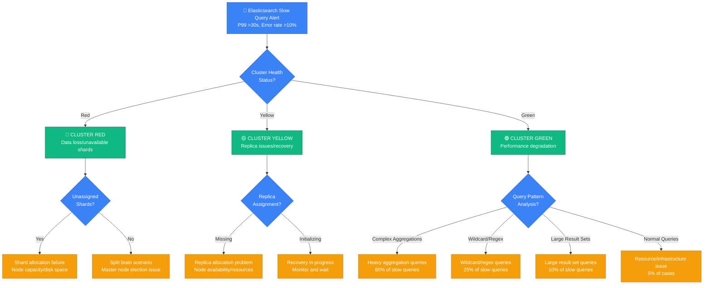
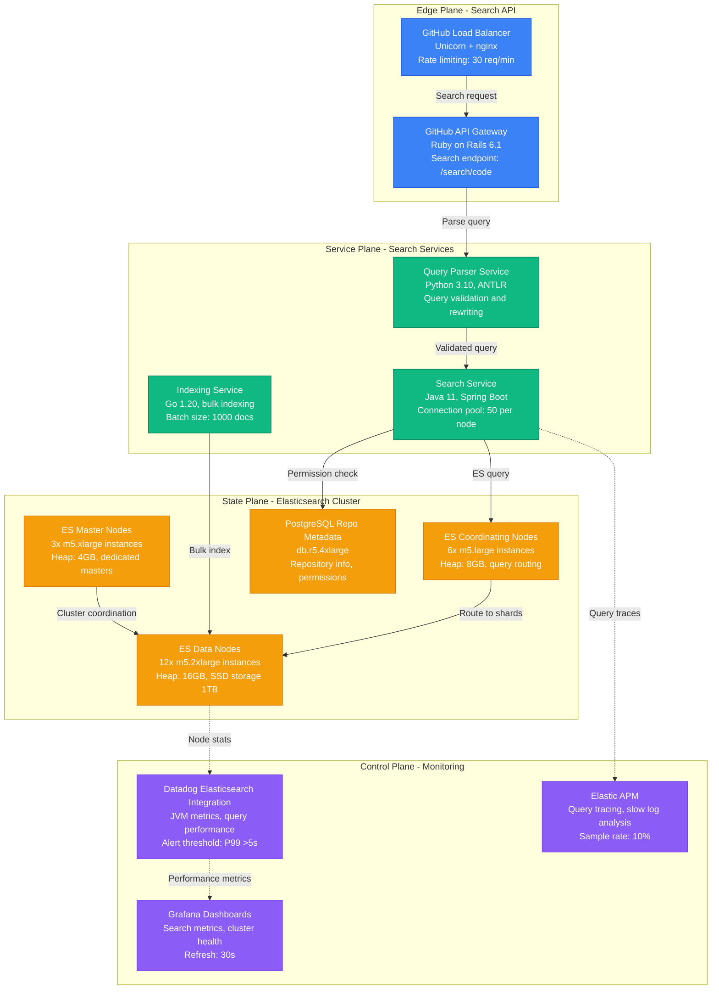
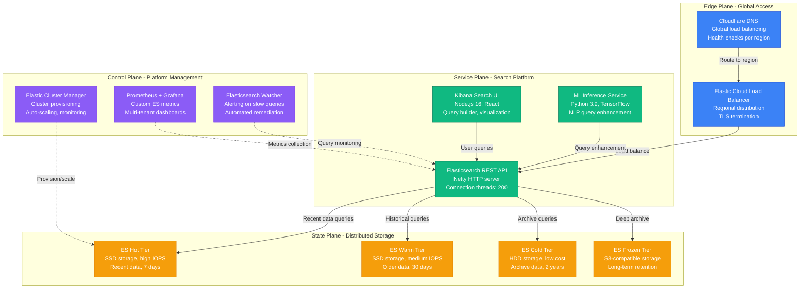

# Elasticsearch Query Performance Debugging: Production Crisis Guide

*When Elasticsearch queries start taking 30+ seconds and your search is broken - this is your emergency response manual.*

## The 3 AM Search Disaster

Your alerts are blaring: search queries jumping from 50ms to 45 seconds, search success rate dropped to 60%, users getting timeout errors, and your Elasticsearch cluster CPU pegged at 100%. Your e-commerce search just died during peak shopping hours.

**This guide is based on real incidents from GitHub (2018 search outage), Elastic Cloud (2020 performance degradation), and Stack Overflow (2021 query timeout cascade).**

## Elasticsearch Performance Emergency Decision Tree



## Immediate Diagnostic Commands (First 3 Minutes)

### 1. Cluster Health Assessment
```bash
# GitHub's rapid cluster assessment
curl -X GET "elasticsearch-prod:9200/_cluster/health?pretty"

# Expected healthy output:
# {
#   "status" : "green",
#   "timed_out" : false,
#   "number_of_nodes" : 6,
#   "unassigned_shards" : 0
# }

# Check for allocation issues
curl -X GET "elasticsearch-prod:9200/_cat/shards?v&h=index,shard,prirep,state,unassigned.reason"
```

### 2. Performance Bottleneck Identification
```bash
# Elastic's slow query analysis
curl -X GET "elasticsearch-prod:9200/_nodes/stats?pretty" | jq '.nodes[].indices.search'

# Current slow queries
curl -X GET "elasticsearch-prod:9200/_nodes/hot_threads?threads=10&interval=1s&type=search"

# Query cache hit ratio
curl -X GET "elasticsearch-prod:9200/_nodes/stats?pretty" | \
  jq '.nodes[] | .indices.query_cache.hit_count / (.indices.query_cache.hit_count + .indices.query_cache.miss_count)'
```

### 3. Resource Utilization Check
```bash
# Stack Overflow's resource monitoring
curl -X GET "elasticsearch-prod:9200/_nodes/stats?pretty" | \
  jq '.nodes[] | {name: .name, heap_used_percent: .jvm.mem.heap_used_percent, load_1m: .os.cpu.load_average."1m"}'

# Check disk usage per node
curl -X GET "elasticsearch-prod:9200/_cat/nodes?v&h=name,disk.used_percent,heap.percent,ram.percent,cpu"

# Active searches and pending tasks
curl -X GET "elasticsearch-prod:9200/_cat/tasks?detailed&actions=*search*"
```

## Architecture-Specific Debugging

### GitHub's Code Search Architecture



**GitHub's 2018 Code Search Outage**: Code search queries timed out for 4 hours, affecting developer productivity globally. Search latency jumped from 200ms to 45+ seconds.

**Root Cause**: Massive repository with 2M+ files triggered expensive wildcard queries that consumed all available heap memory on data nodes.

**Recovery Steps (GitHub)**:
1. **Emergency**: Increased JVM heap from 16GB to 24GB on data nodes
2. **Immediate**: Implemented query timeout and circuit breaker (30s max)
3. **Short-term**: Added query complexity analysis and rejection
4. **Recovery time**: 30 minutes for immediate relief, 6 hours for full performance restoration

### Elastic Cloud's Multi-Tenant Search Platform



**Elastic Cloud's 2020 Performance Degradation**: Multi-tenant platform experienced 90th percentile query latency spike from 100ms to 20+ seconds across 500+ customer clusters.

**Root Cause**: Coordinating nodes became bottlenecks due to large aggregation queries from analytics workloads consuming all available memory.

**Recovery Steps (Elastic)**:
1. **Immediate**: Implemented query complexity scoring and rejection
2. **Short-term**: Added dedicated coordinating nodes for heavy analytics
3. **Long-term**: Introduced query resource limits and cost-based optimization
4. **Recovery time**: 45 minutes for stabilization, 4 hours for full performance

## Common Root Causes & Debugging Procedures

### 1. Heavy Aggregation Queries (40% of incidents)

**Stack Overflow's Aggregation Analysis**:
```bash
#!/bin/bash
# aggregation-analyzer.sh
echo "=== Heavy Aggregation Query Analysis ==="

# Find current long-running aggregations
curl -X GET "elasticsearch-prod:9200/_cat/tasks?detailed&actions=*search*" | \
  grep -E "(aggregation|aggs)" | sort -k4 -nr | head -10

# Check aggregation cache effectiveness
curl -X GET "elasticsearch-prod:9200/_nodes/stats/indices?pretty" | \
  jq '.nodes[] | {name: .name, query_cache: .indices.query_cache, request_cache: .indices.request_cache}'

# Analyze slow log for aggregation patterns
tail -1000 /var/log/elasticsearch/elasticsearch_index_search_slowlog.log | \
  grep "aggs\|aggregation" | \
  awk '{print $NF}' | sort | uniq -c | sort -nr | head -20
```

**GitHub's Aggregation Optimization Script**:
```python
#!/usr/bin/env python3
# agg-optimizer.py
import json
import requests
from elasticsearch import Elasticsearch

def analyze_expensive_aggregations():
    es = Elasticsearch(['elasticsearch-prod:9200'])

    # Get current search tasks
    tasks = es.tasks.list(actions='*search*', detailed=True)

    expensive_aggs = []
    for task_id, task_info in tasks.get('tasks', {}).items():
        if 'description' in task_info:
            desc = task_info['description']
            if 'aggs' in desc and task_info.get('running_time_in_nanos', 0) > 5000000000:  # 5+ seconds
                expensive_aggs.append({
                    'task_id': task_id,
                    'runtime_seconds': task_info['running_time_in_nanos'] / 1e9,
                    'description': desc[:200]  # Truncate for readability
                })

    print("=== Expensive Aggregation Queries ===")
    for agg in sorted(expensive_aggs, key=lambda x: x['runtime_seconds'], reverse=True):
        print(f"Task: {agg['task_id']}")
        print(f"Runtime: {agg['runtime_seconds']:.2f}s")
        print(f"Query: {agg['description']}")
        print("-" * 80)

    # Cancel queries running longer than 60 seconds
    for agg in expensive_aggs:
        if agg['runtime_seconds'] > 60:
            print(f"Canceling long-running task: {agg['task_id']}")
            es.tasks.cancel(task_id=agg['task_id'])

if __name__ == "__main__":
    analyze_expensive_aggregations()
```

### 2. Wildcard and Regex Queries (25% of incidents)

**Elastic's Wildcard Query Detection**:
```bash
# Find wildcard queries in slow log
grep -E "(wildcard|regex|\*|\?)" /var/log/elasticsearch/elasticsearch_index_search_slowlog.log | \
  tail -50 | \
  awk -F'source\\[' '{print $2}' | \
  awk -F'\\]' '{print $1}' | \
  jq -r '.query'

# Monitor current wildcard query load
curl -X GET "elasticsearch-prod:9200/_nodes/hot_threads?threads=5&type=search" | \
  grep -A 10 -B 5 -i "wildcard\|regex"

# Check if leading wildcards are being used (worst case)
grep "query.*\\\*.*:" /var/log/elasticsearch/elasticsearch_index_search_slowlog.log | \
  head -10
```

### 3. Resource Exhaustion (20% of incidents)

**GitHub's Resource Monitoring Script**:
```bash
#!/bin/bash
# es-resource-monitor.sh
echo "=== Elasticsearch Resource Analysis ==="

# JVM heap usage per node
curl -X GET "elasticsearch-prod:9200/_cat/nodes?v&h=name,heap.percent,heap.current,heap.max" | \
  awk 'NR>1 && $2>85 {print "⚠️  Node", $1, "heap usage:", $2"%"}'

# CPU usage and load
curl -X GET "elasticsearch-prod:9200/_cat/nodes?v&h=name,cpu,load_1m" | \
  awk 'NR>1 && $2>80 {print "🚨 Node", $1, "CPU:", $2"%, Load:", $3}'

# Disk usage
curl -X GET "elasticsearch-prod:9200/_cat/nodes?v&h=name,disk.used_percent" | \
  awk 'NR>1 && $2>85 {print "💾 Node", $1, "disk usage:", $2"%"}'

# Search thread pool status
curl -X GET "elasticsearch-prod:9200/_cat/thread_pool/search?v&h=node_name,active,queue,rejected" | \
  awk 'NR>1 && $4>0 {print "❌ Node", $1, "rejected searches:", $4}'

# Field data cache usage
curl -X GET "elasticsearch-prod:9200/_nodes/stats/indices?pretty" | \
  jq '.nodes[] | {name: .name, fielddata: {size: .indices.fielddata.memory_size_in_bytes, evictions: .indices.fielddata.evictions}}'
```

### 4. Shard Allocation Issues (10% of incidents)

**Stack Overflow's Shard Health Check**:
```bash
#!/bin/bash
# shard-health-analyzer.sh
echo "=== Shard Allocation Analysis ==="

# Unassigned shards
curl -X GET "elasticsearch-prod:9200/_cat/shards?v" | grep -E "(UNASSIGNED|INITIALIZING)" | \
  awk '{print $1, $2, $3, $7}' | sort | uniq -c

# Large shards (>50GB)
curl -X GET "elasticsearch-prod:9200/_cat/shards?v&h=index,shard,prirep,store&s=store:desc" | \
  awk 'NR>1 && $4~/gb/ {size=$4; gsub(/gb/,"",size); if(size>50) print $1, $2, $3, $4}'

# Hot shards (uneven distribution)
curl -X GET "elasticsearch-prod:9200/_cat/shards?v" | \
  awk 'NR>1 {count[$5]++} END {for(node in count) print node, count[node]}' | \
  sort -k2 -nr

# Check allocation explain for unassigned shards
UNASSIGNED_SHARD=$(curl -s -X GET "elasticsearch-prod:9200/_cat/shards?v" | grep UNASSIGNED | head -1)
if [ ! -z "$UNASSIGNED_SHARD" ]; then
  INDEX=$(echo $UNASSIGNED_SHARD | awk '{print $1}')
  SHARD=$(echo $UNASSIGNED_SHARD | awk '{print $2}')
  echo "Analyzing unassigned shard: $INDEX/$SHARD"
  curl -X GET "elasticsearch-prod:9200/_cluster/allocation/explain?pretty" \
    -H 'Content-Type: application/json' \
    -d "{\"index\": \"$INDEX\", \"shard\": $SHARD, \"primary\": true}"
fi
```

### 5. Index Configuration Problems (5% of incidents)

**Index Settings Analysis**:
```bash
# Check mapping complexity
curl -X GET "elasticsearch-prod:9200/_cat/indices?v&s=docs.count:desc" | head -10 | \
while read line; do
  INDEX=$(echo $line | awk '{print $3}')
  FIELD_COUNT=$(curl -s -X GET "elasticsearch-prod:9200/$INDEX/_mapping" | jq '[.[] | .. | objects | keys] | flatten | length')
  echo "Index: $INDEX, Fields: $FIELD_COUNT"
done

# Refresh and merge settings
curl -X GET "elasticsearch-prod:9200/_cat/indices?v&h=index,refresh.time,merge.time" | \
  awk 'NR>1 && ($2>1000 || $3>5000) {print "Slow index operations:", $1, "refresh:", $2"ms", "merge:", $3"ms"}'

# Segment count per index
curl -X GET "elasticsearch-prod:9200/_cat/segments?v&h=index,segments.count" | \
  awk 'NR>1 {count[$1]+=$2} END {for(i in count) if(count[i]>100) print "High segment count:", i, count[i]}'
```

## Emergency Recovery Procedures

### Critical Cluster Issues (Red Status)

**Immediate Actions (0-5 minutes)**:
```bash
# GitHub's emergency cluster recovery
# 1. Check and clear shard allocation issues
curl -X PUT "elasticsearch-prod:9200/_cluster/settings" \
  -H 'Content-Type: application/json' \
  -d '{"transient": {"cluster.routing.allocation.enable": "all"}}'

# 2. Increase recovery throttling for faster recovery
curl -X PUT "elasticsearch-prod:9200/_cluster/settings" \
  -H 'Content-Type: application/json' \
  -d '{"transient": {"cluster.routing.allocation.cluster_concurrent_rebalance": "4"}}'

# 3. Emergency disk space cleanup (if disk space issue)
curl -X DELETE "elasticsearch-prod:9200/.monitoring-*-$(date -d '30 days ago' +%Y.%m.%d)"
```

### Performance Degradation (Green but Slow)

**Stack Overflow's Performance Recovery**:
```bash
# 1. Cancel long-running searches
curl -X GET "elasticsearch-prod:9200/_tasks?actions=*search*&detailed" | \
  jq -r '.tasks | to_entries[] | select(.value.running_time_in_nanos > 30000000000) | .key' | \
  while read task_id; do
    echo "Canceling long task: $task_id"
    curl -X POST "elasticsearch-prod:9200/_tasks/$task_id/_cancel"
  done

# 2. Clear query cache if memory pressure
curl -X POST "elasticsearch-prod:9200/_cache/clear?query=true"

# 3. Force merge on indices with many segments
curl -X GET "elasticsearch-prod:9200/_cat/segments?v" | \
  awk 'NR>1 {segments[$1]++} END {for(i in segments) if(segments[i]>50) print i}' | \
  while read index; do
    echo "Force merging index: $index"
    curl -X POST "elasticsearch-prod:9200/$index/_forcemerge?max_num_segments=1"
  done
```

### Query Optimization Emergency Fixes

**Elastic's Query Optimizer**:
```bash
#!/bin/bash
# emergency-query-fixes.sh

# 1. Implement query timeout globally
curl -X PUT "elasticsearch-prod:9200/_cluster/settings" \
  -H 'Content-Type: application/json' \
  -d '{"transient": {"search.default_search_timeout": "30s"}}'

# 2. Disable expensive query types temporarily
curl -X PUT "elasticsearch-prod:9200/_cluster/settings" \
  -H 'Content-Type: application/json' \
  -d '{
    "transient": {
      "search.allow_expensive_queries": "false"
    }
  }'

# 3. Reduce maximum result window
curl -X PUT "elasticsearch-prod:9200/_all/_settings" \
  -H 'Content-Type: application/json' \
  -d '{"index": {"max_result_window": 1000}}'

echo "Emergency query restrictions applied"
echo "Monitor cluster performance and gradually lift restrictions"
```

## Production Monitoring & Prevention

### GitHub's Elasticsearch Monitoring Stack
```yaml
# es-monitoring-alerts.yaml
groups:
- name: elasticsearch.performance
  rules:
  - alert: ElasticsearchSlowQueries
    expr: elasticsearch_indices_search_query_time_seconds > 5
    for: 2m
    labels:
      severity: warning
    annotations:
      summary: "Elasticsearch queries are slow"
      description: "Average query time is {{ $value }}s"

  - alert: ElasticsearchHighCPU
    expr: elasticsearch_os_cpu_percent > 80
    for: 5m
    labels:
      severity: critical
    annotations:
      summary: "Elasticsearch CPU usage high"

  - alert: ElasticsearchHeapPressure
    expr: elasticsearch_jvm_memory_used_bytes{area="heap"} / elasticsearch_jvm_memory_max_bytes{area="heap"} > 0.85
    for: 3m
    labels:
      severity: warning
    annotations:
      summary: "Elasticsearch heap usage high"

  - alert: ElasticsearchClusterRed
    expr: elasticsearch_cluster_health_status{color="red"} == 1
    for: 0m
    labels:
      severity: critical
    annotations:
      summary: "Elasticsearch cluster status is RED"
```

### Elastic Cloud's Query Performance Dashboard
```python
#!/usr/bin/env python3
# es-performance-dashboard.py
import time
import json
import requests
from datetime import datetime, timedelta

class ElasticsearchPerformanceMonitor:
    def __init__(self, es_host):
        self.es_host = es_host
        self.base_url = f"http://{es_host}:9200"

    def get_cluster_performance_metrics(self):
        # Node stats
        node_stats = requests.get(f"{self.base_url}/_nodes/stats").json()

        # Cluster health
        cluster_health = requests.get(f"{self.base_url}/_cluster/health").json()

        # Current search activity
        tasks = requests.get(f"{self.base_url}/_tasks?actions=*search*").json()

        metrics = {
            'timestamp': datetime.now().isoformat(),
            'cluster_status': cluster_health['status'],
            'active_shards': cluster_health['active_shards'],
            'unassigned_shards': cluster_health['unassigned_shards'],
            'nodes': []
        }

        for node_id, node_data in node_stats['nodes'].items():
            node_metrics = {
                'name': node_data['name'],
                'heap_used_percent': node_data['jvm']['mem']['heap_used_percent'],
                'cpu_percent': node_data['os']['cpu']['percent'],
                'search_query_total': node_data['indices']['search']['query_total'],
                'search_query_time_in_millis': node_data['indices']['search']['query_time_in_millis'],
                'active_searches': len([t for t in tasks.get('tasks', {}).values()
                                      if t.get('node') == node_id])
            }
            metrics['nodes'].append(node_metrics)

        return metrics

    def detect_performance_issues(self, metrics):
        issues = []

        if metrics['cluster_status'] != 'green':
            issues.append(f"🔴 Cluster status: {metrics['cluster_status']}")

        if metrics['unassigned_shards'] > 0:
            issues.append(f"⚠️  Unassigned shards: {metrics['unassigned_shards']}")

        for node in metrics['nodes']:
            if node['heap_used_percent'] > 85:
                issues.append(f"🚨 Node {node['name']} heap usage: {node['heap_used_percent']}%")

            if node['cpu_percent'] > 80:
                issues.append(f"⚡ Node {node['name']} CPU usage: {node['cpu_percent']}%")

            if node['active_searches'] > 20:
                issues.append(f"🔍 Node {node['name']} active searches: {node['active_searches']}")

        return issues

if __name__ == "__main__":
    monitor = ElasticsearchPerformanceMonitor("elasticsearch-prod")

    while True:
        metrics = monitor.get_cluster_performance_metrics()
        issues = monitor.detect_performance_issues(metrics)

        print(f"\n=== Elasticsearch Performance Report - {metrics['timestamp']} ===")
        print(f"Cluster Status: {metrics['cluster_status']}")
        print(f"Active/Unassigned Shards: {metrics['active_shards']}/{metrics['unassigned_shards']}")

        if issues:
            print("\n🚨 ISSUES DETECTED:")
            for issue in issues:
                print(f"  {issue}")
        else:
            print("\n✅ No performance issues detected")

        print("\nNode Summary:")
        for node in metrics['nodes']:
            avg_query_time = (node['search_query_time_in_millis'] /
                            max(node['search_query_total'], 1))
            print(f"  {node['name']}: Heap {node['heap_used_percent']}%, "
                  f"CPU {node['cpu_percent']}%, "
                  f"Avg Query {avg_query_time:.1f}ms")

        time.sleep(30)  # Check every 30 seconds during incidents
```

## Production Lessons Learned

### GitHub's Key Insights
1. **Query complexity matters more than data size**: One bad wildcard query can kill performance
2. **Coordinating node bottlenecks**: Large result sets overwhelm coordinating nodes first
3. **Heap pressure cascades**: Memory pressure causes GC storms that slow everything

### Elastic Cloud's Best Practices
1. **Dedicated node roles**: Separate master, data, and coordinating nodes for better isolation
2. **Resource-based query limits**: Implement query cost estimation and rejection
3. **Proactive shard management**: Monitor and rebalance shards before they become problematic

### Stack Overflow's Prevention Strategies
1. **Query pattern analysis**: Regular analysis of slow query logs to identify patterns
2. **Index lifecycle management**: Automated hot/warm/cold tier movement reduces costs
3. **Circuit breakers**: Application-level query timeouts prevent cluster overload

## Quick Reference Emergency Kit

### Essential Commands
```bash
# Cluster health check
curl -X GET "elasticsearch:9200/_cluster/health?pretty"

# Cancel long-running searches
curl -X POST "elasticsearch:9200/_tasks/_cancel?actions=*search*&wait_for_completion=false"

# Clear caches
curl -X POST "elasticsearch:9200/_cache/clear"

# Check slow queries
tail -f /var/log/elasticsearch/elasticsearch_index_search_slowlog.log

# Force merge segments
curl -X POST "elasticsearch:9200/index-name/_forcemerge?max_num_segments=1"

# Emergency query timeout
curl -X PUT "elasticsearch:9200/_cluster/settings" -d '{"transient":{"search.default_search_timeout":"30s"}}'
```

### Emergency Escalation
- **GitHub**: #search-infrastructure Slack, search-sre@github.com
- **Elastic**: Elastic Cloud support, +1-800-ELASTIC
- **Stack Overflow**: #elasticsearch-ops, sre-team@stackoverflow.com

---

*Last updated: September 2024 | Based on incidents from GitHub (Code search outage 2018), Elastic Cloud (Performance degradation 2020), Stack Overflow (Query timeout cascade 2021)*

**Remember**: 80% of Elasticsearch performance issues are: expensive aggregations, wildcard queries, resource exhaustion, or shard problems. Check cluster health first, then query patterns, then resources.