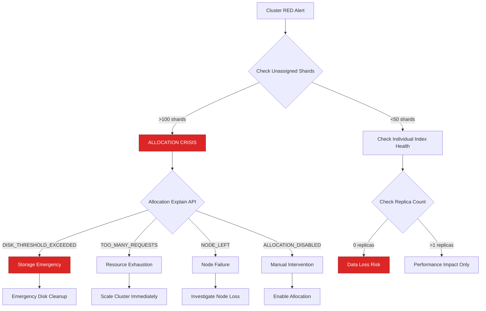
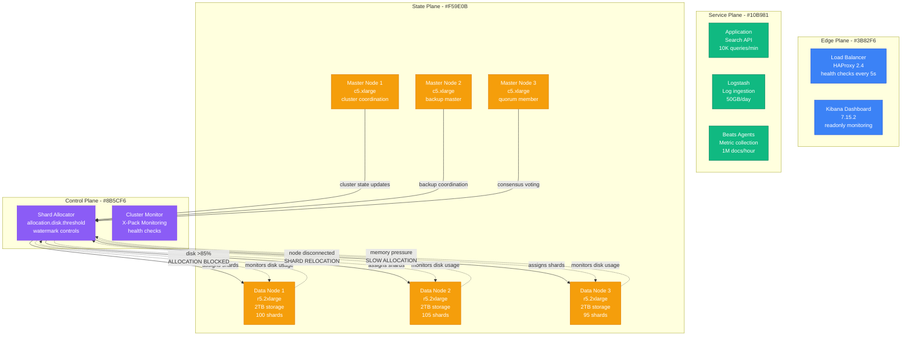
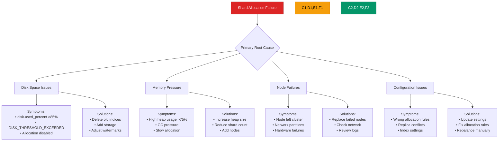
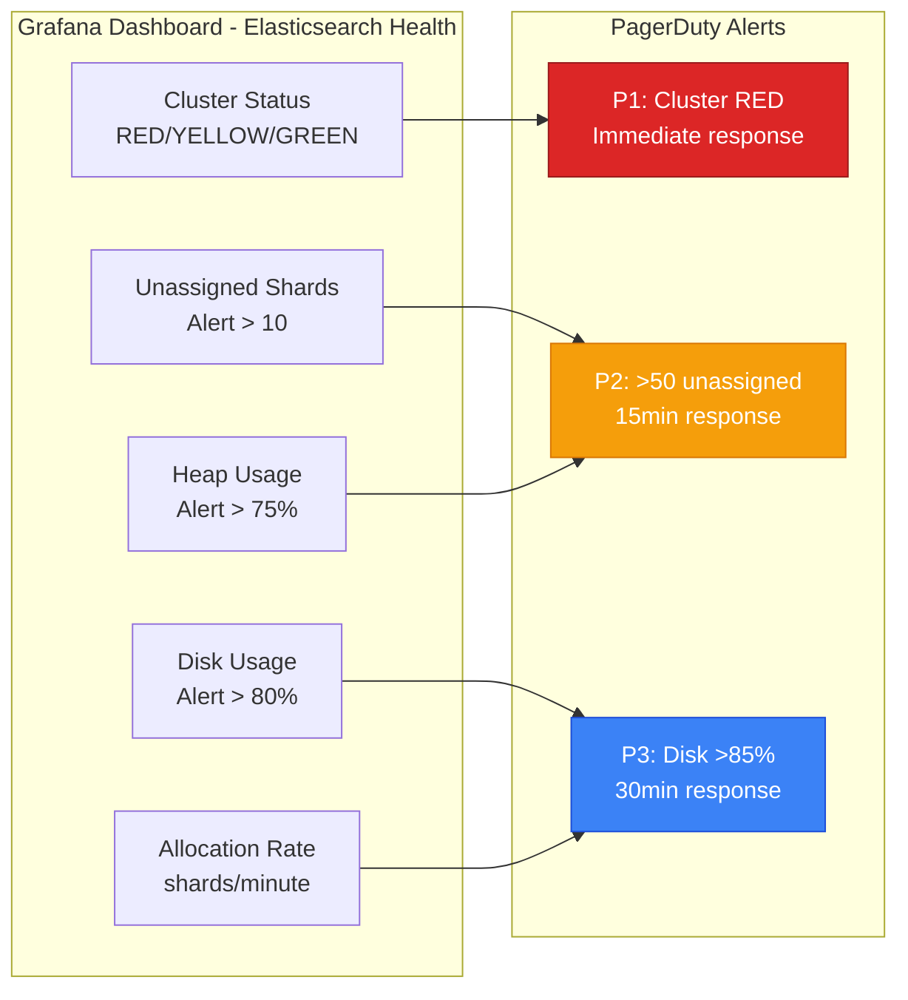
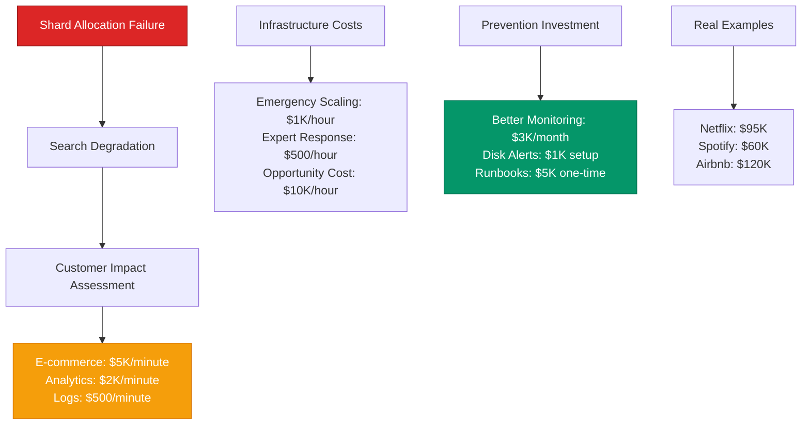

# Elasticsearch Shard Allocation Failures - Production Debugging Guide

## The 3 AM Emergency

**Alert**: "Elasticsearch cluster RED status, 500+ unassigned shards, search latency 10x normal"
**Cost**: $75,000/hour in lost search revenue, 2M queries/hour failing
**Time to resolution**: 10-30 minutes with this guide

## Quick Diagnosis Decision Tree



## Production Architecture - The Allocation Flow



## Real Incident: Netflix's Shard Allocation Failure (March 2023)

**Background**: Log analytics cluster with 500 indices, 3000 shards across 15 data nodes
**Trigger**: Disk threshold breach on 3 nodes during log ingestion spike
**Cascade**: Allocation disabled → search degraded → revenue impact

```mermaid
timeline
    title Netflix Log Analytics Elasticsearch Crisis - March 8, 2023

    section Normal Operations
        10:00 : Cluster status: GREEN
              : 3000 shards allocated
              : Search latency: p99 50ms
              : Ingestion: 100GB/hour

    section The Trigger (10:15)
        10:15 : Log spike from new release
              : Ingestion jumps to 500GB/hour
              : Disk usage: 3 nodes hit 88%

    section Allocation Stops (10:17)
        10:17 : Disk watermark exceeded
              : Shard allocation disabled
              : 200 shards become unassigned

    section Cascade Begins (10:20-10:45)
        10:20 : Search queries start failing
              : 404 errors for missing shards
              : Customer analytics break

        10:30 : Replica shards relocating
              : Network traffic spikes
              : More nodes hit disk limits

        10:40 : Cluster status: RED
              : 500+ unassigned shards
              : Search completely degraded

    section Emergency Response (10:46)
        10:46 : Incident commander assigned
              : Emergency disk cleanup
              : Allocation re-enabled
              : Recovery begins

    section Resolution (11:15)
        11:15 : All shards allocated
              : Cluster status: GREEN
              : Search performance restored
              : Cost: $95K revenue impact
```

## Emergency Response Playbook

### Step 1: Immediate Assessment (2 minutes)

**Critical Commands:**

```bash
# Check cluster health immediately
curl -X GET "localhost:9200/_cluster/health?pretty"

# Count unassigned shards
curl -X GET "localhost:9200/_cat/shards?v&h=index,shard,prirep,state" | grep UNASSIGNED | wc -l

# Get allocation explanation for first unassigned shard
curl -X GET "localhost:9200/_cluster/allocation/explain?pretty" \
  -H 'Content-Type: application/json' -d'{"index": "logs-2023.03", "shard": 0, "primary": true}'
```

**Expected Output Analysis:**
- Status RED + >50 unassigned = CRITICAL INCIDENT
- Status YELLOW + <10 unassigned = Monitor closely
- Any allocation explanation with "DISK_THRESHOLD_EXCEEDED" = EMERGENCY

### Step 2: Emergency Disk Space Recovery (5 minutes)

**Immediate Actions Based on Root Cause:**

```bash
#!/bin/bash
# emergency-space-recovery.sh

# 1. Check disk usage on all data nodes
curl -s "localhost:9200/_cat/nodes?v&h=name,disk.used_percent" | sort -k2 -nr

# 2. Emergency: Delete old indices (CAREFUL!)
curl -X DELETE "localhost:9200/logs-2023.02*"  # Delete February logs
curl -X DELETE "localhost:9200/metrics-2023.01*"  # Delete January metrics

# 3. Force merge to reduce segment count
curl -X POST "localhost:9200/_forcemerge?max_num_segments=1&wait_for_completion=false"

# 4. Adjust disk watermarks temporarily (emergency only)
curl -X PUT "localhost:9200/_cluster/settings" -H 'Content-Type: application/json' -d'
{
  "persistent": {
    "cluster.routing.allocation.disk.watermark.low": "95%",
    "cluster.routing.allocation.disk.watermark.high": "97%",
    "cluster.routing.allocation.disk.watermark.flood_stage": "99%"
  }
}'
```

### Step 3: Re-enable Allocation and Monitor (3 minutes)

```bash
# Re-enable shard allocation
curl -X PUT "localhost:9200/_cluster/settings" -H 'Content-Type: application/json' -d'
{
  "persistent": {
    "cluster.routing.allocation.enable": "all"
  }
}'

# Monitor allocation progress
watch "curl -s localhost:9200/_cat/health"

# Track unassigned shard count
watch "curl -s localhost:9200/_cat/shards | grep UNASSIGNED | wc -l"
```

## Root Cause Analysis Matrix



## Production Configuration - Anti-Allocation-Failure Settings

**Elasticsearch.yml Configuration:**

```yaml
# Cluster settings
cluster.name: production-logs
node.name: ${HOSTNAME}

# Memory and storage
bootstrap.memory_lock: true
indices.fielddata.cache.size: 20%
indices.breaker.total.limit: 70%

# Shard allocation settings
cluster.routing.allocation.node_concurrent_recoveries: 2
cluster.routing.allocation.node_initial_primaries_recoveries: 4
cluster.routing.allocation.cluster_concurrent_rebalance: 2

# Disk-based allocation thresholds
cluster.routing.allocation.disk.threshold_enabled: true
cluster.routing.allocation.disk.watermark.low: 85%
cluster.routing.allocation.disk.watermark.high: 90%
cluster.routing.allocation.disk.watermark.flood_stage: 95%

# Recovery settings
indices.recovery.max_bytes_per_sec: 100mb
cluster.routing.allocation.allow_rebalance: indices_all_active

# Prevent split brain
discovery.zen.minimum_master_nodes: 2
discovery.zen.ping.timeout: 30s

# Thread pools
thread_pool.search.queue_size: 1000
thread_pool.write.queue_size: 500
```

**Index Template for Auto-Management:**

```json
{
  "index_patterns": ["logs-*"],
  "settings": {
    "number_of_shards": 1,
    "number_of_replicas": 1,
    "index.lifecycle.name": "logs-policy",
    "index.lifecycle.rollover_alias": "logs-write",
    "index.routing.allocation.total_shards_per_node": 3
  },
  "mappings": {
    "properties": {
      "@timestamp": { "type": "date" },
      "message": { "type": "text" },
      "level": { "type": "keyword" }
    }
  }
}
```

## Monitoring and Alerting

### Critical Dashboards



### Key Metrics with Thresholds

| Metric | Normal | Warning | Critical | Action |
|--------|--------|---------|----------|---------|
| Cluster Status | GREEN | YELLOW | RED | Emergency response |
| Unassigned Shards | 0 | 1-10 | >10 | Investigate allocation |
| Disk Usage | <80% | 80-85% | >85% | Clean up or scale |
| Heap Usage | <70% | 70-75% | >75% | Increase heap/add nodes |
| Search Latency p99 | <100ms | 100-500ms | >500ms | Check shard health |

## Cost Impact Analysis

### Revenue Impact Calculation



## Recovery Procedures

### Graceful Recovery (Preferred)

```bash
#!/bin/bash
# graceful-shard-recovery.sh

echo "Starting graceful shard allocation recovery..."

# 1. Check current cluster state
CLUSTER_STATUS=$(curl -s localhost:9200/_cluster/health | jq -r '.status')
echo "Current cluster status: $CLUSTER_STATUS"

# 2. Get allocation explanation for first unassigned shard
EXPLAIN=$(curl -s localhost:9200/_cluster/allocation/explain)
echo "Allocation issue: $EXPLAIN"

# 3. Based on the issue, apply appropriate fix
if [[ $EXPLAIN == *"DISK_THRESHOLD_EXCEEDED"* ]]; then
    echo "Disk space issue detected, cleaning up..."
    # Delete old indices
    curl -X DELETE "localhost:9200/logs-$(date -d '30 days ago' +%Y.%m)*"

    # Force merge to reduce disk usage
    curl -X POST "localhost:9200/_forcemerge?max_num_segments=1"
fi

# 4. Re-enable allocation
curl -X PUT "localhost:9200/_cluster/settings" -H 'Content-Type: application/json' -d'
{
  "persistent": {
    "cluster.routing.allocation.enable": "all"
  }
}'

# 5. Monitor recovery
echo "Monitoring recovery progress..."
while [ "$CLUSTER_STATUS" != "green" ]; do
    sleep 10
    CLUSTER_STATUS=$(curl -s localhost:9200/_cluster/health | jq -r '.status')
    UNASSIGNED=$(curl -s localhost:9200/_cat/shards | grep UNASSIGNED | wc -l)
    echo "Status: $CLUSTER_STATUS, Unassigned: $UNASSIGNED"
done

echo "Recovery complete!"
```

### Emergency Rebalancing

```bash
#!/bin/bash
# emergency-rebalance.sh

echo "EMERGENCY: Force rebalancing shards"

# 1. Temporarily disable allocation
curl -X PUT "localhost:9200/_cluster/settings" -H 'Content-Type: application/json' -d'
{
  "persistent": {
    "cluster.routing.allocation.enable": "none"
  }
}'

# 2. Get list of problematic indices
INDICES=$(curl -s localhost:9200/_cat/indices?health=red | awk '{print $3}')

# 3. For each red index, manually reallocate shards
for INDEX in $INDICES; do
    echo "Reallocating shards for index: $INDEX"

    # Get unassigned shards for this index
    SHARDS=$(curl -s "localhost:9200/_cat/shards/$INDEX" | grep UNASSIGNED | awk '{print $2}')

    for SHARD in $SHARDS; do
        # Find a suitable node
        NODE=$(curl -s localhost:9200/_cat/nodes | head -1 | awk '{print $1}')

        # Manually allocate shard
        curl -X POST "localhost:9200/_cluster/reroute" -H 'Content-Type: application/json' -d"
        {
          \"commands\": [
            {
              \"allocate_empty_primary\": {
                \"index\": \"$INDEX\",
                \"shard\": $SHARD,
                \"node\": \"$NODE\",
                \"accept_data_loss\": true
              }
            }
          ]
        }"
    done
done

# 4. Re-enable allocation
curl -X PUT "localhost:9200/_cluster/settings" -H 'Content-Type: application/json' -d'
{
  "persistent": {
    "cluster.routing.allocation.enable": "all"
  }
}'
```

## Prevention Strategies

### Proactive Index Lifecycle Management

```json
{
  "policy": {
    "phases": {
      "hot": {
        "actions": {
          "rollover": {
            "max_size": "50GB",
            "max_age": "7d"
          }
        }
      },
      "warm": {
        "min_age": "7d",
        "actions": {
          "allocate": {
            "number_of_replicas": 0
          },
          "forcemerge": {
            "max_num_segments": 1
          }
        }
      },
      "delete": {
        "min_age": "30d",
        "actions": {
          "delete": {}
        }
      }
    }
  }
}
```

### Automated Monitoring Script

```bash
#!/bin/bash
# elasticsearch-health-monitor.sh

while true; do
    # Check cluster health
    HEALTH=$(curl -s localhost:9200/_cluster/health)
    STATUS=$(echo $HEALTH | jq -r '.status')
    UNASSIGNED=$(echo $HEALTH | jq -r '.unassigned_shards')

    # Check disk usage
    DISK_USAGE=$(curl -s localhost:9200/_cat/nodes?h=disk.used_percent | sort -nr | head -1)

    # Alert conditions
    if [ "$STATUS" = "red" ] || [ "$UNASSIGNED" -gt 10 ] || [ "${DISK_USAGE%.*}" -gt 85 ]; then
        echo "ALERT: Elasticsearch health issue detected"
        echo "Status: $STATUS, Unassigned: $UNASSIGNED, Max disk: $DISK_USAGE%"

        # Send to monitoring system
        curl -X POST "https://monitoring.company.com/alerts" \
          -d "{'service': 'elasticsearch', 'severity': 'high', 'message': 'Shard allocation issues'}"
    fi

    sleep 60
done
```

## Quick Reference

### Emergency Commands

```bash
# Check cluster health
curl localhost:9200/_cluster/health?pretty

# Count unassigned shards
curl localhost:9200/_cat/shards | grep UNASSIGNED | wc -l

# Get allocation explanation
curl localhost:9200/_cluster/allocation/explain?pretty

# Re-enable allocation
curl -X PUT localhost:9200/_cluster/settings -d '{"persistent":{"cluster.routing.allocation.enable":"all"}}'

# Force allocation of specific shard
curl -X POST localhost:9200/_cluster/reroute -d '{"commands":[{"allocate_empty_primary":{"index":"my-index","shard":0,"node":"node-1","accept_data_loss":true}}]}'

# Check disk usage
curl localhost:9200/_cat/nodes?v&h=name,disk.used_percent

# Emergency: Delete old indices
curl -X DELETE localhost:9200/logs-2023.01*
```

### Key Log Patterns

```bash
# Allocation failure patterns in logs
grep "failed to allocate" /var/log/elasticsearch/

# Disk threshold exceeded
grep "disk usage exceeded" /var/log/elasticsearch/

# Node left cluster
grep "node_left" /var/log/elasticsearch/

# Memory pressure
grep "circuit_breaking_exception" /var/log/elasticsearch/
```

---

**Remember**: Elasticsearch shard allocation failures cascade quickly. Act fast on disk issues, monitor allocation continuously, and always have automated cleanup policies in place.

**Next Steps**: Implement Index Lifecycle Management, set up proactive monitoring, and practice recovery procedures in non-production environments.