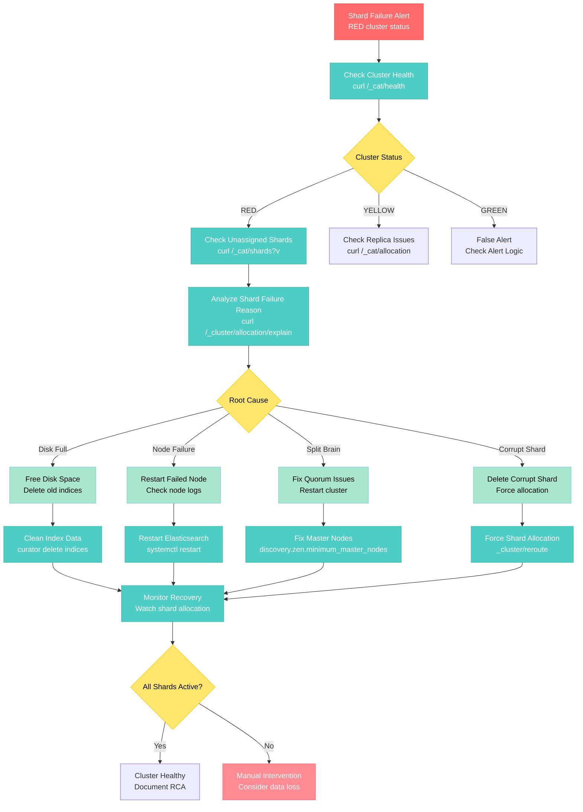

# Elasticsearch Shard Failure Debugging

**Scenario**: Production Elasticsearch cluster experiencing shard failures, causing search degradation and potential data unavailability.

**The 3 AM Reality**: Red cluster health, failed shards preventing indexing/search, and potential data loss from unassigned replicas.

## Symptoms Checklist

- [ ] Cluster status: RED (unassigned primary shards)
- [ ] Search requests returning partial results or errors
- [ ] Indexing operations failing with routing errors
- [ ] High CPU/memory usage on specific nodes
- [ ] Disk space warnings or I/O saturation

## Elasticsearch Shard Failure Architecture

```mermaid
graph TB
    subgraph EdgePlane["Edge Plane"]
        APP[Application<br/>Search Requests]
        LB[Load Balancer<br/>9200 Port]
    end

    subgraph ServicePlane["Service Plane"]
        ESCLI[Elasticsearch CLI<br/>curl/_cat/health]
        KIBANA[Kibana<br/>Monitoring Dashboard]
    end

    subgraph StatePlane["State Plane"]
        MASTER[Master Node<br/>elasticsearch-master-01<br/>heap: 4GB]
        DATA1[Data Node 1<br/>elasticsearch-data-01<br/>disk: 2TB (85% full)]
        DATA2[Data Node 2<br/>elasticsearch-data-02<br/>Status: FAILED]
        DATA3[Data Node 3<br/>elasticsearch-data-03<br/>disk: 2TB (45% full)]
    end

    subgraph ControlPlane["Control Plane"]
        LOGS[Cluster Logs<br/>/var/log/elasticsearch]
        METRICS[Cluster Metrics<br/>JVM, CPU, Disk I/O]
        ALERTS[Shard Alerts<br/>RED status, unassigned]
    end

    APP -->|Search/Index| LB
    LB -->|Route Request| MASTER
    ESCLI -->|Cluster API| MASTER
    KIBANA -->|Monitor| MASTER

    MASTER -->|Coordinate| DATA1
    MASTER -->|Coordinate| DATA2
    MASTER -->|Coordinate| DATA3

    DATA1 -.->|Replica| DATA3
    DATA2 -.->|FAILED| DATA1
    DATA3 -.->|Replica| DATA1

    LOGS -->|Ship Logs| ALERTS
    METRICS -->|Collect| ALERTS

    %% Apply 4-plane colors
    classDef edgeStyle fill:#3B82F6,stroke:#2563EB,color:#fff
    classDef serviceStyle fill:#10B981,stroke:#059669,color:#fff
    classDef stateStyle fill:#F59E0B,stroke:#D97706,color:#fff
    classDef controlStyle fill:#8B5CF6,stroke:#7C3AED,color:#fff

    class APP,LB edgeStyle
    class ESCLI,KIBANA serviceStyle
    class MASTER,DATA1,DATA2,DATA3 stateStyle
    class LOGS,METRICS,ALERTS controlStyle
```

## Step-by-Step Debugging Flow



## Critical Commands & Queries

### Immediate Cluster Assessment
```bash
# Check overall cluster health
curl -X GET "localhost:9200/_cat/health?v&pretty"

# List all indices with their health status
curl -X GET "localhost:9200/_cat/indices?v&s=health"

# Check unassigned shards
curl -X GET "localhost:9200/_cat/shards?v&h=index,shard,prirep,state,unassigned.reason"

# Get detailed allocation explanation
curl -X GET "localhost:9200/_cluster/allocation/explain?pretty"
```

### Node and Resource Analysis
```bash
# Check node status and resources
curl -X GET "localhost:9200/_cat/nodes?v&h=name,heap.percent,ram.percent,cpu,load_1m,disk.used_percent"

# Check cluster settings
curl -X GET "localhost:9200/_cluster/settings?pretty"

# Monitor shard allocation in real-time
watch -n 2 'curl -s "localhost:9200/_cat/shards?v&h=index,shard,prirep,state,node" | grep -E "UNASSIGNED|INITIALIZING"'

# Check disk usage on data nodes
curl -X GET "localhost:9200/_cat/allocation?v"
```

### Detailed Shard Investigation
```bash
# Get specific index shard details
curl -X GET "localhost:9200/_cat/shards/your-index-name?v"

# Check cluster state for specific index
curl -X GET "localhost:9200/_cluster/state/routing_table/your-index-name?pretty"

# Analyze shard routing reasons
curl -X POST "localhost:9200/_cluster/reroute?explain&pretty" -H 'Content-Type: application/json' -d'
{
  "commands": [
    {
      "allocate_replica": {
        "index": "your-index",
        "shard": 0,
        "node": "node-name"
      }
    }
  ]
}'
```

## Log Analysis Locations

### Elasticsearch Logs
```bash
# Main elasticsearch logs
tail -f /var/log/elasticsearch/elasticsearch.log

# Search for shard-related errors
grep -E "shard|failed|exception" /var/log/elasticsearch/elasticsearch.log | tail -100

# Check for OutOfMemoryError
grep "OutOfMemoryError" /var/log/elasticsearch/elasticsearch.log

# Monitor cluster state changes
grep "cluster_changed" /var/log/elasticsearch/elasticsearch.log
```

### System Resource Logs
```bash
# Check disk space issues
df -h | grep elasticsearch
du -sh /var/lib/elasticsearch/nodes/0/indices/*/

# Monitor system resources
iostat -x 1 5  # Check I/O utilization
free -h        # Check memory usage
top -p $(pgrep -f elasticsearch)  # ES process resources
```

### JVM Garbage Collection Logs
```bash
# GC logs location (check elasticsearch.yml)
tail -f /var/log/elasticsearch/gc.log

# Analyze GC patterns
grep "Full GC" /var/log/elasticsearch/gc.log | tail -20

# Check for memory pressure
grep "Allocation Failure" /var/log/elasticsearch/gc.log
```

## Monitoring Queries

### Elasticsearch Metrics API
```bash
# Cluster-level metrics
curl -X GET "localhost:9200/_cluster/stats?pretty"

# Node-level metrics
curl -X GET "localhost:9200/_nodes/stats?pretty"

# Index-level metrics
curl -X GET "localhost:9200/your-index/_stats?pretty"

# Thread pool metrics
curl -X GET "localhost:9200/_cat/thread_pool?v&h=node_name,name,active,rejected,queue,completed"
```

### Prometheus Queries (if using Elasticsearch Exporter)
```promql
# Cluster health status (0=green, 1=yellow, 2=red)
elasticsearch_cluster_health_status

# Number of unassigned shards
elasticsearch_cluster_health_unassigned_shards

# Node disk usage percentage
(elasticsearch_filesystem_data_size_bytes - elasticsearch_filesystem_data_free_bytes) / elasticsearch_filesystem_data_size_bytes * 100

# JVM heap usage
elasticsearch_jvm_memory_used_bytes{area="heap"} / elasticsearch_jvm_memory_max_bytes{area="heap"} * 100

# Search request rate
rate(elasticsearch_indices_search_query_total[5m])
```

## Common Root Causes (by Probability)

### 1. Disk Space Exhaustion (35% of cases)
**Symptoms**: Nodes refuse to allocate shards, disk.watermark warnings
```bash
# Detection
curl -X GET "localhost:9200/_cat/allocation?v" | awk '$3 > 85 {print}'

# Emergency fix
curl -X PUT "localhost:9200/_cluster/settings" -H 'Content-Type: application/json' -d'
{
  "transient": {
    "cluster.routing.allocation.disk.watermark.low": "95%",
    "cluster.routing.allocation.disk.watermark.high": "98%"
  }
}'

# Long-term fix
curator delete indices --older-than 30 --time-unit days
```

### 2. Node Hardware Failure (25% of cases)
**Symptoms**: Node suddenly disappears from cluster, I/O errors in logs
```bash
# Detection
curl -X GET "localhost:9200/_cat/nodes" | wc -l  # Compare to expected count

# Recovery
systemctl restart elasticsearch  # On failed node
# Or exclude node and reallocate
curl -X PUT "localhost:9200/_cluster/settings" -H 'Content-Type: application/json' -d'
{
  "transient": {
    "cluster.routing.allocation.exclude._name": "failed-node-name"
  }
}'
```

### 3. JVM OutOfMemoryError (20% of cases)
**Symptoms**: Frequent Full GC, heap utilization > 95%, node becomes unresponsive
```bash
# Detection
grep "OutOfMemoryError" /var/log/elasticsearch/elasticsearch.log

# Emergency fix
systemctl restart elasticsearch  # Restart affected node

# Configuration fix
# In elasticsearch.yml
# -Xms4g
# -Xmx4g (never more than 32GB, ideally less than 26GB)
```

### 4. Split Brain Scenario (10% of cases)
**Symptoms**: Multiple master nodes, cluster state inconsistency
```bash
# Detection
curl -X GET "localhost:9200/_cat/master" | wc -l  # Should be 1

# Fix
# Stop all nodes
systemctl stop elasticsearch

# Update elasticsearch.yml
discovery.zen.minimum_master_nodes: 2  # (total_masters / 2) + 1

# Start nodes one by one
systemctl start elasticsearch
```

### 5. Corrupted Index Shards (10% of cases)
**Symptoms**: Specific shards consistently fail to allocate, checksum errors
```bash
# Detection
curl -X GET "localhost:9200/_cluster/allocation/explain?pretty" | grep -i corrupt

# Fix (DATA LOSS RISK)
curl -X DELETE "localhost:9200/corrupted-index"
# Or force allocate (may cause data loss)
curl -X POST "localhost:9200/_cluster/reroute" -H 'Content-Type: application/json' -d'
{
  "commands": [
    {
      "allocate_empty_primary": {
        "index": "index-name",
        "shard": 0,
        "node": "node-name",
        "accept_data_loss": true
      }
    }
  ]
}'
```

## Immediate Mitigation Steps

### Emergency Response (< 5 minutes)
1. **Assess Cluster Impact**
   ```bash
   # Quick health check
   curl -s "localhost:9200/_cat/health" | awk '{print "Status: " $4 ", Shards: " $6 "/" $7}'

   # Identify critical indices
   curl -s "localhost:9200/_cat/indices?v" | grep -E "red|yellow" | head -10
   ```

2. **Temporary Disk Space Relief**
   ```bash
   # Clear old logs
   find /var/log/elasticsearch -name "*.log.gz" -mtime +7 -delete

   # Reduce replica count temporarily
   curl -X PUT "localhost:9200/_settings" -H 'Content-Type: application/json' -d'
   {
     "index": {
       "number_of_replicas": 0
     }
   }'
   ```

3. **Force Shard Allocation (if safe)**
   ```bash
   # Only for non-critical indices or when data loss is acceptable
   curl -X POST "localhost:9200/_cluster/reroute?retry_failed" -H 'Content-Type: application/json' -d'
   {
     "commands": []
   }'
   ```

### Short-term Fixes (< 30 minutes)
1. **Node Recovery and Cleanup**
   ```bash
   # Restart problematic nodes
   for node in node1 node2 node3; do
     ssh $node "systemctl restart elasticsearch"
     sleep 30  # Wait for node to join cluster
   done

   # Clean old indices using curator
   curator delete indices \
     --older-than 30 \
     --time-unit days \
     --timestring '%Y.%m.%d'
   ```

2. **Optimize Cluster Settings**
   ```bash
   # Increase concurrent recoveries
   curl -X PUT "localhost:9200/_cluster/settings" -H 'Content-Type: application/json' -d'
   {
     "transient": {
       "cluster.routing.allocation.cluster_concurrent_rebalance": 4,
       "cluster.routing.allocation.node_concurrent_recoveries": 4,
       "indices.recovery.max_bytes_per_sec": "100mb"
     }
   }'
   ```

## Long-term Prevention

### Monitoring and Alerting
```yaml
# Grafana Alert Rules for Elasticsearch
groups:
  - name: elasticsearch
    rules:
    - alert: ElasticsearchClusterRed
      expr: elasticsearch_cluster_health_status == 2
      for: 1m
      labels:
        severity: critical
      annotations:
        summary: "Elasticsearch cluster status is RED"
        description: "Cluster {{ $labels.cluster }} has RED status for more than 1 minute"

    - alert: ElasticsearchUnassignedShards
      expr: elasticsearch_cluster_health_unassigned_shards > 0
      for: 5m
      labels:
        severity: warning
      annotations:
        summary: "Elasticsearch has unassigned shards"

    - alert: ElasticsearchNodeDiskUsageHigh
      expr: (elasticsearch_filesystem_data_size_bytes - elasticsearch_filesystem_data_free_bytes) / elasticsearch_filesystem_data_size_bytes * 100 > 85
      for: 5m
      labels:
        severity: warning
      annotations:
        summary: "Elasticsearch node disk usage is high"
```

### Cluster Hardening Configuration
```yaml
# elasticsearch.yml - Production Settings
cluster.name: production-cluster
node.name: ${HOSTNAME}
node.master: true
node.data: true

# Memory settings
bootstrap.memory_lock: true

# Network settings
network.host: 0.0.0.0
http.port: 9200
transport.tcp.port: 9300

# Discovery settings
discovery.zen.ping.unicast.hosts: ["es-master-01", "es-master-02", "es-master-03"]
discovery.zen.minimum_master_nodes: 2

# Gateway settings
gateway.recover_after_nodes: 2
gateway.expected_nodes: 3
gateway.recover_after_time: 5m

# Thread pool settings
thread_pool.write.queue_size: 1000
thread_pool.search.queue_size: 1000

# Index settings
action.auto_create_index: false
action.destructive_requires_name: true

# Allocation settings
cluster.routing.allocation.disk.watermark.low: 85%
cluster.routing.allocation.disk.watermark.high: 90%
cluster.routing.allocation.disk.watermark.flood_stage: 95%
```

### Index Template Best Practices
```json
{
  "index_patterns": ["logs-*"],
  "settings": {
    "number_of_shards": 3,
    "number_of_replicas": 1,
    "refresh_interval": "30s",
    "index.lifecycle.name": "logs-policy",
    "index.lifecycle.rollover_alias": "logs"
  },
  "mappings": {
    "properties": {
      "@timestamp": {
        "type": "date"
      }
    }
  }
}
```

## Production Examples

### Netflix's Elasticsearch Outage (2020)
- **Incident**: 40% of shards became unassigned during deployment
- **Root Cause**: JVM heap exhaustion on master nodes during rolling restart
- **Impact**: Search functionality degraded for 25 minutes
- **Resolution**: Increased master node heap size, implemented graceful deployments
- **Prevention**: Added pre-deployment heap usage checks

### Uber's Shard Recovery Crisis (2019)
- **Incident**: 2TB index became completely red after data center failure
- **Root Cause**: Insufficient replica placement across availability zones
- **Impact**: Historical trip data unavailable for 4 hours
- **Resolution**: Force-allocated shards with some data loss, restored from backup
- **Learning**: Implemented rack awareness and zone-based shard allocation

### Slack's Split Brain Incident (2021)
- **Incident**: Cluster split into two masters during network partition
- **Root Cause**: Incorrect minimum_master_nodes setting
- **Impact**: Data inconsistency, some messages lost
- **Resolution**: Manual cluster rebuild with proper quorum settings
- **Prevention**: Network partition testing, improved monitoring

## Recovery Procedures

### Automated Shard Recovery Script
```bash
#!/bin/bash
# Elasticsearch shard recovery automation

ES_HOST="localhost:9200"
SLACK_WEBHOOK="your-slack-webhook-url"

# Function to send alerts
send_alert() {
    curl -X POST -H 'Content-type: application/json' \
        --data "{\"text\":\"ES Alert: $1\"}" \
        $SLACK_WEBHOOK
}

# Check cluster health
health=$(curl -s "$ES_HOST/_cat/health" | awk '{print $4}')

if [ "$health" = "red" ]; then
    send_alert "Cluster is RED - Starting recovery"

    # Get unassigned shards count
    unassigned=$(curl -s "$ES_HOST/_cat/health" | awk '{print $8}')

    if [ "$unassigned" -gt 0 ]; then
        # Try to retry failed allocations
        curl -X POST "$ES_HOST/_cluster/reroute?retry_failed=true"

        # Wait for recovery
        sleep 60

        # Check if recovery worked
        new_health=$(curl -s "$ES_HOST/_cat/health" | awk '{print $4}')

        if [ "$new_health" != "red" ]; then
            send_alert "Cluster recovered to $new_health status"
        else
            send_alert "Manual intervention required - cluster still RED"
        fi
    fi
elif [ "$health" = "yellow" ]; then
    send_alert "Cluster is YELLOW - monitoring"
else
    echo "Cluster is GREEN - all good"
fi
```

### Index Restoration Procedure
```bash
#!/bin/bash
# Emergency index restoration from snapshot

SNAPSHOT_REPO="my-backup-repo"
INDEX_NAME="critical-index"
SNAPSHOT_NAME="snapshot-$(date +%Y%m%d)"

# Close the corrupted index
curl -X POST "localhost:9200/$INDEX_NAME/_close"

# Restore from snapshot
curl -X POST "localhost:9200/_snapshot/$SNAPSHOT_REPO/$SNAPSHOT_NAME/_restore" \
-H 'Content-Type: application/json' -d"
{
  \"indices\": \"$INDEX_NAME\",
  \"ignore_unavailable\": true,
  \"include_global_state\": false,
  \"rename_pattern\": \"(.+)\",
  \"rename_replacement\": \"\$1-restored\"
}"

# Monitor restoration progress
watch -n 5 'curl -s "localhost:9200/_cat/recovery?v&active_only"'
```

**Remember**: Elasticsearch shard failures can cause data loss. Always prioritize data preservation over speed when making recovery decisions. Document every action taken during the incident for post-mortem analysis.