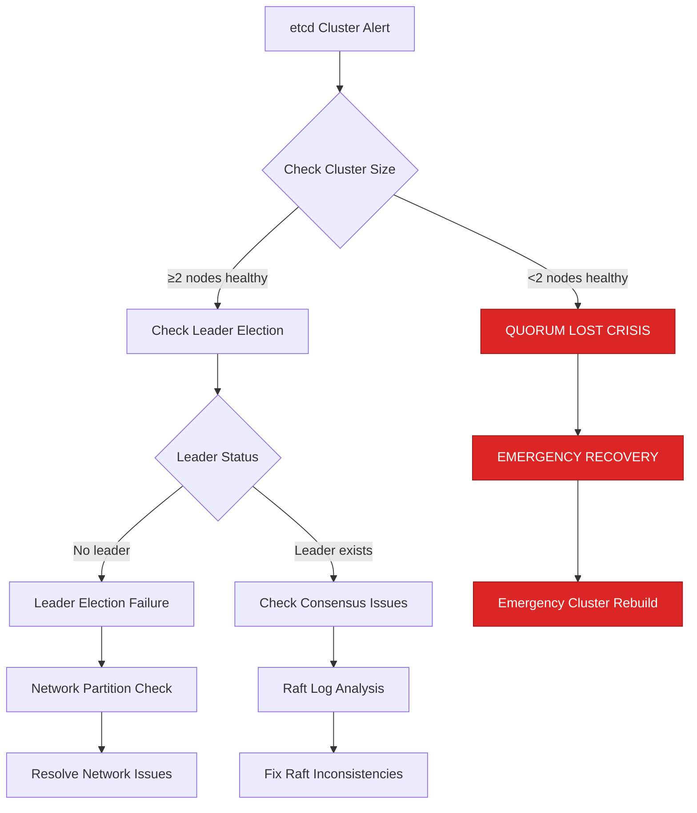
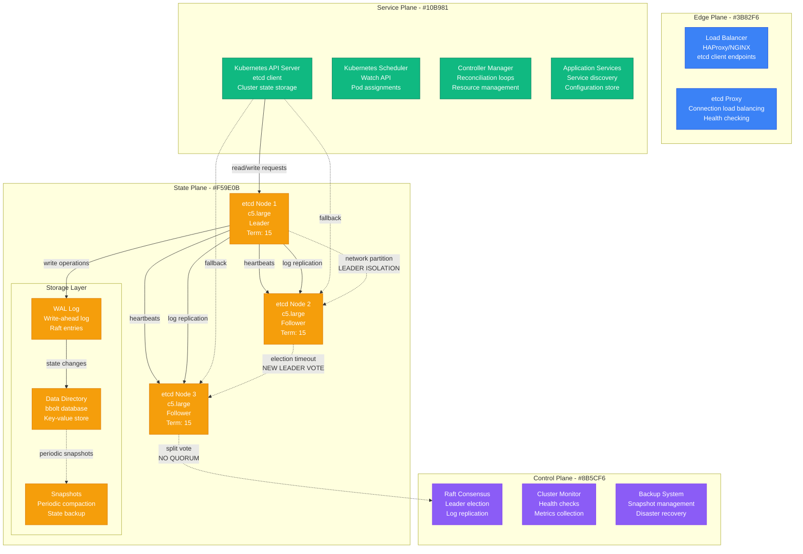
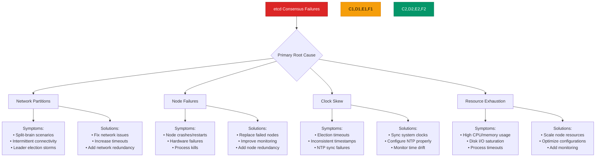
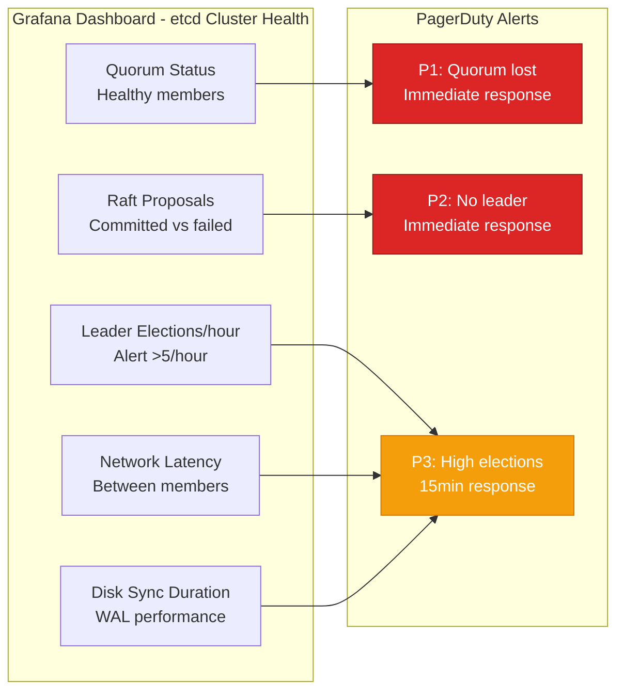
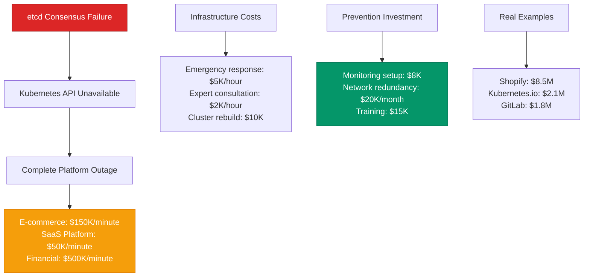

# etcd Consensus Failures - Production Debugging Guide

## The 3 AM Emergency

**Alert**: "etcd cluster lost quorum, Kubernetes API server failing, no leader elected"
**Cost**: $100,000/hour in complete platform outage, all workloads affected
**Time to resolution**: 30-90 minutes with this guide

## Quick Diagnosis Decision Tree



## Production Architecture - The Consensus Flow



## Real Incident: Shopify's etcd Consensus Failure (Black Friday 2023)

**Background**: Kubernetes cluster with 3-node etcd cluster managing 5000+ pods
**Trigger**: Network latency spike during traffic surge caused leader election storm
**Impact**: Complete platform outage for 75 minutes, $8.5M revenue impact

```mermaid
timeline
    title Shopify etcd Consensus Crisis - November 24, 2023

    section Normal Operations
        23:45 : Black Friday traffic building
              : etcd cluster: 3 nodes healthy
              : Leader: etcd-1, Term: 1847
              : API response time: p99 50ms

    section Network Latency Spike (23:58)
        23:58 : Traffic surge: 10x normal load
              : Network latency: 50ms → 500ms
              : etcd heartbeats delayed
              : Followers timeout waiting for leader

    section Leader Election Storm (00:02)
        00:02 : etcd-2 triggers election: Term 1848
              : etcd-3 triggers election: Term 1849
              : etcd-1 rejoins: Term 1850
              : Continuous leader changes

    section Quorum Lost (00:05-01:20)
        00:05 : Network partitions etcd-1
              : Only 2 nodes remain: no quorum
              : etcd stops accepting writes
              : Kubernetes API becomes read-only

        00:15 : Pod deployments fail
              : Auto-scaling broken
              : Service discovery fails
              : Complete platform impact

        00:45 : All customer-facing services down
              : $150K/minute revenue loss
              : Emergency response team activated

    section Emergency Recovery (01:20)
        01:20 : Manual network fixes applied
              : etcd cluster reformed
              : Leader elected: etcd-2, Term 1867
              : API writes resume

    section Full Recovery (01:30)
        01:30 : All services recovered
              : Platform stability restored
              : Total cost: $8.5M in lost sales
```

## Emergency Response Playbook

### Step 1: Immediate Assessment (1 minute)

**Critical Commands:**

```bash
# Check cluster member status
etcdctl --endpoints=etcd1:2379,etcd2:2379,etcd3:2379 member list

# Check cluster health
etcdctl --endpoints=etcd1:2379,etcd2:2379,etcd3:2379 endpoint health

# Check leader status
etcdctl --endpoints=etcd1:2379,etcd2:2379,etcd3:2379 endpoint status --write-out=table

# Check if cluster has quorum
etcdctl --endpoints=etcd1:2379,etcd2:2379,etcd3:2379 get "" --prefix --keys-only --limit=1
```

**Emergency Thresholds:**
- <2 healthy nodes = QUORUM LOST EMERGENCY
- No leader elected = CONSENSUS FAILURE
- API writes failing = IMMEDIATE IMPACT

### Step 2: Emergency Quorum Recovery (5 minutes)

**Immediate Actions for Quorum Loss:**

```bash
#!/bin/bash
# emergency-etcd-recovery.sh

echo "EMERGENCY: etcd cluster recovery procedures"

# 1. Check which nodes are responsive
NODES=("etcd1:2379" "etcd2:2379" "etcd3:2379")
HEALTHY_NODES=()
FAILED_NODES=()

for node in "${NODES[@]}"; do
  if etcdctl --endpoints=$node endpoint health &>/dev/null; then
    HEALTHY_NODES+=($node)
    echo "✓ $node is healthy"
  else
    FAILED_NODES+=($node)
    echo "✗ $node is failed"
  fi
done

echo "Healthy nodes: ${#HEALTHY_NODES[@]}"
echo "Failed nodes: ${#FAILED_NODES[@]}"

# 2. If we have less than quorum (majority), emergency recovery needed
TOTAL_NODES=${#NODES[@]}
QUORUM_SIZE=$(((TOTAL_NODES / 2) + 1))

if [ ${#HEALTHY_NODES[@]} -lt $QUORUM_SIZE ]; then
  echo "CRITICAL: Lost quorum (${#HEALTHY_NODES[@]}/$TOTAL_NODES healthy, need $QUORUM_SIZE)"

  # Emergency: Force new cluster with remaining healthy nodes
  if [ ${#HEALTHY_NODES[@]} -gt 0 ]; then
    echo "Attempting emergency cluster recovery..."

    # Get the first healthy node
    RECOVERY_NODE=${HEALTHY_NODES[0]}
    NODE_NAME=$(echo $RECOVERY_NODE | cut -d: -f1)

    echo "Using $RECOVERY_NODE as recovery node"

    # Force remove failed members (dangerous but necessary)
    for failed_node in "${FAILED_NODES[@]}"; do
      MEMBER_ID=$(etcdctl --endpoints=$RECOVERY_NODE member list | grep $failed_node | cut -d, -f1)
      if [ ! -z "$MEMBER_ID" ]; then
        echo "Removing failed member: $MEMBER_ID ($failed_node)"
        etcdctl --endpoints=$RECOVERY_NODE member remove $MEMBER_ID
      fi
    done

    echo "Emergency recovery initiated. Monitor cluster status."
  else
    echo "NO HEALTHY NODES: Complete cluster rebuild required"
    exit 1
  fi
else
  echo "Quorum maintained. Checking for other issues..."
fi
```

### Step 3: Leader Election Analysis (3 minutes)

**Leader Election Troubleshooting:**

```bash
#!/bin/bash
# leader-election-analysis.sh

echo "Analyzing etcd leader election issues..."

# 1. Check current leader across all nodes
echo "=== Leader Status ==="
for node in etcd1:2379 etcd2:2379 etcd3:2379; do
  echo "Node $node:"
  etcdctl --endpoints=$node endpoint status --write-out=json 2>/dev/null | \
    jq -r '.[] | "  Leader: \(.Status.leader), Term: \(.Status.raftTerm), Index: \(.Status.raftIndex)"' || \
    echo "  ERROR: Node unreachable"
done

# 2. Check for split-brain (different leaders)
echo -e "\n=== Checking for Split-Brain ==="
LEADERS=$(etcdctl --endpoints=etcd1:2379,etcd2:2379,etcd3:2379 endpoint status --write-out=json 2>/dev/null | \
  jq -r '.[] | .Status.leader' | sort -u | wc -l)

if [ "$LEADERS" -gt 1 ]; then
  echo "WARNING: Multiple leaders detected (split-brain)"
  etcdctl --endpoints=etcd1:2379,etcd2:2379,etcd3:2379 endpoint status --write-out=table
elif [ "$LEADERS" -eq 0 ]; then
  echo "CRITICAL: No leader elected"
else
  echo "OK: Single leader elected"
fi

# 3. Check network connectivity between nodes
echo -e "\n=== Network Connectivity ==="
NODES=("etcd1" "etcd2" "etcd3")
for i in "${NODES[@]}"; do
  for j in "${NODES[@]}"; do
    if [ "$i" != "$j" ]; then
      if ping -c 1 -W 1 $j &>/dev/null; then
        echo "✓ $i → $j: OK"
      else
        echo "✗ $i → $j: FAILED"
      fi
    fi
  done
done

# 4. Check recent Raft entries for election activity
echo -e "\n=== Recent Election Activity ==="
etcdctl --endpoints=etcd1:2379,etcd2:2379,etcd3:2379 get "" --prefix --keys-only --limit=10 2>/dev/null || \
  echo "Cannot read cluster state - quorum may be lost"
```

## Root Cause Analysis Matrix



## Production Configuration - Anti-Consensus-Failure Settings

**etcd Configuration (etcd.conf.yml):**

```yaml
# Basic cluster configuration
name: 'etcd-1'
data-dir: '/var/lib/etcd'
wal-dir: '/var/lib/etcd/wal'
snapshot-count: 100000
heartbeat-interval: 500      # 500ms heartbeat (increase if network latency high)
election-timeout: 5000       # 5 seconds (increase for unstable networks)

# Cluster member URLs
initial-advertise-peer-urls: 'https://etcd-1:2380'
listen-peer-urls: 'https://0.0.0.0:2380'
listen-client-urls: 'https://0.0.0.0:2379'
advertise-client-urls: 'https://etcd-1:2379'

# Initial cluster configuration
initial-cluster: 'etcd-1=https://etcd-1:2380,etcd-2=https://etcd-2:2380,etcd-3=https://etcd-3:2380'
initial-cluster-state: 'new'
initial-cluster-token: 'etcd-cluster-production'

# Security
client-transport-security:
  cert-file: '/etc/etcd/certs/server.crt'
  key-file: '/etc/etcd/certs/server.key'
  client-cert-auth: true
  trusted-ca-file: '/etc/etcd/certs/ca.crt'
  auto-tls: false

peer-transport-security:
  cert-file: '/etc/etcd/certs/peer.crt'
  key-file: '/etc/etcd/certs/peer.key'
  client-cert-auth: true
  trusted-ca-file: '/etc/etcd/certs/ca.crt'
  auto-tls: false

# Performance tuning
max-request-bytes: 33554432        # 32MB max request size
max-concurrent-streams: 4294967295  # High concurrency for Kubernetes
quota-backend-bytes: 8589934592     # 8GB storage quota

# Logging and debugging
logger: 'zap'
log-level: 'info'
log-outputs: ['/var/log/etcd/etcd.log']

# Raft tuning for stability
max-election-timeout: 50000   # 50 seconds max election timeout
max-heartbeat-interval: 5000  # 5 seconds max heartbeat interval

# Compaction
auto-compaction-mode: 'periodic'
auto-compaction-retention: '12h'

# Snapshot settings
enable-v2: false  # Disable v2 API for better performance
```

**Kubernetes API Server Configuration for etcd:**

```yaml
# kube-apiserver configuration
spec:
  containers:
  - name: kube-apiserver
    command:
    - kube-apiserver
    - --etcd-servers=https://etcd-1:2379,https://etcd-2:2379,https://etcd-3:2379
    - --etcd-cafile=/etc/etcd/certs/ca.crt
    - --etcd-certfile=/etc/etcd/certs/client.crt
    - --etcd-keyfile=/etc/etcd/certs/client.key

    # Connection tuning for etcd reliability
    - --etcd-servers-overrides=/events#https://etcd-events-1:2379;https://etcd-events-2:2379;https://etcd-events-3:2379
    - --request-timeout=300s                    # 5 minutes for large requests
    - --default-not-ready-toleration-seconds=30
    - --default-unreachable-toleration-seconds=30

    # Rate limiting to protect etcd
    - --max-requests-inflight=3000              # Limit concurrent requests
    - --max-mutating-requests-inflight=1000     # Limit write requests
    - --enable-admission-plugins=EventRateLimit # Limit events to etcd

    # Watch cache to reduce etcd load
    - --watch-cache=true
    - --watch-cache-sizes=deployments.apps#1000,services#1000,pods#5000

    # Encryption at rest
    - --encryption-provider-config=/etc/etcd/encryption.yaml
```

**Application-Level etcd Client Configuration:**

```go
// etcd client configuration for high availability
package main

import (
    "context"
    "crypto/tls"
    "time"

    "go.etcd.io/etcd/clientv3"
    "go.etcd.io/etcd/pkg/transport"
)

func createEtcdClient() (*clientv3.Client, error) {
    // TLS configuration
    tlsInfo := transport.TLSInfo{
        CertFile:      "/etc/etcd/certs/client.crt",
        KeyFile:       "/etc/etcd/certs/client.key",
        TrustedCAFile: "/etc/etcd/certs/ca.crt",
    }

    tlsConfig, err := tlsInfo.ClientConfig()
    if err != nil {
        return nil, err
    }

    // Client configuration with retry and failover
    config := clientv3.Config{
        Endpoints: []string{
            "https://etcd-1:2379",
            "https://etcd-2:2379",
            "https://etcd-3:2379",
        },
        TLS: tlsConfig,

        // Timeouts and retries for network issues
        DialTimeout:             5 * time.Second,
        DialKeepAliveTime:       30 * time.Second,
        DialKeepAliveTimeout:    5 * time.Second,
        MaxCallSendMsgSize:      32 * 1024 * 1024, // 32MB
        MaxCallRecvMsgSize:      32 * 1024 * 1024, // 32MB

        // Auto sync endpoints to handle member changes
        AutoSyncInterval: 60 * time.Second,

        // Reject old cluster when etcd recovers
        RejectOldCluster: true,

        // Enable debug logging for troubleshooting
        LogConfig: &zap.Config{
            Level: zap.NewAtomicLevelAt(zap.InfoLevel),
        },
    }

    return clientv3.New(config)
}

// Robust etcd operations with retry logic
func robustPut(client *clientv3.Client, key, value string) error {
    ctx, cancel := context.WithTimeout(context.Background(), 30*time.Second)
    defer cancel()

    // Retry loop for transient failures
    maxRetries := 3
    for attempt := 0; attempt < maxRetries; attempt++ {
        _, err := client.Put(ctx, key, value)
        if err == nil {
            return nil
        }

        // Check if error is retryable
        if isRetryableError(err) && attempt < maxRetries-1 {
            time.Sleep(time.Duration(attempt+1) * time.Second)
            continue
        }

        return err
    }

    return fmt.Errorf("max retries exceeded")
}

func isRetryableError(err error) bool {
    // Implement logic to detect retryable errors
    // e.g., network timeouts, leader election in progress
    return strings.Contains(err.Error(), "context deadline exceeded") ||
           strings.Contains(err.Error(), "leader changed") ||
           strings.Contains(err.Error(), "no leader")
}
```

## Monitoring and Alerting

### Critical Dashboards



### Key Metrics with Thresholds

| Metric | Normal | Warning | Critical | Action |
|--------|--------|---------|----------|---------|
| Healthy Members | 3/3 | 2/3 | <2/3 | Emergency recovery |
| Leader Elections | <2/hour | 2-5/hour | >5/hour | Investigate network |
| Raft Proposals Failed | <1% | 1-5% | >5% | Check consensus |
| Network Latency p99 | <50ms | 50-200ms | >200ms | Network optimization |
| Disk Sync Duration | <25ms | 25-100ms | >100ms | Storage optimization |

## Cost Impact Analysis

### Business Impact Calculation



## Recovery Procedures

### Complete Cluster Rebuild (Nuclear Option)

```bash
#!/bin/bash
# emergency-etcd-rebuild.sh
# WARNING: This destroys all existing data - use only as last resort

echo "EMERGENCY: Complete etcd cluster rebuild"
echo "This will destroy all existing data!"
read -p "Are you sure? Type 'YES' to continue: " confirm

if [ "$confirm" != "YES" ]; then
  echo "Aborted"
  exit 1
fi

# 1. Stop all etcd processes
echo "Stopping etcd on all nodes..."
for node in etcd-1 etcd-2 etcd-3; do
  ssh $node "sudo systemctl stop etcd"
done

# 2. Backup existing data if possible
echo "Backing up existing data..."
for node in etcd-1 etcd-2 etcd-3; do
  ssh $node "sudo cp -r /var/lib/etcd /var/lib/etcd.backup.$(date +%s)" || true
done

# 3. Clear existing data directories
echo "Clearing data directories..."
for node in etcd-1 etcd-2 etcd-3; do
  ssh $node "sudo rm -rf /var/lib/etcd/*"
done

# 4. Start first node to initialize cluster
echo "Starting initial cluster member..."
ssh etcd-1 "sudo systemctl start etcd"
sleep 10

# 5. Add other members
echo "Adding remaining cluster members..."
etcdctl --endpoints=https://etcd-1:2379 member add etcd-2 --peer-urls=https://etcd-2:2380
ssh etcd-2 "sudo systemctl start etcd"
sleep 10

etcdctl --endpoints=https://etcd-1:2379 member add etcd-3 --peer-urls=https://etcd-3:2380
ssh etcd-3 "sudo systemctl start etcd"
sleep 10

# 6. Verify cluster health
echo "Verifying cluster health..."
etcdctl --endpoints=https://etcd-1:2379,https://etcd-2:2379,https://etcd-3:2379 endpoint health
etcdctl --endpoints=https://etcd-1:2379,https://etcd-2:2379,https://etcd-3:2379 endpoint status --write-out=table

echo "Cluster rebuild complete!"
echo "WARNING: You must restore Kubernetes state from backup!"
```

### Automated Health Monitoring

```python
#!/usr/bin/env python3
# etcd-health-monitor.py

import subprocess
import json
import time
import logging
from datetime import datetime

logging.basicConfig(level=logging.INFO)
logger = logging.getLogger(__name__)

class EtcdHealthMonitor:
    def __init__(self, endpoints):
        self.endpoints = endpoints
        self.last_leader = None
        self.election_count = 0

    def check_cluster_health(self):
        """Check overall cluster health"""
        try:
            # Check endpoint health
            result = subprocess.run([
                'etcdctl', '--endpoints', ','.join(self.endpoints),
                'endpoint', 'health', '--write-out=json'
            ], capture_output=True, text=True, timeout=30)

            if result.returncode != 0:
                logger.error(f"Health check failed: {result.stderr}")
                return False

            health_data = json.loads(result.stdout)
            healthy_endpoints = [ep for ep in health_data if ep.get('health')]

            logger.info(f"Healthy endpoints: {len(healthy_endpoints)}/{len(self.endpoints)}")

            # Check quorum
            if len(healthy_endpoints) < (len(self.endpoints) // 2 + 1):
                logger.critical("QUORUM LOST: Insufficient healthy endpoints")
                return False

            return True

        except Exception as e:
            logger.error(f"Health check error: {e}")
            return False

    def check_leader_status(self):
        """Check leader election status"""
        try:
            result = subprocess.run([
                'etcdctl', '--endpoints', ','.join(self.endpoints),
                'endpoint', 'status', '--write-out=json'
            ], capture_output=True, text=True, timeout=30)

            if result.returncode != 0:
                logger.error(f"Status check failed: {result.stderr}")
                return None

            status_data = json.loads(result.stdout)

            # Extract leader information
            leaders = set()
            terms = set()

            for endpoint_status in status_data:
                if 'Status' in endpoint_status:
                    status = endpoint_status['Status']
                    leaders.add(status.get('leader', ''))
                    terms.add(status.get('raftTerm', 0))

            # Check for split-brain
            if len(leaders) > 1:
                logger.critical(f"SPLIT-BRAIN DETECTED: Multiple leaders {leaders}")
                return 'split-brain'

            # Check for no leader
            if not any(leaders) or list(leaders)[0] == '':
                logger.critical("NO LEADER ELECTED")
                return 'no-leader'

            # Check for leader changes
            current_leader = list(leaders)[0]
            if self.last_leader and self.last_leader != current_leader:
                self.election_count += 1
                logger.warning(f"Leader changed: {self.last_leader} -> {current_leader}")

            self.last_leader = current_leader

            # Check for election storms
            if self.election_count > 5:  # More than 5 elections
                logger.critical(f"ELECTION STORM: {self.election_count} leader changes")
                return 'election-storm'

            return 'healthy'

        except Exception as e:
            logger.error(f"Leader status check error: {e}")
            return None

    def check_raft_health(self):
        """Check Raft consensus health"""
        try:
            # Check if cluster can accept writes
            test_key = f"health-check-{int(time.time())}"
            test_value = str(datetime.now())

            result = subprocess.run([
                'etcdctl', '--endpoints', ','.join(self.endpoints),
                'put', test_key, test_value
            ], capture_output=True, text=True, timeout=10)

            if result.returncode == 0:
                # Clean up test key
                subprocess.run([
                    'etcdctl', '--endpoints', ','.join(self.endpoints),
                    'del', test_key
                ], capture_output=True, text=True, timeout=5)

                logger.info("Raft consensus: healthy (writes successful)")
                return True
            else:
                logger.error(f"Raft consensus: failed (write error: {result.stderr})")
                return False

        except Exception as e:
            logger.error(f"Raft health check error: {e}")
            return False

    def run_monitoring_loop(self, interval=30):
        """Run continuous monitoring"""
        logger.info("Starting etcd health monitoring...")

        while True:
            try:
                logger.info(f"Health check at {datetime.now()}")

                # Check cluster health
                cluster_healthy = self.check_cluster_health()

                # Check leader status
                leader_status = self.check_leader_status()

                # Check Raft consensus
                raft_healthy = self.check_raft_health()

                # Overall assessment
                if not cluster_healthy:
                    logger.critical("EMERGENCY: Cluster health failed")
                elif leader_status in ['split-brain', 'no-leader', 'election-storm']:
                    logger.critical(f"EMERGENCY: Leader issue - {leader_status}")
                elif not raft_healthy:
                    logger.critical("EMERGENCY: Raft consensus failed")
                else:
                    logger.info("Cluster status: healthy")

                # Reset election count periodically
                if self.election_count > 0:
                    self.election_count = max(0, self.election_count - 1)

            except Exception as e:
                logger.error(f"Monitoring loop error: {e}")

            time.sleep(interval)

if __name__ == "__main__":
    endpoints = ['https://etcd-1:2379', 'https://etcd-2:2379', 'https://etcd-3:2379']
    monitor = EtcdHealthMonitor(endpoints)
    monitor.run_monitoring_loop()
```

## Prevention Strategies

### Network Resilience Testing

```bash
#!/bin/bash
# etcd-chaos-testing.sh

echo "Starting etcd network resilience testing..."

# Test 1: Simulate network partition
echo "Test 1: Network partition simulation"
# Block traffic between etcd-1 and others
iptables -A OUTPUT -d etcd-2 -j DROP
iptables -A OUTPUT -d etcd-3 -j DROP
sleep 60

# Restore network
iptables -D OUTPUT -d etcd-2 -j DROP
iptables -D OUTPUT -d etcd-3 -j DROP

# Check cluster recovery
etcdctl endpoint health --write-out=table

# Test 2: High latency simulation
echo "Test 2: High latency simulation"
tc qdisc add dev eth0 root netem delay 200ms
sleep 30
tc qdisc del dev eth0 root

# Test 3: Leader isolation
echo "Test 3: Leader isolation"
LEADER=$(etcdctl endpoint status --write-out=json | jq -r '.[] | select(.Status.leader != "") | .Endpoint')
echo "Current leader: $LEADER"

# Temporarily isolate leader
# (Implementation depends on network setup)

echo "Chaos testing complete"
```

## Quick Reference

### Emergency Commands

```bash
# Check cluster health
etcdctl endpoint health --write-out=table

# Check cluster status and leader
etcdctl endpoint status --write-out=table

# List cluster members
etcdctl member list

# Force remove failed member
etcdctl member remove <member-id>

# Add new member
etcdctl member add etcd-4 --peer-urls=https://etcd-4:2380

# Check cluster alarms
etcdctl alarm list

# Defragment database
etcdctl defrag

# Compact keyspace
etcdctl compact $(etcdctl endpoint status --write-out="json" | jq -r '.[].Status.header.revision')
```

### Key Log Patterns

```bash
# Monitor leader elections
grep "became leader" /var/log/etcd/etcd.log

# Check for consensus failures
grep -i "raft\|election\|leader" /var/log/etcd/etcd.log

# Monitor network issues
grep -i "network\|timeout\|connection" /var/log/etcd/etcd.log

# Check for disk issues
grep -i "disk\|wal\|sync" /var/log/etcd/etcd.log
```

---

**Remember**: etcd consensus failures can cause complete Kubernetes cluster outages. Prevention through proper network design, monitoring, and operational procedures is critical. Always maintain odd-numbered clusters (3, 5, 7) for proper quorum.

**Next Steps**: Implement comprehensive etcd monitoring, establish network redundancy, practice disaster recovery procedures, and ensure proper backup and restore capabilities.