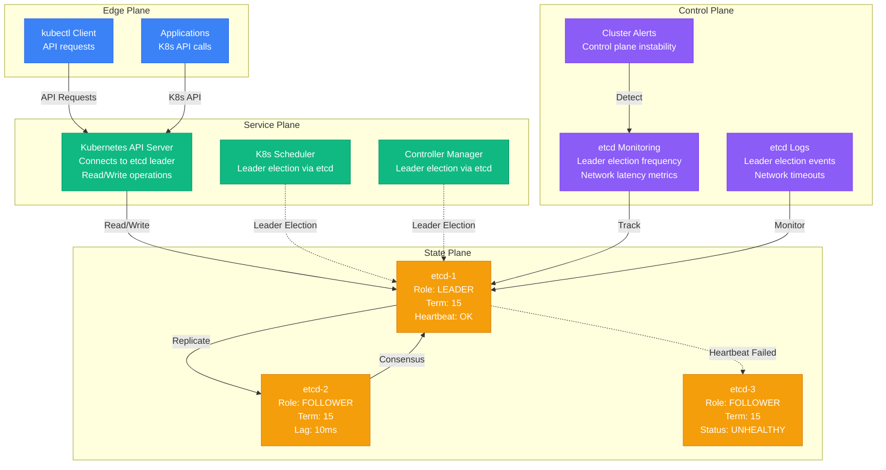

# etcd Leader Election Debugging

**Scenario**: Production etcd cluster experiencing frequent leader elections, causing Kubernetes API server instability and control plane disruptions.

**The 3 AM Reality**: Kubernetes cluster becoming unresponsive, pods failing to schedule, and cascading failures across the entire container orchestration platform.

## Symptoms Checklist

- [ ] Frequent "leader changed" messages in etcd logs
- [ ] Kubernetes API server returning 503 Service Unavailable
- [ ] kubectl commands timing out or failing
- [ ] Pod scheduling failures and resource allocation issues
- [ ] etcd cluster showing unstable member status

## etcd Leader Election Architecture



## Critical Commands & Analysis

### etcd Cluster Status
```bash
# Check cluster member status
etcdctl member list -w table

# Get leader information
etcdctl endpoint status -w table --cluster

# Check leader election statistics
etcdctl endpoint status --cluster | grep -E "(Leader|Term)"

# Monitor cluster health
etcdctl cluster-health
etcdctl endpoint health --cluster
```

### Leader Election Metrics
```bash
# Check current leader and term
ETCDCTL_API=3 etcdctl endpoint status --cluster

# Monitor leader changes over time
journalctl -u etcd -f | grep -E "(leader|election|term)"

# Check election timeout settings
etcdctl get /coreos.com/network/config | jq .election_timeout

# Analyze recent leader elections
grep "raft: [a-z0-9]* became leader" /var/log/etcd/etcd.log | tail -10
```

### Network and Performance Analysis
```bash
# Test network latency between etcd nodes
for node in etcd-1 etcd-2 etcd-3; do
    ping -c 5 $node
    nc -zv $node 2379
    nc -zv $node 2380
done

# Check etcd performance
etcdctl check perf

# Monitor disk I/O performance
iostat -x 1 5 | grep -E "(Device|etcd)"

# Check system load on etcd nodes
ssh etcd-1 "uptime && free -h && df -h"
```

### Raft State Analysis
```bash
# Check Raft state
etcdctl endpoint raft-state --cluster

# Monitor append entries
journalctl -u etcd -f | grep "raft: append entries"

# Check heartbeat status
journalctl -u etcd -f | grep "heartbeat"

# Analyze log replication lag
etcdctl endpoint status --cluster | awk '{print $1, $3, $4}'
```

## Common Root Causes & Solutions

### 1. Network Partitions and Latency (40% of cases)
```bash
# Detection: Monitor network latency between nodes
#!/bin/bash
# etcd-network-check.sh

ETCD_NODES=("etcd-1" "etcd-2" "etcd-3")

for i in "${ETCD_NODES[@]}"; do
    for j in "${ETCD_NODES[@]}"; do
        if [ "$i" != "$j" ]; then
            latency=$(ping -c 5 $j | tail -1 | awk '{print $4}' | cut -d'/' -f2)
            echo "Latency from $i to $j: ${latency}ms"

            if (( $(echo "$latency > 50" | bc -l) )); then
                echo "WARNING: High latency detected!"
            fi
        fi
    done
done

# Solution: Optimize network configuration
# 1. Increase heartbeat interval
etcd --heartbeat-interval=150 --election-timeout=1500

# 2. Configure network settings in /etc/systemd/system/etcd.service
[Service]
Environment="ETCD_HEARTBEAT_INTERVAL=150"
Environment="ETCD_ELECTION_TIMEOUT=1500"
Environment="ETCD_MAX_SNAPSHOTS=5"
Environment="ETCD_MAX_WALS=5"

# 3. Optimize kernel network parameters
echo 'net.core.rmem_max = 16777216' >> /etc/sysctl.conf
echo 'net.core.wmem_max = 16777216' >> /etc/sysctl.conf
echo 'net.ipv4.tcp_rmem = 4096 87380 16777216' >> /etc/sysctl.conf
sysctl -p
```

### 2. Resource Contention (25% of cases)
```bash
# Detection: Monitor etcd resource usage
#!/bin/bash
# etcd-resource-monitor.sh

while true; do
    echo "=== $(date) ==="

    # CPU usage
    cpu_usage=$(top -p $(pgrep etcd) -n 1 -b | tail -1 | awk '{print $9}')
    echo "etcd CPU usage: $cpu_usage%"

    # Memory usage
    mem_usage=$(ps -p $(pgrep etcd) -o rss= | awk '{print $1/1024 "MB"}')
    echo "etcd Memory usage: $mem_usage"

    # Disk I/O
    disk_io=$(iostat -x 1 2 | grep -A1 "Device" | tail -1 | awk '{print "Read: " $4 " Write: " $5}')
    echo "Disk I/O: $disk_io"

    # etcd specific metrics
    echo "etcd metrics:"
    curl -s http://localhost:2379/metrics | grep -E "(etcd_server_leader_changes|etcd_disk_wal_fsync)"

    sleep 10
done

# Solution: Resource optimization
# 1. Dedicated disks for etcd
# Mount etcd data directory on SSD
mount /dev/nvme0n1 /var/lib/etcd

# 2. CPU affinity
taskset -cp 0,1 $(pgrep etcd)

# 3. Memory limits and optimization
# In systemd service file
[Service]
MemoryMax=8G
ExecStart=/usr/bin/etcd \
  --quota-backend-bytes=6442450944 \
  --max-request-bytes=33554432

# 4. I/O scheduling
echo noop > /sys/block/nvme0n1/queue/scheduler
```

### 3. Large Data Operations (20% of cases)
```bash
# Detection: Monitor etcd database size and operations
etcdctl endpoint status --cluster | awk '{print $1, $5}'  # Show DB size

# Check for large keys
etcdctl get "" --prefix --keys-only | head -100

# Monitor large requests
journalctl -u etcd -f | grep "large request"

# Solution: Optimize data operations
# 1. Implement data cleanup
#!/bin/bash
# etcd-cleanup.sh

# Compact etcd database
current_rev=$(etcdctl endpoint status --write-out="json" | jq -r '.[] | .Status.header.revision')
etcdctl compact $current_rev

# Defragment all members
for endpoint in etcd-1:2379 etcd-2:2379 etcd-3:2379; do
    echo "Defragmenting $endpoint"
    etcdctl defrag --cluster --command-timeout=60s --endpoints=$endpoint
done

# 2. Set appropriate quotas
etcd --quota-backend-bytes=2147483648  # 2GB limit

# 3. Monitor and alert on database size
DB_SIZE=$(etcdctl endpoint status --write-out="json" | jq -r '.[] | .Status.dbSize')
if [ $DB_SIZE -gt 1073741824 ]; then  # 1GB
    echo "WARNING: etcd database size exceeds 1GB"
fi
```

### 4. Misconfigured Timeouts (10% of cases)
```bash
# Detection: Check current timeout settings
etcdctl get /etc/etcd/etcd.conf | grep -E "(heartbeat|election|timeout)"

# Solution: Proper timeout configuration
# For high-latency networks
ETCD_HEARTBEAT_INTERVAL=150      # 150ms
ETCD_ELECTION_TIMEOUT=1500       # 1500ms (10x heartbeat)

# For low-latency, high-performance networks
ETCD_HEARTBEAT_INTERVAL=100      # 100ms
ETCD_ELECTION_TIMEOUT=1000       # 1000ms

# For cloud environments with variable latency
ETCD_HEARTBEAT_INTERVAL=200      # 200ms
ETCD_ELECTION_TIMEOUT=2000       # 2000ms

# Configuration validation
if [ $ETCD_ELECTION_TIMEOUT -lt $((ETCD_HEARTBEAT_INTERVAL * 10)) ]; then
    echo "ERROR: Election timeout should be at least 10x heartbeat interval"
fi
```

### 5. Clock Skew (5% of cases)
```bash
# Detection: Check time synchronization
for node in etcd-1 etcd-2 etcd-3; do
    echo "Time on $node: $(ssh $node date)"
done

# Check NTP status
chrony sources -v
timedatectl status

# Solution: Ensure time synchronization
# Install and configure chrony
yum install -y chrony

# Configure /etc/chrony.conf
cat > /etc/chrony.conf << EOF
server 0.pool.ntp.org iburst
server 1.pool.ntp.org iburst
server 2.pool.ntp.org iburst
server 3.pool.ntp.org iburst

driftfile /var/lib/chrony/drift
makestep 1.0 3
rtcsync
EOF

systemctl enable --now chronyd

# Verify synchronization
chrony sources
chrony tracking
```

## Immediate Mitigation

### Emergency Response
```bash
# Check which node should be leader
etcdctl endpoint status --cluster | sort -k3 -n | tail -1

# Force leadership if needed (use with extreme caution)
# This should only be used in split-brain scenarios
etcdctl member promote <member-id>

# Restart etcd on problematic nodes (rolling restart)
for node in etcd-1 etcd-2 etcd-3; do
    echo "Restarting etcd on $node"
    ssh $node "systemctl restart etcd"
    sleep 30
    etcdctl endpoint health --endpoints=$node:2379
done

# Emergency cluster recovery (last resort)
# Stop all etcd instances
for node in etcd-1 etcd-2 etcd-3; do
    ssh $node "systemctl stop etcd"
done

# Start with force-new-cluster on one node
ssh etcd-1 "etcd --force-new-cluster --data-dir=/var/lib/etcd"

# Add other members back
etcdctl member add etcd-2 --peer-urls=http://etcd-2:2380
etcdctl member add etcd-3 --peer-urls=http://etcd-3:2380
```

### Quick Diagnostics
```bash
# Real-time leader election monitoring
watch -n 2 'etcdctl endpoint status --cluster | grep -E "(Leader|Term)"'

# Check for split-brain scenario
etcdctl endpoint status --cluster | awk '{leaders[$3]++} END {print "Number of leaders:", length(leaders)}'

# Monitor cluster consensus
journalctl -u etcd -f | grep -E "(leader|election|consensus|term)"
```

## Long-term Prevention

### Optimal etcd Configuration
```yaml
# etcd.yaml - Production configuration
name: etcd-1
data-dir: /var/lib/etcd
listen-peer-urls: http://0.0.0.0:2380
listen-client-urls: http://0.0.0.0:2379
advertise-client-urls: http://etcd-1:2379
initial-advertise-peer-urls: http://etcd-1:2380
initial-cluster: etcd-1=http://etcd-1:2380,etcd-2=http://etcd-2:2380,etcd-3=http://etcd-3:2380
initial-cluster-state: new
initial-cluster-token: etcd-cluster-production

# Performance settings
heartbeat-interval: 150
election-timeout: 1500
max-snapshots: 5
max-wals: 5
quota-backend-bytes: 6442450944  # 6GB

# Security
client-transport-security:
  cert-file: /etc/etcd/ssl/etcd.pem
  key-file: /etc/etcd/ssl/etcd-key.pem
  trusted-ca-file: /etc/etcd/ssl/ca.pem

peer-transport-security:
  cert-file: /etc/etcd/ssl/etcd-peer.pem
  key-file: /etc/etcd/ssl/etcd-peer-key.pem
  trusted-ca-file: /etc/etcd/ssl/ca.pem

# Logging
log-level: info
logger: zap
log-outputs: [stderr, /var/log/etcd/etcd.log]
```

### Monitoring and Alerting
```yaml
# Prometheus alerting rules
groups:
- name: etcd
  rules:
  - alert: EtcdLeaderElections
    expr: increase(etcd_server_leader_changes_seen_total[1h]) > 3
    for: 0m
    labels:
      severity: warning
    annotations:
      summary: "etcd leader elections"
      description: "etcd cluster has had {{ $value }} leader elections in the last hour"

  - alert: EtcdHighFsyncDurations
    expr: histogram_quantile(0.99, rate(etcd_disk_wal_fsync_duration_seconds_bucket[5m])) > 0.5
    for: 5m
    labels:
      severity: warning
    annotations:
      summary: "etcd high fsync durations"
      description: "etcd WAL fsync duration is {{ $value }}s"

  - alert: EtcdMemberCommunicationSlow
    expr: histogram_quantile(0.99, rate(etcd_network_peer_round_trip_time_seconds_bucket[5m])) > 0.15
    for: 5m
    labels:
      severity: warning
    annotations:
      summary: "etcd member communication is slow"
      description: "etcd member communication 99th percentile is {{ $value }}s"

  - alert: EtcdNoLeader
    expr: etcd_server_has_leader == 0
    for: 1m
    labels:
      severity: critical
    annotations:
      summary: "etcd has no leader"
      description: "etcd cluster has no leader"
```

### Health Check Script
```bash
#!/bin/bash
# etcd-health-check.sh - Comprehensive health monitoring

ETCD_ENDPOINTS="etcd-1:2379,etcd-2:2379,etcd-3:2379"
ALERT_WEBHOOK="https://hooks.slack.com/your-webhook-url"

# Function to send alerts
send_alert() {
    local message="$1"
    local severity="$2"

    curl -X POST -H 'Content-type: application/json' \
        --data "{\"text\":\"[${severity}] etcd Alert: ${message}\"}" \
        $ALERT_WEBHOOK
}

# Check cluster health
check_cluster_health() {
    local health_output
    health_output=$(etcdctl endpoint health --cluster --endpoints=$ETCD_ENDPOINTS 2>&1)

    if [ $? -ne 0 ]; then
        send_alert "Cluster health check failed: $health_output" "CRITICAL"
        return 1
    fi

    echo "Cluster health: OK"
    return 0
}

# Check leader stability
check_leader_stability() {
    local leader_count
    leader_count=$(etcdctl endpoint status --cluster --endpoints=$ETCD_ENDPOINTS | \
                   awk '{leaders[$3]++} END {print length(leaders)}')

    if [ "$leader_count" -ne 1 ]; then
        send_alert "Split brain detected: $leader_count leaders" "CRITICAL"
        return 1
    fi

    # Check for recent leader changes
    local recent_elections
    recent_elections=$(journalctl -u etcd --since "5 minutes ago" | \
                      grep -c "became leader")

    if [ "$recent_elections" -gt 0 ]; then
        send_alert "Leader election detected in last 5 minutes" "WARNING"
    fi

    echo "Leader stability: OK"
    return 0
}

# Check performance metrics
check_performance() {
    local fsync_duration
    fsync_duration=$(curl -s http://localhost:2379/metrics | \
                    grep etcd_disk_wal_fsync_duration_seconds | \
                    grep quantile | tail -1 | awk '{print $2}')

    if (( $(echo "$fsync_duration > 0.1" | bc -l) )); then
        send_alert "High WAL fsync duration: ${fsync_duration}s" "WARNING"
    fi

    echo "Performance: OK"
}

# Main health check
main() {
    echo "=== etcd Health Check $(date) ==="

    check_cluster_health || exit 1
    check_leader_stability || exit 1
    check_performance

    echo "=== Health Check Complete ==="
}

main "$@"
```

## Production Examples

### Kubernetes Control Plane Failure at Scale (2020)
- **Incident**: 5000-node Kubernetes cluster became unresponsive
- **Root Cause**: etcd leader elections every 30 seconds due to network latency
- **Impact**: Complete cluster management failure, no pod scheduling
- **Resolution**: Increased election timeout to 5 seconds, optimized network
- **Prevention**: Dedicated network for etcd traffic, proper timeout tuning

### OpenStack Control Plane Split-Brain (2019)
- **Incident**: OpenStack API became inconsistent across regions
- **Root Cause**: etcd cluster split due to data center network partition
- **Impact**: Resource allocation failures, service deployment issues
- **Resolution**: Implemented proper quorum sizing, network redundancy
- **Learning**: Always use odd number of etcd members, plan for network failures

### Container Platform Leader Election Storm (2021)
- **Incident**: etcd experiencing leader election every few seconds
- **Root Cause**: Storage I/O latency causing WAL fsync timeouts
- **Impact**: Container orchestration completely unstable
- **Resolution**: Migrated etcd to NVMe storage, tuned I/O scheduler
- **Prevention**: Dedicated high-performance storage for etcd data

## Recovery Automation

### Automated Recovery Script
```bash
#!/bin/bash
# etcd-auto-recovery.sh

ETCD_NODES=("etcd-1" "etcd-2" "etcd-3")
ETCD_DATA_DIR="/var/lib/etcd"
BACKUP_DIR="/var/backups/etcd"

# Function to create emergency backup
create_backup() {
    echo "Creating emergency backup..."
    etcdctl snapshot save "${BACKUP_DIR}/emergency-$(date +%Y%m%d-%H%M%S).db"
}

# Function to check cluster quorum
check_quorum() {
    local healthy_nodes=0

    for node in "${ETCD_NODES[@]}"; do
        if etcdctl endpoint health --endpoints="$node:2379" >/dev/null 2>&1; then
            ((healthy_nodes++))
        fi
    done

    echo $healthy_nodes
}

# Function to recover from split brain
recover_split_brain() {
    echo "Recovering from split brain scenario..."

    # Stop all etcd services
    for node in "${ETCD_NODES[@]}"; do
        ssh $node "systemctl stop etcd"
        sleep 5
    done

    # Start leader with force-new-cluster
    ssh etcd-1 "systemctl start etcd --force-new-cluster"
    sleep 10

    # Verify leader is up
    if etcdctl endpoint health --endpoints="etcd-1:2379"; then
        echo "Leader recovered successfully"

        # Re-add other members
        for node in etcd-2 etcd-3; do
            etcdctl member add $node --peer-urls="http://$node:2380"
            ssh $node "systemctl start etcd"
            sleep 15
        done
    else
        echo "Failed to recover leader"
        return 1
    fi
}

# Main recovery logic
main() {
    echo "Starting etcd recovery process..."

    # Create backup first
    create_backup

    # Check current cluster state
    local healthy_count
    healthy_count=$(check_quorum)

    echo "Healthy nodes: $healthy_count"

    if [ $healthy_count -eq 0 ]; then
        echo "No healthy nodes - attempting disaster recovery"
        recover_split_brain
    elif [ $healthy_count -eq 1 ]; then
        echo "Only one healthy node - checking for split brain"
        local leader_count
        leader_count=$(etcdctl endpoint status --cluster | \
                      awk '{leaders[$3]++} END {print length(leaders)}')

        if [ "$leader_count" -gt 1 ]; then
            echo "Split brain detected"
            recover_split_brain
        fi
    else
        echo "Cluster has quorum - checking for performance issues"
        # Run performance optimization
        etcdctl defrag --cluster
        etcdctl compact $(etcdctl endpoint status --write-out="json" | \
                         jq -r '.[] | .Status.header.revision')
    fi

    echo "Recovery process complete"
}

main "$@"
```

**Remember**: etcd is the foundation of Kubernetes and other distributed systems. Leader election issues can cascade to complete cluster failure. Always monitor etcd health closely, maintain proper network connectivity, and have tested recovery procedures ready for emergency situations.