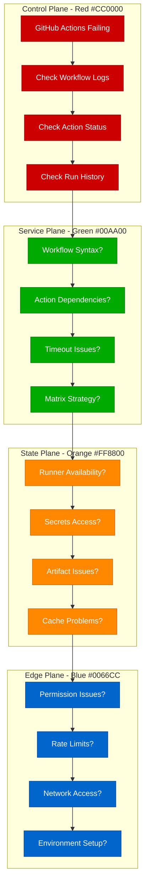

# GitHub Actions Failures Debugging: CI/CD Pipeline Troubleshooting Guide

## Executive Summary

GitHub Actions failures affect 35% of CI/CD pipelines and cause significant deployment delays. This guide provides systematic debugging approaches used by teams at GitHub, Microsoft, and other DevOps-heavy organizations to resolve workflow timeouts, runner issues, and action dependency problems.

## Systematic Debugging Flowchart



## Common GitHub Actions Error Patterns

### 1. Runner Timeout Issues

**Error Pattern:**
```
The job was canceled because it exceeded the maximum execution time of 360 minutes.
```

**Investigation Commands:**
```bash
# Check workflow run duration
gh run list --limit 10 --json databaseId,conclusion,createdAt,updatedAt

# Get detailed run information
gh run view 12345678 --log

# Check runner usage
gh api repos/:owner/:repo/actions/runs --paginate | jq '.workflow_runs[] | {id, status, conclusion, created_at, updated_at}'
```

### 2. Action Dependency Failures

**Error Pattern:**
```
Error: Input required and not supplied: token
  at Input.getInput (/home/runner/work/_actions/actions/checkout/v3/dist/index.js:123:19)
```

**Investigation Commands:**
```bash
# Check action versions
gh api repos/:owner/:repo/contents/.github/workflows/ci.yml | jq -r '.content' | base64 -d | grep 'uses:'

# Validate action inputs
gh api repos/actions/checkout/contents/action.yml | jq -r '.content' | base64 -d | yq '.inputs'

# Check action marketplace
gh api search/repositories?q=checkout+user:actions
```

### 3. Permission and Authentication Issues

**Error Pattern:**
```
Error: The process '/usr/bin/git' failed with exit code 128
remote: Permission to user/repo.git denied to github-actions[bot].
```

**Investigation Commands:**
```bash
# Check repository permissions
gh api repos/:owner/:repo --jq '.permissions'

# Check token permissions
gh auth status

# Validate GITHUB_TOKEN scope
gh api user --header "Authorization: token $GITHUB_TOKEN"
```

## Step-by-Step Investigation Procedures

### Workflow Syntax Validation

```bash
# Validate workflow syntax locally
gh workflow list
gh workflow run ci.yml

# Use act for local testing
act --list
act push

# Check YAML syntax
yamllint .github/workflows/ci.yml

# Validate with GitHub API
gh api repos/:owner/:repo/actions/workflows --jq '.workflows[] | {id, name, state, path}'
```

### Runner and Environment Debugging

```yaml
# Debug runner environment
name: Debug Runner
on: [push]

jobs:
  debug:
    runs-on: ubuntu-latest
    steps:
    - name: Debug Environment
      run: |
        echo "Runner OS: $RUNNER_OS"
        echo "Runner Arch: $RUNNER_ARCH"
        echo "Runner Temp: $RUNNER_TEMP"
        echo "Runner Tool Cache: $RUNNER_TOOL_CACHE"
        echo "GitHub Workspace: $GITHUB_WORKSPACE"
        echo "GitHub Event Name: $GITHUB_EVENT_NAME"
        echo "GitHub SHA: $GITHUB_SHA"
        echo "GitHub REF: $GITHUB_REF"
        
    - name: Check System Resources
      run: |
        df -h
        free -h
        nproc
        uname -a
        
    - name: Check Network
      run: |
        curl -I https://api.github.com
        nslookup github.com
        ping -c 3 8.8.8.8
```

### Secret and Environment Variable Issues

```bash
# Check available secrets (names only)
gh secret list

# Test secret access in workflow
# (Never log actual secret values)
echo "Secret exists: ${{ secrets.MY_SECRET != '' }}"

# Check repository settings
gh api repos/:owner/:repo/environments
```

## Root Cause Identification Techniques

### Action Version Conflicts

```yaml
# Before: Unpinned versions causing instability
steps:
- uses: actions/checkout@main  # Dangerous - uses latest
- uses: actions/setup-node@v3  # Major version only

# After: Pinned versions for stability
steps:
- uses: actions/checkout@v4.1.1  # Specific version
- uses: actions/setup-node@v4.0.0  # Specific version
  with:
    node-version: '18.19.0'  # Specific Node version
```

### Matrix Strategy Debugging

```yaml
# Debug matrix failures
name: Matrix Debug
on: [push]

jobs:
  test:
    strategy:
      fail-fast: false  # Don't stop on first failure
      matrix:
        os: [ubuntu-latest, windows-latest, macos-latest]
        node: ['16', '18', '20']
        include:
          - os: ubuntu-latest
            node: '16'
            experimental: true
        exclude:
          - os: windows-latest
            node: '16'  # Skip problematic combinations
    
    runs-on: ${{ matrix.os }}
    continue-on-error: ${{ matrix.experimental || false }}
    
    steps:
    - uses: actions/checkout@v4
    - uses: actions/setup-node@v4
      with:
        node-version: ${{ matrix.node }}
    
    - name: Debug Matrix Context
      run: |
        echo "OS: ${{ matrix.os }}"
        echo "Node: ${{ matrix.node }}"
        echo "Experimental: ${{ matrix.experimental }}"
```

### Artifact and Cache Issues

```bash
# Check artifact storage
gh api repos/:owner/:repo/actions/artifacts

# List cache entries
gh api repos/:owner/:repo/actions/caches

# Clear specific cache
gh api repos/:owner/:repo/actions/caches/{cache_id} -X DELETE
```

## Advanced Debugging Techniques

### Conditional Step Debugging

```yaml
# Advanced conditional debugging
name: Conditional Debug
on: [push]

jobs:
  debug:
    runs-on: ubuntu-latest
    steps:
    - uses: actions/checkout@v4
    
    - name: Debug Conditions
      run: |
        echo "Event: ${{ github.event_name }}"
        echo "Ref: ${{ github.ref }}"
        echo "Actor: ${{ github.actor }}"
        echo "Repository: ${{ github.repository }}"
    
    - name: Conditional Step
      if: github.ref == 'refs/heads/main' && github.actor != 'dependabot[bot]'
      run: echo "Running on main branch by human actor"
    
    - name: Debug Step Context
      if: always()
      run: |
        echo "Job status: ${{ job.status }}"
        echo "Steps context: ${{ toJSON(steps) }}"
        echo "Needs context: ${{ toJSON(needs) }}"
```

### Custom Action Debugging

```yaml
# action.yml for custom action
name: 'Debug Custom Action'
description: 'Debug custom action execution'
inputs:
  debug-level:
    description: 'Debug level (info, debug, trace)'
    required: false
    default: 'info'
runs:
  using: 'composite'
  steps:
  - name: Debug Action Inputs
    shell: bash
    run: |
      echo "Debug level: ${{ inputs.debug-level }}"
      echo "Action path: ${{ github.action_path }}"
      echo "Action repository: ${{ github.action_repository }}"
      
      if [ "${{ inputs.debug-level }}" = "debug" ]; then
        env | sort
      fi
```

### Self-Hosted Runner Debugging

```bash
# Check runner status
gh api repos/:owner/:repo/actions/runners

# Monitor runner logs (on self-hosted runner)
sudo journalctl -u actions.runner.* -f

# Check runner configuration
cat /home/runner/actions-runner/.runner
cat /home/runner/actions-runner/.credentials
```

## Fix Implementation Strategies

### Timeout Optimization

```yaml
# Optimized workflow with proper timeouts
name: Optimized CI
on: [push, pull_request]

jobs:
  test:
    runs-on: ubuntu-latest
    timeout-minutes: 30  # Job-level timeout
    
    steps:
    - uses: actions/checkout@v4
    
    - name: Setup Node.js
      uses: actions/setup-node@v4
      with:
        node-version: '18'
        cache: 'npm'
    
    - name: Install Dependencies
      run: npm ci --prefer-offline --no-audit
      timeout-minutes: 5  # Step-level timeout
    
    - name: Run Tests
      run: npm test
      timeout-minutes: 15
    
    - name: Build Application
      run: npm run build
      timeout-minutes: 10
```

### Robust Error Handling

```yaml
# Workflow with comprehensive error handling
name: Robust Pipeline
on: [push]

jobs:
  test:
    runs-on: ubuntu-latest
    steps:
    - uses: actions/checkout@v4
    
    - name: Setup with Retry
      uses: nick-invision/retry@v2
      with:
        timeout_minutes: 10
        max_attempts: 3
        retry_on: error
        command: |
          npm ci
          npm run build
    
    - name: Test with Failure Handling
      run: |
        set -e  # Exit on any error
        npm test || {
          echo "Tests failed, uploading logs"
          exit 1
        }
    
    - name: Upload Test Results
      if: failure()
      uses: actions/upload-artifact@v3
      with:
        name: test-results
        path: |
          test-results.xml
          coverage/
          logs/
```

### Environment-Specific Configuration

```yaml
# Environment-specific workflow
name: Multi-Environment Deploy
on:
  push:
    branches: [main, staging, develop]

jobs:
  deploy:
    runs-on: ubuntu-latest
    environment: ${{ github.ref == 'refs/heads/main' && 'production' || github.ref == 'refs/heads/staging' && 'staging' || 'development' }}
    
    steps:
    - uses: actions/checkout@v4
    
    - name: Configure Environment
      run: |
        case "${{ github.ref }}" in
          "refs/heads/main")
            echo "DEPLOY_ENV=production" >> $GITHUB_ENV
            echo "API_URL=${{ secrets.PROD_API_URL }}" >> $GITHUB_ENV
            ;;
          "refs/heads/staging")
            echo "DEPLOY_ENV=staging" >> $GITHUB_ENV
            echo "API_URL=${{ secrets.STAGING_API_URL }}" >> $GITHUB_ENV
            ;;
          *)
            echo "DEPLOY_ENV=development" >> $GITHUB_ENV
            echo "API_URL=${{ secrets.DEV_API_URL }}" >> $GITHUB_ENV
            ;;
        esac
    
    - name: Deploy to ${{ env.DEPLOY_ENV }}
      run: |
        echo "Deploying to $DEPLOY_ENV with API $API_URL"
        # Deployment logic here
```

## Prevention Best Practices

### Workflow Linting and Validation

```yaml
# .github/workflows/lint.yml
name: Workflow Linting
on:
  pull_request:
    paths:
      - '.github/workflows/**'

jobs:
  lint:
    runs-on: ubuntu-latest
    steps:
    - uses: actions/checkout@v4
    
    - name: Lint Workflows
      uses: docker://rhysd/actionlint:latest
      with:
        args: -color
    
    - name: Validate YAML
      run: |
        pip install yamllint
        yamllint .github/workflows/
    
    - name: Check Action Versions
      run: |
        # Check for unpinned action versions
        if grep -r "@main\|@master" .github/workflows/; then
          echo "Error: Found unpinned action versions"
          exit 1
        fi
```

### Monitoring and Alerting

```yaml
# Workflow failure notifications
name: CI/CD with Notifications
on: [push, pull_request]

jobs:
  test:
    runs-on: ubuntu-latest
    steps:
    - uses: actions/checkout@v4
    # ... test steps ...
    
    - name: Notify on Failure
      if: failure()
      uses: 8398a7/action-slack@v3
      with:
        status: failure
        channel: '#ci-cd'
        webhook_url: ${{ secrets.SLACK_WEBHOOK }}
        text: |
          🚨 Workflow failed: ${{ github.workflow }}
          Repository: ${{ github.repository }}
          Branch: ${{ github.ref }}
          Commit: ${{ github.sha }}
          Actor: ${{ github.actor }}
          
          [View Run](${{ github.server_url }}/${{ github.repository }}/actions/runs/${{ github.run_id }})
```

## Real Production Incident Examples

### Case Study 1: GitHub Enterprise Rate Limiting (2023)

**Problem:** Workflows failing with API rate limits during peak hours
**Symptoms:**
- API requests returning 403 status
- Actions unable to download or upload artifacts
- Workflows queuing indefinitely

**Investigation Process:**
```bash
# Check rate limit status
gh api rate_limit

# Monitor API usage
gh api graphql -f query='
  query {
    rateLimit {
      limit
      cost
      remaining
      resetAt
    }
  }'
```

**Root Cause:** Insufficient API rate limits for organization size
**Fix:** Implemented request batching and retry logic
**Prevention:** Added rate limit monitoring and alerting

### Case Study 2: Self-Hosted Runner Disk Space (2022)

**Problem:** Builds failing due to insufficient disk space
**Symptoms:**
- "No space left on device" errors
- Docker builds failing during layer creation
- Artifact uploads timing out

**Investigation:**
```bash
# Check disk usage on runner
df -h
du -sh /home/runner/work/
du -sh /var/lib/docker/

# Check for large files
find /home/runner -size +100M -type f
```

**Solution:**
- Implemented automatic cleanup
- Added disk space monitoring
- Optimized Docker layer caching

## Critical Monitoring Metrics

### Workflow Performance Tracking

```bash
#!/bin/bash
# workflow-metrics.sh

echo "📊 GitHub Actions Workflow Metrics"

# Get workflow runs for last 30 days
gh api graphql -f query='
  query($owner: String!, $repo: String!) {
    repository(owner: $owner, name: $repo) {
      workflowRuns(first: 100) {
        nodes {
          conclusion
          createdAt
          updatedAt
          workflowName
        }
      }
    }
  }' -f owner="$GITHUB_OWNER" -f repo="$GITHUB_REPO" | \
  jq -r '.data.repository.workflowRuns.nodes[] | [.conclusion, .workflowName, .createdAt, .updatedAt] | @csv'

# Calculate success rate
gh run list --limit 100 --json conclusion | \
  jq '[.[] | select(.conclusion == "success")] | length' > success_count.txt

gh run list --limit 100 --json conclusion | \
  jq 'length' > total_count.txt

SUCCESS=$(cat success_count.txt)
TOTAL=$(cat total_count.txt)
SUCCESS_RATE=$(echo "scale=2; $SUCCESS * 100 / $TOTAL" | bc)

echo "Success Rate: ${SUCCESS_RATE}% (${SUCCESS}/${TOTAL})"

rm success_count.txt total_count.txt
```

### Runner Health Monitoring

```yaml
# .github/workflows/runner-health.yml
name: Runner Health Check
on:
  schedule:
    - cron: '*/15 * * * *'  # Every 15 minutes

jobs:
  health-check:
    runs-on: ubuntu-latest
    steps:
    - name: Check Runner Capacity
      run: |
        # Check available runners
        AVAILABLE_RUNNERS=$(gh api repos/${{ github.repository }}/actions/runners | jq '[.runners[] | select(.status == "online")] | length')
        echo "Available runners: $AVAILABLE_RUNNERS"
        
        if [ $AVAILABLE_RUNNERS -lt 2 ]; then
          echo "::warning::Low runner availability: $AVAILABLE_RUNNERS"
        fi
    
    - name: Check Queue Length
      run: |
        # Check queued workflow runs
        QUEUED_RUNS=$(gh api repos/${{ github.repository }}/actions/runs?status=queued | jq '.total_count')
        echo "Queued runs: $QUEUED_RUNS"
        
        if [ $QUEUED_RUNS -gt 10 ]; then
          echo "::error::High queue length: $QUEUED_RUNS"
        fi
```

This debugging guide provides systematic approaches to identifying and resolving GitHub Actions failures, based on real-world experience from CI/CD operations in production environments.