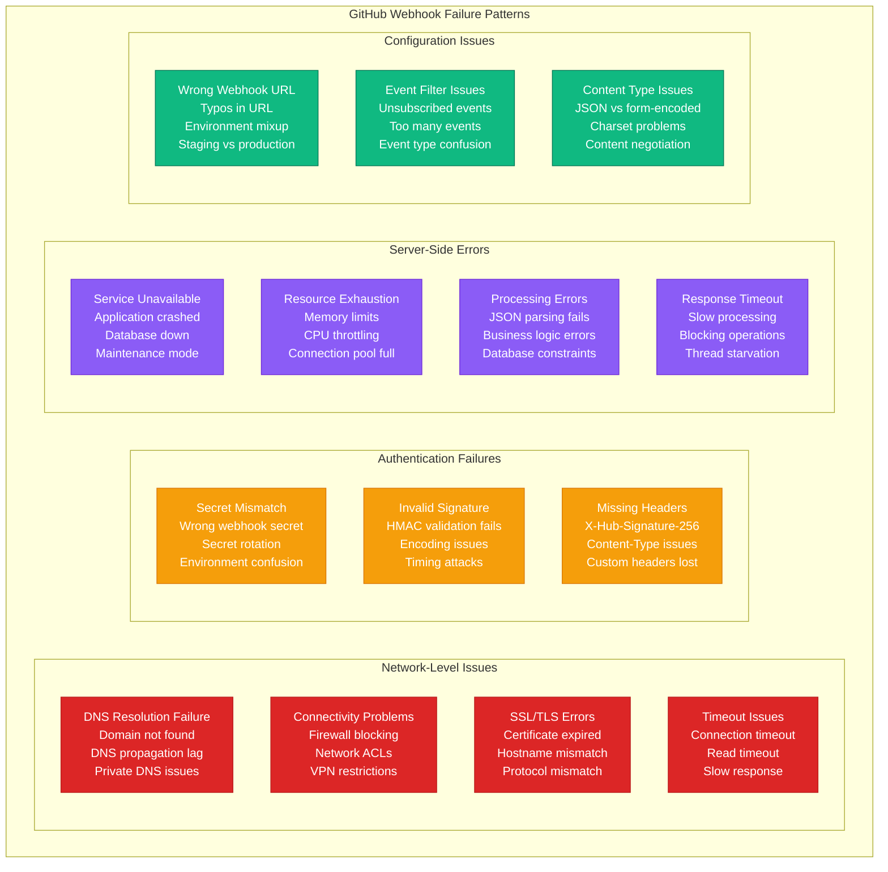
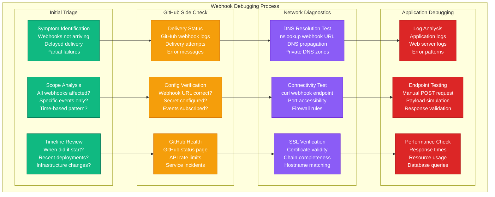

# GitHub Webhook Failures Debugging

## Overview

GitHub webhook failures disrupt CI/CD pipelines, automated deployments, and integration workflows. These failures account for 30% of DevOps automation incidents, manifesting as missed deployments, stale builds, and broken notification systems. This guide provides systematic troubleshooting for webhook delivery failures, authentication issues, and payload processing problems.

## GitHub Webhook Delivery Flow

```mermaid
graph TB
    subgraph WebhookDeliveryFlow[GitHub Webhook Delivery Flow]
        subgraph GitHubSide[GitHub Side]
            EVENT_TRIGGER[Event Trigger<br/>Push, PR, Issue<br/>Branch creation<br/>Tag creation]
            WEBHOOK_CONFIG[Webhook Configuration<br/>Payload URL<br/>Content type<br/>Secret validation]
            PAYLOAD_BUILD[Payload Construction<br/>JSON serialization<br/>Event metadata<br/>Repository context]
            SIGNATURE_GEN[Signature Generation<br/>HMAC-SHA256<br/>Secret key<br/>X-Hub-Signature-256]
        end

        subgraph DeliveryMechanism[Delivery Mechanism]
            HTTP_REQUEST[HTTP POST Request<br/>Content-Type: application/json<br/>User-Agent: GitHub-Hookshot<br/>Timeout: 10 seconds]
            SSL_HANDSHAKE[SSL/TLS Handshake<br/>Certificate validation<br/>Protocol negotiation<br/>Cipher selection]
            REQUEST_HEADERS[Request Headers<br/>X-GitHub-Event<br/>X-GitHub-Delivery<br/>X-Hub-Signature-256]
        end

        subgraph ReceiverSide[Receiver Side]
            ENDPOINT_RECEIVE[Endpoint Receives<br/>HTTP server listening<br/>Port accessibility<br/>Load balancer routing]
            SIGNATURE_VERIFY[Signature Verification<br/>HMAC validation<br/>Secret comparison<br/>Timing attack protection]
            PAYLOAD_PROCESS[Payload Processing<br/>JSON parsing<br/>Event handling<br/>Response generation]
            HTTP_RESPONSE[HTTP Response<br/>2xx: Success<br/>4xx: Client error<br/>5xx: Server error]
        end

        subgraph RetryMechanism[Retry Mechanism]
            DELIVERY_FAILURE[Delivery Failure<br/>Network timeout<br/>HTTP error<br/>Invalid response]
            RETRY_SCHEDULE[Retry Schedule<br/>Exponential backoff<br/>Max 3 attempts<br/>24-hour window]
            DEAD_LETTER[Dead Letter<br/>Permanent failure<br/>Manual inspection<br/>Re-delivery option]
        end
    end

    EVENT_TRIGGER --> WEBHOOK_CONFIG
    WEBHOOK_CONFIG --> PAYLOAD_BUILD
    PAYLOAD_BUILD --> SIGNATURE_GEN

    SIGNATURE_GEN --> HTTP_REQUEST
    HTTP_REQUEST --> SSL_HANDSHAKE
    SSL_HANDSHAKE --> REQUEST_HEADERS

    REQUEST_HEADERS --> ENDPOINT_RECEIVE
    ENDPOINT_RECEIVE --> SIGNATURE_VERIFY
    SIGNATURE_VERIFY --> PAYLOAD_PROCESS
    PAYLOAD_PROCESS --> HTTP_RESPONSE

    HTTP_RESPONSE --> DELIVERY_FAILURE
    DELIVERY_FAILURE --> RETRY_SCHEDULE
    RETRY_SCHEDULE --> DEAD_LETTER

    classDef githubStyle fill:#10B981,stroke:#047857,color:#fff
    classDef deliveryStyle fill:#F59E0B,stroke:#D97706,color:#fff
    classDef receiverStyle fill:#8B5CF6,stroke:#6D28D9,color:#fff
    classDef retryStyle fill:#DC2626,stroke:#B91C1C,color:#fff

    class EVENT_TRIGGER,WEBHOOK_CONFIG,PAYLOAD_BUILD,SIGNATURE_GEN githubStyle
    class HTTP_REQUEST,SSL_HANDSHAKE,REQUEST_HEADERS deliveryStyle
    class ENDPOINT_RECEIVE,SIGNATURE_VERIFY,PAYLOAD_PROCESS,HTTP_RESPONSE receiverStyle
    class DELIVERY_FAILURE,RETRY_SCHEDULE,DEAD_LETTER retryStyle
```



## Common Webhook Failure Patterns



## Systematic Debugging Process



## 3 AM Debugging Commands

### GitHub Webhook Status Check
```bash
# Check GitHub webhook deliveries (requires GitHub CLI or API token)
gh api repos/:owner/:repo/hooks/:hook_id/deliveries

# Get specific delivery details
gh api repos/:owner/:repo/hooks/:hook_id/deliveries/:delivery_id

# Check webhook configuration
gh api repos/:owner/:repo/hooks

# Alternative using curl with token
GITHUB_TOKEN="your-token"
REPO="owner/repo"
curl -H "Authorization: token $GITHUB_TOKEN" \
  "https://api.github.com/repos/$REPO/hooks"
```

### Network Connectivity Tests
```bash
# DNS resolution test
nslookup your-webhook-domain.com
dig your-webhook-domain.com

# Connectivity test
telnet your-webhook-domain.com 443
nc -zv your-webhook-domain.com 443

# HTTP connectivity test
curl -v https://your-webhook-domain.com/webhook/endpoint

# SSL certificate check
openssl s_client -connect your-webhook-domain.com:443 -servername your-webhook-domain.com

# Test with specific headers
curl -X POST https://your-webhook-domain.com/webhook/endpoint \
  -H "Content-Type: application/json" \
  -H "X-GitHub-Event: push" \
  -H "X-GitHub-Delivery: test-delivery-id" \
  -d '{"test": "payload"}'
```

### Application-Side Debugging
```bash
# Check application logs
tail -f /var/log/nginx/access.log | grep webhook
tail -f /var/log/nginx/error.log
journalctl -u your-application -f

# Check webhook endpoint status
curl -I https://your-domain.com/webhook/endpoint

# Test webhook endpoint with sample payload
curl -X POST https://your-domain.com/webhook/endpoint \
  -H "Content-Type: application/json" \
  -H "X-GitHub-Event: push" \
  -H "X-Hub-Signature-256: sha256=test-signature" \
  -d @sample-github-payload.json

# Check process and resource usage
ps aux | grep your-app
top -p $(pgrep your-app)
netstat -tulpn | grep :8080
```

### Docker/Kubernetes Debugging
```bash
# For containerized applications
docker ps | grep webhook
docker logs webhook-container --tail=100 -f

# Kubernetes debugging
kubectl get pods -l app=webhook-handler
kubectl logs -l app=webhook-handler --tail=100 -f
kubectl describe pod webhook-handler-xxx

# Check service and ingress
kubectl get svc webhook-service
kubectl describe ingress webhook-ingress
kubectl get endpoints webhook-service
```

## Common Issues and Solutions

### Issue 1: Webhook Secret Mismatch

**Symptoms:**
- GitHub shows "401 Unauthorized" errors
- Signature validation failures in logs
- Webhooks arriving but being rejected

**Debugging Steps:**
```bash
# Check current webhook secret in GitHub
gh api repos/:owner/:repo/hooks/:hook_id

# Generate test signature for verification
echo -n "test payload" | openssl dgst -sha256 -hmac "your-webhook-secret"

# Test signature verification in your application
curl -X POST https://your-domain.com/webhook/endpoint \
  -H "Content-Type: application/json" \
  -H "X-Hub-Signature-256: sha256=$(echo -n 'test payload' | openssl dgst -sha256 -hmac 'your-secret' | cut -d' ' -f2)" \
  -d "test payload"
```

**Common Causes:**
- Secret not configured in application
- Secret mismatch between GitHub and application
- Secret environment variable not loaded
- Unicode/encoding issues with secret

**Solution:**
```python
# Python webhook signature verification
import hmac
import hashlib

def verify_github_signature(payload_body, signature_header, secret):
    """Verify GitHub webhook signature"""
    if not signature_header:
        return False

    # Extract signature from header
    sha_name, signature = signature_header.split('=')
    if sha_name != 'sha256':
        return False

    # Compute expected signature
    mac = hmac.new(secret.encode(), payload_body, hashlib.sha256)
    expected_signature = mac.hexdigest()

    # Compare signatures (use constant time comparison)
    return hmac.compare_digest(expected_signature, signature)

# Usage example
if verify_github_signature(request.body, request.headers.get('X-Hub-Signature-256'), webhook_secret):
    # Process webhook
    pass
else:
    # Reject webhook
    return "Unauthorized", 401
```

### Issue 2: SSL/TLS Certificate Problems

**Symptoms:**
- GitHub cannot connect to webhook URL
- SSL handshake failures in GitHub delivery logs
- Certificate-related error messages

**Debugging Steps:**
```bash
# Check SSL certificate status
openssl s_client -connect your-domain.com:443 -servername your-domain.com

# Check certificate expiration
echo | openssl s_client -connect your-domain.com:443 2>/dev/null | openssl x509 -noout -dates

# Test with different SSL/TLS versions
curl --tlsv1.2 https://your-domain.com/webhook/endpoint
curl --tlsv1.3 https://your-domain.com/webhook/endpoint

# Check certificate chain
openssl s_client -connect your-domain.com:443 -showcerts
```

**Common Causes:**
- Expired SSL certificate
- Self-signed certificate (GitHub doesn't accept)
- Incomplete certificate chain
- Hostname mismatch
- Unsupported SSL/TLS version

**Solution:**
```bash
# Renew Let's Encrypt certificate
certbot renew --nginx

# Check nginx SSL configuration
nginx -t
systemctl reload nginx

# Update certificate chain
cat domain.crt intermediate.crt > fullchain.crt

# Restart web server
systemctl restart nginx
```

### Issue 3: Webhook Endpoint Not Responding

**Symptoms:**
- Timeout errors in GitHub delivery logs
- HTTP 5xx errors
- Application not receiving webhooks

**Debugging Steps:**
```bash
# Check if application is running
systemctl status your-application
ps aux | grep your-app

# Check port accessibility
netstat -tulpn | grep :8080
ss -tulpn | grep :8080

# Test application endpoint
curl -v http://localhost:8080/webhook/endpoint

# Check application logs
tail -f /var/log/your-app/error.log
journalctl -u your-application -f
```

**Common Causes:**
- Application crashed or not running
- Port not accessible (firewall/security groups)
- Load balancer misconfiguration
- Application overloaded
- Database connection issues

**Solution:**
```bash
# Restart application
systemctl restart your-application

# Check and fix firewall rules
ufw allow 8080
iptables -I INPUT -p tcp --dport 8080 -j ACCEPT

# Check load balancer health checks
# AWS ELB example
aws elbv2 describe-target-health --target-group-arn arn:aws:elasticloadbalancing:...

# Scale application if needed
kubectl scale deployment webhook-handler --replicas=3
```

### Issue 4: GitHub Webhook Rate Limiting

**Symptoms:**
- Some webhooks delayed or dropped
- GitHub API rate limit headers in responses
- Intermittent webhook delivery failures

**Debugging Steps:**
```bash
# Check GitHub API rate limits
curl -H "Authorization: token $GITHUB_TOKEN" \
  -I https://api.github.com/rate_limit

# Check webhook delivery frequency
gh api repos/:owner/:repo/hooks/:hook_id/deliveries | jq '.[].delivered_at' | sort

# Monitor webhook processing time
time curl -X POST https://your-domain.com/webhook/endpoint \
  -H "Content-Type: application/json" \
  -d @sample-payload.json
```

**Common Causes:**
- Too many webhooks configured
- Slow webhook processing
- GitHub API rate limiting
- Application processing bottleneck

**Solution:**
```python
# Async webhook processing
import asyncio
import aiohttp
from queue import Queue
from threading import Thread

class WebhookProcessor:
    def __init__(self):
        self.queue = Queue()
        self.worker_thread = Thread(target=self.process_webhooks)
        self.worker_thread.daemon = True
        self.worker_thread.start()

    async def handle_webhook(self, payload):
        # Quick response to GitHub
        self.queue.put(payload)
        return "OK", 200

    def process_webhooks(self):
        while True:
            payload = self.queue.get()
            try:
                # Process webhook asynchronously
                self.process_webhook_payload(payload)
            except Exception as e:
                print(f"Error processing webhook: {e}")
            finally:
                self.queue.task_done()
```

## Monitoring and Prevention

### Webhook Health Monitoring
```python
# webhook-monitor.py
import requests
import time
from datetime import datetime, timedelta

def check_webhook_health():
    """Monitor GitHub webhook deliveries"""

    # Get recent deliveries
    deliveries = get_recent_deliveries()

    # Check delivery success rate
    success_rate = calculate_success_rate(deliveries)

    # Check average response time
    avg_response_time = calculate_avg_response_time(deliveries)

    # Alert if issues detected
    if success_rate < 0.95:
        send_alert(f"Webhook success rate: {success_rate:.2%}")

    if avg_response_time > 5000:  # 5 seconds
        send_alert(f"High webhook response time: {avg_response_time}ms")

def get_recent_deliveries():
    """Get webhook deliveries from last 24 hours"""
    headers = {"Authorization": f"token {GITHUB_TOKEN}"}
    url = f"https://api.github.com/repos/{REPO}/hooks/{HOOK_ID}/deliveries"

    response = requests.get(url, headers=headers)
    deliveries = response.json()

    # Filter last 24 hours
    cutoff = datetime.now() - timedelta(hours=24)
    recent = []
    for delivery in deliveries:
        delivered_at = datetime.fromisoformat(delivery['delivered_at'].replace('Z', '+00:00'))
        if delivered_at > cutoff:
            recent.append(delivery)

    return recent

def calculate_success_rate(deliveries):
    """Calculate webhook delivery success rate"""
    if not deliveries:
        return 1.0

    successful = sum(1 for d in deliveries if d['status_code'] in range(200, 300))
    return successful / len(deliveries)

def send_alert(message):
    """Send alert to monitoring system"""
    # Slack webhook example
    slack_webhook = "https://hooks.slack.com/services/..."
    payload = {"text": f"🚨 GitHub Webhook Alert: {message}"}
    requests.post(slack_webhook, json=payload)

if __name__ == "__main__":
    check_webhook_health()
```

### Webhook Testing Script
```bash
#!/bin/bash
# webhook-test.sh - Test GitHub webhook endpoint

WEBHOOK_URL="https://your-domain.com/webhook/endpoint"
SECRET="your-webhook-secret"

# Test payload
PAYLOAD='{"ref":"refs/heads/main","repository":{"name":"test-repo"}}'

# Generate signature
SIGNATURE=$(echo -n "$PAYLOAD" | openssl dgst -sha256 -hmac "$SECRET" | cut -d' ' -f2)

# Send test webhook
RESPONSE=$(curl -s -w "%{http_code}" -X POST "$WEBHOOK_URL" \
  -H "Content-Type: application/json" \
  -H "X-GitHub-Event: push" \
  -H "X-GitHub-Delivery: test-$(date +%s)" \
  -H "X-Hub-Signature-256: sha256=$SIGNATURE" \
  -d "$PAYLOAD")

HTTP_CODE=${RESPONSE: -3}
BODY=${RESPONSE%???}

echo "HTTP Status: $HTTP_CODE"
echo "Response Body: $BODY"

if [ "$HTTP_CODE" = "200" ]; then
    echo "✅ Webhook test successful"
    exit 0
else
    echo "❌ Webhook test failed"
    exit 1
fi
```

### CI/CD Integration
```yaml
# .github/workflows/webhook-test.yml
name: Test Webhook Endpoint

on:
  push:
    branches: [main]
  schedule:
    - cron: '*/30 * * * *'  # Test every 30 minutes

jobs:
  test-webhook:
    runs-on: ubuntu-latest
    steps:
    - uses: actions/checkout@v3

    - name: Test Webhook Endpoint
      run: |
        ./scripts/webhook-test.sh
      env:
        WEBHOOK_URL: ${{ secrets.WEBHOOK_URL }}
        WEBHOOK_SECRET: ${{ secrets.WEBHOOK_SECRET }}

    - name: Notify on Failure
      if: failure()
      run: |
        curl -X POST ${{ secrets.SLACK_WEBHOOK }} \
          -H 'Content-type: application/json' \
          --data '{"text":"🚨 Webhook endpoint test failed!"}'
```

## Best Practices

### 1. Webhook Security
```python
# Secure webhook handling
@app.route('/webhook', methods=['POST'])
def handle_webhook():
    # Verify GitHub signature
    signature = request.headers.get('X-Hub-Signature-256')
    if not verify_signature(request.data, signature):
        abort(401)

    # Validate content type
    if request.content_type != 'application/json':
        abort(400)

    # Parse and validate payload
    try:
        payload = request.get_json()
        if not payload:
            abort(400)
    except Exception:
        abort(400)

    # Process asynchronously
    process_webhook_async(payload)
    return 'OK', 200
```

### 2. Error Handling and Retries
```python
# Robust webhook processing
import backoff

@backoff.on_exception(backoff.expo, requests.RequestException, max_tries=3)
def process_webhook(payload):
    """Process webhook with automatic retries"""
    try:
        # Your processing logic here
        result = handle_github_event(payload)

        # Log successful processing
        logger.info(f"Webhook processed successfully: {payload.get('delivery_id')}")

        return result

    except Exception as e:
        logger.error(f"Webhook processing failed: {e}")
        raise
```

### 3. Performance Optimization
```python
# Async webhook processing for high volume
import asyncio
import aioredis

class HighVolumeWebhookHandler:
    def __init__(self):
        self.redis = aioredis.from_url("redis://localhost")

    async def handle_webhook(self, payload):
        # Respond quickly to GitHub
        await self.enqueue_for_processing(payload)
        return "Accepted", 202

    async def enqueue_for_processing(self, payload):
        """Add to processing queue"""
        await self.redis.lpush("webhook_queue", json.dumps(payload))

    async def process_queue(self):
        """Background worker to process queue"""
        while True:
            payload_json = await self.redis.brpop("webhook_queue", timeout=1)
            if payload_json:
                payload = json.loads(payload_json[1])
                await self.process_webhook_async(payload)
```

## Quick Reference

### Essential Commands
```bash
# Check GitHub webhook status
gh api repos/:owner/:repo/hooks/:hook_id/deliveries

# Test connectivity
curl -v https://your-domain.com/webhook/endpoint

# Check SSL certificate
openssl s_client -connect your-domain.com:443

# Test with sample payload
curl -X POST https://your-domain.com/webhook \
  -H "Content-Type: application/json" \
  -H "X-GitHub-Event: push" \
  -d '{"test": "payload"}'

# Check application logs
tail -f /var/log/your-app/webhook.log
```

### Emergency Actions
1. Check GitHub webhook delivery logs
2. Verify webhook URL accessibility
3. Test SSL certificate validity
4. Check application health and logs
5. Validate webhook secret configuration
6. Test with manual payload

*Keep this guide accessible during incidents for quick webhook troubleshooting.*