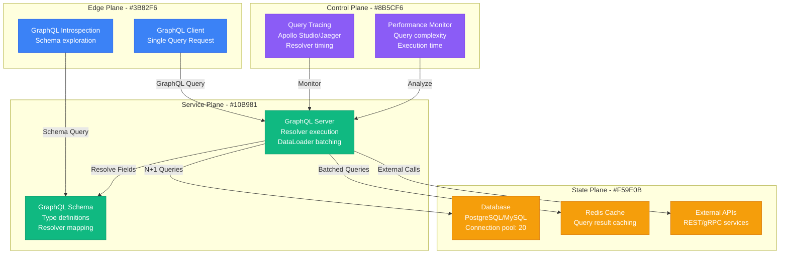

# GraphQL N+1 Query Debugging

**Scenario**: Production GraphQL API experiencing severe performance degradation due to N+1 query problems, causing database overload and slow response times.

**The 3 AM Reality**: API response times spiking to 10+ seconds, database connection pool exhaustion, and cascading failures across dependent services.

## Symptoms Checklist

- [ ] GraphQL queries taking 5+ seconds to respond
- [ ] Database showing hundreds of similar queries per request
- [ ] High database connection usage during GraphQL operations
- [ ] Memory usage spikes on GraphQL server
- [ ] Performance degradation proportional to result set size

## GraphQL N+1 Query Architecture



## Critical Analysis & Commands

### GraphQL Query Analysis
```javascript
// Example N+1 query that causes problems
const problematicQuery = `
  query GetUsers {
    users {
      id
      name
      posts {        # This will cause N+1 queries
        id
        title
        author {     # This will cause another N+1
          name
        }
      }
    }
  }
`;

// Analyze query complexity
function analyzeQueryComplexity(query, schema) {
  const complexity = getQueryComplexity({
    query: parse(query),
    schema,
    maximumComplexity: 1000,
    scalarCost: 1,
    objectCost: 2,
    listFactor: 10,
    introspectionCost: 1000
  });

  console.log(`Query complexity: ${complexity}`);
  return complexity;
}
```

### Database Query Monitoring
```sql
-- Monitor duplicate queries (PostgreSQL)
SELECT
    query,
    calls,
    total_time,
    mean_time,
    rows
FROM pg_stat_statements
WHERE calls > 100  -- Queries called many times
ORDER BY calls DESC;

-- Find queries that return single rows (potential N+1)
SELECT
    query,
    calls,
    rows,
    rows/calls as avg_rows_per_call
FROM pg_stat_statements
WHERE rows/calls < 2  -- Averaging less than 2 rows per call
ORDER BY calls DESC;

-- MySQL equivalent
SHOW FULL PROCESSLIST;
SELECT * FROM performance_schema.events_statements_summary_by_digest
WHERE COUNT_STAR > 100
ORDER BY COUNT_STAR DESC;
```

## Common Root Causes & Solutions

### 1. Naive Field Resolvers (60% of cases)
```javascript
// Problem: Each user triggers a separate database call for posts
const resolvers = {
  User: {
    posts: async (user) => {
      // This runs once per user - N+1 problem!
      return await db.posts.findMany({ where: { userId: user.id } });
    }
  }
};

// Solution 1: DataLoader batching
const DataLoader = require('dataloader');

const postsByUserIdLoader = new DataLoader(async (userIds) => {
  const posts = await db.posts.findMany({
    where: { userId: { in: userIds } }
  });

  // Group posts by userId
  const postsByUserId = {};
  posts.forEach(post => {
    if (!postsByUserId[post.userId]) {
      postsByUserId[post.userId] = [];
    }
    postsByUserId[post.userId].push(post);
  });

  // Return in same order as userIds
  return userIds.map(id => postsByUserId[id] || []);
});

const optimizedResolvers = {
  User: {
    posts: async (user) => {
      return await postsByUserIdLoader.load(user.id);
    }
  }
};

// Solution 2: Field-level query optimization
const resolversWithIncludes = {
  Query: {
    users: async (parent, args, context, info) => {
      // Analyze requested fields
      const requestedFields = getRequestedFields(info);

      let include = {};
      if (requestedFields.includes('posts')) {
        include.posts = true;
        if (requestedFields.includes('posts.author')) {
          include.posts = { include: { author: true } };
        }
      }

      return await db.users.findMany({ include });
    }
  }
};
```

### 2. Deep Nested Queries (25% of cases)
```javascript
// Problem: Deep nesting causes exponential queries
const deepQuery = `
  query {
    users {
      posts {
        comments {
          user {
            posts {
              comments {
                user {
                  name
                }
              }
            }
          }
        }
      }
    }
  }
`;

// Solution: Query depth limiting
const depthLimit = require('graphql-depth-limit');

const server = new ApolloServer({
  typeDefs,
  resolvers,
  validationRules: [depthLimit(5)], // Limit to 5 levels deep
  formatError: (error) => {
    if (error.message.includes('exceeds maximum depth')) {
      return new Error('Query too complex. Please reduce nesting depth.');
    }
    return error;
  }
});

// Alternative: Cost analysis
const costAnalysis = require('graphql-cost-analysis');

const server = new ApolloServer({
  typeDefs,
  resolvers,
  validationRules: [
    costAnalysis({
      maximumCost: 1000,
      defaultCost: 1,
      scalarCost: 1,
      objectCost: 2,
      listFactor: 10
    })
  ]
});
```

### 3. Missing Query Optimization (10% of cases)
```javascript
// Problem: Not using efficient query strategies
class NaiveUserService {
  async getUsers() {
    const users = await db.users.findMany();

    // N+1: One query per user for posts
    for (const user of users) {
      user.posts = await db.posts.findMany({
        where: { userId: user.id }
      });
    }

    return users;
  }
}

// Solution: Batch loading with proper joins
class OptimizedUserService {
  async getUsers() {
    // Single query with join
    return await db.users.findMany({
      include: {
        posts: {
          include: {
            author: true,
            comments: {
              include: {
                user: true
              }
            }
          }
        }
      }
    });
  }

  // Alternative: Separate optimized queries
  async getUsersWithPosts() {
    const users = await db.users.findMany();
    const userIds = users.map(u => u.id);

    const posts = await db.posts.findMany({
      where: { userId: { in: userIds } },
      include: { author: true }
    });

    // Group posts by userId
    const postsByUser = this.groupBy(posts, 'userId');

    // Attach posts to users
    users.forEach(user => {
      user.posts = postsByUser[user.id] || [];
    });

    return users;
  }

  groupBy(array, key) {
    return array.reduce((groups, item) => {
      const value = item[key];
      groups[value] = groups[value] || [];
      groups[value].push(item);
      return groups;
    }, {});
  }
}
```

### 4. Cache Misuse (3% of cases)
```javascript
// Problem: Not leveraging caching effectively
const inefficientResolver = {
  User: {
    posts: async (user) => {
      // Always hits database
      return await db.posts.findMany({ where: { userId: user.id } });
    }
  }
};

// Solution: Multi-level caching strategy
const Redis = require('redis');
const redis = Redis.createClient();

class CachedResolver {
  constructor() {
    this.memoryCache = new Map();
    this.redis = redis;
  }

  async getPostsByUserId(userId) {
    // Level 1: Memory cache
    const memoryKey = `posts:${userId}`;
    if (this.memoryCache.has(memoryKey)) {
      return this.memoryCache.get(memoryKey);
    }

    // Level 2: Redis cache
    const redisKey = `posts:${userId}`;
    const cached = await this.redis.get(redisKey);
    if (cached) {
      const posts = JSON.parse(cached);
      this.memoryCache.set(memoryKey, posts);
      return posts;
    }

    // Level 3: Database
    const posts = await db.posts.findMany({
      where: { userId }
    });

    // Cache the result
    await this.redis.setex(redisKey, 300, JSON.stringify(posts)); // 5 min TTL
    this.memoryCache.set(memoryKey, posts);

    return posts;
  }
}

const cachedResolver = new CachedResolver();

const resolvers = {
  User: {
    posts: async (user) => {
      return await cachedResolver.getPostsByUserId(user.id);
    }
  }
};
```

### 5. Inefficient External API Calls (2% of cases)
```javascript
// Problem: N+1 external API calls
const problematicResolver = {
  User: {
    profile: async (user) => {
      // One API call per user
      const response = await fetch(`https://api.profiles.com/users/${user.id}`);
      return response.json();
    }
  }
};

// Solution: Batch external API calls
class ExternalAPIBatcher {
  constructor() {
    this.pendingRequests = new Map();
    this.batchDelay = 10; // 10ms batching window
  }

  async batchLoad(userIds) {
    // Make single batch API call
    const response = await fetch('https://api.profiles.com/users/batch', {
      method: 'POST',
      headers: { 'Content-Type': 'application/json' },
      body: JSON.stringify({ userIds })
    });

    const profiles = await response.json();

    // Return in same order as requested
    return userIds.map(id => profiles.find(p => p.userId === id));
  }

  load(userId) {
    return new Promise((resolve, reject) => {
      if (!this.pendingRequests.has(userId)) {
        this.pendingRequests.set(userId, []);

        // Schedule batch execution
        setTimeout(() => {
          const userIds = Array.from(this.pendingRequests.keys());
          const callbacks = Array.from(this.pendingRequests.values());
          this.pendingRequests.clear();

          this.batchLoad(userIds)
            .then(results => {
              results.forEach((result, index) => {
                callbacks[index].forEach(cb => cb.resolve(result));
              });
            })
            .catch(error => {
              callbacks.forEach(callbackList => {
                callbackList.forEach(cb => cb.reject(error));
              });
            });
        }, this.batchDelay);
      }

      this.pendingRequests.get(userId).push({ resolve, reject });
    });
  }
}

const apiBatcher = new ExternalAPIBatcher();

const optimizedResolver = {
  User: {
    profile: async (user) => {
      return await apiBatcher.load(user.id);
    }
  }
};
```

## Immediate Mitigation

### Emergency Response
```javascript
// Quick fix: Add query complexity limits
const { ApolloServer } = require('apollo-server-express');
const depthLimit = require('graphql-depth-limit');
const costAnalysis = require('graphql-cost-analysis');

const server = new ApolloServer({
  typeDefs,
  resolvers,
  validationRules: [
    depthLimit(3), // Severely limit depth
    costAnalysis({ maximumCost: 100 }) // Low complexity limit
  ],
  formatError: (error) => {
    console.error('GraphQL Error:', error);
    return error;
  }
});

// Emergency resolver with basic caching
const emergencyCache = new Map();

const emergencyResolvers = {
  User: {
    posts: async (user) => {
      const cacheKey = `user_posts_${user.id}`;

      if (emergencyCache.has(cacheKey)) {
        return emergencyCache.get(cacheKey);
      }

      const posts = await db.posts.findMany({
        where: { userId: user.id }
      });

      // Cache for 1 minute
      emergencyCache.set(cacheKey, posts);
      setTimeout(() => emergencyCache.delete(cacheKey), 60000);

      return posts;
    }
  }
};
```

### Performance Monitoring
```javascript
// Add query performance tracking
const { ApolloServer } = require('apollo-server-express');

const server = new ApolloServer({
  typeDefs,
  resolvers,
  plugins: [
    {
      requestDidStart() {
        return {
          willSendResponse(requestContext) {
            const { request, response } = requestContext;

            if (response.http.body.kind === 'complete') {
              const executionTime = Date.now() - request.startTime;

              if (executionTime > 1000) { // Log slow queries
                console.warn('Slow GraphQL Query:', {
                  query: request.query,
                  variables: request.variables,
                  executionTime
                });
              }
            }
          }
        };
      }
    }
  ]
});
```

## Production Examples

### GitHub's GraphQL API Optimization (2019)
- **Incident**: Repository query API experiencing 30+ second response times
- **Root Cause**: N+1 queries for repository collaborators and permissions
- **Impact**: GitHub API rate limits hit, third-party integrations failing
- **Resolution**: Implemented DataLoader pattern, added query complexity analysis
- **Prevention**: Added query cost analysis to prevent expensive queries

### Shopify's Product Catalog N+1 (2020)
- **Incident**: Product listing GraphQL queries taking 15+ seconds during sales
- **Root Cause**: Product variants and images loaded individually per product
- **Impact**: Admin dashboard timeouts, merchant productivity decreased
- **Resolution**: Batch loading with DataLoader, optimized database joins
- **Learning**: GraphQL field selection analysis for optimal database queries

### Facebook's News Feed GraphQL (2018)
- **Incident**: News feed queries causing database connection pool exhaustion
- **Root Cause**: Friend posts, reactions, and comments all N+1 queried
- **Impact**: News feed loading failures for millions of users
- **Resolution**: Complete resolver rewrite with batching, introduced Relay connections
- **Prevention**: Query analysis tools, automatic batching patterns

## Recovery Automation

### N+1 Detection Script
```javascript
// graphql-n1-detector.js
const { execute, parse, buildSchema } = require('graphql');

class N1Detector {
  constructor(schema, resolvers) {
    this.schema = schema;
    this.resolvers = resolvers;
    this.queryStats = new Map();
  }

  wrapResolvers() {
    const originalResolvers = { ...this.resolvers };

    Object.keys(originalResolvers).forEach(typeName => {
      Object.keys(originalResolvers[typeName]).forEach(fieldName => {
        const originalResolver = originalResolvers[typeName][fieldName];

        originalResolvers[typeName][fieldName] = async (...args) => {
          const resolverKey = `${typeName}.${fieldName}`;

          if (!this.queryStats.has(resolverKey)) {
            this.queryStats.set(resolverKey, { count: 0, totalTime: 0 });
          }

          const stats = this.queryStats.get(resolverKey);
          const startTime = Date.now();

          try {
            const result = await originalResolver(...args);

            stats.count++;
            stats.totalTime += Date.now() - startTime;

            // Detect potential N+1
            if (stats.count > 10 && stats.totalTime / stats.count > 100) {
              console.warn(`Potential N+1 detected in ${resolverKey}:`, {
                callCount: stats.count,
                avgTime: stats.totalTime / stats.count,
                totalTime: stats.totalTime
              });
            }

            return result;
          } catch (error) {
            console.error(`Resolver error in ${resolverKey}:`, error);
            throw error;
          }
        };
      });
    });

    return originalResolvers;
  }

  getStats() {
    return Array.from(this.queryStats.entries()).map(([key, stats]) => ({
      resolver: key,
      ...stats,
      avgTime: stats.totalTime / stats.count
    })).sort((a, b) => b.avgTime - a.avgTime);
  }
}

// Usage
const detector = new N1Detector(schema, resolvers);
const monitoredResolvers = detector.wrapResolvers();

// Use monitored resolvers in your GraphQL server
const server = new ApolloServer({
  typeDefs,
  resolvers: monitoredResolvers
});
```

**Remember**: GraphQL N+1 problems are among the most common performance issues in GraphQL APIs. Always use DataLoader or similar batching strategies, implement query complexity analysis, and monitor resolver performance. The flexibility of GraphQL can quickly lead to expensive queries if not properly controlled.