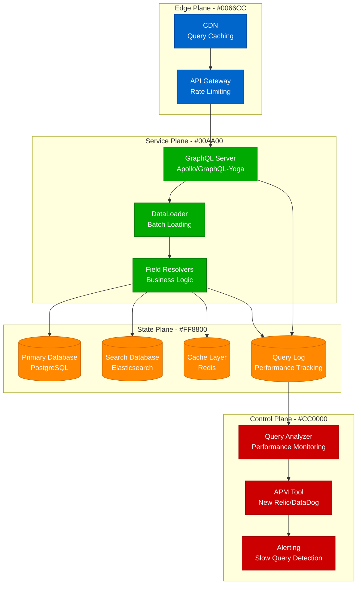

# GraphQL N+1 Queries - Identification and Resolution Guide

## Overview

Systematic approaches to identifying and resolving N+1 query problems in GraphQL APIs. Based on production experiences from GitHub's GraphQL API, Shopify's GraphQL implementation, and Netflix's federated GraphQL architecture.

## Architecture Context



## N+1 Query Detection

### Query Analysis Commands
```bash
# Monitor database queries in real-time
tail -f /var/log/postgresql/postgresql.log | grep -E "duration:|statement:"

# Use pgbadger for PostgreSQL query analysis
pgbadger /var/log/postgresql/postgresql.log -o report.html

# Check for repeated similar queries
grep "SELECT.*FROM users WHERE id" /var/log/postgresql/postgresql.log | wc -l
```

## Production Examples

### GitHub GraphQL: Repository Query Optimization
```javascript
// Before: N+1 query problem
const typeDefs = `
  type Repository {
    id: ID!
    name: String!
    owner: User!
    stargazers: [User!]!
  }

  type User {
    id: ID!
    login: String!
    repositories: [Repository!]!
  }
`;

// Problematic resolver causing N+1
const resolvers = {
  Repository: {
    // This causes N+1: one query per repository to fetch owner
    owner: async (repository) => {
      return await User.findById(repository.ownerId); // N+1 problem!
    },

    // This causes N+1: one query per repository to fetch stargazers
    stargazers: async (repository) => {
      return await User.findByRepositoryId(repository.id); // N+1 problem!
    }
  },

  User: {
    // This causes N+1: one query per user to fetch repositories
    repositories: async (user) => {
      return await Repository.findByOwnerId(user.id); // N+1 problem!
    }
  }
};

// After: Fixed with DataLoader
const DataLoader = require('dataloader');

// Create DataLoaders for batching
const userLoader = new DataLoader(async (userIds) => {
  const users = await User.findByIds(userIds);
  return userIds.map(id => users.find(user => user.id === id));
});

const repositoriesByOwnerLoader = new DataLoader(async (ownerIds) => {
  const repositories = await Repository.findByOwnerIds(ownerIds);
  return ownerIds.map(ownerId =>
    repositories.filter(repo => repo.ownerId === ownerId)
  );
});

const stargazersByRepoLoader = new DataLoader(async (repositoryIds) => {
  const stargazers = await getUsersByRepositoryIds(repositoryIds);
  return repositoryIds.map(repoId =>
    stargazers.filter(star => star.repositoryId === repoId)
  );
});

// Fixed resolvers using DataLoader
const optimizedResolvers = {
  Repository: {
    owner: async (repository, args, { dataloaders }) => {
      return await dataloaders.userLoader.load(repository.ownerId);
    },

    stargazers: async (repository, args, { dataloaders }) => {
      return await dataloaders.stargazersByRepoLoader.load(repository.id);
    }
  },

  User: {
    repositories: async (user, args, { dataloaders }) => {
      return await dataloaders.repositoriesByOwnerLoader.load(user.id);
    }
  }
};

// Context setup with DataLoaders
const server = new ApolloServer({
  typeDefs,
  resolvers: optimizedResolvers,
  context: ({ req }) => ({
    dataloaders: {
      userLoader,
      repositoriesByOwnerLoader,
      stargazersByRepoLoader
    }
  })
});
```

### Shopify GraphQL: Product Catalog N+1 Resolution
```python
# Shopify-style GraphQL resolver optimization
import asyncio
from collections import defaultdict
from dataclasses import dataclass
from typing import List, Dict, Any

@dataclass
class Product:
    id: str
    title: str
    vendor_id: str
    collection_ids: List[str]

@dataclass
class Vendor:
    id: str
    name: str

@dataclass
class Collection:
    id: str
    title: str

class ShopifyDataLoader:
    def __init__(self, db_connection):
        self.db = db_connection
        self.vendor_cache = {}
        self.collection_cache = {}

    async def load_vendors(self, vendor_ids: List[str]) -> List[Vendor]:
        """Batch load vendors to avoid N+1"""
        # Filter out already cached vendors
        uncached_ids = [id for id in vendor_ids if id not in self.vendor_cache]

        if uncached_ids:
            # Batch query for uncached vendors
            query = """
                SELECT id, name FROM vendors
                WHERE id = ANY(%s)
            """
            vendors = await self.db.fetch_all(query, [uncached_ids])

            # Cache the results
            for vendor in vendors:
                self.vendor_cache[vendor['id']] = Vendor(
                    id=vendor['id'],
                    name=vendor['name']
                )

        # Return vendors in the same order as requested
        return [self.vendor_cache.get(id) for id in vendor_ids]

    async def load_collections(self, collection_ids: List[str]) -> List[Collection]:
        """Batch load collections to avoid N+1"""
        uncached_ids = [id for id in collection_ids if id not in self.collection_cache]

        if uncached_ids:
            query = """
                SELECT id, title FROM collections
                WHERE id = ANY(%s)
            """
            collections = await self.db.fetch_all(query, [uncached_ids])

            for collection in collections:
                self.collection_cache[collection['id']] = Collection(
                    id=collection['id'],
                    title=collection['title']
                )

        return [self.collection_cache.get(id) for id in collection_ids]

class ShopifyGraphQLResolvers:
    def __init__(self, db_connection):
        self.db = db_connection

    async def resolve_products(self, info, **args) -> List[Product]:
        """Resolve products with prefetching to avoid N+1"""
        # Get products
        products = await self.db.fetch_all("""
            SELECT p.id, p.title, p.vendor_id,
                   array_agg(pc.collection_id) as collection_ids
            FROM products p
            LEFT JOIN product_collections pc ON p.id = pc.product_id
            GROUP BY p.id, p.title, p.vendor_id
            LIMIT %s
        """, [args.get('first', 50)])

        # Create Product objects
        product_objects = []
        for product in products:
            product_objects.append(Product(
                id=product['id'],
                title=product['title'],
                vendor_id=product['vendor_id'],
                collection_ids=product['collection_ids'] or []
            ))

        # Prefetch related data to avoid N+1 in field resolvers
        await self.prefetch_related_data(info, product_objects)

        return product_objects

    async def prefetch_related_data(self, info, products: List[Product]):
        """Prefetch related data based on GraphQL query selection"""
        requested_fields = self.get_requested_fields(info)

        # Get DataLoader from context
        data_loader = info.context['data_loader']

        # Prefetch vendors if requested
        if 'vendor' in requested_fields:
            vendor_ids = list(set(p.vendor_id for p in products))
            await data_loader.load_vendors(vendor_ids)

        # Prefetch collections if requested
        if 'collections' in requested_fields:
            all_collection_ids = []
            for product in products:
                all_collection_ids.extend(product.collection_ids)
            unique_collection_ids = list(set(all_collection_ids))
            await data_loader.load_collections(unique_collection_ids)

    def get_requested_fields(self, info) -> set:
        """Extract requested fields from GraphQL query"""
        # Simplified field extraction - in production use graphql-core utilities
        selections = info.field_nodes[0].selection_set.selections
        return {selection.name.value for selection in selections}

    async def resolve_product_vendor(self, product: Product, info) -> Vendor:
        """Resolve vendor for a product (no N+1 due to prefetching)"""
        data_loader = info.context['data_loader']
        vendors = await data_loader.load_vendors([product.vendor_id])
        return vendors[0]

    async def resolve_product_collections(self, product: Product, info) -> List[Collection]:
        """Resolve collections for a product (no N+1 due to prefetching)"""
        if not product.collection_ids:
            return []

        data_loader = info.context['data_loader']
        collections = await data_loader.load_collections(product.collection_ids)
        return [c for c in collections if c is not None]

# GraphQL schema setup
import strawberry
from strawberry.extensions import QueryDepthLimiter

@strawberry.type
class Product:
    id: str
    title: str

    @strawberry.field
    async def vendor(self, info) -> "Vendor":
        resolver = info.context['resolvers']
        return await resolver.resolve_product_vendor(self, info)

    @strawberry.field
    async def collections(self, info) -> List["Collection"]:
        resolver = info.context['resolvers']
        return await resolver.resolve_product_collections(self, info)

@strawberry.type
class Vendor:
    id: str
    name: str

@strawberry.type
class Collection:
    id: str
    title: str

@strawberry.type
class Query:
    @strawberry.field
    async def products(self, info, first: int = 10) -> List[Product]:
        resolver = info.context['resolvers']
        return await resolver.resolve_products(info, first=first)

# Application setup with query analysis
from strawberry.extensions import Extension

class QueryAnalysisExtension(Extension):
    def on_request_start(self):
        self.start_time = time.time()
        self.query_count = 0

    def on_request_end(self):
        duration = time.time() - self.start_time
        if duration > 1.0:  # Log slow queries
            print(f"Slow GraphQL query: {duration:.2f}s, {self.query_count} DB queries")

    def on_parse(self):
        # Analyze query complexity
        pass

schema = strawberry.Schema(
    query=Query,
    extensions=[
        QueryDepthLimiter(max_depth=10),
        QueryAnalysisExtension()
    ]
)
```

### Netflix Federated GraphQL: Cross-Service N+1 Prevention
```typescript
// Netflix-style federated GraphQL with cross-service N+1 prevention
import { ApolloGateway, IntrospectAndCompose } from '@apollo/gateway';
import { ApolloServer } from 'apollo-server-express';
import DataLoader from 'dataloader';

// User service subgraph
const userServiceTypeDefs = `
  type User @key(fields: "id") {
    id: ID!
    email: String!
    profile: UserProfile
  }

  type UserProfile {
    displayName: String!
    avatarUrl: String
  }

  extend type Query {
    user(id: ID!): User
    users(ids: [ID!]!): [User]
  }
`;

// Content service subgraph
const contentServiceTypeDefs = `
  type Movie @key(fields: "id") {
    id: ID!
    title: String!
    director: User
    cast: [User!]!
    reviews: [Review!]!
  }

  type Review @key(fields: "id") {
    id: ID!
    rating: Int!
    comment: String
    author: User
  }

  extend type User @key(fields: "id") {
    id: ID! @external
    watchedMovies: [Movie!]!
    reviews: [Review!]!
  }
`;

// User service resolver with DataLoader
class UserService {
  private userLoader: DataLoader<string, User>;
  private profileLoader: DataLoader<string, UserProfile>;

  constructor(private userRepository: UserRepository) {
    this.userLoader = new DataLoader(
      async (userIds: readonly string[]) => {
        const users = await this.userRepository.findByIds([...userIds]);
        return userIds.map(id => users.find(user => user.id === id) || null);
      },
      { cache: true, maxBatchSize: 100 }
    );

    this.profileLoader = new DataLoader(
      async (userIds: readonly string[]) => {
        const profiles = await this.userRepository.findProfilesByIds([...userIds]);
        return userIds.map(id => profiles.find(profile => profile.userId === id) || null);
      }
    );
  }

  resolvers = {
    Query: {
      user: (_, { id }) => this.userLoader.load(id),
      users: (_, { ids }) => this.userLoader.loadMany(ids)
    },

    User: {
      profile: (user) => this.profileLoader.load(user.id),

      // Federation resolver
      __resolveReference: (user) => this.userLoader.load(user.id)
    }
  };
}

// Content service resolver with federation-aware DataLoader
class ContentService {
  private movieLoader: DataLoader<string, Movie>;
  private reviewsByMovieLoader: DataLoader<string, Review[]>;
  private moviesByUserLoader: DataLoader<string, Movie[]>;
  private reviewsByUserLoader: DataLoader<string, Review[]>;

  constructor(
    private movieRepository: MovieRepository,
    private reviewRepository: ReviewRepository
  ) {
    this.setupDataLoaders();
  }

  private setupDataLoaders() {
    this.movieLoader = new DataLoader(async (movieIds: readonly string[]) => {
      const movies = await this.movieRepository.findByIds([...movieIds]);
      return movieIds.map(id => movies.find(movie => movie.id === id) || null);
    });

    this.reviewsByMovieLoader = new DataLoader(async (movieIds: readonly string[]) => {
      const reviews = await this.reviewRepository.findByMovieIds([...movieIds]);
      return movieIds.map(id =>
        reviews.filter(review => review.movieId === id)
      );
    });

    this.moviesByUserLoader = new DataLoader(async (userIds: readonly string[]) => {
      const watchHistory = await this.movieRepository.findWatchedByUserIds([...userIds]);
      return userIds.map(id =>
        watchHistory.filter(movie => movie.watchedByUserId === id)
      );
    });

    this.reviewsByUserLoader = new DataLoader(async (userIds: readonly string[]) => {
      const reviews = await this.reviewRepository.findByUserIds([...userIds]);
      return userIds.map(id =>
        reviews.filter(review => review.authorId === id)
      );
    });
  }

  resolvers = {
    Movie: {
      director: (movie) => ({ __typename: 'User', id: movie.directorId }),
      cast: (movie) => movie.castIds.map(id => ({ __typename: 'User', id })),
      reviews: (movie) => this.reviewsByMovieLoader.load(movie.id)
    },

    Review: {
      author: (review) => ({ __typename: 'User', id: review.authorId })
    },

    User: {
      watchedMovies: (user) => this.moviesByUserLoader.load(user.id),
      reviews: (user) => this.reviewsByUserLoader.load(user.id),

      __resolveReference: (user) => user // User data comes from User service
    }
  };
}

// Gateway setup with query analysis
const gateway = new ApolloGateway({
  supergraphSdl: new IntrospectAndCompose({
    subgraphs: [
      { name: 'users', url: 'http://user-service:4001/graphql' },
      { name: 'content', url: 'http://content-service:4002/graphql' }
    ]
  }),

  // Query planning optimization
  buildService({ name, url }) {
    return new RemoteGraphQLDataSource({
      url,
      willSendRequest({ request, context }) {
        // Add tracing headers
        request.http.headers.set('x-trace-id', context.traceId);
        request.http.headers.set('x-user-id', context.userId);
      }
    });
  }
});

// Main server with query analysis
const server = new ApolloServer({
  gateway,
  subscriptions: false,

  context: ({ req }) => ({
    traceId: req.headers['x-trace-id'] || generateTraceId(),
    userId: req.headers['x-user-id']
  }),

  plugins: [
    {
      requestDidStart() {
        return {
          didResolveOperation(requestContext) {
            // Analyze query complexity
            const complexity = calculateQueryComplexity(requestContext.document);
            if (complexity > 1000) {
              throw new Error(`Query too complex: ${complexity}`);
            }
          },

          didEncounterErrors(requestContext) {
            // Log N+1 query warnings
            const errors = requestContext.errors || [];
            errors.forEach(error => {
              if (error.message.includes('N+1')) {
                console.warn('Potential N+1 query detected:', error);
              }
            });
          }
        };
      }
    }
  ]
});

// Query complexity calculation
function calculateQueryComplexity(document) {
  let complexity = 0;

  // Simplified complexity calculation
  // In production, use graphql-query-complexity
  visit(document, {
    Field(node) {
      complexity += 1;

      // Arrays add to complexity
      if (node.selectionSet) {
        complexity += node.selectionSet.selections.length;
      }
    }
  });

  return complexity;
}
```

## Monitoring and Detection Tools

### N+1 Query Detection Extension
```python
import time
import threading
from collections import defaultdict
from contextlib import contextmanager

class N1QueryDetector:
    def __init__(self, threshold=5):
        self.threshold = threshold
        self.query_patterns = defaultdict(list)
        self.request_context = threading.local()

    @contextmanager
    def track_request(self, request_id):
        """Track queries for a specific GraphQL request"""
        self.request_context.request_id = request_id
        self.request_context.queries = []
        self.request_context.start_time = time.time()

        try:
            yield
        finally:
            self.analyze_request_queries()

    def log_query(self, query, params=None):
        """Log a database query"""
        if not hasattr(self.request_context, 'queries'):
            return

        # Normalize query for pattern matching
        normalized = self.normalize_query(query)

        query_info = {
            'query': query,
            'normalized': normalized,
            'params': params,
            'timestamp': time.time()
        }

        self.request_context.queries.append(query_info)

    def normalize_query(self, query):
        """Normalize query for pattern detection"""
        import re

        # Remove parameter values
        normalized = re.sub(r'\$\d+', '?', query)
        # Remove specific IDs
        normalized = re.sub(r'\b\d+\b', '?', normalized)
        # Remove whitespace variations
        normalized = ' '.join(normalized.split())

        return normalized.lower()

    def analyze_request_queries(self):
        """Analyze queries for N+1 patterns"""
        if not hasattr(self.request_context, 'queries'):
            return

        queries = self.request_context.queries
        request_id = self.request_context.request_id

        # Group queries by normalized pattern
        patterns = defaultdict(list)
        for query_info in queries:
            patterns[query_info['normalized']].append(query_info)

        # Detect N+1 patterns
        for pattern, query_list in patterns.items():
            if len(query_list) >= self.threshold:
                self.report_n1_pattern(request_id, pattern, query_list)

    def report_n1_pattern(self, request_id, pattern, queries):
        """Report detected N+1 pattern"""
        print(f"N+1 Query detected in request {request_id}:")
        print(f"  Pattern: {pattern}")
        print(f"  Executed {len(queries)} times")
        print(f"  Example query: {queries[0]['query']}")

        # Log to monitoring system
        self.send_to_monitoring({
            'type': 'n1_query_detected',
            'request_id': request_id,
            'pattern': pattern,
            'count': len(queries),
            'example_query': queries[0]['query']
        })

    def send_to_monitoring(self, data):
        """Send alert to monitoring system"""
        # Implement your monitoring integration
        pass

# Usage with GraphQL
detector = N1QueryDetector(threshold=3)

def graphql_middleware(resolve, root, info, **args):
    """GraphQL middleware to detect N+1 queries"""

    # Start tracking if this is a new request
    if not hasattr(detector.request_context, 'request_id'):
        request_id = info.context.get('request_id', 'unknown')
        with detector.track_request(request_id):
            return resolve(root, info, **args)
    else:
        return resolve(root, info, **args)

# Database query interceptor
original_execute = database_connection.execute

def instrumented_execute(query, params=None):
    detector.log_query(query, params)
    return original_execute(query, params)

database_connection.execute = instrumented_execute
```

## Success Metrics

- **N+1 Query Detection Rate**: > 95% of N+1 patterns identified
- **Query Performance**: < 100ms average GraphQL response time
- **Database Query Reduction**: > 80% reduction in query count after optimization
- **Cache Hit Rate**: > 90% for DataLoader cache
- **Query Complexity**: Average complexity score < 50

## The 3 AM Test

**Scenario**: Your GraphQL API response times have degraded from 100ms to 5+ seconds. The database is showing thousands of similar SELECT queries, and users are complaining about slow page loads.

**This guide provides**:
1. **N+1 detection**: Tools to identify problematic query patterns in real-time
2. **DataLoader implementation**: Battle-tested batching strategies to eliminate N+1 queries
3. **Query optimization**: Techniques for prefetching and caching related data
4. **Performance monitoring**: Automated detection and alerting for query performance issues
5. **Federated GraphQL**: Strategies to prevent N+1 queries across service boundaries

**Expected outcome**: N+1 queries identified within 10 minutes, DataLoader batching implemented within 1 hour, GraphQL performance restored to sub-200ms response times.